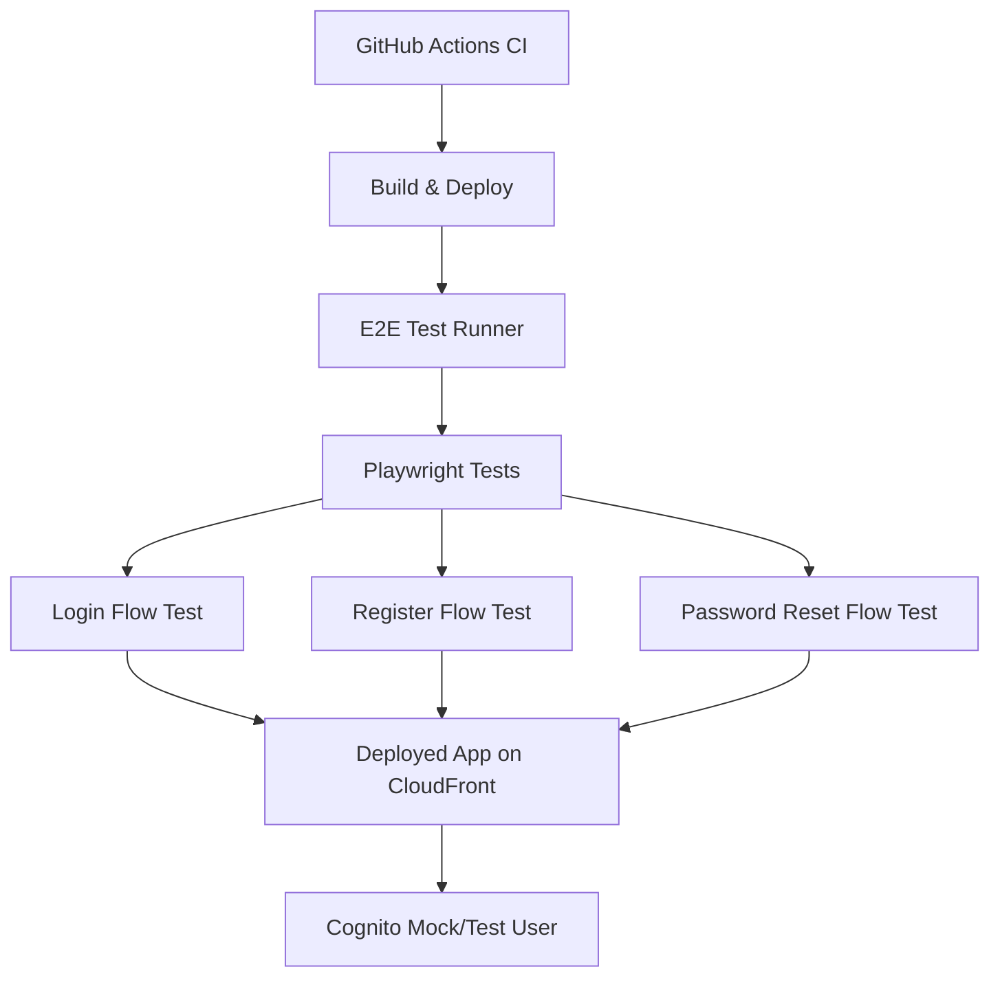
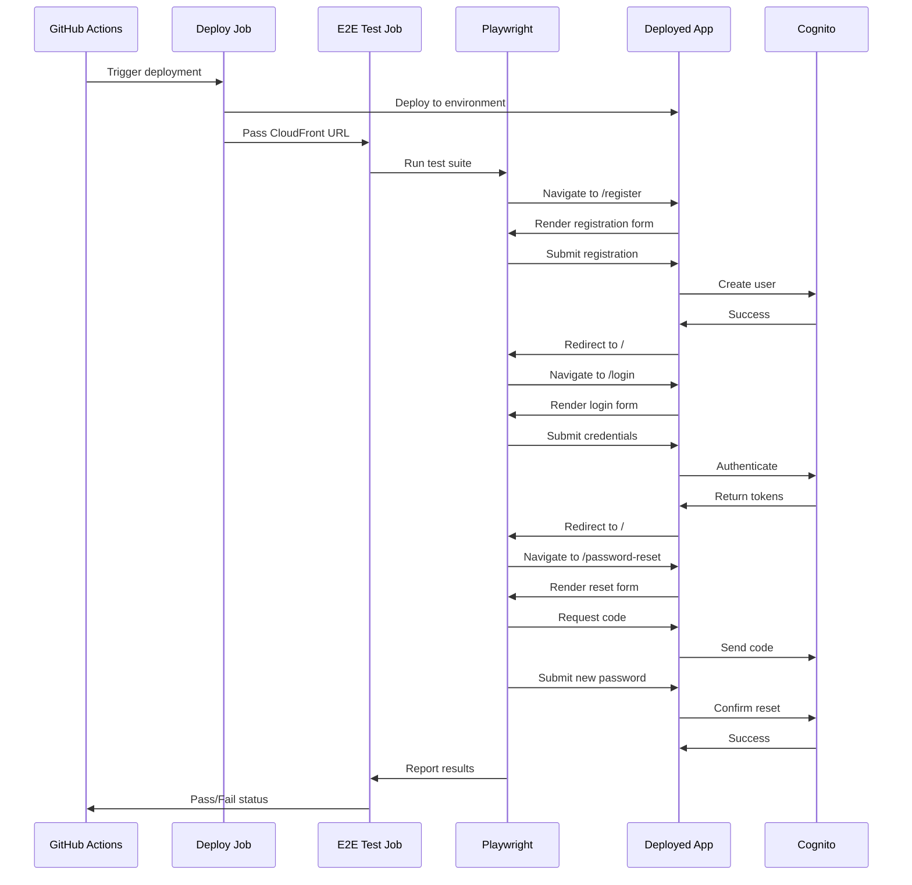

# Design Document: E2E Testing Main Flows

## Overview

認証フローの主要なハッピーパスをカバーする最小限のE2Eテストを実装する。既存のPlaywright環境を活用し、ログイン、ユーザー登録、パスワードリセットの3つの基本フローをテストする。テストはCI/CDパイプラインに統合され、デプロイ前の品質保証として機能する。

## Architecture



## Main Algorithm/Workflow



## Components and Interfaces

### Component 1: E2E Test Suite

**Purpose**: 認証フローの主要なハッピーパスを検証する

**Interface**:

```typescript
// Test suite structure
interface TestSuite {
  setup(): Promise<void>;
  teardown(): Promise<void>;
  runTests(): Promise<TestResult[]>;
}

interface TestResult {
  name: string;
  status: 'passed' | 'failed';
  duration: number;
  error?: Error;
}
```

**Responsibilities**:

- ユーザー登録フローのテスト
- ログインフローのテスト
- パスワードリセットフローのテスト
- テストデータのクリーンアップ

### Component 2: Test Helpers

**Purpose**: テストで共通利用するヘルパー関数を提供

**Interface**:

```typescript
interface TestHelpers {
  generateTestUser(): TestUser;
  cleanupTestUser(email: string): Promise<void>;
  waitForNavigation(page: Page, url: string): Promise<void>;
  fillForm(page: Page, data: FormData): Promise<void>;
}

interface TestUser {
  email: string;
  password: string;
  username: string;
}

interface FormData {
  [key: string]: string;
}
```

**Responsibilities**:

- テストユーザーデータの生成
- フォーム入力の自動化
- ナビゲーション待機
- テストデータのクリーンアップ

### Component 3: GitHub Actions E2E Job

**Purpose**: CI/CDパイプラインでE2Eテストを実行

**Interface**:

```yaml
# GitHub Actions job interface
job:
  name: string
  runs-on: string
  needs: string[]
  steps: Step[]
  env:
    BASE_URL: string
    TEST_USER_EMAIL: string
    TEST_USER_PASSWORD: string
```

**Responsibilities**:

- デプロイ後のE2Eテスト実行
- Playwright環境のセットアップ
- テスト結果のレポート
- 失敗時のアーティファクト保存

## Data Models

### Model 1: TestUser

```typescript
interface TestUser {
  email: string; // テストユーザーのメールアドレス
  password: string; // テストユーザーのパスワード
  username: string; // テストユーザーの表示名
  confirmationCode?: string; // パスワードリセット用の確認コード
}
```

**Validation Rules**:

- email: 有効なメールアドレス形式
- password: 8文字以上、大文字・小文字・数字を含む
- username: 3文字以上

### Model 2: TestConfig

```typescript
interface TestConfig {
  baseURL: string; // テスト対象のアプリケーションURL
  timeout: number; // テストタイムアウト（ミリ秒）
  retries: number; // リトライ回数
  headless: boolean; // ヘッドレスモード
  slowMo: number; // スローモーション（デバッグ用）
}
```

**Validation Rules**:

- baseURL: 有効なURL形式
- timeout: 正の整数
- retries: 0以上の整数

## Key Functions with Formal Specifications

### Function 1: testUserRegistration()

```typescript
async function testUserRegistration(page: Page, user: TestUser): Promise<void>;
```

**Preconditions:**

- `page` is a valid Playwright Page instance
- `user` contains valid email, password, and username
- Application is accessible at baseURL
- User does not already exist in Cognito

**Postconditions:**

- User is successfully registered in Cognito
- User is redirected to home page (/)
- Access token is stored in localStorage
- No error messages are displayed

**Loop Invariants:** N/A

### Function 2: testUserLogin()

```typescript
async function testUserLogin(
  page: Page,
  credentials: { email: string; password: string }
): Promise<void>;
```

**Preconditions:**

- `page` is a valid Playwright Page instance
- `credentials` contains valid email and password
- User exists in Cognito with confirmed status
- Application is accessible at baseURL

**Postconditions:**

- User is successfully authenticated
- User is redirected to home page (/)
- Access token and refresh token are stored in localStorage
- User session is active

**Loop Invariants:** N/A

### Function 3: testPasswordReset()

```typescript
async function testPasswordReset(page: Page, email: string, newPassword: string): Promise<void>;
```

**Preconditions:**

- `page` is a valid Playwright Page instance
- `email` is a valid registered user email
- `newPassword` meets password requirements
- User exists in Cognito

**Postconditions:**

- Password reset code is sent to user email
- New password is successfully set
- User can login with new password
- Old password no longer works

**Loop Invariants:** N/A

### Function 4: generateTestUser()

```typescript
function generateTestUser(): TestUser;
```

**Preconditions:**

- None (pure function)

**Postconditions:**

- Returns TestUser object with unique email
- Email format: `test-{timestamp}@example.com`
- Password meets all security requirements
- Username is non-empty string

**Loop Invariants:** N/A

## Algorithmic Pseudocode

### Main Test Execution Algorithm

```typescript
// Main E2E test execution flow
async function runE2ETests(config: TestConfig): Promise<TestResult[]> {
  const browser = await chromium.launch({ headless: config.headless });
  const context = await browser.newContext({ baseURL: config.baseURL });
  const page = await context.newPage();
  const results: TestResult[] = [];

  try {
    // Test 1: User Registration
    const testUser = generateTestUser();
    await testUserRegistration(page, testUser);
    results.push({ name: 'User Registration', status: 'passed', duration: 0 });

    // Test 2: User Login
    await page.goto('/login');
    await testUserLogin(page, { email: testUser.email, password: testUser.password });
    results.push({ name: 'User Login', status: 'passed', duration: 0 });

    // Test 3: Password Reset
    const newPassword = generateSecurePassword();
    await testPasswordReset(page, testUser.email, newPassword);
    results.push({ name: 'Password Reset', status: 'passed', duration: 0 });

    // Cleanup
    await cleanupTestUser(testUser.email);
  } catch (error) {
    results.push({ name: 'E2E Tests', status: 'failed', duration: 0, error });
  } finally {
    await browser.close();
  }

  return results;
}
```

**Preconditions:**

- config contains valid test configuration
- Application is deployed and accessible
- Cognito is configured and accessible

**Postconditions:**

- All tests are executed
- Test results are collected
- Browser resources are cleaned up
- Test users are removed from Cognito

**Loop Invariants:**

- Browser context remains valid throughout test execution
- Each test is independent and does not affect others

### User Registration Test Algorithm

```typescript
async function testUserRegistration(page: Page, user: TestUser): Promise<void> {
  // Navigate to registration page
  await page.goto('/register');
  await expect(page.locator('h1')).toContainText('アカウント作成');

  // Fill registration form
  await page.fill('input[name="username"]', user.username);
  await page.fill('input[name="email"]', user.email);
  await page.fill('input[name="password"]', user.password);
  await page.fill('input[name="confirmPassword"]', user.password);

  // Submit form
  await page.click('button[type="submit"]');

  // Wait for redirect to home page
  await page.waitForURL('/');

  // Verify authentication state
  const token = await page.evaluate(() => localStorage.getItem('accessToken'));
  if (!token) {
    throw new Error('Access token not found after registration');
  }

  // Verify no error messages
  const errorMessage = page.locator('[role="alert"]');
  await expect(errorMessage).not.toBeVisible();
}
```

**Preconditions:**

- page is navigated to /register
- user contains valid registration data
- User does not exist in Cognito

**Postconditions:**

- User is registered in Cognito
- User is redirected to home page
- Access token is stored in localStorage
- No error messages are displayed

**Loop Invariants:** N/A

### User Login Test Algorithm

```typescript
async function testUserLogin(
  page: Page,
  credentials: { email: string; password: string }
): Promise<void> {
  // Navigate to login page
  await page.goto('/login');
  await expect(page.locator('h1')).toContainText('ログイン');

  // Fill login form
  await page.fill('input[name="email"]', credentials.email);
  await page.fill('input[name="password"]', credentials.password);

  // Submit form
  await page.click('button[type="submit"]');

  // Wait for redirect to home page
  await page.waitForURL('/');

  // Verify authentication state
  const token = await page.evaluate(() => localStorage.getItem('accessToken'));
  if (!token) {
    throw new Error('Access token not found after login');
  }

  // Verify refresh token
  const refreshToken = await page.evaluate(() => localStorage.getItem('refreshToken'));
  if (!refreshToken) {
    throw new Error('Refresh token not found after login');
  }
}
```

**Preconditions:**

- page is navigated to /login
- credentials contain valid email and password
- User exists in Cognito with confirmed status

**Postconditions:**

- User is authenticated
- User is redirected to home page
- Access token and refresh token are stored
- User session is active

**Loop Invariants:** N/A

### Password Reset Test Algorithm

```typescript
async function testPasswordReset(page: Page, email: string, newPassword: string): Promise<void> {
  // Step 1: Request reset code
  await page.goto('/password-reset');
  await expect(page.locator('h1')).toContainText('パスワードリセット');

  await page.fill('input[name="email"]', email);
  await page.click('button[type="submit"]');

  // Wait for confirmation step
  await expect(page.locator('input[name="code"]')).toBeVisible();

  // Step 2: Get confirmation code (mock or from test email)
  const code = await getTestConfirmationCode(email);

  // Step 3: Submit new password
  await page.fill('input[name="code"]', code);
  await page.fill('input[name="newPassword"]', newPassword);
  await page.fill('input[name="confirmPassword"]', newPassword);
  await page.click('button[type="submit"]');

  // Wait for success message or redirect
  await expect(page.locator('text=パスワードをリセットしました')).toBeVisible();

  // Step 4: Verify login with new password
  await page.goto('/login');
  await page.fill('input[name="email"]', email);
  await page.fill('input[name="password"]', newPassword);
  await page.click('button[type="submit"]');
  await page.waitForURL('/');
}
```

**Preconditions:**

- page is valid Playwright Page instance
- email is registered user email
- newPassword meets password requirements

**Postconditions:**

- Password reset code is sent
- New password is set successfully
- User can login with new password
- Old password no longer works

**Loop Invariants:** N/A

## Example Usage

```typescript
// Example 1: Running E2E tests locally
import { test, expect } from '@playwright/test';

test.describe('Authentication Flows', () => {
  test('user can register, login, and reset password', async ({ page }) => {
    // Generate test user
    const testUser = {
      email: `test-${Date.now()}@example.com`,
      password: 'TestPass123!',
      username: 'testuser'
    };

    // Test registration
    await page.goto('/register');
    await page.fill('input[name="username"]', testUser.username);
    await page.fill('input[name="email"]', testUser.email);
    await page.fill('input[name="password"]', testUser.password);
    await page.fill('input[name="confirmPassword"]', testUser.password);
    await page.click('button[type="submit"]');
    await page.waitForURL('/');

    // Verify token stored
    const token = await page.evaluate(() => localStorage.getItem('accessToken'));
    expect(token).toBeTruthy();
  });
});

// Example 2: Using test helpers
import { generateTestUser, cleanupTestUser } from './helpers';

test('user registration with helper', async ({ page }) => {
  const user = generateTestUser();

  await page.goto('/register');
  await page.fill('input[name="username"]', user.username);
  await page.fill('input[name="email"]', user.email);
  await page.fill('input[name="password"]', user.password);
  await page.fill('input[name="confirmPassword"]', user.password);
  await page.click('button[type="submit"]');

  await page.waitForURL('/');

  // Cleanup
  await cleanupTestUser(user.email);
});

// Example 3: CI/CD integration
// In GitHub Actions workflow
steps:
  - name: Run E2E tests
    run: pnpm test:e2e
    env:
      BASE_URL: ${{ needs.deploy.outputs.cloudfront-url }}
      CI: true
```

## Correctness Properties

_A property is a characteristic or behavior that should hold true across all valid executions of a system-essentially, a formal statement about what the system should do. Properties serve as the bridge between human-readable specifications and machine-verifiable correctness guarantees._

### Property 1: User Registration Creates Cognito User

_For any_ valid test user data, when the registration form is submitted, the user should be successfully created in Cognito.

**Validates: Requirements 1.4**

### Property 2: Successful Registration Redirects to Home

_For any_ successful user registration, the application should redirect to the home page "/".

**Validates: Requirements 1.5**

### Property 3: Registration Stores Access Token

_For any_ successful user registration, an access token should be stored in localStorage.

**Validates: Requirements 1.6**

### Property 4: Successful Registration Shows No Errors

_For any_ successful user registration, no error messages should be displayed on the page.

**Validates: Requirements 1.7**

### Property 5: User Login Authenticates with Cognito

_For any_ valid user credentials, when the login form is submitted, the user should be successfully authenticated with Cognito.

**Validates: Requirements 2.4**

### Property 6: Successful Login Redirects to Home

_For any_ successful user login, the application should redirect to the home page "/".

**Validates: Requirements 2.5**

### Property 7: Login Stores Authentication Tokens

_For any_ successful user login, both an access token and a refresh token should be stored in localStorage.

**Validates: Requirements 2.6, 2.7**

### Property 8: Password Reset Sends Confirmation Code

_For any_ valid registered user email, when a password reset is requested, Cognito should send a confirmation code.

**Validates: Requirements 3.3**

### Property 9: Confirmation Code Shows Input Field

_For any_ password reset flow where a confirmation code is sent, the code input field should become visible.

**Validates: Requirements 3.4**

### Property 10: Valid Code Updates Password

_For any_ valid confirmation code and new password, when submitted, Cognito should successfully update the user's password.

**Validates: Requirements 3.5**

### Property 11: Successful Reset Shows Success Message

_For any_ successful password reset, a success message should be displayed to the user.

**Validates: Requirements 3.6**

### Property 12: New Password Enables Login

_For any_ password reset, the user should be able to login with the new password.

**Validates: Requirements 3.7**

### Property 13: Old Password Becomes Invalid

_For any_ password reset, the old password should no longer work for authentication.

**Validates: Requirements 3.8**

### Property 14: Generated Test Users Have Unique Emails

_For any_ test user generated by the Test_Helper, the email address should be unique using a timestamp.

**Validates: Requirements 4.1**

### Property 15: Generated Passwords Meet Security Requirements

_For any_ test user generated by the Test_Helper, the password should meet all security requirements (8+ characters, uppercase, lowercase, numbers).

**Validates: Requirements 4.2**

### Property 16: Generated Usernames Are Non-Empty

_For any_ test user generated by the Test_Helper, the username should be a non-empty string.

**Validates: Requirements 4.3**

### Property 17: Test Cleanup Removes Users

_For any_ completed E2E test, the test user should be removed from Cognito.

**Validates: Requirements 4.4, 8.2, 10.2**

### Property 18: Cleanup Failures Are Logged

_For any_ test user cleanup failure, the error should be logged and execution should continue.

**Validates: Requirements 4.5**

### Property 19: Test Failures Fail the Build

_For any_ E2E test failure, the CI pipeline should mark the build as failed.

**Validates: Requirements 5.4**

### Property 20: Test Failures Save Artifacts

_For any_ E2E test failure, screenshots and error logs should be saved as artifacts.

**Validates: Requirements 5.5, 7.4, 7.5**

### Property 21: All Tests Passing Succeeds Build

_For any_ E2E test run where all tests pass, the CI pipeline should mark the build as successful.

**Validates: Requirements 5.6**

### Property 22: Config Validation Rejects Invalid URLs

_For any_ Test_Config with an invalid base URL, the validation should fail.

**Validates: Requirements 6.1**

### Property 23: Config Validation Requires Positive Timeout

_For any_ Test_Config with a non-positive timeout value, the validation should fail.

**Validates: Requirements 6.2**

### Property 24: Config Validation Requires Non-Negative Retries

_For any_ Test_Config with a negative retries value, the validation should fail.

**Validates: Requirements 6.3**

### Property 25: Retry Count Controls Test Retries

_For any_ Test_Config with a specified retry count, failed tests should be retried up to that count.

**Validates: Requirements 6.6**

### Property 26: Network Failures Fail Tests

_For any_ test where the deployed app is unreachable, the test should fail with a network error message.

**Validates: Requirements 7.1**

### Property 27: Cognito Unavailability Skips Tests

_For any_ test where Cognito service is unavailable, the test should be skipped with a warning.

**Validates: Requirements 7.2**

### Property 28: Existing Users Are Deleted and Retried

_For any_ test where the test user already exists in Cognito, the existing user should be deleted and the test retried.

**Validates: Requirements 7.3**

### Property 29: Each Test Uses Unique User

_For any_ sequence of multiple tests, each test should use a unique test user.

**Validates: Requirements 8.1**

### Property 30: Failed Tests Don't Affect Subsequent Tests

_For any_ test failure, subsequent tests should execute normally without being affected.

**Validates: Requirements 8.3**

### Property 31: Parallel Tests Have No Resource Conflicts

_For any_ parallel test execution, no resource conflicts should occur between tests.

**Validates: Requirements 8.4**

### Property 32: Tests Complete Within Time Limit

_For any_ E2E test execution, the test should complete within 30 seconds.

**Validates: Requirements 9.1**

### Property 33: Browser Closes After Test Completion

_For any_ completed test, the browser should be immediately closed to free resources.

**Validates: Requirements 9.4**

### Property 34: Screenshots Don't Contain Passwords

_For any_ screenshot saved by the test runner, passwords should not be visible in the image.

**Validates: Requirements 10.3**

### Property 35: Error Logs Don't Contain Passwords

_For any_ error log message, passwords should not be included in the log text.

**Validates: Requirements 10.4**

## Error Handling

### Error Scenario 1: Network Failure

**Condition**: アプリケーションへの接続が失敗した場合
**Response**: テストを失敗とマークし、詳細なエラーメッセージを出力
**Recovery**: CI環境では自動的に2回までリトライ

### Error Scenario 2: Cognito Service Unavailable

**Condition**: Cognitoサービスが利用できない場合
**Response**: テストをスキップし、警告を出力
**Recovery**: 次回のCI実行で再試行

### Error Scenario 3: Test User Already Exists

**Condition**: テストユーザーが既にCognitoに存在する場合
**Response**: 既存ユーザーを削除してから再実行
**Recovery**: cleanupTestUser()を実行後、テストを再試行

### Error Scenario 4: Timeout

**Condition**: ページ読み込みやナビゲーションがタイムアウトした場合
**Response**: スクリーンショットを保存し、テストを失敗とマーク
**Recovery**: タイムアウト値を増やして再実行

### Error Scenario 5: Assertion Failure

**Condition**: 期待される要素が見つからない、または期待値と異なる場合
**Response**: 詳細なエラーメッセージとスクリーンショットを保存
**Recovery**: テストコードまたはアプリケーションコードを修正

## Testing Strategy

### Unit Testing Approach

E2Eテスト自体のユニットテストは実施しない。代わりに、テストヘルパー関数の単純な動作確認のみ実施。

### Property-Based Testing Approach

E2Eテストでは実施しない。ユニットテストレベルで実施済み。

**Property Test Library**: N/A

### Integration Testing Approach

E2Eテストが統合テストの役割を果たす。以下の統合ポイントをテスト:

1. **Frontend ↔ Backend API**: 認証APIエンドポイントとの通信
2. **Backend API ↔ Cognito**: Cognitoサービスとの統合
3. **Frontend ↔ LocalStorage**: トークンの保存と取得
4. **Page Navigation**: Next.jsのルーティング

**Test Coverage Goals**:

- 主要な認証フロー: 100%
- エラーハンドリング: 主要なエラーケースのみ
- エッジケース: 対象外（ユニットテストでカバー）

## Performance Considerations

- **Parallel Execution**: CI環境では1ワーカー、ローカルでは並列実行
- **Test Duration**: 各テストは30秒以内に完了すること
- **Resource Cleanup**: テスト終了後は必ずブラウザとテストユーザーをクリーンアップ
- **Retry Strategy**: CI環境では失敗時に2回までリトライ
- **Headless Mode**: CI環境ではヘッドレスモードで実行し、リソース消費を削減

## Security Considerations

- **Test Credentials**: テスト用の認証情報はGitHub Secretsで管理
- **Test User Cleanup**: テスト終了後は必ずテストユーザーを削除
- **Environment Isolation**: 本番環境ではE2Eテストを実行しない
- **Sensitive Data**: スクリーンショットやログにパスワードが含まれないよう注意
- **API Keys**: Cognito APIキーは環境変数で管理し、コードにハードコードしない

## Dependencies

- **@playwright/test**: ^1.58.2 (既存)
- **AWS SDK**: Cognitoテストユーザーのクリーンアップ用（必要に応じて）
- **GitHub Actions**: CI/CD統合
- **CloudFront**: デプロイされたアプリケーション
- **Amazon Cognito**: 認証サービス
