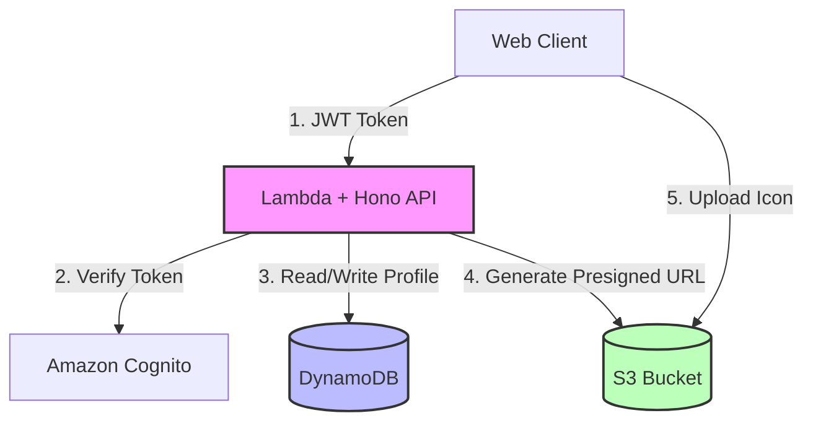
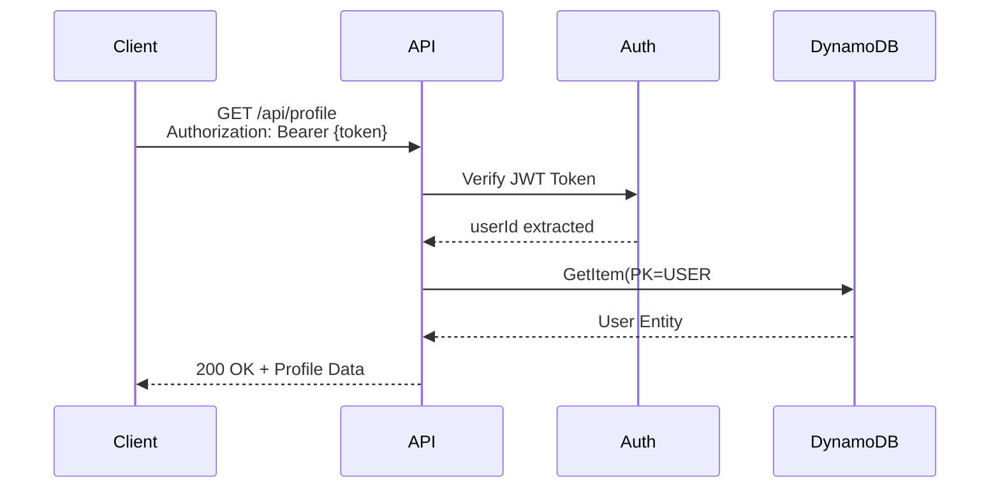
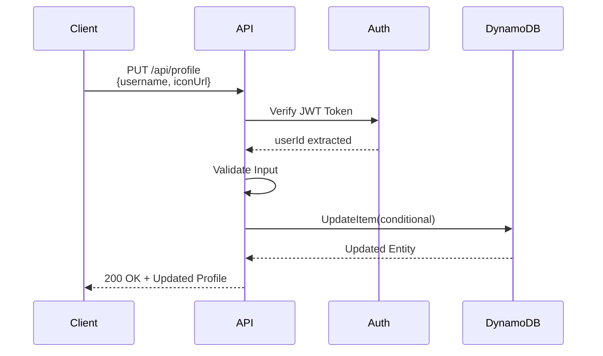
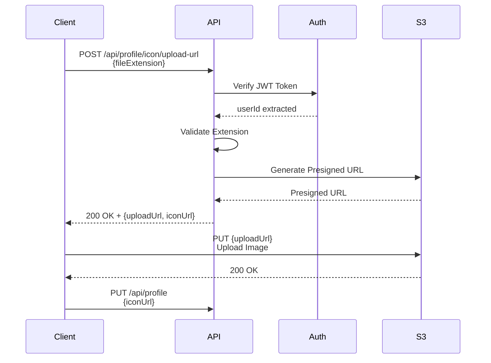

# Design Document: Profile API

## Overview

このドキュメントは、投票対局アプリケーションにおけるプロフィール関連APIの設計を定義します。ユーザーは自分のプロフィール情報（ユーザー名、アイコン画像）を取得・更新できます。

### 主要機能

- **GET /api/profile**: ユーザープロフィール情報の取得
- **PUT /api/profile**: ユーザープロフィール情報の更新（username、iconUrl）
- **POST /api/profile/icon/upload-url**: アイコン画像アップロード用のPresigned URL生成

### 技術スタック

- **API Framework**: Hono (AWS Lambda上で実行)
- **Database**: Amazon DynamoDB (Single Table Design)
- **Authentication**: Amazon Cognito (JWT Token)
- **Storage**: Amazon S3 (アイコン画像保存)
- **Validation**: Zod

## Architecture

### システムアーキテクチャ図



### リクエストフロー

#### プロフィール取得フロー



#### プロフィール更新フロー



#### アイコンアップロードフロー



## Components and Interfaces

### API Endpoints

#### 1. GET /api/profile

ユーザーのプロフィール情報を取得します。

**Request**

```http
GET /api/profile HTTP/1.1
Host: api.vote-board-game.example.com
Authorization: Bearer {accessToken}
```

**Response (200 OK)**

```json
{
  "userId": "123e4567-e89b-12d3-a456-426614174000",
  "email": "user@example.com",
  "username": "player1",
  "iconUrl": "https://cdn.example.com/icons/123e4567.png",
  "createdAt": "2025-02-19T10:00:00Z",
  "updatedAt": "2025-02-19T15:30:00Z"
}
```

**Error Responses**

- `401 Unauthorized`: JWT Tokenが無効または期限切れ
- `404 Not Found`: ユーザーが存在しない
- `500 Internal Server Error`: サーバーエラー

#### 2. PUT /api/profile

ユーザーのプロフィール情報を更新します。

**Request**

```http
PUT /api/profile HTTP/1.1
Host: api.vote-board-game.example.com
Authorization: Bearer {accessToken}
Content-Type: application/json

{
  "username": "newUsername",
  "iconUrl": "https://cdn.example.com/icons/new-icon.png"
}
```

**Request Body Schema**

- `username` (optional): 1〜50文字のユーザー名
- `iconUrl` (optional): HTTPS URLのアイコン画像URL

少なくとも1つのフィールドが必要です。

**Response (200 OK)**

```json
{
  "userId": "123e4567-e89b-12d3-a456-426614174000",
  "email": "user@example.com",
  "username": "newUsername",
  "iconUrl": "https://cdn.example.com/icons/new-icon.png",
  "createdAt": "2025-02-19T10:00:00Z",
  "updatedAt": "2025-02-20T12:00:00Z"
}
```

**Error Responses**

- `400 Validation Error`: バリデーションエラー
- `401 Unauthorized`: JWT Tokenが無効または期限切れ
- `403 Forbidden`: 他のユーザーのプロフィールを更新しようとした
- `404 Not Found`: ユーザーが存在しない
- `500 Internal Server Error`: サーバーエラー

#### 3. POST /api/profile/icon/upload-url

アイコン画像アップロード用のPresigned URLを生成します。

**Request**

```http
POST /api/profile/icon/upload-url HTTP/1.1
Host: api.vote-board-game.example.com
Authorization: Bearer {accessToken}
Content-Type: application/json

{
  "fileExtension": "png"
}
```

**Request Body Schema**

- `fileExtension` (required): ファイル拡張子（png, jpg, jpeg, gif）

**Response (200 OK)**

```json
{
  "uploadUrl": "https://s3.amazonaws.com/bucket/icons/123e4567/1708345200000.png?X-Amz-Algorithm=...",
  "iconUrl": "https://cdn.example.com/icons/123e4567/1708345200000.png",
  "expiresIn": 300
}
```

**Error Responses**

- `400 Validation Error`: サポートされていないファイル形式
- `401 Unauthorized`: JWT Tokenが無効または期限切れ
- `500 Internal Server Error`: サーバーエラー

### Validation Schemas (Zod)

```typescript
// GET /api/profile - バリデーション不要（クエリパラメータなし）

// PUT /api/profile
const updateProfileSchema = z
  .object({
    username: z.string().min(1).max(50).optional(),
    iconUrl: z.string().url().startsWith('https://').optional(),
  })
  .refine((data) => data.username !== undefined || data.iconUrl !== undefined, {
    message: 'At least one field must be provided',
  });

// POST /api/profile/icon/upload-url
const uploadUrlRequestSchema = z.object({
  fileExtension: z.enum(['png', 'jpg', 'jpeg', 'gif']),
});
```

### Error Response Format

すべてのエラーレスポンスは以下の形式に従います：

```typescript
interface ErrorResponse {
  error: string; // エラーコード（例: VALIDATION_ERROR, UNAUTHORIZED）
  message: string; // 人間が読めるエラーメッセージ
  details?: {
    // オプション：詳細情報
    fields?: Record<string, string>; // フィールドレベルのエラー
    [key: string]: unknown;
  };
  retryAfter?: number; // レート制限の場合の再試行までの秒数
}
```

## Data Models

### DynamoDB User Entity

```typescript
interface UserEntity {
  PK: string; // "USER#{userId}"
  SK: string; // "USER#{userId}"
  userId: string; // UUID
  email: string; // メールアドレス
  username: string; // ユーザー名（1〜50文字）
  iconUrl?: string; // アイコン画像URL（オプション）
  createdAt: string; // ISO 8601形式
  updatedAt: string; // ISO 8601形式
  entityType: 'USER'; // エンティティタイプ
}
```

### DynamoDB Operations

#### プロフィール取得

```typescript
const command = new GetCommand({
  TableName: TABLE_NAME,
  Key: {
    PK: `USER#${userId}`,
    SK: `USER#${userId}`,
  },
});
```

#### プロフィール更新

```typescript
const command = new UpdateCommand({
  TableName: TABLE_NAME,
  Key: {
    PK: `USER#${userId}`,
    SK: `USER#${userId}`,
  },
  UpdateExpression: 'SET #username = :username, #updatedAt = :updatedAt',
  ExpressionAttributeNames: {
    '#username': 'username',
    '#updatedAt': 'updatedAt',
  },
  ExpressionAttributeValues: {
    ':username': newUsername,
    ':updatedAt': new Date().toISOString(),
  },
  ConditionExpression: 'attribute_exists(PK)',
  ReturnValues: 'ALL_NEW',
});
```

### S3 Object Key Structure

アイコン画像は以下のキー構造でS3に保存されます：

```
icons/{userId}/{timestamp}.{extension}
```

例：

```
icons/123e4567-e89b-12d3-a456-426614174000/1708345200000.png
```

### S3 Presigned URL Generation

```typescript
import { S3Client, PutObjectCommand } from '@aws-sdk/client-s3';
import { getSignedUrl } from '@aws-sdk/s3-request-presigner';

const s3Client = new S3Client({ region: 'ap-northeast-1' });

const key = `icons/${userId}/${Date.now()}.${fileExtension}`;
const contentType = getContentType(fileExtension);

const command = new PutObjectCommand({
  Bucket: process.env.ICON_BUCKET_NAME,
  Key: key,
  ContentType: contentType,
  ContentLength: 5 * 1024 * 1024, // 5MB制限
});

const uploadUrl = await getSignedUrl(s3Client, command, {
  expiresIn: 300, // 5分
});

const iconUrl = `https://${process.env.CDN_DOMAIN}/${key}`;
```

### Content-Type Mapping

```typescript
function getContentType(extension: string): string {
  const contentTypes: Record<string, string> = {
    png: 'image/png',
    jpg: 'image/jpeg',
    jpeg: 'image/jpeg',
    gif: 'image/gif',
  };
  return contentTypes[extension] || 'application/octet-stream';
}
```

## Correctness Properties

_A property is a characteristic or behavior that should hold true across all valid executions of a system—essentially, a formal statement about what the system should do. Properties serve as the bridge between human-readable specifications and machine-verifiable correctness guarantees._

### Property Reflection

After analyzing all acceptance criteria, I identified the following redundancies:

- **Authentication properties (1.2, 1.3, 2.5, 3.8, 6.1)**: All test that missing/invalid JWT tokens return 401. These can be combined into a single comprehensive property.
- **Authorization properties (2.6, 4.4, 6.3)**: All test that users can only access their own profile. These can be combined.
- **Error response structure (5.1, 5.3)**: Both test error response format. Can be combined into one property that validates all error responses have the correct structure.

The following properties provide unique validation value and will be implemented:

### Property 1: Profile Retrieval Returns Complete Data

_For any_ valid JWT token and existing user, when retrieving the profile, the response SHALL include all required fields: userId, email, username, iconUrl (if set), createdAt, and updatedAt.

**Validates: Requirements 1.1**

### Property 2: Authentication Required for All Operations

_For any_ profile API endpoint (GET /api/profile, PUT /api/profile, POST /api/profile/icon/upload-url), when the JWT token is missing, invalid, malformed, or expired, the API SHALL return a 401 Unauthorized error.

**Validates: Requirements 1.2, 1.3, 2.5, 3.8, 6.1**

### Property 3: Profile Update Reflects Changes

_For any_ valid update request with username and/or iconUrl, when the profile is updated, the response SHALL contain the updated values and the updatedAt timestamp SHALL be more recent than the previous value.

**Validates: Requirements 2.1, 2.7**

### Property 4: Username Length Validation

_For any_ username string, the API SHALL accept usernames between 1 and 50 characters (inclusive) and reject usernames with length 0 or greater than 50 with a 400 Validation Error.

**Validates: Requirements 2.2**

### Property 5: IconUrl HTTPS Validation

_For any_ iconUrl string, the API SHALL accept only valid URLs that start with "https://" and reject all other formats with a 400 Validation Error.

**Validates: Requirements 2.3**

### Property 6: Username Character Validation

_For any_ username containing invalid characters, the API SHALL return a 400 Validation Error with field-level details indicating which characters are invalid.

**Validates: Requirements 2.4**

### Property 7: Authorization Enforcement

_For any_ user with a valid JWT token, when attempting to access or update a profile, the API SHALL only allow operations on the profile matching the userId in the JWT token and return 403 Forbidden for any other userId.

**Validates: Requirements 2.6, 4.4, 6.3**

### Property 8: File Extension Validation

_For any_ file extension string, the API SHALL accept only ['png', 'jpg', 'jpeg', 'gif'] and reject all other extensions with a 400 Validation Error listing the supported formats.

**Validates: Requirements 3.2, 3.3**

### Property 9: Presigned URL Generation Completeness

_For any_ valid file extension, when generating a presigned URL, the response SHALL include both uploadUrl and iconUrl fields, and the iconUrl SHALL follow the pattern `icons/{userId}/{timestamp}.{extension}`.

**Validates: Requirements 3.1, 3.4, 3.7**

### Property 10: Content-Type Mapping

_For any_ supported file extension (png, jpg, jpeg, gif), the generated presigned URL SHALL include the correct Content-Type header: image/png for png, image/jpeg for jpg/jpeg, and image/gif for gif.

**Validates: Requirements 3.6**

### Property 11: Update Atomicity

_For any_ profile update operation that encounters an error (validation failure, database error, etc.), no partial changes SHALL be persisted to DynamoDB, ensuring the profile remains in its original state.

**Validates: Requirements 4.1**

### Property 12: Error Response Structure

_For any_ error condition (validation error, authentication error, authorization error, server error), the API SHALL return a response with the structure: { error: string, message: string, details?: object }, and validation errors SHALL include field-level details in the details.fields object.

**Validates: Requirements 5.1, 5.3**

### Property 13: Database Error Handling

_For any_ DynamoDB operation failure, the API SHALL return a 500 Internal Server Error without exposing internal error details such as table names, connection strings, or stack traces.

**Validates: Requirements 5.4, 5.5**

### Property 14: Presigned URL Key Restriction

_For any_ generated presigned URL, the URL SHALL only grant PUT permissions to the specific object key `icons/{userId}/{timestamp}.{extension}` and not allow access to any other S3 objects.

**Validates: Requirements 6.5**

### Property 15: CORS Headers Present

_For any_ API response (success or error), the response SHALL include appropriate CORS headers (Access-Control-Allow-Origin, Access-Control-Allow-Methods, Access-Control-Allow-Headers) to enable cross-origin requests from authorized domains.

**Validates: Requirements 6.6**

## Error Handling

### Error Categories

#### 1. Authentication Errors (401)

- Missing Authorization header
- Invalid Bearer token format
- Malformed JWT token
- Expired JWT token
- Invalid JWT signature
- Token from wrong issuer

**Response Format:**

```json
{
  "error": "UNAUTHORIZED",
  "message": "Invalid or expired token"
}
```

#### 2. Authorization Errors (403)

- Attempting to access another user's profile
- Attempting to update another user's profile

**Response Format:**

```json
{
  "error": "FORBIDDEN",
  "message": "You do not have permission to access this resource"
}
```

#### 3. Validation Errors (400)

- Username too short or too long
- Username contains invalid characters
- IconUrl is not a valid HTTPS URL
- File extension not supported
- No fields provided in update request
- Invalid request body format

**Response Format:**

```json
{
  "error": "VALIDATION_ERROR",
  "message": "Validation failed",
  "details": {
    "fields": {
      "username": "Username must be between 1 and 50 characters",
      "iconUrl": "IconUrl must be a valid HTTPS URL"
    }
  }
}
```

#### 4. Not Found Errors (404)

- User does not exist in database

**Response Format:**

```json
{
  "error": "NOT_FOUND",
  "message": "User not found"
}
```

#### 5. Server Errors (500)

- DynamoDB operation failure
- S3 presigned URL generation failure
- Unexpected internal errors

**Response Format:**

```json
{
  "error": "INTERNAL_ERROR",
  "message": "An internal error occurred"
}
```

### Error Handling Strategy

1. **Input Validation**: Validate all inputs using Zod schemas before processing
2. **Authentication**: Verify JWT token using auth middleware before route handlers
3. **Authorization**: Check userId from JWT matches the requested resource
4. **Database Errors**: Catch DynamoDB errors and return generic 500 responses
5. **Logging**: Log all errors with context (userId, endpoint, error details) to CloudWatch
6. **Security**: Never expose internal details (table names, stack traces) in error responses

### Logging Strategy

All API requests and errors will be logged to CloudWatch with the following structure:

```typescript
// Success log
console.log('Profile operation successful', {
  operation: 'GET_PROFILE' | 'UPDATE_PROFILE' | 'GENERATE_UPLOAD_URL',
  userId: string,
  endpoint: string,
  method: string,
  timestamp: string, // ISO 8601
});

// Error log
console.error('Profile operation failed', {
  operation: string,
  userId: string | undefined,
  endpoint: string,
  method: string,
  error: string,
  errorCode: string | undefined,
  timestamp: string, // ISO 8601
});
```

## Testing Strategy

### Dual Testing Approach

このAPIは、ユニットテストとプロパティベーステストの両方を使用して包括的にテストします。

#### ユニットテスト

ユニットテストは、特定の例、エッジケース、エラー条件を検証します：

- **特定の例**:
  - 有効なプロフィール取得リクエスト
  - 有効なプロフィール更新リクエスト（usernameのみ、iconUrlのみ、両方）
  - 有効なPresigned URL生成リクエスト（各ファイル拡張子）
  - ユーザーが存在しない場合の404エラー
  - 他のユーザーのプロフィールにアクセスしようとした場合の403エラー
  - 更新フィールドが提供されない場合の400エラー
  - Presigned URLの有効期限が5分であることの確認
  - ファイルサイズ制限が5MBであることの確認

- **統合ポイント**:
  - 認証ミドルウェアとルートハンドラーの統合
  - DynamoDBリポジトリとルートハンドラーの統合
  - S3クライアントとPresigned URL生成の統合

- **エッジケース**:
  - 空のAuthorizationヘッダー
  - "Bearer "プレフィックスのないトークン
  - 不正な形式のJSONリクエストボディ

#### プロパティベーステスト

プロパティベーステストは、すべての入力にわたって普遍的なプロパティを検証します：

- **fast-check**ライブラリを使用
- 各テストは最低100回のイテレーションを実行
- 各プロパティテストは、設計ドキュメントのプロパティを参照するコメントタグを含む

**タグ形式**: `// Feature: profile-api, Property {number}: {property_text}`

**プロパティテストの例**:

```typescript
import { describe, it, expect } from 'vitest';
import * as fc from 'fast-check';

describe('Profile API Property Tests', () => {
  // Feature: profile-api, Property 4: Username Length Validation
  it('should accept usernames between 1 and 50 characters', () => {
    fc.assert(
      fc.property(fc.string({ minLength: 1, maxLength: 50 }), async (username) => {
        const response = await updateProfile({ username });
        expect(response.status).not.toBe(400);
      }),
      { numRuns: 100 }
    );
  });

  // Feature: profile-api, Property 4: Username Length Validation
  it('should reject usernames with length 0 or > 50', () => {
    fc.assert(
      fc.property(
        fc.oneof(fc.constant(''), fc.string({ minLength: 51, maxLength: 100 })),
        async (username) => {
          const response = await updateProfile({ username });
          expect(response.status).toBe(400);
          expect(response.body.error).toBe('VALIDATION_ERROR');
        }
      ),
      { numRuns: 100 }
    );
  });

  // Feature: profile-api, Property 5: IconUrl HTTPS Validation
  it('should accept only HTTPS URLs for iconUrl', () => {
    fc.assert(
      fc.property(fc.webUrl({ validSchemes: ['https'] }), async (iconUrl) => {
        const response = await updateProfile({ iconUrl });
        expect(response.status).not.toBe(400);
      }),
      { numRuns: 100 }
    );
  });

  // Feature: profile-api, Property 8: File Extension Validation
  it('should accept only supported file extensions', () => {
    fc.assert(
      fc.property(fc.constantFrom('png', 'jpg', 'jpeg', 'gif'), async (fileExtension) => {
        const response = await generateUploadUrl({ fileExtension });
        expect(response.status).toBe(200);
        expect(response.body).toHaveProperty('uploadUrl');
        expect(response.body).toHaveProperty('iconUrl');
      }),
      { numRuns: 100 }
    );
  });

  // Feature: profile-api, Property 10: Content-Type Mapping
  it('should map file extensions to correct Content-Type', () => {
    const contentTypeMap = {
      png: 'image/png',
      jpg: 'image/jpeg',
      jpeg: 'image/jpeg',
      gif: 'image/gif',
    };

    fc.assert(
      fc.property(fc.constantFrom(...Object.keys(contentTypeMap)), async (fileExtension) => {
        const response = await generateUploadUrl({ fileExtension });
        const uploadUrl = new URL(response.body.uploadUrl);
        const contentType = uploadUrl.searchParams.get('Content-Type');
        expect(contentType).toBe(contentTypeMap[fileExtension]);
      }),
      { numRuns: 100 }
    );
  });
});
```

### テスト環境

- **DynamoDB**: ローカルDynamoDB（DynamoDB Local）またはモックを使用
- **S3**: AWS SDK v3のモックを使用
- **Cognito**: JWT検証のモックを使用
- **CI/CD**: GitHub Actionsでテストを自動実行

### テストカバレッジ目標

- ライン カバレッジ: 80%以上
- ブランチ カバレッジ: 75%以上
- 関数 カバレッジ: 90%以上

## Implementation Notes

### Repository Pattern

プロフィール操作用の`ProfileRepository`クラスを作成します：

```typescript
export class ProfileRepository extends BaseRepository {
  async getById(userId: string): Promise<UserEntity | null> {
    // GetCommand implementation
  }

  async update(
    userId: string,
    updates: { username?: string; iconUrl?: string }
  ): Promise<UserEntity> {
    // UpdateCommand with conditional expression
  }
}
```

### S3 Service

Presigned URL生成用の`S3Service`クラスを作成します：

```typescript
export class S3Service {
  async generateUploadUrl(
    userId: string,
    fileExtension: string
  ): Promise<{ uploadUrl: string; iconUrl: string; expiresIn: number }> {
    // Generate presigned URL with PutObjectCommand
  }
}
```

### Route Structure

```typescript
import { Hono } from 'hono';
import { createAuthMiddleware } from '../lib/auth/auth-middleware.js';

const profileRouter = new Hono();
const authMiddleware = createAuthMiddleware({
  userPoolId: process.env.COGNITO_USER_POOL_ID!,
  region: process.env.AWS_REGION!,
});

// All routes require authentication
profileRouter.use('/*', authMiddleware);

profileRouter.get('/', getProfileHandler);
profileRouter.put('/', updateProfileHandler);
profileRouter.post('/icon/upload-url', generateUploadUrlHandler);

export { profileRouter };
```

### Environment Variables

```bash
# Cognito
COGNITO_USER_POOL_ID=ap-northeast-1_xxxxxxxxx
AWS_REGION=ap-northeast-1

# DynamoDB
TABLE_NAME=VoteBoardGame

# S3
ICON_BUCKET_NAME=vbg-prod-s3-icons
CDN_DOMAIN=cdn.vote-board-game.example.com
```

### Security Considerations

1. **JWT Verification**: すべてのリクエストでJWTトークンを検証
2. **Authorization**: userIdの一致を確認
3. **Input Validation**: Zodスキーマですべての入力を検証
4. **CORS**: 許可されたドメインからのリクエストのみ受け入れ
5. **Rate Limiting**: 将来的にレート制限を実装（既存のRateLimiterクラスを使用）
6. **S3 Permissions**: Presigned URLは特定のオブジェクトキーのみにアクセス可能
7. **File Size**: 5MBの最大ファイルサイズ制限
8. **Content-Type**: アップロード時に正しいContent-Typeを強制

### Performance Considerations

1. **DynamoDB**: GetItemとUpdateItemを使用して低レイテンシを確保
2. **Connection Pooling**: DynamoDBクライアントを再利用
3. **Presigned URL**: S3への直接アップロードでAPIサーバーの負荷を軽減
4. **Stateless**: Lambda関数はステートレスで水平スケーリング可能
5. **Cold Start**: 最小限の依存関係でコールドスタートを最適化

## Deployment Considerations

### CDK Stack Updates

`packages/infra`に以下のリソースを追加：

1. **S3 Bucket**: アイコン画像用
   - バケット名: `vbg-{env}-s3-icons`
   - 暗号化: 有効
   - パブリックアクセス: ブロック
   - CORS設定: フロントエンドドメインからのPUTリクエストを許可

2. **CloudFront Distribution**: S3バケット用
   - オリジン: S3バケット
   - キャッシュポリシー: 画像用に最適化
   - カスタムドメイン: `cdn.vote-board-game.example.com`

3. **Lambda Function**: プロフィールAPI用
   - 環境変数: ICON_BUCKET_NAME, CDN_DOMAIN
   - IAM権限: S3 PutObject, DynamoDB GetItem/UpdateItem

4. **API Gateway**: `/api/profile`エンドポイント
   - CORS設定
   - Lambda統合

### Migration Strategy

既存のユーザーテーブルにiconUrlフィールドを追加（オプショナル）：

1. DynamoDBスキーマは柔軟なので、マイグレーションは不要
2. 既存のユーザーレコードはiconUrlフィールドなしで動作
3. ユーザーがアイコンをアップロードすると、iconUrlフィールドが追加される

### Monitoring and Alerts

CloudWatchで以下のメトリクスを監視：

1. **API Latency**: p50, p95, p99レイテンシ
2. **Error Rate**: 4xx, 5xxエラーの割合
3. **DynamoDB Throttling**: スロットリングイベント
4. **S3 Upload Success Rate**: Presigned URLを使用したアップロードの成功率
5. **Lambda Errors**: 関数エラーとタイムアウト

アラート設定：

- エラー率が5%を超えた場合
- p95レイテンシが500msを超えた場合
- DynamoDBスロットリングが発生した場合
