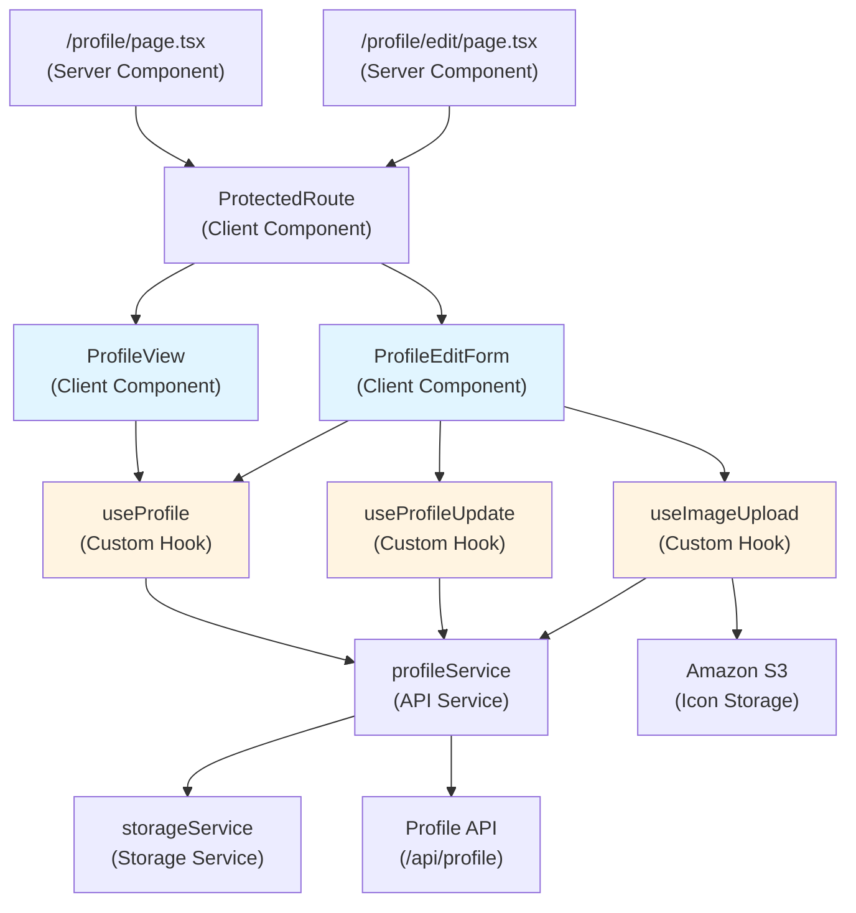
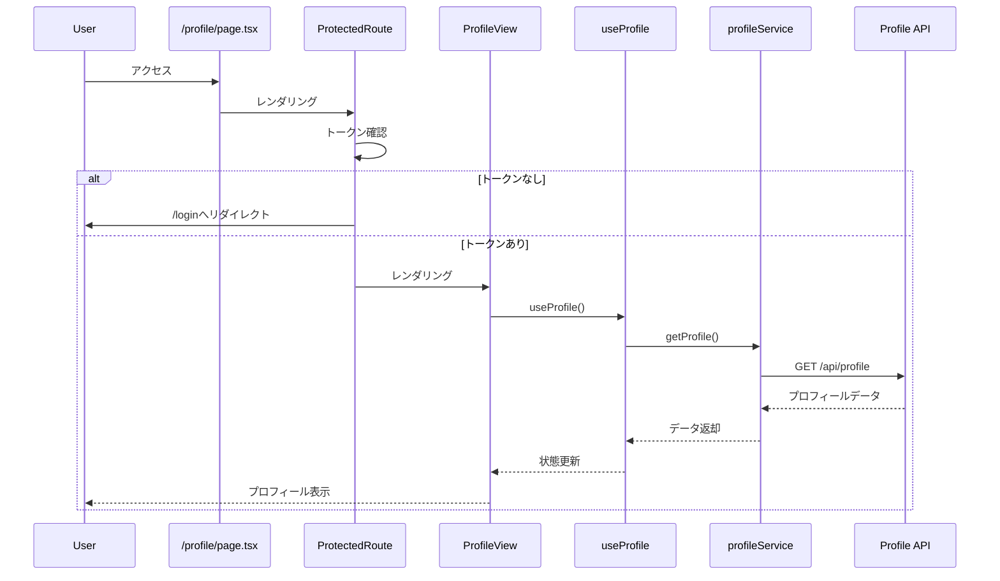
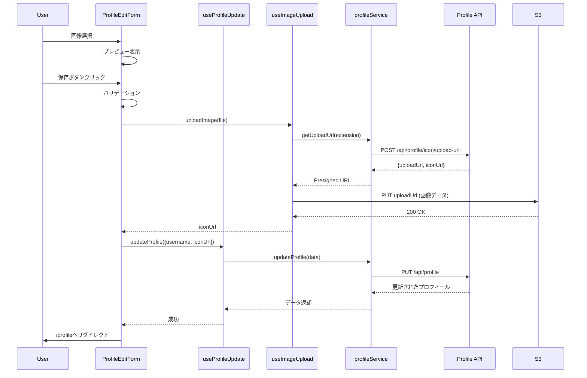

# 設計書: プロフィール画面

## 概要

このドキュメントは、投票対局アプリケーションのプロフィール関連画面（表示画面・編集画面）の設計を定義します。ユーザーは自分のプロフィール情報（ユーザー名、アイコン画像）を表示・編集できます。

### 主要機能

- **プロフィール表示画面** (`/profile`): ユーザーのプロフィール情報を表示
- **プロフィール編集画面** (`/profile/edit`): ユーザー名とアイコン画像の編集
- **画像アップロード**: S3へのPresigned URLを使用した直接アップロード
- **フォームバリデーション**: クライアント側での入力検証
- **エラーハンドリング**: 包括的なエラー表示とリカバリー

### 技術スタック

- **Framework**: Next.js 16 (App Router)
- **UI Components**: shadcn/ui
- **Styling**: Tailwind CSS
- **Icons**: Lucide React
- **State Management**: React hooks (useState, useEffect)
- **API Client**: Fetch API
- **Testing**: Vitest + React Testing Library + fast-check

## アーキテクチャ

### コンポーネント構成図



### データフロー

#### プロフィール表示フロー



#### プロフィール更新フロー（画像あり）



## コンポーネントとインターフェース

### ページコンポーネント

#### 1. `/profile/page.tsx` (Server Component)

プロフィール表示ページのエントリーポイント。

```typescript
// packages/web/src/app/profile/page.tsx
import { ProtectedRoute } from '@/components/auth/protected-route';
import { ProfileView } from '@/components/profile/profile-view';

export default function ProfilePage() {
  return (
    <ProtectedRoute>
      <div className="container mx-auto px-4 py-8 max-w-2xl">
        <h1 className="text-3xl font-bold mb-8">プロフィール</h1>
        <ProfileView />
      </div>
    </ProtectedRoute>
  );
}
```

#### 2. `/profile/edit/page.tsx` (Server Component)

プロフィール編集ページのエントリーポイント。

```typescript
// packages/web/src/app/profile/edit/page.tsx
import { ProtectedRoute } from '@/components/auth/protected-route';
import { ProfileEditForm } from '@/components/profile/profile-edit-form';

export default function ProfileEditPage() {
  return (
    <ProtectedRoute>
      <div className="container mx-auto px-4 py-8 max-w-2xl">
        <h1 className="text-3xl font-bold mb-8">プロフィール編集</h1>
        <ProfileEditForm />
      </div>
    </ProtectedRoute>
  );
}
```

### クライアントコンポーネント

#### 1. ProfileView Component

プロフィール情報を表示するコンポーネント。

```typescript
// packages/web/src/components/profile/profile-view.tsx
'use client';

import React from 'react';
import { useRouter } from 'next/navigation';
import Image from 'next/image';
import { User } from 'lucide-react';
import { useProfile } from '@/lib/hooks/use-profile';
import { Button } from '@/components/ui/button';
import { Alert, AlertDescription } from '@/components/ui/alert';

export function ProfileView() {
  const router = useRouter();
  const { profile, isLoading, error, refetch } = useProfile();

  if (isLoading) {
    return (
      <div className="flex justify-center items-center py-12">
        <div className="animate-spin rounded-full h-12 w-12 border-b-2 border-gray-900" />
      </div>
    );
  }

  if (error) {
    return (
      <div className="space-y-4">
        <Alert variant="destructive" role="alert">
          <AlertDescription>{error}</AlertDescription>
        </Alert>
        <Button onClick={refetch} className="w-full">
          再読み込み
        </Button>
      </div>
    );
  }

  if (!profile) {
    return null;
  }

  return (
    <div className="bg-white rounded-lg shadow p-6 space-y-6">
      <div className="flex items-center space-x-6">
        <div className="relative w-32 h-32 rounded-full overflow-hidden bg-gray-200">
          {profile.iconUrl ? (
            <Image
              src={profile.iconUrl}
              alt="プロフィールアイコン"
              width={128}
              height={128}
              className="object-cover"
              priority
            />
          ) : (
            <div className="w-full h-full flex items-center justify-center">
              <User className="w-16 h-16 text-gray-400" />
            </div>
          )}
        </div>
        <div className="flex-1">
          <h2 className="text-2xl font-bold mb-2">{profile.username}</h2>
          <p className="text-gray-600">{profile.email}</p>
        </div>
      </div>

      <Button
        onClick={() => router.push('/profile/edit')}
        className="w-full"
      >
        編集
      </Button>
    </div>
  );
}
```

#### 2. ProfileEditForm Component

プロフィール編集フォームコンポーネント。

```typescript
// packages/web/src/components/profile/profile-edit-form.tsx
'use client';

import React, { useState, useEffect } from 'react';
import { useRouter } from 'next/navigation';
import Image from 'next/image';
import { User, Upload } from 'lucide-react';
import { useProfile } from '@/lib/hooks/use-profile';
import { useProfileUpdate } from '@/lib/hooks/use-profile-update';
import { useImageUpload } from '@/lib/hooks/use-image-upload';
import { Button } from '@/components/ui/button';
import { Input } from '@/components/ui/input';
import { Alert, AlertDescription } from '@/components/ui/alert';

interface FormErrors {
  username?: string;
  image?: string;
}

export function ProfileEditForm() {
  const router = useRouter();
  const { profile, isLoading: profileLoading } = useProfile();
  const { updateProfile, isLoading: updateLoading, error: updateError } = useProfileUpdate();
  const { uploadImage, isLoading: uploadLoading, error: uploadError } = useImageUpload();

  const [username, setUsername] = useState('');
  const [selectedFile, setSelectedFile] = useState<File | null>(null);
  const [previewUrl, setPreviewUrl] = useState<string | null>(null);
  const [errors, setErrors] = useState<FormErrors>({});
  const [hasChanges, setHasChanges] = useState(false);
  const [showCancelDialog, setShowCancelDialog] = useState(false);

  const isLoading = profileLoading || updateLoading || uploadLoading;

  useEffect(() => {
    if (profile) {
      setUsername(profile.username);
      setPreviewUrl(profile.iconUrl || null);
    }
  }, [profile]);

  useEffect(() => {
    if (profile) {
      const usernameChanged = username !== profile.username;
      const imageChanged = selectedFile !== null;
      setHasChanges(usernameChanged || imageChanged);
    }
  }, [username, selectedFile, profile]);

  const validateForm = (): boolean => {
    const newErrors: FormErrors = {};

    if (!username.trim()) {
      newErrors.username = 'ユーザー名を入力してください';
    } else if (username.length > 50) {
      newErrors.username = 'ユーザー名は50文字以内で入力してください';
    }

    setErrors(newErrors);
    return Object.keys(newErrors).length === 0;
  };

  const handleFileSelect = (e: React.ChangeEvent<HTMLInputElement>) => {
    const file = e.target.files?.[0];
    if (!file) return;

    // ファイルサイズチェック (5MB)
    if (file.size > 5 * 1024 * 1024) {
      setErrors({ ...errors, image: '画像サイズは5MB以下にしてください' });
      return;
    }

    // ファイル形式チェック
    const validTypes = ['image/png', 'image/jpeg', 'image/gif'];
    if (!validTypes.includes(file.type)) {
      setErrors({ ...errors, image: 'PNG、JPEG、GIF形式の画像を選択してください' });
      return;
    }

    setErrors({ ...errors, image: undefined });
    setSelectedFile(file);

    // プレビュー生成
    const reader = new FileReader();
    reader.onloadend = () => {
      setPreviewUrl(reader.result as string);
    };
    reader.readAsDataURL(file);
  };

  const handleSubmit = async (e: React.FormEvent) => {
    e.preventDefault();

    if (!validateForm()) {
      return;
    }

    try {
      let iconUrl = profile?.iconUrl;

      // 画像がある場合はアップロード
      if (selectedFile) {
        const uploadResult = await uploadImage(selectedFile);
        if (!uploadResult) {
          return; // エラーはuseImageUploadで処理済み
        }
        iconUrl = uploadResult.iconUrl;
      }

      // プロフィール更新
      const success = await updateProfile({
        username: username.trim(),
        iconUrl,
      });

      if (success) {
        router.push('/profile');
      }
    } catch (err) {
      // エラーはフックで処理済み
    }
  };

  const handleCancel = () => {
    if (hasChanges) {
      setShowCancelDialog(true);
    } else {
      router.push('/profile');
    }
  };

  const confirmCancel = () => {
    router.push('/profile');
  };

  if (profileLoading) {
    return (
      <div className="flex justify-center items-center py-12">
        <div className="animate-spin rounded-full h-12 w-12 border-b-2 border-gray-900" />
      </div>
    );
  }

  return (
    <>
      <form onSubmit={handleSubmit} className="bg-white rounded-lg shadow p-6 space-y-6" noValidate>
        {(updateError || uploadError) && (
          <Alert variant="destructive" role="alert">
            <AlertDescription>{updateError || uploadError}</AlertDescription>
          </Alert>
        )}

        {/* アイコン画像 */}
        <div className="space-y-4">
          <label className="block text-sm font-medium text-gray-700">
            プロフィールアイコン
          </label>
          <div className="flex items-center space-x-6">
            <div className="relative w-32 h-32 rounded-full overflow-hidden bg-gray-200">
              {previewUrl ? (
                <Image
                  src={previewUrl}
                  alt="プロフィールアイコン"
                  width={128}
                  height={128}
                  className="object-cover"
                />
              ) : (
                <div className="w-full h-full flex items-center justify-center">
                  <User className="w-16 h-16 text-gray-400" />
                </div>
              )}
            </div>
            <div className="flex-1">
              <input
                type="file"
                id="icon-upload"
                accept="image/png,image/jpeg,image/gif"
                onChange={handleFileSelect}
                disabled={isLoading}
                className="hidden"
                aria-label="アイコン画像を選択"
              />
              <Button
                type="button"
                variant="outline"
                onClick={() => document.getElementById('icon-upload')?.click()}
                disabled={isLoading}
                className="w-full"
              >
                <Upload className="w-4 h-4 mr-2" />
                画像を選択
              </Button>
              <p className="mt-2 text-sm text-gray-500">
                PNG、JPEG、GIF形式（最大5MB）
              </p>
            </div>
          </div>
          {errors.image && (
            <p className="text-sm text-red-600" role="alert">
              {errors.image}
            </p>
          )}
        </div>

        {/* ユーザー名 */}
        <div className="space-y-2">
          <label htmlFor="username" className="block text-sm font-medium text-gray-700">
            ユーザー名
          </label>
          <Input
            id="username"
            name="username"
            type="text"
            value={username}
            onChange={(e) => setUsername(e.target.value)}
            disabled={isLoading}
            placeholder="ユーザー名"
            aria-label="ユーザー名"
            aria-invalid={!!errors.username}
            aria-describedby={errors.username ? 'username-error' : undefined}
            className={errors.username ? 'border-red-500' : ''}
          />
          {errors.username && (
            <p id="username-error" className="text-sm text-red-600" role="alert">
              {errors.username}
            </p>
          )}
        </div>

        {/* メールアドレス（読み取り専用） */}
        <div className="space-y-2">
          <label htmlFor="email" className="block text-sm font-medium text-gray-700">
            メールアドレス
          </label>
          <Input
            id="email"
            name="email"
            type="email"
            value={profile?.email || ''}
            disabled
            className="bg-gray-50"
          />
          <p className="text-sm text-gray-500">
            メールアドレスは変更できません
          </p>
        </div>

        {/* ボタン */}
        <div className="flex space-x-4">
          <Button
            type="submit"
            disabled={isLoading || !hasChanges}
            aria-disabled={isLoading || !hasChanges}
            className="flex-1"
          >
            {isLoading ? '保存中...' : '保存'}
          </Button>
          <Button
            type="button"
            variant="outline"
            onClick={handleCancel}
            disabled={isLoading}
            className="flex-1"
          >
            キャンセル
          </Button>
        </div>
      </form>

      {/* キャンセル確認ダイアログ */}
      {showCancelDialog && (
        <div className="fixed inset-0 bg-black bg-opacity-50 flex items-center justify-center z-50">
          <div className="bg-white rounded-lg p-6 max-w-md w-full mx-4">
            <h2 className="text-xl font-bold mb-4">確認</h2>
            <p className="mb-6">変更内容が保存されていません。破棄してもよろしいですか？</p>
            <div className="flex space-x-4">
              <Button
                onClick={confirmCancel}
                variant="destructive"
                className="flex-1"
              >
                はい
              </Button>
              <Button
                onClick={() => setShowCancelDialog(false)}
                variant="outline"
                className="flex-1"
              >
                いいえ
              </Button>
            </div>
          </div>
        </div>
      )}
    </>
  );
}
```

### カスタムフック

#### 1. useProfile Hook

プロフィール情報を取得するフック。

```typescript
// packages/web/src/lib/hooks/use-profile.ts
import { useState, useEffect } from 'react';
import { profileService } from '@/lib/services/profile-service';
import type { Profile } from '@/lib/types/profile';

export function useProfile() {
  const [profile, setProfile] = useState<Profile | null>(null);
  const [isLoading, setIsLoading] = useState(true);
  const [error, setError] = useState<string | null>(null);

  const fetchProfile = async () => {
    setIsLoading(true);
    setError(null);

    try {
      const data = await profileService.getProfile();
      setProfile(data);
    } catch (err) {
      if (err instanceof Error) {
        setError(err.message);
      } else {
        setError('プロフィールの取得に失敗しました');
      }
    } finally {
      setIsLoading(false);
    }
  };

  useEffect(() => {
    fetchProfile();
  }, []);

  return {
    profile,
    isLoading,
    error,
    refetch: fetchProfile,
  };
}
```

#### 2. useProfileUpdate Hook

プロフィール情報を更新するフック。

```typescript
// packages/web/src/lib/hooks/use-profile-update.ts
import { useState } from 'react';
import { profileService } from '@/lib/services/profile-service';
import type { ProfileUpdateData } from '@/lib/types/profile';

export function useProfileUpdate() {
  const [isLoading, setIsLoading] = useState(false);
  const [error, setError] = useState<string | null>(null);

  const updateProfile = async (data: ProfileUpdateData): Promise<boolean> => {
    setIsLoading(true);
    setError(null);

    try {
      await profileService.updateProfile(data);
      return true;
    } catch (err) {
      if (err instanceof Error) {
        setError(err.message);
      } else {
        setError('プロフィールの更新に失敗しました');
      }
      return false;
    } finally {
      setIsLoading(false);
    }
  };

  return {
    updateProfile,
    isLoading,
    error,
  };
}
```

#### 3. useImageUpload Hook

画像をS3にアップロードするフック。

```typescript
// packages/web/src/lib/hooks/use-image-upload.ts
import { useState } from 'react';
import { profileService } from '@/lib/services/profile-service';

interface UploadResult {
  iconUrl: string;
}

export function useImageUpload() {
  const [isLoading, setIsLoading] = useState(false);
  const [error, setError] = useState<string | null>(null);

  const uploadImage = async (file: File): Promise<UploadResult | null> => {
    setIsLoading(true);
    setError(null);

    try {
      // ファイル拡張子を取得
      const extension = file.name.split('.').pop()?.toLowerCase() || 'png';

      // Presigned URL取得
      const { uploadUrl, iconUrl } = await profileService.getUploadUrl(extension);

      // S3にアップロード
      const uploadResponse = await fetch(uploadUrl, {
        method: 'PUT',
        body: file,
        headers: {
          'Content-Type': file.type,
        },
      });

      if (!uploadResponse.ok) {
        throw new Error('画像のアップロードに失敗しました。再度お試しください');
      }

      return { iconUrl };
    } catch (err) {
      if (err instanceof Error) {
        setError(err.message);
      } else {
        setError('画像のアップロードに失敗しました');
      }
      return null;
    } finally {
      setIsLoading(false);
    }
  };

  const retry = async (file: File) => {
    return uploadImage(file);
  };

  return {
    uploadImage,
    retry,
    isLoading,
    error,
  };
}
```

### サービス層

#### profileService

プロフィールAPIとの通信を担当するサービス。

```typescript
// packages/web/src/lib/services/profile-service.ts
import { storageService } from './storage-service';
import type { Profile, ProfileUpdateData } from '@/lib/types/profile';

const API_BASE_URL = process.env.NEXT_PUBLIC_API_URL || '';

class ProfileService {
  private getAuthHeaders(): HeadersInit {
    const token = storageService.getAccessToken();
    if (!token) {
      throw new Error('認証エラーが発生しました。再度ログインしてください');
    }

    return {
      'Content-Type': 'application/json',
      Authorization: `Bearer ${token}`,
    };
  }

  async getProfile(): Promise<Profile> {
    try {
      const response = await fetch(`${API_BASE_URL}/api/profile`, {
        method: 'GET',
        headers: this.getAuthHeaders(),
      });

      if (response.status === 401) {
        throw new Error('認証エラーが発生しました。再度ログインしてください');
      }

      if (response.status === 404) {
        throw new Error('ユーザーが見つかりません');
      }

      if (response.status === 500) {
        throw new Error('サーバーエラーが発生しました。しばらくしてから再度お試しください');
      }

      if (!response.ok) {
        throw new Error('プロフィールの取得に失敗しました');
      }

      const data = await response.json();
      return data;
    } catch (err) {
      if (err instanceof TypeError) {
        throw new Error('ネットワークエラーが発生しました。インターネット接続を確認してください');
      }
      throw err;
    }
  }

  async updateProfile(data: ProfileUpdateData): Promise<Profile> {
    try {
      const response = await fetch(`${API_BASE_URL}/api/profile`, {
        method: 'PUT',
        headers: this.getAuthHeaders(),
        body: JSON.stringify(data),
      });

      if (response.status === 400) {
        const errorData = await response.json();
        const fieldErrors = errorData.details?.fields;
        if (fieldErrors) {
          const messages = Object.values(fieldErrors).join(', ');
          throw new Error(messages);
        }
        throw new Error(errorData.message || 'バリデーションエラーが発生しました');
      }

      if (response.status === 401) {
        throw new Error('認証エラーが発生しました。再度ログインしてください');
      }

      if (response.status === 500) {
        throw new Error('サーバーエラーが発生しました。しばらくしてから再度お試しください');
      }

      if (!response.ok) {
        throw new Error('プロフィールの更新に失敗しました');
      }

      const result = await response.json();
      return result;
    } catch (err) {
      if (err instanceof TypeError) {
        throw new Error('ネットワークエラーが発生しました。インターネット接続を確認してください');
      }
      throw err;
    }
  }

  async getUploadUrl(fileExtension: string): Promise<{ uploadUrl: string; iconUrl: string }> {
    try {
      const response = await fetch(`${API_BASE_URL}/api/profile/icon/upload-url`, {
        method: 'POST',
        headers: this.getAuthHeaders(),
        body: JSON.stringify({ fileExtension }),
      });

      if (response.status === 400) {
        throw new Error('サポートされていないファイル形式です');
      }

      if (response.status === 401) {
        throw new Error('認証エラーが発生しました。再度ログインしてください');
      }

      if (response.status === 500) {
        throw new Error('サーバーエラーが発生しました。しばらくしてから再度お試しください');
      }

      if (!response.ok) {
        throw new Error('アップロードURLの取得に失敗しました');
      }

      const data = await response.json();
      return data;
    } catch (err) {
      if (err instanceof TypeError) {
        throw new Error('ネットワークエラーが発生しました。インターネット接続を確認してください');
      }
      throw err;
    }
  }
}

export const profileService = new ProfileService();
```

### 型定義

```typescript
// packages/web/src/lib/types/profile.ts
export interface Profile {
  userId: string;
  email: string;
  username: string;
  iconUrl?: string;
  createdAt: string;
  updatedAt: string;
}

export interface ProfileUpdateData {
  username?: string;
  iconUrl?: string;
}

export interface UploadUrlResponse {
  uploadUrl: string;
  iconUrl: string;
  expiresIn: number;
}
```

## データモデル

### クライアント側の状態管理

#### ProfileView State

```typescript
interface ProfileViewState {
  profile: Profile | null;
  isLoading: boolean;
  error: string | null;
}
```

#### ProfileEditForm State

```typescript
interface ProfileEditFormState {
  username: string;
  selectedFile: File | null;
  previewUrl: string | null;
  errors: {
    username?: string;
    image?: string;
  };
  hasChanges: boolean;
  showCancelDialog: boolean;
  isLoading: boolean;
  error: string | null;
}
```

### API レスポンス型

プロフィールAPIのレスポンス型は、バックエンドの設計に従います（spec 11-profile-api参照）。

## 正確性プロパティ

_プロパティとは、システムのすべての有効な実行において真であるべき特性または動作です。本質的には、システムが何をすべきかについての形式的な記述です。プロパティは、人間が読める仕様と機械検証可能な正確性保証の橋渡しとなります。_
