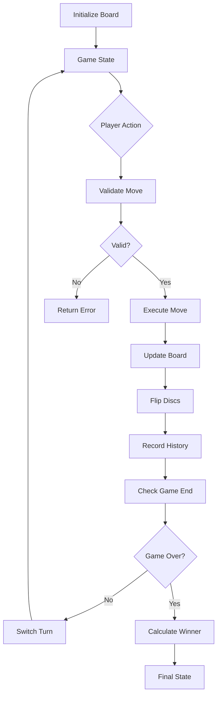
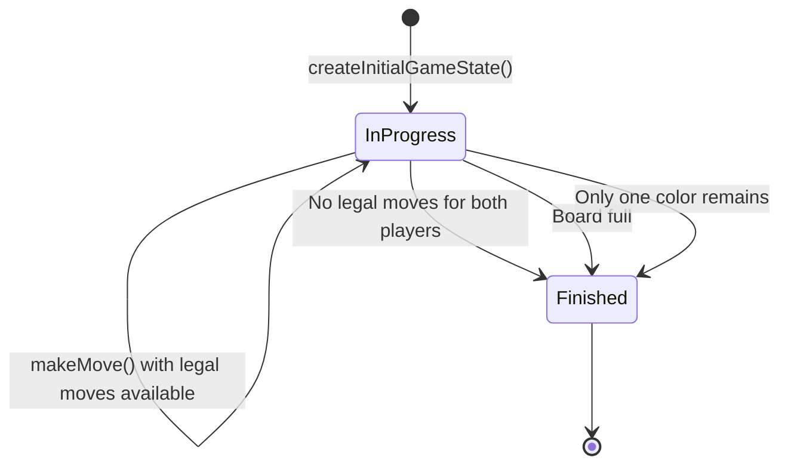

# Design Document: Othello Game Logic

## Overview

This document describes the technical design for the Othello (Reversi) game logic implementation. The game logic is a pure, functional TypeScript module that manages the complete game state, validates moves according to Othello rules, updates the board, and determines game outcomes.

The implementation prioritizes:

- **Immutability**: All operations return new state objects rather than mutating existing ones
- **Type Safety**: Comprehensive TypeScript types to prevent runtime errors
- **Testability**: Pure functions with no side effects, enabling thorough testing
- **Performance**: Efficient algorithms for move validation and board updates
- **Simplicity**: Clear, readable code that directly reflects game rules

This module serves as the foundation for the Vote Board Game application's MVP, providing the core game mechanics that will be integrated with the voting system, API layer, and user interface.

## Architecture

### Module Structure

```
packages/api/src/lib/othello/
├── types.ts                    # Type definitions
├── board.ts                    # Board initialization and state management
├── validation.ts               # Move validation logic
├── moves.ts                    # Move execution and board updates
├── game-state.ts              # Game state management and turn logic
├── scoring.ts                 # Score calculation and winner determination
├── serialization.ts           # State serialization/deserialization
├── history.ts                 # Move history tracking
├── index.ts                   # Public API exports
├── board.test.ts              # Unit tests
├── validation.test.ts         # Unit tests
├── moves.test.ts              # Unit tests
├── game-state.test.ts         # Unit tests
├── scoring.test.ts            # Unit tests
├── serialization.test.ts      # Unit tests
├── history.test.ts            # Unit tests
├── board.property.test.ts     # Property-based tests
├── validation.property.test.ts # Property-based tests
├── moves.property.test.ts     # Property-based tests
└── game-state.property.test.ts # Property-based tests
```

### Design Principles

1. **Functional Core**: All game logic functions are pure, taking immutable inputs and returning new outputs
2. **Single Responsibility**: Each module handles one aspect of the game (validation, moves, scoring, etc.)
3. **Composition**: Complex operations are built from simple, composable functions
4. **Explicit State**: Game state is explicitly passed and returned, never hidden in closures or globals
5. **Error Handling**: Invalid operations return error results rather than throwing exceptions

### Data Flow



## Components and Interfaces

### Core Types

```typescript
// types.ts

/**
 * Represents a disc color or empty cell
 */
export enum CellState {
  Empty = 0,
  Black = 1,
  White = 2,
}

/**
 * Represents a player color
 */
export type Player = CellState.Black | CellState.White;

/**
 * Board position (0-7 for both row and column)
 */
export interface Position {
  readonly row: number;
  readonly col: number;
}

/**
 * Direction vector for checking lines
 */
export interface Direction {
  readonly rowDelta: number;
  readonly colDelta: number;
}

/**
 * The 8 possible directions from any cell
 */
export const DIRECTIONS: readonly Direction[] = [
  { rowDelta: -1, colDelta: 0 }, // North
  { rowDelta: -1, colDelta: 1 }, // Northeast
  { rowDelta: 0, colDelta: 1 }, // East
  { rowDelta: 1, colDelta: 1 }, // Southeast
  { rowDelta: 1, colDelta: 0 }, // South
  { rowDelta: 1, colDelta: -1 }, // Southwest
  { rowDelta: 0, colDelta: -1 }, // West
  { rowDelta: -1, colDelta: -1 }, // Northwest
];

/**
 * Immutable 8x8 game board
 */
export type Board = readonly (readonly CellState[])[];

/**
 * Game status
 */
export enum GameStatus {
  InProgress = 'in_progress',
  Finished = 'finished',
}

/**
 * A move in the game
 */
export interface Move {
  readonly position: Position;
  readonly player: Player;
  readonly flippedPositions: readonly Position[];
}

/**
 * Complete game state
 */
export interface GameState {
  readonly board: Board;
  readonly currentPlayer: Player;
  readonly status: GameStatus;
  readonly history: readonly Move[];
  readonly blackScore: number;
  readonly whiteScore: number;
}

/**
 * Result of a move validation
 */
export interface ValidationResult {
  readonly valid: boolean;
  readonly reason?: string;
  readonly flippedPositions?: readonly Position[];
}

/**
 * Serialized game state for storage
 */
export interface SerializedGameState {
  readonly board: number[][];
  readonly currentPlayer: number;
  readonly status: string;
  readonly history: Array<{
    readonly position: { readonly row: number; readonly col: number };
    readonly player: number;
    readonly flippedPositions: Array<{ readonly row: number; readonly col: number }>;
  }>;
}

/**
 * Game result
 */
export interface GameResult {
  readonly winner: Player | null; // null indicates draw
  readonly blackScore: number;
  readonly whiteScore: number;
}
```

### Board Module

```typescript
// board.ts

/**
 * Creates a new Othello board with the standard initial configuration
 */
export function createInitialBoard(): Board;

/**
 * Gets the cell state at a specific position
 */
export function getCellState(board: Board, position: Position): CellState;

/**
 * Sets a cell state at a specific position (returns new board)
 */
export function setCellState(board: Board, position: Position, state: CellState): Board;

/**
 * Checks if a position is within board boundaries
 */
export function isValidPosition(position: Position): boolean;

/**
 * Gets all empty positions on the board
 */
export function getEmptyPositions(board: Board): readonly Position[];

/**
 * Counts discs of a specific color
 */
export function countDiscs(board: Board, player: Player): number;

/**
 * Checks if the board is full
 */
export function isBoardFull(board: Board): boolean;
```

### Validation Module

```typescript
// validation.ts

/**
 * Validates if a move is legal according to Othello rules
 */
export function validateMove(board: Board, position: Position, player: Player): ValidationResult;

/**
 * Finds all positions that would be flipped by a move
 */
export function findFlippedPositions(
  board: Board,
  position: Position,
  player: Player
): readonly Position[];

/**
 * Checks a single direction for flippable discs
 */
export function checkDirection(
  board: Board,
  position: Position,
  direction: Direction,
  player: Player
): readonly Position[];

/**
 * Gets all legal moves for a player
 */
export function getLegalMoves(board: Board, player: Player): readonly Position[];

/**
 * Checks if a player has any legal moves
 */
export function hasLegalMoves(board: Board, player: Player): boolean;
```

### Moves Module

```typescript
// moves.ts

/**
 * Executes a move and returns the updated board
 */
export function executeMove(board: Board, position: Position, player: Player): Board;

/**
 * Flips discs at the specified positions
 */
export function flipDiscs(board: Board, positions: readonly Position[], player: Player): Board;

/**
 * Creates a move record
 */
export function createMove(
  position: Position,
  player: Player,
  flippedPositions: readonly Position[]
): Move;
```

### Game State Module

```typescript
// game-state.ts

/**
 * Creates a new game with initial state
 */
export function createInitialGameState(): GameState;

/**
 * Attempts to make a move and returns the new game state
 */
export function makeMove(
  state: GameState,
  position: Position
): { success: true; state: GameState } | { success: false; reason: string };

/**
 * Switches to the next player
 */
export function switchPlayer(player: Player): Player;

/**
 * Determines if the game should end
 */
export function shouldEndGame(state: GameState): boolean;

/**
 * Updates game status based on current state
 */
export function updateGameStatus(state: GameState): GameState;

/**
 * Handles turn logic (including pass when no moves available)
 */
export function processTurn(state: GameState): GameState;
```

### Scoring Module

```typescript
// scoring.ts

/**
 * Calculates current scores for both players
 */
export function calculateScores(board: Board): {
  readonly blackScore: number;
  readonly whiteScore: number;
};

/**
 * Determines the winner of a finished game
 */
export function determineWinner(state: GameState): GameResult;

/**
 * Updates the scores in the game state
 */
export function updateScores(state: GameState): GameState;
```

### Serialization Module

```typescript
// serialization.ts

/**
 * Serializes game state to a plain object for storage
 */
export function serializeGameState(state: GameState): SerializedGameState;

/**
 * Deserializes game state from a plain object
 */
export function deserializeGameState(
  serialized: SerializedGameState
): GameState | { error: string };

/**
 * Validates serialized game state structure
 */
export function validateSerializedState(data: unknown): data is SerializedGameState;
```

### History Module

```typescript
// history.ts

/**
 * Adds a move to the history
 */
export function addMoveToHistory(history: readonly Move[], move: Move): readonly Move[];

/**
 * Gets the last move from history
 */
export function getLastMove(history: readonly Move[]): Move | undefined;

/**
 * Gets move at a specific index
 */
export function getMoveAt(history: readonly Move[], index: number): Move | undefined;

/**
 * Gets the number of moves in history
 */
export function getMoveCount(history: readonly Move[]): number;
```

## Data Models

### Board Representation

The board is represented as a 2D array of `CellState` values:

```typescript
// Example initial board state
const initialBoard: Board = [
  [0, 0, 0, 0, 0, 0, 0, 0],
  [0, 0, 0, 0, 0, 0, 0, 0],
  [0, 0, 0, 0, 0, 0, 0, 0],
  [0, 0, 0, 2, 1, 0, 0, 0], // Row 3: White at (3,3), Black at (3,4)
  [0, 0, 0, 1, 2, 0, 0, 0], // Row 4: Black at (4,3), White at (4,4)
  [0, 0, 0, 0, 0, 0, 0, 0],
  [0, 0, 0, 0, 0, 0, 0, 0],
  [0, 0, 0, 0, 0, 0, 0, 0],
];
```

### Position Indexing

- Rows and columns are 0-indexed (0-7)
- Position (0, 0) is the top-left corner
- Position (7, 7) is the bottom-right corner

### Immutability Strategy

All board updates create new arrays using spread operators or array methods:

```typescript
// Example: Setting a cell state
function setCellState(board: Board, position: Position, state: CellState): Board {
  return board.map((row, rowIndex) =>
    rowIndex === position.row
      ? row.map((cell, colIndex) => (colIndex === position.col ? state : cell))
      : row
  );
}
```

### Game State Transitions



### Move Validation Algorithm

For each potential move position:

1. Check if position is within bounds (0-7)
2. Check if position is empty
3. For each of 8 directions:
   - Move in that direction
   - Count consecutive opponent discs
   - Check if line ends with player's disc
   - If yes, mark opponent discs as flippable
4. If any direction has flippable discs, move is valid

### Serialization Format

The serialized format uses plain JavaScript objects and arrays for JSON compatibility:

```json
{
  "board": [
    [0, 0, 0, 0, 0, 0, 0, 0],
    [0, 0, 0, 0, 0, 0, 0, 0],
    [0, 0, 0, 0, 0, 0, 0, 0],
    [0, 0, 0, 2, 1, 0, 0, 0],
    [0, 0, 0, 1, 2, 0, 0, 0],
    [0, 0, 0, 0, 0, 0, 0, 0],
    [0, 0, 0, 0, 0, 0, 0, 0],
    [0, 0, 0, 0, 0, 0, 0, 0]
  ],
  "currentPlayer": 1,
  "status": "in_progress",
  "history": []
}
```

## Correctness Properties

A property is a characteristic or behavior that should hold true across all valid executions of a system—essentially, a formal statement about what the system should do. Properties serve as the bridge between human-readable specifications and machine-verifiable correctness guarantees.

### Property Reflection

After analyzing all acceptance criteria, I identified several areas where properties can be consolidated:

- Requirements 1.2-1.6 (initial disc placement) can be tested together as a single board initialization example rather than separate properties
- Requirements 7.1-7.3 (score counting) are redundant with the general score calculation property
- Requirements 8.2-8.4 (winner determination) can be combined into a single comprehensive property
- Requirements 10.2-10.4 (move recording details) can be combined into a single property about complete move data

The following properties represent the minimal set needed to validate all testable requirements without redundancy.

### Property 1: Board initialization creates correct structure

_For any_ call to `createInitialBoard()`, the resulting board should have exactly 8 rows, exactly 8 columns, exactly 4 discs placed (White at (3,3), Black at (3,4), Black at (4,3), White at (4,4)), and all other 60 cells should be empty.

**Validates: Requirements 1.1, 1.2, 1.3, 1.4, 1.5, 1.6**

### Property 2: Occupied cells reject moves

_For any_ board state and any occupied position, attempting to place a disc at that position should be rejected as invalid.

**Validates: Requirements 2.1**

### Property 3: Moves without flips are invalid

_For any_ board state, player, and position where no opponent discs would be flipped, the move should be rejected as invalid.

**Validates: Requirements 2.2**

### Property 4: Moves with flips are valid

_For any_ board state, player, and empty position where at least one opponent disc would be flipped in any direction, the move should be accepted as valid.

**Validates: Requirements 2.3**

### Property 5: All eight directions are checked

_For any_ board state and position, if a valid flip sequence exists in any of the 8 directions (N, NE, E, SE, S, SW, W, NW), the validation should detect it.

**Validates: Requirements 2.4**

### Property 6: Direction checking validates line structure

_For any_ board state, player, position, and direction, a flip is valid in that direction only if there is at least one consecutive opponent disc followed by the player's own disc.

**Validates: Requirements 2.5**

### Property 7: Out-of-bounds positions are invalid

_For any_ position where row < 0 or row > 7 or col < 0 or col > 7, the move should be rejected as invalid.

**Validates: Requirements 2.6**

### Property 8: Valid moves place disc and flip opponents

_For any_ valid move, executing it should result in a board where: (1) the player's disc is placed at the specified position, and (2) all opponent discs in valid flip lines are changed to the player's color.

**Validates: Requirements 3.1, 3.2**

### Property 9: Flips only occur between anchoring discs

_For any_ valid move, the flipped discs should only be those that lie on a continuous line between the newly placed disc and an existing disc of the same color, with no gaps or discs beyond the anchoring disc.

**Validates: Requirements 3.3**

### Property 10: Board updates are atomic

_For any_ move execution, the board should transition directly from the pre-move state to the post-move state with no observable intermediate states, and all changes (disc placement + all flips) should occur together.

**Validates: Requirements 3.4**

### Property 11: Invalid moves don't modify board

_For any_ invalid move attempt on any board state, the board should remain completely unchanged (all 64 cells identical to before the attempt).

**Validates: Requirements 3.5**

### Property 12: Legal moves detection is complete and accurate

_For any_ board state and player, the set of legal moves should include all and only those empty positions where placing a disc would flip at least one opponent disc.

**Validates: Requirements 4.1, 4.2, 4.3**

### Property 13: No legal moves returns empty list

_For any_ board state where a player has no valid moves (all empty positions fail to flip any opponent discs), `getLegalMoves()` should return an empty list.

**Validates: Requirements 4.4**

### Property 14: Valid moves switch player

_For any_ game state and valid move, executing the move should result in a new game state where the current player is switched to the opponent.

**Validates: Requirements 5.1**

### Property 15: No legal moves causes pass

_For any_ game state where the current player has no legal moves but the opponent does, processing the turn should switch to the opponent without requiring a move.

**Validates: Requirements 5.2**

### Property 16: Double pass ends game

_For any_ game state where neither player has legal moves, the game should not switch players and should transition to finished status.

**Validates: Requirements 5.3, 6.1**

### Property 17: Current player is always tracked

_For any_ sequence of game operations, the game state should always indicate which player's turn it is (either Black or White, never undefined or invalid).

**Validates: Requirements 5.4**

### Property 18: Full board ends game

_For any_ board state where all 64 cells are occupied, the game status should be set to finished.

**Validates: Requirements 6.2**

### Property 19: Single color ends game

_For any_ board state where only one disc color exists (all discs are either all Black or all White), the game status should be set to finished.

**Validates: Requirements 6.3**

### Property 20: In-progress games accept valid moves

_For any_ game state with status in_progress, valid moves should be accepted and executed.

**Validates: Requirements 6.4**

### Property 21: Finished games reject all moves

_For any_ game state with status finished, all move attempts should be rejected regardless of validity.

**Validates: Requirements 6.5**

### Property 22: Score calculation is accurate

_For any_ board state, calculating scores should return the exact count of Black discs and the exact count of White discs on the board.

**Validates: Requirements 7.1, 7.2, 7.3, 7.4**

### Property 23: Winner determination is correct

_For any_ finished game state, the winner should be Black if Black has more discs, White if White has more discs, or null (draw) if counts are equal.

**Validates: Requirements 8.1, 8.2, 8.3, 8.4**

### Property 24: In-progress games have no winner

_For any_ game state with status in_progress, determining the winner should indicate that no winner exists yet.

**Validates: Requirements 8.5**

### Property 25: Serialization round-trip preserves state

_For any_ valid game state, serializing then deserializing should produce a game state equivalent to the original (same board, same current player, same status, same history).

**Validates: Requirements 9.1, 9.2, 9.3, 9.4, 9.5**

### Property 26: Invalid serialized data is rejected

_For any_ malformed or invalid serialized data (wrong structure, invalid values, missing fields), deserialization should reject it and return an error.

**Validates: Requirements 9.6**

### Property 27: Move history grows with each move

_For any_ game state and valid move, executing the move should result in a history that is exactly one move longer than before.

**Validates: Requirements 10.1**

### Property 28: Move records are complete

_For any_ move in the history, the move record should contain the position, the player color, and all flipped positions.

**Validates: Requirements 10.2, 10.3, 10.4**

### Property 29: Move history preserves order

_For any_ sequence of moves executed in order, the history should contain those moves in the exact same order.

**Validates: Requirements 10.5**

### Property 30: Complete history is accessible

_For any_ game state, all moves that have been executed should be accessible through the history interface.

**Validates: Requirements 10.6**

## Error Handling

### Error Strategy

The game logic uses a result-based error handling approach rather than exceptions:

```typescript
// Success case
{ success: true, state: GameState }

// Error case
{ success: false, reason: string }
```

### Error Categories

1. **Validation Errors**: Invalid move attempts (occupied cell, no flips, out of bounds)
   - Return `{ valid: false, reason: string }`
   - Do not modify game state

2. **State Errors**: Operations on invalid game states (moves on finished games)
   - Return `{ success: false, reason: string }`
   - Do not modify game state

3. **Deserialization Errors**: Invalid serialized data
   - Return `{ error: string }`
   - Do not create game state

### Error Messages

Error messages should be clear and actionable:

- `"Position is out of bounds"`
- `"Cell is already occupied"`
- `"Move would not flip any discs"`
- `"Game has already finished"`
- `"Invalid serialized data: missing required field 'board'"`

### Invariants

The following invariants must always hold:

1. Board is always 8x8
2. Each cell is always one of: Empty, Black, or White
3. Current player is always Black or White
4. Status is always InProgress or Finished
5. History length equals number of moves made
6. Total discs on board ≤ 64
7. If status is Finished, no legal moves exist for either player

## Testing Strategy

### Dual Testing Approach

The Othello game logic will be validated using both unit tests and property-based tests:

- **Unit tests**: Verify specific examples, edge cases, and error conditions
- **Property tests**: Verify universal properties across all inputs

Both approaches are complementary and necessary for comprehensive coverage. Unit tests catch concrete bugs in specific scenarios, while property tests verify general correctness across a wide range of inputs.

### Unit Testing

Unit tests will focus on:

1. **Specific Examples**
   - Initial board configuration matches Othello rules
   - Known game positions produce expected legal moves
   - Classic opening moves work correctly
   - End-game scenarios are handled properly

2. **Edge Cases**
   - Empty board (no legal moves)
   - Full board (game ends)
   - Board with only one color
   - Moves that flip in multiple directions
   - Corner and edge positions

3. **Error Conditions**
   - Out-of-bounds positions
   - Occupied cell attempts
   - Invalid serialized data formats
   - Moves on finished games

4. **Integration Points**
   - Serialization/deserialization round-trips
   - History tracking through multiple moves
   - Game state transitions

### Property-Based Testing

Property-based tests will use **fast-check** library with the following configuration:

- **Minimum 100 iterations** per property test (to ensure comprehensive input coverage)
- **Each test references its design property** using comment tags
- **Tag format**: `Feature: othello-game-logic, Property {number}: {property_text}`

Property tests will focus on:

1. **Invariants**
   - Board dimensions always 8x8
   - Cell states always valid (Empty/Black/White)
   - Score sum ≤ 64
   - Finished games have no legal moves

2. **Round-trip Properties**
   - Serialize → Deserialize → equivalent state
   - For any valid game state

3. **Metamorphic Properties**
   - Legal moves count ≤ empty cells count
   - After a move, disc count increases
   - Flipped discs count ≥ 1 for valid moves

4. **State Transition Properties**
   - Valid move → player switches
   - Invalid move → state unchanged
   - No legal moves → pass or game end

### Test File Organization

```
packages/api/src/lib/othello/
├── board.test.ts                    # Unit tests for board operations
├── validation.test.ts               # Unit tests for move validation
├── moves.test.ts                    # Unit tests for move execution
├── game-state.test.ts              # Unit tests for game state management
├── scoring.test.ts                 # Unit tests for scoring
├── serialization.test.ts           # Unit tests for serialization
├── history.test.ts                 # Unit tests for history
├── board.property.test.ts          # Property tests for board invariants
├── validation.property.test.ts     # Property tests for validation rules
├── moves.property.test.ts          # Property tests for move execution
└── game-state.property.test.ts     # Property tests for state transitions
```

### Custom Generators for Property Tests

Property tests will use custom fast-check generators:

```typescript
// Generate valid board states
const boardArbitrary = fc.array(
  fc.array(fc.constantFrom(CellState.Empty, CellState.Black, CellState.White), {
    minLength: 8,
    maxLength: 8,
  }),
  { minLength: 8, maxLength: 8 }
);

// Generate valid positions
const positionArbitrary = fc.record({
  row: fc.integer({ min: 0, max: 7 }),
  col: fc.integer({ min: 0, max: 7 }),
});

// Generate out-of-bounds positions
const outOfBoundsPositionArbitrary = fc.oneof(
  fc.record({
    row: fc.integer({ max: -1 }),
    col: fc.integer({ min: 0, max: 7 }),
  }),
  fc.record({
    row: fc.integer({ min: 8 }),
    col: fc.integer({ min: 0, max: 7 }),
  }),
  fc.record({
    row: fc.integer({ min: 0, max: 7 }),
    col: fc.integer({ max: -1 }),
  }),
  fc.record({
    row: fc.integer({ min: 0, max: 7 }),
    col: fc.integer({ min: 8 }),
  })
);

// Generate game states with specific properties
const gameStateWithLegalMovesArbitrary = // ... custom logic
const gameStateWithoutLegalMovesArbitrary = // ... custom logic
```

### Test Coverage Goals

- **Line coverage**: > 95%
- **Branch coverage**: > 90%
- **Function coverage**: 100%
- **Property test iterations**: 100 per property minimum

### Continuous Integration

All tests must pass before merging:

```yaml
# .github/workflows/test.yml
- name: Run unit tests
  run: pnpm test

- name: Run property tests
  run: pnpm test:property

- name: Check coverage
  run: pnpm test:coverage
```

## Implementation Notes

### Performance Considerations

1. **Board Copying**: Use efficient array spreading for immutable updates
2. **Direction Checking**: Short-circuit when first valid direction is found (for validation)
3. **Legal Moves Caching**: Consider caching legal moves if performance becomes an issue
4. **History Size**: History grows with game length; consider limits for very long games

### Future Enhancements

1. **Move Validation Caching**: Cache legal moves for current board state
2. **Board Hashing**: Implement board state hashing for position comparison
3. **Undo/Redo**: Support reverting to previous game states
4. **AI Integration**: Provide board evaluation functions for AI move selection
5. **Alternative Rules**: Support for different Othello variants

### Integration Points

This module will be used by:

1. **API Layer**: Validate and execute moves from user votes
2. **Batch Processing**: Determine game outcomes and generate next move candidates
3. **AI Service**: Evaluate board positions for move generation
4. **Frontend**: Display board state and legal moves (via API)

### Dependencies

- **TypeScript**: Type definitions and compilation
- **Vitest**: Testing framework
- **fast-check**: Property-based testing library

No runtime dependencies on AWS services or external libraries—this is a pure logic module.
