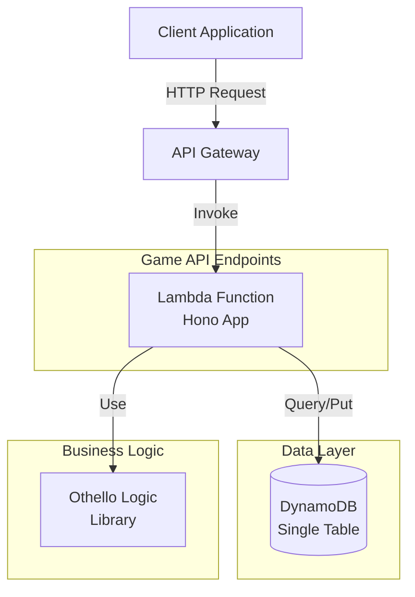
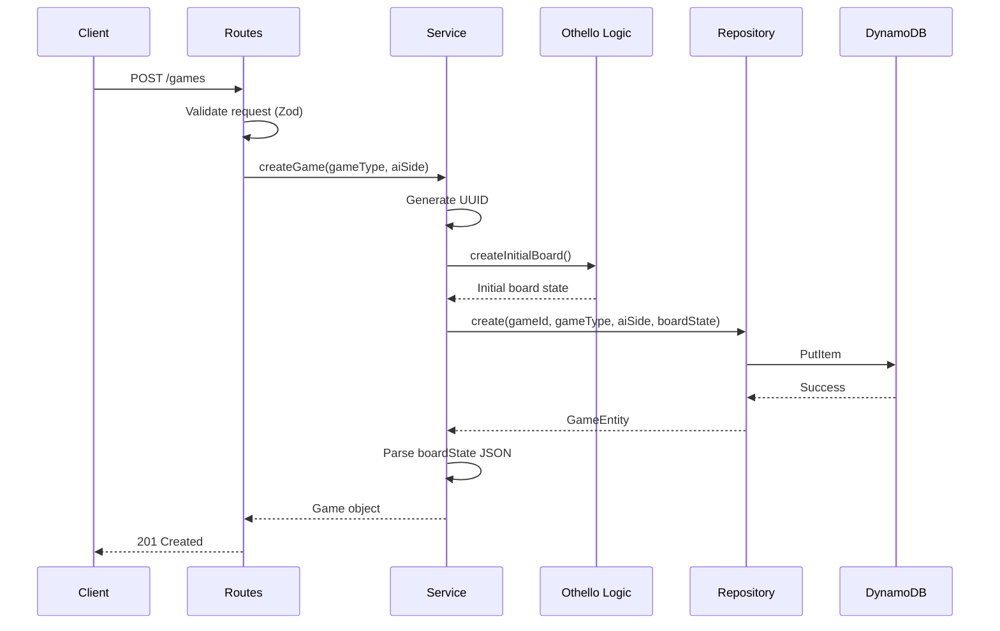
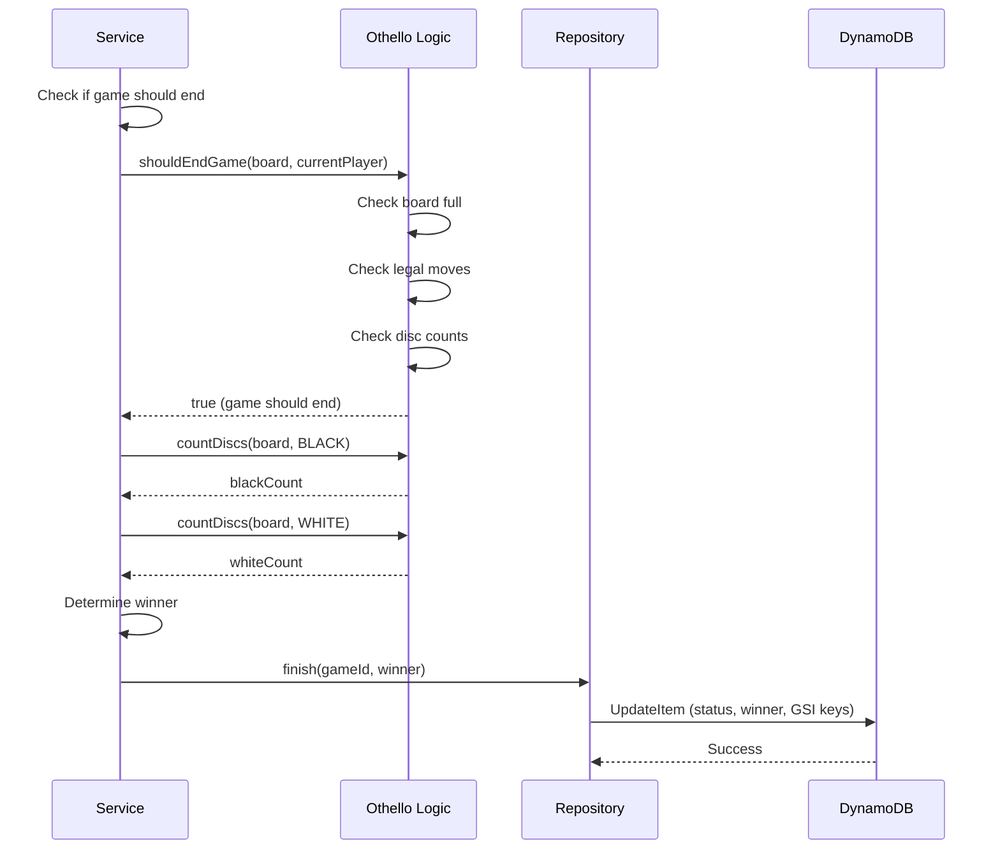

# Design Document: Game API

## Overview

Game APIは、投票対局アプリケーションにおけるゲーム管理の中核となるRESTful APIエンドポイント群です。このAPIは、ゲームの作成、取得、一覧表示、およびゲーム終了検知のロジックを提供します。

既存のOthelloゲームロジック（spec 13）を活用し、DynamoDB Single Table Designとの統合を通じて、スケーラブルで型安全なゲーム管理システムを実現します。Honoフレームワークを使用してAWS Lambda上で動作し、低レイテンシかつ高いスループットを実現します。

### 主要機能

- **ゲーム一覧取得**: ステータスによるフィルタリング、ページネーション対応
- **ゲーム詳細取得**: 盤面状態を含む完全なゲーム情報の取得
- **ゲーム作成**: 新規ゲームの初期化とDynamoDBへの永続化
- **ゲーム終了検知**: Othelloルールに基づく自動的なゲーム終了判定と勝者決定

### 技術スタック

- **フレームワーク**: Hono (軽量・高速なWebフレームワーク)
- **ランタイム**: AWS Lambda (Node.js)
- **データベース**: Amazon DynamoDB (Single Table Design)
- **バリデーション**: Zod (スキーマベースのバリデーション)
- **ゲームロジック**: packages/api/src/lib/othello (spec 13)

## Architecture

### システムアーキテクチャ



### レイヤー構造

```
┌─────────────────────────────────────┐
│   Routes Layer (Hono Router)        │
│   - Request validation (Zod)        │
│   - Response formatting              │
│   - Error handling                   │
└──────────────┬──────────────────────┘
               │
┌──────────────▼──────────────────────┐
│   Service Layer                      │
│   - Business logic orchestration     │
│   - Game end detection               │
│   - Winner determination             │
└──────────────┬──────────────────────┘
               │
┌──────────────▼──────────────────────┐
│   Repository Layer                   │
│   - DynamoDB access abstraction      │
│   - Data serialization/deserialization│
└──────────────┬──────────────────────┘
               │
┌──────────────▼──────────────────────┐
│   Othello Logic Library              │
│   - Board initialization             │
│   - Game end detection               │
│   - Disc counting                    │
└─────────────────────────────────────┘
```

### データフロー

#### ゲーム作成フロー



#### ゲーム終了検知フロー



## Components and Interfaces

### API Endpoints

#### GET /api/games

ゲーム一覧を取得します。ステータスによるフィルタリングとページネーションをサポートします。

**Query Parameters:**

```typescript
interface GetGamesQuery {
  status?: 'ACTIVE' | 'FINISHED'; // デフォルト: 'ACTIVE'
  limit?: number; // デフォルト: 20, 最大: 100
  cursor?: string; // ページネーション用カーソル
}
```

**Response (200 OK):**

```typescript
interface GetGamesResponse {
  games: Array<{
    gameId: string;
    gameType: 'OTHELLO' | 'CHESS' | 'GO' | 'SHOGI';
    status: 'ACTIVE' | 'FINISHED';
    aiSide: 'BLACK' | 'WHITE';
    currentTurn: number;
    winner?: 'AI' | 'COLLECTIVE' | 'DRAW';
    createdAt: string; // ISO 8601
    updatedAt: string; // ISO 8601
  }>;
  nextCursor?: string; // 次のページが存在する場合のみ
}
```

#### GET /api/games/:gameId

特定のゲームの詳細情報を取得します。盤面状態を含みます。

**Path Parameters:**

- `gameId`: string (UUID v4)

**Response (200 OK):**

```typescript
interface GetGameResponse {
  gameId: string;
  gameType: 'OTHELLO' | 'CHESS' | 'GO' | 'SHOGI';
  status: 'ACTIVE' | 'FINISHED';
  aiSide: 'BLACK' | 'WHITE';
  currentTurn: number;
  boardState: {
    board: number[][]; // 8x8 array, 0=Empty, 1=Black, 2=White
  };
  winner?: 'AI' | 'COLLECTIVE' | 'DRAW';
  createdAt: string;
  updatedAt: string;
}
```

**Response (404 Not Found):**

```typescript
interface ErrorResponse {
  error: 'NOT_FOUND';
  message: string;
}
```

#### POST /api/games

新しいゲームを作成します。

**Request Body:**

```typescript
interface CreateGameRequest {
  gameType: 'OTHELLO'; // MVP では OTHELLO のみ
  aiSide: 'BLACK' | 'WHITE';
}
```

**Response (201 Created):**

```typescript
interface CreateGameResponse {
  gameId: string;
  gameType: 'OTHELLO';
  status: 'ACTIVE';
  aiSide: 'BLACK' | 'WHITE';
  currentTurn: 0;
  boardState: {
    board: number[][];
  };
  winner: null;
  createdAt: string;
  updatedAt: string;
}
```

**Response (400 Bad Request):**

```typescript
interface ValidationErrorResponse {
  error: 'VALIDATION_ERROR';
  message: string;
  details: {
    fields: Record<string, string>;
  };
}
```

### Service Layer

#### GameService

ゲーム管理のビジネスロジックを提供します。

```typescript
class GameService {
  constructor(
    private repository: GameRepository,
    private othelloLogic: typeof OthelloLogic
  ) {}

  /**
   * ゲーム一覧を取得
   */
  async listGames(params: {
    status: 'ACTIVE' | 'FINISHED';
    limit: number;
    cursor?: string;
  }): Promise<{
    games: Game[];
    nextCursor?: string;
  }>;

  /**
   * ゲーム詳細を取得
   */
  async getGame(gameId: string): Promise<Game | null>;

  /**
   * 新しいゲームを作成
   */
  async createGame(params: { gameType: 'OTHELLO'; aiSide: 'BLACK' | 'WHITE' }): Promise<Game>;

  /**
   * ゲーム終了を検知して更新
   */
  async checkAndFinishGame(gameId: string): Promise<void>;

  /**
   * 勝者を決定
   */
  private determineWinner(
    boardState: BoardState,
    aiSide: 'BLACK' | 'WHITE'
  ): 'AI' | 'COLLECTIVE' | 'DRAW';
}
```

### Repository Layer

#### GameRepository

既存の`packages/api/src/lib/dynamodb/repositories/game.ts`を使用します。

主要メソッド:

```typescript
class GameRepository extends BaseRepository {
  async create(params: {
    gameId: string;
    gameType: 'OTHELLO' | 'CHESS' | 'GO' | 'SHOGI';
    aiSide: 'BLACK' | 'WHITE';
  }): Promise<GameEntity>;

  async getById(gameId: string): Promise<GameEntity | null>;

  async listByStatus(status: 'ACTIVE' | 'FINISHED', limit?: number): Promise<GameEntity[]>;

  async updateBoardState(gameId: string, boardState: string, currentTurn: number): Promise<void>;

  async finish(gameId: string, winner: 'AI' | 'COLLECTIVE' | 'DRAW'): Promise<void>;
}
```

### Othello Logic Integration

既存のOthelloロジックライブラリ（spec 13）から以下の関数を使用します:

```typescript
import {
  createInitialBoard,
  shouldEndGame,
  countDiscs,
  CellState,
  type Board,
} from '../lib/othello';

// 初期盤面の作成
const board = createInitialBoard();

// ゲーム終了判定
const shouldEnd = shouldEndGame(board, currentPlayer);

// ディスク数のカウント
const blackCount = countDiscs(board, CellState.Black);
const whiteCount = countDiscs(board, CellState.White);
```

## Data Models

### DynamoDB Schema (Single Table Design)

#### GameEntity

```typescript
interface GameEntity extends BaseEntity {
  // Primary Key
  PK: string; // "GAME#<gameId>"
  SK: string; // "GAME#<gameId>"

  // GSI1 (ステータス別一覧取得用)
  GSI1PK: string; // "GAME#STATUS#<status>"
  GSI1SK: string; // "<createdAt>" (ISO 8601)

  // Entity Type
  entityType: 'GAME';

  // Game Data
  gameId: string; // UUID v4
  gameType: 'OTHELLO' | 'CHESS' | 'GO' | 'SHOGI';
  status: 'ACTIVE' | 'FINISHED';
  aiSide: 'BLACK' | 'WHITE';
  currentTurn: number;
  boardState: string; // JSON string of BoardState
  winner?: 'AI' | 'COLLECTIVE' | 'DRAW';

  // Timestamps
  createdAt: string; // ISO 8601
  updatedAt: string; // ISO 8601
}
```

#### BoardState (JSON format)

DynamoDBに保存される`boardState`フィールドのJSON構造:

```typescript
interface BoardState {
  board: number[][]; // 8x8 array, 0=Empty, 1=Black, 2=White
}
```

例:

```json
{
  "board": [
    [0, 0, 0, 0, 0, 0, 0, 0],
    [0, 0, 0, 0, 0, 0, 0, 0],
    [0, 0, 0, 0, 0, 0, 0, 0],
    [0, 0, 0, 2, 1, 0, 0, 0],
    [0, 0, 0, 1, 2, 0, 0, 0],
    [0, 0, 0, 0, 0, 0, 0, 0],
    [0, 0, 0, 0, 0, 0, 0, 0],
    [0, 0, 0, 0, 0, 0, 0, 0]
  ]
}
```

### Access Patterns

#### AP1: ゲーム一覧取得（ステータス別）

- **Index**: GSI1
- **Key Condition**: `GSI1PK = "GAME#STATUS#<status>"`
- **Sort**: `GSI1SK` (降順 - 新しい順)
- **Limit**: クエリパラメータで指定（デフォルト20、最大100）

#### AP2: ゲーム詳細取得

- **Index**: Main Table
- **Key**: `PK = "GAME#<gameId>"`, `SK = "GAME#<gameId>"`

#### AP3: ゲーム作成

- **Operation**: PutItem
- **Keys**:
  - `PK = "GAME#<gameId>"`
  - `SK = "GAME#<gameId>"`
  - `GSI1PK = "GAME#STATUS#ACTIVE"`
  - `GSI1SK = <createdAt>`

#### AP4: ゲーム終了時の更新

- **Operation**: UpdateItem
- **Updates**:
  - `status = "FINISHED"`
  - `winner = <winner>`
  - `GSI1PK = "GAME#STATUS#FINISHED"`
  - `GSI1SK = <updatedAt>`
  - `updatedAt = <now>`

### Type Definitions

#### Request/Response Types

```typescript
// GET /api/games
export interface GetGamesQuery {
  status?: 'ACTIVE' | 'FINISHED';
  limit?: number;
  cursor?: string;
}

export interface GetGamesResponse {
  games: GameSummary[];
  nextCursor?: string;
}

export interface GameSummary {
  gameId: string;
  gameType: 'OTHELLO' | 'CHESS' | 'GO' | 'SHOGI';
  status: 'ACTIVE' | 'FINISHED';
  aiSide: 'BLACK' | 'WHITE';
  currentTurn: number;
  winner?: 'AI' | 'COLLECTIVE' | 'DRAW';
  createdAt: string;
  updatedAt: string;
}

// GET /api/games/:gameId
export interface GetGameResponse {
  gameId: string;
  gameType: 'OTHELLO' | 'CHESS' | 'GO' | 'SHOGI';
  status: 'ACTIVE' | 'FINISHED';
  aiSide: 'BLACK' | 'WHITE';
  currentTurn: number;
  boardState: {
    board: number[][];
  };
  winner?: 'AI' | 'COLLECTIVE' | 'DRAW';
  createdAt: string;
  updatedAt: string;
}

// POST /api/games
export interface CreateGameRequest {
  gameType: 'OTHELLO';
  aiSide: 'BLACK' | 'WHITE';
}

export interface CreateGameResponse {
  gameId: string;
  gameType: 'OTHELLO';
  status: 'ACTIVE';
  aiSide: 'BLACK' | 'WHITE';
  currentTurn: 0;
  boardState: {
    board: number[][];
  };
  winner: null;
  createdAt: string;
  updatedAt: string;
}
```

#### Validation Schemas (Zod)

```typescript
import { z } from 'zod';

// GET /api/games クエリパラメータ
export const getGamesQuerySchema = z.object({
  status: z.enum(['ACTIVE', 'FINISHED']).optional().default('ACTIVE'),
  limit: z.coerce.number().int().min(1).max(100).optional().default(20),
  cursor: z.string().optional(),
});

// POST /api/games リクエストボディ
export const createGameSchema = z.object({
  gameType: z.literal('OTHELLO'),
  aiSide: z.enum(['BLACK', 'WHITE']),
});

// パスパラメータ
export const gameIdParamSchema = z.object({
  gameId: z.string().uuid(),
});
```

## Game End Detection Logic

### 終了条件の判定

Othelloロジックライブラリの`shouldEndGame()`関数を使用して、以下の条件でゲーム終了を判定します:

1. **盤面が満杯**: すべてのマスが埋まっている
2. **両プレイヤーが打てる手なし**: 黒も白も合法手が存在しない
3. **片方の色のみ**: 盤面に一色のディスクしか残っていない

```typescript
import { shouldEndGame, CellState } from '../lib/othello';

function checkGameEnd(boardState: BoardState, currentPlayer: 'BLACK' | 'WHITE'): boolean {
  const board = boardState.board;
  const player = currentPlayer === 'BLACK' ? CellState.Black : CellState.White;

  return shouldEndGame(board, player);
}
```

### 勝者の決定

ゲーム終了時、ディスク数をカウントして勝者を決定します:

```typescript
import { countDiscs, CellState } from '../lib/othello';

function determineWinner(
  boardState: BoardState,
  aiSide: 'BLACK' | 'WHITE'
): 'AI' | 'COLLECTIVE' | 'DRAW' {
  const board = boardState.board;

  const blackCount = countDiscs(board, CellState.Black);
  const whiteCount = countDiscs(board, CellState.White);

  if (blackCount === whiteCount) {
    return 'DRAW';
  }

  const aiWins =
    (aiSide === 'BLACK' && blackCount > whiteCount) ||
    (aiSide === 'WHITE' && whiteCount > blackCount);

  return aiWins ? 'AI' : 'COLLECTIVE';
}
```

### 終了処理フロー

```typescript
async function checkAndFinishGame(gameId: string): Promise<void> {
  // 1. ゲームを取得
  const game = await gameRepository.getById(gameId);
  if (!game || game.status === 'FINISHED') {
    return;
  }

  // 2. 盤面をパース
  const boardState = JSON.parse(game.boardState);

  // 3. 終了判定
  const currentPlayer = game.currentTurn % 2 === 0 ? 'BLACK' : 'WHITE';
  if (!checkGameEnd(boardState, currentPlayer)) {
    return;
  }

  // 4. 勝者を決定
  const winner = determineWinner(boardState, game.aiSide);

  // 5. ゲームを終了状態に更新
  await gameRepository.finish(gameId, winner);
}
```

## Correctness Properties

_A property is a characteristic or behavior that should hold true across all valid executions of a system—essentially, a formal statement about what the system should do. Properties serve as the bridge between human-readable specifications and machine-verifiable correctness guarantees._

### Property Reflection

After analyzing all acceptance criteria, I identified the following redundancies and consolidations:

- **Initial state properties (3.7-3.12)** can be combined into a single comprehensive property about game creation
- **Winner determination properties (4.7-4.9)** can be consolidated into one property that covers all cases
- **Error response structure properties (5.1, 6.5)** overlap and can be combined
- **BoardState serialization properties (6.6, 6.7)** are best tested as a single round-trip property
- **Response field properties (1.10, 2.2, 2.5)** can be consolidated by endpoint

### Property 1: Status Filter Returns Only Matching Games

_For any_ status value (ACTIVE or FINISHED) and any collection of games with mixed statuses, when filtering by that status, all returned games should have the specified status.

**Validates: Requirements 1.2**

### Property 2: Limit Parameter Bounds Response Size

_For any_ valid limit value (1-100) and any collection of games, the number of games returned should never exceed the specified limit.

**Validates: Requirements 1.4**

### Property 3: Pagination Cursor Maintains Consistency

_For any_ collection of games, retrieving all pages using cursor-based pagination should return all games exactly once without duplicates or omissions.

**Validates: Requirements 1.7**

### Property 4: Games Are Sorted by Creation Time Descending

_For any_ collection of games returned by the list endpoint, each game's createdAt timestamp should be greater than or equal to the next game's createdAt timestamp.

**Validates: Requirements 1.8**

### Property 5: Next Cursor Presence Indicates More Data

_For any_ game list response, nextCursor should be present if and only if there are more games available beyond the current page.

**Validates: Requirements 1.9**

### Property 6: List Response Contains Required Fields

_For any_ game returned in the list endpoint, the response object should contain all required fields: gameId, gameType, status, aiSide, currentTurn, winner, createdAt, and updatedAt.

**Validates: Requirements 1.10**

### Property 7: Detail Response BoardState Is Object

_For any_ game retrieved by the detail endpoint, the boardState field should be a parsed object (not a JSON string) containing a board array.

**Validates: Requirements 2.3**

### Property 8: Detail Response Contains Required Fields

_For any_ game returned in the detail endpoint, the response object should contain all required fields: gameId, gameType, status, aiSide, currentTurn, boardState, winner, createdAt, and updatedAt.

**Validates: Requirements 2.5**

### Property 9: Created Game Has Valid UUID

_For any_ game creation request with valid data, the returned gameId should be a valid UUID v4 format, and multiple creations should produce unique IDs.

**Validates: Requirements 3.6**

### Property 10: Created Game Has Correct Initial State

_For any_ valid game creation request, the created game should have: status = ACTIVE, currentTurn = 0, winner = null, and boardState matching the Othello initial board configuration (White at [3,3] and [4,4], Black at [3,4] and [4,3]).

**Validates: Requirements 3.7, 3.8, 3.9, 3.10, 3.12**

### Property 11: Created Game Is Persisted

_For any_ successfully created game, immediately retrieving that game by its gameId should return the same game data.

**Validates: Requirements 3.11**

### Property 12: Full Board Triggers Game End

_For any_ board state where all 64 cells are occupied, the game end detection logic should determine that the game should end.

**Validates: Requirements 4.2**

### Property 13: No Legal Moves Triggers Game End

_For any_ board state where both BLACK and WHITE players have no legal moves, the game end detection logic should determine that the game should end.

**Validates: Requirements 4.3**

### Property 14: Single Color Triggers Game End

_For any_ board state where only one color (BLACK or WHITE) remains on the board, the game end detection logic should determine that the game should end.

**Validates: Requirements 4.4**

### Property 15: Game End Updates Status to FINISHED

_For any_ game that meets end conditions, processing the game end should update the status field to FINISHED.

**Validates: Requirements 4.5**

### Property 16: Winner Determined by Disc Count and AI Side

_For any_ finished game, the winner should be: DRAW if disc counts are equal, AI if the AI's color has more discs, or COLLECTIVE if the collective's color has more discs.

**Validates: Requirements 4.6, 4.7, 4.8, 4.9**

### Property 17: Finished Game Is Persisted

_For any_ game that is finished, the updated game state (status = FINISHED, winner set) should be retrievable from the database.

**Validates: Requirements 4.10**

### Property 18: Error Responses Have Required Structure

_For any_ error condition (validation, not found, internal), the error response should contain error, message, and (for validation errors) details.fields with field-level error information.

**Validates: Requirements 5.1, 6.5**

### Property 19: BoardState Round-Trip Preserves Data

_For any_ valid board state, serializing it to JSON string for DynamoDB storage and then deserializing it should produce an equivalent board state.

**Validates: Requirements 6.6, 6.7**

## Error Handling

### Error Response Format

すべてのエラーレスポンスは、既存の`ErrorResponse`型に従います:

```typescript
interface ErrorResponse {
  error: string; // エラーコード
  message: string; // 人間が読めるメッセージ
  details?: {
    fields?: Record<string, string>; // フィールドレベルのエラー
    [key: string]: unknown;
  };
}
```

### Error Types

#### 400 Bad Request - VALIDATION_ERROR

リクエストデータのバリデーションに失敗した場合:

```json
{
  "error": "VALIDATION_ERROR",
  "message": "Validation failed",
  "details": {
    "fields": {
      "gameType": "Invalid enum value. Expected 'OTHELLO'",
      "aiSide": "Required"
    }
  }
}
```

**発生条件:**

- 必須フィールドの欠落
- 型の不一致
- 列挙値の範囲外
- フォーマットエラー（UUID等）

#### 404 Not Found - NOT_FOUND

指定されたリソースが存在しない場合:

```json
{
  "error": "NOT_FOUND",
  "message": "Game not found"
}
```

**発生条件:**

- 存在しないgameIdの指定
- 削除済みリソースへのアクセス

#### 500 Internal Server Error - INTERNAL_ERROR

サーバー内部エラーが発生した場合:

```json
{
  "error": "INTERNAL_ERROR",
  "message": "Internal Server Error"
}
```

**発生条件:**

- DynamoDBアクセスエラー
- 予期しない例外
- システムリソース不足

### Error Handling Strategy

#### Validation Errors

Zodスキーマによるバリデーションは、Honoのミドルウェアレベルで実行します:

```typescript
import { zValidator } from '@hono/zod-validator';

gamesRouter.post('/', zValidator('json', createGameSchema), async (c) => {
  // バリデーション済みのデータを使用
  const data = c.req.valid('json');
  // ...
});
```

バリデーションエラーは、既存のグローバルエラーハンドラーで処理されます（`index.ts`）。

#### Not Found Errors

リソースが見つからない場合は、明示的に404を返します:

```typescript
const game = await gameRepository.getById(gameId);
if (!game) {
  return c.json(
    {
      error: 'NOT_FOUND',
      message: 'Game not found',
    },
    404
  );
}
```

#### Internal Errors

予期しないエラーは、グローバルエラーハンドラーでキャッチされ、500エラーとして返されます。本番環境では詳細なエラーメッセージを隠蔽します:

```typescript
app.onError((err, c) => {
  console.error('Error:', err);

  return c.json(
    {
      error: 'INTERNAL_ERROR',
      message: process.env.NODE_ENV === 'development' ? err.message : 'Internal Server Error',
    },
    500
  );
});
```

### Logging

すべてのエラーは、CloudWatch Logsに記録されます:

- **エラーレベル**: `console.error()`を使用
- **コンテキスト情報**: リクエストID、ユーザーID（認証済みの場合）、エラースタックトレース
- **機密情報の除外**: パスワード、トークン、個人情報は記録しない

## Testing Strategy

### Dual Testing Approach

Game APIの正確性を保証するため、ユニットテストとプロパティベーステストの両方を実装します:

- **ユニットテスト**: 特定の例、エッジケース、エラー条件を検証
- **プロパティテスト**: 普遍的な性質を多数の入力で検証

両者は補完的であり、包括的なカバレッジを実現します。

### Unit Testing

#### テスト対象

1. **API エンドポイント**
   - 正常系の動作確認
   - エラーハンドリング
   - レスポンス形式の検証

2. **Service Layer**
   - ビジネスロジックの正確性
   - リポジトリとの統合
   - Othelloロジックとの統合

3. **バリデーション**
   - Zodスキーマの動作確認
   - エラーメッセージの検証

#### テスト例

```typescript
import { describe, it, expect, beforeEach, vi } from 'vitest';
import { app } from '../index';
import { GameRepository } from '../lib/dynamodb/repositories/game';

describe('GET /api/games', () => {
  it('should return games list with default parameters', async () => {
    const res = await app.request('/api/games');

    expect(res.status).toBe(200);
    const data = await res.json();
    expect(data).toHaveProperty('games');
    expect(Array.isArray(data.games)).toBe(true);
  });

  it('should filter by status', async () => {
    const res = await app.request('/api/games?status=FINISHED');

    expect(res.status).toBe(200);
    const data = await res.json();
    data.games.forEach((game: any) => {
      expect(game.status).toBe('FINISHED');
    });
  });

  it('should return 404 for non-existent game', async () => {
    const res = await app.request('/api/games/00000000-0000-0000-0000-000000000000');

    expect(res.status).toBe(404);
    const data = await res.json();
    expect(data.error).toBe('NOT_FOUND');
  });
});

describe('POST /api/games', () => {
  it('should create a new game', async () => {
    const res = await app.request('/api/games', {
      method: 'POST',
      headers: { 'Content-Type': 'application/json' },
      body: JSON.stringify({
        gameType: 'OTHELLO',
        aiSide: 'BLACK',
      }),
    });

    expect(res.status).toBe(201);
    const data = await res.json();
    expect(data.gameId).toBeDefined();
    expect(data.status).toBe('ACTIVE');
    expect(data.currentTurn).toBe(0);
  });

  it('should return 400 for missing required fields', async () => {
    const res = await app.request('/api/games', {
      method: 'POST',
      headers: { 'Content-Type': 'application/json' },
      body: JSON.stringify({}),
    });

    expect(res.status).toBe(400);
    const data = await res.json();
    expect(data.error).toBe('VALIDATION_ERROR');
    expect(data.details.fields).toBeDefined();
  });
});
```

### Property-Based Testing

#### テストライブラリ

fast-checkを使用してプロパティベーステストを実装します:

```typescript
import { describe, it, expect } from 'vitest';
import fc from 'fast-check';
```

#### テスト設定

各プロパティテストは最低100回の反復を実行します:

```typescript
fc.assert(fc.property(/* ... */), { numRuns: 100, endOnFailure: true });
```

#### プロパティテストの実装

各correctness propertyに対して、対応するプロパティテストを実装します:

```typescript
describe('Property 1: Status Filter Returns Only Matching Games', () => {
  it('should return only games with specified status', () => {
    /**
     * Feature: game-api, Property 1: Status Filter Returns Only Matching Games
     * For any status value and collection of games, filtering should return only matching games
     */
    fc.assert(
      fc.property(
        fc.constantFrom('ACTIVE', 'FINISHED'),
        fc.array(
          fc.record({
            gameId: fc.uuid(),
            status: fc.constantFrom('ACTIVE', 'FINISHED'),
            // ... other fields
          })
        ),
        async (status, games) => {
          // Setup: Insert games into test database
          // Execute: Call API with status filter
          // Verify: All returned games have the specified status
          const filtered = games.filter((g) => g.status === status);
          expect(result.games.every((g) => g.status === status)).toBe(true);
        }
      ),
      { numRuns: 100, endOnFailure: true }
    );
  });
});

describe('Property 10: Created Game Has Correct Initial State', () => {
  it('should create game with correct initial state', () => {
    /**
     * Feature: game-api, Property 10: Created Game Has Correct Initial State
     * For any valid creation request, game should have correct initial values
     */
    fc.assert(
      fc.property(fc.constantFrom('BLACK', 'WHITE'), async (aiSide) => {
        const res = await app.request('/api/games', {
          method: 'POST',
          headers: { 'Content-Type': 'application/json' },
          body: JSON.stringify({ gameType: 'OTHELLO', aiSide }),
        });

        const game = await res.json();

        expect(game.status).toBe('ACTIVE');
        expect(game.currentTurn).toBe(0);
        expect(game.winner).toBe(null);
        expect(game.boardState.board[3][3]).toBe(2); // White
        expect(game.boardState.board[3][4]).toBe(1); // Black
        expect(game.boardState.board[4][3]).toBe(1); // Black
        expect(game.boardState.board[4][4]).toBe(2); // White
      }),
      { numRuns: 100, endOnFailure: true }
    );
  });
});

describe('Property 16: Winner Determined by Disc Count and AI Side', () => {
  it('should determine winner correctly based on disc counts', () => {
    /**
     * Feature: game-api, Property 16: Winner Determined by Disc Count and AI Side
     * For any finished game, winner should match disc count and AI side
     */
    fc.assert(
      fc.property(
        fc.constantFrom('BLACK', 'WHITE'),
        fc.integer({ min: 0, max: 64 }),
        fc.integer({ min: 0, max: 64 }),
        (aiSide, blackCount, whiteCount) => {
          fc.pre(blackCount + whiteCount <= 64); // Valid disc counts

          const winner = determineWinner(
            { board: createBoardWithCounts(blackCount, whiteCount) },
            aiSide
          );

          if (blackCount === whiteCount) {
            expect(winner).toBe('DRAW');
          } else if (blackCount > whiteCount) {
            expect(winner).toBe(aiSide === 'BLACK' ? 'AI' : 'COLLECTIVE');
          } else {
            expect(winner).toBe(aiSide === 'WHITE' ? 'AI' : 'COLLECTIVE');
          }
        }
      ),
      { numRuns: 100, endOnFailure: true }
    );
  });
});

describe('Property 19: BoardState Round-Trip Preserves Data', () => {
  it('should preserve board state through serialization round-trip', () => {
    /**
     * Feature: game-api, Property 19: BoardState Round-Trip Preserves Data
     * For any valid board state, serialize then deserialize should preserve data
     */
    fc.assert(
      fc.property(
        fc.array(fc.array(fc.constantFrom(0, 1, 2), { minLength: 8, maxLength: 8 }), {
          minLength: 8,
          maxLength: 8,
        }),
        (board) => {
          const boardState = { board };
          const serialized = JSON.stringify(boardState);
          const deserialized = JSON.parse(serialized);

          expect(deserialized).toEqual(boardState);
        }
      ),
      { numRuns: 100, endOnFailure: true }
    );
  });
});
```

### Test Organization

```
packages/api/src/routes/
├── games.test.ts              # ユニットテスト
├── games.property.test.ts     # プロパティテスト
└── games.integration.test.ts  # 統合テスト（DynamoDB Local使用）
```

### Integration Testing

DynamoDB Localを使用した統合テストも実装します:

```typescript
import { DynamoDBClient } from '@aws-sdk/client-dynamodb';
import { DynamoDBDocumentClient } from '@aws-sdk/lib-dynamodb';

describe('Game API Integration Tests', () => {
  let docClient: DynamoDBDocumentClient;

  beforeAll(async () => {
    // DynamoDB Local に接続
    const client = new DynamoDBClient({
      endpoint: 'http://localhost:8000',
      region: 'local',
    });
    docClient = DynamoDBDocumentClient.from(client);

    // テーブル作成
    await createTestTable();
  });

  afterAll(async () => {
    // クリーンアップ
    await deleteTestTable();
  });

  it('should create and retrieve game', async () => {
    // Create game
    const createRes = await app.request('/api/games', {
      method: 'POST',
      headers: { 'Content-Type': 'application/json' },
      body: JSON.stringify({ gameType: 'OTHELLO', aiSide: 'BLACK' }),
    });

    const created = await createRes.json();

    // Retrieve game
    const getRes = await app.request(`/api/games/${created.gameId}`);
    const retrieved = await getRes.json();

    expect(retrieved.gameId).toBe(created.gameId);
    expect(retrieved.boardState).toEqual(created.boardState);
  });
});
```

### Test Coverage Goals

- **ユニットテスト**: 全エンドポイント、全エラーケース
- **プロパティテスト**: 全correctness properties（19個）
- **統合テスト**: 主要なエンドツーエンドフロー
- **カバレッジ目標**: 80%以上（ブランチカバレッジ）

### Continuous Integration

GitHub Actionsでテストを自動実行:

```yaml
- name: Run tests
  run: pnpm test

- name: Run property tests
  run: pnpm test:property

- name: Check coverage
  run: pnpm test:coverage
```
