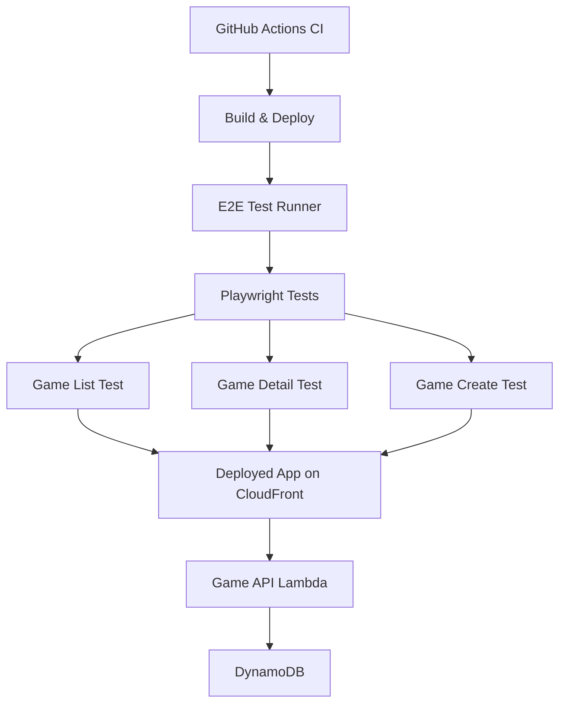
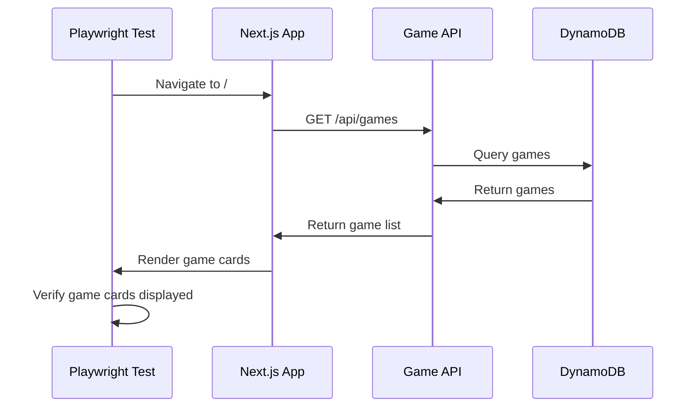
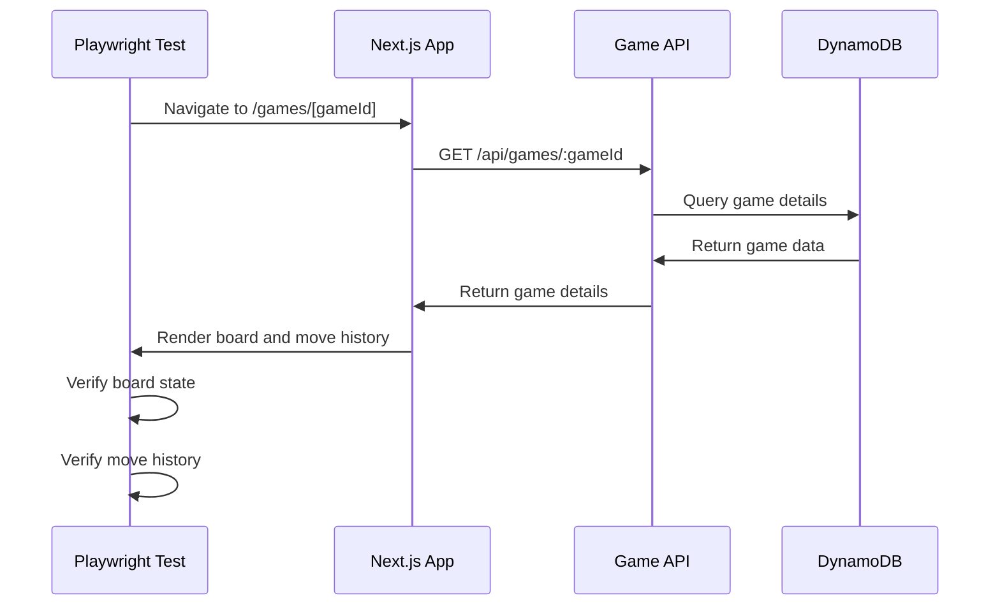
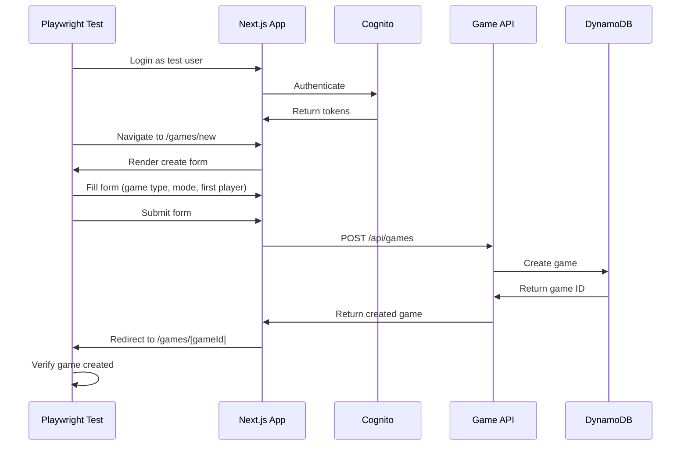

# Design Document: E2E Testing Game Management

## Overview

対局管理機能のE2Eテストは、投票対局アプリケーションの主要なユーザーフローを検証する。既存の認証E2Eテストインフラ（spec 10）を活用し、対局一覧表示、対局詳細表示（盤面・棋譜）、対局作成フローの3つの基本フローをテストする。Playwrightを使用してブラウザ自動化を行い、実際のユーザー操作をシミュレートすることで、フロントエンドとバックエンドの統合動作を保証する。テストはCI/CDパイプラインに統合され、デプロイ前の品質保証として機能する。

## Architecture



## Sequence Diagrams

### Game List Flow



### Game Detail Flow



### Game Create Flow



## Components and Interfaces

### Component 1: E2E Test Suite

**Purpose**: 対局管理機能の主要なハッピーパスを検証する

**Interface**:

```typescript
interface GameE2ETestSuite {
  testGameList(): Promise<void>;
  testGameDetail(): Promise<void>;
  testGameCreate(): Promise<void>;
  setup(): Promise<void>;
  teardown(): Promise<void>;
}
```

**Responsibilities**:

- 対局一覧画面の表示テスト
- 対局詳細画面の表示テスト（盤面、棋譜）
- 対局作成フローのテスト
- テストデータのセットアップとクリーンアップ

### Component 2: Page Objects

**Purpose**: 画面要素へのアクセスを抽象化し、テストコードの保守性を向上させる

**Interface**:

```typescript
interface GameListPage {
  navigate(): Promise<void>;
  getGameCards(): Promise<Locator[]>;
  clickGameCard(index: number): Promise<void>;
  selectTab(tab: 'active' | 'finished'): Promise<void>;
  waitForGamesLoaded(): Promise<void>;
}

interface GameDetailPage {
  navigate(gameId: string): Promise<void>;
  getBoardState(): Promise<string[][]>;
  getMoveHistory(): Promise<Move[]>;
  getDiscCounts(): Promise<{ black: number; white: number }>;
  getCurrentPlayer(): Promise<string>;
  clickShareButton(): Promise<void>;
  clickPostCandidateButton(): Promise<void>;
}

interface GameCreatePage {
  navigate(): Promise<void>;
  selectGameType(type: 'othello'): Promise<void>;
  selectGameMode(mode: 'ai-vs-collective'): Promise<void>;
  selectFirstPlayer(player: 'ai' | 'collective'): Promise<void>;
  clickCreateButton(): Promise<void>;
  waitForRedirect(): Promise<string>;
}
```

**Responsibilities**:

- 画面要素のセレクター管理
- ユーザー操作の抽象化
- 待機処理の統一
- テストコードの可読性向上

### Component 3: Test Helpers

**Purpose**: テストで共通利用するヘルパー関数を提供

**Interface**:

```typescript
interface GameTestHelpers {
  createTestGame(): Promise<TestGame>;
  cleanupTestGame(gameId: string): Promise<void>;
  loginAsTestUser(page: Page): Promise<void>;
  waitForAPIResponse(page: Page, endpoint: string): Promise<Response>;
  verifyBoardState(actual: string[][], expected: string[][]): void;
}

interface TestGame {
  id: string;
  type: 'othello';
  mode: 'ai-vs-collective';
  firstPlayer: 'ai' | 'collective';
  boardState: string[][];
}
```

**Responsibilities**:

- テストゲームデータの生成
- 認証処理の共通化
- API応答の待機
- 盤面状態の検証
- テストデータのクリーンアップ

## Data Models

### Model 1: TestGame

```typescript
interface TestGame {
  id: string; // ゲームID（UUID）
  type: 'othello'; // ゲーム種類（MVP: オセロのみ）
  mode: 'ai-vs-collective'; // 対局モード（MVP: AI vs 集合知のみ）
  firstPlayer: 'ai' | 'collective'; // 先手
  status: 'active' | 'finished'; // 対局状態
  boardState: string[][]; // 盤面状態（8x8配列）
  currentTurn: number; // 現在のターン数
  createdAt: string; // 作成日時（ISO 8601）
}
```

**Validation Rules**:

- id: UUID形式
- type: 'othello'のみ（MVP）
- mode: 'ai-vs-collective'のみ（MVP）
- firstPlayer: 'ai' または 'collective'
- status: 'active' または 'finished'
- boardState: 8x8の2次元配列
- currentTurn: 0以上の整数

### Model 2: Move

```typescript
interface Move {
  turnNumber: number; // ターン番号
  player: 'black' | 'white'; // プレイヤー色
  position: string; // 手の位置（例: "D3"）
  timestamp: string; // 手を打った日時（ISO 8601）
}
```

**Validation Rules**:

- turnNumber: 1以上の整数
- player: 'black' または 'white'
- position: A-H列、1-8行の形式（例: "D3"）
- timestamp: ISO 8601形式

### Model 3: TestConfig

```typescript
interface TestConfig {
  baseURL: string; // テスト対象のアプリケーションURL
  timeout: number; // テストタイムアウト（ミリ秒）
  retries: number; // リトライ回数
  headless: boolean; // ヘッドレスモード
  slowMo: number; // スローモーション（デバッグ用）
  testUser: {
    email: string;
    password: string;
  };
}
```

**Validation Rules**:

- baseURL: 有効なURL形式
- timeout: 正の整数
- retries: 0以上の整数
- testUser.email: 有効なメールアドレス形式
- testUser.password: 8文字以上

## Key Functions with Formal Specifications

### Function 1: testGameList()

```typescript
async function testGameList(page: Page): Promise<void>;
```

**Preconditions:**

- `page` is a valid Playwright Page instance
- Application is accessible at baseURL
- At least one test game exists in the database

**Postconditions:**

- Game list page is successfully loaded
- Game cards are displayed
- Each game card contains required information (title, type, turn, participants, deadline)
- Tab filtering works correctly

**Loop Invariants:** N/A

### Function 2: testGameDetail()

```typescript
async function testGameDetail(page: Page, gameId: string): Promise<void>;
```

**Preconditions:**

- `page` is a valid Playwright Page instance
- `gameId` is a valid game ID that exists in the database
- Application is accessible at baseURL

**Postconditions:**

- Game detail page is successfully loaded
- Board state is correctly displayed (8x8 grid)
- Disc counts are accurate
- Move history is displayed in chronological order
- Current player turn is shown

**Loop Invariants:** N/A

### Function 3: testGameCreate()

```typescript
async function testGameCreate(page: Page, user: TestUser): Promise<string>;
```

**Preconditions:**

- `page` is a valid Playwright Page instance
- `user` is authenticated with valid credentials
- Application is accessible at baseURL

**Postconditions:**

- User is redirected to game create page
- Form is successfully submitted
- New game is created in the database
- User is redirected to the game detail page
- Returns the created game ID

**Loop Invariants:** N/A

### Function 4: verifyBoardState()

```typescript
function verifyBoardState(actual: string[][], expected: string[][]): void;
```

**Preconditions:**

- `actual` is an 8x8 2D array representing the board state
- `expected` is an 8x8 2D array representing the expected board state
- Both arrays contain only valid values: 'black', 'white', or 'empty'

**Postconditions:**

- Throws an error if board states do not match
- Returns void if board states match exactly

**Loop Invariants:**

- For each row i (0 ≤ i < 8): All cells in row i are compared
- For each cell (i, j): actual[i][j] === expected[i][j]

## Algorithmic Pseudocode

### Main Test Execution Algorithm

```typescript
// Main E2E test execution flow for game management
async function runGameE2ETests(config: TestConfig): Promise<TestResult[]> {
  const browser = await chromium.launch({ headless: config.headless });
  const context = await browser.newContext({ baseURL: config.baseURL });
  const page = await context.newPage();
  const results: TestResult[] = [];

  try {
    // Setup: Login as test user
    await loginAsTestUser(page, config.testUser);

    // Test 1: Game List Display
    await testGameList(page);
    results.push({ name: 'Game List Display', status: 'passed', duration: 0 });

    // Test 2: Game Detail Display
    const testGame = await createTestGame();
    await testGameDetail(page, testGame.id);
    results.push({ name: 'Game Detail Display', status: 'passed', duration: 0 });

    // Test 3: Game Creation Flow
    await testGameCreate(page, config.testUser);
    results.push({ name: 'Game Creation Flow', status: 'passed', duration: 0 });

    // Cleanup
    await cleanupTestGame(testGame.id);
  } catch (error) {
    results.push({ name: 'Game E2E Tests', status: 'failed', duration: 0, error });
  } finally {
    await browser.close();
  }

  return results;
}
```

**Preconditions:**

- config contains valid test configuration
- Application is deployed and accessible
- Game API is configured and accessible
- Test user exists in Cognito

**Postconditions:**

- All tests are executed
- Test results are collected
- Browser resources are cleaned up
- Test games are removed from database

**Loop Invariants:**

- Browser context remains valid throughout test execution
- Each test is independent and does not affect others
- Authentication state persists across tests

### Game List Test Algorithm

```typescript
async function testGameList(page: Page): Promise<void> {
  // Navigate to game list page
  await page.goto('/');
  await expect(page.locator('h1')).toContainText('対局一覧');

  // Wait for games to load
  await page.waitForSelector('[data-testid="game-card"]', { timeout: 5000 });

  // Verify game cards are displayed
  const gameCards = page.locator('[data-testid="game-card"]');
  const count = await gameCards.count();
  if (count === 0) {
    throw new Error('No game cards found');
  }

  // Verify first game card contains required information
  const firstCard = gameCards.first();
  await expect(firstCard.locator('[data-testid="game-title"]')).toBeVisible();
  await expect(firstCard.locator('[data-testid="game-type"]')).toBeVisible();
  await expect(firstCard.locator('[data-testid="game-turn"]')).toBeVisible();
  await expect(firstCard.locator('[data-testid="game-participants"]')).toBeVisible();
  await expect(firstCard.locator('[data-testid="game-deadline"]')).toBeVisible();

  // Test tab filtering
  await page.click('[data-testid="tab-finished"]');
  await page.waitForTimeout(500);
  await page.click('[data-testid="tab-active"]');
  await page.waitForTimeout(500);

  // Verify game card is clickable
  await firstCard.click();
  await page.waitForURL(/\/games\/[a-zA-Z0-9-]+/);
}
```

**Preconditions:**

- page is navigated to /
- At least one game exists in the database
- Game API is responding correctly

**Postconditions:**

- Game list page is loaded
- Game cards are displayed with all required information
- Tab filtering works correctly
- Clicking a game card navigates to game detail page

**Loop Invariants:**

- For each game card: All required fields are visible
- Tab state remains consistent during filtering

### Game Detail Test Algorithm

```typescript
async function testGameDetail(page: Page, gameId: string): Promise<void> {
  // Navigate to game detail page
  await page.goto(`/games/${gameId}`);
  await expect(page.locator('h1')).toContainText('オセロ対局');

  // Verify board is displayed
  const board = page.locator('[data-testid="othello-board"]');
  await expect(board).toBeVisible();

  // Verify board has 8x8 grid
  const cells = board.locator('[data-testid="board-cell"]');
  const cellCount = await cells.count();
  if (cellCount !== 64) {
    throw new Error(`Expected 64 cells, found ${cellCount}`);
  }

  // Verify disc counts are displayed
  const blackCount = page.locator('[data-testid="disc-count-black"]');
  const whiteCount = page.locator('[data-testid="disc-count-white"]');
  await expect(blackCount).toBeVisible();
  await expect(whiteCount).toBeVisible();

  // Verify current player is displayed
  const currentPlayer = page.locator('[data-testid="current-player"]');
  await expect(currentPlayer).toBeVisible();

  // Verify move history is displayed
  const moveHistory = page.locator('[data-testid="move-history"]');
  await expect(moveHistory).toBeVisible();

  // Verify move history items
  const moveItems = moveHistory.locator('[data-testid="move-item"]');
  const moveCount = await moveItems.count();
  if (moveCount > 0) {
    const firstMove = moveItems.first();
    await expect(firstMove.locator('[data-testid="move-turn"]')).toBeVisible();
    await expect(firstMove.locator('[data-testid="move-player"]')).toBeVisible();
    await expect(firstMove.locator('[data-testid="move-position"]')).toBeVisible();
  }

  // Verify action buttons are displayed
  await expect(page.locator('[data-testid="share-button"]')).toBeVisible();
  await expect(page.locator('[data-testid="post-candidate-button"]')).toBeVisible();
}
```

**Preconditions:**

- page is valid Playwright Page instance
- gameId is a valid game ID that exists in database
- Game has at least initial board state

**Postconditions:**

- Game detail page is loaded
- Board is displayed with 64 cells (8x8)
- Disc counts are visible and accurate
- Current player turn is shown
- Move history is displayed
- Action buttons are visible

**Loop Invariants:**

- For each board cell: Cell is rendered correctly
- For each move in history: All move fields are visible

### Game Creation Test Algorithm

```typescript
async function testGameCreate(page: Page, user: TestUser): Promise<string> {
  // Navigate to game creation page
  await page.goto('/games/new');
  await expect(page.locator('h1')).toContainText('新規対局作成');

  // Verify form elements are displayed
  await expect(page.locator('[data-testid="game-type-select"]')).toBeVisible();
  await expect(page.locator('[data-testid="game-mode-select"]')).toBeVisible();
  await expect(page.locator('[data-testid="first-player-select"]')).toBeVisible();

  // Select game type (Othello)
  await page.click('[data-testid="game-type-othello"]');

  // Select game mode (AI vs Collective)
  await page.click('[data-testid="game-mode-ai-vs-collective"]');

  // Select first player (AI)
  await page.click('[data-testid="first-player-ai"]');

  // Submit form
  await page.click('[data-testid="create-button"]');

  // Wait for redirect to game detail page
  await page.waitForURL(/\/games\/[a-zA-Z0-9-]+/, { timeout: 10000 });

  // Extract game ID from URL
  const url = page.url();
  const match = url.match(/\/games\/([a-zA-Z0-9-]+)/);
  if (!match) {
    throw new Error('Failed to extract game ID from URL');
  }
  const gameId = match[1];

  // Verify game detail page is loaded
  await expect(page.locator('h1')).toContainText('オセロ対局');
  await expect(page.locator('[data-testid="othello-board"]')).toBeVisible();

  return gameId;
}
```

**Preconditions:**

- page is valid Playwright Page instance
- user is authenticated
- Application is accessible at baseURL
- Game creation form is available

**Postconditions:**

- Game creation form is submitted successfully
- New game is created in database
- User is redirected to game detail page
- Game ID is returned
- Game detail page displays the new game

**Loop Invariants:** N/A

## Example Usage

```typescript
// Example 1: Running game E2E tests locally
import { test, expect } from '@playwright/test';

test.describe('Game Management Flows', () => {
  test('user can view game list', async ({ page }) => {
    await page.goto('/');

    // Wait for games to load
    await page.waitForSelector('[data-testid="game-card"]');

    // Verify game cards are displayed
    const gameCards = page.locator('[data-testid="game-card"]');
    const count = await gameCards.count();
    expect(count).toBeGreaterThan(0);

    // Verify first card has required information
    const firstCard = gameCards.first();
    await expect(firstCard.locator('[data-testid="game-title"]')).toBeVisible();
    await expect(firstCard.locator('[data-testid="game-type"]')).toContainText('オセロ');
  });

  test('user can view game detail with board and move history', async ({ page }) => {
    // Navigate to a test game
    const gameId = 'test-game-id';
    await page.goto(`/games/${gameId}`);

    // Verify board is displayed
    const board = page.locator('[data-testid="othello-board"]');
    await expect(board).toBeVisible();

    // Verify 8x8 grid
    const cells = board.locator('[data-testid="board-cell"]');
    expect(await cells.count()).toBe(64);

    // Verify move history
    const moveHistory = page.locator('[data-testid="move-history"]');
    await expect(moveHistory).toBeVisible();
  });

  test('authenticated user can create a new game', async ({ page }) => {
    // Login first
    await page.goto('/login');
    await page.fill('input[name="email"]', 'test@example.com');
    await page.fill('input[name="password"]', 'TestPass123!');
    await page.click('button[type="submit"]');
    await page.waitForURL('/');

    // Navigate to game creation
    await page.goto('/games/new');

    // Fill form
    await page.click('[data-testid="game-type-othello"]');
    await page.click('[data-testid="game-mode-ai-vs-collective"]');
    await page.click('[data-testid="first-player-ai"]');

    // Submit
    await page.click('[data-testid="create-button"]');

    // Verify redirect to game detail
    await page.waitForURL(/\/games\/[a-zA-Z0-9-]+/);
    await expect(page.locator('[data-testid="othello-board"]')).toBeVisible();
  });
});

// Example 2: Using page objects
import { GameListPage } from './pages/game-list.page';
import { GameDetailPage } from './pages/game-detail.page';

test('user can navigate from list to detail', async ({ page }) => {
  const gameListPage = new GameListPage(page);
  const gameDetailPage = new GameDetailPage(page);

  await gameListPage.navigate();
  await gameListPage.waitForGamesLoaded();
  await gameListPage.clickGameCard(0);

  await gameDetailPage.waitForLoaded();
  const boardState = await gameDetailPage.getBoardState();
  expect(boardState).toHaveLength(8);
  expect(boardState[0]).toHaveLength(8);
});

// Example 3: Using test helpers
import { createTestGame, cleanupTestGame, loginAsTestUser } from './helpers';

test('game detail displays correct board state', async ({ page }) => {
  // Setup
  await loginAsTestUser(page);
  const testGame = await createTestGame();

  try {
    // Test
    await page.goto(`/games/${testGame.id}`);
    const board = page.locator('[data-testid="othello-board"]');
    await expect(board).toBeVisible();

    // Verify initial Othello board state
    const blackDiscs = page.locator('[data-testid="disc-black"]');
    const whiteDiscs = page.locator('[data-testid="disc-white"]');
    expect(await blackDiscs.count()).toBe(2);
    expect(await whiteDiscs.count()).toBe(2);
  } finally {
    // Cleanup
    await cleanupTestGame(testGame.id);
  }
});

// Example 4: CI/CD integration
// In GitHub Actions workflow
steps:
  - name: Run Game E2E tests
    run: pnpm test:e2e:game
    env:
      BASE_URL: ${{ needs.deploy.outputs.cloudfront-url }}
      TEST_USER_EMAIL: ${{ secrets.TEST_USER_EMAIL }}
      TEST_USER_PASSWORD: ${{ secrets.TEST_USER_PASSWORD }}
      CI: true
```

## Correctness Properties

_プロパティは、システムのすべての有効な実行において真であるべき特性または動作です。これらは、人間が読める仕様と機械検証可能な正確性保証との橋渡しとなります。_

### Property 1: Game List Displays All Active Games

_すべての_ アクティブな対局について、対局一覧画面に表示される。

**Validates: Game list display functionality**

### Property 2: Game Cards Contain Required Information

_すべての_ 対局カードについて、タイトル、対局タイプ、ターン数、参加者数、投票締切が表示される。

**Validates: Game card component completeness**

### Property 3: Tab Filtering Works Correctly

_すべての_ タブ選択について、選択されたステータス（進行中/終了）に一致する対局のみが表示される。

**Validates: Tab filtering logic**

### Property 4: Game Detail Displays 8x8 Board

_すべての_ オセロ対局詳細画面について、8x8（64セル）の盤面が表示される。

**Validates: Board rendering correctness**

### Property 5: Disc Counts Are Accurate

_すべての_ 対局詳細画面について、表示される黒石と白石の数が実際の盤面状態と一致する。

**Validates: Disc count calculation**

### Property 6: Move History Is Chronological

_すべての_ 手履歴について、ターン番号の降順（最新が先頭）で表示される。

**Validates: Move history ordering**

### Property 7: Current Player Is Displayed

_すべての_ 進行中の対局について、次の手番のプレイヤー（黒/白、AI/集合知）が表示される。

**Validates: Current player display**

### Property 8: Game Creation Requires Authentication

_すべての_ 対局作成試行について、ユーザーが認証されていない場合はログイン画面にリダイレクトされる。

**Validates: Authentication requirement**

### Property 9: Game Creation Form Has Required Fields

_すべての_ 対局作成フォームについて、ゲーム種類、対局モード、先手選択の3つのフィールドが表示される。

**Validates: Form completeness**

### Property 10: Valid Form Submission Creates Game

_すべての_ 有効なフォーム送信について、新しい対局がデータベースに作成される。

**Validates: Game creation logic**

### Property 11: Successful Creation Redirects to Detail

_すべての_ 成功した対局作成について、ユーザーは作成された対局の詳細画面にリダイレクトされる。

**Validates: Post-creation navigation**

### Property 12: Created Game Has Initial Board State

_すべての_ 新規作成されたオセロ対局について、初期盤面状態（中央4マスに黒2個、白2個）が設定される。

**Validates: Initial game state**

### Property 13: Board Cells Are Clickable in Interactive Mode

_すべての_ インタラクティブモードの盤面について、各セルがクリック可能である。

**Validates: Interactive board functionality**

### Property 14: Share Button Is Visible

_すべての_ 対局詳細画面について、シェアボタンが表示される。

**Validates: Share functionality availability**

### Property 15: Post Candidate Button Is Visible

_すべての_ 進行中の対局詳細画面について、候補投稿ボタンが表示される。

**Validates: Candidate posting availability**

### Property 16: Move History Items Have Required Fields

_すべての_ 手履歴アイテムについて、ターン番号、プレイヤー色、手の位置が表示される。

**Validates: Move history item completeness**

### Property 17: Board State Matches API Response

_すべての_ 対局詳細画面について、表示される盤面状態がAPIレスポンスのboardStateと一致する。

**Validates: Data consistency**

### Property 18: Game List Pagination Works

_すべての_ ページネーション操作について、正しい対局セットが表示される。

**Validates: Pagination logic**

### Property 19: Loading States Are Displayed

_すべての_ データ取得中について、ローディングインジケーターまたはスケルトンが表示される。

**Validates: Loading state handling**

### Property 20: Error Messages Are User-Friendly

_すべての_ エラー発生時について、ユーザーフレンドリーなエラーメッセージが表示される。

**Validates: Error handling**

### Property 21: 404 Errors Show Appropriate Message

_すべての_ 存在しない対局IDへのアクセスについて、「対局が見つかりません」メッセージが表示される。

**Validates: 404 error handling**

### Property 22: Network Errors Are Handled Gracefully

_すべての_ ネットワークエラーについて、「ネットワークエラーが発生しました」メッセージが表示される。

**Validates: Network error handling**

### Property 23: Board Is Responsive

_すべての_ デバイスサイズについて、盤面が適切なサイズで表示される（デスクトップ: 40px、モバイル: 30px）。

**Validates: Responsive design**

### Property 24: Layout Adapts to Screen Size

_すべての_ 画面サイズについて、レイアウトが適切に調整される（デスクトップ: 2カラム、モバイル: 1カラム）。

**Validates: Responsive layout**

### Property 25: Keyboard Navigation Works

_すべての_ インタラクティブ要素について、キーボードでアクセス可能である。

**Validates: Keyboard accessibility**

### Property 26: Focus Indicators Are Visible

_すべての_ フォーカス可能な要素について、フォーカス時に視覚的なインジケーターが表示される。

**Validates: Focus visibility**

### Property 27: ARIA Labels Are Present

_すべての_ 盤面セルについて、適切なARIAラベルが設定されている。

**Validates: Screen reader accessibility**

### Property 28: Test Cleanup Removes Test Games

_すべての_ 完了したE2Eテストについて、テスト用対局がデータベースから削除される。

**Validates: Test data cleanup**

### Property 29: Tests Are Independent

_すべての_ テスト実行について、他のテストの結果に影響されない。

**Validates: Test independence**

### Property 30: Tests Complete Within Timeout

_すべての_ E2Eテストについて、30秒以内に完了する。

**Validates: Performance requirement**

## Error Handling

### Error Scenario 1: Network Failure

**Condition**: アプリケーションまたはAPIへの接続が失敗した場合
**Response**: テストを失敗とマークし、「ネットワークエラーが発生しました」メッセージを出力
**Recovery**: CI環境では自動的に2回までリトライ

### Error Scenario 2: Game API Unavailable

**Condition**: Game APIサービスが利用できない場合
**Response**: テストをスキップし、警告を出力
**Recovery**: 次回のCI実行で再試行

### Error Scenario 3: Test Game Already Exists

**Condition**: テスト用対局が既にデータベースに存在する場合
**Response**: 既存の対局を削除してから再実行
**Recovery**: cleanupTestGame()を実行後、テストを再試行

### Error Scenario 4: Page Load Timeout

**Condition**: ページ読み込みやナビゲーションがタイムアウトした場合
**Response**: スクリーンショットを保存し、テストを失敗とマーク
**Recovery**: タイムアウト値を増やして再実行

### Error Scenario 5: Element Not Found

**Condition**: 期待される要素が見つからない場合
**Response**: 詳細なエラーメッセージとスクリーンショットを保存
**Recovery**: セレクターを確認し、テストコードまたはアプリケーションコードを修正

### Error Scenario 6: Authentication Failure

**Condition**: テストユーザーの認証が失敗した場合
**Response**: テストをスキップし、認証エラーメッセージを出力
**Recovery**: テストユーザーの認証情報を確認し、必要に応じて再作成

### Error Scenario 7: Board State Mismatch

**Condition**: 表示される盤面状態がAPIレスポンスと一致しない場合
**Response**: 期待値と実際の値を詳細に出力し、テストを失敗とマーク
**Recovery**: フロントエンドの盤面レンダリングロジックまたはAPIレスポンスを確認

### Error Scenario 8: Game Creation Failure

**Condition**: 対局作成APIが失敗した場合
**Response**: APIエラーレスポンスを出力し、テストを失敗とマーク
**Recovery**: APIログを確認し、バックエンドの問題を修正

## Testing Strategy

### Unit Testing Approach

E2Eテスト自体のユニットテストは実施しない。代わりに、テストヘルパー関数の単純な動作確認のみ実施。

**Test Coverage Goals**:

- Page Objectsのメソッド: 基本的な動作確認
- Test Helpersの関数: 入力検証と出力確認

### Property-Based Testing Approach

E2Eテストでは実施しない。ユニットテストレベルで実施済み。

**Property Test Library**: N/A

### Integration Testing Approach

E2Eテストが統合テストの役割を果たす。以下の統合ポイントをテスト:

1. **Frontend ↔ Game API**: 対局管理APIエンドポイントとの通信
2. **Game API ↔ DynamoDB**: データベースとの統合
3. **Frontend ↔ Next.js Router**: ページ遷移とルーティング
4. **Frontend ↔ Board Component**: 盤面コンポーネントのレンダリング

**Test Coverage Goals**:

- 主要な対局管理フロー: 100%
- エラーハンドリング: 主要なエラーケースのみ
- エッジケース: 対象外（ユニットテストでカバー）

**Test Scenarios**:

- 対局一覧の表示と絞り込み
- 対局詳細の表示（盤面、手履歴、石の数）
- 対局作成フロー（認証、フォーム入力、送信、リダイレクト）
- レスポンシブデザインの動作確認（デスクトップ/モバイル）
- エラーハンドリング（404、ネットワークエラー）

## Performance Considerations

- **Parallel Execution**: CI環境では1ワーカー、ローカルでは並列実行可能
- **Test Duration**: 各テストは30秒以内に完了すること
- **Resource Cleanup**: テスト終了後は必ずブラウザとテスト対局をクリーンアップ
- **Retry Strategy**: CI環境では失敗時に2回までリトライ
- **Headless Mode**: CI環境ではヘッドレスモードで実行し、リソース消費を削減
- **Selective Testing**: 最低限の主要フローのみをテスト（WBSの指示通り）
- **API Response Caching**: 可能な場合はAPIレスポンスをキャッシュして高速化

## Security Considerations

- **Test Credentials**: テスト用の認証情報はGitHub Secretsで管理
- **Test Game Cleanup**: テスト終了後は必ずテスト対局を削除
- **Environment Isolation**: 本番環境ではE2Eテストを実行しない
- **Sensitive Data**: スクリーンショットやログにパスワードが含まれないよう注意
- **API Keys**: Game APIキーは環境変数で管理し、コードにハードコードしない
- **Test Data Isolation**: テスト用対局は本番データと明確に区別できるようにする

## Dependencies

- **@playwright/test**: ^1.58.2 (既存)
- **AWS SDK**: テスト対局のクリーンアップ用（必要に応じて）
- **GitHub Actions**: CI/CD統合
- **CloudFront**: デプロイされたアプリケーション
- **Game API (Lambda + Hono)**: 対局管理API
- **Amazon DynamoDB**: データベース
- **Next.js 16**: フロントエンドフレームワーク
- **React 19**: UIライブラリ
- **Tailwind CSS**: スタイリング
- **shadcn/ui**: UIコンポーネント

## Test File Structure

```
tests/
├── e2e/
│   ├── game/
│   │   ├── game-list.spec.ts          # 対局一覧テスト
│   │   ├── game-detail.spec.ts        # 対局詳細テスト
│   │   └── game-create.spec.ts        # 対局作成テスト
│   ├── pages/
│   │   ├── game-list.page.ts          # 対局一覧ページオブジェクト
│   │   ├── game-detail.page.ts        # 対局詳細ページオブジェクト
│   │   └── game-create.page.ts        # 対局作成ページオブジェクト
│   └── helpers/
│       ├── game.helper.ts             # 対局関連ヘルパー
│       └── auth.helper.ts             # 認証ヘルパー（既存）
└── playwright.config.ts               # Playwright設定（既存）
```

## CI/CD Integration

### GitHub Actions Workflow

```yaml
name: E2E Tests - Game Management

on:
  workflow_run:
    workflows: ['Deploy']
    types:
      - completed

jobs:
  e2e-game:
    runs-on: ubuntu-latest
    if: ${{ github.event.workflow_run.conclusion == 'success' }}

    steps:
      - uses: actions/checkout@v4

      - name: Setup Node.js
        uses: actions/setup-node@v4
        with:
          node-version: '20'

      - name: Install pnpm
        uses: pnpm/action-setup@v2
        with:
          version: 8

      - name: Install dependencies
        run: pnpm install

      - name: Install Playwright browsers
        run: pnpm exec playwright install --with-deps chromium

      - name: Run game E2E tests
        run: pnpm test:e2e:game
        env:
          BASE_URL: ${{ needs.deploy.outputs.cloudfront-url }}
          TEST_USER_EMAIL: ${{ secrets.TEST_USER_EMAIL }}
          TEST_USER_PASSWORD: ${{ secrets.TEST_USER_PASSWORD }}
          CI: true

      - name: Upload test results
        if: always()
        uses: actions/upload-artifact@v4
        with:
          name: playwright-report-game
          path: playwright-report/
          retention-days: 30

      - name: Upload screenshots
        if: failure()
        uses: actions/upload-artifact@v4
        with:
          name: playwright-screenshots-game
          path: test-results/
          retention-days: 30
```

## Test Data Strategy

### Test Game Creation

テスト用対局は以下の特徴を持つ:

- タイトルに `[TEST]` プレフィックスを付与
- 作成日時にタイムスタンプを含める
- テスト終了後に自動削除

### Test Game Cleanup

```typescript
async function cleanupTestGame(gameId: string): Promise<void> {
  try {
    await fetch(`${config.apiURL}/api/games/${gameId}`, {
      method: 'DELETE',
      headers: {
        Authorization: `Bearer ${accessToken}`,
      },
    });
  } catch (error) {
    console.error(`Failed to cleanup test game ${gameId}:`, error);
    // Continue execution even if cleanup fails
  }
}
```

### Isolation Strategy

- 各テストは独立したテスト対局を使用
- テスト間でデータを共有しない
- テスト終了後は必ずクリーンアップ
- 並列実行時のリソース競合を回避
