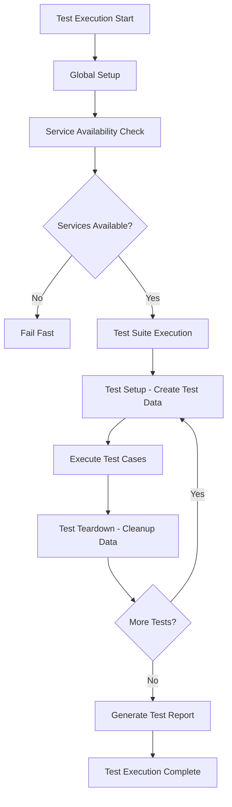
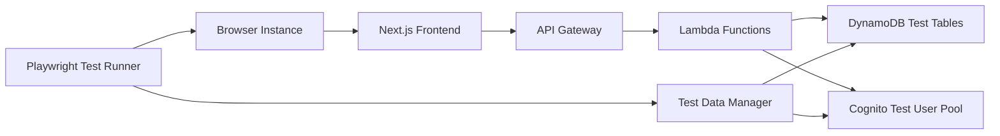

# Design Document: E2E Testing Main Flows

## Overview

This design document specifies the technical implementation approach for End-to-End (E2E) testing of the Vote Board Game application's main user flows using Playwright. The E2E test suite validates critical user journeys from the browser perspective, ensuring that the integrated system works correctly across the frontend, API, and database layers.

The design focuses on creating reliable, maintainable, and efficient E2E tests that can run in both local development and CI/CD environments. The test suite will cover authentication, game participation, voting, profile management, social sharing, and error handling flows.

### Goals

- Validate complete user flows from browser to backend
- Ensure cross-browser compatibility (Chromium, Firefox, WebKit)
- Provide fast feedback in CI/CD pipelines (< 10 minutes for full suite)
- Create stable, non-flaky tests using best practices
- Support both headless and visual debugging modes
- Generate comprehensive test reports with screenshots on failure

### Non-Goals

- Unit testing of individual components (covered by Vitest)
- API contract testing (covered by API tests)
- Performance load testing
- Visual regression testing
- Accessibility testing (will be addressed separately)

## Architecture

### Test Structure

The E2E test suite follows a modular architecture with clear separation of concerns:

```
packages/web/e2e/
├── auth/                    # Authentication flow tests
│   ├── login.spec.ts
│   ├── registration.spec.ts
│   └── password-reset.spec.ts
├── game/                    # Game viewing and participation tests
│   ├── game-list.spec.ts
│   ├── game-detail.spec.ts
│   └── game-join.spec.ts
├── voting/                  # Voting flow tests
│   ├── vote-submission.spec.ts
│   ├── candidate-submission.spec.ts
│   └── vote-validation.spec.ts
├── profile/                 # Profile management tests
│   └── profile-management.spec.ts
├── sharing/                 # Social sharing tests
│   ├── share-url.spec.ts
│   └── ogp-validation.spec.ts
├── error-handling/          # Error scenario tests
│   ├── network-errors.spec.ts
│   ├── session-timeout.spec.ts
│   └── validation-errors.spec.ts
├── fixtures/                # Playwright fixtures
│   ├── authenticated-user.ts
│   ├── test-game.ts
│   └── test-data.ts
├── helpers/                 # Test utilities
│   ├── test-user.ts
│   ├── cleanup.ts
│   ├── cognito-availability.ts
│   └── network-error.ts
├── page-objects/            # Page Object Models
│   ├── login-page.ts
│   ├── registration-page.ts
│   ├── game-list-page.ts
│   ├── game-detail-page.ts
│   ├── voting-page.ts
│   └── profile-page.ts
├── global-setup.ts          # Global test setup
└── playwright.config.ts     # Playwright configuration
```

### Test Execution Flow



### Test Environment Architecture



## Components and Interfaces

### Page Object Models

Page Object Models (POMs) encapsulate page-specific selectors and interactions, providing a clean API for test cases.

#### LoginPage

```typescript
export class LoginPage {
  constructor(private page: Page);

  // Navigation
  async goto(): Promise<void>;

  // Actions
  async fillEmail(email: string): Promise<void>;
  async fillPassword(password: string): Promise<void>;
  async clickSubmit(): Promise<void>;
  async login(email: string, password: string): Promise<void>;
  async clickForgotPassword(): Promise<void>;

  // Assertions
  async expectErrorMessage(message: string): Promise<void>;
  async expectRedirectToGameList(): Promise<void>;
}
```

#### RegistrationPage

```typescript
export class RegistrationPage {
  constructor(private page: Page);

  // Navigation
  async goto(): Promise<void>;

  // Actions
  async fillEmail(email: string): Promise<void>;
  async fillPassword(password: string): Promise<void>;
  async fillConfirmPassword(password: string): Promise<void>;
  async clickSubmit(): Promise<void>;
  async register(email: string, password: string): Promise<void>;

  // Assertions
  async expectErrorMessage(message: string): Promise<void>;
  async expectRedirectToLogin(): Promise<void>;
}
```

#### GameListPage

```typescript
export class GameListPage {
  constructor(private page: Page);

  // Navigation
  async goto(): Promise<void>;

  // Actions
  async clickGame(gameId: string): Promise<void>;
  async getActiveGames(): Promise<string[]>;

  // Assertions
  async expectAtLeastOneGame(): Promise<void>;
  async expectGameVisible(gameId: string): Promise<void>;
}
```

#### GameDetailPage

```typescript
export class GameDetailPage {
  constructor(private page: Page);

  // Navigation
  async goto(gameId: string): Promise<void>;

  // Actions
  async clickJoinGame(): Promise<void>;
  async clickShare(): Promise<void>;
  async getShareUrl(): Promise<string>;

  // Assertions
  async expectBoardStateVisible(): Promise<void>;
  async expectMoveHistoryVisible(): Promise<void>;
  async expectAICommentaryVisible(): Promise<void>;
  async expectJoinButtonVisible(): Promise<void>;
}
```

#### VotingPage

```typescript
export class VotingPage {
  constructor(private page: Page);

  // Navigation
  async goto(gameId: string): Promise<void>;

  // Actions
  async selectCandidate(candidateId: string): Promise<void>;
  async submitVote(): Promise<void>;
  async vote(candidateId: string): Promise<void>;
  async fillCandidateDescription(description: string): Promise<void>;
  async submitNewCandidate(description: string): Promise<void>;

  // Assertions
  async expectCandidatesVisible(): Promise<void>;
  async expectCandidateDescription(candidateId: string, description: string): Promise<void>;
  async expectSuccessMessage(): Promise<void>;
  async expectErrorMessage(message: string): Promise<void>;
  async expectCandidateInList(description: string): Promise<void>;
}
```

#### ProfilePage

```typescript
export class ProfilePage {
  constructor(private page: Page);

  // Navigation
  async goto(): Promise<void>;

  // Actions
  async fillDisplayName(name: string): Promise<void>;
  async submitUpdate(): Promise<void>;
  async updateProfile(data: ProfileData): Promise<void>;

  // Assertions
  async expectProfileDataVisible(data: ProfileData): Promise<void>;
  async expectVotingHistoryVisible(): Promise<void>;
  async expectSuccessMessage(): Promise<void>;
  async expectErrorMessage(message: string): Promise<void>;
}
```

### Test Fixtures

Playwright fixtures provide reusable test setup and teardown logic.

#### Authenticated User Fixture

```typescript
export const authenticatedUser = base.extend<{
  authenticatedPage: Page;
  testUser: TestUser;
}>({
  authenticatedPage: async ({ page }, use) => {
    const testUser = await createTestUser();
    await loginUser(page, testUser);
    await use(page);
    await cleanupTestUser(testUser);
  },
  testUser: async ({}, use) => {
    const testUser = await createTestUser();
    await use(testUser);
    await cleanupTestUser(testUser);
  },
});
```

#### Test Game Fixture

```typescript
export const testGame = base.extend<{
  game: TestGame;
}>({
  game: async ({}, use) => {
    const game = await createTestGame();
    await use(game);
    await cleanupTestGame(game);
  },
});
```

### Test Helpers

#### Test User Manager

```typescript
export interface TestUser {
  email: string;
  password: string;
  userId: string;
}

export async function createTestUser(): Promise<TestUser>;
export async function cleanupTestUser(user: TestUser): Promise<void>;
export async function loginUser(page: Page, user: TestUser): Promise<void>;
```

#### Test Data Manager

```typescript
export interface TestGame {
  gameId: string;
  status: 'active' | 'completed';
  candidates: TestCandidate[];
}

export interface TestCandidate {
  candidateId: string;
  description: string;
  moveData: string;
}

export async function createTestGame(): Promise<TestGame>;
export async function createTestCandidate(gameId: string): Promise<TestCandidate>;
export async function cleanupTestGame(game: TestGame): Promise<void>;
```

#### Cognito Availability Checker

```typescript
export async function checkCognitoAvailability(): Promise<boolean>;
export async function waitForCognitoAvailability(timeout: number): Promise<void>;
```

#### Network Error Simulator

```typescript
export async function simulateNetworkError(page: Page, urlPattern: string): Promise<void>;
export async function simulateSlowNetwork(page: Page, delay: number): Promise<void>;
```

### Global Setup

The global setup runs once before all tests to verify service availability:

```typescript
export default async function globalSetup() {
  // Check if test environment is accessible
  const baseURL = process.env.BASE_URL;
  if (!baseURL) {
    throw new Error('BASE_URL environment variable is required');
  }

  // Check if frontend is accessible
  const response = await fetch(baseURL);
  if (!response.ok) {
    throw new Error(`Frontend not accessible at ${baseURL}`);
  }

  // Check if Cognito is accessible
  await waitForCognitoAvailability(30000);

  console.log('✓ Test environment is ready');
}
```

## Data Models

### Test User Data

```typescript
interface TestUser {
  email: string; // Unique email for test user
  password: string; // Test password (meets Cognito requirements)
  userId: string; // Cognito user ID
  displayName?: string; // Optional display name
}
```

### Test Game Data

```typescript
interface TestGame {
  gameId: string; // Unique game identifier
  status: 'active' | 'completed'; // Game status
  boardState: string; // Current board state (JSON)
  candidates: TestCandidate[]; // Move candidates
  moveHistory: Move[]; // Previous moves
  aiCommentary: string; // AI-generated commentary
  votingDeadline: string; // ISO timestamp
}

interface TestCandidate {
  candidateId: string; // Unique candidate identifier
  description: string; // Candidate description (max 200 chars)
  moveData: string; // Move data (JSON)
  voteCount: number; // Current vote count
}

interface Move {
  moveId: string; // Unique move identifier
  moveData: string; // Move data (JSON)
  timestamp: string; // ISO timestamp
}
```

### Test Profile Data

```typescript
interface ProfileData {
  displayName: string; // User display name
  votingHistory: Vote[]; // User's voting history
}

interface Vote {
  gameId: string; // Game identifier
  candidateId: string; // Voted candidate identifier
  timestamp: string; // ISO timestamp
}
```
