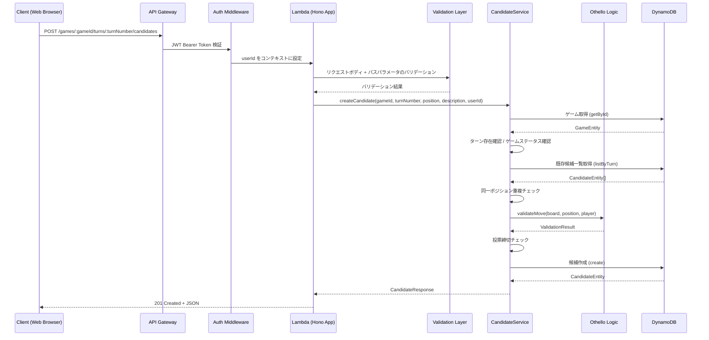

# Design Document: 候補投稿 API

## Overview

候補投稿APIは、投票対局アプリケーションにおいて、認証済みユーザーが特定の対局の特定のターンに対して次の一手の候補を投稿するためのRESTful APIエンドポイントです。このAPIは、Honoフレームワークを使用してAWS Lambda上で実行され、リクエストのバリデーション、オセロのルールに基づく手の有効性検証、DynamoDBへの候補データの保存を行います。

ユーザーは投票したい手が候補一覧にない場合、自ら候補を投稿できます。候補には位置情報（"row,col"形式）と200文字以内の説明文を含めます。同じポジションの候補が既に存在する場合は409 Conflictエラーを返し、投票締切済みのターンへの投稿は400エラーで拒否します。

## Architecture

### システム構成



### レイヤー構成

既存のアーキテクチャパターンに従い、以下のレイヤーで構成します：

1. **ルーティングレイヤー** (`routes/candidates.ts`)
   - HTTPリクエストの受信とレスポンスの返却
   - パスパラメータとリクエストボディのバリデーション
   - 認証コンテキストからのuserId取得
   - エラーハンドリング

2. **サービスレイヤー** (`services/candidate.ts`)
   - ビジネスロジックの実装
   - ゲーム存在確認、ターン存在確認
   - 同一ポジション重複チェック
   - オセロルールに基づく手の有効性検証
   - 投票締切チェック
   - 候補の作成

3. **リポジトリレイヤー** (`lib/dynamodb/repositories/candidate.ts`)
   - DynamoDBへのデータアクセス
   - 候補の作成（PutCommand）
   - 既存候補の取得（QueryCommand）

4. **スキーマレイヤー** (`schemas/candidate.ts`)
   - リクエストボディのバリデーション定義
   - パスパラメータのバリデーション定義

5. **オセロロジックレイヤー** (`lib/othello/`)
   - 手の有効性検証（validateMove）
   - 盤面状態の解析

## Components and Interfaces

### API Endpoint

#### POST /api/games/:gameId/turns/:turnNumber/candidates

認証済みユーザーが次の一手の候補を投稿します。

**Path Parameters:**

| Parameter  | Type   | Required | Description | Validation        |
| ---------- | ------ | -------- | ----------- | ----------------- |
| gameId     | string | Yes      | 対局ID      | UUID v4形式       |
| turnNumber | number | Yes      | ターン番号  | 正の整数（0以上） |

**Request Body:**

| Field       | Type   | Required | Description           | Validation               |
| ----------- | ------ | -------- | --------------------- | ------------------------ |
| position    | string | Yes      | 位置（"row,col"形式） | オセロ盤面内の有効な位置 |
| description | string | Yes      | 説明文                | 1〜200文字               |

**Request Example:**

```json
{
  "position": "2,3",
  "description": "攻撃的な手。相手の陣地を削る。"
}
```

**Response (201 Created):**

```json
{
  "candidateId": "890e1234-e89b-12d3-a456-426614174003",
  "gameId": "456e7890-e89b-12d3-a456-426614174001",
  "turnNumber": 5,
  "position": "2,3",
  "description": "攻撃的な手。相手の陣地を削る。",
  "voteCount": 0,
  "createdBy": "USER#123e4567-e89b-12d3-a456-426614174000",
  "status": "VOTING",
  "votingDeadline": "2025-02-20T00:00:00.000Z",
  "createdAt": "2025-02-19T15:30:00.000Z"
}
```

**Error Responses:**

- 400 VALIDATION_ERROR: バリデーションエラー
- 400 INVALID_MOVE: オセロルール上無効な手
- 400 VOTING_CLOSED: 投票締切済み
- 401 UNAUTHORIZED: 認証エラー
- 404 NOT_FOUND: ゲームまたはターンが存在しない
- 409 CONFLICT: 同じポジションの候補が既に存在
- 500 INTERNAL_ERROR: サーバー内部エラー

### Type Definitions

#### PostCandidateRequest

```typescript
interface PostCandidateRequest {
  position: string; // "row,col" 形式（例: "2,3"）
  description: string; // 1〜200文字の説明文
}
```

#### PostCandidateResponse

```typescript
interface PostCandidateResponse {
  candidateId: string;
  gameId: string;
  turnNumber: number;
  position: string;
  description: string;
  voteCount: number;
  createdBy: string;
  status: 'VOTING';
  votingDeadline: string;
  createdAt: string;
}
```

#### PathParams

```typescript
interface PostCandidatePathParams {
  gameId: string; // UUID v4形式
  turnNumber: string; // 数値文字列（"0", "1", "2", ...）
}
```

### Service Interface

#### CandidateService（既存クラスにメソッド追加）

```typescript
class CandidateService {
  /**
   * 候補を投稿
   * @param gameId - 対局ID
   * @param turnNumber - ターン番号
   * @param position - 位置（"row,col"形式）
   * @param description - 説明文
   * @param userId - 投稿者のユーザーID
   * @returns 作成された候補のレスポンス
   * @throws GameNotFoundError - ゲームが存在しない場合
   * @throws TurnNotFoundError - ターンが存在しない場合
   * @throws InvalidMoveError - オセロルール上無効な手の場合
   * @throws VotingClosedError - 投票締切済みの場合
   * @throws DuplicatePositionError - 同じポジションの候補が既に存在する場合
   */
  async createCandidate(
    gameId: string,
    turnNumber: number,
    position: string,
    description: string,
    userId: string
  ): Promise<PostCandidateResponse>;
}
```

### Repository Interface

既存の `CandidateRepository` の `create` メソッドと `listByTurn` メソッドを使用します。新規メソッドの追加は不要です。

```typescript
// 既存メソッド（変更なし）
class CandidateRepository extends BaseRepository {
  async create(params: {
    candidateId: string;
    gameId: string;
    turnNumber: number;
    position: string;
    description: string;
    createdBy: string;
    votingDeadline: string;
  }): Promise<CandidateEntity>;

  async listByTurn(gameId: string, turnNumber: number): Promise<CandidateEntity[]>;
}
```

## Data Models

### DynamoDB Table Structure

既存のSingle Table Designパターンに従います。候補投稿時に作成されるエンティティは、候補一覧取得APIと同じ `CandidateEntity` です。

#### Candidate Entity（新規作成時）

| Attribute      | Type   | Value                                       |
| -------------- | ------ | ------------------------------------------- |
| PK             | String | `GAME#<gameId>#TURN#<turnNumber>`           |
| SK             | String | `CANDIDATE#<candidateId>`                   |
| entityType     | String | `CANDIDATE`                                 |
| candidateId    | String | UUID v4（新規生成）                         |
| gameId         | String | パスパラメータから取得                      |
| turnNumber     | Number | パスパラメータから取得                      |
| position       | String | リクエストボディから取得（"row,col"形式）   |
| description    | String | リクエストボディから取得（最大200文字）     |
| voteCount      | Number | 0（初期値）                                 |
| createdBy      | String | `USER#<userId>`（認証コンテキストから取得） |
| status         | String | `VOTING`（初期値）                          |
| votingDeadline | String | 当日のJST 23:59:59.999（ISO 8601形式）      |
| createdAt      | String | 現在時刻（ISO 8601形式）                    |
| updatedAt      | String | 現在時刻（ISO 8601形式）                    |
| GSI2PK         | String | `USER#<userId>`                             |
| GSI2SK         | String | `CANDIDATE#<createdAt>`                     |

### 投票締切の算出ロジック

投票締切は、ゲームの既存候補から取得します。既存候補がある場合はその `votingDeadline` を使用し、ない場合は当日のJST 23:59:59.999Z を設定します。

```typescript
function calculateVotingDeadline(existingCandidates: CandidateEntity[]): string {
  if (existingCandidates.length > 0) {
    return existingCandidates[0].votingDeadline;
  }
  // 当日のJST 23:59:59.999 をUTCに変換
  const now = new Date();
  const jstOffset = 9 * 60 * 60 * 1000;
  const jstNow = new Date(now.getTime() + jstOffset);
  const jstEndOfDay = new Date(
    jstNow.getFullYear(),
    jstNow.getMonth(),
    jstNow.getDate(),
    23,
    59,
    59,
    999
  );
  const utcDeadline = new Date(jstEndOfDay.getTime() - jstOffset);
  return utcDeadline.toISOString();
}
```

### ポジション形式の変換

API設計ドキュメントでは `"E3"` のようなチェス記法が使われていますが、内部的には `"row,col"` 形式（例: `"2,3"`）で保存されています（既存の候補一覧取得APIと一致）。リクエストでは `"row,col"` 形式を受け付けます。

## Key Functions with Formal Specifications

### Function 1: createCandidate()

```typescript
async function createCandidate(
  gameId: string,
  turnNumber: number,
  position: string,
  description: string,
  userId: string
): Promise<PostCandidateResponse>;
```

**Preconditions:**

- `gameId` は有効なUUID v4形式
- `turnNumber` は0以上の整数
- `position` は "row,col" 形式で、row/col は 0〜7 の整数
- `description` は1〜200文字の文字列
- `userId` は認証済みユーザーのID

**Postconditions:**

- 成功時: DynamoDBに新しいCandidateEntityが作成される
- 成功時: 返却されるレスポンスの `voteCount` は 0
- 成功時: 返却されるレスポンスの `status` は `"VOTING"`
- 成功時: 返却されるレスポンスの `createdBy` は `"USER#<userId>"`
- ゲーム未存在時: `GameNotFoundError` がスローされる
- ターン未存在時: `TurnNotFoundError` がスローされる
- 無効な手の場合: `InvalidMoveError` がスローされる
- 投票締切済みの場合: `VotingClosedError` がスローされる
- 重複ポジションの場合: `DuplicatePositionError` がスローされる

### Function 2: validatePosition()

```typescript
function validatePosition(position: string): { row: number; col: number } | null;
```

**Preconditions:**

- `position` は任意の文字列

**Postconditions:**

- "row,col" 形式で row/col が 0〜7 の整数の場合: `{ row, col }` を返す
- それ以外の場合: `null` を返す
- 入力文字列は変更されない

### Function 3: checkVotingDeadline()

```typescript
function checkVotingDeadline(candidates: CandidateEntity[]): boolean;
```

**Preconditions:**

- `candidates` は CandidateEntity の配列（空配列も可）

**Postconditions:**

- 候補が存在し、最初の候補の `votingDeadline` が現在時刻より前の場合: `true`（締切済み）
- それ以外の場合: `false`（投票可能）

## Algorithmic Pseudocode

### 候補投稿アルゴリズム

```typescript
async function createCandidate(gameId, turnNumber, position, description, userId) {
  // Step 1: ゲームの存在確認
  const game = await gameRepository.getById(gameId);
  if (!game) throw new GameNotFoundError(gameId);

  // Step 2: ゲームがアクティブであることを確認
  if (game.status !== 'ACTIVE') throw new VotingClosedError();

  // Step 3: ターンの存在確認
  if (turnNumber > game.currentTurn) throw new TurnNotFoundError(gameId, turnNumber);

  // Step 4: 既存候補の取得
  const existingCandidates = await candidateRepository.listByTurn(gameId, turnNumber);

  // Step 5: 投票締切チェック
  if (isVotingClosed(existingCandidates)) throw new VotingClosedError();

  // Step 6: 同一ポジション重複チェック
  const duplicate = existingCandidates.find((c) => c.position === position);
  if (duplicate) throw new DuplicatePositionError(position);

  // Step 7: ポジションのパース
  const parsed = parsePosition(position); // { row, col }

  // Step 8: オセロルールに基づく手の有効性検証
  const board = JSON.parse(game.boardState).board;
  const currentPlayer = determineCurrentPlayer(game);
  const validation = validateMove(board, parsed, currentPlayer);
  if (!validation.valid) throw new InvalidMoveError(position, validation.reason);

  // Step 9: 投票締切の算出
  const votingDeadline = calculateVotingDeadline(existingCandidates);

  // Step 10: 候補の作成
  const candidateId = generateUUID();
  const entity = await candidateRepository.create({
    candidateId,
    gameId,
    turnNumber,
    position,
    description,
    createdBy: `USER#${userId}`,
    votingDeadline,
  });

  // Step 11: レスポンスの構築
  return toCandidateResponse(entity, gameId, turnNumber);
}
```

### 現在のプレイヤー判定ロジック

```typescript
function determineCurrentPlayer(game: GameEntity): Player {
  // AI側の反対側が集合知（ユーザー）側
  // currentTurn が偶数なら BLACK の手番、奇数なら WHITE の手番
  // ただし、ユーザーが投稿できるのは集合知側のターンのみ
  // game.aiSide が 'BLACK' なら集合知は WHITE
  // game.aiSide が 'WHITE' なら集合知は BLACK
  const collectiveSide = game.aiSide === 'BLACK' ? CellState.White : CellState.Black;
  return collectiveSide;
}
```

## Example Usage

```typescript
// Example 1: 正常な候補投稿
const res = await app.request(
  '/api/games/550e8400-e29b-41d4-a716-446655440000/turns/5/candidates',
  {
    method: 'POST',
    headers: {
      'Content-Type': 'application/json',
      Authorization: 'Bearer <valid-jwt-token>',
    },
    body: JSON.stringify({
      position: '2,3',
      description: '攻撃的な手。相手の陣地を削る。',
    }),
  }
);
// res.status === 201
// res.body.candidateId is UUID
// res.body.voteCount === 0
// res.body.status === 'VOTING'

// Example 2: バリデーションエラー（説明文が200文字超過）
const res2 = await app.request(
  '/api/games/550e8400-e29b-41d4-a716-446655440000/turns/5/candidates',
  {
    method: 'POST',
    headers: {
      'Content-Type': 'application/json',
      Authorization: 'Bearer <valid-jwt-token>',
    },
    body: JSON.stringify({
      position: '2,3',
      description: 'a'.repeat(201),
    }),
  }
);
// res2.status === 400
// res2.body.error === 'VALIDATION_ERROR'

// Example 3: 重複ポジションエラー
// 既に position "2,3" の候補が存在する場合
const res3 = await app.request(/* same position */);
// res3.status === 409
// res3.body.error === 'CONFLICT'

// Example 4: 認証なしでのアクセス
const res4 = await app.request(
  '/api/games/550e8400-e29b-41d4-a716-446655440000/turns/5/candidates',
  {
    method: 'POST',
    headers: { 'Content-Type': 'application/json' },
    body: JSON.stringify({ position: '2,3', description: 'テスト' }),
  }
);
// res4.status === 401
// res4.body.error === 'UNAUTHORIZED'
```

## Correctness Properties

_プロパティとは、システムのすべての有効な実行において真であるべき特性や動作のことです。プロパティは人間が読める仕様と機械的に検証可能な正確性保証の橋渡しとなります。_

### Property 1: 認証必須

_For any_ POST /games/:gameId/turns/:turnNumber/candidates リクエストに対して、認証トークンが存在しないまたは無効な場合、APIはステータスコード401を返す

**Validates: Requirements 1.1, 1.2**

### Property 2: リクエストボディのバリデーション

_For any_ 不正なリクエストボディ（position が "row,col" 形式でない、row/col が 0〜7 の範囲外、description が空文字列または200文字超過）に対して、APIはステータスコード400のVALIDATION_ERRORを返す

**Validates: Requirements 2.3, 2.4, 2.5, 2.6, 2.7**

### Property 3: パスパラメータのバリデーション

_For any_ UUID形式でないgameIdまたは0以上の整数でないturnNumberに対して、APIはステータスコード400のVALIDATION_ERRORを返す

**Validates: Requirements 2.1, 2.2, 2.7**

### Property 4: ゲーム・ターン存在確認

_For any_ 存在しないgameId、または存在するゲームの currentTurn より大きい turnNumber に対して、APIはステータスコード404のNOT_FOUNDエラーを返す

**Validates: Requirements 3.1, 3.2, 3.3**

### Property 5: 無効な手の拒否

_For any_ オセロルール上無効な位置（既に石がある、石を裏返せない）に対して、APIはステータスコード400のINVALID_MOVEエラーを返す

**Validates: Requirements 5.1, 5.2, 5.3**

### Property 6: 投票締切チェック

_For any_ 投票締切を過ぎたターンへの候補投稿、またはステータスが "ACTIVE" でない対局への投稿に対して、APIはステータスコード400のVOTING_CLOSEDエラーを返す

**Validates: Requirements 4.1, 4.2, 4.3**

### Property 7: 同一ポジション重複拒否

_For any_ 同じターンに同じポジションの候補が既に存在する場合、APIはステータスコード409のCONFLICTエラーを返す

**Validates: Requirements 6.1, 6.2**

### Property 8: 成功レスポンスの形式

_For any_ 有効なリクエストに対して、APIはステータスコード201を返し、candidateId, gameId, turnNumber, position, description, voteCount, createdBy, status, votingDeadline, createdAt のすべてのフィールドを含むJSONレスポンスを返す。日時フィールドはISO 8601形式である。

**Validates: Requirements 8.1, 8.2, 8.3, 8.4**

### Property 9: 初期値の正確性

_For any_ 正常に作成された候補に対して、voteCount は 0、status は "VOTING"、createdBy は "USER#<userId>" 形式、candidateId は UUID v4 形式である

**Validates: Requirements 7.2, 7.3, 7.4, 7.5**

### Property 10: 説明文の長さ制約

_For any_ 正常に作成された候補に対して、description の長さは1文字以上200文字以下である

**Validates: Requirements 2.5, 2.6, 8.3**

### Property 11: エラーレスポンスの一貫性

_For any_ エラーレスポンスに対して、`{ error: string, message: string }` の構造を持つJSONが返される

**Validates: Requirements 9.1**

## Error Handling

### エラーの種類と処理

#### 1. 認証エラー (401 Unauthorized)

**発生条件:**

- Authorizationヘッダーが存在しない
- Bearer トークンが無効または期限切れ

**レスポンス形式:**

```json
{
  "error": "UNAUTHORIZED",
  "message": "Authorization header is required"
}
```

**処理方法:**

- 既存の認証ミドルウェア（`createAuthMiddleware`）が処理
- ルーティングレイヤーに到達する前にレスポンスを返す

#### 2. バリデーションエラー (400 Bad Request)

**発生条件:**

- gameIdがUUID v4形式でない
- turnNumberが正の整数でない
- positionが "row,col" 形式でない、または範囲外
- descriptionが空文字列または200文字超過

**レスポンス形式:**

```json
{
  "error": "VALIDATION_ERROR",
  "message": "Validation failed",
  "details": {
    "fields": {
      "description": "Description must be between 1 and 200 characters"
    }
  }
}
```

#### 3. 無効な手エラー (400 Bad Request)

**発生条件:**

- オセロルール上、指定された位置に石を置けない

**レスポンス形式:**

```json
{
  "error": "INVALID_MOVE",
  "message": "Invalid move: Move would not flip any discs"
}
```

#### 4. 投票締切エラー (400 Bad Request)

**発生条件:**

- 投票締切を過ぎたターンへの候補投稿
- ゲームが FINISHED 状態

**レスポンス形式:**

```json
{
  "error": "VOTING_CLOSED",
  "message": "Voting period has ended"
}
```

#### 5. Not Found エラー (404 Not Found)

**発生条件:**

- 指定されたgameIdの対局が存在しない
- 指定されたturnNumberのターンが存在しない

**レスポンス形式:**

```json
{
  "error": "NOT_FOUND",
  "message": "Game not found"
}
```

#### 6. 重複エラー (409 Conflict)

**発生条件:**

- 同じターンに同じポジションの候補が既に存在する

**レスポンス形式:**

```json
{
  "error": "CONFLICT",
  "message": "Candidate for position 2,3 already exists"
}
```

#### 7. Internal Server Error (500)

**発生条件:**

- DynamoDBへのアクセスエラー
- 予期しないシステムエラー

**レスポンス形式:**

```json
{
  "error": "INTERNAL_ERROR",
  "message": "Failed to create candidate"
}
```

## Testing Strategy

### ユニットテスト

**対象:**

- `services/candidate.ts` の `createCandidate` メソッド
- `schemas/candidate.ts` のバリデーションスキーマ
- `routes/candidates.ts` のPOSTエンドポイント

**テストファイル:**

- `services/candidate.test.ts` - サービスレイヤーのユニットテスト（既存ファイルに追加）
- `schemas/candidate.test.ts` - スキーマのユニットテスト（既存ファイルに追加）
- `routes/candidates.test.ts` - ルーティングレイヤーのユニットテスト（既存ファイルに追加）

**テストケース例:**

- 正常系: 有効なリクエストで候補が作成される
- バリデーションエラー: 不正なposition形式
- バリデーションエラー: description が200文字超過
- バリデーションエラー: description が空文字列
- ゲーム未存在: 404エラー
- ターン未存在: 404エラー
- 無効な手: 400 INVALID_MOVE
- 投票締切済み: 400 VOTING_CLOSED
- 重複ポジション: 409 CONFLICT
- 認証なし: 401 UNAUTHORIZED

### プロパティベーステスト

**テストライブラリ:** fast-check

**設定:**

- `numRuns: 10-20`（JSDOM環境での安定性のため）
- `endOnFailure: true`

**テストファイル:**

- `routes/candidates.property.test.ts` - プロパティベーステスト（既存ファイルに追加）
- `services/candidate.property.test.ts` - サービスレイヤーのプロパティテスト（既存ファイルに追加）

**プロパティテスト対象:**

- Property 2: 不正なリクエストボディに対するバリデーションエラー
- Property 9: 成功レスポンスの必須フィールド
- Property 10: 初期値の正確性（voteCount=0, status=VOTING）
- Property 11: 説明文の長さ制約

### 統合テスト

**テストファイル:**

- `routes/candidates.integration.test.ts` - 統合テスト（既存ファイルに追加）

**テストケース:**

- モックDynamoDBを使用した候補投稿の完全なフロー
- エラーケースの統合テスト

## Security Considerations

- 認証必須: JWTトークンによる認証が必須（既存の認証ミドルウェアを使用）
- 入力バリデーション: Zodスキーマによる厳格なバリデーション
- SQLインジェクション対策: DynamoDB SDKのパラメータバインディングを使用
- レート制限: 既存のレート制限ミドルウェアが適用される（100リクエスト/分）
- description のサニタイズ: XSS対策としてフロントエンド側でエスケープ処理

## Dependencies

- **Hono**: HTTPルーティングフレームワーク
- **@hono/zod-validator**: Zodベースのバリデーションミドルウェア
- **Zod**: スキーマバリデーション
- **@aws-sdk/lib-dynamodb**: DynamoDB Document Client
- **uuid**: UUID v4生成（候補ID用）
- **既存モジュール:**
  - `lib/othello/validation.ts`: オセロの手の有効性検証
  - `lib/auth/auth-middleware.ts`: JWT認証ミドルウェア
  - `lib/dynamodb/repositories/candidate.ts`: 候補リポジトリ
  - `lib/dynamodb/repositories/game.ts`: ゲームリポジトリ
  - `services/candidate.ts`: 候補サービス（既存の `listCandidates` に加えて `createCandidate` を追加）
