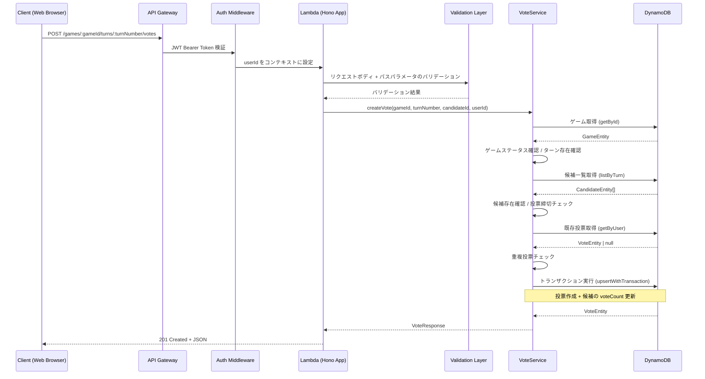

# Design Document: 投票 API

## Overview

投票APIは、投票対局アプリケーションにおいて、認証済みユーザーが特定の対局の特定のターンに対して次の一手の候補に投票するためのRESTful APIエンドポイントです。このAPIは、Honoフレームワークを使用してAWS Lambda上で実行され、リクエストのバリデーション、候補の存在確認、投票締切チェック、DynamoDBへの投票データの保存を行います。

投票はDynamoDBのTransactWriteItemsを使用して、投票レコードの作成と候補の投票数更新をアトミックに実行します。1ユーザー1ターンにつき1票の制約があり、既に投票済みの場合は409 ALREADY_VOTEDエラーを返します。投票締切を過ぎたターンへの投票は400 VOTING_CLOSEDエラーで拒否します。

## Architecture

### システム構成



### レイヤー構成

既存のアーキテクチャパターンに従い、以下のレイヤーで構成します：

1. **ルーティングレイヤー** (`routes/votes.ts`)
   - HTTPリクエストの受信とレスポンスの返却
   - パスパラメータとリクエストボディのバリデーション
   - 認証コンテキストからのuserId取得
   - エラーハンドリング

2. **サービスレイヤー** (`services/vote.ts`) ※新規作成
   - ビジネスロジックの実装
   - ゲーム存在確認、ターン存在確認
   - 候補存在確認、投票締切チェック
   - 重複投票チェック
   - トランザクションによる投票作成

3. **リポジトリレイヤー** (`lib/dynamodb/repositories/vote.ts`) ※既存
   - DynamoDBへのデータアクセス
   - 投票の作成（upsertWithTransaction）
   - 既存投票の取得（getByUser）

4. **スキーマレイヤー** (`schemas/vote.ts`) ※新規作成
   - リクエストボディのバリデーション定義
   - パスパラメータのバリデーション定義

## Components and Interfaces

### API Endpoint

#### POST /api/games/:gameId/turns/:turnNumber/votes

認証済みユーザーが次の一手の候補に投票します。

**Path Parameters:**

| Parameter  | Type   | Required | Description | Validation  |
| ---------- | ------ | -------- | ----------- | ----------- |
| gameId     | string | Yes      | 対局ID      | UUID v4形式 |
| turnNumber | number | Yes      | ターン番号  | 0以上の整数 |

**Request Body:**

| Field       | Type   | Required | Description | Validation  |
| ----------- | ------ | -------- | ----------- | ----------- |
| candidateId | string | Yes      | 候補ID      | UUID v4形式 |

**Request Example:**

```json
{
  "candidateId": "789e0123-e89b-12d3-a456-426614174002"
}
```

**Response (201 Created):**

```json
{
  "gameId": "456e7890-e89b-12d3-a456-426614174001",
  "turnNumber": 5,
  "userId": "123e4567-e89b-12d3-a456-426614174000",
  "candidateId": "789e0123-e89b-12d3-a456-426614174002",
  "createdAt": "2025-02-19T16:00:00.000Z"
}
```

**Error Responses:**

- 400 VALIDATION_ERROR: バリデーションエラー（candidateIdがUUID形式でない等）
- 400 VOTING_CLOSED: 投票締切済みまたはゲームが非アクティブ
- 401 UNAUTHORIZED: 認証エラー
- 404 NOT_FOUND: ゲーム、ターン、または候補が存在しない
- 409 ALREADY_VOTED: 既に投票済み
- 500 INTERNAL_ERROR: サーバー内部エラー

### Type Definitions

#### VoteResponse

```typescript
interface VoteResponse {
  gameId: string;
  turnNumber: number;
  userId: string;
  candidateId: string;
  createdAt: string;
}
```

#### PostVoteRequest

```typescript
interface PostVoteRequest {
  candidateId: string; // UUID v4形式
}
```

#### PostVotePathParams

```typescript
interface PostVotePathParams {
  gameId: string; // UUID v4形式
  turnNumber: string; // 数値文字列（"0", "1", "2", ...）
}
```

### Service Interface

#### VoteService（新規作成）

```typescript
class VoteService {
  constructor(
    private voteRepository: VoteRepository,
    private candidateRepository: CandidateRepository,
    private gameRepository: GameRepository
  ) {}

  /**
   * 投票を作成
   * @param gameId - 対局ID
   * @param turnNumber - ターン番号
   * @param candidateId - 候補ID
   * @param userId - 投票者のユーザーID
   * @returns 作成された投票のレスポンス
   * @throws GameNotFoundError - ゲームが存在しない場合
   * @throws TurnNotFoundError - ターンが存在しない場合
   * @throws CandidateNotFoundError - 候補が存在しない場合
   * @throws VotingClosedError - 投票締切済みの場合
   * @throws AlreadyVotedError - 既に投票済みの場合
   */
  async createVote(
    gameId: string,
    turnNumber: number,
    candidateId: string,
    userId: string
  ): Promise<VoteResponse>;
}
```

### Repository Interface

既存の `VoteRepository` のメソッドを使用します。新規メソッドの追加は不要です。

```typescript
// 既存メソッド（変更なし）
class VoteRepository extends BaseRepository {
  async getByUser(gameId: string, turnNumber: number, userId: string): Promise<VoteEntity | null>;
  async upsertWithTransaction(params: {
    gameId: string;
    turnNumber: number;
    userId: string;
    candidateId: string;
    oldCandidateId?: string;
  }): Promise<VoteEntity>;
}
```

## Data Models

### DynamoDB Table Structure

既存のSingle Table Designパターンに従います。投票作成時に作成されるエンティティは `VoteEntity` です。

#### Vote Entity（新規作成時）

| Attribute   | Type   | Value                             |
| ----------- | ------ | --------------------------------- |
| PK          | String | `GAME#<gameId>#TURN#<turnNumber>` |
| SK          | String | `VOTE#<userId>`                   |
| GSI2PK      | String | `USER#<userId>`                   |
| GSI2SK      | String | `VOTE#<createdAt>`                |
| entityType  | String | `VOTE`                            |
| gameId      | String | パスパラメータから取得            |
| turnNumber  | Number | パスパラメータから取得            |
| userId      | String | 認証コンテキストから取得          |
| candidateId | String | リクエストボディから取得          |
| createdAt   | String | 現在時刻（ISO 8601形式）          |
| updatedAt   | String | 現在時刻（ISO 8601形式）          |

### トランザクション処理

投票の作成は、以下の2つの操作をDynamoDB TransactWriteItemsでアトミックに実行します：

1. **投票レコードの作成** (Put): VoteEntity を作成
2. **候補の投票数更新** (Update): 対象候補の `voteCount` を +1

```typescript
// TransactWriteItems の構成
const transactItems = [
  {
    Put: {
      TableName: tableName,
      Item: voteEntity,
    },
  },
  {
    Update: {
      TableName: tableName,
      Key: candidateKeys,
      UpdateExpression: 'SET voteCount = voteCount + :inc, updatedAt = :updatedAt',
      ExpressionAttributeValues: { ':inc': 1, ':updatedAt': now },
    },
  },
];
```

### 1ユーザー1票の制約

PK/SKの設計により、同一ユーザーが同一ターンに複数の投票を作成することは不可能です：

- PK: `GAME#<gameId>#TURN#<turnNumber>`
- SK: `VOTE#<userId>`

同じPK/SKの組み合わせでPutCommandを実行すると上書きされるため、サービスレイヤーで事前に既存投票の有無をチェックし、既に投票済みの場合は409エラーを返します。

## Key Functions with Formal Specifications

### Function 1: createVote()

```typescript
async function createVote(
  gameId: string,
  turnNumber: number,
  candidateId: string,
  userId: string
): Promise<VoteResponse>;
```

**Preconditions:**

- `gameId` は有効なUUID v4形式
- `turnNumber` は0以上の整数
- `candidateId` は有効なUUID v4形式
- `userId` は認証済みユーザーのID

**Postconditions:**

- 成功時: DynamoDBに新しいVoteEntityが作成される
- 成功時: 対象候補の `voteCount` が1増加する
- 成功時: 投票レコードの作成と候補の投票数更新がアトミックに実行される
- ゲーム未存在時: `GameNotFoundError` がスローされる
- ターン未存在時: `TurnNotFoundError` がスローされる
- 候補未存在時: `CandidateNotFoundError` がスローされる
- 投票締切済みの場合: `VotingClosedError` がスローされる
- 既に投票済みの場合: `AlreadyVotedError` がスローされる

**Loop Invariants:** N/A

### Function 2: validateCandidateExists()

```typescript
function validateCandidateExists(
  candidates: CandidateEntity[],
  candidateId: string
): CandidateEntity;
```

**Preconditions:**

- `candidates` は CandidateEntity の配列（空配列も可）
- `candidateId` は文字列

**Postconditions:**

- 候補が存在する場合: 該当する CandidateEntity を返す
- 候補が存在しない場合: `CandidateNotFoundError` がスローされる
- 入力配列は変更されない

**Loop Invariants:** N/A

### Function 3: checkVotingOpen()

```typescript
function checkVotingOpen(candidates: CandidateEntity[]): void;
```

**Preconditions:**

- `candidates` は CandidateEntity の配列（少なくとも1つの要素を含む）

**Postconditions:**

- 投票締切前の場合: 何も返さない（void）
- 投票締切を過ぎている場合: `VotingClosedError` がスローされる
- 候補のステータスが `CLOSED` の場合: `VotingClosedError` がスローされる

**Loop Invariants:** N/A

## Algorithmic Pseudocode

### 投票作成アルゴリズム

```typescript
async function createVote(gameId, turnNumber, candidateId, userId) {
  // Step 1: ゲームの存在確認
  const game = await gameRepository.getById(gameId);
  if (!game) throw new GameNotFoundError(gameId);

  // Step 2: ゲームがアクティブであることを確認
  if (game.status !== 'ACTIVE') throw new VotingClosedError();

  // Step 3: ターンの存在確認
  if (turnNumber > game.currentTurn) throw new TurnNotFoundError(gameId, turnNumber);

  // Step 4: 候補一覧の取得
  const candidates = await candidateRepository.listByTurn(gameId, turnNumber);

  // Step 5: 候補の存在確認
  const targetCandidate = candidates.find((c) => c.candidateId === candidateId);
  if (!targetCandidate) throw new CandidateNotFoundError(candidateId);

  // Step 6: 投票締切チェック
  const deadline = new Date(targetCandidate.votingDeadline);
  if (deadline < new Date()) throw new VotingClosedError();

  // Step 7: 候補のステータスチェック
  if (targetCandidate.status !== 'VOTING') throw new VotingClosedError();

  // Step 8: 既存投票の確認（重複チェック）
  const existingVote = await voteRepository.getByUser(gameId, turnNumber, userId);
  if (existingVote) throw new AlreadyVotedError();

  // Step 9: トランザクションで投票作成 + 候補の投票数更新
  const voteEntity = await voteRepository.upsertWithTransaction({
    gameId,
    turnNumber,
    userId,
    candidateId,
  });

  // Step 10: レスポンスの構築
  return toVoteResponse(voteEntity);
}
```

### レスポンス変換ロジック

```typescript
function toVoteResponse(entity: VoteEntity): VoteResponse {
  return {
    gameId: entity.gameId,
    turnNumber: entity.turnNumber,
    userId: entity.userId,
    candidateId: entity.candidateId,
    createdAt: entity.createdAt,
  };
}
```

## Example Usage

```typescript
// Example 1: 正常な投票
const res = await app.request('/api/games/550e8400-e29b-41d4-a716-446655440000/turns/5/votes', {
  method: 'POST',
  headers: {
    'Content-Type': 'application/json',
    Authorization: 'Bearer <valid-jwt-token>',
  },
  body: JSON.stringify({
    candidateId: '789e0123-e89b-12d3-a456-426614174002',
  }),
});
// res.status === 201
// res.body.gameId === '550e8400-e29b-41d4-a716-446655440000'
// res.body.turnNumber === 5
// res.body.candidateId === '789e0123-e89b-12d3-a456-426614174002'

// Example 2: バリデーションエラー（candidateIdがUUID形式でない）
const res2 = await app.request('/api/games/550e8400-e29b-41d4-a716-446655440000/turns/5/votes', {
  method: 'POST',
  headers: {
    'Content-Type': 'application/json',
    Authorization: 'Bearer <valid-jwt-token>',
  },
  body: JSON.stringify({
    candidateId: 'invalid-id',
  }),
});
// res2.status === 400
// res2.body.error === 'VALIDATION_ERROR'

// Example 3: 既に投票済み
const res3 = await app.request(/* same user, same turn */);
// res3.status === 409
// res3.body.error === 'ALREADY_VOTED'

// Example 4: 投票締切済み
const res4 = await app.request(/* expired turn */);
// res4.status === 400
// res4.body.error === 'VOTING_CLOSED'

// Example 5: 認証なしでのアクセス
const res5 = await app.request('/api/games/550e8400-e29b-41d4-a716-446655440000/turns/5/votes', {
  method: 'POST',
  headers: { 'Content-Type': 'application/json' },
  body: JSON.stringify({
    candidateId: '789e0123-e89b-12d3-a456-426614174002',
  }),
});
// res5.status === 401
// res5.body.error === 'UNAUTHORIZED'
```

## Correctness Properties

_プロパティとは、システムのすべての有効な実行において真であるべき特性や動作のことです。プロパティは人間が読める仕様と機械的に検証可能な正確性保証の橋渡しとなります。_

### Property 1: 認証必須

_For any_ POST /games/:gameId/turns/:turnNumber/votes リクエストに対して、認証トークンが存在しないまたは無効な場合、APIはステータスコード401を返す

**Validates: Requirements 1.1, 1.2**

### Property 2: リクエストボディのバリデーション

_For any_ 不正なリクエストボディ（candidateId が UUID v4 形式でない、candidateId が空文字列、candidateId が未指定）に対して、APIはステータスコード400のVALIDATION_ERRORを返す

**Validates: Requirements 2.3, 2.4, 2.5**

### Property 3: パスパラメータのバリデーション

_For any_ UUID形式でないgameIdまたは0以上の整数でないturnNumberに対して、APIはステータスコード400のVALIDATION_ERRORを返す

**Validates: Requirements 2.1, 2.2, 2.5**

### Property 4: ゲーム・ターン存在確認

_For any_ 存在しないgameId、または存在するゲームの currentTurn より大きい turnNumber に対して、APIはステータスコード404のNOT_FOUNDエラーを返す

**Validates: Requirements 3.1, 3.2, 3.3**

### Property 5: 候補存在確認

_For any_ 指定されたターンに存在しないcandidateIdに対して、APIはステータスコード404のNOT_FOUNDエラーを返す

**Validates: Requirements 5.1, 5.2**

### Property 6: 投票締切チェック

_For any_ 投票締切を過ぎたターンへの投票、ステータスが "ACTIVE" でない対局への投票、または候補のステータスが "VOTING" でない場合、APIはステータスコード400のVOTING_CLOSEDエラーを返す

**Validates: Requirements 4.1, 4.2, 4.3, 4.4**

### Property 7: 重複投票の拒否

_For any_ 同一ユーザーが同一ターンに既に投票済みの場合、APIはステータスコード409のALREADY_VOTEDエラーを返す

**Validates: Requirements 6.1, 6.2**

### Property 8: 成功レスポンスの形式

_For any_ 有効なリクエストに対して、APIはステータスコード201を返し、gameId, turnNumber, userId, candidateId, createdAt のすべてのフィールドを含むJSONレスポンスを返す。createdAt はISO 8601形式である。

**Validates: Requirements 7.4, 7.5, 8.1, 8.3, 8.4**

### Property 9: アトミックな投票数更新

_For any_ 正常に作成された投票に対して、対象候補の voteCount が正確に1増加する。投票レコードの作成と候補の投票数更新はトランザクションでアトミックに実行される。

**Validates: Requirements 7.1, 7.2, 7.3**

### Property 10: エラーレスポンスの一貫性

_For any_ エラーレスポンスに対して、`{ error: string, message: string }` の構造を持つJSONが返される

**Validates: Requirements 9.1, 9.2**

## Error Handling

### エラーの種類と処理

#### 1. 認証エラー (401 Unauthorized)

**発生条件:**

- Authorizationヘッダーが存在しない
- Bearer トークンが無効または期限切れ

**レスポンス形式:**

```json
{
  "error": "UNAUTHORIZED",
  "message": "Authorization header is required"
}
```

**処理方法:**

- 既存の認証ミドルウェア（`createAuthMiddleware`）が処理
- ルーティングレイヤーに到達する前にレスポンスを返す

#### 2. バリデーションエラー (400 Bad Request)

**発生条件:**

- gameIdがUUID v4形式でない
- turnNumberが0以上の整数でない
- candidateIdがUUID v4形式でない

**レスポンス形式:**

```json
{
  "error": "VALIDATION_ERROR",
  "message": "Validation failed",
  "details": {
    "fields": {
      "candidateId": "Invalid uuid"
    }
  }
}
```

#### 3. 投票締切エラー (400 Bad Request)

**発生条件:**

- 投票締切を過ぎたターンへの投票
- ゲームが FINISHED 状態
- 候補のステータスが VOTING でない

**レスポンス形式:**

```json
{
  "error": "VOTING_CLOSED",
  "message": "Voting period has ended"
}
```

#### 4. Not Found エラー (404 Not Found)

**発生条件:**

- 指定されたgameIdの対局が存在しない
- 指定されたturnNumberのターンが存在しない
- 指定されたcandidateIdの候補が存在しない

**レスポンス形式:**

```json
{
  "error": "NOT_FOUND",
  "message": "Game not found"
}
```

```json
{
  "error": "NOT_FOUND",
  "message": "Candidate not found"
}
```

#### 5. 重複投票エラー (409 Conflict)

**発生条件:**

- 同一ユーザーが同一ターンに既に投票済み

**レスポンス形式:**

```json
{
  "error": "ALREADY_VOTED",
  "message": "Already voted in this turn"
}
```

#### 6. Internal Server Error (500)

**発生条件:**

- DynamoDBへのアクセスエラー
- トランザクション失敗
- 予期しないシステムエラー

**レスポンス形式:**

```json
{
  "error": "INTERNAL_ERROR",
  "message": "Failed to create vote"
}
```

## Testing Strategy

### ユニットテスト

**対象:**

- `services/vote.ts` の `createVote` メソッド
- `schemas/vote.ts` のバリデーションスキーマ
- `routes/votes.ts` のPOSTエンドポイント

**テストファイル:**

- `services/vote.test.ts` - サービスレイヤーのユニットテスト（新規作成）
- `schemas/vote.test.ts` - スキーマのユニットテスト（新規作成）
- `routes/votes.test.ts` - ルーティングレイヤーのユニットテスト（新規作成）

**テストケース:**

- 正常系: 有効なリクエストで投票が作成される
- バリデーションエラー: 不正なcandidateId形式
- バリデーションエラー: candidateIdが未指定
- ゲーム未存在: 404エラー
- ターン未存在: 404エラー
- 候補未存在: 404エラー
- 投票締切済み: 400 VOTING_CLOSED
- 既に投票済み: 409 ALREADY_VOTED
- 認証なし: 401 UNAUTHORIZED

### プロパティベーステスト

**テストライブラリ:** fast-check

**設定:**

- `numRuns: 10-20`（JSDOM環境での安定性のため）
- `endOnFailure: true`

**テストファイル:**

- `schemas/vote.property.test.ts` - スキーマのプロパティテスト（新規作成）
- `services/vote.property.test.ts` - サービスレイヤーのプロパティテスト（新規作成）

**プロパティテスト対象:**

- Property 2: 不正なリクエストボディに対するバリデーションエラー
- Property 3: 不正なパスパラメータに対するバリデーションエラー
- Property 8: 成功レスポンスの必須フィールド
- Property 10: エラーレスポンスの一貫性

### 統合テスト

**テストファイル:**

- `routes/votes.integration.test.ts` - 統合テスト（新規作成）

**テストケース:**

- モックDynamoDBを使用した投票作成の完全なフロー
- トランザクション処理の検証
- エラーケースの統合テスト

## Security Considerations

- 認証必須: JWTトークンによる認証が必須（既存の認証ミドルウェアを使用）
- 入力バリデーション: Zodスキーマによる厳格なバリデーション
- 1ユーザー1票: PK/SK設計とサービスレイヤーの重複チェックで保証
- トランザクション: TransactWriteItemsによるアトミックな操作で投票数の整合性を保証
- レート制限: 既存のレート制限ミドルウェアが適用される（100リクエスト/分）

## Performance Considerations

- DynamoDB TransactWriteItems は通常のPutCommandより若干遅いが、データ整合性のために必須
- 候補一覧の取得（listByTurn）と既存投票の取得（getByUser）は並列実行可能だが、候補の存在確認が先に必要なため逐次実行とする
- 投票締切チェックは候補エンティティの `votingDeadline` フィールドを使用し、追加のDBアクセスは不要

## Dependencies

- **Hono**: HTTPルーティングフレームワーク
- **@hono/zod-validator**: Zodベースのバリデーションミドルウェア
- **Zod**: スキーマバリデーション
- **@aws-sdk/lib-dynamodb**: DynamoDB Document Client（TransactWriteCommand）
- **既存モジュール:**
  - `lib/auth/auth-middleware.ts`: JWT認証ミドルウェア
  - `lib/dynamodb/repositories/vote.ts`: 投票リポジトリ（既存、変更なし）
  - `lib/dynamodb/repositories/candidate.ts`: 候補リポジトリ（既存、変更なし）
  - `lib/dynamodb/repositories/game.ts`: ゲームリポジトリ（既存、変更なし）
  - `lib/dynamodb/types.ts`: エンティティ型定義（既存、変更なし）
