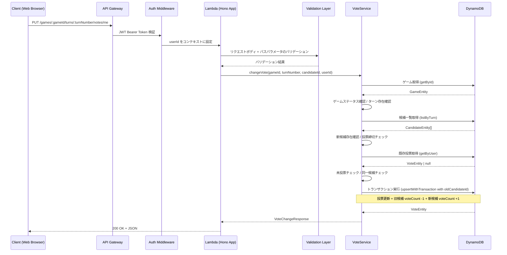

# Design Document: 投票変更 API

## Overview

投票変更APIは、投票対局アプリケーションにおいて、既に投票済みの認証済みユーザーが投票先の候補を変更するためのRESTful APIエンドポイントです。エンドポイントは `PUT /games/:gameId/turns/:turnNumber/votes/me` で、既存の投票API（`POST /games/:gameId/turns/:turnNumber/votes`）を補完します。

投票変更時は、DynamoDBのTransactWriteItemsを使用して、投票レコードの更新・旧候補のvoteCount減少・新候補のvoteCount増加をアトミックに実行します。既存の `VoteRepository.upsertWithTransaction` メソッドの `oldCandidateId` パラメータを活用することで、リポジトリレイヤーの変更は不要です。

投票変更は既存投票がある前提であり、未投票のユーザーによる変更リクエストは409 NOT_VOTEDエラーで拒否されます。同じ候補への変更は意味がないため400 SAME_CANDIDATEエラーで拒否されます。

## Architecture

### システム構成



### レイヤー構成

既存の投票API（20-vote-api）のアーキテクチャパターンに従い、既存ファイルへの追加で構成します：

1. **ルーティングレイヤー** (`routes/votes.ts`) ※既存ファイルに追加
   - `createGameVotesRouter` に PUT `/games/:gameId/turns/:turnNumber/votes/me` エンドポイントを追加
   - パスパラメータとリクエストボディのバリデーション（既存スキーマを再利用）
   - 認証コンテキストからのuserId取得
   - 新規エラークラス（NotVotedError, SameCandidateError）のハンドリング

2. **サービスレイヤー** (`services/vote.ts`) ※既存ファイルに追加
   - `VoteService` クラスに `changeVote` メソッドを追加
   - ゲーム存在確認、ターン存在確認、候補存在確認、投票締切チェック
   - 既存投票の存在確認（未投票チェック）
   - 同一候補への変更チェック
   - `upsertWithTransaction` を `oldCandidateId` 付きで呼び出し

3. **リポジトリレイヤー** (`lib/dynamodb/repositories/vote.ts`) ※変更なし
   - 既存の `upsertWithTransaction` メソッドの `oldCandidateId` パラメータを活用
   - 既存の `getByUser` メソッドで既存投票を取得

4. **スキーマレイヤー** (`schemas/vote.ts`) ※既存ファイルに追加
   - `putVoteBodySchema`（candidateId の UUID v4 バリデーション）を追加
   - `putVoteParamSchema`（gameId + turnNumber のバリデーション）を追加

5. **型定義** (`types/vote.ts`) ※既存ファイルに追加
   - `VoteChangeResponse` 型を追加（updatedAt フィールドを含む）

## Components and Interfaces

### API Endpoint

#### PUT /api/games/:gameId/turns/:turnNumber/votes/me

認証済みユーザーが既存の投票先候補を変更します。

**Path Parameters:**

| Parameter  | Type   | Required | Description | Validation  |
| ---------- | ------ | -------- | ----------- | ----------- |
| gameId     | string | Yes      | 対局ID      | UUID v4形式 |
| turnNumber | number | Yes      | ターン番号  | 0以上の整数 |

**Request Body:**

| Field       | Type   | Required | Description    | Validation  |
| ----------- | ------ | -------- | -------------- | ----------- |
| candidateId | string | Yes      | 変更先の候補ID | UUID v4形式 |

**Request Example:**

```json
{
  "candidateId": "890e1234-e89b-12d3-a456-426614174003"
}
```

**Response (200 OK):**

```json
{
  "gameId": "456e7890-e89b-12d3-a456-426614174001",
  "turnNumber": 5,
  "userId": "123e4567-e89b-12d3-a456-426614174000",
  "candidateId": "890e1234-e89b-12d3-a456-426614174003",
  "createdAt": "2025-02-19T16:00:00Z",
  "updatedAt": "2025-02-19T17:00:00Z"
}
```

**Error Responses:**

- 400 VALIDATION_ERROR: バリデーションエラー（candidateIdがUUID形式でない等）
- 400 VOTING_CLOSED: 投票締切済みまたはゲームが非アクティブ
- 400 SAME_CANDIDATE: 同じ候補への変更
- 401 UNAUTHORIZED: 認証エラー
- 404 NOT_FOUND: ゲーム、ターン、または候補が存在しない
- 409 NOT_VOTED: まだ投票していない
- 500 INTERNAL_ERROR: サーバー内部エラー

### Type Definitions

#### VoteChangeResponse（新規追加）

```typescript
interface VoteChangeResponse {
  gameId: string;
  turnNumber: number;
  userId: string;
  candidateId: string;
  createdAt: string;
  updatedAt: string; // 投票変更時の更新日時
}
```

### Service Interface

#### VoteService（既存クラスにメソッド追加）

```typescript
class VoteService {
  /**
   * 投票先を変更
   * @param gameId - 対局ID
   * @param turnNumber - ターン番号
   * @param candidateId - 変更先の候補ID
   * @param userId - 投票者のユーザーID
   * @returns 変更後の投票レスポンス
   * @throws GameNotFoundError - ゲームが存在しない場合
   * @throws TurnNotFoundError - ターンが存在しない場合
   * @throws CandidateNotFoundError - 候補が存在しない場合
   * @throws VotingClosedError - 投票締切済みの場合
   * @throws NotVotedError - まだ投票していない場合
   * @throws SameCandidateError - 同じ候補への変更の場合
   */
  async changeVote(
    gameId: string,
    turnNumber: number,
    candidateId: string,
    userId: string
  ): Promise<VoteChangeResponse>;
}
```

### 新規エラークラス（`services/vote.ts` に追加）

```typescript
/**
 * まだ投票していない場合のエラー
 */
class NotVotedError extends Error {
  constructor() {
    super('Not voted yet in this turn');
    this.name = 'NotVotedError';
  }
}

/**
 * 同じ候補への変更の場合のエラー
 */
class SameCandidateError extends Error {
  constructor() {
    super('Already voting for this candidate');
    this.name = 'SameCandidateError';
  }
}
```

### Schema Definitions（`schemas/vote.ts` に追加）

```typescript
// PUT /api/games/:gameId/turns/:turnNumber/votes/me リクエストボディ
export const putVoteBodySchema = z.object({
  candidateId: z.string().uuid(),
});

// PUT /api/games/:gameId/turns/:turnNumber/votes/me パスパラメータ
export const putVoteParamSchema = z.object({
  gameId: z.string().uuid(),
  turnNumber: z.coerce.number().int().nonnegative(),
});
```

### Repository Interface（変更なし）

既存の `VoteRepository` のメソッドをそのまま使用します。

```typescript
class VoteRepository extends BaseRepository {
  // 既存投票の取得
  async getByUser(gameId: string, turnNumber: number, userId: string): Promise<VoteEntity | null>;

  // 投票の作成/更新（oldCandidateId で旧候補の voteCount を -1）
  async upsertWithTransaction(params: {
    gameId: string;
    turnNumber: number;
    userId: string;
    candidateId: string;
    oldCandidateId?: string; // 投票変更時に旧候補IDを指定
  }): Promise<VoteEntity>;
}
```

## Data Models

### DynamoDB Table Structure

既存のSingle Table Designパターンに従います。投票変更時は既存の VoteEntity を上書き更新します。

#### Vote Entity（変更後の状態）

| Attribute   | Type   | Value                             | 備考                     |
| ----------- | ------ | --------------------------------- | ------------------------ |
| PK          | String | `GAME#<gameId>#TURN#<turnNumber>` | 変更なし                 |
| SK          | String | `VOTE#<userId>`                   | 変更なし                 |
| GSI2PK      | String | `USER#<userId>`                   | 変更なし                 |
| GSI2SK      | String | `VOTE#<updatedAt>`                | updatedAt で更新される   |
| entityType  | String | `VOTE`                            | 変更なし                 |
| gameId      | String | パスパラメータから取得            | 変更なし                 |
| turnNumber  | Number | パスパラメータから取得            | 変更なし                 |
| userId      | String | 認証コンテキストから取得          | 変更なし                 |
| candidateId | String | リクエストボディから取得          | 新しい候補IDに更新される |
| createdAt   | String | 元の作成日時                      | 変更なし（※注）          |
| updatedAt   | String | 現在時刻（ISO 8601形式）          | 変更時刻に更新される     |

**※注:** 現在の `upsertWithTransaction` 実装では Put 操作で全フィールドを上書きするため、`createdAt` も現在時刻で上書きされます。投票変更レスポンスでは `updatedAt` を返すことで変更時刻を明示します。

### トランザクション処理

投票変更は、以下の3つの操作をDynamoDB TransactWriteItemsでアトミックに実行します：

1. **投票レコードの更新** (Put): VoteEntity の candidateId を新しい候補IDに更新
2. **新候補の投票数増加** (Update): 新候補の `voteCount` を +1
3. **旧候補の投票数減少** (Update): 旧候補の `voteCount` を -1

```typescript
// upsertWithTransaction を oldCandidateId 付きで呼び出し
const voteEntity = await voteRepository.upsertWithTransaction({
  gameId,
  turnNumber,
  userId,
  candidateId: newCandidateId,
  oldCandidateId: existingVote.candidateId, // 旧候補の voteCount を -1
});
```

### 投票変更アルゴリズム

```typescript
async function changeVote(gameId, turnNumber, candidateId, userId) {
  // Step 1: ゲームの存在確認
  const game = await gameRepository.getById(gameId);
  if (!game) throw new GameNotFoundError(gameId);

  // Step 2: ゲームがアクティブであることを確認
  if (game.status !== 'ACTIVE') throw new VotingClosedError();

  // Step 3: ターンの存在確認
  if (turnNumber > game.currentTurn) throw new TurnNotFoundError(gameId, turnNumber);

  // Step 4: 候補一覧の取得
  const candidates = await candidateRepository.listByTurn(gameId, turnNumber);

  // Step 5: 新候補の存在確認
  const targetCandidate = candidates.find((c) => c.candidateId === candidateId);
  if (!targetCandidate) throw new CandidateNotFoundError(candidateId);

  // Step 6: 投票締切チェック
  const deadline = new Date(targetCandidate.votingDeadline);
  if (deadline < new Date()) throw new VotingClosedError();

  // Step 7: 候補のステータスチェック
  if (targetCandidate.status !== 'VOTING') throw new VotingClosedError();

  // Step 8: 既存投票の確認（未投票チェック）
  const existingVote = await voteRepository.getByUser(gameId, turnNumber, userId);
  if (!existingVote) throw new NotVotedError();

  // Step 9: 同一候補チェック
  if (existingVote.candidateId === candidateId) throw new SameCandidateError();

  // Step 10: トランザクションで投票更新 + 旧候補 voteCount -1 + 新候補 voteCount +1
  const voteEntity = await voteRepository.upsertWithTransaction({
    gameId,
    turnNumber,
    userId,
    candidateId,
    oldCandidateId: existingVote.candidateId,
  });

  // Step 11: レスポンスの構築
  return toVoteChangeResponse(voteEntity);
}
```

## Correctness Properties

_プロパティとは、システムのすべての有効な実行において真であるべき特性や動作のことです。プロパティは人間が読める仕様と機械的に検証可能な正確性保証の橋渡しとなります。_

### Property 1: 認証必須

_For any_ PUT /games/:gameId/turns/:turnNumber/votes/me リクエストに対して、認証トークンが存在しないまたは無効な場合、APIはステータスコード401を返す

**Validates: Requirements 1.1, 1.2**

### Property 2: リクエストバリデーション

_For any_ 不正なリクエストパラメータ（UUID v4形式でないgameId、0以上の整数でないturnNumber、UUID v4形式でないcandidateId、空文字列のcandidateId）に対して、APIはステータスコード400のVALIDATION_ERRORを返し、レスポンスに `error` と `message` フィールドを含む

**Validates: Requirements 2.1, 2.2, 2.3, 2.4, 2.5**

### Property 3: ゲーム・ターン・候補の存在確認

_For any_ 存在しないgameId、存在するゲームのcurrentTurnより大きいturnNumber、または該当ターンに存在しないcandidateIdに対して、APIはステータスコード404のNOT_FOUNDエラーを返す

**Validates: Requirements 3.1, 3.2, 3.3, 5.1, 5.2**

### Property 4: 投票締切チェック

_For any_ ステータスが "ACTIVE" でない対局、投票締切が過去の候補、またはステータスが "VOTING" でない候補に対する投票変更リクエストに対して、APIはステータスコード400のVOTING_CLOSEDエラーを返す

**Validates: Requirements 4.1, 4.2, 4.3, 4.4**

### Property 5: 未投票ユーザーの拒否

_For any_ 同一ターンにまだ投票していないユーザーによる投票変更リクエストに対して、APIはステータスコード409のNOT_VOTEDエラーを返す

**Validates: Requirements 6.1, 6.2**

### Property 6: 同一候補への変更の拒否

_For any_ 既存投票のcandidateIdと同一のcandidateIdへの変更リクエストに対して、APIはステータスコード400のSAME_CANDIDATEエラーを返す

**Validates: Requirements 7.1, 7.2**

### Property 7: アトミックな投票数更新

_For any_ 正常に変更された投票に対して、`upsertWithTransaction` が `oldCandidateId`（旧候補ID）付きで呼び出され、旧候補の voteCount が正確に1減少し、新候補の voteCount が正確に1増加する

**Validates: Requirements 8.1, 8.2, 8.3, 8.4**

### Property 8: 成功レスポンスの形式

_For any_ 有効なリクエストに対して、APIはステータスコード200を返し、gameId, turnNumber, userId, candidateId, createdAt, updatedAt のすべてのフィールドを含むJSONレスポンスを返す。日時フィールドはISO 8601形式である。

**Validates: Requirements 8.5, 9.1, 9.2, 9.3, 9.4**

### Property 9: エラーレスポンスの一貫性

_For any_ エラーレスポンスに対して、`{ error: string, message: string }` の構造を持つJSONが返され、エラーの種類に応じた適切なHTTPステータスコードが設定される

**Validates: Requirements 10.1, 10.2**

## Error Handling

### エラーの種類と処理

#### 1. 認証エラー (401 Unauthorized)

**発生条件:**

- Authorizationヘッダーが存在しない
- Bearer トークンが無効または期限切れ

**レスポンス形式:**

```json
{
  "error": "UNAUTHORIZED",
  "message": "Authorization header is required"
}
```

**処理方法:** 既存の認証ミドルウェア（`createAuthMiddleware`）が処理

#### 2. バリデーションエラー (400 Bad Request)

**発生条件:**

- gameIdがUUID v4形式でない
- turnNumberが0以上の整数でない
- candidateIdがUUID v4形式でない、未指定、または空文字列

**レスポンス形式:**

```json
{
  "error": "VALIDATION_ERROR",
  "message": "Validation failed",
  "details": {
    "fields": {
      "candidateId": "Invalid uuid"
    }
  }
}
```

#### 3. Not Found エラー (404 Not Found)

**発生条件:**

- 指定されたgameIdの対局が存在しない
- 指定されたturnNumberのターンが存在しない（currentTurnより大きい）
- 指定されたcandidateIdの候補が該当ターンに存在しない

**レスポンス形式:**

```json
{
  "error": "NOT_FOUND",
  "message": "Game not found"
}
```

#### 4. 投票締切エラー (400 Bad Request)

**発生条件:**

- 対局のステータスが "ACTIVE" でない
- 候補の投票締切（votingDeadline）が現在時刻より前
- 候補のステータスが "VOTING" でない

**レスポンス形式:**

```json
{
  "error": "VOTING_CLOSED",
  "message": "Voting period has ended"
}
```

#### 5. 未投票エラー (409 Conflict)

**発生条件:**

- 同一ユーザーが同一ターンにまだ投票していない

**レスポンス形式:**

```json
{
  "error": "NOT_VOTED",
  "message": "Not voted yet in this turn"
}
```

#### 6. 同一候補エラー (400 Bad Request)

**発生条件:**

- 既存投票のcandidateIdと変更先のcandidateIdが同一

**レスポンス形式:**

```json
{
  "error": "SAME_CANDIDATE",
  "message": "Already voting for this candidate"
}
```

#### 7. Internal Server Error (500)

**発生条件:**

- DynamoDBへのアクセスエラー
- トランザクション失敗
- 予期しないシステムエラー

**レスポンス形式:**

```json
{
  "error": "INTERNAL_ERROR",
  "message": "Failed to change vote"
}
```

## Testing Strategy

### ユニットテスト

**対象:**

- `services/vote.ts` の `changeVote` メソッド
- `schemas/vote.ts` の `putVoteBodySchema`, `putVoteParamSchema`
- `routes/votes.ts` の PUT エンドポイント

**テストファイル:**

- `services/vote.test.ts` - 既存ファイルに投票変更のテストケースを追加
- `schemas/vote.test.ts` - 既存ファイルに PUT スキーマのテストケースを追加
- `routes/votes.test.ts` - 既存ファイルに PUT エンドポイントのテストケースを追加

**テストケース:**

- 正常系: 有効なリクエストで投票が変更される（200）
- バリデーションエラー: 不正なcandidateId形式（400）
- バリデーションエラー: candidateIdが未指定（400）
- ゲーム未存在: 404 NOT_FOUND
- ターン未存在: 404 NOT_FOUND
- 候補未存在: 404 NOT_FOUND
- 投票締切済み: 400 VOTING_CLOSED
- 未投票: 409 NOT_VOTED
- 同一候補: 400 SAME_CANDIDATE
- 認証なし: 401 UNAUTHORIZED

### プロパティベーステスト

**テストライブラリ:** fast-check

**設定:**

- `numRuns: 10`（JSDOM環境での安定性のため）
- `endOnFailure: true`

**テストファイル:**

- `schemas/vote.property.test.ts` - 既存ファイルに PUT スキーマのプロパティテストを追加
- `services/vote.property.test.ts` - 既存ファイルに投票変更のプロパティテストを追加
- `routes/votes.property.test.ts` - 既存ファイルに PUT エンドポイントのプロパティテストを追加

**プロパティテスト対象:**

- Property 2: 不正なリクエストパラメータに対するバリデーションエラー
  - Tag: **Feature: 21-vote-change-api, Property 2: リクエストバリデーション**
- Property 5: 未投票ユーザーの拒否
  - Tag: **Feature: 21-vote-change-api, Property 5: 未投票ユーザーの拒否**
- Property 6: 同一候補への変更の拒否
  - Tag: **Feature: 21-vote-change-api, Property 6: 同一候補への変更の拒否**
- Property 7: アトミックな投票数更新（upsertWithTransactionがoldCandidateId付きで呼ばれることの検証）
  - Tag: **Feature: 21-vote-change-api, Property 7: アトミックな投票数更新**
- Property 8: 成功レスポンスの必須フィールドとISO 8601形式
  - Tag: **Feature: 21-vote-change-api, Property 8: 成功レスポンスの形式**
- Property 9: エラーレスポンスの一貫性
  - Tag: **Feature: 21-vote-change-api, Property 9: エラーレスポンスの一貫性**

### 統合テスト

**テストファイル:**

- `routes/votes.integration.test.ts` - 既存ファイルに投票変更の統合テストを追加（必要に応じて）

**テストケース:**

- モックDynamoDBを使用した投票変更の完全なフロー
- トランザクション処理の検証（oldCandidateId付き）
- エラーケースの統合テスト
