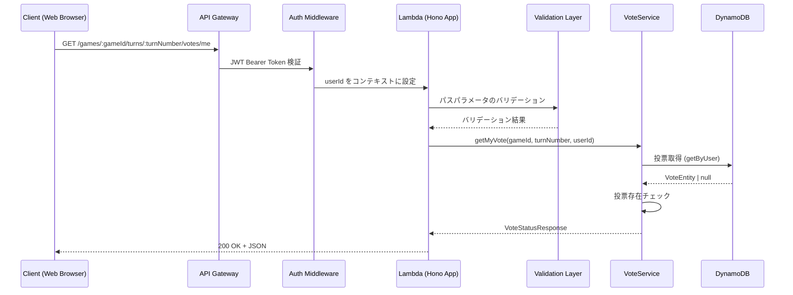

# Design Document: 投票状況取得 API

## Overview

投票状況取得APIは、投票対局アプリケーションにおいて、認証済みユーザーが特定の対局の特定のターンにおける自分の投票状況を取得するためのRESTful APIエンドポイントです。エンドポイントは `GET /games/:gameId/turns/:turnNumber/votes/me` で、既存の投票API（POST）および投票変更API（PUT）を補完します。

このAPIは、DynamoDBのSingle Table Designに基づき、PK=`GAME#<gameId>#TURN#<turnNumber>` / SK=`VOTE#<userId>` でユーザーの投票レコードを直接取得します。投票が存在しない場合は404 NOT_FOUNDエラーを返します。既存の `VoteRepository.getByUser` メソッドをそのまま活用するため、リポジトリレイヤーの変更は不要です。

## Architecture

### システム構成



### レイヤー構成

既存の投票API（20-vote-api, 21-vote-change-api）のアーキテクチャパターンに従い、既存ファイルへの追加で構成します：

1. **ルーティングレイヤー** (`routes/votes.ts`) ※既存ファイルに追加
   - `createGameVotesRouter` に GET `/games/:gameId/turns/:turnNumber/votes/me` エンドポイントを追加
   - パスパラメータのバリデーション（既存スキーマを再利用）
   - 認証コンテキストからのuserId取得

2. **サービスレイヤー** (`services/vote.ts`) ※既存ファイルに追加
   - `VoteService` クラスに `getMyVote` メソッドを追加
   - 投票の存在確認

3. **リポジトリレイヤー** (`lib/dynamodb/repositories/vote.ts`) ※変更なし
   - 既存の `getByUser` メソッドで投票を取得

4. **スキーマレイヤー** (`schemas/vote.ts`) ※既存ファイルに追加
   - `getVoteParamSchema`（gameId + turnNumber のバリデーション）を追加

5. **型定義** (`types/vote.ts`) ※既存ファイルに追加
   - `VoteStatusResponse` 型を追加（updatedAt フィールドを含む）

## Components and Interfaces

### API Endpoint

#### GET /api/games/:gameId/turns/:turnNumber/votes/me

認証済みユーザーが自分の投票状況を取得します。

**Path Parameters:**

| Parameter  | Type   | Required | Description | Validation  |
| ---------- | ------ | -------- | ----------- | ----------- |
| gameId     | string | Yes      | 対局ID      | UUID v4形式 |
| turnNumber | number | Yes      | ターン番号  | 0以上の整数 |

**Request Body:** なし

**Response (200 OK):**

```json
{
  "gameId": "456e7890-e89b-12d3-a456-426614174001",
  "turnNumber": 5,
  "userId": "123e4567-e89b-12d3-a456-426614174000",
  "candidateId": "789e0123-e89b-12d3-a456-426614174002",
  "createdAt": "2025-02-19T16:00:00Z",
  "updatedAt": "2025-02-19T16:00:00Z"
}
```

**Error Responses:**

- 400 VALIDATION_ERROR: バリデーションエラー（gameIdがUUID形式でない等）
- 401 UNAUTHORIZED: 認証エラー
- 404 NOT_FOUND: 投票が存在しない
- 500 INTERNAL_ERROR: サーバー内部エラー

### Type Definitions

#### VoteStatusResponse（新規追加）

```typescript
interface VoteStatusResponse {
  gameId: string;
  turnNumber: number;
  userId: string;
  candidateId: string;
  createdAt: string;
  updatedAt: string;
}
```

### Service Interface

#### VoteService（既存クラスにメソッド追加）

```typescript
class VoteService {
  /**
   * 自分の投票状況を取得
   * @param gameId - 対局ID
   * @param turnNumber - ターン番号
   * @param userId - 投票者のユーザーID
   * @returns 投票状況レスポンス
   * @throws VoteNotFoundError - 投票が存在しない場合
   */
  async getMyVote(gameId: string, turnNumber: number, userId: string): Promise<VoteStatusResponse>;
}
```

### 新規エラークラス（`services/vote.ts` に追加）

```typescript
/**
 * 投票が存在しない場合のエラー
 */
class VoteNotFoundError extends Error {
  constructor() {
    super('Vote not found');
    this.name = 'VoteNotFoundError';
  }
}
```

### Schema Definitions（`schemas/vote.ts` に追加）

```typescript
// GET /api/games/:gameId/turns/:turnNumber/votes/me パスパラメータ
export const getVoteParamSchema = z.object({
  gameId: z.string().uuid(),
  turnNumber: z.coerce.number().int().nonnegative(),
});
```

### Repository Interface（変更なし）

既存の `VoteRepository` のメソッドをそのまま使用します。

```typescript
class VoteRepository extends BaseRepository {
  // 既存投票の取得（変更なし）
  async getByUser(gameId: string, turnNumber: number, userId: string): Promise<VoteEntity | null>;
}
```

## Data Models

### DynamoDB Table Structure

既存のSingle Table Designパターンに従います。投票状況取得は既存の VoteEntity を読み取るのみです。

#### Vote Entity（読み取り対象）

| Attribute   | Type   | Value                             |
| ----------- | ------ | --------------------------------- |
| PK          | String | `GAME#<gameId>#TURN#<turnNumber>` |
| SK          | String | `VOTE#<userId>`                   |
| GSI2PK      | String | `USER#<userId>`                   |
| GSI2SK      | String | `VOTE#<createdAt>`                |
| entityType  | String | `VOTE`                            |
| gameId      | String | 対局ID                            |
| turnNumber  | Number | ターン番号                        |
| userId      | String | ユーザーID                        |
| candidateId | String | 投票した候補ID                    |
| createdAt   | String | 作成日時（ISO 8601形式）          |
| updatedAt   | String | 更新日時（ISO 8601形式）          |

### アクセスパターン

```text
Query:
  PK = GAME#<gameId>#TURN#<turnNumber>
  SK = VOTE#<userId>
```

DynamoDB GetCommand による単一アイテム取得。読み取り専用のため、トランザクションは不要です。

## Key Functions with Formal Specifications

### Function 1: getMyVote()

```typescript
async function getMyVote(
  gameId: string,
  turnNumber: number,
  userId: string
): Promise<VoteStatusResponse>;
```

**Preconditions:**

- `gameId` は有効なUUID v4形式
- `turnNumber` は0以上の整数
- `userId` は認証済みユーザーのID

**Postconditions:**

- 投票が存在する場合: gameId, turnNumber, userId, candidateId, createdAt, updatedAt を含むレスポンスを返す
- 投票が存在しない場合: `VoteNotFoundError` がスローされる
- DynamoDBへの書き込みは発生しない（読み取り専用）

**Loop Invariants:** N/A

### Function 2: toVoteStatusResponse()

```typescript
function toVoteStatusResponse(entity: VoteEntity): VoteStatusResponse;
```

**Preconditions:**

- `entity` は有効な VoteEntity オブジェクト

**Postconditions:**

- gameId, turnNumber, userId, candidateId, createdAt, updatedAt のすべてのフィールドを含むオブジェクトを返す
- updatedAt が未定義の場合は createdAt の値を使用する
- 入力エンティティは変更されない

**Loop Invariants:** N/A

## Algorithmic Pseudocode

### 投票状況取得アルゴリズム

```typescript
async function getMyVote(gameId, turnNumber, userId) {
  // Step 1: DynamoDBから投票を取得
  const vote = await voteRepository.getByUser(gameId, turnNumber, userId);

  // Step 2: 投票の存在確認
  if (!vote) throw new VoteNotFoundError();

  // Step 3: レスポンスの構築
  return toVoteStatusResponse(vote);
}
```

### レスポンス変換ロジック

```typescript
function toVoteStatusResponse(entity: VoteEntity): VoteStatusResponse {
  return {
    gameId: entity.gameId,
    turnNumber: entity.turnNumber,
    userId: entity.userId,
    candidateId: entity.candidateId,
    createdAt: entity.createdAt,
    updatedAt: entity.updatedAt ?? entity.createdAt,
  };
}
```

## Example Usage

```typescript
// Example 1: 正常な投票状況取得
const res = await app.request('/api/games/550e8400-e29b-41d4-a716-446655440000/turns/5/votes/me', {
  method: 'GET',
  headers: {
    Authorization: 'Bearer <valid-jwt-token>',
  },
});
// res.status === 200
// res.body.gameId === '550e8400-e29b-41d4-a716-446655440000'
// res.body.turnNumber === 5
// res.body.candidateId === '789e0123-e89b-12d3-a456-426614174002'
// res.body.createdAt === '2025-02-19T16:00:00Z'
// res.body.updatedAt === '2025-02-19T16:00:00Z'

// Example 2: 投票していない場合
const res2 = await app.request('/api/games/550e8400-e29b-41d4-a716-446655440000/turns/5/votes/me', {
  method: 'GET',
  headers: {
    Authorization: 'Bearer <valid-jwt-token>',
  },
});
// res2.status === 404
// res2.body.error === 'NOT_FOUND'
// res2.body.message === 'Vote not found'

// Example 3: バリデーションエラー（gameIdが不正）
const res3 = await app.request('/api/games/invalid-id/turns/5/votes/me', {
  method: 'GET',
  headers: {
    Authorization: 'Bearer <valid-jwt-token>',
  },
});
// res3.status === 400
// res3.body.error === 'VALIDATION_ERROR'

// Example 4: 認証なしでのアクセス
const res4 = await app.request('/api/games/550e8400-e29b-41d4-a716-446655440000/turns/5/votes/me', {
  method: 'GET',
});
// res4.status === 401
// res4.body.error === 'UNAUTHORIZED'
```

## Correctness Properties

_プロパティとは、システムのすべての有効な実行において真であるべき特性や動作のことです。プロパティは人間が読める仕様と機械的に検証可能な正確性保証の橋渡しとなります。_

### Property 1: 認証必須

_For any_ GET /games/:gameId/turns/:turnNumber/votes/me リクエストに対して、認証トークンが存在しないまたは無効な場合、APIはステータスコード401を返す

**Validates: Requirements 1.1, 1.2**

### Property 2: パスパラメータのバリデーション

_For any_ UUID形式でないgameIdまたは0以上の整数でないturnNumberに対して、APIはステータスコード400のVALIDATION_ERRORを返し、レスポンスに `error` と `message` フィールドを含む

**Validates: Requirements 2.1, 2.2, 2.3**

### Property 3: 投票未存在時の404レスポンス

_For any_ 指定されたゲーム・ターンに投票が存在しないユーザーからのリクエストに対して、APIはステータスコード404を返し、`{ error: "NOT_FOUND", message: "Vote not found" }` のレスポンスを返す

**Validates: Requirements 3.1, 3.2**

### Property 4: 成功レスポンスの形式

_For any_ 投票が存在するユーザーからの有効なリクエストに対して、APIはステータスコード200を返し、gameId, turnNumber, userId, candidateId, createdAt, updatedAt のすべてのフィールドを含むJSONレスポンスを返す。日時フィールドはISO 8601形式である。

**Validates: Requirements 4.1, 4.2, 4.3, 4.4**

### Property 5: 読み取り専用操作

_For any_ GET /games/:gameId/turns/:turnNumber/votes/me リクエストに対して、DynamoDBへの書き込み操作は発生しない。リクエストの前後でデータベースの状態は変化しない。

**Validates: Requirements 5.1**

### Property 6: エラーレスポンスの一貫性

_For any_ エラーレスポンスに対して、`{ error: string, message: string }` の構造を持つJSONが返され、エラーの種類に応じた適切なHTTPステータスコードが設定される

**Validates: Requirements 6.1, 6.2**

## Error Handling

### エラーの種類と処理

#### 1. 認証エラー (401 Unauthorized)

**発生条件:**

- Authorizationヘッダーが存在しない
- Bearer トークンが無効または期限切れ

**レスポンス形式:**

```json
{
  "error": "UNAUTHORIZED",
  "message": "Authorization header is required"
}
```

**処理方法:** 既存の認証ミドルウェア（`createAuthMiddleware`）が処理

#### 2. バリデーションエラー (400 Bad Request)

**発生条件:**

- gameIdがUUID v4形式でない
- turnNumberが0以上の整数でない

**レスポンス形式:**

```json
{
  "error": "VALIDATION_ERROR",
  "message": "Validation failed",
  "details": {
    "fields": {
      "gameId": "Invalid uuid"
    }
  }
}
```

#### 3. 投票未存在エラー (404 Not Found)

**発生条件:**

- 指定されたゲーム・ターンにユーザーの投票が存在しない

**レスポンス形式:**

```json
{
  "error": "NOT_FOUND",
  "message": "Vote not found"
}
```

#### 4. Internal Server Error (500)

**発生条件:**

- DynamoDBへのアクセスエラー
- 予期しないシステムエラー

**レスポンス形式:**

```json
{
  "error": "INTERNAL_ERROR",
  "message": "Failed to get vote"
}
```

## Testing Strategy

### ユニットテスト

**対象:**

- `services/vote.ts` の `getMyVote` メソッド
- `schemas/vote.ts` の `getVoteParamSchema`
- `routes/votes.ts` の GET エンドポイント

**テストファイル:**

- `services/vote.test.ts` - 既存ファイルに投票状況取得のテストケースを追加
- `schemas/vote.test.ts` - 既存ファイルに GET スキーマのテストケースを追加
- `routes/votes.test.ts` - 既存ファイルに GET エンドポイントのテストケースを追加

**テストケース:**

- 正常系: 投票が存在する場合に200で投票情報を返す
- 投票未存在: 404 NOT_FOUND
- バリデーションエラー: 不正なgameId形式（400）
- バリデーションエラー: 不正なturnNumber形式（400）
- 認証なし: 401 UNAUTHORIZED
- updatedAtがnullの場合にcreatedAtがフォールバックされる

### プロパティベーステスト

**テストライブラリ:** fast-check

**設定:**

- `numRuns: 10`（JSDOM環境での安定性のため）
- `endOnFailure: true`

**テストファイル:**

- `schemas/vote.property.test.ts` - 既存ファイルに GET スキーマのプロパティテストを追加
- `services/vote.property.test.ts` - 既存ファイルに投票状況取得のプロパティテストを追加
- `routes/votes.property.test.ts` - 既存ファイルに GET エンドポイントのプロパティテストを追加

**プロパティテスト対象:**

- Property 2: 不正なパスパラメータに対するバリデーションエラー
  - Tag: **Feature: 22-vote-status-api, Property 2: パスパラメータのバリデーション**
- Property 4: 成功レスポンスの必須フィールドとISO 8601形式
  - Tag: **Feature: 22-vote-status-api, Property 4: 成功レスポンスの形式**
- Property 6: エラーレスポンスの一貫性
  - Tag: **Feature: 22-vote-status-api, Property 6: エラーレスポンスの一貫性**

## Security Considerations

- 認証必須: JWTトークンによる認証が必須（既存の認証ミドルウェアを使用）
- 自分の投票のみ取得可能: 認証コンテキストのuserIdを使用するため、他ユーザーの投票は取得不可
- 入力バリデーション: Zodスキーマによるパスパラメータの厳格なバリデーション
- 読み取り専用: データの変更は一切行わない
- レート制限: 既存のレート制限ミドルウェアが適用される（100リクエスト/分）

## Performance Considerations

- DynamoDB GetCommand による単一アイテム取得のため、レイテンシは最小限（通常1-5ms）
- ゲームやターンの存在確認は行わず、投票レコードの有無のみで判定するため、DBアクセスは1回のみ
- 読み取り専用のため、DynamoDBの書き込みキャパシティを消費しない

## Dependencies

- **Hono**: HTTPルーティングフレームワーク
- **@hono/zod-validator**: Zodベースのバリデーションミドルウェア
- **Zod**: スキーマバリデーション
- **@aws-sdk/lib-dynamodb**: DynamoDB Document Client（GetCommand）
- **既存モジュール:**
  - `lib/auth/auth-middleware.ts`: JWT認証ミドルウェア
  - `lib/dynamodb/repositories/vote.ts`: 投票リポジトリ（既存、変更なし）
  - `lib/dynamodb/types.ts`: エンティティ型定義（既存、変更なし）
