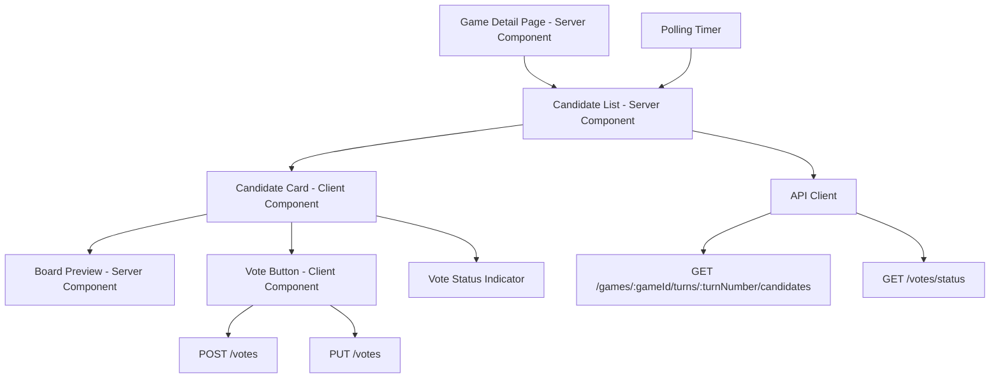
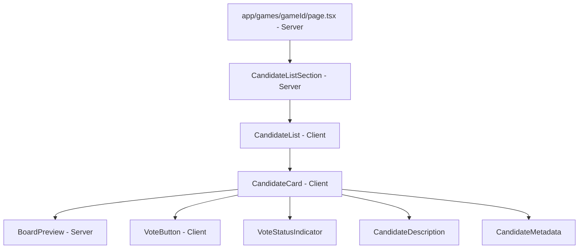
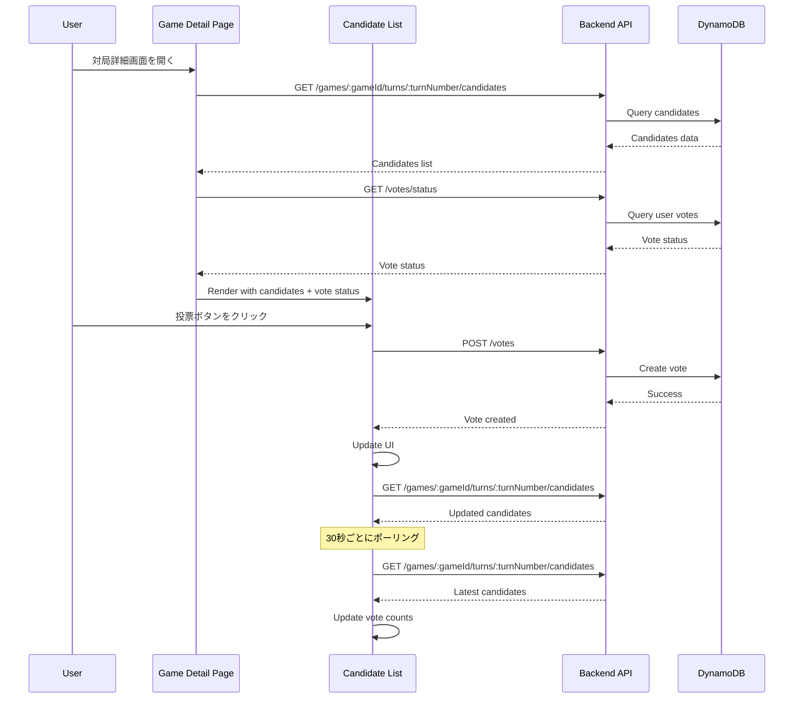

# Design Document: 次の一手候補一覧表示機能

## Overview

次の一手候補一覧表示機能は、投票対局アプリケーションのフロントエンド機能で、ユーザーが対局詳細画面で次の一手候補を閲覧し、投票できるようにします。この機能は既存のバックエンドAPI（18-get-move-candidates-api、19-post-move-candidate-api、20-vote-api、21-vote-change-api、22-vote-status-api）と連携し、Next.js 16のApp RouterとReact 19を使用して実装されます。

この機能は、既存の対局画面コンポーネント（spec 15）を拡張し、候補一覧の表示、投票機能、リアルタイム更新、レスポンシブデザイン、アクセシビリティを提供します。また、既存のE2Eテスト（spec 16）を更新して、新機能をカバーします。

Server ComponentsとClient Componentsを適切に使い分け、初期レンダリングのパフォーマンスを最適化しつつ、インタラクティブな投票体験を提供します。

## Architecture

### システム構成



### コンポーネント階層



### データフロー



## Components and Interfaces

### Component 1: CandidateListSection (Server Component)

**Purpose**: 候補一覧セクションの初期データ取得とレンダリング

**Location**: `app/games/[gameId]/_components/candidate-list-section.tsx`

**Interface**:

```typescript
interface CandidateListSectionProps {
  gameId: string;
  turnNumber: number;
  userId?: string; // 認証済みユーザーのID（未認証の場合はundefined）
}

export async function CandidateListSection(props: CandidateListSectionProps): Promise<JSX.Element>;
```

**Responsibilities**:

- 初期候補データの取得（Server-side fetch）
- 初期投票状況の取得（認証済みの場合）
- CandidateListコンポーネントへのデータ渡し
- エラーハンドリング（404、ネットワークエラー）

### Component 2: CandidateList (Client Component)

**Purpose**: 候補一覧の表示、ソート、フィルター、ポーリング

**Location**: `app/games/[gameId]/_components/candidate-list.tsx`

**Interface**:

```typescript
interface CandidateListProps {
  initialCandidates: Candidate[];
  initialVoteStatus: VoteStatus | null;
  gameId: string;
  turnNumber: number;
  userId?: string;
}

export function CandidateList(props: CandidateListProps): JSX.Element;
```

**Responsibilities**:

- 候補一覧の表示（グリッドレイアウト）
- ソート機能（投票数、作成日時）
- フィルター機能（自分の投票、AI生成、ユーザー投稿）
- 30秒ごとのポーリング更新
- ローディング状態の管理
- エラーハンドリング

**State Management**:

```typescript
const [candidates, setCandidates] = useState<Candidate[]>(initialCandidates);
const [voteStatus, setVoteStatus] = useState<VoteStatus | null>(initialVoteStatus);
const [sortBy, setSortBy] = useState<'votes' | 'createdAt'>('votes');
const [sortOrder, setSortOrder] = useState<'asc' | 'desc'>('desc');
const [filter, setFilter] = useState<'all' | 'my-vote' | 'ai' | 'user'>('all');
const [isPolling, setIsPolling] = useState(false);
```

### Component 3: CandidateCard (Client Component)

**Purpose**: 個別候補の表示と投票機能

**Location**: `app/games/[gameId]/_components/candidate-card.tsx`

**Interface**:

```typescript
interface CandidateCardProps {
  candidate: Candidate;
  isVoted: boolean;
  hasVotedOther: boolean;
  onVote: (candidateId: string) => Promise<void>;
  onVoteChange: (candidateId: string) => Promise<void>;
}

export function CandidateCard(props: CandidateCardProps): JSX.Element;
```

**Responsibilities**:

- 候補情報の表示（手の位置、説明、投票数、投稿者）
- 盤面プレビューの表示
- 投票ボタンの表示と処理
- 投票変更の確認ダイアログ
- 投票状況インジケーターの表示
- 締切までの残り時間表示
- ステータスバッジの表示

### Component 4: BoardPreview (Server Component)

**Purpose**: 候補の手を適用した盤面のプレビュー表示

**Location**: `app/games/[gameId]/_components/board-preview.tsx`

**Interface**:

```typescript
interface BoardPreviewProps {
  boardState: string[][];
  highlightPosition?: string; // 例: "D3"
  cellSize?: number; // デフォルト: 30px (モバイル), 40px (デスクトップ)
}

export function BoardPreview(props: BoardPreviewProps): JSX.Element;
```

**Responsibilities**:

- 8x8オセロ盤面の表示
- 候補の手の位置をハイライト表示
- 黒石・白石の数を表示
- レスポンシブなセルサイズ
- 既存のBoard_Component（spec 15）を再利用

### Component 5: VoteButton (Client Component)

**Purpose**: 投票ボタンと投票変更ボタンの表示と処理

**Location**: `app/games/[gameId]/_components/vote-button.tsx`

**Interface**:

```typescript
interface VoteButtonProps {
  candidateId: string;
  isVoted: boolean;
  hasVotedOther: boolean;
  isAuthenticated: boolean;
  isLoading: boolean;
  onVote: (candidateId: string) => Promise<void>;
  onVoteChange: (candidateId: string) => Promise<void>;
}

export function VoteButton(props: VoteButtonProps): JSX.Element;
```

**Responsibilities**:

- 投票ボタンの表示（未投票時）
- 投票変更ボタンの表示（他候補に投票済み時）
- 未認証時のツールチップ表示
- ローディングインジケーター
- 投票変更の確認ダイアログ

### Component 6: VoteStatusIndicator

**Purpose**: 投票済みインジケーターの表示

**Location**: `app/games/[gameId]/_components/vote-status-indicator.tsx`

**Interface**:

```typescript
interface VoteStatusIndicatorProps {
  className?: string;
}

export function VoteStatusIndicator(props: VoteStatusIndicatorProps): JSX.Element;
```

**Responsibilities**:

- "✓投票済み" ラベルの表示
- 緑色の背景スタイル
- アクセシビリティ対応（スクリーンリーダー）

### Component 7: CandidateSortFilter (Client Component)

**Purpose**: ソート・フィルター機能のUI

**Location**: `app/games/[gameId]/_components/candidate-sort-filter.tsx`

**Interface**:

```typescript
interface CandidateSortFilterProps {
  sortBy: 'votes' | 'createdAt';
  sortOrder: 'asc' | 'desc';
  filter: 'all' | 'my-vote' | 'ai' | 'user';
  onSortChange: (sortBy: 'votes' | 'createdAt', sortOrder: 'asc' | 'desc') => void;
  onFilterChange: (filter: 'all' | 'my-vote' | 'ai' | 'user') => void;
}

export function CandidateSortFilter(props: CandidateSortFilterProps): JSX.Element;
```

**Responsibilities**:

- ソートオプションの選択UI
- フィルターオプションの選択UI
- URLクエリパラメータとの同期

### Component 8: PostCandidateButton

**Purpose**: 候補投稿ボタン

**Location**: `app/games/[gameId]/_components/post-candidate-button.tsx`

**Interface**:

```typescript
interface PostCandidateButtonProps {
  gameId: string;
  isAuthenticated: boolean;
}

export function PostCandidateButton(props: PostCandidateButtonProps): JSX.Element;
```

**Responsibilities**:

- 候補投稿ボタンの表示
- 未認証時のツールチップ表示
- `/games/[gameId]/candidates/new` への遷移

### API Client Functions

**Location**: `lib/api/candidates.ts`

```typescript
/**
 * 候補一覧を取得
 */
export async function getCandidates(gameId: string, turnNumber: number): Promise<Candidate[]>;

/**
 * 投票状況を取得
 */
export async function getVoteStatus(gameId: string, turnNumber: number): Promise<VoteStatus | null>;

/**
 * 投票を作成
 */
export async function createVote(
  gameId: string,
  turnNumber: number,
  candidateId: string
): Promise<void>;

/**
 * 投票を変更
 */
export async function changeVote(
  gameId: string,
  turnNumber: number,
  candidateId: string
): Promise<void>;
```

## Data Models

### Model 1: Candidate

```typescript
interface Candidate {
  id: string; // 候補ID（UUID）
  gameId: string; // 対局ID
  turnNumber: number; // ターン番号
  position: string; // 手の位置（例: "D3"）
  description: string; // 説明文（最大200文字）
  boardState: string[][]; // 候補適用後の盤面状態
  voteCount: number; // 投票数
  postedBy: string; // 投稿者のユーザーID
  postedByUsername: string; // 投稿者のユーザー名
  status: 'active' | 'closed'; // ステータス
  deadline: string; // 投票締切日時（ISO 8601）
  createdAt: string; // 作成日時（ISO 8601）
  source: 'ai' | 'user'; // 候補の生成元
}
```

**Validation Rules**:

- id: UUID v4形式
- gameId: UUID v4形式
- turnNumber: 0以上の整数
- position: A-H列、1-8行の形式（例: "D3"）
- description: 最大200文字
- boardState: 8x8の2次元配列
- voteCount: 0以上の整数
- status: 'active' または 'closed'
- deadline: ISO 8601形式
- createdAt: ISO 8601形式
- source: 'ai' または 'user'

### Model 2: VoteStatus

```typescript
interface VoteStatus {
  gameId: string; // 対局ID
  turnNumber: number; // ターン番号
  userId: string; // ユーザーID
  candidateId: string; // 投票した候補ID
  createdAt: string; // 投票日時（ISO 8601）
  updatedAt: string; // 更新日時（ISO 8601）
}
```

**Validation Rules**:

- gameId: UUID v4形式
- turnNumber: 0以上の整数
- userId: UUID v4形式
- candidateId: UUID v4形式
- createdAt: ISO 8601形式
- updatedAt: ISO 8601形式

### Model 3: SortFilterState

```typescript
interface SortFilterState {
  sortBy: 'votes' | 'createdAt';
  sortOrder: 'asc' | 'desc';
  filter: 'all' | 'my-vote' | 'ai' | 'user';
}
```

**Validation Rules**:

- sortBy: 'votes' または 'createdAt'
- sortOrder: 'asc' または 'desc'
- filter: 'all', 'my-vote', 'ai', 'user' のいずれか

## Key Functions with Formal Specifications

### Function 1: sortCandidates()

```typescript
function sortCandidates(
  candidates: Candidate[],
  sortBy: 'votes' | 'createdAt',
  sortOrder: 'asc' | 'desc'
): Candidate[];
```

**Preconditions:**

- `candidates` is a valid array of Candidate objects
- `sortBy` is either 'votes' or 'createdAt'
- `sortOrder` is either 'asc' or 'desc'

**Postconditions:**

- Returns a new sorted array without mutating the input
- When sortBy is 'votes', candidates are sorted by voteCount
- When sortBy is 'createdAt', candidates are sorted by createdAt timestamp
- When sortOrder is 'desc', higher values come first
- When sortOrder is 'asc', lower values come first

**Loop Invariants:**

- For each pair of adjacent candidates (i, i+1) in the result: sortOrder determines the comparison result

### Function 2: filterCandidates()

```typescript
function filterCandidates(
  candidates: Candidate[],
  filter: 'all' | 'my-vote' | 'ai' | 'user',
  votedCandidateId?: string
): Candidate[];
```

**Preconditions:**

- `candidates` is a valid array of Candidate objects
- `filter` is one of 'all', 'my-vote', 'ai', 'user'
- `votedCandidateId` is provided when filter is 'my-vote'

**Postconditions:**

- Returns a new filtered array without mutating the input
- When filter is 'all', returns all candidates
- When filter is 'my-vote', returns only the candidate matching votedCandidateId
- When filter is 'ai', returns only candidates where source is 'ai'
- When filter is 'user', returns only candidates where source is 'user'

**Loop Invariants:**

- For each candidate in the result: candidate matches the filter criteria

### Function 3: calculateTimeRemaining()

```typescript
function calculateTimeRemaining(deadline: string): {
  hours: number;
  minutes: number;
  isExpired: boolean;
  displayText: string;
  colorClass: string;
};
```

**Preconditions:**

- `deadline` is a valid ISO 8601 timestamp string

**Postconditions:**

- Returns an object with time remaining information
- When deadline is in the past, isExpired is true
- When deadline is less than 1 hour away, colorClass is 'text-red-500'
- When deadline is less than 24 hours away, colorClass is 'text-orange-500'
- displayText is in Japanese relative time format (e.g., "あと2時間30分")

**Loop Invariants:** N/A

### Function 4: handleVote()

```typescript
async function handleVote(candidateId: string, gameId: string, turnNumber: number): Promise<void>;
```

**Preconditions:**

- User is authenticated
- `candidateId` is a valid UUID
- `gameId` is a valid UUID
- `turnNumber` is a non-negative integer
- Candidate status is 'active'

**Postconditions:**

- POST /votes API is called with correct parameters
- On success, vote status is updated in UI
- On success, candidate list is refreshed
- On failure, error message is displayed
- Loading state is managed correctly

**Loop Invariants:** N/A

### Function 5: handleVoteChange()

```typescript
async function handleVoteChange(
  candidateId: string,
  gameId: string,
  turnNumber: number
): Promise<void>;
```

**Preconditions:**

- User is authenticated
- User has already voted for a different candidate
- `candidateId` is a valid UUID
- `gameId` is a valid UUID
- `turnNumber` is a non-negative integer
- Candidate status is 'active'
- User has confirmed the vote change

**Postconditions:**

- PUT /votes API is called with correct parameters
- On success, all candidate vote statuses are updated in UI
- On success, candidate list is refreshed
- On failure, error message is displayed
- Loading state is managed correctly

**Loop Invariants:** N/A

## Algorithmic Pseudocode

### Candidate List Rendering with Polling

```typescript
function CandidateList({ initialCandidates, initialVoteStatus, gameId, turnNumber, userId }) {
  // State initialization
  const [candidates, setCandidates] = useState(initialCandidates);
  const [voteStatus, setVoteStatus] = useState(initialVoteStatus);
  const [sortBy, setSortBy] = useState('votes');
  const [sortOrder, setSortOrder] = useState('desc');
  const [filter, setFilter] = useState('all');
  const [isPolling, setIsPolling] = useState(false);

  // Polling effect
  useEffect(() => {
    const pollInterval = setInterval(async () => {
      if (document.visibilityState === 'visible') {
        setIsPolling(true);
        try {
          const updatedCandidates = await getCandidates(gameId, turnNumber);
          setCandidates(updatedCandidates);
        } catch (error) {
          console.error('Polling error:', error);
        } finally {
          setIsPolling(false);
        }
      }
    }, 30000); // 30 seconds

    return () => clearInterval(pollInterval);
  }, [gameId, turnNumber]);

  // Sort and filter candidates
  const processedCandidates = useMemo(() => {
    let result = [...candidates];

    // Apply filter
    result = filterCandidates(result, filter, voteStatus?.candidateId);

    // Apply sort
    result = sortCandidates(result, sortBy, sortOrder);

    return result;
  }, [candidates, sortBy, sortOrder, filter, voteStatus]);

  // Vote handler
  const handleVote = async (candidateId: string) => {
    try {
      await createVote(gameId, turnNumber, candidateId);

      // Update vote status
      const newVoteStatus = await getVoteStatus(gameId, turnNumber);
      setVoteStatus(newVoteStatus);

      // Refresh candidates immediately
      const updatedCandidates = await getCandidates(gameId, turnNumber);
      setCandidates(updatedCandidates);
    } catch (error) {
      // Show error message
      showError('投票に失敗しました');
    }
  };

  // Vote change handler
  const handleVoteChange = async (candidateId: string) => {
    const confirmed = await showConfirmDialog(
      '現在の投票を取り消して、この候補に投票しますか？'
    );

    if (!confirmed) return;

    try {
      await changeVote(gameId, turnNumber, candidateId);

      // Update vote status
      const newVoteStatus = await getVoteStatus(gameId, turnNumber);
      setVoteStatus(newVoteStatus);

      // Refresh candidates immediately
      const updatedCandidates = await getCandidates(gameId, turnNumber);
      setCandidates(updatedCandidates);
    } catch (error) {
      // Show error message
      showError('投票の変更に失敗しました');
    }
  };

  return (
    <div>
      <CandidateSortFilter
        sortBy={sortBy}
        sortOrder={sortOrder}
        filter={filter}
        onSortChange={(newSortBy, newSortOrder) => {
          setSortBy(newSortBy);
          setSortOrder(newSortOrder);
        }}
        onFilterChange={setFilter}
      />

      <div className="grid grid-cols-1 md:grid-cols-2 gap-4">
        {processedCandidates.map(candidate => (
          <CandidateCard
            key={candidate.id}
            candidate={candidate}
            isVoted={voteStatus?.candidateId === candidate.id}
            hasVotedOther={voteStatus !== null && voteStatus.candidateId !== candidate.id}
            onVote={handleVote}
            onVoteChange={handleVoteChange}
          />
        ))}
      </div>

      {processedCandidates.length === 0 && (
        <p className="text-center text-gray-500">まだ候補がありません</p>
      )}
    </div>
  );
}
```

**Preconditions:**

- initialCandidates is a valid array of Candidate objects
- initialVoteStatus is either a valid VoteStatus object or null
- gameId and turnNumber are valid identifiers
- userId is provided if user is authenticated

**Postconditions:**

- Candidates are displayed in sorted and filtered order
- Polling updates candidates every 30 seconds when page is visible
- Vote and vote change operations update UI correctly
- Error messages are displayed when operations fail

**Loop Invariants:**

- Polling interval remains active while component is mounted
- Candidates array is never mutated directly (immutable updates)
- Vote status reflects the latest server state after any vote operation

### Sort Algorithm

```typescript
function sortCandidates(
  candidates: Candidate[],
  sortBy: 'votes' | 'createdAt',
  sortOrder: 'asc' | 'desc'
): Candidate[] {
  const sorted = [...candidates].sort((a, b) => {
    let comparison = 0;

    if (sortBy === 'votes') {
      comparison = a.voteCount - b.voteCount;
    } else if (sortBy === 'createdAt') {
      comparison = new Date(a.createdAt).getTime() - new Date(b.createdAt).getTime();
    }

    return sortOrder === 'desc' ? -comparison : comparison;
  });

  return sorted;
}
```

**Preconditions:**

- candidates is a non-null array
- Each candidate has valid voteCount and createdAt fields

**Postconditions:**

- Returns a new array (does not mutate input)
- Array is sorted according to sortBy and sortOrder parameters
- Original array remains unchanged

**Loop Invariants:**

- For each comparison: the sort order is consistently applied

### Filter Algorithm

```typescript
function filterCandidates(
  candidates: Candidate[],
  filter: 'all' | 'my-vote' | 'ai' | 'user',
  votedCandidateId?: string
): Candidate[] {
  if (filter === 'all') {
    return candidates;
  }

  if (filter === 'my-vote') {
    return candidates.filter((c) => c.id === votedCandidateId);
  }

  if (filter === 'ai') {
    return candidates.filter((c) => c.source === 'ai');
  }

  if (filter === 'user') {
    return candidates.filter((c) => c.source === 'user');
  }

  return candidates;
}
```

**Preconditions:**

- candidates is a non-null array
- filter is one of the valid filter types
- votedCandidateId is provided when filter is 'my-vote'

**Postconditions:**

- Returns a new array containing only candidates matching the filter
- Original array remains unchanged

**Loop Invariants:**

- For each candidate in result: candidate matches the filter criteria

## Example Usage

```typescript
// Example 1: Server Component - Initial data fetching
export async function CandidateListSection({ gameId, turnNumber, userId }: CandidateListSectionProps) {
  try {
    // Fetch initial data on server
    const candidates = await getCandidates(gameId, turnNumber);
    const voteStatus = userId ? await getVoteStatus(gameId, turnNumber) : null;

    return (
      <section className="mt-8">
        <h2 className="text-2xl font-bold mb-4">次の一手候補</h2>
        <CandidateList
          initialCandidates={candidates}
          initialVoteStatus={voteStatus}
          gameId={gameId}
          turnNumber={turnNumber}
          userId={userId}
        />
      </section>
    );
  } catch (error) {
    return (
      <div className="text-red-500">
        候補の取得に失敗しました
      </div>
    );
  }
}

// Example 2: Client Component - Candidate card with vote button
export function CandidateCard({ candidate, isVoted, hasVotedOther, onVote, onVoteChange }: CandidateCardProps) {
  const [isLoading, setIsLoading] = useState(false);
  const timeRemaining = calculateTimeRemaining(candidate.deadline);

  const handleVoteClick = async () => {
    setIsLoading(true);
    try {
      if (hasVotedOther) {
        await onVoteChange(candidate.id);
      } else {
        await onVote(candidate.id);
      }
    } finally {
      setIsLoading(false);
    }
  };

  return (
    <div className="border rounded-lg p-4 relative">
      {/* Status badge */}
      <div className="absolute top-2 right-2">
        {candidate.status === 'active' ? (
          <span className="bg-green-100 text-green-800 px-2 py-1 rounded text-sm">
            投票受付中
          </span>
        ) : (
          <span className="bg-gray-100 text-gray-800 px-2 py-1 rounded text-sm">
            締切済み
          </span>
        )}
      </div>

      {/* Move position */}
      <h3 className="text-xl font-bold mb-2">{candidate.position}</h3>

      {/* Board preview */}
      <BoardPreview
        boardState={candidate.boardState}
        highlightPosition={candidate.position}
        cellSize={30}
      />

      {/* Description */}
      <p className="mt-4 text-gray-700">{candidate.description}</p>

      {/* Metadata */}
      <div className="mt-4 flex justify-between items-center text-sm text-gray-600">
        <span>投稿者: {candidate.postedByUsername}</span>
        <span>投票数: {candidate.voteCount}</span>
      </div>

      {/* Time remaining */}
      <div className={`mt-2 text-sm ${timeRemaining.colorClass}`}>
        {timeRemaining.isExpired ? '締切済み' : timeRemaining.displayText}
      </div>

      {/* Vote button or status */}
      <div className="mt-4">
        {isVoted ? (
          <VoteStatusIndicator />
        ) : (
          <VoteButton
            candidateId={candidate.id}
            isVoted={isVoted}
            hasVotedOther={hasVotedOther}
            isAuthenticated={true}
            isLoading={isLoading}
            onVote={onVote}
            onVoteChange={onVoteChange}
          />
        )}
      </div>
    </div>
  );
}

// Example 3: API client function
export async function getCandidates(gameId: string, turnNumber: number): Promise<Candidate[]> {
  const response = await fetch(
    `${process.env.NEXT_PUBLIC_API_URL}/api/games/${gameId}/turns/${turnNumber}/candidates`,
    {
      headers: {
        'Content-Type': 'application/json',
      },
      cache: 'no-store', // Always fetch fresh data
    }
  );

  if (!response.ok) {
    if (response.status === 404) {
      throw new Error('対局が見つかりません');
    }
    throw new Error('候補の取得に失敗しました');
  }

  const data = await response.json();
  return data.candidates;
}

// Example 4: Vote with authentication
export async function createVote(
  gameId: string,
  turnNumber: number,
  candidateId: string
): Promise<void> {
  const token = await getAuthToken(); // Get JWT token

  const response = await fetch(
    `${process.env.NEXT_PUBLIC_API_URL}/api/votes`,
    {
      method: 'POST',
      headers: {
        'Content-Type': 'application/json',
        'Authorization': `Bearer ${token}`,
      },
      body: JSON.stringify({
        gameId,
        turnNumber,
        candidateId,
      }),
    }
  );

  if (!response.ok) {
    if (response.status === 401) {
      throw new Error('認証が必要です');
    }
    throw new Error('投票に失敗しました');
  }
}
```

## Correctness Properties

_プロパティは、システムのすべての有効な実行において真であるべき特性または動作です。これらは、人間が読める仕様と機械検証可能な正確性保証との橋渡しとなります。_

### Property 1: 候補リストのソート順

_For any_ 候補リストとソート設定（sortBy, sortOrder）に対して、ソート後のリストは指定された順序で並んでいる。投票数でソートする場合は voteCount で、作成日時でソートする場合は createdAt で、昇順または降順に並んでいる。

**Validates: Requirements 1.3, 16.1, 16.5**

### Property 2: 候補カードの必須フィールド表示

_For any_ 候補カードに対して、手の位置、盤面プレビュー、説明文、投稿者名、投票数、締切日時、ステータス、投票ボタン、作成日時のすべてのフィールドが表示される。

**Validates: Requirements 2.1, 2.2, 2.3, 2.4, 2.5, 2.6, 2.7, 2.8, 2.9**

### Property 3: 盤面プレビューの正確性

_For any_ 盤面プレビューに対して、8x8グリッドが表示され、候補の手を適用した状態の盤面が表示され、候補の手の位置がハイライトされ、黒石と白石の数が表示される。

**Validates: Requirements 3.1, 3.2, 3.3, 3.7**

### Property 4: 未認証ユーザーの投票制限

_For any_ 未認証ユーザーに対して、投票ボタンは無効化され、ツールチップに「ログインして投票」が表示される。

**Validates: Requirements 4.2, 4.3**

### Property 5: フィルター機能の正確性

_For any_ 候補リストとフィルター設定に対して、フィルター後のリストは指定された条件に一致する候補のみを含む。'my-vote'の場合は自分が投票した候補のみ、'ai'の場合はAI生成候補のみ、'user'の場合はユーザー投稿候補のみ、'all'の場合はすべての候補を含む。

**Validates: Requirements 16.4, 16.6**

### Property 6: エラーメッセージのセキュリティ

_For any_ エラーメッセージに対して、機密情報（APIキー、内部パス、スタックトレース、ユーザーIDなど）が含まれない。

**Validates: Requirements 8.7**

### Property 7: 締切までの残り時間表示

_For any_ 候補カードに対して、投票締切までの残り時間が相対時間形式で表示される。締切まで1時間未満の場合は赤色、24時間未満の場合はオレンジ色、締切後は「締切済み」が表示される。

**Validates: Requirements 18.1, 18.2, 18.3, 18.4, 18.5**

### Property 8: ステータスバッジの表示

_For any_ 候補カードに対して、ステータスバッジが表示される。ステータスが'active'の場合は「投票受付中」が緑色で、'closed'の場合は「締切済み」がグレー色で表示される。

**Validates: Requirements 20.1, 20.2, 20.3**

### Property 9: 締切後の投票ボタン無効化

_For any_ ステータスが'closed'の候補に対して、投票ボタンは無効化される。

**Validates: Requirements 20.4**

### Property 10: 投票後のUI更新

_For any_ 投票成功後に対して、投票数が更新され、投票済みインジケーターが表示され、投票ボタンが非表示になる。

**Validates: Requirements 4.5, 4.6, 5.3, 5.4**

## Error Handling

### Error Scenario 1: 候補取得APIの失敗

**Condition**: GET /games/:gameId/turns/:turnNumber/candidates APIが失敗した場合
**Response**: 「候補の取得に失敗しました」エラーメッセージを表示
**Recovery**: リトライボタンを表示し、ユーザーが手動で再取得できるようにする

### Error Scenario 2: 投票APIの失敗

**Condition**: POST /votes APIが失敗した場合
**Response**: 「投票に失敗しました」エラーメッセージを表示
**Recovery**: 投票ボタンを再度有効化し、ユーザーが再試行できるようにする

### Error Scenario 3: 投票変更APIの失敗

**Condition**: PUT /votes APIが失敗した場合
**Response**: 「投票の変更に失敗しました」エラーメッセージを表示
**Recovery**: 投票変更ボタンを再度有効化し、ユーザーが再試行できるようにする

### Error Scenario 4: ネットワークエラー

**Condition**: ネットワーク接続が失われた場合
**Response**: 「ネットワークエラーが発生しました」メッセージを表示
**Recovery**: ポーリングを一時停止し、接続が回復したら自動的に再開する

### Error Scenario 5: 認証エラー (401)

**Condition**: 認証トークンが無効または期限切れの場合
**Response**: ログイン画面にリダイレクト
**Recovery**: ユーザーが再ログインした後、元のページに戻る

### Error Scenario 6: 対局が見つからない (404)

**Condition**: 指定された対局が存在しない場合
**Response**: 「対局が見つかりません」メッセージを表示
**Recovery**: 対局一覧ページへのリンクを表示

### Error Scenario 7: バリデーションエラー

**Condition**: クライアント側のバリデーションが失敗した場合
**Response**: フィールド固有のエラーメッセージを表示
**Recovery**: ユーザーが入力を修正できるようにする

### Error Scenario 8: ポーリング中のエラー

**Condition**: バックグラウンドポーリング中にエラーが発生した場合
**Response**: コンソールにエラーをログ出力（UIには表示しない）
**Recovery**: 次のポーリングサイクルで自動的に再試行する

## Testing Strategy

### ユニットテスト

**対象コンポーネント**:

- `CandidateList`: ソート、フィルター、ポーリング機能
- `CandidateCard`: 投票ボタン、投票状況表示
- `VoteButton`: 投票処理、投票変更処理
- `BoardPreview`: 盤面表示、ハイライト
- `CandidateSortFilter`: ソート・フィルター UI
- API client functions: getCandidates, getVoteStatus, createVote, changeVote

**テストファイル**:

- `app/games/[gameId]/_components/candidate-list.test.tsx`
- `app/games/[gameId]/_components/candidate-card.test.tsx`
- `app/games/[gameId]/_components/vote-button.test.tsx`
- `app/games/[gameId]/_components/board-preview.test.tsx`
- `app/games/[gameId]/_components/candidate-sort-filter.test.tsx`
- `lib/api/candidates.test.ts`

**テストケース**:

- 正常系: 候補一覧の表示、ソート、フィルター
- 投票機能: 投票成功、投票失敗、投票変更
- エラーハンドリング: 各種エラーシナリオ
- ポーリング: 30秒ごとの更新、ページ非表示時の停止
- レスポンシブ: デスクトップ・モバイルレイアウト
- アクセシビリティ: キーボード操作、スクリーンリーダー

### プロパティベーステスト

**テストライブラリ**: fast-check

**設定**:

- `numRuns: 10`（JSDOM環境での安定性のため）
- `endOnFailure: true`

**テストファイル**:

- `app/games/[gameId]/_components/candidate-list.property.test.tsx`
- `lib/utils/sort-filter.property.test.ts`

**プロパティテスト対象**:

- Property 1: 候補リストのソート順
  - Tag: **Feature: 23-move-candidates-display, Property 1: 候補リストのソート順**
  - ランダムな候補リストを生成し、ソート後の順序を検証
- Property 2: 候補カードの必須フィールド表示
  - Tag: **Feature: 23-move-candidates-display, Property 2: 候補カードの必須フィールド表示**
  - ランダムな候補データを生成し、すべての必須フィールドが表示されることを検証
- Property 3: 盤面プレビューの正確性
  - Tag: **Feature: 23-move-candidates-display, Property 3: 盤面プレビューの正確性**
  - ランダムな盤面状態を生成し、8x8グリッド、ハイライト、石の数が正しく表示されることを検証
- Property 5: フィルター機能の正確性
  - Tag: **Feature: 23-move-candidates-display, Property 5: フィルター機能の正確性**
  - ランダムな候補リストとフィルター設定を生成し、フィルター後のリストが条件に一致することを検証
- Property 6: エラーメッセージのセキュリティ
  - Tag: **Feature: 23-move-candidates-display, Property 6: エラーメッセージのセキュリティ**
  - ランダムなエラーシナリオを生成し、エラーメッセージに機密情報が含まれないことを検証

### E2Eテスト

**対象フロー**:

- 候補一覧の表示と閲覧
- 投票フロー（未認証・認証済み）
- 投票変更フロー
- ソート・フィルター機能
- レスポンシブデザイン（モバイル・デスクトップ）

**テストファイル**:

- `tests/e2e/game/move-candidates.spec.ts`（新規作成）
- `tests/e2e/game/game-detail.spec.ts`（既存ファイルを更新）

**既存E2Eテストの更新**:

spec 16（e2e-testing-game-management）の以下のテストファイルを更新:

- `tests/e2e/game/game-detail.spec.ts`: 候補一覧セクションの表示確認を追加
- `tests/e2e/pages/game-detail.page.ts`: 候補一覧関連のページオブジェクトメソッドを追加

**新規テストケース**:

```typescript
// tests/e2e/game/move-candidates.spec.ts
test.describe('Move Candidates Display', () => {
  test('displays candidate list on game detail page', async ({ page }) => {
    // 対局詳細ページに移動
    await page.goto('/games/test-game-id');

    // 候補一覧セクションが表示されることを確認
    await expect(page.locator('[data-testid="candidate-list"]')).toBeVisible();

    // 候補カードが表示されることを確認
    const candidateCards = page.locator('[data-testid="candidate-card"]');
    expect(await candidateCards.count()).toBeGreaterThan(0);
  });

  test('authenticated user can vote on candidate', async ({ page }) => {
    // ログイン
    await loginAsTestUser(page);

    // 対局詳細ページに移動
    await page.goto('/games/test-game-id');

    // 最初の候補の投票ボタンをクリック
    await page.locator('[data-testid="vote-button"]').first().click();

    // 投票済みインジケーターが表示されることを確認
    await expect(page.locator('[data-testid="vote-status-indicator"]').first()).toBeVisible();
  });

  test('user can change vote to different candidate', async ({ page }) => {
    // ログイン
    await loginAsTestUser(page);

    // 対局詳細ページに移動
    await page.goto('/games/test-game-id');

    // 最初の候補に投票
    await page.locator('[data-testid="vote-button"]').first().click();

    // 2番目の候補の投票変更ボタンをクリック
    await page.locator('[data-testid="vote-change-button"]').nth(1).click();

    // 確認ダイアログが表示されることを確認
    await expect(page.locator('[role="dialog"]')).toBeVisible();

    // 確認ボタンをクリック
    await page.locator('[data-testid="confirm-button"]').click();

    // 2番目の候補に投票済みインジケーターが表示されることを確認
    await expect(
      page
        .locator('[data-testid="candidate-card"]')
        .nth(1)
        .locator('[data-testid="vote-status-indicator"]')
    ).toBeVisible();
  });

  test('sort and filter candidates', async ({ page }) => {
    await page.goto('/games/test-game-id');

    // ソートオプションを変更
    await page.locator('[data-testid="sort-select"]').selectOption('createdAt');

    // フィルターオプションを変更
    await page.locator('[data-testid="filter-select"]').selectOption('ai');

    // URLクエリパラメータが更新されることを確認
    await expect(page).toHaveURL(/sortBy=createdAt/);
    await expect(page).toHaveURL(/filter=ai/);
  });
});
```

## Performance Considerations

### 初期レンダリングの最適化

- Server Componentsで初期データを取得し、First Contentful Paint (FCP) を最適化
- 候補一覧の初期表示を1秒以内に完了
- Suspense boundariesを使用して段階的なレンダリング

### ポーリングの最適化

- ポーリング間隔: 30秒（バランスの取れた更新頻度）
- ページがバックグラウンドの時はポーリングを停止（Page Visibility API使用）
- ポーリング中はローディングインジケーターを表示しない（UX向上）

### レンダリングパフォーマンス

- React.memoを使用して不要な再レンダリングを防止
- useMemoでソート・フィルター処理をメモ化
- 候補が50個以上の場合は仮想スクロール（react-window）を検討

### 画像の最適化

- 盤面プレビューはSVGまたはCanvas APIで効率的にレンダリング
- 画像の遅延読み込み（loading="lazy"）
- 適切な画像サイズ（デスクトップ: 320px、モバイル: 240px）

### バンドルサイズの最適化

- Client Componentsを最小限に抑える
- 動的インポート（next/dynamic）でコード分割
- Tree shakingで未使用コードを削除

## Security Considerations

### 認証・認可

- JWT トークンによる認証（既存の認証ミドルウェアを使用）
- 投票APIは認証必須
- 未認証ユーザーは候補の閲覧のみ可能

### 入力バリデーション

- クライアント側とサーバー側の両方でバリデーション
- XSS対策: ユーザー入力をエスケープ（React のデフォルト動作）
- CSRF対策: SameSite Cookie属性を使用

### エラーメッセージのセキュリティ

- エラーメッセージに機密情報を含めない
- スタックトレース、内部パス、APIキーを公開しない
- ユーザーフレンドリーなエラーメッセージのみ表示

### レート制限

- 投票API: 1ユーザーあたり1ターンに1回のみ
- ポーリング: 30秒間隔で自動制限
- API Gatewayのレート制限を活用

### データの保護

- HTTPS通信のみ（CloudFront経由）
- 認証トークンはhttpOnly Cookieまたはメモリに保存
- LocalStorageに機密情報を保存しない

## Dependencies

### 既存の依存関係

- Next.js 16
- React 19
- TypeScript
- Tailwind CSS
- shadcn/ui
- Lucide React

### 新規の依存関係

なし（既存の依存関係のみで実装可能）

### 既存コンポーネントの再利用

- `Board_Component`（spec 15）: 盤面プレビューで再利用
- `Game_Card_Component`（spec 15）: レイアウトパターンを参考
- 認証コンテキスト（spec 9）: ユーザー認証状態の取得

### 既存APIの利用

- GET /games/:gameId/turns/:turnNumber/candidates（spec 18）
- POST /games/:gameId/turns/:turnNumber/candidates（spec 19）
- POST /votes（spec 20）
- PUT /votes（spec 21）
- GET /games/:gameId/turns/:turnNumber/votes/me（spec 22）

## File Structure

```
apps/web/
├── app/
│   └── games/
│       └── [gameId]/
│           ├── page.tsx                          # 対局詳細ページ（既存、更新）
│           └── _components/
│               ├── candidate-list-section.tsx    # 新規: Server Component
│               ├── candidate-list.tsx            # 新規: Client Component
│               ├── candidate-card.tsx            # 新規: Client Component
│               ├── board-preview.tsx             # 新規: Server Component
│               ├── vote-button.tsx               # 新規: Client Component
│               ├── vote-status-indicator.tsx    # 新規
│               ├── candidate-sort-filter.tsx    # 新規: Client Component
│               ├── post-candidate-button.tsx    # 新規
│               ├── candidate-list.test.tsx      # 新規: ユニットテスト
│               ├── candidate-card.test.tsx      # 新規: ユニットテスト
│               ├── vote-button.test.tsx         # 新規: ユニットテスト
│               ├── board-preview.test.tsx       # 新規: ユニットテスト
│               ├── candidate-sort-filter.test.tsx # 新規: ユニットテスト
│               ├── candidate-list.property.test.tsx # 新規: プロパティテスト
│               └── board-component.tsx          # 既存（spec 15から再利用）
├── lib/
│   ├── api/
│   │   ├── candidates.ts                        # 新規: API client functions
│   │   └── candidates.test.ts                   # 新規: ユニットテスト
│   └── utils/
│       ├── sort-filter.ts                       # 新規: ソート・フィルター関数
│       ├── sort-filter.test.ts                  # 新規: ユニットテスト
│       ├── sort-filter.property.test.ts         # 新規: プロパティテスト
│       ├── time-remaining.ts                    # 新規: 残り時間計算
│       └── time-remaining.test.ts               # 新規: ユニットテスト
└── tests/
    └── e2e/
        ├── game/
        │   ├── move-candidates.spec.ts          # 新規: E2Eテスト
        │   └── game-detail.spec.ts              # 既存（spec 16）、更新
        └── pages/
            └── game-detail.page.ts              # 既存（spec 16）、更新
```

## Implementation Notes

### Server Components vs Client Components

**Server Components**:

- `CandidateListSection`: 初期データ取得
- `BoardPreview`: 静的な盤面表示

**Client Components**:

- `CandidateList`: ポーリング、ソート、フィルター
- `CandidateCard`: 投票ボタン、インタラクション
- `VoteButton`: 投票処理
- `CandidateSortFilter`: ソート・フィルターUI

### State Management

- Server Componentsで初期データを取得
- Client ComponentsでuseStateを使用してローカル状態を管理
- グローバル状態管理ライブラリは不要（Reactのhooksで十分）

### URL Query Parameters

ソート・フィルター設定をURLクエリパラメータに保存:

```typescript
// 例: /games/123?sortBy=votes&sortOrder=desc&filter=ai
const searchParams = useSearchParams();
const sortBy = searchParams.get('sortBy') || 'votes';
const sortOrder = searchParams.get('sortOrder') || 'desc';
const filter = searchParams.get('filter') || 'all';
```

### Accessibility

- セマンティックHTML: `<section>`, `<article>`, `<button>`
- ARIAラベル: `aria-label`, `aria-describedby`
- キーボードナビゲーション: Tab, Enter, Space
- フォーカスインジケーター: `focus:ring-2 focus:ring-blue-500`
- スクリーンリーダー対応: `role`, `aria-live`
- コントラスト比: 最低4.5:1

### Responsive Design

**ブレークポイント**:

- モバイル: `< 640px` - 単一カラム
- タブレット: `640px - 767px` - 2カラム
- デスクトップ: `≥ 768px` - 2カラム

**タッチターゲット**:

- 最小サイズ: 44px × 44px
- ボタン間のスペース: 8px以上

## Migration Strategy

### 既存コードへの影響

1. **対局詳細ページ（`app/games/[gameId]/page.tsx`）**:
   - `CandidateListSection`コンポーネントを追加
   - 既存のレイアウトは維持

2. **E2Eテスト（spec 16）**:
   - `tests/e2e/game/game-detail.spec.ts`に候補一覧の確認を追加
   - `tests/e2e/pages/game-detail.page.ts`にページオブジェクトメソッドを追加

### 段階的な実装

1. **Phase 1**: 基本的な候補一覧表示
   - CandidateListSection, CandidateList, CandidateCard
   - BoardPreview（既存Board_Componentを再利用）
   - API client functions

2. **Phase 2**: 投票機能
   - VoteButton, VoteStatusIndicator
   - 投票API連携
   - 投票変更機能

3. **Phase 3**: 高度な機能
   - ソート・フィルター機能
   - ポーリング更新
   - 残り時間表示

4. **Phase 4**: テストとE2E
   - ユニットテスト
   - プロパティベーステスト
   - E2Eテスト更新

### ロールバック計画

- 新機能は既存機能に影響を与えない独立したコンポーネント
- 問題が発生した場合は`CandidateListSection`の呼び出しをコメントアウト
- APIエンドポイントは既存のものを使用（新規エンドポイントなし）

## Future Enhancements

### MVP後の拡張機能

1. **投票数のアニメーション**: フェードイン効果で投票数の変化を視覚化
2. **裏返される石のアニメーション**: 盤面プレビューでアニメーション表示
3. **候補の詳細ページ**: 候補の完全な情報と投票履歴を表示
4. **シェア機能**: 候補をSNSでシェア
5. **通知機能**: 投票締切が近づいたら通知
6. **候補の比較機能**: 複数の候補を並べて比較
7. **投票理由のコメント**: 投票時に理由を記入（SNS連携）

### パフォーマンス改善

1. **WebSocket**: ポーリングの代わりにリアルタイム更新
2. **Service Worker**: オフライン対応とキャッシュ戦略
3. **仮想スクロール**: 大量の候補を効率的に表示
4. **画像の最適化**: WebP形式、レスポンシブ画像

### アクセシビリティ改善

1. **ハイコントラストモード**: 視覚障害者向け
2. **音声読み上げ**: 投票結果の音声フィードバック
3. **キーボードショートカット**: 高度なキーボード操作
