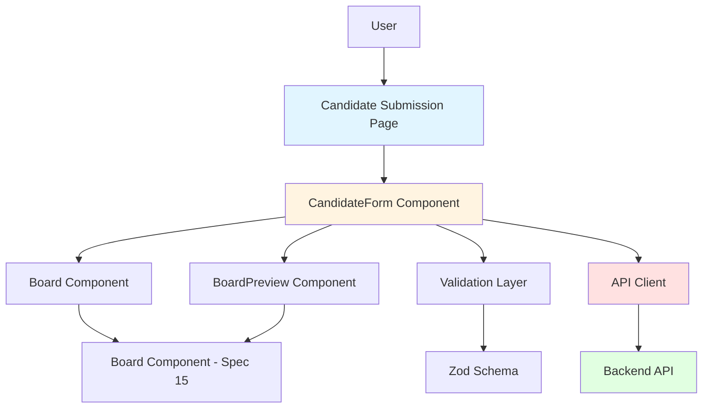
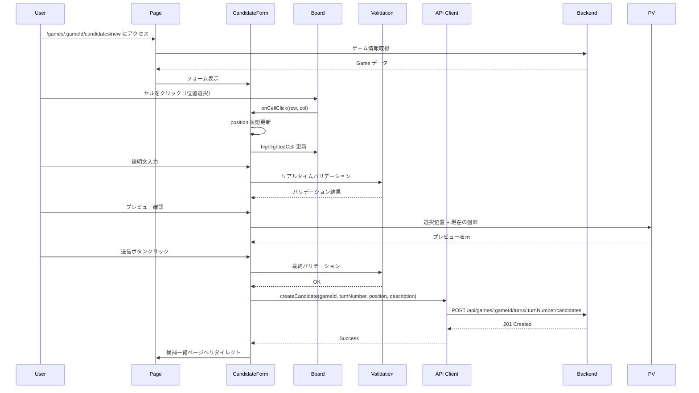
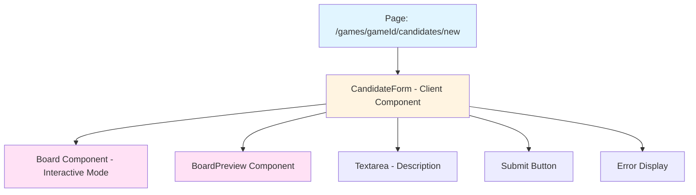

# Design Document: 候補投稿フォーム機能

## Overview

候補投稿フォーム機能は、投票対局アプリケーションにおいて、認証済みユーザーが特定の対局の特定のターンに対して次の一手の候補を投稿するためのWebフォームです。このフォームは Next.js 16 App Router と React 19 を使用し、`/games/[gameId]/candidates/new` パスでアクセス可能です。

ユーザーは盤面上でセルをクリックして位置を選択し、その手の説明文（最大200文字）を入力し、プレビューで盤面の変化を確認してから候補を投稿できます。フォームは既存の POST /games/:gameId/turns/:turnNumber/candidates API（spec 19）と統合され、リアルタイムバリデーション、アクセシビリティ対応、レスポンシブデザインを提供します。

## Architecture

### システム構成



### ユーザーフロー



### コンポーネント構成



## Components and Interfaces

### Page Component

#### /games/[gameId]/candidates/new/page.tsx

Server Component として実装し、ゲーム情報を取得してフォームに渡します。

```typescript
interface PageProps {
  params: {
    gameId: string;
  };
  searchParams: {
    turnNumber?: string;
  };
}

async function CandidateSubmissionPage({ params, searchParams }: PageProps): Promise<JSX.Element>;
```

**責務:**

- ゲーム情報の取得（Server Component）
- 認証状態の確認
- エラーハンドリング（ゲーム未存在、認証エラー）
- CandidateForm への props 渡し

### CandidateForm Component

#### Client Component

```typescript
interface CandidateFormProps {
  gameId: string;
  turnNumber: number;
  currentBoardState: BoardState;
  currentPlayer: 'black' | 'white';
}

function CandidateForm({
  gameId,
  turnNumber,
  currentBoardState,
  currentPlayer,
}: CandidateFormProps): JSX.Element;
```

**状態管理:**

```typescript
interface FormState {
  selectedPosition: { row: number; col: number } | null;
  description: string;
  isSubmitting: boolean;
  error: string | null;
  validationErrors: {
    position?: string;
    description?: string;
  };
}
```

**責務:**

- フォーム状態の管理（useState）
- 位置選択の処理
- 説明文入力の処理
- リアルタイムバリデーション
- API 呼び出し
- エラー表示
- 成功時のリダイレクト

### Board Component（既存 - Spec 15）

インタラクティブモードで使用します。

```typescript
interface BoardProps {
  boardState: BoardState;
  cellSize?: number;
  onCellClick?: (row: number, col: number) => void;
  highlightedCell?: { row: number; col: number };
}
```

### BoardPreview Component（既存 - Spec 23）

選択された位置の手を適用した盤面のプレビューを表示します。

```typescript
interface BoardPreviewProps {
  currentBoardState: BoardState;
  selectedPosition: { row: number; col: number } | null;
  currentPlayer: 'black' | 'white';
}
```

## Data Models

### FormData Type

```typescript
interface CandidateFormData {
  position: string; // "row,col" 形式（例: "2,3"）
  description: string; // 1〜200文字
}
```

### Validation Schema

```typescript
import { z } from 'zod';

const candidateFormSchema = z.object({
  position: z.string().regex(/^[0-7],[0-7]$/, '有効な位置を選択してください'),
  description: z
    .string()
    .min(1, '説明文を入力してください')
    .max(200, '説明文は200文字以内で入力してください'),
});

type CandidateFormData = z.infer<typeof candidateFormSchema>;
```

### API Request/Response Types

```typescript
// Request
interface CreateCandidateRequest {
  position: string;
  description: string;
}

// Response
interface CreateCandidateResponse {
  candidateId: string;
  gameId: string;
  turnNumber: number;
  position: string;
  description: string;
  voteCount: number;
  createdBy: string;
  status: 'VOTING';
  votingDeadline: string;
  createdAt: string;
}
```

## Algorithmic Pseudocode

### フォーム送信アルゴリズム

```typescript
async function handleSubmit(e: FormEvent): Promise<void> {
  e.preventDefault();

  // Step 1: 初期化
  setIsSubmitting(true);
  setError(null);
  setValidationErrors({});

  // Step 2: 位置選択チェック
  if (!selectedPosition) {
    setValidationErrors({ position: '位置を選択してください' });
    setIsSubmitting(false);
    return;
  }

  // Step 3: フォームデータ構築
  const formData: CandidateFormData = {
    position: `${selectedPosition.row},${selectedPosition.col}`,
    description: description.trim(),
  };

  // Step 4: バリデーション
  const validation = candidateFormSchema.safeParse(formData);
  if (!validation.success) {
    const errors = validation.error.flatten().fieldErrors;
    setValidationErrors({
      position: errors.position?.[0],
      description: errors.description?.[0],
    });
    setIsSubmitting(false);
    return;
  }

  // Step 5: API 呼び出し
  try {
    await createCandidate(gameId, turnNumber, formData.position, formData.description);

    // Step 6: 成功時のリダイレクト
    router.push(`/games/${gameId}`);
  } catch (error) {
    // Step 7: エラーハンドリング
    if (error instanceof ApiError) {
      if (error.statusCode === 401) {
        setError('認証が必要です。ログインしてください。');
      } else if (error.statusCode === 409) {
        setError('この位置の候補は既に存在します。別の位置を選択してください。');
      } else if (error.statusCode === 400 && error.code === 'INVALID_MOVE') {
        setError('この位置には石を置けません。別の位置を選択してください。');
      } else if (error.statusCode === 400 && error.code === 'VOTING_CLOSED') {
        setError('投票期間が終了しています。');
      } else {
        setError('候補の投稿に失敗しました。もう一度お試しください。');
      }
    } else {
      setError('予期しないエラーが発生しました。');
    }
  } finally {
    setIsSubmitting(false);
  }
}
```

### セル選択アルゴリズム

```typescript
function handleCellClick(row: number, col: number): void {
  // Step 1: 送信中は操作不可
  if (isSubmitting) return;

  // Step 2: 選択位置の更新
  setSelectedPosition({ row, col });

  // Step 3: 位置エラーのクリア
  if (validationErrors.position) {
    setValidationErrors((prev) => ({ ...prev, position: undefined }));
  }
}
```

### 説明文入力アルゴリズム

```typescript
function handleDescriptionChange(e: ChangeEvent<HTMLTextAreaElement>): void {
  const value = e.target.value;

  // Step 1: 状態更新
  setDescription(value);

  // Step 2: リアルタイムバリデーション
  if (value.length > 200) {
    setValidationErrors((prev) => ({
      ...prev,
      description: '説明文は200文字以内で入力してください',
    }));
  } else if (validationErrors.description) {
    setValidationErrors((prev) => ({ ...prev, description: undefined }));
  }
}
```

## Key Functions with Formal Specifications

### Function 1: handleSubmit()

```typescript
async function handleSubmit(e: FormEvent): Promise<void>;
```

**Preconditions:**

- フォームが表示されている
- ユーザーが認証済み
- `gameId` と `turnNumber` が有効

**Postconditions:**

- 成功時: 候補が作成され、候補一覧ページへリダイレクト
- バリデーションエラー時: エラーメッセージが表示され、フォームは送信されない
- API エラー時: エラーメッセージが表示され、`isSubmitting` が `false` に戻る
- 送信中は `isSubmitting` が `true`

**Loop Invariants:** N/A

### Function 2: handleCellClick()

```typescript
function handleCellClick(row: number, col: number): void;
```

**Preconditions:**

- `row` と `col` は 0〜7 の整数
- Board コンポーネントがインタラクティブモード

**Postconditions:**

- `selectedPosition` が `{ row, col }` に更新される
- 位置エラーがクリアされる
- Board コンポーネントの `highlightedCell` が更新される
- 送信中の場合は何も実行されない

**Loop Invariants:** N/A

### Function 3: handleDescriptionChange()

```typescript
function handleDescriptionChange(e: ChangeEvent<HTMLTextAreaElement>): void;
```

**Preconditions:**

- Textarea 要素が存在する
- イベントオブジェクトが有効

**Postconditions:**

- `description` 状態が入力値で更新される
- 200文字超過時: バリデーションエラーが設定される
- 200文字以内時: バリデーションエラーがクリアされる

**Loop Invariants:** N/A

### Function 4: createCandidate() (API Client)

```typescript
async function createCandidate(
  gameId: string,
  turnNumber: number,
  position: string,
  description: string
): Promise<CreateCandidateResponse>;
```

**Preconditions:**

- `gameId` は有効な UUID v4
- `turnNumber` は 0 以上の整数
- `position` は "row,col" 形式
- `description` は 1〜200 文字
- ユーザーが認証済み（アクセストークンが存在）

**Postconditions:**

- 成功時: `CreateCandidateResponse` を返す
- 認証エラー時: `ApiError` (401) をスロー
- バリデーションエラー時: `ApiError` (400) をスロー
- 重複エラー時: `ApiError` (409) をスロー
- その他のエラー時: `ApiError` をスロー

**Loop Invariants:** N/A

## Example Usage

### Example 1: 基本的な使用方法

```typescript
// Page Component (Server Component)
export default async function CandidateSubmissionPage({ params, searchParams }: PageProps) {
  const gameId = params.gameId;
  const turnNumber = searchParams.turnNumber ? parseInt(searchParams.turnNumber) : undefined;

  // ゲーム情報取得
  const game = await fetchGame(gameId);

  if (!game) {
    notFound();
  }

  const currentTurnNumber = turnNumber ?? game.currentTurn;
  const currentBoardState = JSON.parse(game.boardState);
  const currentPlayer = game.aiSide === 'BLACK' ? 'white' : 'black';

  return (
    <div className="container mx-auto px-4 py-8">
      <h1 className="text-2xl font-bold mb-6">候補を投稿</h1>
      <CandidateForm
        gameId={gameId}
        turnNumber={currentTurnNumber}
        currentBoardState={currentBoardState}
        currentPlayer={currentPlayer}
      />
    </div>
  );
}
```

### Example 2: フォームコンポーネント

```typescript
'use client';

export function CandidateForm({
  gameId,
  turnNumber,
  currentBoardState,
  currentPlayer,
}: CandidateFormProps) {
  const router = useRouter();
  const [selectedPosition, setSelectedPosition] = useState<{ row: number; col: number } | null>(null);
  const [description, setDescription] = useState('');
  const [isSubmitting, setIsSubmitting] = useState(false);
  const [error, setError] = useState<string | null>(null);
  const [validationErrors, setValidationErrors] = useState<{
    position?: string;
    description?: string;
  }>({});

  const handleSubmit = async (e: FormEvent) => {
    // ... (上記のアルゴリズム参照)
  };

  return (
    <form onSubmit={handleSubmit} className="space-y-6">
      {/* エラー表示 */}
      {error && (
        <div className="bg-red-50 border border-red-200 text-red-700 px-4 py-3 rounded">
          {error}
        </div>
      )}

      {/* 盤面選択 */}
      <div>
        <label className="block text-sm font-medium mb-2">
          位置を選択してください
        </label>
        <Board
          boardState={currentBoardState}
          onCellClick={handleCellClick}
          highlightedCell={selectedPosition}
        />
        {validationErrors.position && (
          <p className="text-red-600 text-sm mt-1">{validationErrors.position}</p>
        )}
      </div>

      {/* プレビュー */}
      {selectedPosition && (
        <div>
          <label className="block text-sm font-medium mb-2">
            プレビュー
          </label>
          <BoardPreview
            currentBoardState={currentBoardState}
            selectedPosition={selectedPosition}
            currentPlayer={currentPlayer}
          />
        </div>
      )}

      {/* 説明文入力 */}
      <div>
        <label htmlFor="description" className="block text-sm font-medium mb-2">
          説明文（最大200文字）
        </label>
        <textarea
          id="description"
          value={description}
          onChange={handleDescriptionChange}
          className="w-full border rounded px-3 py-2"
          rows={4}
          maxLength={200}
          placeholder="この手の狙いや効果を説明してください"
        />
        <div className="flex justify-between mt-1">
          <span className="text-sm text-gray-500">
            {description.length}/200文字
          </span>
          {validationErrors.description && (
            <p className="text-red-600 text-sm">{validationErrors.description}</p>
          )}
        </div>
      </div>

      {/* 送信ボタン */}
      <div className="flex gap-4">
        <button
          type="submit"
          disabled={isSubmitting}
          className="bg-blue-600 text-white px-6 py-2 rounded hover:bg-blue-700 disabled:bg-gray-400"
        >
          {isSubmitting ? '送信中...' : '候補を投稿'}
        </button>
        <button
          type="button"
          onClick={() => router.back()}
          className="bg-gray-200 text-gray-700 px-6 py-2 rounded hover:bg-gray-300"
        >
          キャンセル
        </button>
      </div>
    </form>
  );
}
```

### Example 3: API Client 関数

```typescript
// packages/web/src/lib/api/candidates.ts に追加

/**
 * Create a new move candidate
 *
 * @param gameId - The game ID (UUID v4)
 * @param turnNumber - The turn number (non-negative integer)
 * @param position - The position in "row,col" format (e.g., "2,3")
 * @param description - The description (1-200 characters)
 * @returns Promise with created candidate response
 *
 * @throws {ApiError} When authentication fails (401), validation fails (400), conflict occurs (409), or other errors occur
 */
export async function createCandidate(
  gameId: string,
  turnNumber: number,
  position: string,
  description: string
): Promise<CreateCandidateResponse> {
  const baseUrl = getApiBaseUrl();
  const url = `${baseUrl}/api/games/${gameId}/turns/${turnNumber}/candidates`;

  // Get authentication token
  const token = getAuthToken();
  if (!token) {
    throw new ApiError('認証が必要です', 401);
  }

  try {
    const response = await fetch(url, {
      method: 'POST',
      headers: {
        'Content-Type': 'application/json',
        Authorization: `Bearer ${token}`,
      },
      body: JSON.stringify({
        position,
        description,
      }),
    });

    if (!response.ok) {
      if (response.status === 401) {
        throw new ApiError('認証が必要です', 401);
      }
      if (response.status === 409) {
        throw new ApiError('この位置の候補は既に存在します', 409, 'CONFLICT');
      }
      if (response.status === 400) {
        let errorData: { error?: string; message?: string };
        try {
          errorData = await response.json();
          throw new ApiError(errorData.message || '候補の投稿に失敗しました', 400, errorData.error);
        } catch (parseError) {
          if (parseError instanceof ApiError) {
            throw parseError;
          }
          throw new ApiError('候補の投稿に失敗しました', 400);
        }
      }
      throw new ApiError('候補の投稿に失敗しました', response.status);
    }

    return await handleResponse<CreateCandidateResponse>(response);
  } catch (error) {
    if (error instanceof ApiError) {
      throw error;
    }
    throw new ApiError(error instanceof Error ? error.message : '候補の投稿に失敗しました', 0);
  }
}
```

## Correctness Properties

_プロパティとは、システムのすべての有効な実行において真であるべき特性や動作のことです。プロパティは人間が読める仕様と機械的に検証可能な正確性保証の橋渡しとなります。_

### Property 1: 認証必須

_For any_ フォーム送信に対して、ユーザーが認証されていない場合、API 呼び出しは 401 エラーをスローし、エラーメッセージが表示される

### Property 2: 位置選択必須

_For any_ フォーム送信に対して、位置が選択されていない場合、バリデーションエラーが表示され、API 呼び出しは実行されない

### Property 3: 説明文の長さ制約

_For any_ フォーム送信に対して、説明文が 1 文字未満または 200 文字超過の場合、バリデーションエラーが表示され、API 呼び出しは実行されない

### Property 4: リアルタイムバリデーション

_For any_ 説明文入力に対して、200 文字を超えた時点でバリデーションエラーが表示される

### Property 5: 送信中の二重送信防止

_For any_ フォーム送信中に対して、送信ボタンが無効化され、セル選択が無効化される

### Property 6: エラーハンドリング

_For any_ API エラーに対して、適切なエラーメッセージが表示され、`isSubmitting` が `false` に戻る

### Property 7: 成功時のリダイレクト

_For any_ 成功したフォーム送信に対して、候補一覧ページ (`/games/${gameId}`) へリダイレクトされる

### Property 8: ハイライト表示

_For any_ セル選択に対して、選択されたセルが Board コンポーネントでハイライト表示される

### Property 9: プレビュー表示

_For any_ 位置選択に対して、その位置に石を置いた後の盤面がプレビュー表示される

### Property 10: アクセシビリティ

_For any_ フォーム要素に対して、適切な label、aria-label、エラーメッセージの関連付けが存在する

## Error Handling

### エラーの種類と処理

#### 1. 認証エラー (401)

**発生条件:**

- アクセストークンが存在しない
- アクセストークンが無効または期限切れ

**表示メッセージ:**
「認証が必要です。ログインしてください。」

**処理:**

- エラーメッセージを表示
- ログインページへのリンクを提供（オプション）

#### 2. バリデーションエラー (400)

**発生条件:**

- 位置が選択されていない
- 説明文が空または 200 文字超過
- オセロルール上無効な手

**表示メッセージ:**

- 位置未選択: 「位置を選択してください」
- 説明文エラー: 「説明文を入力してください」または「説明文は200文字以内で入力してください」
- 無効な手: 「この位置には石を置けません。別の位置を選択してください。」

**処理:**

- フィールドごとにエラーメッセージを表示
- フォームは送信されない

#### 3. 投票締切エラー (400 VOTING_CLOSED)

**発生条件:**

- 投票期間が終了している

**表示メッセージ:**
「投票期間が終了しています。」

**処理:**

- エラーメッセージを表示
- フォームを無効化（オプション）

#### 4. 重複エラー (409)

**発生条件:**

- 同じ位置の候補が既に存在する

**表示メッセージ:**
「この位置の候補は既に存在します。別の位置を選択してください。」

**処理:**

- エラーメッセージを表示
- 位置選択をクリア（オプション）

#### 5. ゲーム未存在エラー (404)

**発生条件:**

- 指定された gameId の対局が存在しない

**処理:**

- Next.js の `notFound()` を呼び出し
- 404 ページを表示

#### 6. その他のエラー

**表示メッセージ:**
「候補の投稿に失敗しました。もう一度お試しください。」

**処理:**

- エラーメッセージを表示
- フォームは再送信可能な状態に戻る

## Testing Strategy

### ユニットテスト

**テストファイル:**

- `app/games/[gameId]/candidates/new/page.test.tsx` - Page コンポーネント
- `components/candidate-form.test.tsx` - CandidateForm コンポーネント
- `lib/api/candidates.test.ts` - API Client の `createCandidate` 関数

**テストケース:**

**CandidateForm コンポーネント:**

- 初期表示: フォームが正しく表示される
- セル選択: セルクリックで位置が選択され、ハイライトされる
- 説明文入力: 入力値が状態に反映される
- 文字数カウント: 説明文の文字数が表示される
- リアルタイムバリデーション: 200 文字超過でエラーが表示される
- 位置未選択エラー: 位置未選択で送信するとエラーが表示される
- 説明文未入力エラー: 説明文未入力で送信するとエラーが表示される
- 送信中の状態: 送信中はボタンが無効化される
- API 成功: 成功時にリダイレクトされる
- API エラー: エラー時にメッセージが表示される

**API Client:**

- 正常系: 有効なリクエストで候補が作成される
- 認証エラー: トークンなしで 401 エラー
- バリデーションエラー: 不正なデータで 400 エラー
- 重複エラー: 同じ位置で 409 エラー

### プロパティベーステスト

**テストライブラリ:** fast-check

**設定:**

- `numRuns: 10-20`
- `endOnFailure: true`

**テストファイル:**

- `components/candidate-form.property.test.tsx`

**プロパティテスト対象:**

- Property 3: 説明文の長さ制約（1〜200 文字）
- Property 4: リアルタイムバリデーション（200 文字超過時）
- Property 8: ハイライト表示（選択セルが常にハイライトされる）

### 統合テスト

**テストファイル:**

- `app/games/[gameId]/candidates/new/integration.test.tsx`

**テストケース:**

- 完全なフォーム送信フロー（位置選択 → 説明文入力 → 送信 → リダイレクト）
- エラーケースの統合テスト（API エラー → エラー表示）

### E2E テスト（Playwright）

**テストファイル:**

- `e2e/candidate-submission.spec.ts`

**テストケース:**

- ユーザーが候補を投稿できる
- バリデーションエラーが表示される
- 認証なしでアクセスするとログインページへリダイレクトされる

## Performance Considerations

- Server Component でゲーム情報を取得し、初期ロードを高速化
- Board コンポーネントは既存の最適化されたコンポーネントを再利用
- フォーム送信中は UI をブロックし、二重送信を防止
- プレビューは useMemo でメモ化し、不要な再計算を防止

## Security Considerations

- 認証必須: JWT トークンによる認証が必須
- CSRF 対策: API は CORS 設定で保護
- XSS 対策: 説明文は React の自動エスケープで保護
- 入力バリデーション: クライアント側とサーバー側の両方でバリデーション
- レート制限: API 側でレート制限が適用される

## Dependencies

- **Next.js 16**: App Router、Server Components、Client Components
- **React 19**: useState、useRouter、FormEvent
- **Zod**: スキーマバリデーション
- **Tailwind CSS**: スタイリング
- **既存コンポーネント:**
  - `Board` (spec 15): インタラクティブな盤面表示
  - `BoardPreview` (spec 23): プレビュー表示
- **既存 API Client:**
  - `lib/api/candidates.ts`: API 呼び出し（`createCandidate` 関数を追加）
  - `lib/api/client.ts`: `ApiError` クラス
- **既存サービス:**
  - `lib/services/storage-service.ts`: アクセストークン取得
- **既存フック:**
  - `lib/hooks/use-auth.ts`: 認証状態管理（オプション）
