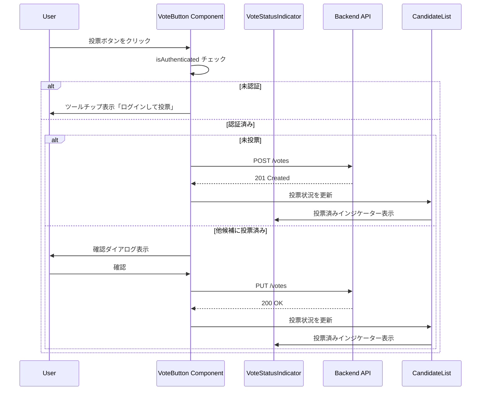

# Design Document: 投票ボタン・投票状況表示機能

## Overview

投票ボタン・投票状況表示機能は、投票対局アプリケーションにおいて、ユーザーが次の一手候補に対して投票し、現在の投票状況を視覚的に確認できるUIコンポーネント群です。この機能は既存の候補一覧表示機能（spec 23）を拡張し、投票API（spec 20）、投票変更API（spec 21）、投票状況取得API（spec 22）と統合されます。

この機能は、Next.js 16のApp RouterとReact 19を使用し、インタラクティブな投票体験、リアルタイムの投票数更新、アクセシビリティ対応、レスポンシブデザインを提供します。未認証ユーザーには投票ボタンを無効化し、認証済みユーザーには投票・投票変更・投票状況の確認機能を提供します。

## Main Algorithm/Workflow



## Core Interfaces/Types

### VoteButton Component

```typescript
interface VoteButtonProps {
  candidateId: string;
  gameId: string;
  turnNumber: number;
  isVoted: boolean;
  hasVotedOther: boolean;
  isAuthenticated: boolean;
  onVoteSuccess: () => void;
}

function VoteButton(props: VoteButtonProps): JSX.Element;
```

### VoteStatusIndicator Component

```typescript
interface VoteStatusIndicatorProps {
  voteCount: number;
  isVoted: boolean;
  className?: string;
}

function VoteStatusIndicator(props: VoteStatusIndicatorProps): JSX.Element;
```

### VoteConfirmDialog Component

```typescript
interface VoteConfirmDialogProps {
  isOpen: boolean;
  onConfirm: () => void;
  onCancel: () => void;
  currentCandidatePosition: string;
  newCandidatePosition: string;
}

function VoteConfirmDialog(props: VoteConfirmDialogProps): JSX.Element;
```

### API Client Functions

```typescript
/**
 * 投票を作成
 */
async function createVote(gameId: string, turnNumber: number, candidateId: string): Promise<void>;

/**
 * 投票を変更
 */
async function changeVote(gameId: string, turnNumber: number, candidateId: string): Promise<void>;
```

## Key Functions with Formal Specifications

### Function 1: handleVote()

```typescript
async function handleVote(candidateId: string, gameId: string, turnNumber: number): Promise<void>;
```

**Preconditions:**

- ユーザーが認証済み
- `candidateId` は有効なUUID v4形式
- `gameId` は有効なUUID v4形式
- `turnNumber` は0以上の整数
- 候補のステータスが 'VOTING'
- ユーザーがまだ投票していない

**Postconditions:**

- 成功時: POST /votes APIが呼び出される
- 成功時: 投票状況が更新される
- 成功時: 投票済みインジケーターが表示される
- 成功時: 候補の投票数が1増加する
- 失敗時: エラーメッセージが表示される
- 送信中: ローディング状態が表示される

**Loop Invariants:** N/A

### Function 2: handleVoteChange()

```typescript
async function handleVoteChange(
  candidateId: string,
  gameId: string,
  turnNumber: number,
  currentCandidatePosition: string,
  newCandidatePosition: string
): Promise<void>;
```

**Preconditions:**

- ユーザーが認証済み
- ユーザーが既に他の候補に投票済み
- `candidateId` は有効なUUID v4形式
- `gameId` は有効なUUID v4形式
- `turnNumber` は0以上の整数
- 候補のステータスが 'VOTING'
- ユーザーが確認ダイアログで確認済み

**Postconditions:**

- 成功時: PUT /votes APIが呼び出される
- 成功時: 投票状況が更新される
- 成功時: 新しい候補に投票済みインジケーターが表示される
- 成功時: 旧候補の投票数が1減少し、新候補の投票数が1増加する
- 失敗時: エラーメッセージが表示される
- 送信中: ローディング状態が表示される

**Loop Invariants:** N/A

### Function 3: showVoteConfirmDialog()

```typescript
function showVoteConfirmDialog(
  currentCandidatePosition: string,
  newCandidatePosition: string
): Promise<boolean>;
```

**Preconditions:**

- `currentCandidatePosition` は文字列（例: "D3"）
- `newCandidatePosition` は文字列（例: "E4"）

**Postconditions:**

- 確認ダイアログが表示される
- ユーザーが「確認」をクリックした場合: `true` を返す
- ユーザーが「キャンセル」をクリックした場合: `false` を返す
- ダイアログが閉じられる

**Loop Invariants:** N/A

## Algorithmic Pseudocode

### 投票処理アルゴリズム

```typescript
ALGORITHM handleVote(candidateId, gameId, turnNumber)
INPUT: candidateId (UUID), gameId (UUID), turnNumber (整数)
OUTPUT: void

BEGIN
  // Step 1: 認証チェック
  IF NOT isAuthenticated THEN
    DISPLAY "ログインして投票してください"
    RETURN
  END IF

  // Step 2: ローディング状態開始
  setIsLoading(true)
  clearError()

  TRY
    // Step 3: 投票API呼び出し
    AWAIT createVote(gameId, turnNumber, candidateId)

    // Step 4: 成功時の処理
    onVoteSuccess()

    // Step 5: UI更新
    refreshCandidateList()
    showSuccessMessage("投票しました")

  CATCH error
    // Step 6: エラーハンドリング
    IF error.status = 401 THEN
      showError("認証が必要です。ログインしてください。")
    ELSE IF error.status = 409 THEN
      showError("既に投票済みです")
    ELSE IF error.status = 400 AND error.code = "VOTING_CLOSED" THEN
      showError("投票期間が終了しています")
    ELSE
      showError("投票に失敗しました。もう一度お試しください。")
    END IF

  FINALLY
    // Step 7: ローディング状態終了
    setIsLoading(false)
  END TRY
END
```

### 投票変更処理アルゴリズム

```typescript
ALGORITHM handleVoteChange(candidateId, gameId, turnNumber, currentPosition, newPosition)
INPUT: candidateId (UUID), gameId (UUID), turnNumber (整数), currentPosition (文字列), newPosition (文字列)
OUTPUT: void

BEGIN
  // Step 1: 認証チェック
  IF NOT isAuthenticated THEN
    DISPLAY "ログインして投票してください"
    RETURN
  END IF

  // Step 2: 確認ダイアログ表示
  confirmed ← AWAIT showVoteConfirmDialog(currentPosition, newPosition)

  IF NOT confirmed THEN
    RETURN
  END IF

  // Step 3: ローディング状態開始
  setIsLoading(true)
  clearError()

  TRY
    // Step 4: 投票変更API呼び出し
    AWAIT changeVote(gameId, turnNumber, candidateId)

    // Step 5: 成功時の処理
    onVoteSuccess()

    // Step 6: UI更新
    refreshCandidateList()
    showSuccessMessage("投票を変更しました")

  CATCH error
    // Step 7: エラーハンドリング
    IF error.status = 401 THEN
      showError("認証が必要です。ログインしてください。")
    ELSE IF error.status = 409 AND error.code = "NOT_VOTED" THEN
      showError("まだ投票していません")
    ELSE IF error.status = 400 AND error.code = "SAME_CANDIDATE" THEN
      showError("既にこの候補に投票しています")
    ELSE IF error.status = 400 AND error.code = "VOTING_CLOSED" THEN
      showError("投票期間が終了しています")
    ELSE
      showError("投票の変更に失敗しました。もう一度お試しください。")
    END IF

  FINALLY
    // Step 8: ローディング状態終了
    setIsLoading(false)
  END TRY
END
```

### 投票ボタン表示ロジック

```typescript
ALGORITHM renderVoteButton(isAuthenticated, isVoted, hasVotedOther, isLoading)
INPUT: isAuthenticated (真偽値), isVoted (真偽値), hasVotedOther (真偽値), isLoading (真偽値)
OUTPUT: JSX Element

BEGIN
  // Step 1: 投票済みの場合
  IF isVoted THEN
    RETURN <VoteStatusIndicator />
  END IF

  // Step 2: 未認証の場合
  IF NOT isAuthenticated THEN
    RETURN (
      <Tooltip content="ログインして投票">
        <Button disabled>投票する</Button>
      </Tooltip>
    )
  END IF

  // Step 3: 他候補に投票済みの場合
  IF hasVotedOther THEN
    RETURN (
      <Button
        onClick={handleVoteChange}
        disabled={isLoading}
        variant="outline"
      >
        {isLoading ? "変更中..." : "投票を変更"}
      </Button>
    )
  END IF

  // Step 4: 未投票の場合
  RETURN (
    <Button
      onClick={handleVote}
      disabled={isLoading}
      variant="primary"
    >
      {isLoading ? "投票中..." : "投票する"}
    </Button>
  )
END
```

## Example Usage

```typescript
// Example 1: VoteButton コンポーネントの基本的な使用
'use client';

import { VoteButton } from '@/components/vote-button';
import { useState } from 'react';

export function CandidateCard({ candidate, voteStatus, gameId, turnNumber }) {
  const [isLoading, setIsLoading] = useState(false);

  const isVoted = voteStatus?.candidateId === candidate.id;
  const hasVotedOther = voteStatus !== null && voteStatus.candidateId !== candidate.id;

  const handleVoteSuccess = () => {
    // 投票成功後の処理（親コンポーネントで候補リストを更新）
    refreshCandidates();
  };

  return (
    <div className="border rounded-lg p-4">
      <h3 className="text-xl font-bold">{candidate.position}</h3>
      <p className="mt-2">{candidate.description}</p>

      <div className="mt-4">
        <VoteButton
          candidateId={candidate.id}
          gameId={gameId}
          turnNumber={turnNumber}
          isVoted={isVoted}
          hasVotedOther={hasVotedOther}
          isAuthenticated={true}
          onVoteSuccess={handleVoteSuccess}
        />
      </div>
    </div>
  );
}

// Example 2: VoteStatusIndicator コンポーネントの使用
import { VoteStatusIndicator } from '@/components/vote-status-indicator';

export function CandidateVoteInfo({ voteCount, isVoted }) {
  return (
    <div className="flex items-center gap-4">
      <span className="text-sm text-gray-600">
        投票数: {voteCount}
      </span>
      {isVoted && <VoteStatusIndicator voteCount={voteCount} isVoted={true} />}
    </div>
  );
}

// Example 3: VoteConfirmDialog コンポーネントの使用
import { VoteConfirmDialog } from '@/components/vote-confirm-dialog';
import { useState } from 'react';

export function VoteChangeButton({ currentPosition, newPosition, onConfirm }) {
  const [isDialogOpen, setIsDialogOpen] = useState(false);

  const handleClick = () => {
    setIsDialogOpen(true);
  };

  const handleConfirm = () => {
    setIsDialogOpen(false);
    onConfirm();
  };

  const handleCancel = () => {
    setIsDialogOpen(false);
  };

  return (
    <>
      <button onClick={handleClick}>投票を変更</button>

      <VoteConfirmDialog
        isOpen={isDialogOpen}
        onConfirm={handleConfirm}
        onCancel={handleCancel}
        currentCandidatePosition={currentPosition}
        newCandidatePosition={newPosition}
      />
    </>
  );
}

// Example 4: API Client 関数の使用
import { createVote, changeVote } from '@/lib/api/votes';

async function handleVoteClick(candidateId: string, gameId: string, turnNumber: number) {
  try {
    await createVote(gameId, turnNumber, candidateId);
    console.log('投票成功');
  } catch (error) {
    if (error.status === 401) {
      console.error('認証エラー');
    } else if (error.status === 409) {
      console.error('既に投票済み');
    } else {
      console.error('投票失敗');
    }
  }
}

async function handleVoteChangeClick(candidateId: string, gameId: string, turnNumber: number) {
  try {
    await changeVote(gameId, turnNumber, candidateId);
    console.log('投票変更成功');
  } catch (error) {
    if (error.status === 401) {
      console.error('認証エラー');
    } else if (error.status === 409 && error.code === 'NOT_VOTED') {
      console.error('まだ投票していません');
    } else if (error.status === 400 && error.code === 'SAME_CANDIDATE') {
      console.error('既にこの候補に投票しています');
    } else {
      console.error('投票変更失敗');
    }
  }
}
```

## Correctness Properties

_プロパティとは、システムのすべての有効な実行において真であるべき特性や動作のことです。プロパティは人間が読める仕様と機械的に検証可能な正確性保証の橋渡しとなります。_

### Property 1: 認証必須

_For any_ 投票ボタンのクリックに対して、ユーザーが未認証の場合、投票ボタンは無効化され、ツールチップに「ログインして投票」が表示される

**Validates: Requirements 1.1, 1.2, 1.3**

### Property 2: 投票済みインジケーター表示

_For any_ 候補カードに対して、ユーザーがその候補に投票済みの場合、投票ボタンの代わりに投票済みインジケーター（✓投票済み）が表示される

**Validates: Requirements 2.1, 2.2, 2.3**

### Property 3: 投票変更ボタン表示

_For any_ 候補カードに対して、ユーザーが他の候補に投票済みの場合、「投票を変更」ボタンが表示される

**Validates: Requirements 3.1, 3.2**

### Property 4: 投票変更の確認ダイアログ

_For any_ 投票変更ボタンのクリックに対して、確認ダイアログが表示され、現在の投票先と新しい投票先が明示される

**Validates: Requirements 4.1, 4.2, 4.3, 4.4, 4.5**

### Property 5: 投票成功後のUI更新

_For any_ 投票成功後に対して、投票数が更新され、投票済みインジケーターが表示され、候補リストが最新の状態に更新される

**Validates: Requirements 5.1, 5.2, 5.3, 5.4, 5.5**

### Property 6: ローディング状態の表示

_For any_ 投票処理中に対して、ボタンが無効化され、ローディングインジケーター（「投票中...」または「変更中...」）が表示される

**Validates: Requirements 6.1, 6.2, 6.3, 6.4, 13.1, 13.2, 13.3**

### Property 7: エラーメッセージの表示

_For any_ 投票エラーに対して、エラーの種類に応じた適切なメッセージが表示される（認証エラー、投票締切、既に投票済み、など）

**Validates: Requirements 7.1, 7.2, 7.3, 7.4, 7.5, 7.6, 7.7, 11.4**

### Property 8: 投票数の表示

_For any_ 候補カードに対して、現在の投票数が表示され、投票後は即座に更新される

**Validates: Requirements 8.1, 8.2**

### Property 9: アクセシビリティ対応

_For any_ 投票ボタンに対して、適切なaria-label、role、キーボード操作（Enter、Space）が提供される

**Validates: Requirements 9.1, 9.2, 9.3, 9.4, 9.5**

### Property 10: レスポンシブデザイン

_For any_ 画面サイズに対して、投票ボタンと投票状況表示が適切にレイアウトされ、タッチターゲットサイズが44px以上である

**Validates: Requirements 10.1, 10.2**

### Property 11: API統合

_For any_ 投票操作に対して、適切なAPIエンドポイント（POST /votes または PUT /votes/me）が正しいパラメータで呼び出され、成功時にコールバックが実行される

**Validates: Requirements 11.1, 11.2, 11.3**

### Property 12: 楽観的UI更新

_For any_ 投票操作に対して、APIレスポンスを待たずにUIが即座に更新され、APIエラー時には元の状態にロールバックされる

**Validates: Requirements 12.1, 12.2, 12.3**

## Error Handling

### Error Scenario 1: 認証エラー (401)

**Condition**: ユーザーが未認証または認証トークンが無効
**Response**: 「認証が必要です。ログインしてください。」エラーメッセージを表示
**Recovery**: ログインページへのリンクを提供、またはログインモーダルを表示

### Error Scenario 2: 既に投票済み (409 ALREADY_VOTED)

**Condition**: ユーザーが既に同じターンに投票済み
**Response**: 「既に投票済みです」エラーメッセージを表示
**Recovery**: 候補リストを更新して最新の投票状況を表示

### Error Scenario 3: 投票締切 (400 VOTING_CLOSED)

**Condition**: 投票期間が終了している
**Response**: 「投票期間が終了しています」エラーメッセージを表示
**Recovery**: 投票ボタンを無効化、締切済みバッジを表示

### Error Scenario 4: まだ投票していない (409 NOT_VOTED)

**Condition**: 投票変更を試みたが、まだ投票していない
**Response**: 「まだ投票していません」エラーメッセージを表示
**Recovery**: 通常の投票ボタンを表示

### Error Scenario 5: 同じ候補への変更 (400 SAME_CANDIDATE)

**Condition**: 既に投票している候補に再度投票しようとした
**Response**: 「既にこの候補に投票しています」エラーメッセージを表示
**Recovery**: 投票済みインジケーターを表示

### Error Scenario 6: ネットワークエラー

**Condition**: ネットワーク接続が失われた
**Response**: 「ネットワークエラーが発生しました」メッセージを表示
**Recovery**: リトライボタンを表示、ユーザーが手動で再試行できるようにする

### Error Scenario 7: サーバーエラー (500)

**Condition**: サーバー内部エラー
**Response**: 「投票に失敗しました。もう一度お試しください。」メッセージを表示
**Recovery**: 投票ボタンを再度有効化、ユーザーが再試行できるようにする

## Testing Strategy

### ユニットテスト

**対象コンポーネント**:

- `VoteButton`: 投票処理、投票変更処理、ローディング状態
- `VoteStatusIndicator`: 投票済み表示、投票数表示
- `VoteConfirmDialog`: 確認ダイアログの表示、確認・キャンセル処理
- API client functions: `createVote`, `changeVote`

**テストファイル**:

- `components/vote-button.test.tsx`
- `components/vote-status-indicator.test.tsx`
- `components/vote-confirm-dialog.test.tsx`
- `lib/api/votes.test.ts`

**テストケース**:

**VoteButton コンポーネント**:

- 未認証時: ボタンが無効化され、ツールチップが表示される
- 未投票時: 「投票する」ボタンが表示される
- 投票済み時: 投票済みインジケーターが表示される
- 他候補に投票済み時: 「投票を変更」ボタンが表示される
- 投票クリック時: API が呼び出され、成功時に UI が更新される
- 投票変更クリック時: 確認ダイアログが表示される
- ローディング中: ボタンが無効化され、ローディングテキストが表示される
- エラー時: エラーメッセージが表示される

**VoteStatusIndicator コンポーネント**:

- 投票済みマークが表示される
- 投票数が表示される
- 適切なスタイルが適用される

**VoteConfirmDialog コンポーネント**:

- ダイアログが表示される
- 現在の投票先と新しい投票先が表示される
- 確認ボタンクリック時: onConfirm が呼び出される
- キャンセルボタンクリック時: onCancel が呼び出される
- ESC キーでダイアログが閉じる

**API Client**:

- createVote: 正常系、認証エラー、投票締切エラー、既に投票済みエラー
- changeVote: 正常系、認証エラー、未投票エラー、同じ候補エラー、投票締切エラー

### プロパティベーステスト

**テストライブラリ**: fast-check

**設定**:

- `numRuns: 10-20`
- `endOnFailure: true`

**テストファイル**:

- `components/vote-button.property.test.tsx`
- `lib/api/votes.property.test.ts`

**プロパティテスト対象**:

- Property 1: 認証必須（未認証時は常にボタンが無効化される）
  - Tag: **Feature: 25-vote-button-status-display, Property 1: 認証必須**
- Property 2: 投票済みインジケーター表示（投票済みの場合は常にインジケーターが表示される）
  - Tag: **Feature: 25-vote-button-status-display, Property 2: 投票済みインジケーター表示**
- Property 6: ローディング状態の表示（投票処理中は常にボタンが無効化される）
  - Tag: **Feature: 25-vote-button-status-display, Property 6: ローディング状態の表示**
- Property 7: エラーメッセージの表示（エラー時は常に適切なメッセージが表示される）
  - Tag: **Feature: 25-vote-button-status-display, Property 7: エラーメッセージの表示**

### 統合テスト

**テストファイル**:

- `components/candidate-card.integration.test.tsx`

**テストケース**:

- 候補カード全体の投票フロー（投票ボタン → API 呼び出し → UI 更新）
- 投票変更フロー（投票変更ボタン → 確認ダイアログ → API 呼び出し → UI 更新）
- エラーケースの統合テスト

### E2Eテスト

**テストファイル**:

- `tests/e2e/game/vote-flow.spec.ts`（新規作成）
- `tests/e2e/game/move-candidates.spec.ts`（既存ファイルを更新）

**テストケース**:

```typescript
test.describe('Vote Button and Status Display', () => {
  test('authenticated user can vote on candidate', async ({ page }) => {
    // ログイン
    await loginAsTestUser(page);

    // 対局詳細ページに移動
    await page.goto('/games/test-game-id');

    // 最初の候補の投票ボタンをクリック
    await page.locator('[data-testid="vote-button"]').first().click();

    // ローディング状態を確認
    await expect(page.locator('[data-testid="vote-button"]').first()).toContainText('投票中...');

    // 投票済みインジケーターが表示されることを確認
    await expect(page.locator('[data-testid="vote-status-indicator"]').first()).toBeVisible();
    await expect(page.locator('[data-testid="vote-status-indicator"]').first()).toContainText(
      '✓投票済み'
    );
  });

  test('user can change vote to different candidate', async ({ page }) => {
    // ログイン
    await loginAsTestUser(page);

    // 対局詳細ページに移動
    await page.goto('/games/test-game-id');

    // 最初の候補に投票
    await page.locator('[data-testid="vote-button"]').first().click();
    await expect(page.locator('[data-testid="vote-status-indicator"]').first()).toBeVisible();

    // 2番目の候補の投票変更ボタンをクリック
    await page.locator('[data-testid="vote-change-button"]').nth(1).click();

    // 確認ダイアログが表示されることを確認
    await expect(page.locator('[role="dialog"]')).toBeVisible();
    await expect(page.locator('[role="dialog"]')).toContainText('現在の投票を取り消して');

    // 確認ボタンをクリック
    await page.locator('[data-testid="confirm-button"]').click();

    // 2番目の候補に投票済みインジケーターが表示されることを確認
    await expect(page.locator('[data-testid="vote-status-indicator"]').nth(1)).toBeVisible();
  });

  test('unauthenticated user cannot vote', async ({ page }) => {
    // 未認証で対局詳細ページに移動
    await page.goto('/games/test-game-id');

    // 投票ボタンが無効化されていることを確認
    await expect(page.locator('[data-testid="vote-button"]').first()).toBeDisabled();

    // ツールチップが表示されることを確認
    await page.locator('[data-testid="vote-button"]').first().hover();
    await expect(page.locator('[role="tooltip"]')).toContainText('ログインして投票');
  });

  test('displays error message when voting fails', async ({ page }) => {
    // ログイン
    await loginAsTestUser(page);

    // 対局詳細ページに移動
    await page.goto('/games/test-game-id');

    // ネットワークエラーをシミュレート
    await page.route('**/api/votes', (route) => route.abort());

    // 投票ボタンをクリック
    await page.locator('[data-testid="vote-button"]').first().click();

    // エラーメッセージが表示されることを確認
    await expect(page.locator('[data-testid="error-message"]')).toBeVisible();
    await expect(page.locator('[data-testid="error-message"]')).toContainText('投票に失敗しました');
  });
});
```

## Performance Considerations

- **API呼び出しの最適化**: 投票後の候補リスト更新は、全体を再取得せず、楽観的UI更新（Optimistic UI）を使用
- **ローディング状態の管理**: 投票処理中は二重送信を防止するため、ボタンを無効化
- **エラーハンドリング**: エラー時は即座にユーザーにフィードバックを提供
- **レスポンシブデザイン**: モバイルでもタップしやすいボタンサイズ（最低44px）
- **アクセシビリティ**: キーボード操作、スクリーンリーダー対応

## Security Considerations

- **認証必須**: JWT トークンによる認証が必須（既存の認証ミドルウェアを使用）
- **CSRF対策**: SameSite Cookie属性を使用
- **XSS対策**: ユーザー入力をエスケープ（React のデフォルト動作）
- **レート制限**: 投票API は1ユーザーあたり1ターンに1回のみ
- **エラーメッセージのセキュリティ**: エラーメッセージに機密情報を含めない

## Dependencies

### 既存の依存関係

- Next.js 16
- React 19
- TypeScript
- Tailwind CSS
- shadcn/ui（Button、Dialog、Tooltip コンポーネント）
- Lucide React（アイコン）

### 新規の依存関係

なし（既存の依存関係のみで実装可能）

### 既存APIの利用

- POST /games/:gameId/turns/:turnNumber/votes（spec 20）
- PUT /games/:gameId/turns/:turnNumber/votes/me（spec 21）
- GET /games/:gameId/turns/:turnNumber/votes/me（spec 22）

### 既存コンポーネントの統合

- `CandidateCard`（spec 23）: VoteButton を統合
- `CandidateList`（spec 23）: 投票成功後の候補リスト更新

## File Structure

```
apps/web/
├── app/
│   └── games/
│       └── [gameId]/
│           └── _components/
│               ├── candidate-card.tsx              # 既存（spec 23）、VoteButton を統合
│               └── candidate-list.tsx              # 既存（spec 23）、投票成功後の更新処理を追加
├── components/
│   ├── vote-button.tsx                             # 新規: Client Component
│   ├── vote-button.test.tsx                        # 新規: ユニットテスト
│   ├── vote-button.property.test.tsx               # 新規: プロパティテスト
│   ├── vote-status-indicator.tsx                   # 新規
│   ├── vote-status-indicator.test.tsx              # 新規: ユニットテスト
│   ├── vote-confirm-dialog.tsx                     # 新規: Client Component
│   └── vote-confirm-dialog.test.tsx                # 新規: ユニットテスト
├── lib/
│   └── api/
│       ├── votes.ts                                # 新規: API client functions
│       ├── votes.test.ts                           # 新規: ユニットテスト
│       └── votes.property.test.ts                  # 新規: プロパティテスト
└── tests/
    └── e2e/
        └── game/
            ├── vote-flow.spec.ts                   # 新規: E2Eテスト
            └── move-candidates.spec.ts             # 既存（spec 23）、投票フローのテストを追加
```

## Implementation Notes

### Client Components

すべてのコンポーネントは Client Component として実装します（インタラクティブな機能が必要なため）：

- `VoteButton`: 投票処理、投票変更処理
- `VoteStatusIndicator`: 投票済み表示
- `VoteConfirmDialog`: 確認ダイアログ

### State Management

- `useState` を使用してローカル状態を管理（isLoading、error）
- 親コンポーネント（CandidateList）から `onVoteSuccess` コールバックを受け取り、投票成功時に候補リストを更新

### Optimistic UI

投票成功後、API レスポンスを待たずに UI を即座に更新することで、ユーザー体験を向上させます：

```typescript
// 楽観的UI更新
setIsVoted(true);
setVoteCount((prev) => prev + 1);

// API呼び出し
try {
  await createVote(gameId, turnNumber, candidateId);
} catch (error) {
  // エラー時はロールバック
  setIsVoted(false);
  setVoteCount((prev) => prev - 1);
  showError(error.message);
}
```

### Accessibility

- **キーボード操作**: Enter、Space キーで投票ボタンをクリック
- **スクリーンリーダー**: `aria-label`、`role` 属性を適切に設定
- **フォーカスインジケーター**: `focus:ring-2 focus:ring-blue-500`
- **コントラスト比**: 最低4.5:1

### Responsive Design

**ブレークポイント**:

- モバイル: `< 640px` - ボタンを全幅表示
- タブレット: `640px - 767px` - ボタンを適切なサイズで表示
- デスクトップ: `≥ 768px` - ボタンを適切なサイズで表示

**タッチターゲット**:

- 最小サイズ: 44px × 44px
- ボタン間のスペース: 8px以上

## Migration Strategy

### 既存コードへの影響

1. **CandidateCard コンポーネント（spec 23）**:
   - `VoteButton` コンポーネントを統合
   - 投票成功後のコールバック処理を追加

2. **CandidateList コンポーネント（spec 23）**:
   - 投票成功後の候補リスト更新処理を追加
   - 投票状況の再取得処理を追加

3. **E2Eテスト（spec 23）**:
   - `tests/e2e/game/move-candidates.spec.ts` に投票フローのテストを追加

### 段階的な実装

1. **Phase 1**: 基本的な投票ボタン
   - VoteButton コンポーネント
   - VoteStatusIndicator コンポーネント
   - API client functions（createVote）

2. **Phase 2**: 投票変更機能
   - VoteConfirmDialog コンポーネント
   - API client functions（changeVote）
   - 投票変更フロー

3. **Phase 3**: エラーハンドリングとローディング状態
   - エラーメッセージ表示
   - ローディングインジケーター
   - リトライ機能

4. **Phase 4**: テストとE2E
   - ユニットテスト
   - プロパティベーステスト
   - E2Eテスト

### ロールバック計画

- 新機能は既存機能に影響を与えない独立したコンポーネント
- 問題が発生した場合は `VoteButton` の呼び出しをコメントアウト
- APIエンドポイントは既存のものを使用（新規エンドポイントなし）

## Future Enhancements

### MVP後の拡張機能

1. **投票アニメーション**: 投票ボタンクリック時のアニメーション効果
2. **投票数のリアルタイム更新**: WebSocket を使用したリアルタイム更新
3. **投票理由のコメント**: 投票時に理由を記入（SNS連携）
4. **投票履歴の表示**: ユーザーの過去の投票履歴を表示
5. **投票通知**: 投票締切が近づいたら通知
6. **投票統計**: 投票数の推移をグラフで表示
