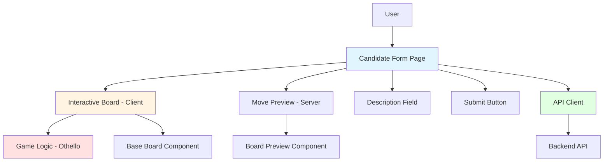
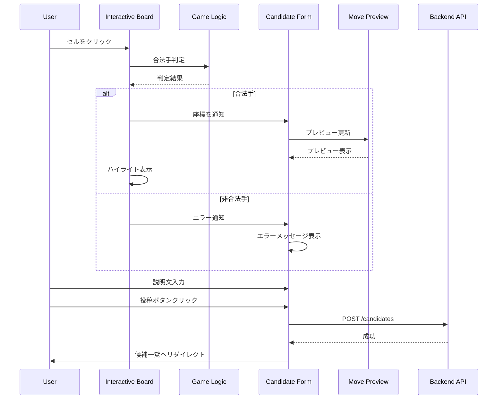

# Design Document: 盤面上での手の選択UI機能

## Overview

盤面上での手の選択UI機能は、投票対局アプリケーションのフロントエンド機能で、ユーザーが対局詳細画面で盤面上のマスを直接クリックして次の一手を選択・投稿できるようにします。この機能により、既存の候補投稿フォーム（spec 24）のユーザビリティが大幅に向上し、より直感的な操作が可能になります。

既存のBoard_Component（spec 15）を拡張し、インタラクティブな盤面操作を実現します。合法手の視覚的表示、選択セルのハイライト、手のプレビュー表示により、ユーザーは自分の選択を確認しながら候補を投稿できます。

この機能は、Next.js 16のApp RouterとReact 19を使用し、Server ComponentsとClient Componentsを適切に使い分けて実装されます。既存のOthelloゲームロジック（spec 13）を活用して合法手の判定を行い、既存のBoardPreview_Component（spec 23）を使用してプレビューを表示します。

## Architecture

### システム構成



### コンポーネント階層

```mermaid
graph TD
    Page[/games/gameId/candidates/new/page.tsx] --> CF[CandidateForm - Client]
    CF --> IB[InteractiveBoard - Client]
    CF --> MP[MovePreview - Server]
    CF --> TF[TextareaField]
    CF --> EB[ErrorBanner]

    IB --> BC[BoardCell × 64]
    IB --> VI[ValidMoveIndicator]
    IB --> SH[SelectionHighlight]

    MP --> BP[BoardPreview Component]

    style Page fill:#e1f5ff
    style CF fill:#fff4e1
    style IB fill:#ffe1f5
```

### データフロー



## Components and Interfaces

### Component 1: InteractiveBoard (Client Component)

**Purpose**: クリック可能なインタラクティブな盤面コンポーネント

**Location**: `app/games/[gameId]/_components/interactive-board.tsx`

**Interface**:

```typescript
interface InteractiveBoardProps {
  boardState: string[][]; // 8x8の盤面状態
  currentPlayer: 'black' | 'white'; // 現在のプレイヤー
  selectedPosition: { row: number; col: number } | null; // 選択された位置
  onCellClick: (row: number, col: number) => void; // セルクリックハンドラー
  cellSize?: number; // セルサイズ（デフォルト: 40px desktop, 30px mobile）
  disabled?: boolean; // 無効化フラグ
}

export function InteractiveBoard(props: InteractiveBoardProps): JSX.Element;
```

**State Management**:

```typescript
const [legalMoves, setLegalMoves] = useState<Array<[number, number]>>([]);
const [hoveredCell, setHoveredCell] = useState<{ row: number; col: number } | null>(null);
const [errorMessage, setErrorMessage] = useState<string | null>(null);
```

**Responsibilities**:

- 8x8オセロ盤面の表示
- 合法手の計算と表示
- セルのクリック処理
- 選択セルのハイライト表示
- ホバー時の視覚的フィードバック
- エラーメッセージの表示
- キーボード操作のサポート
- アクセシビリティ対応

### Component 2: BoardCell (Client Component)

**Purpose**: 個別のセルコンポーネント

**Location**: `app/games/[gameId]/_components/board-cell.tsx`

**Interface**:

```typescript
interface BoardCellProps {
  row: number;
  col: number;
  state: 'empty' | 'black' | 'white';
  isLegalMove: boolean;
  isSelected: boolean;
  isHovered: boolean;
  onClick: (row: number, col: number) => void;
  onMouseEnter: (row: number, col: number) => void;
  onMouseLeave: () => void;
  cellSize: number;
  disabled: boolean;
}

export function BoardCell(props: BoardCellProps): JSX.Element;
```

**Responsibilities**:

- セルの表示（空、黒石、白石）
- 合法手インジケーターの表示
- 選択ハイライトの表示
- ホバー効果の表示
- クリックイベントの処理
- アクセシビリティ属性の設定

### Component 3: ValidMoveIndicator

**Purpose**: 合法手を示すインジケーター

**Location**: `app/games/[gameId]/_components/valid-move-indicator.tsx`

**Interface**:

```typescript
interface ValidMoveIndicatorProps {
  isHovered: boolean;
  cellSize: number;
}

export function ValidMoveIndicator(props: ValidMoveIndicatorProps): JSX.Element;
```

**Responsibilities**:

- 薄い緑色の円の表示
- ホバー時の濃い緑色への変化
- アニメーション効果

### Component 4: MovePreview (Server Component)

**Purpose**: 選択した手を適用した盤面のプレビュー

**Location**: `app/games/[gameId]/_components/move-preview.tsx`

**Interface**:

```typescript
interface MovePreviewProps {
  boardState: string[][];
  selectedPosition: { row: number; col: number };
  currentPlayer: 'black' | 'white';
}

export function MovePreview(props: MovePreviewProps): JSX.Element;
```

**Responsibilities**:

- 既存のBoardPreview_Component（spec 23）を使用
- 選択した手を適用した盤面の表示
- 裏返される石の視覚的表示
- 黒石と白石の数の表示

### Component 5: CandidateForm (Client Component) - 既存を拡張

**Purpose**: 候補投稿フォーム（InteractiveBoardを統合）

**Location**: `app/games/[gameId]/candidates/new/_components/candidate-form.tsx`

**Interface**:

```typescript
interface CandidateFormProps {
  gameId: string;
  turnNumber: number;
  currentBoardState: string[][];
  currentPlayer: 'black' | 'white';
}

export function CandidateForm(props: CandidateFormProps): JSX.Element;
```

**State Management**:

```typescript
interface FormState {
  selectedPosition: { row: number; col: number } | null;
  description: string;
  isSubmitting: boolean;
  error: string | null;
  validationErrors: {
    position?: string;
    description?: string;
  };
}
```

**Responsibilities**:

- InteractiveBoardの統合
- 座標の受け取りと管理
- 説明文入力の処理
- バリデーション
- API呼び出し
- エラー表示
- 成功時のリダイレクト

## Data Models

### Model 1: Position

```typescript
interface Position {
  row: number; // 0-7
  col: number; // 0-7
}
```

**Validation Rules**:

- row: 0以上7以下の整数
- col: 0以上7以下の整数

### Model 2: BoardState

```typescript
type CellState = 'empty' | 'black' | 'white';
type BoardState = CellState[][]; // 8x8の2次元配列
```

**Validation Rules**:

- 8行8列の2次元配列
- 各セルは 'empty', 'black', 'white' のいずれか

### Model 3: CoordinateString

```typescript
type CoordinateString = string; // "row,col" 形式（例: "2,3"）
```

**Validation Rules**:

- 正規表現: `/^[0-7],[0-7]$/`
- 例: "0,0", "3,4", "7,7"

### Model 4: LegalMove

```typescript
interface LegalMove {
  position: Position;
  flippedPositions: Position[];
}
```

## Key Functions with Formal Specifications

### Function 1: calculateLegalMoves()

```typescript
function calculateLegalMoves(boardState: BoardState, currentPlayer: 'black' | 'white'): Position[];
```

**Preconditions:**

- `boardState` is a valid 8x8 board
- `currentPlayer` is either 'black' or 'white'

**Postconditions:**

- Returns an array of positions where the current player can legally place a disc
- Each position in the result would flip at least one opponent disc
- Empty array if no legal moves exist

**Loop Invariants:**

- For each position in the result: placing a disc at that position is a legal move

### Function 2: isLegalMove()

```typescript
function isLegalMove(
  boardState: BoardState,
  position: Position,
  currentPlayer: 'black' | 'white'
): boolean;
```

**Preconditions:**

- `boardState` is a valid 8x8 board
- `position` is within bounds (0-7)
- `currentPlayer` is either 'black' or 'white'

**Postconditions:**

- Returns true if the move is legal (would flip at least one opponent disc)
- Returns false otherwise

**Loop Invariants:** N/A

### Function 3: parseCoordinate()

```typescript
function parseCoordinate(coordinate: string): Position | null;
```

**Preconditions:**

- `coordinate` is a string

**Postconditions:**

- Returns `{ row, col }` if coordinate is in valid "row,col" format
- Returns `null` if coordinate is invalid

**Loop Invariants:** N/A

### Function 4: serializeCoordinate()

```typescript
function serializeCoordinate(position: Position): string;
```

**Preconditions:**

- `position.row` is 0-7
- `position.col` is 0-7

**Postconditions:**

- Returns a string in "row,col" format
- Result can be parsed back to the original position

**Loop Invariants:** N/A

### Function 5: handleCellClick()

```typescript
function handleCellClick(row: number, col: number): void;
```

**Preconditions:**

- `row` and `col` are 0-7
- Component is not disabled
- Component is not submitting

**Postconditions:**

- If move is legal: `selectedPosition` is updated, error is cleared
- If move is illegal: error message is displayed, `selectedPosition` is not updated
- If cell is already selected: selection is toggled off

**Loop Invariants:** N/A

## Algorithmic Pseudocode

### Interactive Board Rendering

```typescript
function InteractiveBoard({
  boardState,
  currentPlayer,
  selectedPosition,
  onCellClick,
  cellSize = 40,
  disabled = false,
}: InteractiveBoardProps) {
  // Step 1: Calculate legal moves
  const legalMoves = useMemo(() => {
    return calculateLegalMoves(boardState, currentPlayer);
  }, [boardState, currentPlayer]);

  // Step 2: Handle cell click
  const handleClick = useCallback(
    (row: number, col: number) => {
      if (disabled) return;

      // Check if move is legal
      const isLegal = legalMoves.some((move) => move.row === row && move.col === col);

      if (isLegal) {
        onCellClick(row, col);
        setErrorMessage(null);
      } else {
        setErrorMessage('この位置には石を置けません');
        setTimeout(() => setErrorMessage(null), 3000);
      }
    },
    [disabled, legalMoves, onCellClick]
  );

  // Step 3: Render board
  return (
    <div role="grid" aria-label="オセロの盤面" className="inline-block">
      {/* Error message */}
      {errorMessage && (
        <div role="alert" className="mb-4 bg-red-50 border border-red-200 text-red-700 px-4 py-3 rounded">
          {errorMessage}
        </div>
      )}

      {/* Board grid */}
      <div className="grid grid-cols-8 gap-0 border-2 border-black">
        {boardState.map((row, rowIndex) =>
          row.map((cell, colIndex) => {
            const isLegal = legalMoves.some((m) => m.row === rowIndex && m.col === colIndex);
            const isSelected =
              selectedPosition?.row === rowIndex && selectedPosition?.col === colIndex;
            const isHovered = hoveredCell?.row === rowIndex && hoveredCell?.col === colIndex;

            return (
              <BoardCell
                key={`${rowIndex}-${colIndex}`}
                row={rowIndex}
                col={colIndex}
                state={cell}
                isLegalMove={isLegal}
                isSelected={isSelected}
                isHovered={isHovered}
                onClick={handleClick}
                onMouseEnter={(r, c) => setHoveredCell({ row: r, col: c })}
                onMouseLeave={() => setHoveredCell(null)}
                cellSize={cellSize}
                disabled={disabled}
              />
            );
          })
        )}
      </div>

      {/* No legal moves message */}
      {legalMoves.length === 0 && (
        <p className="mt-4 text-gray-600 text-center">置ける場所がありません</p>
      )}
    </div>
  );
}
```

### Cell Click Handler in Candidate Form

```typescript
function CandidateForm({ gameId, turnNumber, currentBoardState, currentPlayer }: CandidateFormProps) {
  const [selectedPosition, setSelectedPosition] = useState<Position | null>(null);
  const [description, setDescription] = useState('');
  const [isSubmitting, setIsSubmitting] = useState(false);
  const [error, setError] = useState<string | null>(null);
  const [validationErrors, setValidationErrors] = useState<{
    position?: string;
    description?: string;
  }>({});

  // Handle cell click from InteractiveBoard
  const handleCellClick = useCallback((row: number, col: number) => {
    // Toggle selection if same cell is clicked
    setSelectedPosition((prev) => {
      if (prev?.row === row && prev?.col === col) {
        return null;
      }
      return { row, col };
    });

    // Clear position error
    setValidationErrors((prev) => ({ ...prev, position: undefined }));
  }, []);

  // Handle form submission
  const handleSubmit = async (e: FormEvent) => {
    e.preventDefault();

    // Validation
    if (!selectedPosition) {
      setValidationErrors({ position: '位置を選択してください' });
      return;
    }

    if (!description.trim()) {
      setValidationErrors({ description: '説明文を入力してください' });
      return;
    }

    // Submit
    setIsSubmitting(true);
    try {
      const coordinate = serializeCoordinate(selectedPosition);
      await createCandidate(gameId, turnNumber, coordinate, description);
      router.push(`/games/${gameId}`);
    } catch (err) {
      setError('候補の投稿に失敗しました');
    } finally {
      setIsSubmitting(false);
    }
  };

  return (
    <form onSubmit={handleSubmit}>
      {/* Interactive Board */}
      <div className="mb-6">
        <label className="block text-sm font-medium mb-2">位置を選択してください</label>
        <InteractiveBoard
          boardState={currentBoardState}
          currentPlayer={currentPlayer}
          selectedPosition={selectedPosition}
          onCellClick={handleCellClick}
          disabled={isSubmitting}
        />
        {validationErrors.position && (
          <p className="text-red-600 text-sm mt-1">{validationErrors.position}</p>
        )}
      </div>

      {/* Move Preview */}
      {selectedPosition && (
        <div className="mb-6">
          <label className="block text-sm font-medium mb-2">プレビュー</label>
          <MovePreview
            boardState={currentBoardState}
            selectedPosition={selectedPosition}
            currentPlayer={currentPlayer}
          />
        </div>
      )}

      {/* Description Field */}
      <div className="mb-6">
        <label htmlFor="description" className="block text-sm font-medium mb-2">
          説明文（最大200文字）
        </label>
        <textarea
          id="description"
          value={description}
          onChange={(e) => setDescription(e.target.value)}
          className="w-full border rounded px-3 py-2"
          rows={4}
          maxLength={200}
        />
        <div className="flex justify-between mt-1">
          <span className="text-sm text-gray-500">{description.length}/200文字</span>
          {validationErrors.description && (
            <p className="text-red-600 text-sm">{validationErrors.description}</p>
          )}
        </div>
      </div>

      {/* Submit Button */}
      <button
        type="submit"
        disabled={isSubmitting}
        className="bg-blue-600 text-white px-6 py-2 rounded hover:bg-blue-700 disabled:bg-gray-400"
      >
        {isSubmitting ? '送信中...' : '候補を投稿'}
      </button>
    </form>
  );
}
```

### Coordinate Parsing and Serialization

```typescript
// Parse "row,col" string to Position object
function parseCoordinate(coordinate: string): Position | null {
  const match = coordinate.match(/^([0-7]),([0-7])$/);
  if (!match) return null;

  return {
    row: parseInt(match[1], 10),
    col: parseInt(match[2], 10),
  };
}

// Serialize Position object to "row,col" string
function serializeCoordinate(position: Position): string {
  return `${position.row},${position.col}`;
}

// Validation schema
const coordinateSchema = z.string().regex(/^[0-7],[0-7]$/, '有効な座標形式ではありません');
```

## Correctness Properties

_プロパティは、システムのすべての有効な実行において真であるべき特性または動作です。これらは、人間が読める仕様と機械検証可能な正確性保証との橋渡しとなります。_

### Acceptance Criteria Testing Prework

### Property Reflection

prework分析の結果、以下の冗長性を特定しました:

- **3.6と3.7**: 両方とも「一度に1つのセルのみ選択可能」を述べている。3.7は3.6に包含される。
- **6.2と6.3**: 両方ともInteractive_BoardとCandidate_Form間の座標の受け渡しを述べている。同じ要件の異なる視点。
- **2.5と12.2**: 両方ともホバー時のValid_Move_Indicatorの色変化を述べている。
- **1.6と13.1**: 両方ともデスクトップでの40pxセルサイズを述べている。
- **1.7と13.2**: 両方ともモバイルでの30pxセルサイズを述べている。
- **6.1と16.5と19.1**: すべてCandidate_Formへの統合を述べている。

これらの冗長性を排除し、各プロパティが独自の検証価値を提供するようにします。

### Property 1: 盤面構造の正確性

_For any_ Interactive_Boardインスタンスに対して、8行8列のグリッドが表示され、各セルがクリック可能であり、現在の盤面状態が正しく反映される

**Validates: Requirements 1.3, 1.4, 1.5**

### Property 2: 合法手の計算と表示

_For any_ 盤面状態とプレイヤーに対して、合法手が正しく計算され、合法手のセルにのみValid_Move_Indicatorが表示され、非合法手のセルには表示されない

**Validates: Requirements 2.1, 2.3, 2.6**

### Property 3: セル選択の排他性

_For any_ セル選択操作に対して、常に最大1つのセルのみが選択状態であり、新しいセルを選択すると前の選択が自動的に解除される

**Validates: Requirements 3.6, 3.7**

### Property 4: 合法手のみ選択可能

_For any_ セルクリックに対して、合法手のセルはクリックで選択状態になり、非合法手のセルはクリックしても状態が変わらず、エラーメッセージが表示される

**Validates: Requirements 3.1, 3.2, 9.1**

### Property 5: 選択トグル動作

_For any_ 既に選択されているセルに対して、再度クリックすると選択が解除される

**Validates: Requirements 3.3**

### Property 6: 座標のシリアライズ形式

_For any_ 選択されたセルに対して、座標が "row,col" 形式（例: "2,3"）で保存され、親コンポーネントに渡される

**Validates: Requirements 3.4, 3.5**

### Property 7: 選択ハイライトの表示

_For any_ 選択されたセルに対して、Selected_Cell_Highlightが表示され、選択が解除されると非表示になる

**Validates: Requirements 4.1, 4.6**

### Property 8: プレビューの表示と内容

_For any_ 選択されたセルに対して、Move_Previewが表示され、選択した手を適用した盤面、裏返される石、選択セルのハイライト、黒石と白石の数が含まれる

**Validates: Requirements 5.1, 5.3, 5.4, 5.5**

### Property 9: ARIA属性の正確性

_For any_ セルに対して、aria-labelで座標が示され（例: "A1"）、合法手のセルのaria-labelには"選択可能"が含まれ、選択されたセルにはaria-selected="true"が設定される

**Validates: Requirements 11.4, 11.5, 11.6**

### Property 10: Props変更への反応

_For any_ propsの変更（盤面状態、現在のプレイヤー、選択位置）に対して、Interactive_Boardが正しく更新され、合法手が再計算され、表示が更新される

**Validates: Requirements 17.6**

### Property 11: 座標パーサーの正確性

_For any_ 有効な "row,col" 形式の文字列に対して、Coordinate_Parserが正しく [row, col] 配列に変換し、無効な形式に対してはエラーを返す

**Validates: Requirements 20.1, 20.2**

### Property 12: 座標シリアライザーの正確性

_For any_ 有効な [row, col] 配列に対して、Coordinate_Serializerが正しく "row,col" 形式の文字列に変換し、範囲外の値に対してはエラーを返す

**Validates: Requirements 20.3, 20.4**

### Property 13: 座標変換のラウンドトリップ

_For any_ 有効な座標に対して、パース→シリアライズ→パースの操作が元の値を返す（恒等性）

**Validates: Requirements 20.5**

## Error Handling

### Error Scenario 1: 非合法手のクリック

**Condition**: ユーザーが非合法手のセルをクリックした場合
**Response**: 「この位置には石を置けません」エラーメッセージを表示
**Recovery**: 3秒後に自動的にメッセージが消える。ユーザーは別のセルを選択できる

### Error Scenario 2: 盤面状態の取得失敗

**Condition**: 盤面状態の取得APIが失敗した場合
**Response**: 「盤面の読み込みに失敗しました」エラーメッセージを表示
**Recovery**: リトライボタンを表示し、ユーザーが手動で再取得できる

### Error Scenario 3: 合法手の計算失敗

**Condition**: 合法手の計算中にエラーが発生した場合
**Response**: エラーをコンソールにログ出力
**Recovery**: 空の合法手リストを返し、「置ける場所がありません」メッセージを表示

### Error Scenario 4: 座標パースエラー

**Condition**: 無効な座標文字列をパースしようとした場合
**Response**: `null` を返す
**Recovery**: 呼び出し側でnullチェックを行い、適切なエラーハンドリングを実施

### Error Scenario 5: 座標シリアライズエラー

**Condition**: 範囲外の座標をシリアライズしようとした場合
**Response**: エラーをスロー
**Recovery**: 呼び出し側でtry-catchを使用してエラーをキャッチし、適切なエラーメッセージを表示

### Error Scenario 6: 未認証ユーザーのアクセス

**Condition**: 未認証ユーザーが候補投稿フォームにアクセスした場合
**Response**: Interactive_Boardを無効化し、「ログインして投稿」メッセージを表示
**Recovery**: ログインページへのリンクを提供

## Testing Strategy

### ユニットテスト

**対象コンポーネント**:

- `InteractiveBoard`: 盤面表示、合法手計算、セル選択、エラーハンドリング
- `BoardCell`: セル表示、クリック処理、ホバー効果
- `ValidMoveIndicator`: インジケーター表示、ホバー効果
- `MovePreview`: プレビュー表示
- `CandidateForm`: フォーム統合、座標受け取り、バリデーション
- Utility functions: `calculateLegalMoves`, `isLegalMove`, `parseCoordinate`, `serializeCoordinate`

**テストファイル**:

- `app/games/[gameId]/_components/interactive-board.test.tsx`
- `app/games/[gameId]/_components/board-cell.test.tsx`
- `app/games/[gameId]/_components/valid-move-indicator.test.tsx`
- `app/games/[gameId]/_components/move-preview.test.tsx`
- `app/games/[gameId]/candidates/new/_components/candidate-form.test.tsx`
- `lib/utils/coordinate.test.ts`
- `lib/utils/legal-moves.test.ts`

**テストケース**:

**InteractiveBoard**:

- 正常系: 8x8グリッド表示、合法手インジケーター表示、セル選択
- エッジケース: 合法手がゼロの場合、すべてのセルが埋まっている場合
- エラーケース: 非合法手クリック、盤面状態取得失敗
- インタラクション: クリック、ホバー、キーボード操作
- アクセシビリティ: ARIA属性、role属性、キーボードナビゲーション

**Coordinate Utilities**:

- 正常系: 有効な座標のパース・シリアライズ
- エッジケース: 境界値（0,0）、（7,7）
- エラーケース: 無効な形式、範囲外の値
- ラウンドトリップ: パース→シリアライズ→パースの恒等性

### プロパティベーステスト

**テストライブラリ**: fast-check

**設定**:

- `numRuns: 10-20`（JSDOM環境での安定性のため）
- `endOnFailure: true`

**テストファイル**:

- `app/games/[gameId]/_components/interactive-board.property.test.tsx`
- `lib/utils/coordinate.property.test.ts`
- `lib/utils/legal-moves.property.test.ts`

**プロパティテスト対象**:

- **Property 1: 盤面構造の正確性**
  - Tag: **Feature: board-move-selection-ui, Property 1: 盤面構造の正確性**
  - ランダムな盤面状態を生成し、8x8グリッド、セルのクリック可能性、状態の反映を検証

- **Property 2: 合法手の計算と表示**
  - Tag: **Feature: board-move-selection-ui, Property 2: 合法手の計算と表示**
  - ランダムな盤面状態とプレイヤーを生成し、合法手の計算とインジケーター表示を検証

- **Property 3: セル選択の排他性**
  - Tag: **Feature: board-move-selection-ui, Property 3: セル選択の排他性**
  - ランダムなセル選択シーケンスを生成し、常に最大1つのセルのみが選択されることを検証

- **Property 4: 合法手のみ選択可能**
  - Tag: **Feature: board-move-selection-ui, Property 4: 合法手のみ選択可能**
  - ランダムなセルクリックを生成し、合法手のみが選択可能であることを検証

- **Property 6: 座標のシリアライズ形式**
  - Tag: **Feature: board-move-selection-ui, Property 6: 座標のシリアライズ形式**
  - ランダムな座標を生成し、"row,col"形式でシリアライズされることを検証

- **Property 11: 座標パーサーの正確性**
  - Tag: **Feature: board-move-selection-ui, Property 11: 座標パーサーの正確性**
  - ランダムな座標文字列（有効・無効）を生成し、パース結果を検証

- **Property 12: 座標シリアライザーの正確性**
  - Tag: **Feature: board-move-selection-ui, Property 12: 座標シリアライザーの正確性**
  - ランダムな座標配列（有効・無効）を生成し、シリアライズ結果を検証

- **Property 13: 座標変換のラウンドトリップ**
  - Tag: **Feature: board-move-selection-ui, Property 13: 座標変換のラウンドトリップ**
  - ランダムな有効座標を生成し、パース→シリアライズ→パースの恒等性を検証

### 統合テスト

**テストファイル**:

- `app/games/[gameId]/candidates/new/integration.test.tsx`

**テストケース**:

- 完全なフォーム送信フロー（盤面でセル選択 → 説明文入力 → 送信 → リダイレクト）
- Interactive_BoardとCandidate_Formの連携
- プレビュー表示の統合

### E2Eテスト（Playwright）

**テストファイル**:

- `tests/e2e/candidate-submission-interactive.spec.ts`

**テストケース**:

- ユーザーが盤面上でセルをクリックして候補を投稿できる
- 合法手のみが選択可能である
- 選択したセルのプレビューが表示される
- バリデーションエラーが表示される
- 未認証ユーザーは盤面が無効化される

## Performance Considerations

### レンダリングパフォーマンス

- `React.memo`を使用してBoardCellコンポーネントをメモ化し、不要な再レンダリングを防止
- `useMemo`で合法手リストをメモ化し、盤面状態が変わらない限り再計算しない
- `useCallback`でイベントハンドラーをメモ化し、子コンポーネントへの不要なprops変更を防止

### 合法手の計算

- 合法手の計算は最大64セル × 8方向 = 512回のチェックが必要
- 既存のOthelloゲームロジック（spec 13）を使用し、最適化されたアルゴリズムを活用
- 計算結果をuseMemoでキャッシュし、盤面状態が変わらない限り再利用

### インタラクションの応答性

- セルクリックは100ms以内に応答（目標）
- ホバー効果はCSS transitionで実装し、JavaScriptの処理を最小化
- アニメーション効果は`prefers-reduced-motion`を尊重し、必要に応じて無効化

### モバイルデバイスの最適化

- タッチターゲットサイズを最小44pxに設定し、タップしやすくする
- ダブルタップズームを防止し、誤操作を減らす
- スワイプジェスチャーを無効化し、意図しないナビゲーションを防止

## Security Considerations

### 入力バリデーション

- 座標のパース時にZodスキーマでバリデーションを実施
- 範囲外の座標（row < 0, row > 7, col < 0, col > 7）を拒否
- 無効な形式の座標文字列を拒否

### XSS対策

- ユーザー入力（説明文）はReactの自動エスケープで保護
- エラーメッセージは定数文字列を使用し、ユーザー入力を含めない

### 認証・認可

- 未認証ユーザーはInteractive_Boardを無効化
- 候補投稿APIは認証必須（既存のJWT検証ミドルウェアを使用）

## Accessibility Considerations

### セマンティックHTML

- `role="grid"`で盤面をグリッドとして定義
- `role="gridcell"`で各セルをグリッドセルとして定義
- `role="alert"`でエラーメッセージをアラートとして定義

### ARIA属性

- `aria-label="オセロの盤面"`で盤面の目的を説明
- 各セルに`aria-label`で座標を設定（例: "A1"）
- 合法手のセルに`aria-label`で"選択可能"を追加
- 選択されたセルに`aria-selected="true"`を設定

### キーボード操作

- 矢印キーでセル間を移動
- EnterキーまたはSpaceキーでセルを選択
- Tabキーで盤面全体をスキップ
- フォーカスされたセルに視覚的インジケーターを表示

### 視覚的アクセシビリティ

- 最小4.5:1のコントラスト比を維持
- 色だけでなく形状（円、枠線）でも情報を伝達
- `prefers-reduced-motion`を尊重し、アニメーションを無効化可能に

### スクリーンリーダー対応

- エラーメッセージは`role="alert"`で自動的にアナウンス
- 合法手の数を`aria-live="polite"`で通知（オプション）
- 選択状態の変化を`aria-selected`で通知

## Dependencies

### 既存の依存関係

- Next.js 16
- React 19
- TypeScript
- Tailwind CSS
- Zod

### 既存コンポーネントの再利用

- `Board_Component`（spec 15）: 基本的な盤面表示ロジックを参考
- `BoardPreview_Component`（spec 23）: プレビュー表示で使用
- `Candidate_Form`（spec 24）: Interactive_Boardを統合

### 既存ロジックの利用

- Othelloゲームロジック（spec 13）: 合法手の計算に使用
  - `getLegalMoves(board, player)`: 合法手のリストを取得
  - `isValidMove(board, position, player)`: 個別の手の合法性を判定
  - `executeMove(board, position, player)`: 手を適用した盤面を取得（プレビュー用）

## File Structure

```
apps/web/
├── app/
│   └── games/
│       └── [gameId]/
│           ├── _components/
│           │   ├── interactive-board.tsx              # 新規: Client Component
│           │   ├── interactive-board.test.tsx         # 新規: ユニットテスト
│           │   ├── interactive-board.property.test.tsx # 新規: プロパティテスト
│           │   ├── board-cell.tsx                     # 新規: Client Component
│           │   ├── board-cell.test.tsx                # 新規: ユニットテスト
│           │   ├── valid-move-indicator.tsx           # 新規
│           │   ├── valid-move-indicator.test.tsx      # 新規: ユニットテスト
│           │   ├── move-preview.tsx                   # 新規: Server Component
│           │   └── move-preview.test.tsx              # 新規: ユニットテスト
│           └── candidates/
│               └── new/
│                   ├── page.tsx                       # 既存（spec 24）、更新
│                   └── _components/
│                       ├── candidate-form.tsx         # 既存（spec 24）、更新
│                       └── candidate-form.test.tsx    # 既存（spec 24）、更新
├── lib/
│   └── utils/
│       ├── coordinate.ts                              # 新規: 座標パース・シリアライズ
│       ├── coordinate.test.ts                         # 新規: ユニットテスト
│       ├── coordinate.property.test.ts                # 新規: プロパティテスト
│       ├── legal-moves.ts                             # 新規: 合法手計算ラッパー
│       ├── legal-moves.test.ts                        # 新規: ユニットテスト
│       └── legal-moves.property.test.ts               # 新規: プロパティテスト
└── tests/
    └── e2e/
        └── candidate-submission-interactive.spec.ts   # 新規: E2Eテスト
```

## Implementation Notes

### Server Components vs Client Components

**Server Components**:

- `MovePreview`: 静的なプレビュー表示（既存のBoardPreview_Componentを使用）

**Client Components**:

- `InteractiveBoard`: インタラクティブな盤面操作
- `BoardCell`: セルのクリック・ホバー処理
- `CandidateForm`: フォーム状態管理

### State Management

- `InteractiveBoard`内で`useState`を使用してローカル状態を管理
  - `selectedPosition`: 選択されたセルの座標
  - `hoveredCell`: ホバーされているセルの座標
  - `errorMessage`: エラーメッセージ
- `useMemo`で合法手リストをメモ化
- `useCallback`でイベントハンドラーをメモ化
- 親コンポーネント（CandidateForm）に選択状態を通知（制御されたコンポーネント）

### Styling

- Tailwind CSSを使用
- セルサイズはレスポンシブ（デスクトップ: 40px、モバイル: 30px）
- 合法手インジケーター: `bg-green-200 hover:bg-green-400`
- 選択ハイライト: `border-4 border-blue-500`
- エラーメッセージ: `bg-red-50 border-red-200 text-red-700`

### Animation

- CSS transitionを使用（`transition-all duration-200`）
- `prefers-reduced-motion`を尊重
- フェードイン効果: `animate-fadeIn`（Tailwind CSSカスタムアニメーション）

### Keyboard Navigation

- `tabIndex={0}`でフォーカス可能に
- `onKeyDown`で矢印キー、Enter、Spaceを処理
- フォーカスされたセルに`ring-2 ring-blue-500`を表示

## Migration Strategy

### 既存コードへの影響

1. **Candidate_Form（spec 24）**:
   - `InteractiveBoard`コンポーネントを追加
   - 座標選択のロジックを`InteractiveBoard`に委譲
   - 既存のフォームバリデーションは維持

2. **Board_Component（spec 15）**:
   - 影響なし（新しいInteractive_Boardは独立したコンポーネント）

3. **BoardPreview_Component（spec 23）**:
   - 影響なし（MovePreviewで再利用）

### 段階的な実装

1. **Phase 1**: 基本的なInteractive_Board
   - 8x8グリッド表示
   - セルクリック処理
   - 選択ハイライト

2. **Phase 2**: 合法手の表示
   - 合法手の計算
   - Valid_Move_Indicatorの表示
   - 非合法手のエラーメッセージ

3. **Phase 3**: プレビュー機能
   - MovePreviewコンポーネント
   - 選択した手の盤面プレビュー

4. **Phase 4**: アクセシビリティとキーボード操作
   - ARIA属性の追加
   - キーボードナビゲーション
   - スクリーンリーダー対応

5. **Phase 5**: テストとE2E
   - ユニットテスト
   - プロパティベーステスト
   - E2Eテスト

### ロールバック計画

- 新機能は既存機能に影響を与えない独立したコンポーネント
- 問題が発生した場合は`InteractiveBoard`の使用を停止し、既存のフォームに戻す
- Candidate_Formの変更は最小限に抑え、簡単にロールバック可能

## Future Enhancements

### MVP後の拡張機能

1. **手の評価スコア表示**: 各合法手にAIによる評価スコアを表示
2. **手の推奨表示**: AIが推奨する手を視覚的に強調
3. **複数手のプレビュー**: 複数の手を同時にプレビュー表示
4. **アニメーション強化**: 石を置く際のアニメーション、裏返しアニメーション
5. **ドラッグ&ドロップ**: 石をドラッグして配置
6. **タッチジェスチャー**: ピンチズーム、スワイプでの盤面移動
7. **音声フィードバック**: セル選択時の音声効果
8. **ダークモード対応**: ダークテーマでの盤面表示

### パフォーマンス改善

1. **Web Worker**: 合法手の計算をバックグラウンドで実行
2. **仮想スクロール**: 大きな盤面（将棋、囲碁）での最適化
3. **Canvas API**: より高速な盤面レンダリング

### アクセシビリティ改善

1. **音声ガイド**: 合法手の位置を音声で案内
2. **ハイコントラストモード**: 視覚障害者向けの高コントラスト表示
3. **カスタムキーボードショートカット**: ユーザー定義のキーボード操作
