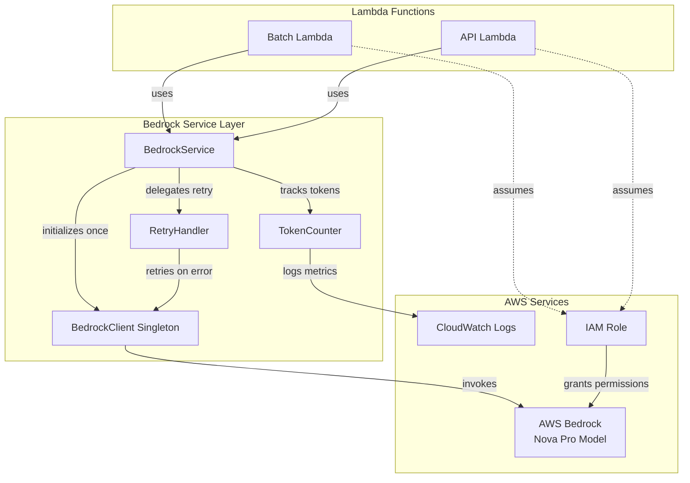

# Design Document

## Overview

AWS Bedrock (Nova Pro) 統合機能は、投票ボードゲームアプリケーションにAI機能を提供する基盤コンポーネントです。この設計では、Nova Proモデルを使用して次の一手候補の生成と対局解説の生成を実現します。

### 設計目標

1. **コスト効率**: Nova Proモデルを使用し、トークン使用量を監視・最適化
2. **信頼性**: リトライロジックとエラーハンドリングによる堅牢な実装
3. **保守性**: サービス層の分離により、テスト可能で拡張しやすい設計
4. **セキュリティ**: IAMロールによる最小権限の原則に基づいたアクセス制御

### 統合ポイント

Bedrock統合は以下の既存コンポーネントと連携します:

- **Batch Lambda**: 日次バッチ処理で次の一手候補を生成
- **API Lambda**: 将来的にリアルタイムAI機能を提供する可能性
- **DynamoDB**: 生成された候補や解説を保存
- **CloudWatch**: トークン使用量とエラーをログ・監視

## Architecture

### システムアーキテクチャ



### レイヤー構造

1. **Lambda Layer**: Lambda関数のエントリーポイント（batch.ts, lambda.ts）
2. **Service Layer**: ビジネスロジック（BedrockService）
3. **Client Layer**: AWS SDK ラッパー（BedrockClient）
4. **Utility Layer**: リトライ、トークンカウント、ロギング

### 設計原則

- **Singleton Pattern**: BedrockClientはLambda実行環境で1度だけ初期化し、再利用
- **Dependency Injection**: BedrockServiceはBedrockClientを注入可能にし、テスト容易性を確保
- **Separation of Concerns**: リトライロジック、トークンカウント、エラーハンドリングを分離
- **Configuration via Environment**: 環境変数で設定を外部化

## Components and Interfaces

### BedrockClient

BedrockClientは、AWS Bedrock Runtime APIとの通信を担当するシングルトンクラスです。

```typescript
/**
 * BedrockClient - AWS Bedrock APIとの通信を管理
 * Lambda実行環境で1度だけ初期化され、複数の呼び出しで再利用される
 */
export class BedrockClient {
  private static instance: BedrockClient | null = null;
  private client: BedrockRuntimeClient;

  private constructor(region: string) {
    this.client = new BedrockRuntimeClient({
      region,
      // Lambda実行ロールの認証情報を自動使用
    });
  }

  /**
   * シングルトンインスタンスを取得
   * Requirements: 1.3
   */
  public static getInstance(region: string = 'ap-northeast-1'): BedrockClient {
    if (!BedrockClient.instance) {
      BedrockClient.instance = new BedrockClient(region);
    }
    return BedrockClient.instance;
  }

  /**
   * テスト用: インスタンスをリセット
   */
  public static resetInstance(): void {
    BedrockClient.instance = null;
  }

  /**
   * converse APIを使用してプロンプトを送信
   * Requirements: 3.1, 3.2, 3.3
   */
  public async converse(params: ConverseParams): Promise<ConverseResponse> {
    const command = new ConverseCommand({
      modelId: params.modelId,
      messages: params.messages,
      system: params.system,
      inferenceConfig: {
        temperature: params.temperature,
        topP: params.topP,
        maxTokens: params.maxTokens,
      },
    });

    return await this.client.send(command);
  }

  /**
   * converseStream APIを使用してストリーミングレスポンスを取得
   * Requirements: 8.1, 8.2
   */
  public async converseStream(
    params: ConverseParams
  ): Promise<AsyncIterable<ConverseStreamOutput>> {
    const command = new ConverseStreamCommand({
      modelId: params.modelId,
      messages: params.messages,
      system: params.system,
      inferenceConfig: {
        temperature: params.temperature,
        topP: params.topP,
        maxTokens: params.maxTokens,
      },
    });

    const response = await this.client.send(command);
    return response.stream!;
  }
}

interface ConverseParams {
  modelId: string;
  messages: Message[];
  system?: SystemMessage[];
  temperature?: number;
  topP?: number;
  maxTokens?: number;
}
```

### BedrockService

BedrockServiceは、Bedrock統合のビジネスロジックを提供します。

```typescript
/**
 * BedrockService - Bedrock統合のビジネスロジック層
 */
export class BedrockService {
  private client: BedrockClient;
  private retryHandler: RetryHandler;
  private tokenCounter: TokenCounter;
  private config: BedrockConfig;

  constructor(
    client: BedrockClient,
    retryHandler: RetryHandler,
    tokenCounter: TokenCounter,
    config: BedrockConfig
  ) {
    this.client = client;
    this.retryHandler = retryHandler;
    this.tokenCounter = tokenCounter;
    this.config = config;
  }

  /**
   * プロンプトを送信してテキストレスポンスを取得
   * Requirements: 3.1, 3.4, 3.5, 3.6
   */
  public async generateText(params: GenerateTextParams): Promise<GenerateTextResponse> {
    // バリデーション
    if (!params.prompt || params.prompt.trim().length === 0) {
      throw new BedrockValidationError('Prompt cannot be empty');
    }

    if (params.prompt.length > 100000) {
      throw new BedrockValidationError('Prompt exceeds maximum length of 100,000 characters');
    }

    const messages: Message[] = [
      {
        role: 'user',
        content: [{ text: params.prompt }],
      },
    ];

    const systemMessages: SystemMessage[] | undefined = params.systemPrompt
      ? [{ text: params.systemPrompt }]
      : undefined;

    // リトライハンドラーを使用して実行
    const response = await this.retryHandler.execute(async () => {
      return await this.client.converse({
        modelId: params.modelId || this.config.modelId,
        messages,
        system: systemMessages,
        temperature: params.temperature ?? this.config.temperature,
        topP: params.topP ?? this.config.topP,
        maxTokens: params.maxTokens ?? this.config.maxTokens,
      });
    });

    // トークン使用量を記録
    this.tokenCounter.recordUsage({
      modelId: params.modelId || this.config.modelId,
      inputTokens: response.usage?.inputTokens || 0,
      outputTokens: response.usage?.outputTokens || 0,
      requestId: response.$metadata.requestId || 'unknown',
    });

    // レスポンスからテキストを抽出
    const text = response.output?.message?.content?.[0]?.text || '';

    return {
      text,
      usage: {
        inputTokens: response.usage?.inputTokens || 0,
        outputTokens: response.usage?.outputTokens || 0,
        totalTokens: (response.usage?.inputTokens || 0) + (response.usage?.outputTokens || 0),
      },
      requestId: response.$metadata.requestId || 'unknown',
    };
  }

  /**
   * ストリーミングレスポンスを取得
   * Requirements: 8.1, 8.2, 8.3, 8.4, 8.5
   */
  public async generateTextStream(params: GenerateTextParams): Promise<GenerateTextStreamResponse> {
    // バリデーション（generateTextと同じ）
    if (!params.prompt || params.prompt.trim().length === 0) {
      throw new BedrockValidationError('Prompt cannot be empty');
    }

    if (params.prompt.length > 100000) {
      throw new BedrockValidationError('Prompt exceeds maximum length of 100,000 characters');
    }

    const messages: Message[] = [
      {
        role: 'user',
        content: [{ text: params.prompt }],
      },
    ];

    const systemMessages: SystemMessage[] | undefined = params.systemPrompt
      ? [{ text: params.systemPrompt }]
      : undefined;

    try {
      const stream = await this.client.converseStream({
        modelId: params.modelId || this.config.modelId,
        messages,
        system: systemMessages,
        temperature: params.temperature ?? this.config.temperature,
        topP: params.topP ?? this.config.topP,
        maxTokens: params.maxTokens ?? this.config.maxTokens,
      });

      let fullText = '';
      let inputTokens = 0;
      let outputTokens = 0;
      let hasError = false;
      let errorMessage = '';

      for await (const chunk of stream) {
        if (chunk.contentBlockDelta?.delta?.text) {
          fullText += chunk.contentBlockDelta.delta.text;
        }

        if (chunk.metadata?.usage) {
          inputTokens = chunk.metadata.usage.inputTokens || 0;
          outputTokens = chunk.metadata.usage.outputTokens || 0;
        }
      }

      // トークン使用量を記録
      this.tokenCounter.recordUsage({
        modelId: params.modelId || this.config.modelId,
        inputTokens,
        outputTokens,
        requestId: 'stream',
      });

      return {
        text: fullText,
        usage: {
          inputTokens,
          outputTokens,
          totalTokens: inputTokens + outputTokens,
        },
        hasError: false,
      };
    } catch (error) {
      // ストリーミング中のエラーをログ
      console.error('Streaming error:', error);

      return {
        text: '',
        usage: {
          inputTokens: 0,
          outputTokens: 0,
          totalTokens: 0,
        },
        hasError: true,
        errorMessage: error instanceof Error ? error.message : 'Unknown streaming error',
      };
    }
  }
}

interface GenerateTextParams {
  prompt: string;
  systemPrompt?: string;
  modelId?: string;
  temperature?: number;
  topP?: number;
  maxTokens?: number;
}

interface GenerateTextResponse {
  text: string;
  usage: {
    inputTokens: number;
    outputTokens: number;
    totalTokens: number;
  };
  requestId: string;
}

interface GenerateTextStreamResponse {
  text: string;
  usage: {
    inputTokens: number;
    outputTokens: number;
    totalTokens: number;
  };
  hasError: boolean;
  errorMessage?: string;
}
```

### RetryHandler

リトライロジックを担当するユーティリティクラスです。

```typescript
/**
 * RetryHandler - API呼び出しのリトライロジック
 */
export class RetryHandler {
  private maxRetries: number;
  private baseDelay: number;

  constructor(maxRetries: number = 3, baseDelay: number = 1000) {
    this.maxRetries = maxRetries;
    this.baseDelay = baseDelay;
  }

  /**
   * 指定された関数をリトライロジック付きで実行
   * Requirements: 4.1, 4.4, 4.5
   */
  public async execute<T>(fn: () => Promise<T>): Promise<T> {
    let lastError: Error | null = null;

    for (let attempt = 0; attempt <= this.maxRetries; attempt++) {
      try {
        return await fn();
      } catch (error) {
        lastError = error as Error;

        // リトライ可能なエラーかチェック
        if (!this.isRetryableError(error)) {
          throw error;
        }

        // 最後の試行の場合はリトライしない
        if (attempt === this.maxRetries) {
          break;
        }

        // エクスポネンシャルバックオフで待機
        const delay = this.calculateDelay(attempt);
        console.log(`Retry attempt ${attempt + 1}/${this.maxRetries} after ${delay}ms`);
        await this.sleep(delay);
      }
    }

    throw lastError;
  }

  /**
   * エラーがリトライ可能かチェック
   * Requirements: 4.1, 4.4
   */
  private isRetryableError(error: unknown): boolean {
    if (!(error instanceof Error)) {
      return false;
    }

    const errorName = error.name;
    const errorMessage = error.message.toLowerCase();

    // スロットリングエラー
    if (errorName === 'ThrottlingException' || errorMessage.includes('throttl')) {
      return true;
    }

    // ネットワークタイムアウト
    if (errorName === 'TimeoutError' || errorMessage.includes('timeout')) {
      return true;
    }

    // 一時的なサービスエラー
    if (
      errorName === 'ServiceUnavailableException' ||
      errorMessage.includes('service unavailable')
    ) {
      return true;
    }

    return false;
  }

  /**
   * エクスポネンシャルバックオフで遅延時間を計算
   * Requirements: 4.1
   */
  private calculateDelay(attempt: number): number {
    // 2^attempt * baseDelay + ジッター
    const exponentialDelay = Math.pow(2, attempt) * this.baseDelay;
    const jitter = Math.random() * 1000;
    return exponentialDelay + jitter;
  }

  private sleep(ms: number): Promise<void> {
    return new Promise((resolve) => setTimeout(resolve, ms));
  }
}
```

### TokenCounter

トークン使用量を記録・監視するユーティリティクラスです。

```typescript
/**
 * TokenCounter - トークン使用量の記録と監視
 */
export class TokenCounter {
  /**
   * トークン使用量をCloudWatch Logsに記録
   * Requirements: 5.1, 5.2, 5.3, 5.4, 5.5
   */
  public recordUsage(usage: TokenUsage): void {
    const logEntry = {
      timestamp: new Date().toISOString(),
      modelId: usage.modelId,
      requestId: usage.requestId,
      inputTokens: usage.inputTokens,
      outputTokens: usage.outputTokens,
      totalTokens: usage.inputTokens + usage.outputTokens,
      type: 'BEDROCK_TOKEN_USAGE',
    };

    // 構造化ログとして出力
    console.log(JSON.stringify(logEntry));
  }
}

interface TokenUsage {
  modelId: string;
  requestId: string;
  inputTokens: number;
  outputTokens: number;
}
```

### Configuration

環境変数から設定を読み込むユーティリティです。

```typescript
/**
 * BedrockConfig - Bedrock設定の管理
 */
export interface BedrockConfig {
  modelId: string;
  region: string;
  maxTokens: number;
  temperature: number;
  topP: number;
}

/**
 * 環境変数からBedrock設定を読み込む
 * Requirements: 7.1, 7.2, 7.3, 7.4, 7.5, 7.6
 */
export function loadBedrockConfig(): BedrockConfig {
  return {
    modelId: process.env.BEDROCK_MODEL_ID || 'amazon.nova-pro-v1:0',
    region: process.env.BEDROCK_REGION || 'ap-northeast-1',
    maxTokens: parseInt(process.env.BEDROCK_MAX_TOKENS || '2048', 10),
    temperature: parseFloat(process.env.BEDROCK_TEMPERATURE || '0.7'),
    topP: parseFloat(process.env.BEDROCK_TOP_P || '0.9'),
  };
}
```

### Error Classes

カスタムエラークラスを定義します。

```typescript
/**
 * Bedrockサービスのベースエラー
 */
export class BedrockError extends Error {
  constructor(message: string) {
    super(message);
    this.name = 'BedrockError';
  }
}

/**
 * バリデーションエラー
 * Requirements: 4.2
 */
export class BedrockValidationError extends BedrockError {
  constructor(message: string) {
    super(message);
    this.name = 'BedrockValidationError';
  }
}

/**
 * モデルが見つからないエラー
 * Requirements: 4.3
 */
export class BedrockModelNotFoundError extends BedrockError {
  constructor(message: string) {
    super(message);
    this.name = 'BedrockModelNotFoundError';
  }
}

/**
 * リトライ失敗エラー
 * Requirements: 4.5
 */
export class BedrockRetryFailedError extends BedrockError {
  constructor(
    message: string,
    public readonly cause: Error
  ) {
    super(message);
    this.name = 'BedrockRetryFailedError';
  }
}
```

## Data Models

### Request/Response Types

```typescript
/**
 * Bedrock API メッセージ型
 */
export interface Message {
  role: 'user' | 'assistant';
  content: ContentBlock[];
}

export interface ContentBlock {
  text?: string;
}

export interface SystemMessage {
  text: string;
}

/**
 * トークン使用量
 */
export interface TokenUsageMetrics {
  inputTokens: number;
  outputTokens: number;
  totalTokens: number;
}

/**
 * ログエントリ
 */
export interface BedrockLogEntry {
  timestamp: string;
  modelId: string;
  requestId: string;
  inputTokens: number;
  outputTokens: number;
  totalTokens: number;
  type: 'BEDROCK_TOKEN_USAGE' | 'BEDROCK_ERROR' | 'BEDROCK_RETRY';
  errorType?: string;
  errorMessage?: string;
  attemptNumber?: number;
}
```

### Environment Variables

| 変数名              | デフォルト値         | 説明                       |
| ------------------- | -------------------- | -------------------------- |
| BEDROCK_MODEL_ID    | amazon.nova-pro-v1:0 | 使用するBedrockモデルID    |
| BEDROCK_REGION      | ap-northeast-1       | AWSリージョン              |
| BEDROCK_MAX_TOKENS  | 2048                 | 最大トークン数             |
| BEDROCK_TEMPERATURE | 0.7                  | 温度パラメータ（0.0-1.0）  |
| BEDROCK_TOP_P       | 0.9                  | Top-Pパラメータ（0.0-1.0） |

## Correctness Properties

_A property is a characteristic or behavior that should hold true across all valid executions of a system-essentially, a formal statement about what the system should do. Properties serve as the bridge between human-readable specifications and machine-verifiable correctness guarantees._

### Property Reflection

After analyzing all acceptance criteria, I identified the following redundancies:

1. **Configuration properties (2.1-2.6, 7.1-7.6)**: These can be consolidated into fewer properties about configuration loading and default values
2. **Token counting properties (5.1-5.5)**: These describe parts of the same behavior and can be combined
3. **Retry properties (4.1, 4.4)**: Both test retry behavior and can be unified
4. **Logging properties (10.1-10.6)**: Multiple properties about logging can be consolidated into comprehensive logging properties
5. **CDK infrastructure properties (11.1-11.7)**: These are all examples of CDK configuration and should remain as examples, not properties

### Property 1: Singleton Client Reuse

_For any_ sequence of BedrockClient.getInstance() calls within the same execution context, all calls should return the same instance reference.

**Validates: Requirements 1.3, 12.3**

### Property 2: Configuration Loading with Defaults

_For any_ environment variable configuration (BEDROCK_MODEL_ID, BEDROCK_REGION, BEDROCK_MAX_TOKENS, BEDROCK_TEMPERATURE, BEDROCK_TOP_P), when the variable is not set, the configuration loader should return the documented default value.

**Validates: Requirements 2.1, 2.2, 2.3, 2.4, 2.6, 7.1, 7.2, 7.3, 7.4, 7.5, 7.6, 12.1, 12.2**

### Property 3: Parameter Override Precedence

_For any_ model parameter (temperature, topP, maxTokens), when a custom value is provided to generateText(), it should override the default configuration value.

**Validates: Requirements 2.5**

### Property 4: Empty Prompt Rejection

_For any_ string that is empty or contains only whitespace, calling generateText() with that prompt should throw a BedrockValidationError before making any API calls.

**Validates: Requirements 3.4, 12.4**

### Property 5: API Request Structure

_For any_ valid prompt and optional system prompt, calling generateText() should result in a converse API call with properly structured messages array containing the user message and optional system message.

**Validates: Requirements 3.1, 3.2, 3.3**

### Property 6: Response Text Extraction

_For any_ successful Bedrock API response, the generateText() method should return the text content from the response's first content block.

**Validates: Requirements 3.6**

### Property 7: Throttling Error Retry

_For any_ ThrottlingException error from the Bedrock API, the RetryHandler should retry the operation up to 3 times with exponential backoff delays.

**Validates: Requirements 4.1**

### Property 8: Timeout Error Retry

_For any_ TimeoutError from the Bedrock API, the RetryHandler should retry the operation up to 2 times with exponential backoff delays.

**Validates: Requirements 4.4**

### Property 9: Non-Retryable Error Propagation

_For any_ validation error or model not found error from the Bedrock API, the error should be thrown immediately without retry attempts.

**Validates: Requirements 4.2, 4.3**

### Property 10: Retry Exhaustion Error

_For any_ retryable error that persists after all retry attempts, the final error thrown should include the original error cause and indicate retry exhaustion.

**Validates: Requirements 4.5**

### Property 11: Error Logging Structure

_For any_ error during Bedrock API calls, the logged error should include the error type, error message, request ID, and timestamp in JSON format.

**Validates: Requirements 4.6, 10.3, 10.5**

### Property 12: Token Usage Calculation

_For any_ Bedrock API response with usage metadata, the TokenCounter should calculate totalTokens as the sum of inputTokens and outputTokens.

**Validates: Requirements 5.1, 5.2, 5.5**

### Property 13: Token Usage Logging

_For any_ successful Bedrock API call, the TokenCounter should log a structured JSON entry containing modelId, requestId, timestamp, inputTokens, outputTokens, and totalTokens.

**Validates: Requirements 5.3, 5.4, 12.5**

### Property 14: Streaming Chunk Aggregation

_For any_ streaming response from converseStream API, all text chunks should be concatenated in order to produce the complete response text.

**Validates: Requirements 8.2, 8.3, 8.4**

### Property 15: Streaming Error Handling

_For any_ error that occurs during streaming, the generateTextStream() method should return a response with hasError=true, an error message, and any partial text received before the error.

**Validates: Requirements 8.5**

### Property 16: Request Invocation Logging

_For any_ call to generateText(), the service should log a structured JSON entry with request ID and timestamp before making the API call.

**Validates: Requirements 10.1, 10.5**

### Property 17: Success Response Logging

_For any_ successful Bedrock API call, the service should log a structured JSON entry containing response time and token usage metrics.

**Validates: Requirements 10.2, 10.5**

### Property 18: Retry Attempt Logging

_For any_ retry attempt by the RetryHandler, a structured JSON log entry should be emitted containing the attempt number and delay duration.

**Validates: Requirements 10.4, 10.5**

### Property 19: Sensitive Data Exclusion

_For any_ log entry generated by the Bedrock service, the log should not contain the user prompt text or system prompt text.

**Validates: Requirements 10.6**

## Error Handling

### Error Hierarchy

```
Error
└── BedrockError (base class)
    ├── BedrockValidationError (4xx client errors)
    ├── BedrockModelNotFoundError (model not available)
    └── BedrockRetryFailedError (all retries exhausted)
```

### Error Handling Strategy

1. **Validation Errors**: Thrown immediately before API calls, no retry
2. **Throttling Errors**: Retry up to 3 times with exponential backoff
3. **Timeout Errors**: Retry up to 2 times with exponential backoff
4. **Model Not Found**: Thrown immediately, no retry
5. **Service Unavailable**: Retry up to 3 times with exponential backoff
6. **Unknown Errors**: Logged and thrown, no retry

### Logging Strategy

All errors are logged with:

- Error type and name
- Error message
- Request ID (if available)
- Timestamp
- Stack trace (for debugging)
- Attempt number (for retries)

Sensitive information (prompts, responses) is never logged.

## Testing Strategy

### Unit Testing Approach

The testing strategy follows a dual approach:

1. **Unit Tests**: Verify specific examples, edge cases, and error conditions
2. **Property Tests**: Verify universal properties across all inputs

### Unit Test Coverage

Unit tests focus on:

- **Initialization**: BedrockClient singleton behavior
- **Configuration**: Environment variable loading with defaults
- **Validation**: Empty prompt rejection, length limits
- **Error Handling**: Specific error types (throttling, timeout, validation, model not found)
- **Retry Logic**: Exponential backoff calculation, retry limits
- **Token Counting**: Extraction and calculation
- **Logging**: Structured log format, required fields
- **Streaming**: Chunk aggregation, error handling

### Property-Based Testing

Property tests are configured with:

- **Minimum 100 iterations** per test (due to randomization)
- **Tag format**: `Feature: bedrock-nova-pro-integration, Property {number}: {property_text}`
- **Generators**: Random prompts, model parameters, error types

Example property test structure:

```typescript
import { describe, it, expect } from 'vitest';
import fc from 'fast-check';

describe('Property 2: Configuration Loading with Defaults', () => {
  it('should use default values when environment variables are not set', () => {
    // Feature: bedrock-nova-pro-integration, Property 2: Configuration Loading with Defaults
    fc.assert(
      fc.property(
        fc.constantFrom(
          'BEDROCK_MODEL_ID',
          'BEDROCK_REGION',
          'BEDROCK_MAX_TOKENS',
          'BEDROCK_TEMPERATURE',
          'BEDROCK_TOP_P'
        ),
        (envVar) => {
          // Clear environment variable
          delete process.env[envVar];

          const config = loadBedrockConfig();

          // Verify default is used
          const defaults = {
            BEDROCK_MODEL_ID: 'amazon.nova-pro-v1:0',
            BEDROCK_REGION: 'ap-northeast-1',
            BEDROCK_MAX_TOKENS: 2048,
            BEDROCK_TEMPERATURE: 0.7,
            BEDROCK_TOP_P: 0.9,
          };

          const key = envVar.replace('BEDROCK_', '').toLowerCase();
          expect(config[key]).toBe(defaults[envVar]);
        }
      ),
      { numRuns: 100 }
    );
  });
});
```

### Mocking Strategy

For unit tests, we mock:

1. **BedrockRuntimeClient**: Mock AWS SDK client to avoid real API calls
2. **ConverseCommand/ConverseStreamCommand**: Mock command responses
3. **console.log**: Capture and verify log output
4. **setTimeout**: Use fake timers to test retry delays

Example mock setup:

```typescript
import { vi } from 'vitest';
import { BedrockRuntimeClient } from '@aws-sdk/client-bedrock-runtime';

vi.mock('@aws-sdk/client-bedrock-runtime', () => ({
  BedrockRuntimeClient: vi.fn(() => ({
    send: vi.fn(),
  })),
  ConverseCommand: vi.fn(),
  ConverseStreamCommand: vi.fn(),
}));
```

### Test Organization

```
packages/api/src/services/bedrock/
├── bedrock-client.ts
├── bedrock-client.test.ts
├── bedrock-service.ts
├── bedrock-service.test.ts
├── bedrock-service.property.test.ts
├── retry-handler.ts
├── retry-handler.test.ts
├── retry-handler.property.test.ts
├── token-counter.ts
├── token-counter.test.ts
├── config.ts
├── config.test.ts
├── errors.ts
└── types.ts
```

### CDK Infrastructure Testing

CDK infrastructure is tested using snapshot tests and fine-grained assertions:

```typescript
import { Template } from 'aws-cdk-lib/assertions';
import * as cdk from 'aws-cdk-lib';
import { VoteBoardGameStack } from '../lib/vote-board-game-stack';

describe('Bedrock Infrastructure', () => {
  let template: Template;

  beforeAll(() => {
    const app = new cdk.App();
    const stack = new VoteBoardGameStack(app, 'TestStack', {
      appName: 'vbg',
      environment: 'dev',
    });
    template = Template.fromStack(stack);
  });

  it('should grant Bedrock permissions to Lambda', () => {
    template.hasResourceProperties('AWS::IAM::Policy', {
      PolicyDocument: {
        Statement: [
          {
            Action: ['bedrock:InvokeModel', 'bedrock:InvokeModelWithResponseStream'],
            Effect: 'Allow',
            Resource: 'arn:aws:bedrock:ap-northeast-1::foundation-model/amazon.nova-pro-v1:0',
          },
        ],
      },
    });
  });

  it('should set Bedrock environment variables', () => {
    template.hasResourceProperties('AWS::Lambda::Function', {
      Environment: {
        Variables: {
          BEDROCK_MODEL_ID: 'amazon.nova-pro-v1:0',
          BEDROCK_REGION: 'ap-northeast-1',
          BEDROCK_MAX_TOKENS: '2048',
          BEDROCK_TEMPERATURE: '0.7',
          BEDROCK_TOP_P: '0.9',
        },
      },
    });
  });
});
```

### Coverage Goals

- **Unit Test Coverage**: Minimum 80% line coverage
- **Property Test Coverage**: All identified properties (19 properties)
- **Integration Test Coverage**: End-to-end Bedrock service usage in batch Lambda

### Test Execution

```bash
# Run all tests
pnpm test

# Run tests with coverage
pnpm test -- --coverage

# Run property tests only
pnpm test -- bedrock-service.property.test.ts

# Run CDK tests
cd packages/infra && pnpm test
```

## Implementation Notes

### File Structure

```
packages/api/src/services/bedrock/
├── index.ts                    # Public exports
├── bedrock-client.ts           # BedrockClient singleton
├── bedrock-service.ts          # BedrockService business logic
├── retry-handler.ts            # RetryHandler utility
├── token-counter.ts            # TokenCounter utility
├── config.ts                   # Configuration loader
├── errors.ts                   # Custom error classes
├── types.ts                    # TypeScript interfaces
├── bedrock-client.test.ts      # Unit tests
├── bedrock-service.test.ts     # Unit tests
├── bedrock-service.property.test.ts  # Property tests
├── retry-handler.test.ts       # Unit tests
├── retry-handler.property.test.ts    # Property tests
├── token-counter.test.ts       # Unit tests
└── config.test.ts              # Unit tests
```

### CDK Infrastructure Changes

In `packages/infra/lib/vote-board-game-stack.ts`:

1. Add Bedrock IAM permissions to Batch Lambda role
2. Add Bedrock environment variables to Batch Lambda
3. Add cdk-nag suppressions for Bedrock permissions

```typescript
// Add to Batch Lambda environment variables
environment: {
  // ... existing variables
  BEDROCK_MODEL_ID: 'amazon.nova-pro-v1:0',
  BEDROCK_REGION: 'ap-northeast-1',
  BEDROCK_MAX_TOKENS: '2048',
  BEDROCK_TEMPERATURE: '0.7',
  BEDROCK_TOP_P: '0.9',
}

// Add Bedrock permissions to Batch Lambda role
batchLambdaRole.addToPolicy(new iam.PolicyStatement({
  effect: iam.Effect.ALLOW,
  actions: [
    'bedrock:InvokeModel',
    'bedrock:InvokeModelWithResponseStream',
  ],
  resources: [
    'arn:aws:bedrock:ap-northeast-1::foundation-model/amazon.nova-pro-v1:0',
  ],
}));
```

### Dependencies

Add to `packages/api/package.json`:

```json
{
  "dependencies": {
    "@aws-sdk/client-bedrock-runtime": "^3.716.0"
  }
}
```

### Usage Example

```typescript
// In batch.ts
import {
  BedrockClient,
  BedrockService,
  RetryHandler,
  TokenCounter,
  loadBedrockConfig,
} from './services/bedrock';

// Initialize (once per Lambda execution context)
const config = loadBedrockConfig();
const client = BedrockClient.getInstance(config.region);
const retryHandler = new RetryHandler(3, 1000);
const tokenCounter = new TokenCounter();
const bedrockService = new BedrockService(client, retryHandler, tokenCounter, config);

// Generate next move candidates
const response = await bedrockService.generateText({
  prompt: 'Given the current Othello board state...',
  systemPrompt: 'You are an expert Othello player...',
});

console.log('Generated text:', response.text);
console.log('Token usage:', response.usage);
```

### Performance Considerations

1. **Cold Start**: BedrockClient initialization adds ~100-200ms to cold start
2. **Warm Invocations**: Singleton pattern ensures client reuse, no initialization overhead
3. **API Latency**: Nova Pro typically responds in 1-3 seconds for 2048 tokens
4. **Retry Overhead**: Exponential backoff can add 2-8 seconds for throttled requests
5. **Memory**: 512 MB is sufficient for Bedrock SDK and response buffering

### Cost Optimization

1. **Model Selection**: Nova Pro is cost-effective (~$0.0008 per 1K input tokens, ~$0.0032 per 1K output tokens)
2. **Token Limits**: Default 2048 max tokens prevents runaway costs
3. **Input Validation**: Reject invalid inputs before API calls
4. **Monitoring**: CloudWatch Logs enable cost tracking and alerting

### Security Considerations

1. **IAM Permissions**: Scoped to specific model ARN only
2. **No Credentials in Code**: Lambda execution role provides credentials
3. **Sensitive Data**: Prompts are not logged to prevent data leakage
4. **Error Messages**: Sanitized to avoid exposing internal details

### Monitoring and Observability

1. **CloudWatch Logs**: Structured JSON logs for all operations
2. **Token Usage Metrics**: Logged for cost tracking
3. **Error Rates**: Tracked via error logs
4. **Retry Metrics**: Logged with attempt numbers
5. **X-Ray Tracing**: Enabled on Lambda for distributed tracing

### Future Enhancements

1. **Response Caching**: Cache common prompts to reduce API calls
2. **Prompt Templates**: Reusable templates for move generation and commentary
3. **Multi-Model Support**: Easy switching between Nova Pro, Claude, etc.
4. **Streaming UI**: Real-time AI response streaming to frontend
5. **Fine-Tuning**: Custom model training for Othello-specific knowledge
