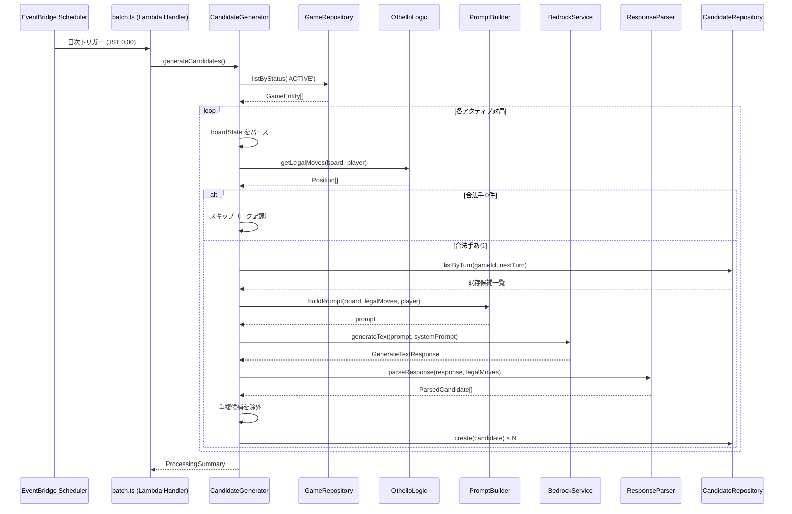

# 設計ドキュメント: 次の一手候補生成 (move-candidate-generation)

## 概要

本機能は、日次バッチ処理の一環として、アクティブな対局に対しAI（Bedrock Nova Pro）を使って次のターンの候補手を自動生成する。既存の `BedrockService`、オセロロジック（`getLegalMoves`）、`GameRepository`、`CandidateRepository` を活用し、新たに `CandidateGenerator` サービスを追加する。

処理フロー:

1. `GameRepository.listByStatus('ACTIVE')` でアクティブな対局を取得
2. 各対局の `boardState` をパースし、`getLegalMoves` で合法手を算出
3. 盤面・合法手・手番情報を含むプロンプトを構築し `BedrockService.generateText` を呼び出す
4. AIレスポンスをJSONパース・バリデーションし、合法手との整合性を検証
5. 既存候補との重複チェック後、`CandidateRepository.create` で保存

## アーキテクチャ

### システム構成図



### ファイル構成

```text
packages/api/src/
├── batch.ts                          # Lambda ハンドラー（既存、修正）
└── services/
    └── candidate-generator/
        ├── index.ts                  # CandidateGenerator サービス
        ├── prompt-builder.ts         # プロンプト構築
        ├── response-parser.ts        # AIレスポンスパース・バリデーション
        └── types.ts                  # 型定義
```

### 設計判断

1. **CandidateGenerator を独立サービスとして実装**: batch.ts に直接ロジックを書くのではなく、テスト容易性と責務分離のためサービスクラスとして切り出す。
2. **PromptBuilder と ResponseParser を分離**: プロンプト構築とレスポンスパースは純粋関数として実装し、単体テスト・プロパティテストを容易にする。
3. **対局単位の障害分離**: 1つの対局の候補生成失敗が他の対局に影響しないよう、try-catch で個別にエラーハンドリングする。
4. **既存インターフェースの活用**: `BedrockService.generateText`、`CandidateRepository.create`、`GameRepository.listByStatus` をそのまま利用し、新規のDB操作やAPI呼び出しは追加しない。

## コンポーネントとインターフェース

### CandidateGenerator

候補生成処理全体を統括するサービスクラス。

```typescript
class CandidateGenerator {
  constructor(
    private bedrockService: BedrockService,
    private gameRepository: GameRepository,
    private candidateRepository: CandidateRepository
  )

  /** 全アクティブ対局に対して候補を生成 */
  async generateCandidates(): Promise<ProcessingSummary>

  /** 単一対局の候補生成 */
  private async processGame(game: GameEntity): Promise<GameProcessingResult>
}
```

### PromptBuilder（純粋関数）

```typescript
/** 盤面を人間が読める8x8グリッド文字列に変換 */
function formatBoard(board: Board): string;

/** AIに送信するプロンプトを構築 */
function buildPrompt(
  board: Board,
  legalMoves: readonly Position[],
  currentPlayer: 'BLACK' | 'WHITE'
): string;

/** システムプロンプトを返す */
function getSystemPrompt(): string;
```

### ResponseParser（純粋関数）

```typescript
/** AIレスポンスのJSON文字列をパースし、バリデーション済み候補配列を返す */
function parseAIResponse(responseText: string, legalMoves: readonly Position[]): ParseResult;

/** 候補の position 文字列を "row,col" 形式に正規化 */
function normalizePosition(position: string): string | null;

/** description を200文字以内に切り詰め */
function truncateDescription(description: string, maxLength?: number): string;
```

### batch.ts の修正

既存の `handler` 関数内で `CandidateGenerator.generateCandidates()` を呼び出す。

```typescript
// batch.ts に追加
const candidateGenerator = new CandidateGenerator(
  bedrockService,
  new GameRepository(),
  new CandidateRepository(docClient, TABLE_NAME)
);

// handler 内
const summary = await candidateGenerator.generateCandidates();
console.log('Candidate generation completed', summary);
```

## データモデル

### 入出力型定義

```typescript
/** AIレスポンスの期待するJSON構造 */
interface AIResponseCandidate {
  position: string; // "row,col" 形式（例: "2,3"）
  description: string; // 200文字以内の説明文
}

interface AIResponse {
  candidates: AIResponseCandidate[];
}

/** パース結果 */
interface ParsedCandidate {
  position: string; // "row,col" 形式
  description: string; // 200文字以内（切り詰め済み）
}

interface ParseResult {
  candidates: ParsedCandidate[];
  errors: string[]; // パース・バリデーションエラーのログ用メッセージ
}

/** 対局単位の処理結果 */
interface GameProcessingResult {
  gameId: string;
  status: 'success' | 'skipped' | 'failed';
  candidatesGenerated: number;
  candidatesSaved: number;
  reason?: string; // スキップ・失敗の理由
}

/** バッチ全体の処理サマリー */
interface ProcessingSummary {
  totalGames: number;
  successCount: number;
  failedCount: number;
  skippedCount: number;
  totalCandidatesGenerated: number;
  results: GameProcessingResult[];
}
```

### 既存エンティティとの関係

候補の保存には既存の `CandidateRepository.create` をそのまま使用する。パラメータのマッピング:

| CandidateGenerator 出力       | CandidateRepository.create パラメータ |
| ----------------------------- | ------------------------------------- |
| UUID v4 生成                  | `candidateId`                         |
| `game.gameId`                 | `gameId`                              |
| `game.currentTurn + 1`        | `turnNumber`                          |
| `parsedCandidate.position`    | `position`                            |
| `parsedCandidate.description` | `description`                         |
| `"AI"`                        | `createdBy`                           |
| 翌日 JST 23:59:59.999         | `votingDeadline`                      |

### boardState のパース

`GameEntity.boardState` は JSON 文字列で、以下の構造を持つ:

```typescript
interface BoardStateJSON {
  board: number[][]; // 8x8, 0=Empty, 1=Black, 2=White
}
```

パース処理: `JSON.parse(game.boardState)` → `boardState.board` を `Board` 型として使用。これは既存の `candidate.ts` サービスと同じパターンに従う。

### 手番の判定

AI側の手番か集合知側の手番かを判定する必要がある。候補生成は集合知側の手番に対して行う:

```typescript
// game.aiSide が 'BLACK' なら集合知は WHITE、逆も同様
const collectivePlayer = game.aiSide === 'BLACK' ? CellState.White : CellState.Black;
```

この判定ロジックは既存の `determineCollectivePlayer` 関数（`candidate.ts`）と同一。共通ユーティリティとして抽出するか、同じロジックを `CandidateGenerator` 内に実装する。

## 正当性プロパティ (Correctness Properties)

_プロパティとは、システムのすべての有効な実行において成立すべき特性や振る舞いのことである。プロパティは、人間が読める仕様と機械的に検証可能な正当性保証の橋渡しとなる。_

### Property 1: 盤面状態のラウンドトリップ

_For any_ 有効な Board（8x8の CellState 配列）に対して、`JSON.stringify({ board })` でシリアライズし、`JSON.parse` でデシリアライズした結果の `board` フィールドは、元の Board と等価である。

**Validates: Requirements 1.2**

### Property 2: プロンプトに必要情報がすべて含まれる

_For any_ 有効な Board、合法手リスト（Position[]）、手番プレイヤー（'BLACK' | 'WHITE'）に対して、`buildPrompt` が返す文字列は以下をすべて含む:

- 8行のグリッド表現（盤面の各行）
- すべての合法手の "row,col" 表現
- 手番プレイヤーの情報
- 候補数 "3" の指定
- "200" 文字制限の言及
- "JSON" 形式の要求

**Validates: Requirements 3.1, 3.2, 3.3, 3.4, 3.5, 3.6**

### Property 3: パース結果は合法手のみを含む

_For any_ 合法手リスト（Position[]）と AIレスポンス文字列に対して、`parseAIResponse` が返す `candidates` の各 `position` は、合法手リストに含まれる位置の "row,col" 表現のいずれかと一致する。

**Validates: Requirements 4.3, 4.4**

### Property 4: 説明文の長さ不変条件

_For any_ 文字列に対して、`truncateDescription` の結果は200文字以内である。また、元の文字列が200文字以内の場合、結果は元の文字列と等しい。

**Validates: Requirements 4.5, 4.6**

### Property 5: 候補パースのラウンドトリップ

_For any_ 有効な `ParsedCandidate`（position が "row,col" 形式、description が200文字以内）に対して、AIレスポンスJSON形式にフォーマットし直してから `parseAIResponse` で再パースした結果は、元の候補と等価である。

**Validates: Requirements 4.8**

### Property 6: 処理サマリーの整合性

_For any_ 対局リスト（成功・失敗・スキップが混在）に対して、`ProcessingSummary` の `successCount + failedCount + skippedCount` は `totalGames` と等しい。また、`results` 配列の長さも `totalGames` と等しい。

**Validates: Requirements 6.1, 6.4**

### Property 7: 重複ポジションの除外

_For any_ 既存候補リスト（CandidateEntity[]）と新規候補リスト（ParsedCandidate[]）に対して、重複除外後の候補リストには、既存候補のいずれとも同一ポジションを持つ候補が含まれない。

**Validates: Requirements 7.2, 7.3**

## エラーハンドリング

### エラー分類と対応

| エラー種別            | 発生箇所         | 対応                                                                                                |
| --------------------- | ---------------- | --------------------------------------------------------------------------------------------------- |
| boardState パース失敗 | `processGame`    | 該当対局をスキップ（`skipped`）、ログ記録                                                           |
| 合法手 0件            | `processGame`    | 該当対局をスキップ（`skipped`）、ログ記録                                                           |
| Bedrock API エラー    | `processGame`    | 該当対局を失敗（`failed`）、ログ記録。RetryHandler による自動リトライは BedrockService 内で処理済み |
| JSON パース失敗       | `ResponseParser` | 該当対局を失敗（`failed`）、ログ記録                                                                |
| 有効候補 0件          | `processGame`    | 該当対局を失敗（`failed`）、ログ記録                                                                |
| DynamoDB 保存失敗     | `processGame`    | 該当候補の保存をスキップ、ログ記録。他の候補の保存は継続                                            |

### エラー伝播の原則

- **対局間の障害分離**: 各対局の処理は独立した try-catch で囲み、1つの対局の失敗が他に影響しない
- **候補間の障害分離**: 個別候補の DynamoDB 保存失敗は、同一対局の他の候補保存を妨げない
- **BedrockService のリトライ**: リトライは既存の `RetryHandler` に委譲。CandidateGenerator 側では追加リトライしない
- **ログの構造化**: すべてのエラーログは JSON 形式で出力し、`gameId`、`errorType`、`errorMessage` を含める

## テスト戦略

### テストフレームワーク

- **ユニットテスト / 統合テスト**: Vitest
- **プロパティベーステスト**: fast-check（`fc.property` を使用、`fc.asyncProperty` は禁止）
- **設定**: `numRuns: 10〜20`、`endOnFailure: true`

### プロパティベーステスト

各正当性プロパティに対して1つのプロパティベーステストを実装する。テストには設計ドキュメントのプロパティ番号をタグとして付与する。

タグ形式: `Feature: move-candidate-generation, Property {number}: {property_text}`

| Property   | テスト対象関数                          | ジェネレータ                                                                                         |
| ---------- | --------------------------------------- | ---------------------------------------------------------------------------------------------------- |
| Property 1 | Board シリアライズ/デシリアライズ       | `fc.array(fc.array(fc.constantFrom(0,1,2), {minLength:8, maxLength:8}), {minLength:8, maxLength:8})` |
| Property 2 | `buildPrompt`                           | Board ジェネレータ + Position[] ジェネレータ + Player ジェネレータ                                   |
| Property 3 | `parseAIResponse`                       | 合法手リスト + 合法手から選んだ候補を含むJSON文字列                                                  |
| Property 4 | `truncateDescription`                   | `fc.string()`                                                                                        |
| Property 5 | `ParsedCandidate` ラウンドトリップ      | "row,col" 形式の position + 200文字以内の description                                                |
| Property 6 | `CandidateGenerator.generateCandidates` | GameEntity[] + モック結果の組み合わせ                                                                |
| Property 7 | 重複除外ロジック                        | 既存候補リスト + 新規候補リスト                                                                      |

### ユニットテスト

プロパティテストで網羅しきれない具体例・エッジケース・統合ポイントをユニットテストでカバーする。

- **PromptBuilder**
  - `formatBoard`: 初期盤面の具体的な出力文字列を検証
  - `getSystemPrompt`: オセロ専門家の役割が含まれることを検証
- **ResponseParser**
  - 不正なJSON文字列のパース失敗
  - 空の candidates 配列
  - position が合法手に含まれない候補の除外
- **CandidateGenerator**（モック使用）
  - アクティブ対局0件で正常終了
  - boardState パース失敗時のスキップ
  - 合法手0件時のスキップ
  - Bedrock API エラー時の失敗記録と継続
  - DynamoDB 保存失敗時のエラーログと継続
  - 重複候補の除外
  - createdBy が "AI" に設定されること
  - votingDeadline が翌日 JST 23:59:59.999 であること
  - turnNumber が currentTurn + 1 であること

### テストファイル構成

```text
packages/api/src/services/candidate-generator/
├── __tests__/
│   ├── prompt-builder.test.ts          # PromptBuilder のユニットテスト
│   ├── prompt-builder.property.test.ts # PromptBuilder のプロパティテスト
│   ├── response-parser.test.ts         # ResponseParser のユニットテスト
│   ├── response-parser.property.test.ts# ResponseParser のプロパティテスト
│   └── candidate-generator.test.ts     # CandidateGenerator の統合テスト
```
