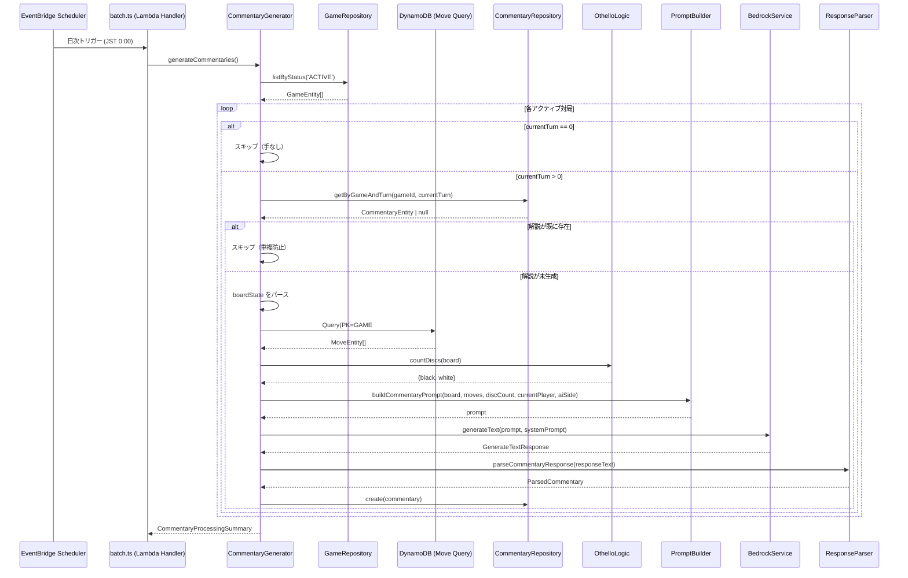

# 設計ドキュメント: 対局解説生成 (game-commentary-generation)

## 概要

本機能は、日次バッチ処理の一環として、アクティブな対局に対し AI（Bedrock Nova Pro）を使って対局内容の解説を自動生成する。既存の `BedrockService`、オセロロジック（`countDiscs`）、`GameRepository`、および新規の `CommentaryRepository` を活用し、`CommentaryGenerator` サービスを追加する。

処理フロー:

1. `GameRepository.listByStatus('ACTIVE')` でアクティブな対局を取得
2. 各対局の `currentTurn` が 0 の場合はスキップ（手が打たれていないため解説不要）
3. `CommentaryRepository` で既存解説を確認し、`currentTurn` の解説が未生成の対局のみ処理
4. `boardState` をパースし、手履歴（MoveEntity）を DynamoDB から取得
5. 盤面・手履歴・石数・手番情報を含むプロンプトを構築し `BedrockService.generateText` を呼び出す
6. AI レスポンスをパース・バリデーションし、`CommentaryRepository.create` で保存

既存の `CandidateGenerator`（spec 28）と同じアーキテクチャパターン（サービスクラス + 純粋関数のプロンプト構築/レスポンスパース）を踏襲する。

## アーキテクチャ

### システム構成図



### ファイル構成

```text
packages/api/src/
├── batch.ts                              # Lambda ハンドラー（既存、修正）
├── lib/dynamodb/
│   ├── repositories/
│   │   ├── commentary.ts                 # CommentaryRepository（新規）
│   │   └── index.ts                      # エクスポート追加
│   └── types.ts                          # CommentaryEntity（既存定義済み）
└── services/
    └── commentary-generator/
        ├── index.ts                      # CommentaryGenerator サービス
        ├── prompt-builder.ts             # プロンプト構築
        ├── response-parser.ts            # AIレスポンスパース・バリデーション
        └── types.ts                      # 型定義
```

### 設計判断

1. **CandidateGenerator と同じアーキテクチャパターンを踏襲**: サービスクラス + 純粋関数（PromptBuilder / ResponseParser）の構成で、テスト容易性と責務分離を実現する。
2. **CommentaryRepository を新規作成**: `CommentaryEntity` は `types.ts` に既に定義済み。`Keys.commentary` ヘルパーも存在するため、リポジトリのみ追加する。
3. **手履歴の取得は CommentaryGenerator 内で直接クエリ**: 既存に MoveRepository が存在しないため、CommentaryGenerator 内で DynamoDB の Query を直接実行する。将来的に MoveRepository を作成した場合は移行可能。
4. **対局単位の障害分離**: CandidateGenerator と同様、1つの対局の解説生成失敗が他の対局に影響しないよう try-catch で個別にエラーハンドリングする。
5. **BedrockService インスタンスの共有**: batch.ts で CandidateGenerator と同じ BedrockService インスタンスを使用し、コールドスタート時の初期化コストを削減する。

## コンポーネントとインターフェース

### CommentaryGenerator

解説生成処理全体を統括するサービスクラス。

```typescript
class CommentaryGenerator {
  constructor(
    private bedrockService: BedrockService,
    private gameRepository: GameRepository,
    private commentaryRepository: CommentaryRepository,
    private docClient: DynamoDBDocumentClient,
    private tableName: string
  )

  /** 全アクティブ対局に対して解説を生成 */
  async generateCommentaries(): Promise<CommentaryProcessingSummary>

  /** 単一対局の解説生成 */
  private async processGame(game: GameEntity): Promise<CommentaryGameResult>

  /** 手履歴を DynamoDB から取得 */
  private async getMoveHistory(gameId: string): Promise<MoveEntity[]>
}
```

### CommentaryRepository

```typescript
class CommentaryRepository extends BaseRepository {
  /** 指定された gameId の全解説を取得 */
  async listByGame(gameId: string): Promise<CommentaryEntity[]>;

  /** 指定された gameId と turnNumber の解説を1件取得 */
  async getByGameAndTurn(gameId: string, turnNumber: number): Promise<CommentaryEntity | null>;

  /** 解説エンティティを作成 */
  async create(params: {
    gameId: string;
    turnNumber: number;
    content: string;
    generatedBy: 'AI';
  }): Promise<CommentaryEntity>;
}
```

### PromptBuilder（純粋関数）

```typescript
/** 盤面を人間が読める8x8グリッド文字列に変換（CandidateGenerator の formatBoard を再利用） */
function formatBoard(board: Board): string;

/** 手履歴を人間が読める文字列に変換 */
function formatMoveHistory(moves: MoveEntity[]): string;

/** 解説生成用プロンプトを構築 */
function buildCommentaryPrompt(
  board: Board,
  moves: MoveEntity[],
  discCount: { black: number; white: number },
  currentPlayer: 'BLACK' | 'WHITE',
  aiSide: 'BLACK' | 'WHITE'
): string;

/** 解説生成用システムプロンプトを返す */
function getCommentarySystemPrompt(): string;
```

### ResponseParser（純粋関数）

```typescript
/** AIレスポンスをパースし、解説文を抽出・バリデーション */
function parseCommentaryResponse(responseText: string): CommentaryParseResult;

/** 解説文を500文字以内に切り詰め */
function truncateContent(content: string, maxLength?: number): string;
```

### batch.ts の修正

既存の `handler` 関数内で `CommentaryGenerator.generateCommentaries()` を CandidateGenerator の後に呼び出す。

```typescript
// batch.ts に追加
import { CommentaryGenerator } from './services/commentary-generator/index.js';
import { CommentaryRepository } from './lib/dynamodb/repositories/commentary.js';

const commentaryGenerator = new CommentaryGenerator(
  bedrockService,
  new GameRepository(),
  new CommentaryRepository(docClient, TABLE_NAME),
  docClient,
  TABLE_NAME
);

// handler 内（candidateGenerator の後）
const commentarySummary = await commentaryGenerator.generateCommentaries();
console.log('Commentary generation completed', commentarySummary);
```

## データモデル

### 入出力型定義

```typescript
/** AIレスポンスの期待するJSON構造 */
interface AICommentaryResponse {
  content: string; // 解説文（500文字以内）
}

/** パース結果 */
interface ParsedCommentary {
  content: string; // 500文字以内（切り詰め済み）
}

interface CommentaryParseResult {
  commentary: ParsedCommentary | null;
  error?: string; // パース・バリデーションエラーのログ用メッセージ
}

/** 対局単位の処理結果 */
interface CommentaryGameResult {
  gameId: string;
  status: 'success' | 'skipped' | 'failed';
  reason?: string; // スキップ・失敗の理由
}

/** バッチ全体の処理サマリー */
interface CommentaryProcessingSummary {
  totalGames: number;
  successCount: number;
  failedCount: number;
  skippedCount: number;
  results: CommentaryGameResult[];
}
```

### CommentaryEntity（既存定義）

`types.ts` に既に定義済みの `CommentaryEntity` をそのまま使用する:

```typescript
interface CommentaryEntity extends BaseEntity {
  entityType: 'COMMENTARY';
  gameId: string;
  turnNumber: number;
  content: string;
  generatedBy: 'AI';
}
```

DynamoDB キーパターン:

- PK: `GAME#<gameId>`
- SK: `COMMENTARY#<turnNumber>`

### boardState のパース

CandidateGenerator と同じパターン:

```typescript
interface BoardStateJSON {
  board: number[][]; // 8x8, 0=Empty, 1=Black, 2=White
}
```

### 手履歴の取得

DynamoDB Query で `PK = GAME#<gameId>`, `SK begins_with MOVE#` を使用して MoveEntity の配列を取得する。turnNumber の昇順でソートされる（SK のソート順）。

```typescript
// CommentaryGenerator 内
private async getMoveHistory(gameId: string): Promise<MoveEntity[]> {
  const result = await this.docClient.send(
    new QueryCommand({
      TableName: this.tableName,
      KeyConditionExpression: 'PK = :pk AND begins_with(SK, :sk)',
      ExpressionAttributeValues: {
        ':pk': `GAME#${gameId}`,
        ':sk': 'MOVE#',
      },
      ScanIndexForward: true, // turnNumber 昇順
    })
  );
  return (result.Items as MoveEntity[]) || [];
}
```

## 正当性プロパティ (Correctness Properties)

_プロパティとは、システムのすべての有効な実行において成立すべき特性や振る舞いのことである。プロパティは、人間が読める仕様と機械的に検証可能な正当性保証の橋渡しとなる。_

### Property 1: 盤面状態のラウンドトリップ

_For any_ 有効な Board（8x8 の CellState 配列）に対して、`JSON.stringify({ board })` でシリアライズし、`JSON.parse` でデシリアライズした結果の `board` フィールドは、元の Board と等価である。

**Validates: Requirements 1.2**

### Property 2: プロンプトに必要情報がすべて含まれる

_For any_ 有効な Board、MoveEntity 配列、石数（black/white）、手番プレイヤー（'BLACK' | 'WHITE'）、aiSide（'BLACK' | 'WHITE'）に対して、`buildCommentaryPrompt` が返す文字列は以下をすべて含む:

- 8行のグリッド表現（盤面の各行）
- 手履歴の各手の情報（ターン番号、位置、手番）
- 黒・白それぞれの石数
- 現在の手番情報
- AI側と集合知側の色情報
- "500" 文字制限の言及
- "JSON" 形式の要求
- 直近の手の分析要求
- 形勢判断の要求

**Validates: Requirements 3.1, 3.2, 3.3, 3.4, 3.5, 3.6, 3.9, 3.10**

### Property 3: 解説文の長さ不変条件

_For any_ 文字列に対して、`truncateContent` の結果は500文字以内である。また、元の文字列が500文字以内の場合、結果は元の文字列と等しい。

**Validates: Requirements 4.5**

### Property 4: 解説パースのラウンドトリップ

_For any_ 有効な解説文（空でない500文字以内の文字列）に対して、`{ content }` の JSON 形式にフォーマットし `parseCommentaryResponse` で再パースした結果の `content` は、元の解説文と等価である。

**Validates: Requirements 4.7**

### Property 5: 処理サマリーの整合性

_For any_ 対局リスト（成功・失敗・スキップが混在）に対して、`CommentaryProcessingSummary` の `successCount + failedCount + skippedCount` は `totalGames` と等しい。また、`results` 配列の長さも `totalGames` と等しい。

**Validates: Requirements 7.2, 7.4**

## エラーハンドリング

### エラー分類と対応

| エラー種別            | 発生箇所         | 対応                                                                                                |
| --------------------- | ---------------- | --------------------------------------------------------------------------------------------------- |
| currentTurn == 0      | `processGame`    | 該当対局をスキップ（`skipped`）、ログ記録                                                           |
| 解説が既に存在        | `processGame`    | 該当対局をスキップ（`skipped`）、ログ記録                                                           |
| boardState パース失敗 | `processGame`    | 該当対局をスキップ（`skipped`）、ログ記録                                                           |
| Bedrock API エラー    | `processGame`    | 該当対局を失敗（`failed`）、ログ記録。RetryHandler による自動リトライは BedrockService 内で処理済み |
| JSON パース失敗       | `ResponseParser` | レスポンス全体をプレーンテキストとして解説に使用                                                    |
| 解説文が空            | `ResponseParser` | 該当対局を失敗（`failed`）、ログ記録                                                                |
| DynamoDB 保存失敗     | `processGame`    | 該当対局を失敗（`failed`）、ログ記録                                                                |
| バッチ全体の失敗      | `batch.ts`       | エラーをログに記録し、バッチ処理全体を失敗として扱わない                                            |

### エラー伝播の原則

- **対局間の障害分離**: 各対局の処理は独立した try-catch で囲み、1つの対局の失敗が他に影響しない
- **BedrockService のリトライ**: リトライは既存の `RetryHandler` に委譲。CommentaryGenerator 側では追加リトライしない
- **JSON パース失敗のフォールバック**: AI レスポンスが JSON でない場合、レスポンス全体をプレーンテキストの解説として扱う（要件 4.2）
- **ログの構造化**: すべてのエラーログは JSON 形式で出力し、`gameId`、`errorType`、`errorMessage` を含める

## テスト戦略

### テストフレームワーク

- **ユニットテスト / 統合テスト**: Vitest
- **プロパティベーステスト**: fast-check（`fc.property` を使用、`fc.asyncProperty` は禁止）
- **設定**: `numRuns: 10〜20`、`endOnFailure: true`

### プロパティベーステスト

各正当性プロパティに対して1つのプロパティベーステストを実装する。テストには設計ドキュメントのプロパティ番号をタグとして付与する。

タグ形式: `Feature: game-commentary-generation, Property {number}: {property_text}`

| Property   | テスト対象関数                             | ジェネレータ                                                                                         |
| ---------- | ------------------------------------------ | ---------------------------------------------------------------------------------------------------- |
| Property 1 | Board シリアライズ/デシリアライズ          | `fc.array(fc.array(fc.constantFrom(0,1,2), {minLength:8, maxLength:8}), {minLength:8, maxLength:8})` |
| Property 2 | `buildCommentaryPrompt`                    | Board ジェネレータ + MoveEntity[] ジェネレータ + discCount + Player + aiSide                         |
| Property 3 | `truncateContent`                          | `fc.string()`                                                                                        |
| Property 4 | `parseCommentaryResponse` ラウンドトリップ | 空でない500文字以内の文字列                                                                          |
| Property 5 | `CommentaryGenerator.generateCommentaries` | GameEntity[] + モック結果の組み合わせ                                                                |

### ユニットテスト

プロパティテストで網羅しきれない具体例・エッジケース・統合ポイントをユニットテストでカバーする。

- **PromptBuilder**
  - `formatBoard`: 初期盤面の具体的な出力文字列を検証
  - `getCommentarySystemPrompt`: オセロ解説者の役割が含まれることを検証
  - `formatMoveHistory`: 手履歴のフォーマット検証
- **ResponseParser**
  - 有効な JSON レスポンスのパース
  - 不正な JSON 文字列のフォールバック（プレーンテキスト扱い）
  - 空の content のバリデーション失敗
  - 500文字超過の切り詰め
  - マークダウンコードブロックの除去
- **CommentaryRepository**（モック使用）
  - `listByGame`: 指定 gameId の全解説取得
  - `getByGameAndTurn`: 指定 gameId + turnNumber の解説取得
  - `create`: 解説エンティティの作成（entityType, createdAt, PK, SK の検証）
- **CommentaryGenerator**（モック使用）
  - アクティブ対局0件で正常終了
  - currentTurn == 0 のスキップ
  - 既存解説ありのスキップ
  - boardState パース失敗時のスキップ
  - Bedrock API エラー時の失敗記録と継続
  - DynamoDB 保存失敗時のエラーログ
  - 正常系: 解説生成・保存の成功
  - generatedBy が "AI" に設定されること
  - turnNumber が currentTurn に設定されること
  - トークン使用量のログ出力

### テストファイル構成

```text
packages/api/src/
├── lib/dynamodb/repositories/
│   └── commentary.test.ts                        # CommentaryRepository のユニットテスト
└── services/commentary-generator/
    └── __tests__/
        ├── prompt-builder.test.ts                 # PromptBuilder のユニットテスト
        ├── prompt-builder.property.test.ts        # PromptBuilder のプロパティテスト
        ├── response-parser.test.ts                # ResponseParser のユニットテスト
        ├── response-parser.property.test.ts       # ResponseParser のプロパティテスト
        └── commentary-generator.test.ts           # CommentaryGenerator の統合テスト（Property 5 含む）
```
