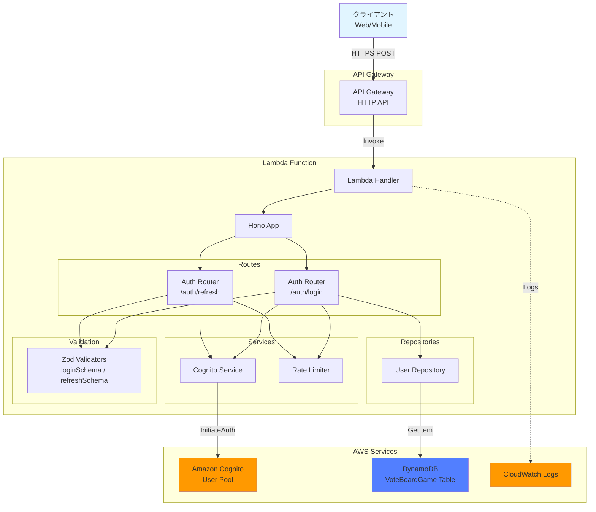
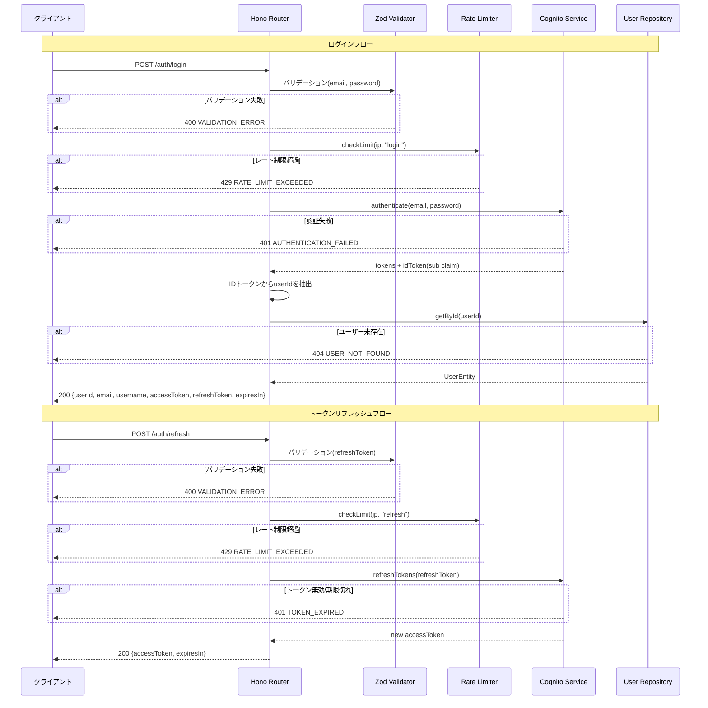

# 設計書: ログインAPI

## 概要

本ドキュメントは、投票ボードゲームアプリケーションのログインAPI機能の設計を定義します。この機能は、登録済みユーザーがメールアドレスとパスワードを使用して認証し、JWTトークンを取得してアプリケーションにアクセスできるようにします。また、リフレッシュトークンを使用してアクセストークンを更新するエンドポイントも提供します。

### 主要な設計目標

- **セキュリティ**: 認証情報の保護、レート制限、統一エラーメッセージによる情報漏洩防止
- **信頼性**: Cognito認証とDynamoDBユーザー情報取得の適切なエラーハンドリング
- **パフォーマンス**: 効率的なDynamoDBアクセスパターン、最小限のCognito呼び出し
- **保守性**: 既存のユーザー登録APIパターンとの一貫性、明確な責任分離

## アーキテクチャ

### システムコンポーネント図



### リクエストフロー



### コンポーネント説明

#### 1. Auth Router（拡張）

- 既存の`/auth/register`に加え、`/auth/login`と`/auth/refresh`エンドポイントを追加
- リクエストバリデーション、レート制限、ビジネスロジックの調整

#### 2. Cognito Service（拡張）

- 既存の`authenticate`メソッドを活用（`USER_PASSWORD_AUTH`フロー）
- 新規`refreshTokens`メソッドを追加（`REFRESH_TOKEN_AUTH`フロー）
- IDトークンからsubクレームを抽出するユーティリティ

#### 3. User Repository（既存）

- 既存の`getById`メソッドを活用してユーザー情報を取得

#### 4. Rate Limiter（拡張）

- ログイン: IPアドレスごとに1分あたり10リクエスト
- リフレッシュ: IPアドレスごとに1分あたり20リクエスト
- アクション別のレート制限設定をサポート

## コンポーネントとインターフェース

### 1. バリデーションスキーマ（`packages/api/src/lib/validation/auth-schemas.ts`に追加）

```typescript
import { z } from 'zod';

// ログインスキーマ
export const loginSchema = z.object({
  email: z.string({ required_error: 'Email is required' }).min(1, 'Email is required'),
  password: z.string({ required_error: 'Password is required' }).min(1, 'Password is required'),
});

export type LoginInput = z.infer<typeof loginSchema>;

// トークンリフレッシュスキーマ
export const refreshSchema = z.object({
  refreshToken: z
    .string({ required_error: 'Refresh token is required' })
    .min(1, 'Refresh token is required'),
});

export type RefreshInput = z.infer<typeof refreshSchema>;
```

### 2. Cognito Service（`packages/api/src/lib/cognito/cognito-service.ts`に追加）

```typescript
export interface RefreshResult {
  accessToken: string;
  idToken: string;
  expiresIn: number;
}

export class CognitoService {
  // 既存メソッド: signUp, authenticate, deleteUser

  /**
   * リフレッシュトークンで新しいアクセストークンを取得
   */
  async refreshTokens(refreshToken: string): Promise<RefreshResult> {
    const command = new InitiateAuthCommand({
      ClientId: this.clientId,
      AuthFlow: 'REFRESH_TOKEN_AUTH',
      AuthParameters: {
        REFRESH_TOKEN: refreshToken,
      },
    });

    const response = await this.client.send(command);

    if (!response.AuthenticationResult) {
      throw new Error('Token refresh failed');
    }

    return {
      accessToken: response.AuthenticationResult.AccessToken!,
      idToken: response.AuthenticationResult.IdToken!,
      expiresIn: response.AuthenticationResult.ExpiresIn || 900,
    };
  }

  /**
   * IDトークンからsubクレーム（userId）を抽出
   */
  extractUserIdFromIdToken(idToken: string): string {
    const payload = JSON.parse(Buffer.from(idToken.split('.')[1], 'base64').toString());
    return payload.sub;
  }
}
```

### 3. Auth Router（`packages/api/src/routes/auth.ts`に追加）

```typescript
// POST /auth/login
authRouter.post('/login', zValidator('json', loginSchema, validationErrorHandler), async (c) => {
  const { email, password } = c.req.valid('json');
  const ipAddress = c.req.header('x-forwarded-for') || 'unknown';

  // レート制限チェック（1分あたり10リクエスト）
  const rateLimiter = new RateLimiter();
  const isAllowed = await rateLimiter.checkLimit(ipAddress, 'login');
  if (!isAllowed) {
    const retryAfter = await rateLimiter.getRetryAfter(ipAddress, 'login');
    return c.json(
      { error: 'RATE_LIMIT_EXCEEDED', message: 'Too many login attempts', retryAfter },
      429
    );
  }

  // リクエストログ
  console.log('Login attempt', {
    email: maskEmail(email),
    ipAddress,
    timestamp: new Date().toISOString(),
  });

  try {
    // Cognito認証
    const cognitoService = new CognitoService();
    const tokens = await cognitoService.authenticate(email, password);

    // IDトークンからuserIdを抽出
    const userId = cognitoService.extractUserIdFromIdToken(tokens.idToken);

    // DynamoDBからユーザー情報を取得
    const userRepo = new UserRepository();
    const user = await userRepo.getById(userId);

    if (!user) {
      return c.json({ error: 'USER_NOT_FOUND', message: 'User not found' }, 404);
    }

    // 成功ログ
    console.log('Login successful', { userId, timestamp: new Date().toISOString() });

    return c.json(
      {
        userId: user.userId,
        email: user.email,
        username: user.username,
        accessToken: tokens.accessToken,
        refreshToken: tokens.refreshToken,
        expiresIn: 900,
      },
      200
    );
  } catch (error) {
    // エラーログ
    console.error('Login failed', { email: maskEmail(email), timestamp: new Date().toISOString() });

    // 認証失敗（統一メッセージ）
    if (isAuthenticationError(error)) {
      return c.json({ error: 'AUTHENTICATION_FAILED', message: 'Invalid email or password' }, 401);
    }

    return c.json({ error: 'INTERNAL_ERROR', message: 'Login failed' }, 500);
  }
});

// POST /auth/refresh
authRouter.post(
  '/refresh',
  zValidator('json', refreshSchema, validationErrorHandler),
  async (c) => {
    const { refreshToken } = c.req.valid('json');
    const ipAddress = c.req.header('x-forwarded-for') || 'unknown';

    // レート制限チェック（1分あたり20リクエスト）
    const rateLimiter = new RateLimiter();
    const isAllowed = await rateLimiter.checkLimit(ipAddress, 'refresh');
    if (!isAllowed) {
      const retryAfter = await rateLimiter.getRetryAfter(ipAddress, 'refresh');
      return c.json(
        { error: 'RATE_LIMIT_EXCEEDED', message: 'Too many refresh attempts', retryAfter },
        429
      );
    }

    try {
      const cognitoService = new CognitoService();
      const result = await cognitoService.refreshTokens(refreshToken);

      return c.json(
        {
          accessToken: result.accessToken,
          expiresIn: 900,
        },
        200
      );
    } catch (error) {
      if (isTokenExpiredError(error)) {
        return c.json(
          { error: 'TOKEN_EXPIRED', message: 'Refresh token is invalid or expired' },
          401
        );
      }

      return c.json({ error: 'INTERNAL_ERROR', message: 'Token refresh failed' }, 500);
    }
  }
);
```

### 4. Rate Limiter（設定拡張）

既存の`RateLimiter`クラスにアクション別のレート制限設定を追加:

```typescript
const RATE_LIMITS: Record<string, number> = {
  register: 5, // 既存
  login: 10, // 新規: 1分あたり10リクエスト
  refresh: 20, // 新規: 1分あたり20リクエスト
};
```

## データモデル

### 既存エンティティの利用

#### User Entity（既存・変更なし）

```typescript
interface UserEntity {
  PK: string; // "USER#<userId>"
  SK: string; // "USER#<userId>"
  userId: string; // UUID from Cognito
  email: string;
  username: string;
  iconUrl?: string;
  createdAt: string; // ISO 8601形式
  updatedAt: string; // ISO 8601形式
  entityType: 'USER';
}
```

#### Rate Limit Entity（既存・変更なし）

```typescript
interface RateLimitEntity {
  PK: string; // "RATELIMIT#<action>#<ipAddress>"
  SK: string; // "RATELIMIT#<action>#<ipAddress>"
  count: number;
  windowStart: number;
  expiresAt: number; // TTL
}
```

### API Request/Response Models

#### Login Request

```typescript
interface LoginRequest {
  email: string;
  password: string;
}
```

#### Login Response（成功）

```typescript
interface LoginResponse {
  userId: string;
  email: string;
  username: string;
  accessToken: string; // JWT（15分有効）
  refreshToken: string;
  expiresIn: number; // 900（秒）
}
```

#### Refresh Request

```typescript
interface RefreshRequest {
  refreshToken: string;
}
```

#### Refresh Response（成功）

```typescript
interface RefreshResponse {
  accessToken: string; // JWT（15分有効）
  expiresIn: number; // 900（秒）
}
```

#### Error Response（共通）

```typescript
interface ErrorResponse {
  error: string;
  message: string;
  details?: {
    fields?: Record<string, string>;
  };
  retryAfter?: number;
}
```

## 正確性プロパティ

_プロパティとは、システムのすべての有効な実行において真であるべき特性または動作です。本質的には、システムが何をすべきかについての形式的な記述です。プロパティは、人間が読める仕様と機械で検証可能な正確性保証との橋渡しとなります。_

### プロパティリフレクション

プレワーク分析を完了した後、論理的な冗長性を排除するためにプロパティをレビューしました:

**統合されたプロパティ:**

- 要件1.2, 1.3, 1.4: ログインの必須フィールド検証を1つのプロパティに統合
- 要件2.1, 2.2, 3.1, 3.2, 4.1, 4.2, 4.3, 4.4: 認証成功時のフロー（Cognito認証→userId抽出→ユーザー取得→レスポンス）を1つの成功レスポンスプロパティに統合
- 要件2.3, 8.1: 認証失敗時の統一エラーメッセージを1つのプロパティに統合（メール存在有無を明らかにしない）
- 要件5.2: リフレッシュのバリデーションを独立プロパティとして維持
- 要件5.3, 5.4: リフレッシュ成功レスポンスを1つのプロパティに統合
- 要件5.5: リフレッシュ失敗を独立プロパティとして維持
- 要件6.1, 6.2, 6.3, 6.4: レート制限を1つのプロパティに統合（アクション別設定を含む）
- 要件7.1, 7.2, 7.3, 7.4: エラーレスポンス形式を1つのプロパティに統合
- 要件8.2, 8.3, 8.4: セキュリティログ（機密データ保護）を1つのプロパティに統合

**除外されたプロパティ:**

- 要件9.1-9.3: ログ記録はプロパティベーステストよりユニットテストが適切
- 要件10.1-10.5: CORS設定は既存のHonoミドルウェアで処理済み。ユニットテストで検証

**最終プロパティ数:** 8個の独立したプロパティ

### プロパティ1: ログイン必須フィールド検証

*任意の*ログインリクエストに対して、emailまたはpasswordフィールドが欠落または空の場合、APIは400ステータスコードとエラーコード`VALIDATION_ERROR`を返すべきです。

**検証: 要件 1.2, 1.3, 1.4**

### プロパティ2: ログイン成功レスポンス形式

*任意の*有効なログインリクエスト（認証成功、ユーザー存在）に対して、APIは200ステータスコード、Content-Type `application/json`、および以下のフィールドを含むレスポンスボディを返すべきです: userId、email、username、accessToken、refreshToken、expiresIn（値: 900）。

**検証: 要件 2.1, 2.2, 3.1, 3.2, 4.1, 4.2, 4.3, 4.4**

### プロパティ3: 認証失敗時の統一エラーメッセージ

*任意の*認証失敗（メール不存在、パスワード不一致を問わず）に対して、APIは401ステータスコード、エラーコード`AUTHENTICATION_FAILED`、メッセージ「Invalid email or password」を返すべきです。レスポンスにはメールアドレスの存在有無を示す情報を含んではなりません。

**検証: 要件 2.3, 8.1**

### プロパティ4: リフレッシュトークンバリデーション

*任意の*トークンリフレッシュリクエストに対して、refreshTokenフィールドが欠落または空の場合、APIは400ステータスコードとエラーコード`VALIDATION_ERROR`を返すべきです。

**検証: 要件 5.2**

### プロパティ5: トークンリフレッシュ成功レスポンス形式

*任意の*有効なリフレッシュトークンに対して、APIは200ステータスコードとaccessToken、expiresIn（値: 900）フィールドを含むレスポンスを返すべきです。

**検証: 要件 5.3, 5.4**

### プロパティ6: 無効なリフレッシュトークンのエラーハンドリング

*任意の*無効または期限切れのリフレッシュトークンに対して、APIは401ステータスコード、エラーコード`TOKEN_EXPIRED`、メッセージ「Refresh token is invalid or expired」を返すべきです。

**検証: 要件 5.5**

### プロパティ7: レート制限

*任意の*IPアドレスに対して、ログインエンドポイントでは1分間に10リクエスト、リフレッシュエンドポイントでは1分間に20リクエストを超えた場合、超過リクエストは429ステータスコード、エラーコード`RATE_LIMIT_EXCEEDED`、および次のリクエストが許可されるまでの秒数を示す`retryAfter`フィールドを返すべきです。

**検証: 要件 6.1, 6.2, 6.3, 6.4**

### プロパティ8: エラーレスポンス形式の一貫性

*任意の*エラーケースに対して、APIは`error`（機械可読なエラーコード）と`message`（人間が読めるエラー説明）フィールドを含むJSONレスポンスを返すべきです。検証エラーの場合は、`details.fields`オブジェクトにフィールド名とエラーメッセージのマッピングを含むべきです。

**検証: 要件 7.1, 7.2, 7.3, 7.4**

## エラーハンドリング

### エラー分類

#### 1. バリデーションエラー（400 Bad Request）

**原因:**

- emailフィールドの欠落または空
- passwordフィールドの欠落または空
- refreshTokenフィールドの欠落または空

**レスポンス例:**

```json
{
  "error": "VALIDATION_ERROR",
  "message": "Validation failed",
  "details": {
    "fields": {
      "email": "Email is required"
    }
  }
}
```

#### 2. 認証失敗エラー（401 Unauthorized）

**原因:**

- メールアドレスまたはパスワードが正しくない
- Cognitoの`NotAuthorizedException`または`UserNotFoundException`

**レスポンス例:**

```json
{
  "error": "AUTHENTICATION_FAILED",
  "message": "Invalid email or password"
}
```

**セキュリティ考慮:** メールアドレスの存在有無に関わらず同一のエラーメッセージを返す。

#### 3. トークン期限切れエラー（401 Unauthorized）

**原因:**

- リフレッシュトークンが無効または期限切れ
- Cognitoの`NotAuthorizedException`（リフレッシュフロー）

**レスポンス例:**

```json
{
  "error": "TOKEN_EXPIRED",
  "message": "Refresh token is invalid or expired"
}
```

#### 4. ユーザー未存在エラー（404 Not Found）

**原因:**

- Cognito認証は成功したが、DynamoDBにユーザーレコードが存在しない

**レスポンス例:**

```json
{
  "error": "USER_NOT_FOUND",
  "message": "User not found"
}
```

#### 5. レート制限エラー（429 Too Many Requests）

**原因:**

- ログイン: IPアドレスごとに1分あたり10リクエスト超過
- リフレッシュ: IPアドレスごとに1分あたり20リクエスト超過

**レスポンス例:**

```json
{
  "error": "RATE_LIMIT_EXCEEDED",
  "message": "Too many login attempts",
  "retryAfter": 45
}
```

#### 6. 内部サーバーエラー（500 Internal Server Error）

**原因:**

- Cognitoサービスの予期しないエラー
- DynamoDB読み取りエラー
- その他の予期しないエラー

**レスポンス例:**

```json
{
  "error": "INTERNAL_ERROR",
  "message": "Login failed"
}
```

### エラーハンドリング戦略

#### Cognito認証エラーの判定

```typescript
function isAuthenticationError(error: unknown): boolean {
  if (error && typeof error === 'object' && 'name' in error) {
    const name = (error as { name: string }).name;
    return name === 'NotAuthorizedException' || name === 'UserNotFoundException';
  }
  return false;
}

function isTokenExpiredError(error: unknown): boolean {
  if (error && typeof error === 'object' && 'name' in error) {
    return (error as { name: string }).name === 'NotAuthorizedException';
  }
  return false;
}
```

#### 機密データのマスキング

- メールアドレス: `user@example.com` → `u***@example.com`（既存の`maskEmail`関数を使用）
- パスワード: ログに出力しない
- トークン: ログに出力しない

## テスト戦略

### デュアルテストアプローチ

本機能では、ユニットテストとプロパティベーステストの両方を実装します。

#### ユニットテスト

**目的:**

- 特定の例とエッジケースの検証
- コンポーネント間の統合ポイントの検証
- ログ記録の検証
- CORS設定の検証

**対象:**

- バリデーションスキーマ（loginSchema、refreshSchema）
- ログインエンドポイント（成功、認証失敗、ユーザー未存在、Cognitoエラー）
- リフレッシュエンドポイント（成功、トークン期限切れ、Cognitoエラー）
- CognitoService.refreshTokensメソッド
- CognitoService.extractUserIdFromIdTokenメソッド
- レート制限（アクション別設定）
- ログ記録（マスク済みメール、パスワード非出力、トークン非出力）
- CORS設定

#### プロパティベーステスト

**目的:**

- ランダム化による包括的な入力カバレッジ
- すべての入力に対して保持される普遍的なプロパティの検証

**設定:**

- テストライブラリ: fast-check
- 最小イテレーション数: 100回
- 各テストは設計ドキュメントのプロパティを参照

**タグ形式:**

```typescript
/**
 * Feature: 3-login-api, Property 1: ログイン必須フィールド検証
 */
```

**各プロパティは単一のプロパティベーステストで実装する。**

### テストファイル構成

```
packages/api/src/
├── lib/
│   ├── validation/
│   │   ├── auth-schemas.test.ts        # loginSchema, refreshSchemaのユニットテスト
│   │   └── auth-schemas.property.test.ts # プロパティ1, 4のテスト追加
│   └── cognito/
│       ├── cognito-service.test.ts      # refreshTokens, extractUserIdのユニットテスト追加
│       └── cognito-service.property.test.ts # プロパティ5, 6のテスト追加
└── routes/
    ├── auth.test.ts                     # ログイン/リフレッシュのユニットテスト追加
    └── auth.property.test.ts            # プロパティ2, 3, 7, 8のテスト追加
```
