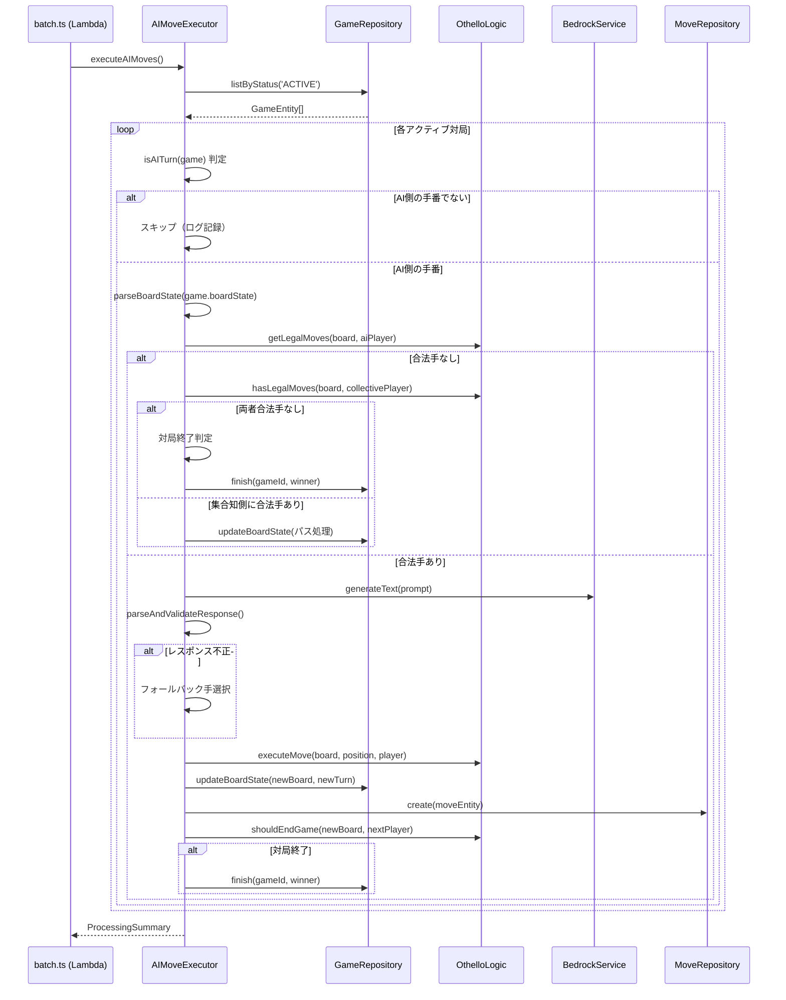

# 設計ドキュメント: AI手実行サービス (ai-move-execution)

## 概要

本設計は、投票対局アプリケーションにおけるAI側の手の自動実行機能を定義する。日次バッチ処理の一環として、集合知側の手が確定・盤面反映された後、AI側の手番であれば Amazon Bedrock (Nova Pro) を使用して手を決定し、盤面を更新する。

バッチ処理フロー内の位置づけ:

```text
投票集計 → 集合知の手確定 → [AI手実行（本Spec）] → 候補生成 → 解説生成
```

既存の `CandidateGenerator` / `CommentaryGenerator` と同じサービスパターンに従い、`AIMoveExecutor` サービスクラスとして実装する。BedrockService のインスタンスは既存サービスと共有する。

### 設計判断

1. **サービスパターンの踏襲**: `CandidateGenerator` と同じクラスベースのサービスパターンを採用。コンストラクタで依存を注入し、テスタビリティを確保する。
2. **フォールバック戦略**: AI レスポンスが不正な場合、合法手の先頭を自動選択することで対局の進行を保証する。
3. **個別対局の障害分離**: 1つの対局の処理失敗が他の対局に影響しないよう、対局単位で try-catch する。
4. **MoveRepository の新設**: 手履歴の保存は現在直接 DynamoDB 操作で行われているが、他のリポジトリと一貫性を持たせるため `MoveRepository` を新設する。

## アーキテクチャ

### 処理フロー



### バッチ処理統合

```typescript
// batch.ts 内での呼び出し順序
// 1. 投票集計（TODO）
// 2. 次の一手確定（TODO）
// 3. AI手実行 ← 本Spec
// 4. 候補生成（CandidateGenerator）
// 5. 解説生成（CommentaryGenerator）
```

## コンポーネントとインターフェース

### 1. AIMoveExecutor（メインサービスクラス）

```text
packages/api/src/services/ai-move-executor/
├── index.ts              # AIMoveExecutor クラス
├── prompt-builder.ts     # プロンプト構築（純粋関数）
├── response-parser.ts    # レスポンスパース・バリデーション（純粋関数）
└── types.ts              # 型定義
```

#### index.ts - AIMoveExecutor

```typescript
class AIMoveExecutor {
  constructor(
    bedrockService: BedrockService,
    gameRepository: GameRepository,
    moveRepository: MoveRepository
  );

  // メインエントリポイント: 全アクティブ対局のAI手を実行
  async executeAIMoves(): Promise<AIMoveProcessingSummary>;

  // 個別対局の処理
  private async processGame(game: GameEntity): Promise<AIMoveGameResult>;

  // AI側の手番かどうかを判定
  private isAITurn(game: GameEntity): boolean;

  // 盤面パース
  private parseBoardState(boardState: string): Board | null;

  // AIに手を決定させる
  private async decideMove(
    board: Board,
    legalMoves: Position[],
    aiSide: 'BLACK' | 'WHITE'
  ): Promise<AIMoveDecision>;

  // 対局終了判定と結果保存
  private async handleGameEnd(game: GameEntity, board: Board, nextPlayer: Player): Promise<boolean>;

  // パス処理
  private async handlePass(
    game: GameEntity,
    board: Board,
    currentTurn: number
  ): Promise<AIMoveGameResult>;
}
```

#### prompt-builder.ts

```typescript
// 盤面を8x8グリッド文字列に変換（CandidateGenerator の formatBoard を再利用可能）
function formatBoard(board: Board): string;

// AI手決定用プロンプトを構築
function buildAIMovePrompt(board: Board, legalMoves: Position[], aiSide: 'BLACK' | 'WHITE'): string;

// システムプロンプトを返す
function getAIMoveSystemPrompt(): string;
```

#### response-parser.ts

```typescript
// AIレスポンスをパースしバリデーション
function parseAIMoveResponse(responseText: string, legalMoves: Position[]): AIMoveParseResult;

// position 文字列を正規化（CandidateGenerator の normalizePosition を再利用可能）
function normalizePosition(position: string): string | null;

// description を200文字以内に切り詰め
function truncateDescription(description: string): string;
```

### 2. MoveRepository（新設）

```text
packages/api/src/lib/dynamodb/repositories/move.ts
```

```typescript
class MoveRepository extends BaseRepository {
  constructor(docClient: DynamoDBDocumentClient, tableName: string);

  // 手を保存
  async create(params: CreateMoveParams): Promise<MoveEntity>;

  // 対局の手履歴を取得
  async listByGame(gameId: string): Promise<MoveEntity[]>;
}
```

### 3. batch.ts への統合

```typescript
// 既存の batch.ts に AIMoveExecutor を追加
const aiMoveExecutor = new AIMoveExecutor(
  bedrockService, // 既存インスタンスを共有
  new GameRepository(),
  new MoveRepository(docClient, TABLE_NAME)
);

// handler 内で投票集計後、候補生成前に呼び出し
try {
  const aiMoveSummary = await aiMoveExecutor.executeAIMoves();
  console.log('AI move execution completed', aiMoveSummary);
} catch (aiMoveError) {
  console.error('AI move execution failed', aiMoveError);
  // 後続処理は継続
}
```

## データモデル

### MoveEntity（既存型、DynamoDB types.ts に定義済み）

| フィールド  | 型                     | 説明                             |
| ----------- | ---------------------- | -------------------------------- |
| PK          | string                 | `GAME#<gameId>`                  |
| SK          | string                 | `MOVE#<turnNumber>`              |
| entityType  | string                 | `'MOVE'`                         |
| gameId      | string                 | 対局ID                           |
| turnNumber  | number                 | ターン番号                       |
| side        | `'BLACK' \| 'WHITE'`   | 石の色                           |
| position    | string                 | `"row,col"` 形式                 |
| playedBy    | `'AI' \| 'COLLECTIVE'` | 実行者                           |
| candidateId | string                 | 候補ID（AI直接実行時は空文字列） |
| createdAt   | string                 | ISO 8601                         |

### GameEntity の更新フィールド

AI手実行時に更新されるフィールド:

| フィールド  | 更新内容                                      |
| ----------- | --------------------------------------------- |
| boardState  | 手実行後の盤面JSON                            |
| currentTurn | +1 インクリメント                             |
| updatedAt   | 現在時刻                                      |
| status      | 対局終了時に `'FINISHED'`                     |
| winner      | 対局終了時に `'AI' \| 'COLLECTIVE' \| 'DRAW'` |

### AI レスポンスの期待 JSON 構造

```json
{
  "position": "3,5",
  "description": "角を取る戦略的な一手です。..."
}
```

### 手番判定ロジック

```text
currentTurn が偶数 → 黒の手番（先手）
currentTurn が奇数 → 白の手番（後手）

game.aiSide と手番が一致 → AI側の手番
```

## 正当性プロパティ (Correctness Properties)

_プロパティとは、システムの全ての有効な実行において成り立つべき特性や振る舞いのことである。人間が読める仕様と機械的に検証可能な正当性保証の橋渡しとなる形式的な記述である。_

### Property 1: 手番判定の正確性

_任意の_ currentTurn と aiSide の組み合わせに対して、偶数ターンは黒の手番、奇数ターンは白の手番として判定し、aiSide と一致する場合のみ AI 側の手番と判定すること。

**Validates: Requirements 1.2, 1.5**

### Property 2: プロンプトに必要情報が含まれる

_任意の_ 有効な盤面、合法手一覧、AI側の色に対して、構築されたプロンプトには 8x8 グリッド表現の盤面、全ての合法手、AI側の色、1つの手を選択する指示、200文字以内の説明要求、JSON形式のレスポンス要求が含まれること。

**Validates: Requirements 3.1, 3.2, 3.3, 3.4, 3.5, 3.6, 3.7**

### Property 3: AIレスポンスのラウンドトリップ

_任意の_ 有効なAIレスポンス（合法手に含まれる position と 200文字以内の description）に対して、パースしてからフォーマットし直してから再度パースした結果は元のレスポンスと等価であること。

**Validates: Requirements 4.7**

### Property 4: 合法手バリデーション

_任意の_ AIレスポンスの position と合法手一覧に対して、position が合法手一覧に含まれない場合はフォールバック処理に移行すること。含まれる場合はその position が採用されること。

**Validates: Requirements 4.3, 4.4**

### Property 5: description の切り詰め

_任意の_ 文字列に対して、切り詰め後の description は200文字以内であり、元の文字列が200文字以内の場合は変更されないこと。

**Validates: Requirements 4.5, 4.6**

### Property 6: フォールバック手の選択

_任意の_ 不正なAIレスポンス（JSONパース失敗、不正な position）と合法手一覧に対して、フォールバック処理は合法手一覧の先頭の手を選択し、description を「AIが自動選択した手です。」に設定すること。

**Validates: Requirements 5.1, 5.2**

### Property 7: 盤面シリアライズのラウンドトリップ

_任意の_ 有効な 8x8 オセロ盤面に対して、JSON にシリアライズしてからデシリアライズした盤面は元の盤面と等価であること。

**Validates: Requirements 6.6, 2.1, 6.3**

### Property 8: currentTurn のインクリメント

_任意の_ AI手実行成功時に、更新後の currentTurn は実行前の currentTurn + 1 であること。

**Validates: Requirements 6.5**

### Property 9: MoveEntity のフィールド正確性

_任意の_ gameId、turnNumber、aiSide、position に対して、生成される MoveEntity の PK は `GAME#<gameId>` 形式、SK は `MOVE#<turnNumber>` 形式、side は aiSide に対応する色、position は `"row,col"` 形式、playedBy は `"AI"`、candidateId は空文字列であること。

**Validates: Requirements 7.2, 7.3, 7.4, 7.5, 7.6, 7.7**

### Property 10: 勝者決定の正確性

_任意の_ 終了盤面と aiSide に対して、AI側の石数が多ければ勝者は `"AI"`、集合知側の石数が多ければ `"COLLECTIVE"`、同数であれば `"DRAW"` と判定されること。

**Validates: Requirements 8.2, 8.3, 8.4, 8.5**

### Property 11: パス時の盤面不変性

_任意の_ AI側に合法手がない盤面に対して、パス処理後の盤面は処理前の盤面と完全に等価であること。

**Validates: Requirements 9.2**

### Property 12: 障害分離

_任意の_ 複数対局のリストに対して、1つの対局の処理が例外をスローしても、残りの対局は正常に処理され、サマリーの成功数 + 失敗数 + スキップ数 + パス数 = 全対局数であること。

**Validates: Requirements 10.1, 10.2, 10.3**

## エラーハンドリング

| エラー種別                          | 発生箇所              | 対処                                           |
| ----------------------------------- | --------------------- | ---------------------------------------------- |
| boardState パース失敗               | `parseBoardState`     | 対局をスキップ、ログ記録                       |
| Bedrock API エラー                  | `decideMove`          | フォールバック手を使用                         |
| AI レスポンス JSON パース失敗       | `parseAIMoveResponse` | フォールバック手を使用                         |
| AI が不正な position を返却         | `parseAIMoveResponse` | フォールバック手を使用                         |
| DynamoDB 書き込み失敗（盤面更新）   | `processGame`         | 対局を失敗として記録                           |
| DynamoDB 書き込み失敗（手履歴保存） | `processGame`         | エラーログ記録                                 |
| 個別対局の未知のエラー              | `processGame`         | 対局を失敗として記録、次の対局へ継続           |
| AIMoveExecutor 全体の失敗           | `batch.ts`            | エラーログ記録、後続の候補生成・解説生成は継続 |

### フォールバック戦略

AI レスポンスが使用できない場合（パース失敗、不正な手、Bedrock エラー）:

1. 合法手一覧の先頭の手を選択
2. description を「AIが自動選択した手です。」に設定
3. フォールバック発生をログに記録
4. 通常通り盤面更新・手履歴保存を実行

## テスト戦略

### プロパティベーステスト

ライブラリ: **fast-check** (既存プロジェクトで使用済み)

各プロパティテストは最低 10〜20 回のイテレーションで実行する（ワークスペースルールに従い `numRuns: 10〜20`、`endOnFailure: true` を設定）。

各テストにはコメントで設計プロパティへの参照を記載する:

```typescript
// Feature: ai-move-execution, Property {number}: {property_text}
```

各正当性プロパティは1つのプロパティベーステストで実装する。

#### プロパティテスト対象

| Property | テストファイル                     | テスト内容                                         |
| -------- | ---------------------------------- | -------------------------------------------------- |
| 1        | `prompt-builder.property.test.ts`  | ランダムな currentTurn/aiSide で手番判定           |
| 2        | `prompt-builder.property.test.ts`  | ランダムな盤面/合法手でプロンプト内容検証          |
| 3        | `response-parser.property.test.ts` | ランダムな有効レスポンスでラウンドトリップ         |
| 4        | `response-parser.property.test.ts` | ランダムな position と合法手で合法手バリデーション |
| 5        | `response-parser.property.test.ts` | ランダムな文字列で切り詰め検証                     |
| 6        | `response-parser.property.test.ts` | ランダムな不正レスポンスでフォールバック検証       |
| 7        | `index.property.test.ts`           | ランダムな盤面でシリアライズラウンドトリップ       |
| 8        | `index.property.test.ts`           | ランダムな currentTurn でインクリメント検証        |
| 9        | `index.property.test.ts`           | ランダムな入力で MoveEntity フィールド検証         |
| 10       | `index.property.test.ts`           | ランダムな盤面/aiSide で勝者決定検証               |
| 11       | `index.property.test.ts`           | 合法手なし盤面でパス時盤面不変性検証               |
| 12       | `index.property.test.ts`           | ランダムな対局リストで障害分離検証                 |

### ユニットテスト

ユニットテストはプロパティテストを補完し、具体的なシナリオとエッジケースをカバーする。

#### ユニットテスト対象

| テストファイル                  | テスト内容                                                         |
| ------------------------------- | ------------------------------------------------------------------ |
| `prompt-builder.test.ts`        | 具体的な盤面でのプロンプト構築、システムプロンプト内容             |
| `response-parser.test.ts`       | 有効なJSON、不正なJSON、マークダウンコードブロック付きレスポンス   |
| `index.test.ts`                 | AI手番スキップ、パス処理、対局終了、フォールバック、DynamoDBエラー |
| `move.test.ts` (MoveRepository) | MoveEntity の作成、手履歴の取得                                    |

### テストファイル配置

```text
packages/api/src/services/ai-move-executor/
├── __tests__/
│   ├── index.test.ts
│   ├── index.property.test.ts
│   ├── prompt-builder.test.ts
│   ├── prompt-builder.property.test.ts
│   ├── response-parser.test.ts
│   └── response-parser.property.test.ts
packages/api/src/lib/dynamodb/repositories/
├── move.test.ts
└── move.ts
```
