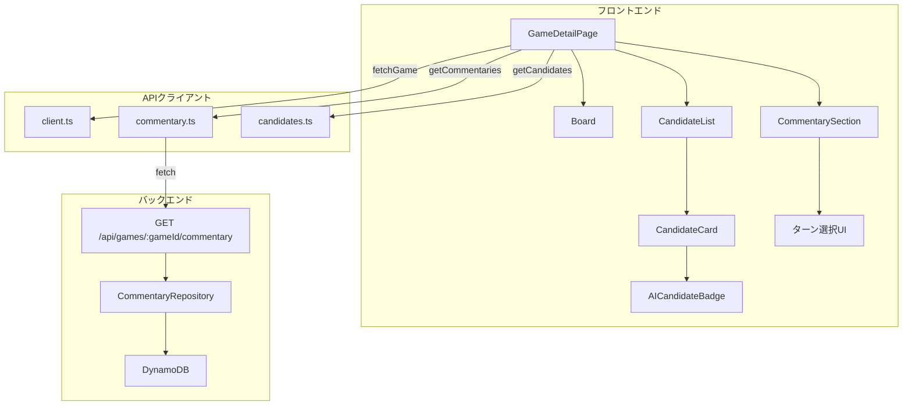
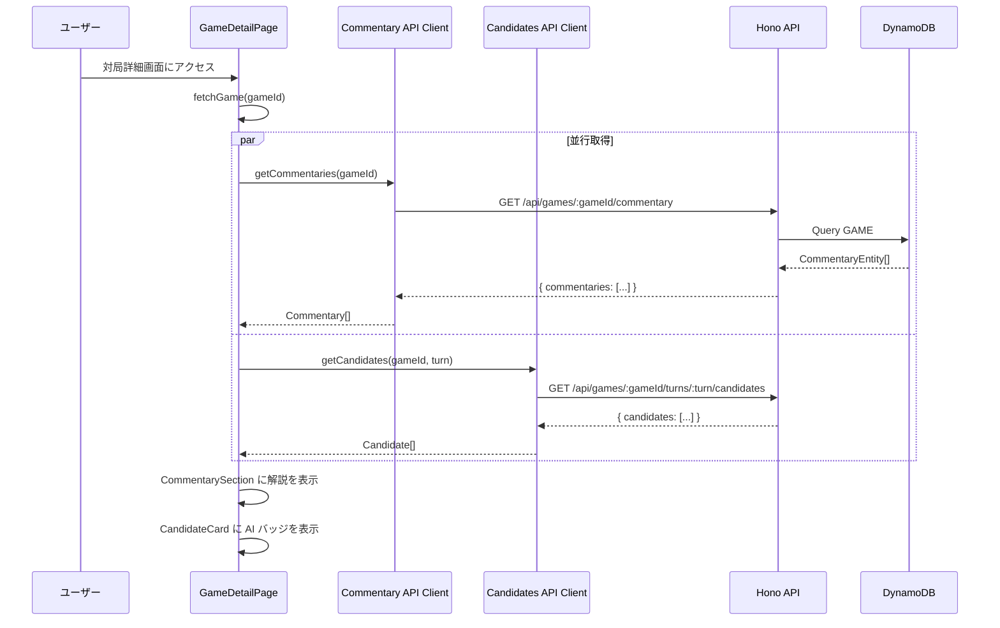

# 設計書: AI コンテンツ表示

## 概要

本設計は、バックエンドで生成された AI コンテンツ（次の一手候補と対局解説）をフロントエンドに表示する機能を定義する。

主な実装内容:

1. 既存の候補カードに AI 生成バッジを追加
2. 対局解説取得 API エンドポイント（バックエンド）の新規実装
3. 対局解説 API クライアント（フロントエンド）の新規実装
4. 対局解説セクションコンポーネントの新規実装
5. 対局詳細画面への統合

バックエンドの AI 機能（spec 27〜30）は完了済みで、`CommentaryRepository` による DynamoDB アクセス層と `CommentaryGenerator` サービスが稼働している。フロントエンドの対局詳細画面（spec 15）と候補一覧表示（spec 23）も実装済みである。

### 設計判断

- **解説 API はバックエンドに新規ルートとして追加**: 既存の `CommentaryRepository.listByGame()` を活用し、`GET /api/games/:gameId/commentary` エンドポイントを Hono ルーターで実装する。認証不要の公開エンドポイントとする。
- **AI バッジは既存の候補カードを拡張**: `_components/candidate-card.tsx` の投稿者名表示部分に条件付きでバッジを追加する。既存の `source` フィールド（`'ai' | 'user'`）を利用する。
- **解説セクションは Client Component**: 解説データの取得・ターン切り替えにクライアント状態管理が必要なため `'use client'` とする。
- **解説データ取得は候補データ取得と並行**: `Promise.allSettled` パターンで並行取得し、解説取得失敗が候補表示をブロックしない。

## アーキテクチャ



### データフロー



## コンポーネントとインターフェース

### 1. AICandidateBadge コンポーネント

新規ファイル: `packages/web/src/app/games/[gameId]/_components/ai-candidate-badge.tsx`

```typescript
interface AICandidateBadgeProps {
  // props なし（固定表示コンポーネント）
}
```

- 紫色のバッジ（`bg-purple-100 text-purple-800`）
- テキスト: "AI生成"
- `aria-label="AI が生成した候補"` を設定
- `<span>` タグで実装

### 2. CommentarySection コンポーネント

新規ファイル: `packages/web/src/app/games/[gameId]/_components/commentary-section.tsx`

```typescript
interface CommentarySectionProps {
  /** 解説データの配列（turnNumber 昇順） */
  commentaries: Commentary[];
  /** データ取得中かどうか */
  isLoading: boolean;
  /** エラーメッセージ（取得失敗時） */
  error: string | null;
  /** 対局のステータス */
  gameStatus: 'ACTIVE' | 'FINISHED';
  /** 現在のターン番号 */
  currentTurn: number;
}
```

- `'use client'` コンポーネント
- 青色系スタイリング（`bg-blue-50 border-blue-200`）
- ターン選択 UI（前のターン / 次のターン ボタン）
- デフォルトで最新ターンの解説を表示
- ローディング時はスケルトンローダー表示
- エラー時は `role="alert"` でエラーメッセージ表示
- 解説なし時は「この対局の AI 解説はまだありません」表示
- セマンティック HTML（`<section>`, `<article>`）使用
- 見出し `<h2>AI解説</h2>`

### 3. Commentary API Client

新規ファイル: `packages/web/src/lib/api/commentary.ts`

```typescript
/** 解説データ型 */
export interface Commentary {
  turnNumber: number;
  content: string;
  generatedBy: string;
  createdAt: string;
}

/** API レスポンス型 */
interface CommentaryApiResponse {
  commentaries: Array<{
    turnNumber: number;
    content: string;
    generatedBy: string;
    createdAt: string;
  }>;
}

/** 解説一覧取得 */
export async function getCommentaries(gameId: string): Promise<Commentary[]>;
```

- 既存の `getApiBaseUrl()` / `handleResponse()` パターンを再利用
- 404 レスポンス時は空配列を返す
- その他のエラーは `ApiError` をスロー

### 4. 解説取得 API エンドポイント（バックエンド）

新規ファイル: `packages/api/src/routes/commentary.ts`

```typescript
// GET /api/games/:gameId/commentary
// レスポンス: { commentaries: CommentaryResponse[] }

interface CommentaryResponse {
  turnNumber: number;
  content: string;
  generatedBy: string;
  createdAt: string;
}
```

- 既存の `CommentaryRepository.listByGame()` を使用
- `turnNumber` 昇順でソート
- 対局が存在しない場合は 404 を返す
- 解説が存在しない場合は空の `commentaries` 配列を返す
- 認証不要（公開エンドポイント）
- `packages/api/src/index.ts` にルート登録

### 5. CandidateCard の拡張

既存ファイル: `packages/web/src/app/games/[gameId]/_components/candidate-card.tsx`

- 投稿者名の横に `AICandidateBadge` を条件付き表示
- `candidate.source === 'ai'` の場合のみバッジ表示
- 既存の `postedByUsername` フィールドをそのまま使用（バックエンドが `createdBy === 'AI'` の場合に "AI" をマッピング済み）

### 6. GameDetailPage の拡張

既存ファイル: `packages/web/src/app/games/[gameId]/page.tsx`

- 解説データの state 追加（`commentaries`, `commentariesLoading`, `commentariesError`）
- ゲームデータ取得後に `getCommentaries()` を候補取得と並行で呼び出し
- 既存の AI 解説プレースホルダーを `CommentarySection` コンポーネントに置き換え

## データモデル

### CommentaryEntity（既存 - DynamoDB）

| フィールド  | 型     | 説明                      |
| ----------- | ------ | ------------------------- |
| PK          | string | `GAME#{gameId}`           |
| SK          | string | `COMMENTARY#{turnNumber}` |
| entityType  | string | `'COMMENTARY'`            |
| gameId      | string | ゲームID                  |
| turnNumber  | number | ターン番号                |
| content     | string | 解説文                    |
| generatedBy | string | `'AI'`                    |
| createdAt   | string | 作成日時（ISO 8601）      |

### Commentary 型（フロントエンド - 新規）

```typescript
export interface Commentary {
  turnNumber: number;
  content: string;
  generatedBy: string;
  createdAt: string;
}
```

### Candidate 型（既存 - フロントエンド）

既存の `Candidate` インターフェースには `source: 'ai' | 'user'` フィールドが含まれている。`mapCandidate()` 関数で `createdBy === 'AI'` の場合に `source: 'ai'` にマッピング済み。変更不要。

## 正当性プロパティ

_プロパティとは、システムのすべての有効な実行において成り立つべき特性や振る舞いのことである。人間が読める仕様と機械的に検証可能な正当性保証の橋渡しとなる。_

### Property 1: AI バッジ表示は source フィールドと一致する

_For any_ 候補データにおいて、`source === 'ai'` の場合のみ AI_Candidate_Badge が表示され、`source === 'user'` の場合は表示されない。バッジの表示有無は `source` フィールドの値と完全に一致する。

**Validates: Requirements 1.1, 1.2**

### Property 2: 投稿者名表示は source に基づいて正しくマッピングされる

_For any_ 候補データにおいて、`source === 'ai'` の場合は投稿者名が "AI" と表示され、`source === 'user'` の場合は `postedByUsername` フィールドの値が表示される。

**Validates: Requirements 2.1, 2.2**

### Property 3: 解説 API レスポンスのマッピングはすべてのフィールドを保持する

_For any_ 有効な API レスポンス（turnNumber, content, generatedBy, createdAt を含む）において、`getCommentaries()` のマッピング結果はすべてのフィールドの値を正確に保持する。

**Validates: Requirements 3.2, 3.3**

### Property 4: 選択されたターンの解説が正しく表示される

_For any_ 非空の解説配列と有効なターンインデックスにおいて、CommentarySection は選択されたターンに対応する解説の content と createdAt を表示する。

**Validates: Requirements 4.2, 4.4, 4.5**

### Property 5: ターンナビゲーションは正しく解説を切り替える

_For any_ 2件以上の解説を持つ配列において、「前のターン」ボタンをクリックすると1つ前のターンの解説が表示され、「次のターン」ボタンをクリックすると1つ次のターンの解説が表示される。表示中のターン番号は常に正しい。

**Validates: Requirements 5.3, 5.4, 5.5**

### Property 6: 複数ターンの解説がある場合にターン選択 UI が表示される

_For any_ 2件以上の解説を持つ配列において、ターン選択 UI（前のターン / 次のターン ボタン）が表示される。1件以下の場合は表示されない。

**Validates: Requirements 5.1**

### Property 7: デフォルトで最新ターンの解説が表示される

_For any_ 非空の解説配列において、CommentarySection の初期表示は turnNumber が最大の解説である。

**Validates: Requirements 5.8**

### Property 8: 解説 API は turnNumber 昇順でソートされたデータを返す

_For any_ ゲームに紐づく解説セットにおいて、API レスポンスの commentaries 配列は turnNumber の昇順でソートされている。

**Validates: Requirements 8.2**

### Property 9: 解説 API レスポンスは必須フィールドをすべて含む

_For any_ API から返される解説データにおいて、各要素は turnNumber（数値）、content（文字列）、generatedBy（文字列）、createdAt（文字列）を含む。

**Validates: Requirements 8.4**

### Property 10: 解説取得失敗は候補一覧の表示をブロックしない

_For any_ 解説 API がエラーを返す状況において、GameDetailPage は候補一覧を正常に表示し続ける。

**Validates: Requirements 7.4**

## エラーハンドリング

### フロントエンド

| エラー状況                    | 対応                                                                                                    |
| ----------------------------- | ------------------------------------------------------------------------------------------------------- |
| 解説 API が 404 を返す        | 空配列として処理、「この対局の AI 解説はまだありません」を表示                                          |
| 解説 API がネットワークエラー | `commentariesError` state にエラーメッセージを設定、`role="alert"` で「解説の取得に失敗しました」を表示 |
| 解説 API が 500 を返す        | 上記と同様のエラー表示                                                                                  |
| 解説取得失敗時の候補表示      | 解説取得失敗は候補一覧の表示に影響しない（独立したエラーハンドリング）                                  |
| 解説データが空配列            | 「この対局の AI 解説はまだありません」メッセージを表示                                                  |

### バックエンド

| エラー状況          | 対応                                      |
| ------------------- | ----------------------------------------- |
| gameId が無効な形式 | 400 Bad Request（Zod バリデーション）     |
| 対局が存在しない    | 404 Not Found                             |
| DynamoDB クエリ失敗 | 500 Internal Server Error、エラーログ出力 |

## テスト戦略

### テストフレームワーク

- ユニットテスト / プロパティベーステスト: Vitest + React Testing Library
- プロパティベーステスト: fast-check
- 各プロパティテストは `numRuns: 10`、`endOnFailure: true` で設定（JSDOM 環境の安定性のため）
- `fc.asyncProperty` は使用しない（React コンポーネントテストでの環境破壊を防ぐため）

### ユニットテスト

1. **AICandidateBadge コンポーネント**
   - "AI生成" テキストの表示
   - 紫色スタイリング（bg-purple-100, text-purple-800）の適用
   - aria-label 属性の設定
   - セマンティック HTML の使用

2. **CommentarySection コンポーネント**
   - "AI解説" 見出しの表示
   - ローディング時のスケルトンローダー表示
   - エラー時のエラーメッセージ表示（role="alert"）
   - 解説なし時の空メッセージ表示
   - 青色系スタイリングの適用
   - セマンティック HTML（section, article, h2）の使用
   - ターン選択ボタンの境界条件（最初/最後のターンでの無効化、aria-disabled）

3. **Commentary API Client**
   - 正しい URL への fetch 呼び出し
   - 404 レスポンス時の空配列返却
   - エラーレスポンス時の ApiError スロー
   - 認証ヘッダーなしでのリクエスト

4. **解説取得 API エンドポイント（バックエンド）**
   - 正常レスポンスの形式
   - 存在しない gameId での 404 レスポンス
   - 解説なし時の空配列レスポンス
   - 認証不要の確認

5. **CandidateCard の拡張**
   - AI 候補でのバッジ表示
   - ユーザー候補でのバッジ非表示

### プロパティベーステスト

各正当性プロパティに対して1つのプロパティベーステストを実装する。

- **Property 1**: `fc.property` で `source` を `fc.constantFrom('ai', 'user')` で生成し、バッジ表示の一致を検証
  - Tag: `Feature: ai-content-display, Property 1: AI バッジ表示は source フィールドと一致する`
- **Property 2**: `fc.property` で候補データを生成し、投稿者名表示の正しさを検証
  - Tag: `Feature: ai-content-display, Property 2: 投稿者名表示は source に基づいて正しくマッピングされる`
- **Property 3**: `fc.property` で API レスポンスデータを生成し、マッピング後のフィールド保持を検証
  - Tag: `Feature: ai-content-display, Property 3: 解説 API レスポンスのマッピングはすべてのフィールドを保持する`
- **Property 4**: `fc.property` で解説配列とターンインデックスを生成し、表示内容の正しさを検証
  - Tag: `Feature: ai-content-display, Property 4: 選択されたターンの解説が正しく表示される`
- **Property 5**: `fc.property` で解説配列を生成し、ナビゲーション後の表示内容を検証
  - Tag: `Feature: ai-content-display, Property 5: ターンナビゲーションは正しく解説を切り替える`
- **Property 6**: `fc.property` で解説配列の長さを生成し、ターン選択 UI の表示条件を検証
  - Tag: `Feature: ai-content-display, Property 6: 複数ターンの解説がある場合にターン選択 UI が表示される`
- **Property 7**: `fc.property` で解説配列を生成し、初期表示が最新ターンであることを検証
  - Tag: `Feature: ai-content-display, Property 7: デフォルトで最新ターンの解説が表示される`
- **Property 8**: `fc.property` で解説データを生成し、API レスポンスのソート順を検証
  - Tag: `Feature: ai-content-display, Property 8: 解説 API は turnNumber 昇順でソートされたデータを返す`
- **Property 9**: `fc.property` で解説データを生成し、必須フィールドの存在を検証
  - Tag: `Feature: ai-content-display, Property 9: 解説 API レスポンスは必須フィールドをすべて含む`
- **Property 10**: `fc.property` で解説 API エラーシナリオを生成し、候補一覧の表示継続を検証
  - Tag: `Feature: ai-content-display, Property 10: 解説取得失敗は候補一覧の表示をブロックしない`
