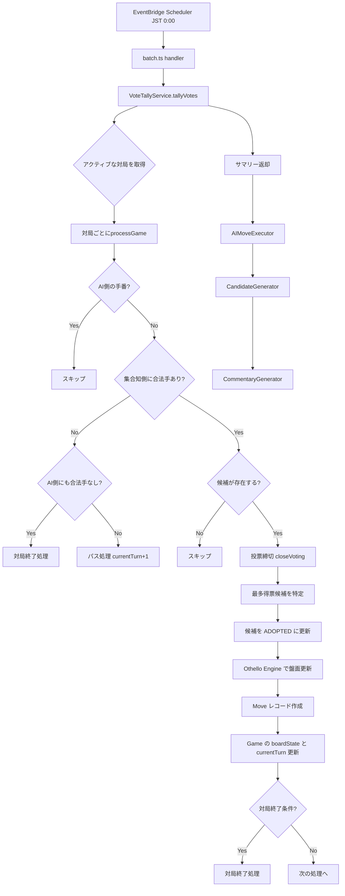
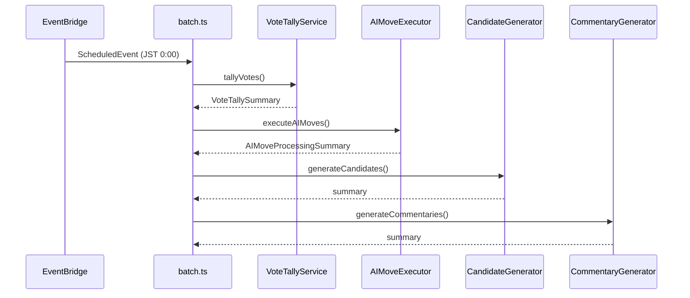

# 設計書: 投票締切・集計バッチ

## 概要

投票締切・集計バッチは、日次バッチ処理（JST 0:00 = UTC 15:00）の一環として、アクティブな対局の投票を締め切り、集計し、最多得票の候補を次の一手として確定するサービスである。

既存の `batch.ts` ハンドラーには投票集計と次の一手決定の TODO が残されており、本設計ではこれらを `VoteTallyService` として実装し、既存のバッチパイプラインに統合する。

### 処理フロー概要



## アーキテクチャ

### サービス配置

`VoteTallyService` は `packages/api/src/services/vote-tally/` に配置する。既存の `AIMoveExecutor` と同じサービスパターンに従い、リポジトリを DI で受け取る設計とする。

```text
packages/api/src/
├── batch.ts                          # ハンドラー（VoteTallyService を統合）
├── services/
│   ├── vote-tally/
│   │   ├── index.ts                  # VoteTallyService クラス
│   │   └── types.ts                  # 型定義
│   ├── ai-move-executor/             # 既存
│   ├── candidate-generator/          # 既存
│   └── commentary-generator/         # 既存
└── lib/
    ├── othello/                      # 既存（ゲームロジック）
    └── dynamodb/
        └── repositories/             # 既存（データアクセス）
```

### バッチ実行順序



投票集計 → AI手実行 → 候補生成 → 解説生成の順序は、各ステップが前のステップの結果に依存するため重要である。投票集計で集合知の手が確定した後に AI が応手し、その後に次ターンの候補が生成される。

## コンポーネントとインターフェース

### VoteTallyService

```typescript
class VoteTallyService {
  constructor(
    private gameRepository: GameRepository,
    private candidateRepository: CandidateRepository,
    private moveRepository: MoveRepository
  )

  // メインエントリポイント: 全アクティブ対局の投票集計を実行
  async tallyVotes(): Promise<VoteTallySummary>

  // 対局単位の処理
  private async processGame(game: GameEntity): Promise<VoteTallyGameResult>

  // 最多得票候補の特定（同票時は createdAt が最も古い候補を採用）
  private findWinningCandidate(candidates: CandidateEntity[]): CandidateEntity | null

  // 盤面への手の適用
  private async applyMove(
    game: GameEntity,
    candidate: CandidateEntity,
    board: Board
  ): Promise<void>

  // 対局終了処理
  private async handleGameEnd(
    game: GameEntity,
    board: Board
  ): Promise<void>

  // パス処理
  private async handlePass(
    game: GameEntity,
    board: Board
  ): Promise<VoteTallyGameResult>

  // boardState JSON のパース
  private parseBoardState(boardState: string): Board | null
}
```

### 既存コンポーネントとの連携

| コンポーネント        | 利用メソッド             | 用途                          |
| --------------------- | ------------------------ | ----------------------------- |
| `GameRepository`      | `listByStatus('ACTIVE')` | アクティブ対局の取得          |
| `GameRepository`      | `updateBoardState()`     | 盤面・ターン更新              |
| `GameRepository`      | `finish()`               | 対局終了                      |
| `CandidateRepository` | `listByTurn()`           | ターンの候補一覧取得          |
| `CandidateRepository` | `closeVoting()`          | 投票締切（ステータス→CLOSED） |
| `CandidateRepository` | `markAsAdopted()`        | 採用候補のステータス→ADOPTED  |
| `MoveRepository`      | `create()`               | 手レコードの作成              |
| Othello Engine        | `executeMove()`          | 盤面への手の適用              |
| Othello Engine        | `shouldEndGame()`        | 終了判定                      |
| Othello Engine        | `countDiscs()`           | 石数カウント                  |
| Othello Engine        | `getLegalMoves()`        | 合法手の取得                  |
| Othello Engine        | `hasLegalMoves()`        | 合法手の有無判定              |

## データモデル

### 型定義（types.ts）

```typescript
/** 対局単位の処理結果 */
export interface VoteTallyGameResult {
  gameId: string;
  status: 'success' | 'skipped' | 'failed' | 'passed' | 'finished';
  reason?: string;
  adoptedCandidateId?: string;
  position?: string;
}

/** バッチ全体の処理サマリー */
export interface VoteTallySummary {
  totalGames: number;
  successCount: number;
  failedCount: number;
  skippedCount: number;
  passedCount: number;
  finishedCount: number;
  results: VoteTallyGameResult[];
}
```

### 既存エンティティの利用

本サービスは新しい DynamoDB エンティティを追加しない。既存のエンティティを利用する。

| エンティティ      | 操作          | 説明                                                |
| ----------------- | ------------- | --------------------------------------------------- |
| `GameEntity`      | Read / Update | ステータス、盤面、ターン番号の読み取り・更新        |
| `CandidateEntity` | Read / Update | 候補の取得、ステータス変更（VOTING→CLOSED→ADOPTED） |
| `MoveEntity`      | Create        | 確定した手のレコード作成                            |

### 手番判定ロジック

既存の `isAITurn` 関数（`ai-move-executor/prompt-builder.ts`）と同じロジックを使用する:

```text
偶数ターン（0, 2, 4, ...）→ 黒の手番（先手）
奇数ターン（1, 3, 5, ...）→ 白の手番（後手）
```

集合知側の手番 = `!isAITurn(game)` である。`isAITurn` を共通ユーティリティとして抽出し、両サービスから参照する。

### 最多得票候補の決定アルゴリズム

```text
1. 候補一覧を voteCount の降順でソート
2. 同票の場合は createdAt の昇順（最も古い候補を優先）
3. 全候補の voteCount が 0 の場合も同じロジック（createdAt が最も古い候補を採用）
4. ソート後の先頭要素を採用候補とする
```

このアルゴリズムは純粋関数 `findWinningCandidate` として実装し、テスト容易性を確保する。

### position フォーマット

候補の `position` フィールドは `"row,col"` 形式の文字列（例: `"2,3"`）。Othello Engine の `executeMove` に渡す際は `{ row: number, col: number }` にパースする。

## 正当性プロパティ

_プロパティとは、システムの全ての有効な実行において成り立つべき特性や振る舞いのことである。人間が読める仕様と機械的に検証可能な正当性保証の橋渡しとなる。_

### Property 1: 最多得票候補の決定

_任意の_ 空でない候補リストに対して、`findWinningCandidate` は以下を満たす候補を返す:

- 返された候補の `voteCount` は、リスト内の全候補の `voteCount` 以上である
- 同じ最大 `voteCount` を持つ候補が複数存在する場合、返された候補の `createdAt` はそれらの中で最も古い

**Validates: Requirements 2.1, 2.3**

### Property 2: 勝者決定の正確性

_任意の_ 盤面と `aiSide`（BLACK または WHITE）に対して、`determineWinner` は以下を満たす:

- AI 側の石数 > 集合知側の石数 → `'AI'` を返す
- 集合知側の石数 > AI 側の石数 → `'COLLECTIVE'` を返す
- 両者の石数が等しい → `'DRAW'` を返す

**Validates: Requirements 4.2**

### Property 3: サマリーの整合性

_任意の_ `VoteTallyGameResult` 配列に対して、生成されるサマリーは以下を満たす:

- `totalGames` は配列の長さと等しい
- `successCount + failedCount + skippedCount + passedCount + finishedCount` は `totalGames` と等しい
- 各カウントは、対応する `status` を持つ結果の数と一致する

**Validates: Requirements 6.1**

### Property 4: AI ターン判定

_任意の_ `GameEntity`（`currentTurn` と `aiSide` を持つ）に対して:

- `currentTurn` が偶数かつ `aiSide` が `'BLACK'` → AI ターン（スキップ）
- `currentTurn` が奇数かつ `aiSide` が `'WHITE'` → AI ターン（スキップ）
- それ以外 → 集合知ターン（処理対象）

**Validates: Requirements 8.1**

## エラーハンドリング

### 対局単位のエラー隔離

各対局の処理は独立しており、1つの対局でエラーが発生しても他の対局の処理は継続する。`processGame` を try-catch で囲み、エラー時は `status: 'failed'` の結果を返す。

```typescript
for (const game of activeGames) {
  try {
    const result = await this.processGame(game);
    results.push(result);
  } catch (error) {
    console.log(
      JSON.stringify({
        type: 'VOTE_TALLY_GAME_FAILED',
        gameId: game.gameId,
        error: error instanceof Error ? error.message : 'Unknown error',
      })
    );
    results.push({ gameId: game.gameId, status: 'failed', reason: '...' });
  }
}
```

### エラーケース一覧

| エラーケース                  | 対応                                         | 要件 |
| ----------------------------- | -------------------------------------------- | ---- |
| `closeVoting` 失敗            | エラーログ出力、対局スキップ                 | 1.4  |
| 無効な position               | エラーログ出力、盤面更新スキップ             | 3.4  |
| `boardState` パース失敗       | エラーログ出力、対局スキップ                 | -    |
| `VoteTallyService` 全体の失敗 | エラーログ出力、後続処理（AI手実行等）は継続 | 7.2  |

### 構造化ログ

全てのログは JSON 形式で出力する。CloudWatch Logs Insights でのクエリを容易にするため、`type` フィールドで分類する。

```typescript
// ログタイプ一覧
type: 'VOTE_TALLY_START'; // バッチ開始
type: 'VOTE_TALLY_GAME_START'; // 対局処理開始
type: 'VOTE_TALLY_GAME_SKIPPED'; // 対局スキップ（AI ターン、候補なし等）
type: 'VOTE_TALLY_GAME_SUCCESS'; // 対局処理成功
type: 'VOTE_TALLY_GAME_PASSED'; // パス処理
type: 'VOTE_TALLY_GAME_FINISHED'; // 対局終了
type: 'VOTE_TALLY_GAME_FAILED'; // 対局処理失敗
type: 'VOTE_TALLY_COMPLETE'; // バッチ完了（サマリー付き）
```

## テスト戦略

### プロパティベーステスト

プロパティベーステストには **fast-check** を使用する。各プロパティテストは最低 10〜20 回のイテレーションで実行する（ワークスペースルールに従い `numRuns: 10`、`endOnFailure: true` を設定）。

対象となる純粋関数:

- `findWinningCandidate`: 候補リストから最多得票候補を決定（Property 1）
- `determineWinner`: 盤面と aiSide から勝者を決定（Property 2）
- サマリー集計ロジック（Property 3）
- `isAITurn`: 手番判定（Property 4）

各テストには以下のタグコメントを付与する:

```typescript
// Feature: 32-vote-tally-batch, Property 1: 最多得票候補の決定
// Feature: 32-vote-tally-batch, Property 2: 勝者決定の正確性
// Feature: 32-vote-tally-batch, Property 3: サマリーの整合性
// Feature: 32-vote-tally-batch, Property 4: AI ターン判定
```

### ユニットテスト

ユニットテストは Vitest を使用し、以下のケースをカバーする:

1. **VoteTallyService.processGame**
   - 正常系: 候補あり → 投票締切 → 最多得票候補採用 → 盤面更新
   - AI ターンのスキップ
   - 候補なしのスキップ
   - パス処理（集合知側に合法手なし）
   - 対局終了判定
   - エラー時の隔離（1対局の失敗が他に影響しない）

2. **VoteTallyService.tallyVotes**
   - 複数対局の処理
   - サマリーの正確性
   - VoteTallyService 全体のエラーハンドリング

3. **batch.ts 統合**
   - VoteTallyService が AIMoveExecutor の前に実行される
   - VoteTallyService の失敗時に後続処理が継続する

### テストでのモック戦略

リポジトリと Othello Engine の関数をモックし、VoteTallyService のロジックに集中する:

```typescript
// リポジトリのモック
const mockGameRepository = {
  listByStatus: vi.fn(),
  updateBoardState: vi.fn(),
  finish: vi.fn(),
};
const mockCandidateRepository = {
  listByTurn: vi.fn(),
  closeVoting: vi.fn(),
  markAsAdopted: vi.fn(),
};
const mockMoveRepository = {
  create: vi.fn(),
};
```

純粋関数（`findWinningCandidate`、`determineWinner`、`isAITurn`）はモックせず、実際のロジックをテストする。
