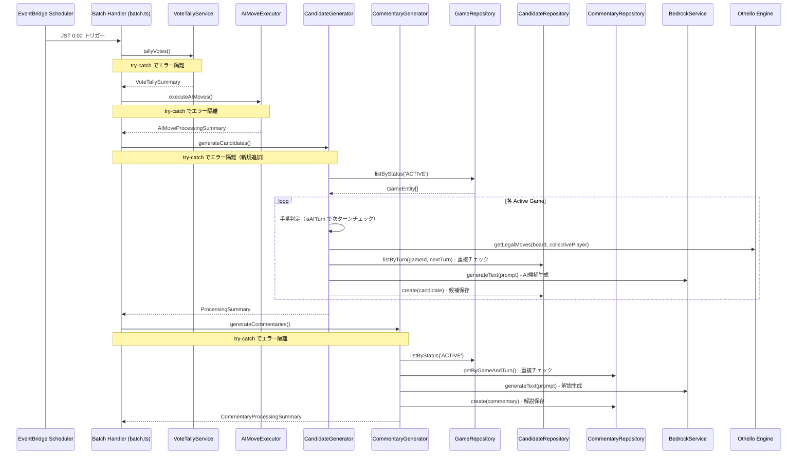
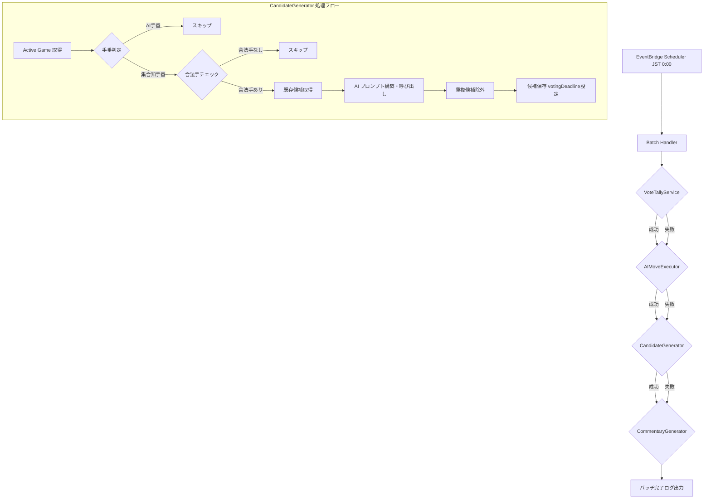

# 設計書: AI 候補生成バッチ

## 概要

本設計は、日次バッチ処理における AI 候補生成（CandidateGenerator）と対局解説生成（CommentaryGenerator）の信頼性・正確性を向上させるための改修を定義する。

現在の `batch.ts` には以下の課題がある:

1. CandidateGenerator が集合知側の手番かどうかを判定せずに候補を生成している
2. CandidateGenerator の `generateCandidates()` が try-catch で囲まれておらず、失敗時に後続の CommentaryGenerator が実行されない
3. 対局終了済みの対局に対するスキップが暗黙的に処理されている

主な改修内容:

1. `batch.ts` の CandidateGenerator 呼び出しを try-catch で囲み、エラー隔離を実現
2. CandidateGenerator に集合知側の手番判定ロジックを追加（`isAITurn` を利用）
3. 各サービスの処理サマリーを構造化ログ（JSON 形式）で出力
4. 既存の重複候補防止・合法手チェック・投票期限設定のロジックが正しく動作していることをテストで検証

### 設計判断

- **batch.ts のエラー隔離**: CandidateGenerator の `generateCandidates()` を try-catch で囲む。VoteTallyService、AIMoveExecutor、CommentaryGenerator と同じパターンに統一する。
- **手番判定は CandidateGenerator 内部で実施**: `game-utils.ts` の `isAITurn` 関数を使い、次のターン（currentTurn + 1）が AI 側の手番であれば候補生成をスキップする。batch.ts 側ではなくサービス内部で判定することで、サービスの責務を明確にする。
- **既存の CandidateGenerator の構造を活用**: 合法手チェック、重複候補防止、投票期限設定は既に実装済み。手番判定の追加と、テストによる検証を行う。
- **CommentaryGenerator の重複防止は既に実装済み**: `commentaryRepository.getByGameAndTurn()` による既存チェックが動作している。テストで検証する。

## アーキテクチャ



### バッチ処理フロー



## コンポーネントとインターフェース

### 1. batch.ts（Batch Handler）の改修

既存ファイル: `packages/api/src/batch.ts`

```typescript
// 改修: CandidateGenerator の呼び出しを try-catch で囲む
// 改修前:
//   const summary = await candidateGenerator.generateCandidates();
//   console.log('Candidate generation completed', summary);
// 改修後:
try {
  const candidateSummary = await candidateGenerator.generateCandidates();
  console.log(
    JSON.stringify({
      type: 'BATCH_CANDIDATE_GENERATION_COMPLETED',
      ...candidateSummary,
    })
  );
} catch (candidateError) {
  console.error(
    JSON.stringify({
      type: 'BATCH_CANDIDATE_GENERATION_FAILED',
      error: candidateError instanceof Error ? candidateError.message : 'Unknown error',
    })
  );
}
```

- 4つのサービス全てが独立した try-catch で囲まれる
- 各サービスの処理サマリーを構造化ログ（JSON 形式）で出力
- バッチ全体の完了ログを出力

### 2. CandidateGenerator の改修

既存ファイル: `packages/api/src/services/candidate-generator/index.ts`

```typescript
// 改修: processGame メソッドに手番判定を追加
private async processGame(game: GameEntity): Promise<GameProcessingResult> {
  // 新規追加: 次のターンが AI 側の手番かチェック
  const nextTurnGame = { ...game, currentTurn: game.currentTurn + 1 };
  if (isAITurn(nextTurnGame)) {
    // AI 側の手番 → 集合知の候補生成は不要
    return { gameId: game.gameId, status: 'skipped', ... reason: 'Next turn is AI turn' };
  }
  // 既存ロジック: boardState パース、合法手チェック、重複チェック、AI呼び出し、候補保存
}
```

- `game-utils.ts` の `isAITurn` 関数をインポートして使用
- 手番判定は boardState パースの前に実行（不要な処理を避ける）
- スキップ理由を構造化ログに記録

### 3. 既存の CandidateGenerator 機能（変更なし・テスト検証対象）

以下の機能は既に実装済みで、テストで正しく動作することを検証する:

- **合法手チェック**: `getLegalMoves(board, collectivePlayer)` で合法手がない場合はスキップ
- **重複候補防止**: `candidateRepository.listByTurn()` で既存候補を取得し、同一ポジションの候補を除外
- **投票期限設定**: `calculateVotingDeadline()` で翌日 JST 23:59:59.999 を設定
- **turnNumber 設定**: `currentTurn + 1` を候補の turnNumber に設定
- **createdBy 設定**: `'AI'` を候補の createdBy に設定

### 4. 既存の CommentaryGenerator 機能（変更なし・テスト検証対象）

以下の機能は既に実装済みで、テストで正しく動作することを検証する:

- **重複解説防止**: `commentaryRepository.getByGameAndTurn()` で既存解説をチェック
- **Active Game のみ処理**: `gameRepository.listByStatus('ACTIVE')` で取得
- **対局単位のエラー隔離**: processGame 内の try-catch で個別対局の失敗を隔離

## データモデル

### GameEntity（既存 - DynamoDB）

| フィールド  | 型     | 説明                                           |
| ----------- | ------ | ---------------------------------------------- |
| PK          | string | `GAME#{gameId}`                                |
| SK          | string | `GAME#{gameId}`                                |
| entityType  | string | `'GAME'`                                       |
| gameId      | string | ゲームID                                       |
| gameType    | string | `'OTHELLO'`                                    |
| status      | string | `'ACTIVE'` \| `'FINISHED'`                     |
| aiSide      | string | `'BLACK'` \| `'WHITE'`                         |
| currentTurn | number | 現在のターン番号                               |
| boardState  | string | JSON 文字列 `{ board: number[][] }`            |
| winner      | string | `'AI'` \| `'COLLECTIVE'` \| `'DRAW'`（終了時） |

### CandidateEntity（既存 - DynamoDB）

| フィールド     | 型     | 説明                                          |
| -------------- | ------ | --------------------------------------------- |
| PK             | string | `GAME#{gameId}#TURN#{turnNumber}`             |
| SK             | string | `CANDIDATE#{candidateId}`                     |
| entityType     | string | `'CANDIDATE'`                                 |
| candidateId    | string | 候補ID（UUID）                                |
| gameId         | string | ゲームID                                      |
| turnNumber     | number | ターン番号（`currentTurn + 1`）               |
| position       | string | `"row,col"` 形式                              |
| description    | string | 200文字以内の説明文                           |
| voteCount      | number | 投票数（初期値 0）                            |
| createdBy      | string | `'AI'` または `'USER#{userId}'`               |
| status         | string | `'VOTING'` \| `'CLOSED'` \| `'ADOPTED'`       |
| votingDeadline | string | 投票期限（翌日 JST 23:59:59.999 の ISO 8601） |

### CommentaryEntity（既存 - DynamoDB）

| フィールド  | 型     | 説明                      |
| ----------- | ------ | ------------------------- |
| PK          | string | `GAME#{gameId}`           |
| SK          | string | `COMMENTARY#{turnNumber}` |
| entityType  | string | `'COMMENTARY'`            |
| gameId      | string | ゲームID                  |
| turnNumber  | number | ターン番号                |
| content     | string | 解説文（500文字以内）     |
| generatedBy | string | `'AI'`                    |

### ProcessingSummary（既存 - CandidateGenerator）

```typescript
interface ProcessingSummary {
  totalGames: number;
  successCount: number;
  failedCount: number;
  skippedCount: number;
  totalCandidatesGenerated: number;
  results: GameProcessingResult[];
}
```

### CommentaryProcessingSummary（既存 - CommentaryGenerator）

```typescript
interface CommentaryProcessingSummary {
  totalGames: number;
  successCount: number;
  failedCount: number;
  skippedCount: number;
  results: CommentaryGameResult[];
}
```

## 正当性プロパティ

_プロパティとは、システムのすべての有効な実行において成り立つべき特性や振る舞いのことである。人間が読める仕様と機械的に検証可能な正当性保証の橋渡しとなる。_

### Property 1: 手番に基づく候補生成フィルタリング

_For any_ ゲーム（任意の currentTurn と aiSide の組み合わせ）において、次のターン（currentTurn + 1）が AI 側の手番である場合、CandidateGenerator はその対局の候補生成をスキップし、集合知側の手番である場合のみ候補生成を実行する。

**Validates: Requirements 1.1, 1.2**

### Property 2: バッチハンドラーのサービスエラー隔離

_For any_ サービス（VoteTallyService、AIMoveExecutor、CandidateGenerator、CommentaryGenerator）の失敗パターンにおいて、あるサービスが例外をスローしても、後続のすべてのサービスは正常に実行される。

**Validates: Requirements 2.1, 2.2, 3.2**

### Property 3: バッチ処理の実行順序保証

_For any_ バッチ実行において、サービスは VoteTallyService → AIMoveExecutor → CandidateGenerator → CommentaryGenerator の順序で実行される。

**Validates: Requirements 3.1**

### Property 4: 処理サマリーのカウント整合性

_For any_ GameProcessingResult または CommentaryGameResult の配列において、サマリーの totalGames は配列の長さと等しく、successCount + failedCount + skippedCount は totalGames と等しい。

**Validates: Requirements 5.1, 5.2**

### Property 5: 合法手なし時の候補生成スキップ

_For any_ 盤面状態において、集合知側の合法手が存在しない場合、CandidateGenerator はその対局の候補生成をスキップし、AI プロンプトの構築・呼び出しを行わない。

**Validates: Requirements 6.1, 6.2**

### Property 6: 重複候補のフィルタリング

_For any_ 既存候補セットと AI 生成候補セットにおいて、既存候補と同一ポジションの AI 生成候補は保存されない。保存される候補は既存候補のポジションと重複しない。

**Validates: Requirements 7.1, 7.2, 7.3**

### Property 7: 投票期限の計算

_For any_ 実行時刻において、calculateVotingDeadline が返す値は翌日の JST 23:59:59.999 に相当する UTC の ISO 8601 文字列である。

**Validates: Requirements 8.1**

### Property 8: 候補メタデータの正確性

_For any_ CandidateGenerator が生成・保存する候補において、turnNumber は対局の currentTurn + 1 であり、createdBy は "AI" である。

**Validates: Requirements 8.2, 8.3**

### Property 9: 解説の重複生成防止

_For any_ 対局において、currentTurn に対応する解説が既に存在する場合、CommentaryGenerator はその対局の解説生成をスキップする。

**Validates: Requirements 9.1, 9.2, 9.3**

### Property 10: 対局単位のエラー隔離

_For any_ 複数の対局を処理する際に、特定の対局でエラーが発生しても、CandidateGenerator および CommentaryGenerator は残りの対局の処理を継続する。

**Validates: Requirements 10.1, 10.2**

## エラーハンドリング

### バッチハンドラーレベル（batch.ts）

| エラー状況                         | 対応                                                                  |
| ---------------------------------- | --------------------------------------------------------------------- |
| VoteTallyService が例外をスロー    | エラーログ出力、後続サービス（AIMoveExecutor 以降）を継続             |
| AIMoveExecutor が例外をスロー      | エラーログ出力、後続サービス（CandidateGenerator 以降）を継続         |
| CandidateGenerator が例外をスロー  | エラーログ出力、後続サービス（CommentaryGenerator）を継続（新規追加） |
| CommentaryGenerator が例外をスロー | エラーログ出力                                                        |

### CandidateGenerator レベル

| エラー状況                  | 対応                                                      |
| --------------------------- | --------------------------------------------------------- |
| boardState のパース失敗     | スキップ（status: 'skipped'）、次の対局を処理             |
| 次ターンが AI 手番          | スキップ（status: 'skipped'）、次の対局を処理（新規追加） |
| 合法手なし                  | スキップ（status: 'skipped'）、次の対局を処理             |
| BedrockService 呼び出し失敗 | 失敗（status: 'failed'）、次の対局を処理                  |
| 候補保存失敗                | 該当候補のみスキップ、他の候補の保存を継続                |

### CommentaryGenerator レベル

| エラー状況                  | 対応                                          |
| --------------------------- | --------------------------------------------- |
| boardState のパース失敗     | スキップ（status: 'skipped'）、次の対局を処理 |
| currentTurn が 0            | スキップ（status: 'skipped'）、次の対局を処理 |
| 解説が既に存在              | スキップ（status: 'skipped'）、次の対局を処理 |
| BedrockService 呼び出し失敗 | 失敗（status: 'failed'）、次の対局を処理      |
| 解説保存失敗                | 失敗（status: 'failed'）、次の対局を処理      |

## テスト戦略

### テストフレームワーク

- ユニットテスト / プロパティベーステスト: Vitest
- プロパティベーステスト: fast-check
- 各プロパティテストは `numRuns: 10`、`endOnFailure: true` で設定（JSDOM 環境の安定性のため）
- `fc.asyncProperty` は使用しない

### ユニットテスト

1. **batch.ts 統合テスト**（既存テストの拡張）
   - CandidateGenerator の失敗時に CommentaryGenerator が実行されること
   - 全サービスの実行順序の検証
   - 各サービスの失敗時に後続サービスが継続すること
   - 構造化ログの出力検証

2. **CandidateGenerator ユニットテスト**
   - 次ターンが AI 手番の場合のスキップ
   - 次ターンが集合知手番の場合の候補生成実行
   - 合法手なし時のスキップ
   - 重複候補のフィルタリング
   - BedrockService エラー時の失敗処理
   - 候補保存時の votingDeadline、turnNumber、createdBy の検証
   - 複数対局処理時のエラー隔離

3. **CommentaryGenerator ユニットテスト**
   - 既存解説がある場合のスキップ
   - currentTurn が 0 の場合のスキップ
   - BedrockService エラー時の失敗処理
   - 複数対局処理時のエラー隔離

### プロパティベーステスト

各正当性プロパティに対して1つのプロパティベーステストを実装する。

- **Property 1**: `fc.property` で任意の currentTurn（自然数）と aiSide（'BLACK' | 'WHITE'）を生成し、次ターンの手番判定と候補生成スキップの一致を検証
  - Tag: `Feature: 33-ai-candidate-generation-batch, Property 1: 手番に基づく候補生成フィルタリング`
- **Property 2**: `fc.property` で4つのサービスの成功/失敗パターン（2^4 = 16通り）を生成し、失敗サービスの後続サービスが全て実行されることを検証
  - Tag: `Feature: 33-ai-candidate-generation-batch, Property 2: バッチハンドラーのサービスエラー隔離`
- **Property 3**: `fc.property` で任意のバッチ実行において、呼び出し順序が VoteTallyService → AIMoveExecutor → CandidateGenerator → CommentaryGenerator であることを検証
  - Tag: `Feature: 33-ai-candidate-generation-batch, Property 3: バッチ処理の実行順序保証`
- **Property 4**: `fc.property` で任意の GameProcessingResult 配列を生成し、サマリーのカウント整合性を検証
  - Tag: `Feature: 33-ai-candidate-generation-batch, Property 4: 処理サマリーのカウント整合性`
- **Property 5**: `fc.property` で合法手なしの盤面を生成し、CandidateGenerator が AI 呼び出しをスキップすることを検証
  - Tag: `Feature: 33-ai-candidate-generation-batch, Property 5: 合法手なし時の候補生成スキップ`
- **Property 6**: `fc.property` で既存候補セットと新規候補セットを生成し、重複ポジションの候補が除外されることを検証
  - Tag: `Feature: 33-ai-candidate-generation-batch, Property 6: 重複候補のフィルタリング`
- **Property 7**: `fc.property` で任意の実行時刻を生成し、calculateVotingDeadline の結果が翌日 JST 23:59:59.999 であることを検証
  - Tag: `Feature: 33-ai-candidate-generation-batch, Property 7: 投票期限の計算`
- **Property 8**: `fc.property` で任意の currentTurn を生成し、保存される候補の turnNumber が currentTurn + 1、createdBy が "AI" であることを検証
  - Tag: `Feature: 33-ai-candidate-generation-batch, Property 8: 候補メタデータの正確性`
- **Property 9**: `fc.property` で既存解説の有無を生成し、既存解説がある場合にスキップされることを検証
  - Tag: `Feature: 33-ai-candidate-generation-batch, Property 9: 解説の重複生成防止`
- **Property 10**: `fc.property` で複数対局と失敗パターンを生成し、失敗した対局以外が正常に処理されることを検証
  - Tag: `Feature: 33-ai-candidate-generation-batch, Property 10: 対局単位のエラー隔離`
