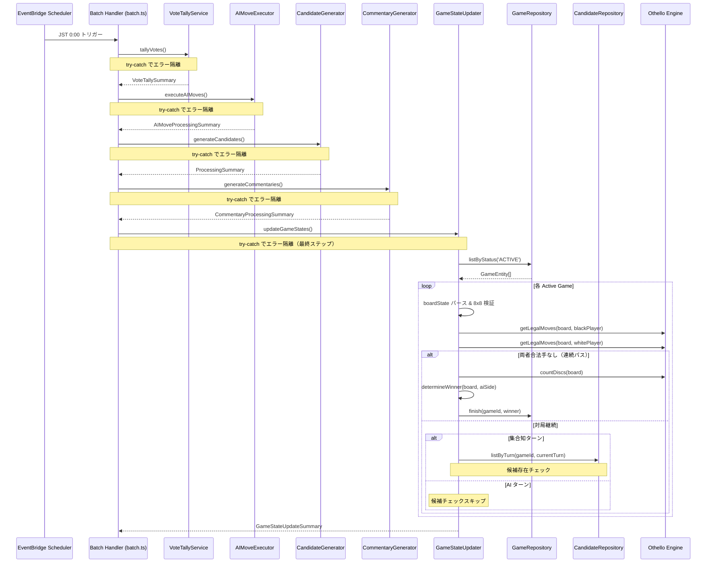
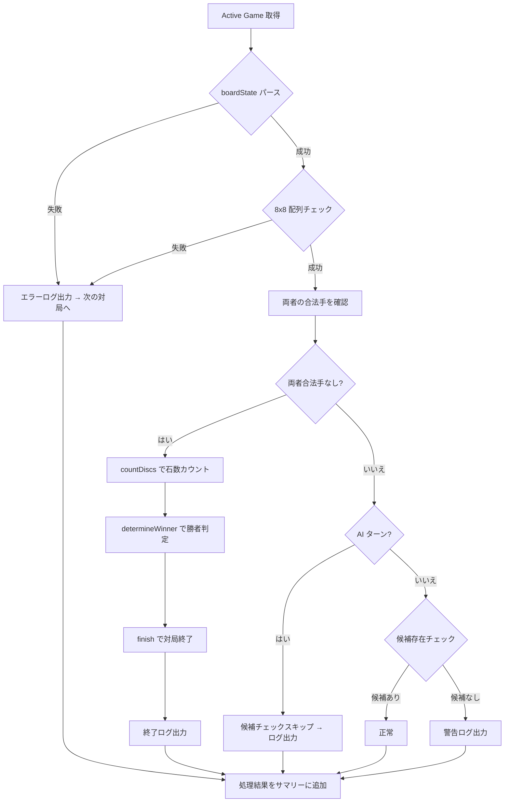

# 設計書: 対局状態更新バッチ

## 概要

本設計は、日次バッチ処理の最終ステップとして GameStateUpdater サービスを追加し、対局状態の整合性検証・連続パス検出・次サイクル準備状態の確認を実装するものである。

現在のバッチパイプラインは VoteTallyService → AIMoveExecutor → CandidateGenerator → CommentaryGenerator の4ステップで構成されている。各サービスはエラー隔離パターン（try-catch）で独立して実行されるが、以下の課題がある:

1. 連続パス（両者合法手なし）による対局終了が検出されない
2. バッチ処理中に一部サービスが失敗した場合、対局が不整合な状態のまま翌日の投票サイクルに入る可能性がある
3. 次の投票サイクルへの準備状態を一元的に検証する仕組みがない

GameStateUpdater は CommentaryGenerator の後に実行され、全アクティブ対局に対して以下を行う:

- 盤面状態の整合性検証（JSON パース、8x8 配列チェック）
- 連続パス検出と対局終了処理（`getLegalMoves` で両者の合法手を確認、なければ `finish` で終了）
- 次の投票サイクル準備状態の検証（候補の存在確認）
- AI ターンの対局は候補チェックをスキップ

### 設計判断

- **既存パターンの踏襲**: CandidateGenerator や CommentaryGenerator と同じパターン（リポジトリ DI、対局単位のエラー隔離、構造化ログ）に従う
- **共通ユーティリティの活用**: `game-utils.ts` の `isAITurn`、`determineWinner` を使用。新規ユーティリティは作成しない
- **Othello Engine の直接利用**: `getLegalMoves`、`countDiscs`、`CellState` を直接インポート
- **batch.ts への統合**: 他サービスと同じエラー隔離パターン（try-catch）で最終ステップとして追加

## アーキテクチャ



### GameStateUpdater 処理フロー



## コンポーネントとインターフェース

### 1. GameStateUpdater サービス（新規作成）

ファイル: `packages/api/src/services/game-state-updater/index.ts`

```typescript
import type { GameRepository } from '../../lib/dynamodb/repositories/game.js';
import type { CandidateRepository } from '../../lib/dynamodb/repositories/candidate.js';
import type { GameEntity } from '../../lib/dynamodb/types.js';
import { getLegalMoves, CellState } from '../../lib/othello/index.js';
import type { Board } from '../../lib/othello/index.js';
import { isAITurn, determineWinner } from '../../lib/game-utils.js';

export interface GameStateUpdateResult {
  gameId: string;
  status: 'ok' | 'finished' | 'warning' | 'error';
  reason?: string;
  winner?: 'AI' | 'COLLECTIVE' | 'DRAW';
  blackCount?: number;
  whiteCount?: number;
  hasCandidates?: boolean;
}

export interface GameStateUpdateSummary {
  totalGames: number;
  okCount: number;
  finishedCount: number;
  warningCount: number;
  errorCount: number;
  results: GameStateUpdateResult[];
}

export class GameStateUpdater {
  constructor(
    private gameRepository: GameRepository,
    private candidateRepository: CandidateRepository
  ) {}

  async updateGameStates(): Promise<GameStateUpdateSummary> { ... }
  private async processGame(game: GameEntity): Promise<GameStateUpdateResult> { ... }
  private validateBoardState(boardState: string): Board | null { ... }
}
```

コンストラクタは `GameRepository` と `CandidateRepository` を DI で受け取る。BedrockService は不要（AI 呼び出しなし）。

### 2. batch.ts への統合

既存ファイル: `packages/api/src/batch.ts`

```typescript
// 追加: GameStateUpdater のインポートと初期化
import { GameStateUpdater } from './services/game-state-updater/index.js';

const gameStateUpdater = new GameStateUpdater(
  new GameRepository(),
  new CandidateRepository(docClient, TABLE_NAME)
);

// handler 内の CommentaryGenerator の後に追加:
try {
  const gameStateSummary = await gameStateUpdater.updateGameStates();
  console.log(
    JSON.stringify({
      type: 'BATCH_GAME_STATE_UPDATE_COMPLETED',
      ...gameStateSummary,
    })
  );
} catch (gameStateError) {
  console.error(
    JSON.stringify({
      type: 'BATCH_GAME_STATE_UPDATE_FAILED',
      error: gameStateError instanceof Error ? gameStateError.message : 'Unknown error',
    })
  );
}
```

### 3. processGame の処理フロー

```typescript
private async processGame(game: GameEntity): Promise<GameStateUpdateResult> {
  try {
    // 1. 盤面パース & 検証
    const board = this.validateBoardState(game.boardState);
    if (!board) {
      return { gameId: game.gameId, status: 'error', reason: 'Invalid board state' };
    }

    // 2. 連続パス検出
    const blackMoves = getLegalMoves(board, CellState.Black);
    const whiteMoves = getLegalMoves(board, CellState.White);

    if (blackMoves.length === 0 && whiteMoves.length === 0) {
      const winner = determineWinner(board, game.aiSide as 'BLACK' | 'WHITE');
      const blackCount = countDiscs(board, CellState.Black);
      const whiteCount = countDiscs(board, CellState.White);
      await this.gameRepository.finish(game.gameId, winner);
      return {
        gameId: game.gameId, status: 'finished',
        winner, blackCount, whiteCount,
      };
    }

    // 3. 候補存在チェック（AI ターンはスキップ）
    if (isAITurn(game)) {
      return { gameId: game.gameId, status: 'ok', reason: 'AI turn - candidate check skipped' };
    }

    const candidates = await this.candidateRepository.listByTurn(game.gameId, game.currentTurn);
    if (candidates.length === 0) {
      return {
        gameId: game.gameId, status: 'warning',
        reason: 'No candidates for current turn', hasCandidates: false,
      };
    }

    return { gameId: game.gameId, status: 'ok', hasCandidates: true };
  } catch (error) {
    return {
      gameId: game.gameId, status: 'error',
      reason: error instanceof Error ? error.message : 'Unknown error',
    };
  }
}
```

### 4. validateBoardState メソッド

```typescript
private validateBoardState(boardState: string): Board | null {
  try {
    const parsed = JSON.parse(boardState);
    if (!parsed.board || !Array.isArray(parsed.board) || parsed.board.length !== 8) {
      return null;
    }
    for (const row of parsed.board) {
      if (!Array.isArray(row) || row.length !== 8) {
        return null;
      }
    }
    return parsed.board as Board;
  } catch {
    return null;
  }
}
```

## データモデル

### GameEntity（既存 - 変更なし）

| フィールド  | 型     | 説明                                           |
| ----------- | ------ | ---------------------------------------------- |
| PK          | string | `GAME#{gameId}`                                |
| SK          | string | `GAME#{gameId}`                                |
| entityType  | string | `'GAME'`                                       |
| gameId      | string | ゲームID                                       |
| gameType    | string | `'OTHELLO'`                                    |
| status      | string | `'ACTIVE'` \| `'FINISHED'`                     |
| aiSide      | string | `'BLACK'` \| `'WHITE'`                         |
| currentTurn | number | 現在のターン番号                               |
| boardState  | string | JSON 文字列 `{ board: number[][] }`            |
| winner      | string | `'AI'` \| `'COLLECTIVE'` \| `'DRAW'`（終了時） |

### GameStateUpdateResult（新規）

| フィールド    | 型       | 説明                                               |
| ------------- | -------- | -------------------------------------------------- |
| gameId        | string   | ゲームID                                           |
| status        | string   | `'ok'` \| `'finished'` \| `'warning'` \| `'error'` |
| reason        | string?  | ステータスの理由                                   |
| winner        | string?  | 勝者（finished 時のみ）                            |
| blackCount    | number?  | 黒石数（finished 時のみ）                          |
| whiteCount    | number?  | 白石数（finished 時のみ）                          |
| hasCandidates | boolean? | 候補が存在するか                                   |

### GameStateUpdateSummary（新規）

| フィールド    | 型                      | 説明         |
| ------------- | ----------------------- | ------------ |
| totalGames    | number                  | 処理対局数   |
| okCount       | number                  | 正常数       |
| finishedCount | number                  | 終了数       |
| warningCount  | number                  | 警告数       |
| errorCount    | number                  | エラー数     |
| results       | GameStateUpdateResult[] | 各対局の結果 |

## 正当性プロパティ

_プロパティとは、システムのすべての有効な実行において成り立つべき特性や振る舞いのことである。人間が読める仕様と機械的に検証可能な正当性保証の橋渡しとなる。_

### Property 1: 連続パス検出と対局終了

_For any_ アクティブな対局において、盤面上で黒・白の両方に合法手が存在しない場合、GameStateUpdater は `determineWinner` で勝者を判定し、`finish` で対局ステータスを `FINISHED` に更新する。判定結果は石数の多い側が勝者（同数なら `DRAW`）となる。

**Validates: Requirements 1.1, 1.2, 1.3**

### Property 2: 候補存在チェックとサマリー反映

_For any_ アクティブな対局セットにおいて、集合知ターンの対局に対する候補存在チェックの結果（候補あり/なし）は、処理サマリーの warningCount（候補なし）と okCount（候補あり）に正しく反映される。

**Validates: Requirements 2.1, 2.3**

### Property 3: 盤面状態の検証

_For any_ 文字列 boardState に対して、`validateBoardState` は有効な JSON かつ 8x8 の数値配列を含む場合のみ Board を返し、それ以外は null を返す。無効な盤面の対局は処理サマリーの errorCount に反映される。

**Validates: Requirements 3.1, 3.3**

### Property 4: 処理サマリーのカウント整合性

_For any_ GameStateUpdateResult の配列において、サマリーの totalGames は配列の長さと等しく、okCount + finishedCount + warningCount + errorCount は totalGames と等しい。

**Validates: Requirements 4.1, 6.3**

### Property 5: バッチ処理の実行順序

_For any_ バッチ実行において、サービスは VoteTallyService → AIMoveExecutor → CandidateGenerator → CommentaryGenerator → GameStateUpdater の順序で実行される。

**Validates: Requirements 5.1, 5.4**

### Property 6: 対局単位のエラー隔離

_For any_ 複数の対局を処理する際に、特定の対局でエラーが発生しても、GameStateUpdater は残りの対局の処理を継続し、全対局の処理完了後にサマリーを返却する。

**Validates: Requirements 6.1**

### Property 7: AI ターン時の候補チェックスキップと検証実行

_For any_ アクティブな対局において、currentTurn が AI 側の手番である場合、候補存在チェックはスキップされるが、盤面整合性検証と連続パス検出は実行される。

**Validates: Requirements 7.1, 7.3**

## エラーハンドリング

### バッチハンドラーレベル（batch.ts）

| エラー状況                         | 対応                                                           |
| ---------------------------------- | -------------------------------------------------------------- |
| VoteTallyService が例外をスロー    | エラーログ出力、後続サービス（AIMoveExecutor 以降）を継続      |
| AIMoveExecutor が例外をスロー      | エラーログ出力、後続サービス（CandidateGenerator 以降）を継続  |
| CandidateGenerator が例外をスロー  | エラーログ出力、後続サービス（CommentaryGenerator 以降）を継続 |
| CommentaryGenerator が例外をスロー | エラーログ出力、後続サービス（GameStateUpdater）を継続         |
| GameStateUpdater が例外をスロー    | エラーログ出力（最終ステップのため後続処理なし）               |

### GameStateUpdater レベル（対局単位）

| エラー状況                       | 対応                                                |
| -------------------------------- | --------------------------------------------------- |
| boardState の JSON パース失敗    | status: `'error'`、エラーログ出力、次の対局を処理   |
| boardState が 8x8 でない         | status: `'error'`、エラーログ出力、次の対局を処理   |
| 両者合法手なし（連続パス）       | status: `'finished'`、finish 呼び出し、終了ログ出力 |
| finish 処理の失敗                | status: `'error'`、エラーログ出力、次の対局を処理   |
| AI ターンの対局                  | status: `'ok'`、候補チェックスキップ、ログ出力      |
| 候補が 0 件                      | status: `'warning'`、警告ログ出力                   |
| candidateRepository 呼び出し失敗 | status: `'error'`、エラーログ出力、次の対局を処理   |

### 構造化ログ一覧

| type                                | レベル | 説明                            |
| ----------------------------------- | ------ | ------------------------------- |
| `GAME_STATE_UPDATE_START`           | info   | 処理開始                        |
| `GAME_STATE_UPDATE_GAME_START`      | info   | 対局処理開始                    |
| `GAME_STATE_INVALID_BOARD_ERROR`    | error  | 盤面パース/検証失敗             |
| `GAME_STATE_CONSECUTIVE_PASS`       | info   | 連続パス検出・対局終了          |
| `GAME_STATE_FINISH_FAILED`          | error  | finish 処理失敗                 |
| `GAME_STATE_AI_TURN_SKIP`           | info   | AI ターンで候補チェックスキップ |
| `GAME_STATE_NO_CANDIDATES_WARNING`  | warn   | 候補なし警告                    |
| `GAME_STATE_UPDATE_GAME_COMPLETE`   | info   | 対局処理完了                    |
| `GAME_STATE_UPDATE_COMPLETE`        | info   | 全体処理完了                    |
| `BATCH_GAME_STATE_UPDATE_COMPLETED` | info   | batch.ts からのサマリーログ     |
| `BATCH_GAME_STATE_UPDATE_FAILED`    | error  | batch.ts からのエラーログ       |

## テスト戦略

### テストフレームワーク

- ユニットテスト / プロパティベーステスト: Vitest
- プロパティベーステスト: fast-check
- 各プロパティテストは `numRuns: 10`、`endOnFailure: true` で設定（JSDOM 環境の安定性のため）
- `fc.asyncProperty` は使用しない（`fc.property` のみ使用）

### ユニットテスト

1. **GameStateUpdater ユニットテスト** (`packages/api/src/services/game-state-updater/index.test.ts`)
   - 正常な盤面で対局継続の場合の処理
   - 連続パス検出時の finish 呼び出しと勝者判定
   - 無効な boardState（JSON パース失敗、非 8x8 配列）のエラー処理
   - AI ターンの対局で候補チェックがスキップされること
   - 候補なし時の警告ログ出力
   - finish 失敗時のエラー処理
   - 複数対局処理時のエラー隔離
   - 構造化ログの出力検証

2. **batch.ts 統合テスト** (`packages/api/src/batch.test.ts` の拡張)
   - GameStateUpdater が CommentaryGenerator の後に実行されること
   - GameStateUpdater の失敗時にエラーログが出力されること
   - 5つのサービスの実行順序の検証

### プロパティベーステスト

各正当性プロパティに対して1つのプロパティベーステストを実装する。

- **Property 1**: `fc.property` で任意の 8x8 盤面（両者合法手なし）と aiSide を生成し、`determineWinner` の結果と `finish` の呼び出し引数が石数に基づく勝者と一致することを検証
  - Tag: `Feature: 34-game-state-update-batch, Property 1: 連続パス検出と対局終了`

- **Property 2**: `fc.property` で任意のアクティブ対局セット（候補あり/なし混在）を生成し、サマリーの warningCount が候補なし対局数と一致することを検証
  - Tag: `Feature: 34-game-state-update-batch, Property 2: 候補存在チェックとサマリー反映`

- **Property 3**: `fc.property` で任意の文字列を生成し、`validateBoardState` が有効な JSON かつ 8x8 配列の場合のみ Board を返すことを検証
  - Tag: `Feature: 34-game-state-update-batch, Property 3: 盤面状態の検証`

- **Property 4**: `fc.property` で任意の GameStateUpdateResult 配列を生成し、サマリーの totalGames = 配列長、okCount + finishedCount + warningCount + errorCount = totalGames を検証
  - Tag: `Feature: 34-game-state-update-batch, Property 4: 処理サマリーのカウント整合性`

- **Property 5**: `fc.property` で5つのサービスの成功/失敗パターン（2^5 = 32通り）を生成し、呼び出し順序が VoteTallyService → AIMoveExecutor → CandidateGenerator → CommentaryGenerator → GameStateUpdater であることを検証
  - Tag: `Feature: 34-game-state-update-batch, Property 5: バッチ処理の実行順序`

- **Property 6**: `fc.property` で複数対局と失敗パターンを生成し、失敗した対局以外が正常に処理され、サマリーが返却されることを検証
  - Tag: `Feature: 34-game-state-update-batch, Property 6: 対局単位のエラー隔離`

- **Property 7**: `fc.property` で任意の currentTurn と aiSide の組み合わせを生成し、AI ターンの場合に候補チェックがスキップされ、盤面検証と連続パス検出は実行されることを検証
  - Tag: `Feature: 34-game-state-update-batch, Property 7: AI ターン時の候補チェックスキップと検証実行`
