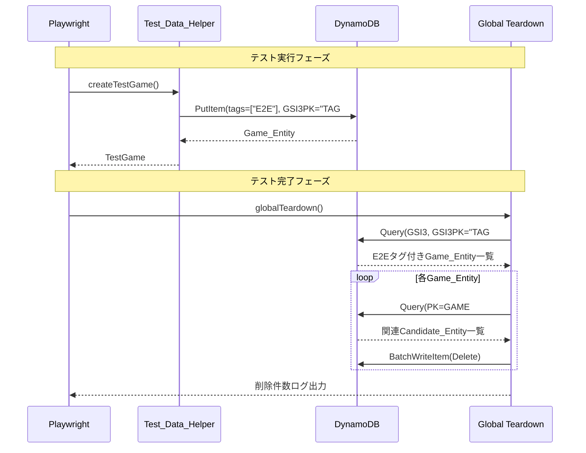

# 設計書: E2Eテストデータクリーンアップ

## 概要

E2Eテスト（Playwright）で作成された対局データがDynamoDBに残留し、対局一覧画面にテストデータが表示される問題を解決する。

本設計では以下の3つの柱で対応する:

1. **タグベースのデータ識別**: Game_Entityに`tags`属性を追加し、E2Eテストデータに「E2E」タグを付与
2. **GSI3によるタグ検索**: `GSI3PK = TAG#E2E` でE2Eテストデータを効率的に検索
3. **自動クリーンアップ**: Playwrightの`globalTeardown`でテスト終了時にE2Eタグ付きデータを一括削除

### 設計判断

- **GSI3を新設する理由**: 既存のGSI1（ステータス別一覧）やGSI2（ユーザー投票履歴）はタグ検索に適さない。タグ専用のGSI3を追加することで、E2Eデータの検索を効率化し、テーブルスキャンを回避する
- **`tags`を文字列配列にする理由**: 将来的に「E2E」以外のタグ（例: `LOAD_TEST`, `DEMO`）にも対応可能にするため
- **対局一覧APIでのフィルタリング**: GSI1クエリ結果からE2Eタグ付きデータを除外する。DynamoDBのFilterExpressionを使用し、`limit`パラメータで指定された件数を確保するためにページネーションを考慮する
- **globalTeardownを使用する理由**: 個別テストのafterEachではなく、全テスト完了後に一括削除することで、テスト間のデータ依存を気にせず効率的にクリーンアップできる

## アーキテクチャ

### システム構成図

```mermaid
graph TB
    subgraph "E2Eテスト (Playwright)"
        PW[Playwright テストランナー]
        TDH[Test_Data_Helper]
        TGF[Test_Game_Fixture]
        GT[Global Teardown]
    end

    subgraph "API (Hono on Lambda)"
        GR[POST /api/games]
        GL[GET /api/games]
        GS[Game Schema]
    end

    subgraph "DynamoDB"
        TBL[(VoteBoardGame テーブル)]
        GSI1[GSI1: ステータス別一覧]
        GSI3[GSI3: タグ検索]
    end

    subgraph "CDK"
        CDK[VoteBoardGameStack]
    end

    PW --> TGF
    TGF --> TDH
    TDH -->|tags: E2E| TBL
    PW -->|テスト完了| GT
    GT -->|GSI3 Query: TAG#E2E| GSI3
    GT -->|BatchDelete| TBL

    GR -->|tags対応| TBL
    GL -->|E2Eフィルタ| GSI1
    GL -.->|FilterExpression| TBL

    CDK -->|GSI3追加| TBL
```

### データフロー



## コンポーネントとインターフェース

### 1. DynamoDB型定義の拡張 (`packages/api/src/lib/dynamodb/types.ts`)

GameEntityインターフェースに`tags`と`GSI3PK`属性を追加する。

```typescript
export interface GameEntity extends BaseEntity {
  // ... 既存属性
  tags?: string[]; // タグ配列（デフォルト: []）
  GSI3PK?: string; // TAG#<tagName>（E2Eタグ付きの場合のみ）
}
```

GSIKeysヘルパーにGSI3用の関数を追加する。

```typescript
export const GSIKeys = {
  // ... 既存
  gamesByTag: (tag: string) => ({
    GSI3PK: `TAG#${tag}`,
  }),
} as const;
```

### 2. GameRepository拡張 (`packages/api/src/lib/dynamodb/repositories/game.ts`)

`create`メソッドに`tags`パラメータを追加する。

```typescript
async create(params: {
  gameId: string;
  gameType: 'OTHELLO' | 'CHESS' | 'GO' | 'SHOGI';
  aiSide: 'BLACK' | 'WHITE';
  boardState?: string;
  tags?: string[];  // 新規追加
}): Promise<GameEntity>
```

E2Eタグ付きゲームを検索するメソッドを追加する。

```typescript
async listByTag(tag: string): Promise<GameEntity[]>
```

### 3. ゲーム作成スキーマ拡張 (`packages/api/src/schemas/game.ts`)

```typescript
export const createGameSchema = z.object({
  gameType: z.literal('OTHELLO'),
  aiSide: z.enum(['BLACK', 'WHITE']),
  tags: z.array(z.string()).optional().default([]), // 新規追加
});
```

### 4. GameService拡張 (`packages/api/src/services/game.ts`)

`createGame`メソッドに`tags`パラメータを追加する。
`listGames`メソッドでE2Eタグ付きゲームをフィルタリングする。

### 5. ゲームルート拡張 (`packages/api/src/routes/games.ts`)

POST /api/games で`tags`フィールドを受け取り、GameServiceに渡す。
GET /api/games のレスポンスに`tags`属性を含める。

### 6. Test_Data_Helper拡張 (`packages/web/e2e/helpers/test-data.ts`)

`createTestGame`でGame_Entityに`tags: ["E2E"]`と`GSI3PK: "TAG#E2E"`を設定する。

### 7. Global Teardown (`packages/web/e2e/global-teardown.ts`) - 新規作成

Playwrightの全テスト完了後に実行されるクリーンアップ処理。

```typescript
export default async function globalTeardown(): Promise<void> {
  // 1. GSI3でTAG#E2Eのゲームを検索
  // 2. 各ゲームの関連データ（Candidate_Entity）を検索・削除
  // 3. ゲーム本体を削除
  // 4. 削除件数をログ出力
}
```

### 8. Playwright設定拡張 (`packages/web/playwright.config.ts`)

`globalTeardown`設定を追加する。

### 9. CDKスタック拡張 (`packages/infra/lib/vote-board-game-stack.ts`)

DynamoDBテーブルにGSI3を追加する。

```typescript
table.addGlobalSecondaryIndex({
  indexName: 'GSI3',
  partitionKey: {
    name: 'GSI3PK',
    type: dynamodb.AttributeType.STRING,
  },
});
```

### 10. GitHub Actionsワークフロー

`cd-development.yml`と`e2e-game.yml`では、Playwrightの`globalTeardown`設定により自動的にクリーンアップが実行される。テスト失敗時もteardownは実行されるため、ワークフロー側での追加ステップは不要。

## データモデル

### Game_Entity（拡張後）

| 属性        | 型     | 説明                                        | 変更 |
| :---------- | :----- | :------------------------------------------ | :--- |
| PK          | String | `GAME#<gameId>`                             | 既存 |
| SK          | String | `GAME#<gameId>`                             | 既存 |
| GSI1PK      | String | `GAME#STATUS#<status>`                      | 既存 |
| GSI1SK      | String | `<createdAt>`                               | 既存 |
| GSI3PK      | String | `TAG#E2E`（E2Eタグ付きの場合のみ）          | 新規 |
| tags        | List   | タグ配列（例: `["E2E"]`）、デフォルト: `[]` | 新規 |
| gameId      | String | ゲームID (UUID)                             | 既存 |
| gameType    | String | `OTHELLO`                                   | 既存 |
| status      | String | `ACTIVE` / `FINISHED`                       | 既存 |
| aiSide      | String | `BLACK` / `WHITE`                           | 既存 |
| currentTurn | Number | 現在のターン数                              | 既存 |
| boardState  | String | 盤面状態 (JSON文字列)                       | 既存 |
| winner      | String | 勝者                                        | 既存 |
| entityType  | String | `GAME`                                      | 既存 |
| createdAt   | String | 作成日時 (ISO 8601)                         | 既存 |
| updatedAt   | String | 更新日時 (ISO 8601)                         | 既存 |

### GSI3: タグ検索用

| 属性   | 型     | 説明            |
| :----- | :----- | :-------------- |
| GSI3PK | String | `TAG#<tagName>` |

GSI3はパーティションキーのみ（ソートキーなし）。E2Eタグ付きゲームの検索に使用する。

### アクセスパターン（新規）

```text
# E2Eタグ付きゲーム一覧取得
Query (GSI3):
  GSI3PK = TAG#E2E
```

### データ例

通常のゲーム:

```json
{
  "PK": "GAME#abc-123",
  "SK": "GAME#abc-123",
  "GSI1PK": "GAME#STATUS#ACTIVE",
  "GSI1SK": "2025-01-01T00:00:00Z",
  "tags": [],
  "gameId": "abc-123",
  "gameType": "OTHELLO",
  "status": "ACTIVE",
  "entityType": "GAME"
}
```

E2Eテストゲーム:

```json
{
  "PK": "GAME#e2e-456",
  "SK": "GAME#e2e-456",
  "GSI1PK": "GAME#STATUS#ACTIVE",
  "GSI1SK": "2025-01-01T00:00:00Z",
  "GSI3PK": "TAG#E2E",
  "tags": ["E2E"],
  "gameId": "e2e-456",
  "gameType": "OTHELLO",
  "status": "ACTIVE",
  "entityType": "GAME"
}
```

## 正確性プロパティ

_プロパティとは、システムのすべての有効な実行において成り立つべき特性や振る舞いのことである。人間が読める仕様と機械的に検証可能な正確性保証の橋渡しとなる形式的な記述である。_

### Property 1: タグのラウンドトリップ

*任意の*文字列配列`tags`に対して、その`tags`を指定してGame_Entityを作成し、取得した結果の`tags`属性は元の配列と一致する

**Validates: Requirements 1.1, 1.3, 2.1**

### Property 2: E2EタグとGSI3PKの連動

*任意の*文字列配列`tags`に対して、`tags`に「E2E」が含まれる場合にのみ、作成されたGame_Entityの`GSI3PK`が`TAG#E2E`に設定される。「E2E」が含まれない場合、`GSI3PK`は設定されない

**Validates: Requirements 1.5**

### Property 3: tagsフィールドのバリデーション

*任意の*文字列配列でない値（数値、オブジェクト、ネストされた配列など）を`tags`フィールドとしてPOST /api/gamesに送信した場合、APIはバリデーションエラー（400）を返す

**Validates: Requirements 2.3**

### Property 4: レスポンスにtags属性を含む

*任意の*タグ配列を持つGame_Entityが存在する場合、GET /api/gamesのレスポンスに含まれる各ゲームオブジェクトは`tags`属性を持つ

**Validates: Requirements 2.4**

### Property 5: E2Eタグ付きゲームの除外とlimit遵守

*任意の*ゲーム集合（E2Eタグ付きとタグなしの混在）と*任意の*limit値に対して、GET /api/gamesのレスポンスにはE2Eタグ付きゲームが含まれず、かつ返却件数はlimit以下である

**Validates: Requirements 5.1, 5.2**

### Property 6: クリーンアップによる完全削除

*任意の*数のE2Eタグ付きGame_Entityとその関連Candidate_Entityに対して、E2E_Cleanupを実行した後、GSI3で`TAG#E2E`を検索した結果は空である

**Validates: Requirements 4.2**

## エラーハンドリング

### API層

| エラーケース               | HTTPステータス | エラーコード     | 対応                          |
| :------------------------- | :------------- | :--------------- | :---------------------------- |
| `tags`が文字列配列でない   | 400            | VALIDATION_ERROR | Zodバリデーションで拒否       |
| `tags`の要素が文字列でない | 400            | VALIDATION_ERROR | Zodバリデーションで拒否       |
| DynamoDB書き込みエラー     | 500            | INTERNAL_ERROR   | エラーログ出力、500レスポンス |

### クリーンアップ層

| エラーケース                    | 対応                                                 |
| :------------------------------ | :--------------------------------------------------- |
| GSI3クエリ失敗                  | エラーログ出力、処理終了（テスト結果には影響しない） |
| 個別ゲーム削除失敗              | エラーログ出力、残りのゲームの削除を継続             |
| 関連データ（Candidate）削除失敗 | エラーログ出力、ゲーム本体の削除を試行               |
| DYNAMODB_TABLE_NAME未設定       | 警告ログ出力、クリーンアップをスキップ               |
| AWS認証情報期限切れ             | `withCredentialRefresh`で1回リトライ                 |

### 設計方針

- クリーンアップのエラーはテスト結果に影響させない（テストの成否とクリーンアップは独立）
- 部分的な削除失敗が発生しても、可能な限り多くのデータを削除する
- すべてのエラーはログに記録し、デバッグ可能にする

## テスト戦略

### ユニットテスト

| テスト対象               | テスト内容                                               |
| :----------------------- | :------------------------------------------------------- |
| GameRepository.create    | tags指定時の保存、tags未指定時のデフォルト値、GSI3PK設定 |
| GameRepository.listByTag | GSI3クエリの正確性                                       |
| GameService.createGame   | tags引数のリポジトリへの受け渡し                         |
| GameService.listGames    | E2Eタグ付きゲームのフィルタリング                        |
| createGameSchema         | tagsフィールドのバリデーション（正常系・異常系）         |
| global-teardown          | クリーンアップロジック（モック使用）                     |

### プロパティベーステスト

プロパティベーステストには `fast-check` ライブラリを使用する。

各テストは最低100イテレーション実行する（ただし実装ガイドに従い、JSDOM環境では10〜20に制限）。

各テストにはコメントで設計書のプロパティを参照する。

タグ形式: **Feature: 36-e2e-test-data-cleanup, Property {number}: {property_text}**

| プロパティ | テストファイル                       | 概要                                             |
| :--------- | :----------------------------------- | :----------------------------------------------- |
| Property 1 | `game.property.test.ts` (repository) | 任意のタグ配列でcreate→getByIdのラウンドトリップ |
| Property 2 | `game.property.test.ts` (repository) | E2Eタグ有無によるGSI3PK設定の検証                |
| Property 3 | `game.property.test.ts` (schema)     | 不正なtags入力のバリデーション拒否               |
| Property 4 | `game.property.test.ts` (service)    | レスポンスのtags属性存在検証                     |
| Property 5 | `games.property.test.ts` (route)     | E2Eフィルタリングとlimit遵守                     |
| Property 6 | `global-teardown.test.ts`            | クリーンアップ後のGSI3検索結果が空               |

### 統合テスト

| テスト対象      | テスト内容                                   |
| :-------------- | :------------------------------------------- |
| POST /api/games | tags付きゲーム作成のE2Eフロー                |
| GET /api/games  | E2Eタグ付きゲームが除外されることの検証      |
| global-teardown | DynamoDBモックを使用したクリーンアップフロー |

### CDKテスト

| テスト対象         | テスト内容                                       |
| :----------------- | :----------------------------------------------- |
| VoteBoardGameStack | GSI3がDynamoDBテーブルに追加されていることの検証 |
