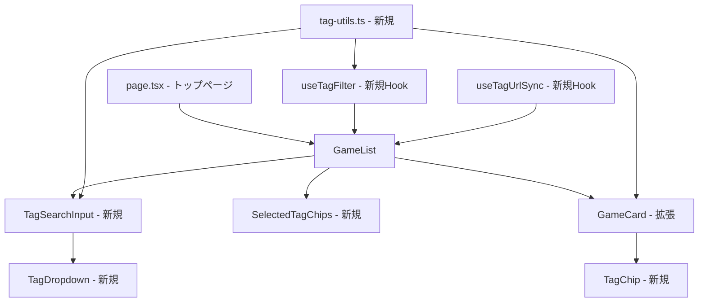
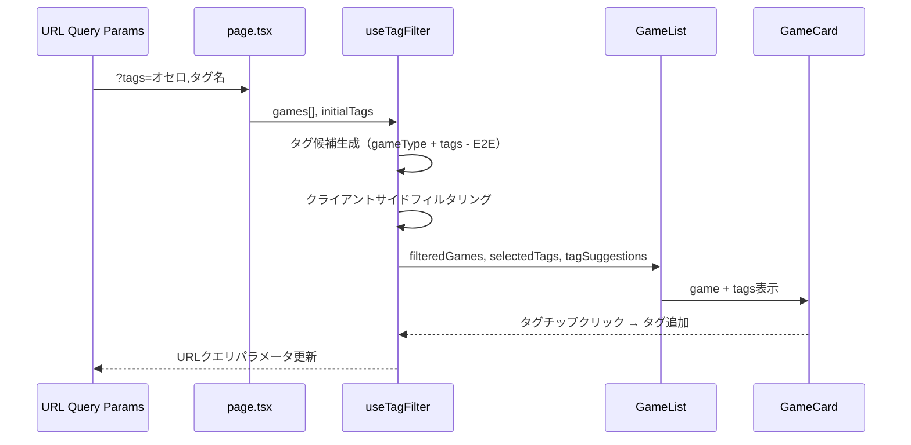

# 設計書: 対局一覧タグ検索

## 概要

対局一覧画面（トップページ）にタグベースの検索・フィルタリング機能を追加する。
ゲーム種類（`gameType`）をUI上で仮想タグとして表示し、カスタムタグ（`tags` フィールド）と統一的に扱うことで、直感的なフィルタリング体験を提供する。

フィルタリングはクライアントサイドで実行し、API変更は不要。
URLクエリパラメータとの同期により、検索状態のブックマーク・シェアを可能にする。

### 設計判断

- **クライアントサイドフィルタリング**: 対局数が限定的（ページネーション済み）であり、API変更なしで実装可能
- **仮想タグ方式**: `gameType` のデータ構造を変更せず、UI層でタグとして変換。将来のゲーム種類追加にも対応
- **AND条件フィルタリング**: 複数タグ選択時はAND条件。ユーザーが意図した絞り込みに最も適合
- **E2Eタグ除外**: テスト用タグをUI上で非表示にし、ユーザー体験を損なわない

## アーキテクチャ

### コンポーネント構成



### データフロー



## コンポーネントとインターフェース

### 新規コンポーネント

#### TagSearchInput

検索窓コンポーネント。shadcn/ui の Input ベース、Lucide React の Search アイコン付き。

```typescript
interface TagSearchInputProps {
  /** タグ候補リスト */
  suggestions: TagSuggestion[];
  /** 選択済みタグ */
  selectedTags: string[];
  /** タグ選択時のコールバック */
  onTagSelect: (tag: string) => void;
  /** プレースホルダーテキスト */
  placeholder?: string;
}

interface TagSuggestion {
  /** タグの表示名 */
  label: string;
  /** タグの内部値（gameType値 or カスタムタグ値） */
  value: string;
  /** タグの種類 */
  type: 'gameType' | 'custom';
}
```

#### TagDropdown

タグ候補のドロップダウンリスト。キーボード操作対応。

```typescript
interface TagDropdownProps {
  /** フィルタリング済みタグ候補 */
  items: TagSuggestion[];
  /** 現在ハイライトされているインデックス */
  highlightedIndex: number;
  /** タグ選択時のコールバック */
  onSelect: (tag: string) => void;
  /** ドロップダウンの表示状態 */
  isOpen: boolean;
}
```

#### SelectedTagChips

選択済みタグのチップ一覧。削除ボタン付き。

```typescript
interface SelectedTagChipsProps {
  /** 選択済みタグリスト */
  tags: SelectedTag[];
  /** タグ削除時のコールバック */
  onRemove: (tag: string) => void;
}

interface SelectedTag {
  label: string;
  value: string;
  type: 'gameType' | 'custom';
}
```

#### TagChip

個別のタグチップコンポーネント。ゲーム種類タグとカスタムタグで視覚的に区別。

```typescript
interface TagChipProps {
  /** タグの表示名 */
  label: string;
  /** タグの種類（スタイル切り替え用） */
  type: 'gameType' | 'custom';
  /** クリック時のコールバック（対局カード内で使用） */
  onClick?: () => void;
  /** 削除ボタン表示（選択済みタグで使用） */
  onRemove?: () => void;
}
```

### 新規カスタムフック

#### useTagFilter

タグフィルタリングのコアロジック。

```typescript
interface UseTagFilterOptions {
  /** 全対局データ */
  games: GameSummary[];
  /** 初期選択タグ（URLから復元） */
  initialTags?: string[];
}

interface UseTagFilterReturn {
  /** フィルタリング済み対局リスト */
  filteredGames: GameSummary[];
  /** 選択済みタグ */
  selectedTags: SelectedTag[];
  /** タグ候補リスト */
  suggestions: TagSuggestion[];
  /** タグ追加 */
  addTag: (tagValue: string) => void;
  /** タグ削除 */
  removeTag: (tagValue: string) => void;
  /** 全タグクリア */
  clearTags: () => void;
  /** フィルタリング結果件数 */
  resultCount: number;
}
```

#### useTagUrlSync

URLクエリパラメータとタグ状態の同期。

```typescript
interface UseTagUrlSyncOptions {
  /** 選択済みタグ */
  selectedTags: string[];
  /** タグ変更時のコールバック */
  onTagsChange: (tags: string[]) => void;
}
```

### 新規ユーティリティ（tag-utils.ts）

```typescript
/** gameType値から表示名へのマッピング */
const GAME_TYPE_LABEL_MAP: Record<string, string> = {
  OTHELLO: 'オセロ',
  CHESS: 'チェス',
  GO: '囲碁',
  SHOGI: '将棋',
};

/** 対局データからタグ候補リストを生成（E2E除外、重複排除） */
function buildTagSuggestions(games: GameSummary[]): TagSuggestion[];

/** 対局がタグ条件に一致するか判定（AND条件） */
function matchesTags(game: GameSummary, selectedTags: SelectedTag[]): boolean;

/** タグ候補を入力テキストで部分一致フィルタリング */
function filterSuggestions(suggestions: TagSuggestion[], query: string): TagSuggestion[];

/** 対局からタグ一覧を取得（gameType仮想タグ + カスタムタグ、E2E除外、最大3個） */
function getGameTags(game: GameSummary): TagInfo[];

/** URLクエリパラメータからタグ配列をパース */
function parseTagsFromUrl(params: URLSearchParams): string[];

/** タグ配列をURLクエリパラメータに変換 */
function tagsToUrlParam(tags: string[]): string;
```

### 既存コンポーネントの拡張

#### GameSummary 型の拡張

`packages/web/src/types/game.ts` の `GameSummary` に `tags` フィールドを追加:

```typescript
export interface GameSummary {
  // ... 既存フィールド
  /** タグ配列 */
  tags: string[];
}
```

> 注: API側の `GameSummary` は既に `tags: string[]` を返却している。フロントエンド型定義の同期のみ必要。

#### GameCard の拡張

対局カード内にタグチップを表示。タグチップクリックでフィルタ追加。

```typescript
interface GameCardProps {
  // ... 既存Props
  /** タグチップクリック時のコールバック */
  onTagClick?: (tag: string) => void;
}
```

#### GameList の拡張

検索窓、選択済みタグチップ、フィルタリングロジックを統合。

## データモデル

### 既存データ（変更なし）

DynamoDB の Game エンティティは既に以下のフィールドを持つ:

| フィールド | 型     | 説明                              |
| :--------- | :----- | :-------------------------------- |
| `gameType` | String | ゲーム種類（`OTHELLO`）           |
| `tags`     | List   | カスタムタグ配列（例: `["E2E"]`） |

### API レスポンス（変更なし）

`GET /api/games` のレスポンスは既に `tags` フィールドを含む:

```json
{
  "games": [
    {
      "gameId": "...",
      "gameType": "OTHELLO",
      "status": "ACTIVE",
      "tags": ["test-tag"],
      ...
    }
  ]
}
```

### フロントエンド型定義（変更あり）

`GameSummary` に `tags: string[]` を追加する（API レスポンスとの整合性確保）。

### タグの内部表現

タグは内部的に以下の形式で管理する:

```typescript
// ゲーム種類タグ: "gameType:OTHELLO" の形式で内部管理
// カスタムタグ: "custom:タグ名" の形式で内部管理
// URL表示時: 表示名で管理（例: "オセロ", "タグ名"）

type TagType = 'gameType' | 'custom';

interface TagInfo {
  label: string; // 表示名（例: "オセロ"）
  value: string; // 内部値（例: "OTHELLO" or "タグ名"）
  type: TagType; // タグ種類
}
```

### URL クエリパラメータ

```text
/?tags=オセロ,タグ名&status=ACTIVE
```

- タグはカンマ区切りで表示名を使用
- ステータスタブとの併用が可能
- ブラウザ履歴にエントリを追加（`router.push`）

## 正確性プロパティ

_プロパティとは、システムの全ての有効な実行において成り立つべき特性や振る舞いのことです。人間が読める仕様と機械的に検証可能な正確性保証の橋渡しとなる、形式的な記述です。_

### Property 1: ANDフィルタリングの正確性

*任意の*対局リストと*任意の*選択タグ集合に対して、フィルタリング結果に含まれる全ての対局は、選択された全てのタグを保持していなければならない。また、選択タグが空の場合、フィルタリング結果は元の対局リスト全体と一致しなければならない。

**Validates: Requirements 3.3, 3.5**

### Property 2: タグ候補生成の正確性

*任意の*対局リストに対して、`buildTagSuggestions` が生成するタグ候補リストは以下を全て満たさなければならない:

- 候補に「E2E」タグが含まれないこと
- 候補に重複する値が存在しないこと
- 全ての候補が、入力対局リストの `gameType` または `tags` フィールドに由来すること

**Validates: Requirements 5.1, 5.4, 5.5**

### Property 3: 部分一致フィルタリングの正確性

*任意の*タグ候補リストと*任意の*検索文字列に対して、`filterSuggestions` の結果に含まれる全てのタグの表示名は、検索文字列を部分文字列として含んでいなければならない。

**Validates: Requirements 3.1**

### Property 4: 対局カードタグ表示の正確性

*任意の*対局データに対して、`getGameTags` が返すタグリストは以下を全て満たさなければならない:

- 「E2E」タグが含まれないこと
- ゲーム種類タグ（gameType由来）とカスタムタグの両方が含まれること（存在する場合）
- 返却されるタグの数が最大3個であること

**Validates: Requirements 6.1, 6.2, 6.4**

### Property 5: ゲーム種類ラベルマッピングの完全性

*任意の*既知の `gameType` 値（OTHELLO, CHESS, GO, SHOGI）に対して、対応する日本語表示名が存在し、ゲーム種類タグとカスタムタグは異なるタグ種類（`type` フィールド）を持たなければならない。

**Validates: Requirements 2.3, 2.5**

### Property 6: URLタグパラメータのラウンドトリップ

*任意の*タグ配列に対して、`tagsToUrlParam` でURLパラメータに変換した後、`parseTagsFromUrl` で復元した結果は、元のタグ配列と一致しなければならない。

**Validates: Requirements 8.1, 8.2**

### Property 7: ステータスフィルタとタグフィルタの直交性

*任意の*対局リスト、*任意の*ステータス値、*任意の*選択タグ集合に対して、ステータスフィルタリングとタグフィルタリングの適用順序に関わらず、結果は同一でなければならない。

**Validates: Requirements 4.5**

## エラーハンドリング

| シナリオ                                       | 対応                                                           |
| :--------------------------------------------- | :------------------------------------------------------------- |
| API レスポンスに `tags` フィールドが存在しない | 空配列 `[]` としてフォールバック                               |
| URL の `tags` パラメータに不正な値が含まれる   | 不正な値を無視し、有効なタグのみ復元                           |
| タグ候補が0件（対局データなし）                | 検索窓は表示するが、ドロップダウンに「候補なし」を表示         |
| フィルタリング結果が0件                        | 「該当する対局がありません」メッセージを表示                   |
| 検索文字列が非常に長い                         | 入力文字数に制限なし（クライアントサイドのため性能影響は軽微） |

## テスト戦略

### テストフレームワーク

- **ユニットテスト / プロパティベーステスト**: Vitest + fast-check
- **コンポーネントテスト**: Vitest + React Testing Library

### プロパティベーステスト

プロパティベーステストライブラリとして **fast-check** を使用する。

設定:

- `numRuns`: 10〜20（JSDOM環境での安定性確保、実装ガイドに準拠）
- `endOnFailure: true`
- 各テストにプロパティ番号をコメントで参照

タグ形式:

```text
// Feature: 37-game-list-tag-search, Property {number}: {property_text}
```

各正確性プロパティは1つのプロパティベーステストで実装する:

| プロパティ | テスト対象                            | テストファイル               |
| :--------- | :------------------------------------ | :--------------------------- |
| Property 1 | `matchesTags` / `useTagFilter`        | `tag-utils.property.test.ts` |
| Property 2 | `buildTagSuggestions`                 | `tag-utils.property.test.ts` |
| Property 3 | `filterSuggestions`                   | `tag-utils.property.test.ts` |
| Property 4 | `getGameTags`                         | `tag-utils.property.test.ts` |
| Property 5 | `GAME_TYPE_LABEL_MAP`                 | `tag-utils.property.test.ts` |
| Property 6 | `tagsToUrlParam` / `parseTagsFromUrl` | `tag-utils.property.test.ts` |
| Property 7 | ステータス + タグフィルタの合成       | `tag-utils.property.test.ts` |

### ユニットテスト

ユニットテストは以下に焦点を当てる:

- **具体例テスト**: 各ユーティリティ関数の代表的な入出力
- **エッジケース**: 空配列、E2Eタグのみ、タグ超過時の「+N」表示
- **コンポーネントテスト**: TagSearchInput のキーボード操作、ARIA属性、ドロップダウン開閉
- **統合テスト**: GameList + TagSearchInput の連携動作

### テストファイル構成

```text
packages/web/src/lib/utils/tag-utils.ts
packages/web/src/lib/utils/tag-utils.test.ts
packages/web/src/lib/utils/tag-utils.property.test.ts
packages/web/src/components/tag-search-input.test.tsx
packages/web/src/components/tag-chip.test.tsx
packages/web/src/lib/hooks/use-tag-filter.test.ts
packages/web/src/lib/hooks/use-tag-url-sync.test.ts
```
