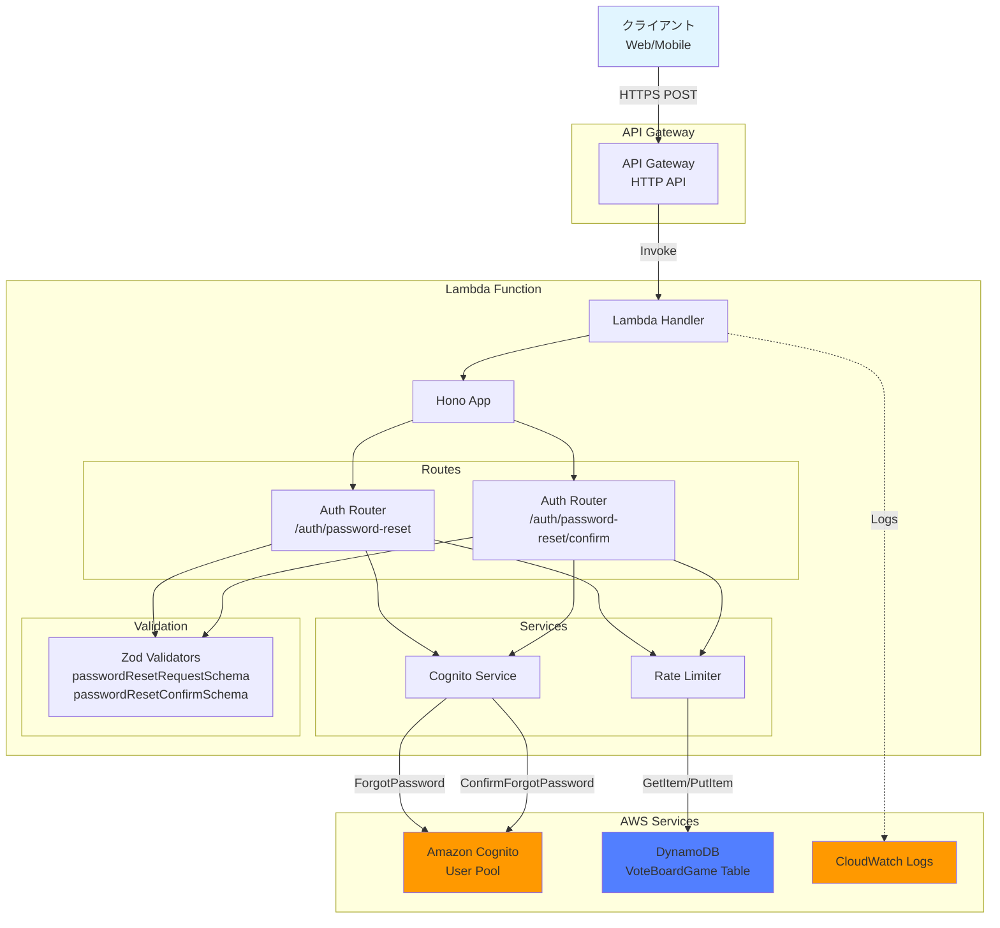
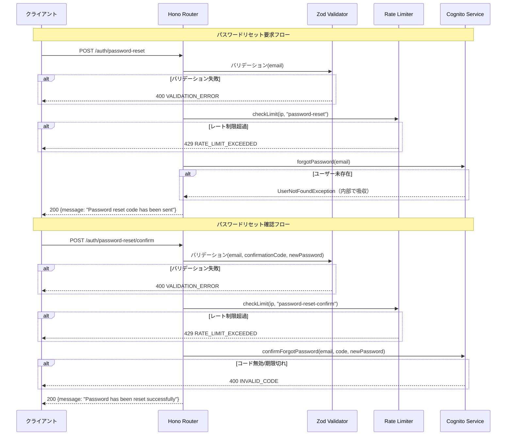

# 設計書: パスワードリセットAPI

## 概要

本ドキュメントは、投票対局アプリケーションのパスワードリセットAPI機能の設計を定義します。この機能は、パスワードを忘れたユーザーがメールアドレスを使用してパスワードリセット用の確認コードを受け取り、確認コードと新しいパスワードでパスワードをリセットできるようにします。

Amazon CognitoのForgotPasswordおよびConfirmForgotPasswordフローを使用し、セキュアなパスワードリセットプロセスを提供します。

### 主要な設計目標

- **セキュリティ**: アカウント列挙防止（登録済み・未登録に関わらず同一レスポンス）、機密データのログマスキング、レート制限
- **一貫性**: 既存のユーザー登録API・ログインAPIと同一のパターン（Zodバリデーション、エラーレスポンス形式、レート制限）
- **信頼性**: Cognito連携の適切なエラーハンドリング、フェイルオープンなレート制限

## アーキテクチャ

### システムコンポーネント図



### リクエストフロー



### 設計判断

1. **DynamoDBアクセス不要**: パスワードリセットはCognitoのみで完結するため、UserRepositoryは使用しない（ログインAPIとの違い）
2. **アカウント列挙防止**: `UserNotFoundException`を含むすべてのCognitoエラーで同一の成功レスポンスを返す
3. **レート制限の差別化**: リセット要求（3回/分）は確認（5回/分）より厳しく制限。リセット要求はメール送信を伴うため

## コンポーネントとインターフェース

### 1. バリデーションスキーマ（`packages/api/src/lib/validation/auth-schemas.ts`に追加）

```typescript
// パスワードリセット要求スキーマ
export const passwordResetRequestSchema = z.object({
  email: z
    .string({ required_error: 'Email is required' })
    .min(1, 'Email is required')
    .regex(emailRegex, 'Invalid email format'),
});

export type PasswordResetRequestInput = z.infer<typeof passwordResetRequestSchema>;

// 確認コードの正規表現（6桁の数字）
const confirmationCodeRegex = /^\d{6}$/;

// パスワードリセット確認スキーマ
export const passwordResetConfirmSchema = z.object({
  email: z
    .string({ required_error: 'Email is required' })
    .min(1, 'Email is required')
    .regex(emailRegex, 'Invalid email format'),
  confirmationCode: z
    .string({ required_error: 'Confirmation code is required' })
    .min(1, 'Confirmation code is required')
    .regex(confirmationCodeRegex, 'Confirmation code must be 6 digits'),
  newPassword: z
    .string({ required_error: 'New password is required' })
    .min(1, 'New password is required')
    .refine(validatePassword, {
      message:
        'Password must be at least 8 characters and contain uppercase, lowercase, and number',
    }),
});

export type PasswordResetConfirmInput = z.infer<typeof passwordResetConfirmSchema>;
```

### 2. Cognito Service（`packages/api/src/lib/cognito/cognito-service.ts`に追加）

```typescript
import {
  ForgotPasswordCommand,
  ConfirmForgotPasswordCommand,
} from '@aws-sdk/client-cognito-identity-provider';

export class CognitoService {
  // 既存メソッド: signUp, authenticate, deleteUser, refreshTokens, extractUserIdFromIdToken

  /**
   * パスワードリセット用の確認コードを送信
   */
  async forgotPassword(email: string): Promise<void> {
    const command = new ForgotPasswordCommand({
      ClientId: this.clientId,
      Username: email,
    });
    await this.client.send(command);
  }

  /**
   * 確認コードと新しいパスワードでパスワードをリセット
   */
  async confirmForgotPassword(
    email: string,
    confirmationCode: string,
    newPassword: string
  ): Promise<void> {
    const command = new ConfirmForgotPasswordCommand({
      ClientId: this.clientId,
      Username: email,
      ConfirmationCode: confirmationCode,
      Password: newPassword,
    });
    await this.client.send(command);
  }
}
```

### 3. Auth Router（`packages/api/src/routes/auth.ts`に追加）

```typescript
// POST /auth/password-reset
authRouter.post(
  '/password-reset',
  zValidator('json', passwordResetRequestSchema, validationErrorHandler),
  async (c) => {
    const { email } = c.req.valid('json');
    const ipAddress = c.req.header('x-forwarded-for') || 'unknown';

    // レート制限チェック（1分あたり3リクエスト）
    const rateLimiter = new RateLimiter();
    const isAllowed = await rateLimiter.checkLimit(ipAddress, 'password-reset');
    if (!isAllowed) {
      const retryAfter = await rateLimiter.getRetryAfter(ipAddress, 'password-reset');
      return c.json(
        { error: 'RATE_LIMIT_EXCEEDED', message: 'Too many password reset attempts', retryAfter },
        429
      );
    }

    // リクエストログ
    console.log('Password reset request', {
      email: maskEmail(email),
      ipAddress,
      timestamp: new Date().toISOString(),
    });

    try {
      const cognitoService = new CognitoService();
      await cognitoService.forgotPassword(email);

      console.log('Password reset code sent', { timestamp: new Date().toISOString() });
    } catch (error) {
      // UserNotFoundExceptionを含むすべてのエラーで同一レスポンス（アカウント列挙防止）
      if (!isUserNotFoundException(error)) {
        console.error('Password reset request failed', {
          email: maskEmail(email),
          error: error instanceof Error ? error.message : 'Unknown error',
          timestamp: new Date().toISOString(),
        });

        // UserNotFoundException以外の予期しないエラーは500を返す
        return c.json({ error: 'INTERNAL_ERROR', message: 'Password reset failed' }, 500);
      }
    }

    return c.json({ message: 'Password reset code has been sent' }, 200);
  }
);

// POST /auth/password-reset/confirm
authRouter.post(
  '/password-reset/confirm',
  zValidator('json', passwordResetConfirmSchema, validationErrorHandler),
  async (c) => {
    const { email, confirmationCode, newPassword } = c.req.valid('json');
    const ipAddress = c.req.header('x-forwarded-for') || 'unknown';

    // レート制限チェック（1分あたり5リクエスト）
    const rateLimiter = new RateLimiter();
    const isAllowed = await rateLimiter.checkLimit(ipAddress, 'password-reset-confirm');
    if (!isAllowed) {
      const retryAfter = await rateLimiter.getRetryAfter(ipAddress, 'password-reset-confirm');
      return c.json(
        { error: 'RATE_LIMIT_EXCEEDED', message: 'Too many password reset attempts', retryAfter },
        429
      );
    }

    // リクエストログ
    console.log('Password reset confirm request', {
      email: maskEmail(email),
      ipAddress,
      timestamp: new Date().toISOString(),
    });

    try {
      const cognitoService = new CognitoService();
      await cognitoService.confirmForgotPassword(email, confirmationCode, newPassword);

      console.log('Password reset successful', {
        email: maskEmail(email),
        timestamp: new Date().toISOString(),
      });

      return c.json({ message: 'Password has been reset successfully' }, 200);
    } catch (error) {
      console.error('Password reset confirm failed', {
        email: maskEmail(email),
        errorCode:
          error && typeof error === 'object' && 'name' in error
            ? (error as { name: string }).name
            : undefined,
        timestamp: new Date().toISOString(),
      });

      if (isInvalidCodeError(error)) {
        return c.json(
          { error: 'INVALID_CODE', message: 'Invalid or expired confirmation code' },
          400
        );
      }

      return c.json({ error: 'INTERNAL_ERROR', message: 'Password reset failed' }, 500);
    }
  }
);
```

### 4. エラー判定ヘルパー関数

```typescript
function isUserNotFoundException(error: unknown): boolean {
  if (error && typeof error === 'object' && 'name' in error) {
    return (error as { name: string }).name === 'UserNotFoundException';
  }
  return false;
}

function isInvalidCodeError(error: unknown): boolean {
  if (error && typeof error === 'object' && 'name' in error) {
    const name = (error as { name: string }).name;
    return name === 'CodeMismatchException' || name === 'ExpiredCodeException';
  }
  return false;
}
```

### 5. Rate Limiter（設定拡張）

既存の`RateLimiter`クラスにアクション別のレート制限設定を追加:

```typescript
const RATE_LIMITS: Record<string, number> = {
  register: 5, // 既存
  login: 10, // 既存
  refresh: 20, // 既存
  'password-reset': 3, // 新規: 1分あたり3リクエスト
  'password-reset-confirm': 5, // 新規: 1分あたり5リクエスト
};
```

## データモデル

### 既存エンティティの利用

パスワードリセットはCognitoのみで完結するため、新規エンティティの作成は不要です。

#### Rate Limit Entity（既存・変更なし）

```typescript
interface RateLimitEntity {
  PK: string; // "RATELIMIT#<action>#<ipAddress>"
  SK: string; // "RATELIMIT#<action>#<ipAddress>"
  count: number;
  windowStart: number;
  expiresAt: number; // TTL
}
```

### API Request/Response Models

#### パスワードリセット要求

```typescript
// Request
interface PasswordResetRequest {
  email: string;
}

// Response（成功）
interface PasswordResetResponse {
  message: 'Password reset code has been sent';
}
```

#### パスワードリセット確認

```typescript
// Request
interface PasswordResetConfirmRequest {
  email: string;
  confirmationCode: string; // 6桁の数字
  newPassword: string; // 8文字以上、大文字・小文字・数字を含む
}

// Response（成功）
interface PasswordResetConfirmResponse {
  message: 'Password has been reset successfully';
}
```

#### Error Response（共通・既存）

```typescript
interface ErrorResponse {
  error: string;
  message: string;
  details?: {
    fields?: Record<string, string>;
  };
  retryAfter?: number;
}
```

## 正確性プロパティ

_プロパティとは、システムのすべての有効な実行において真であるべき特性または動作です。本質的には、システムが何をすべきかについての形式的な記述です。プロパティは、人間が読める仕様と機械で検証可能な正確性保証との橋渡しとなります。_

### プロパティリフレクション

プレワーク分析を完了した後、論理的な冗長性を排除するためにプロパティをレビューしました:

**統合されたプロパティ:**

- 要件1.2, 1.3, 1.4: パスワードリセット要求のemail検証を1つのプロパティに統合（欠落/空/無効形式すべて同じバリデーションパス）
- 要件2.1, 2.2: 有効なリクエストに対するCognito呼び出しと成功レスポンスを1つに統合
- 要件2.3, 8.1: アカウント列挙防止を1つのプロパティに統合（同一の要件）
- 要件3.2, 3.3, 3.4, 3.5, 4.1, 4.2, 5.1, 5.2, 5.3, 5.4, 5.5: パスワードリセット確認の全フィールドバリデーションを1つのプロパティに統合
- 要件2.4, 6.3: 両エンドポイントのCognito予期しないエラー処理を1つのプロパティに統合（同一パターン）
- 要件6.1, 6.2: パスワードリセット確認の成功レスポンスを1つに統合
- 要件7.1, 7.2, 7.3, 7.4: レート制限を1つのプロパティに統合（アクション別設定を含む）
- 要件8.2, 8.3, 8.4: 機密データのログ保護を1つのプロパティに統合
- 要件9.1, 9.2, 9.3, 9.4: エラーレスポンス形式を1つのプロパティに統合

**除外されたプロパティ:**

- 要件10.1-10.4: ログ記録の詳細はユニットテストが適切（console.logモックで検証）
- 要件11.1-11.5: CORS設定は既存のHonoミドルウェアで処理。ユニットテストで検証

**最終プロパティ数:** 9個の独立したプロパティ

### プロパティ1: パスワードリセット要求のemail検証

*任意の*リクエストボディに対して、emailフィールドが欠落、空、または有効なメール形式でない場合、パスワードリセット要求APIは400ステータスコードとエラーコード`VALIDATION_ERROR`を返すべきです。

**検証: 要件 1.2, 1.3, 1.4**

### プロパティ2: パスワードリセット要求の成功レスポンス

*任意の*有効なメールアドレスに対して、Cognitoが正常に処理した場合、パスワードリセット要求APIは200ステータスコードとメッセージ「Password reset code has been sent」を含むJSONレスポンスを返すべきです。

**検証: 要件 2.1, 2.2**

### プロパティ3: アカウント列挙防止

*任意の*メールアドレスに対して、そのメールアドレスがCognitoに登録されているかどうかに関わらず、パスワードリセット要求APIは同一の200ステータスコードと同一のメッセージ「Password reset code has been sent」を返すべきです。レスポンスにはアカウントの存在有無を示す情報を含んではなりません。

**検証: 要件 2.3, 8.1**

### プロパティ4: Cognito予期しないエラー時の500レスポンス

*任意の*有効なリクエストに対して、CognitoサービスがUserNotFoundException以外の予期しないエラーを返した場合、パスワードリセットAPIは500ステータスコードとエラーコード`INTERNAL_ERROR`を返すべきです。

**検証: 要件 2.4, 6.3**

### プロパティ5: パスワードリセット確認のフィールド検証

*任意の*リクエストボディに対して、email、confirmationCode、newPasswordのいずれかが欠落、空、または無効な形式（emailが無効形式、confirmationCodeが6桁数字でない、newPasswordがパスワードポリシー不適合）の場合、パスワードリセット確認APIは400ステータスコードとエラーコード`VALIDATION_ERROR`を返すべきです。

**検証: 要件 3.2, 3.3, 3.4, 3.5, 4.1, 4.2, 5.1, 5.2, 5.3, 5.4, 5.5**

### プロパティ6: 無効/期限切れ確認コードのエラーハンドリング

*任意の*有効な形式のリクエストに対して、Cognitoが確認コードの不一致（CodeMismatchException）または期限切れ（ExpiredCodeException）を返した場合、パスワードリセット確認APIは400ステータスコード、エラーコード`INVALID_CODE`、メッセージ「Invalid or expired confirmation code」を返すべきです。

**検証: 要件 4.3**

### プロパティ7: パスワードリセット確認の成功レスポンス

*任意の*有効なリクエスト（有効なemail、正しい確認コード、ポリシー適合パスワード）に対して、Cognitoが正常に処理した場合、パスワードリセット確認APIは200ステータスコードとメッセージ「Password has been reset successfully」を含むJSONレスポンスを返すべきです。

**検証: 要件 6.1, 6.2**

### プロパティ8: レート制限

*任意の*IPアドレスに対して、パスワードリセット要求エンドポイントでは1分間に3リクエスト、パスワードリセット確認エンドポイントでは1分間に5リクエストを超えた場合、超過リクエストは429ステータスコード、エラーコード`RATE_LIMIT_EXCEEDED`、および次のリクエストが許可されるまでの秒数を示す`retryAfter`フィールドを返すべきです。

**検証: 要件 7.1, 7.2, 7.3, 7.4**

### プロパティ9: 機密データのログ保護

*任意の*パスワードリセットリクエスト（要求・確認の両方）に対して、ログ出力にはパスワードおよび確認コードが含まれてはならず、メールアドレスはマスク済み形式（例: `u***@example.com`）で記録されるべきです。

**検証: 要件 8.2, 8.3, 8.4**

## エラーハンドリング

### エラー分類

#### 1. バリデーションエラー（400 Bad Request）

**原因:**

- emailフィールドの欠落、空、または無効な形式
- confirmationCodeフィールドの欠落、空、または6桁数字でない
- newPasswordフィールドの欠落、空、またはパスワードポリシー不適合

**レスポンス例:**

```json
{
  "error": "VALIDATION_ERROR",
  "message": "Validation failed",
  "details": {
    "fields": {
      "email": "Invalid email format"
    }
  }
}
```

#### 2. 無効な確認コードエラー（400 Bad Request）

**原因:**

- 確認コードが不正（CodeMismatchException）
- 確認コードが期限切れ（ExpiredCodeException）

**レスポンス例:**

```json
{
  "error": "INVALID_CODE",
  "message": "Invalid or expired confirmation code"
}
```

#### 3. レート制限エラー（429 Too Many Requests）

**原因:**

- パスワードリセット要求: IPアドレスごとに1分あたり3リクエスト超過
- パスワードリセット確認: IPアドレスごとに1分あたり5リクエスト超過

**レスポンス例:**

```json
{
  "error": "RATE_LIMIT_EXCEEDED",
  "message": "Too many password reset attempts",
  "retryAfter": 45
}
```

#### 4. 内部サーバーエラー（500 Internal Server Error）

**原因:**

- Cognitoサービスの予期しないエラー（UserNotFoundException以外）
- その他の予期しないエラー

**レスポンス例:**

```json
{
  "error": "INTERNAL_ERROR",
  "message": "Password reset failed"
}
```

### エラーハンドリング戦略

#### アカウント列挙防止

パスワードリセット要求エンドポイントでは、`UserNotFoundException`を受け取った場合もエラーとして扱わず、成功時と同一の200レスポンスを返します。これにより、攻撃者がメールアドレスの登録有無を推測することを防ぎます。

#### Cognitoエラーの判定

```typescript
function isUserNotFoundException(error: unknown): boolean {
  if (error && typeof error === 'object' && 'name' in error) {
    return (error as { name: string }).name === 'UserNotFoundException';
  }
  return false;
}

function isInvalidCodeError(error: unknown): boolean {
  if (error && typeof error === 'object' && 'name' in error) {
    const name = (error as { name: string }).name;
    return name === 'CodeMismatchException' || name === 'ExpiredCodeException';
  }
  return false;
}
```

#### 機密データのマスキング

- メールアドレス: `user@example.com` → `u***@example.com`（既存の`maskEmail`関数を使用）
- パスワード: ログに出力しない
- 確認コード: ログに出力しない

## テスト戦略

### デュアルテストアプローチ

本機能では、ユニットテストとプロパティベーステストの両方を実装します。

#### ユニットテスト

**目的:**

- 特定の例とエッジケースの検証
- コンポーネント間の統合ポイントの検証
- ログ記録の検証（要件10.1-10.4）
- CORS設定の検証（要件11.1-11.5）

**対象:**

- バリデーションスキーマ（passwordResetRequestSchema、passwordResetConfirmSchema）
- パスワードリセット要求エンドポイント（成功、ユーザー未存在、Cognitoエラー）
- パスワードリセット確認エンドポイント（成功、無効コード、期限切れコード、Cognitoエラー）
- CognitoService.forgotPasswordメソッド
- CognitoService.confirmForgotPasswordメソッド
- レート制限（アクション別設定）
- ログ記録（マスク済みメール、パスワード非出力、確認コード非出力）
- CORS設定

#### プロパティベーステスト

**目的:**

- ランダム化による包括的な入力カバレッジ
- すべての入力に対して保持される普遍的なプロパティの検証

**設定:**

- テストライブラリ: fast-check
- 最小イテレーション数: 100回
- 各テストは設計ドキュメントのプロパティを参照

**タグ形式:**

```typescript
/**
 * Feature: 4-password-reset-api, Property 1: パスワードリセット要求のemail検証
 */
```

**各プロパティは単一のプロパティベーステストで実装する。**

### テストファイル構成

```
packages/api/src/
├── lib/
│   ├── validation/
│   │   └── auth-schemas.property.test.ts  # プロパティ1, 5のテスト追加
│   └── cognito/
│       └── cognito-service.test.ts        # forgotPassword, confirmForgotPasswordのユニットテスト追加
└── routes/
    ├── auth.test.ts                       # パスワードリセットのユニットテスト追加
    └── auth.property.test.ts              # プロパティ2, 3, 4, 6, 7, 8, 9のテスト追加
```
