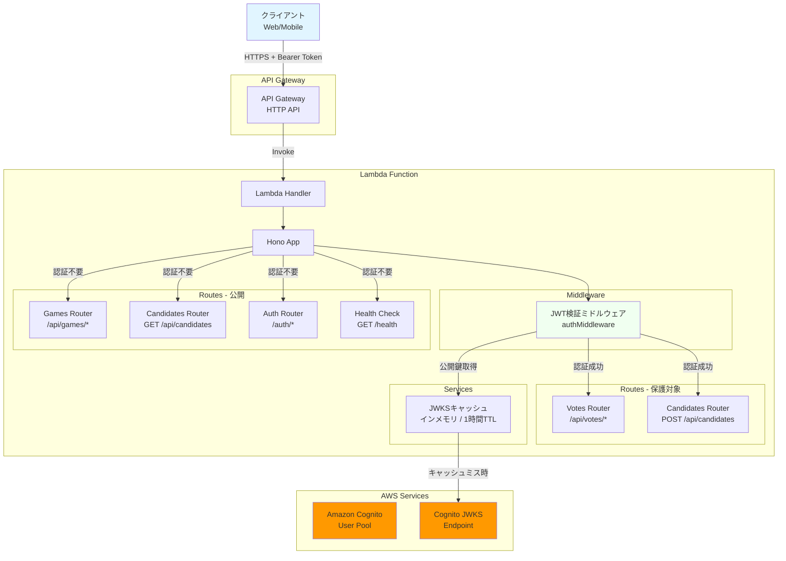
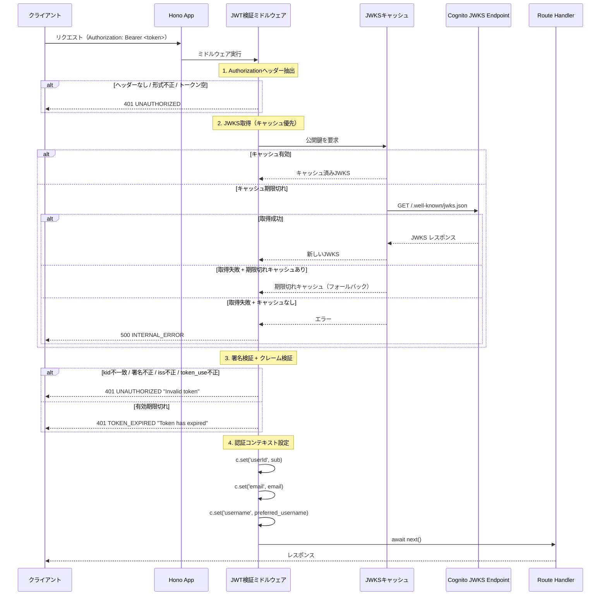
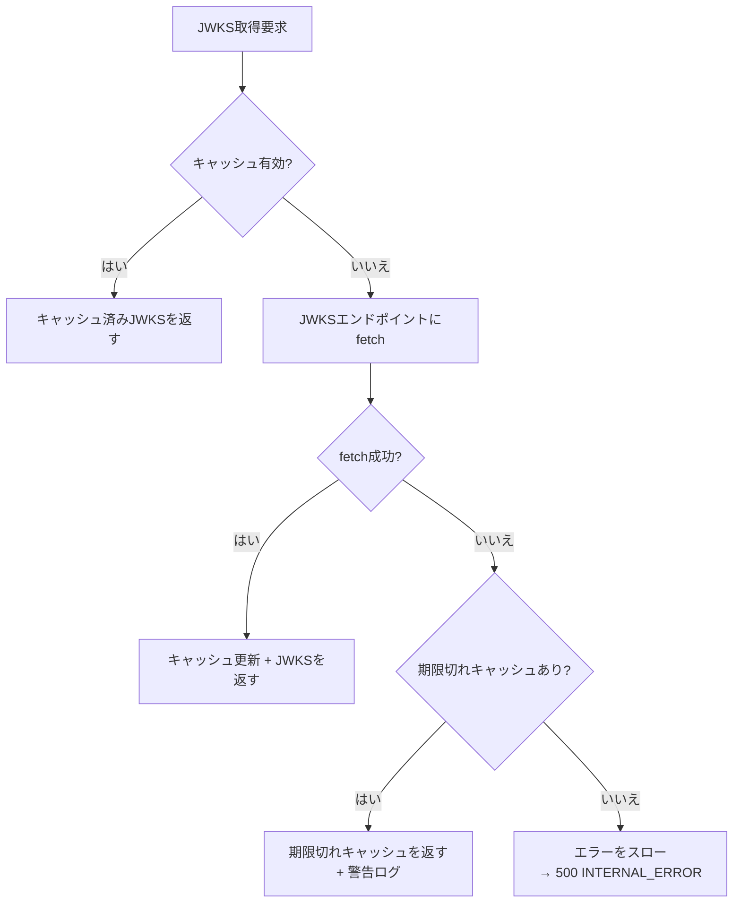

# 設計書: JWTトークン検証ミドルウェア

## 概要

本ドキュメントは、投票対局アプリケーションのJWTトークン検証ミドルウェアの設計を定義します。このミドルウェアは、Amazon Cognitoが発行するアクセストークン（JWT）を検証し、認証が必要なAPIエンドポイントを保護します。

Honoミドルウェアとして実装し、CognitoのJWKS（JSON Web Key Set）エンドポイントから公開鍵を取得してトークンの署名を検証します。検証済みトークンからユーザー情報（userId、email、username）を抽出し、Honoのコンテキスト変数に設定することで、後続のハンドラーが型安全にユーザー情報にアクセスできるようにします。

### 主要な設計目標

- **セキュリティ**: トークンの署名・クレーム・有効期限を厳密に検証し、不正なリクエストを拒否
- **パフォーマンス**: JWKSのインメモリキャッシュ（1時間TTL）によりレイテンシを最小化
- **型安全性**: Honoの型システムと統合し、`c.get('userId')`等で型安全にユーザー情報を取得
- **信頼性**: JWKSエンドポイント障害時の期限切れキャッシュフォールバック
- **一貫性**: 既存のエラーレスポンス形式（error + message）に準拠

### 設計判断

1. **jose ライブラリの採用**: JWT検証には`jose`ライブラリを使用。Node.js標準のWeb Crypto APIベースで、AWS Lambda環境との互換性が高く、JWKSの取得・キャッシュ・署名検証を一貫して処理できる。ただし、JWKSキャッシュのTTL制御と期限切れキャッシュフォールバックの要件を満たすため、`jose`の`createRemoteJWKSet`は使用せず、JWKS取得とキャッシュを自前で管理し、`jose`の`jwtVerify`と`importJWK`を署名検証に使用する
2. **ミドルウェアファクトリパターン**: 設定（userPoolId、region）を引数に取るファクトリ関数でミドルウェアを生成。テスト時のモック注入が容易
3. **ルートレベルの適用**: `app.use`でパスパターンを指定してミドルウェアを適用。個別ルートへの適用ではなく、パスベースで保護対象を定義
4. **JWKSキャッシュの自前管理**: `jose`の`createRemoteJWKSet`は内部キャッシュの制御が限定的なため、TTLと期限切れフォールバックを自前で実装

## アーキテクチャ

### システムコンポーネント図



### リクエストフロー



## コンポーネントとインターフェース

### 1. 型定義（`packages/api/src/lib/auth/types.ts`）

```typescript
import type { Context } from 'hono';

/** 認証コンテキストの型定義 */
export interface AuthVariables {
  userId: string;
  email: string | undefined;
  username: string | undefined;
}

/** JWTペイロードの型定義（Cognitoアクセストークン） */
export interface CognitoAccessTokenPayload {
  sub: string;
  iss: string;
  token_use: string;
  exp: number;
  iat: number;
  email?: string;
  preferred_username?: string;
  [key: string]: unknown;
}

/** ミドルウェア設定 */
export interface AuthMiddlewareConfig {
  userPoolId: string;
  region: string;
}

/** JWKSキャッシュエントリ */
export interface JwksCacheEntry {
  keys: JsonWebKey[];
  fetchedAt: number;
}
```

### 2. JWKSキャッシュ（`packages/api/src/lib/auth/jwks-cache.ts`）

```typescript
import type { JwksCacheEntry } from './types.js';

const CACHE_TTL_MS = 60 * 60 * 1000; // 1時間

export class JwksCache {
  private cache: JwksCacheEntry | null = null;
  private jwksUrl: string;

  constructor(jwksUrl: string) {
    this.jwksUrl = jwksUrl;
  }

  /** キャッシュからJWKSを取得。期限切れまたは未キャッシュの場合はfetchする */
  async getKeys(): Promise<JsonWebKey[]> {
    const now = Date.now();

    // キャッシュが有効な場合
    if (this.cache && now - this.cache.fetchedAt < CACHE_TTL_MS) {
      return this.cache.keys;
    }

    // JWKSエンドポイントから取得
    try {
      const response = await fetch(this.jwksUrl);
      if (!response.ok) {
        throw new Error(`JWKS fetch failed: ${response.status}`);
      }
      const jwks = (await response.json()) as { keys: JsonWebKey[] };
      this.cache = { keys: jwks.keys, fetchedAt: now };
      return this.cache.keys;
    } catch (error) {
      // 期限切れキャッシュが存在する場合はフォールバック
      if (this.cache) {
        console.warn('JWKS fetch failed, using expired cache', {
          error: error instanceof Error ? error.message : 'Unknown error',
        });
        return this.cache.keys;
      }
      // キャッシュなしの場合はエラー
      throw error;
    }
  }
}
```

### 3. JWT検証ミドルウェア（`packages/api/src/lib/auth/auth-middleware.ts`）

```typescript
import { createMiddleware } from 'hono/factory';
import { jwtVerify, importJWK } from 'jose';
import type { AuthVariables, AuthMiddlewareConfig, CognitoAccessTokenPayload } from './types.js';
import { JwksCache } from './jwks-cache.js';

/** Bearerトークンを抽出 */
function extractBearerToken(authHeader: string | undefined): string | null {
  if (!authHeader) return null;
  if (!authHeader.startsWith('Bearer ')) return null;
  const token = authHeader.slice(7);
  return token.length > 0 ? token : null;
}

/** JWTヘッダーからkidを取得 */
function getKidFromToken(token: string): string | null {
  try {
    const [headerPart] = token.split('.');
    const header = JSON.parse(atob(headerPart));
    return header.kid || null;
  } catch {
    return null;
  }
}

export function createAuthMiddleware(config: AuthMiddlewareConfig) {
  const issuer = `https://cognito-idp.${config.region}.amazonaws.com/${config.userPoolId}`;
  const jwksUrl = `${issuer}/.well-known/jwks.json`;
  const jwksCache = new JwksCache(jwksUrl);

  return createMiddleware<{ Variables: AuthVariables }>(async (c, next) => {
    const authHeader = c.req.header('authorization');

    // Authorizationヘッダーの検証
    if (!authHeader) {
      return c.json({ error: 'UNAUTHORIZED', message: 'Authorization header is required' }, 401);
    }
    if (!authHeader.startsWith('Bearer ')) {
      return c.json({ error: 'UNAUTHORIZED', message: 'Invalid authorization format' }, 401);
    }
    const token = authHeader.slice(7);
    if (token.length === 0) {
      return c.json({ error: 'UNAUTHORIZED', message: 'Token is required' }, 401);
    }

    // JWKS取得
    let keys: JsonWebKey[];
    try {
      keys = await jwksCache.getKeys();
    } catch (error) {
      console.error('JWKS fetch failed', {
        error: error instanceof Error ? error.message : 'Unknown error',
      });
      return c.json(
        { error: 'INTERNAL_ERROR', message: 'Authentication service unavailable' },
        500
      );
    }

    // kidに一致する公開鍵を検索
    const kid = getKidFromToken(token);
    if (!kid) {
      console.warn('Token verification failed', { reason: 'invalid_token_header' });
      return c.json({ error: 'UNAUTHORIZED', message: 'Invalid token' }, 401);
    }

    const jwk = keys.find((k) => (k as { kid?: string }).kid === kid);
    if (!jwk) {
      console.warn('Token verification failed', { reason: 'kid_not_found' });
      return c.json({ error: 'UNAUTHORIZED', message: 'Invalid token' }, 401);
    }

    // 署名検証 + クレーム検証
    try {
      const publicKey = await importJWK(jwk, 'RS256');
      const { payload } = await jwtVerify(token, publicKey, {
        issuer,
      });

      const claims = payload as unknown as CognitoAccessTokenPayload;

      // token_use検証
      if (claims.token_use !== 'access') {
        console.warn('Token verification failed', { reason: 'invalid_token_use' });
        return c.json({ error: 'UNAUTHORIZED', message: 'Invalid token' }, 401);
      }

      // 認証コンテキスト設定
      c.set('userId', claims.sub);
      c.set('email', claims.email);
      c.set('username', claims.preferred_username);

      await next();
    } catch (error) {
      if (error instanceof Error && error.message.includes('exp')) {
        console.warn('Token verification failed', { reason: 'token_expired' });
        return c.json({ error: 'TOKEN_EXPIRED', message: 'Token has expired' }, 401);
      }
      console.warn('Token verification failed', { reason: 'invalid_signature_or_claims' });
      return c.json({ error: 'UNAUTHORIZED', message: 'Invalid token' }, 401);
    }
  });
}
```

### 4. ミドルウェア適用（`packages/api/src/index.ts`の変更）

```typescript
import { createAuthMiddleware } from './lib/auth/auth-middleware.js';

// 環境変数チェック
const userPoolId = process.env.COGNITO_USER_POOL_ID;
const region = process.env.AWS_REGION || 'ap-northeast-1';

if (!userPoolId) {
  console.error('COGNITO_USER_POOL_ID environment variable is not set');
  throw new Error('COGNITO_USER_POOL_ID is required');
}

const authMiddleware = createAuthMiddleware({ userPoolId, region });

// 保護対象ルートにミドルウェアを適用
app.use('/api/votes/*', authMiddleware);
app.use('/api/candidates', async (c, next) => {
  // POSTのみ認証必須
  if (c.req.method === 'POST') {
    return authMiddleware(c, next);
  }
  await next();
});
```

### 5. エクスポート（`packages/api/src/lib/auth/index.ts`）

```typescript
export { createAuthMiddleware } from './auth-middleware.js';
export type { AuthVariables, AuthMiddlewareConfig, CognitoAccessTokenPayload } from './types.js';
```

## データモデル

### 新規エンティティ

本ミドルウェアはデータベースアクセスを行わないため、新規エンティティの作成は不要です。

### インメモリデータ構造

#### JWKSキャッシュ

```typescript
interface JwksCacheEntry {
  keys: JsonWebKey[]; // Cognito JWKSの公開鍵配列
  fetchedAt: number; // キャッシュ取得時刻（ミリ秒）
}
```

- TTL: 1時間（3,600,000ミリ秒）
- Lambda実行環境のメモリ上に保持
- Lambda コールドスタート時にリセット

### API Request/Response Models

#### 認証成功時

リクエストヘッダー:

```text
Authorization: Bearer <access_token>
```

後続ハンドラーで利用可能なコンテキスト変数:

```typescript
c.get('userId'); // string - トークンのsubクレーム
c.get('email'); // string | undefined - トークンのemailクレーム
c.get('username'); // string | undefined - トークンのpreferred_usernameクレーム
```

#### エラーレスポンス

```typescript
// 401 Unauthorized
{ error: 'UNAUTHORIZED', message: 'Authorization header is required' }
{ error: 'UNAUTHORIZED', message: 'Invalid authorization format' }
{ error: 'UNAUTHORIZED', message: 'Token is required' }
{ error: 'UNAUTHORIZED', message: 'Invalid token' }
{ error: 'TOKEN_EXPIRED', message: 'Token has expired' }

// 500 Internal Server Error
{ error: 'INTERNAL_ERROR', message: 'Authentication service unavailable' }
```

## 正確性プロパティ

_プロパティとは、システムのすべての有効な実行において真であるべき特性または動作です。本質的には、システムが何をすべきかについての形式的な記述です。プロパティは、人間が読める仕様と機械で検証可能な正確性保証との橋渡しとなります。_

### プロパティリフレクション

プレワーク分析を完了した後、論理的な冗長性を排除するためにプロパティをレビューしました:

**統合されたプロパティ:**

- 要件1.1, 1.3: Bearerトークン抽出の正当性を1つのプロパティに統合（任意のAuthorizationヘッダー値に対する抽出ルール）
- 要件2.2, 2.3, 2.4: 署名検証を1つのプロパティに統合（kidマッチング + 署名検証 + kid不一致はすべて署名検証の一部）
- 要件3.1, 3.2, 3.4, 3.5: issとtoken_useのクレーム検証を1つのプロパティに統合（同一の検証パス）
- 要件4.1, 4.2, 4.3, 4.4: 認証コンテキスト設定を1つのラウンドトリッププロパティに統合（トークンのクレーム → コンテキスト変数の対応）
- 要件5.1, 5.3, 5.4: JWKSキャッシュの動作を1つのプロパティに統合（TTL内はキャッシュ使用、期限切れ時は再取得）
- 要件7.1, 7.2, 7.3, 7.4: エラーレスポンス形式を1つのプロパティに統合（すべての認証エラーに共通する構造）
- 要件8.1, 8.2, 8.3: ログセキュリティを1つのプロパティに統合（トークン非出力 + エラー種類の記録）
- 要件2.1, 8.4: JWKSエンドポイントURL構築を1つのプロパティに統合

**除外されたプロパティ:**

- 要件1.2, 1.4: 特定のケース（ヘッダーなし、トークン空）はユニットテストで検証
- 要件5.2: キャッシュTTLの具体的な値（1時間）はユニットテストで検証
- 要件5.5, 5.6: フォールバック動作は特定のケースのためユニットテストで検証
- 要件6.1-6.6: ルート保護設定は特定のパスに対するテストのためユニットテストで検証
- 要件8.5: 環境変数未設定時のエラーは特定のケースのためユニットテストで検証
- 要件9.1-9.3: 型安全性はTypeScriptコンパイラで検証（ランタイムテスト不要）

**最終プロパティ数:** 8個の独立したプロパティ

### プロパティ1: Bearerトークン抽出の正当性

*任意の*文字列tokenに対して、`Bearer ${token}`形式のAuthorizationヘッダーからトークンを抽出した結果は、元のtoken文字列と一致するべきです。また、`Bearer `で始まらない任意の文字列に対しては、トークン抽出は失敗するべきです。

**検証: 要件 1.1, 1.3**

### プロパティ2: JWKSエンドポイントURL構築

*任意の*regionとuserPoolIdの組み合わせに対して、構築されるJWKSエンドポイントURLは`https://cognito-idp.{region}.amazonaws.com/{userPoolId}/.well-known/jwks.json`の形式に一致するべきです。

**検証: 要件 2.1, 8.4**

### プロパティ3: 署名検証の正当性

*任意の*JWTトークンに対して、JWKSに含まれる正しいkidの公開鍵に対応する秘密鍵で署名されたトークンは検証に成功し、異なる鍵で署名されたトークンまたはkidがJWKSに存在しないトークンは検証に失敗して401 UNAUTHORIZEDを返すべきです。

**検証: 要件 2.2, 2.3, 2.4**

### プロパティ4: クレーム検証

*任意の*JWTトークンに対して、`iss`クレームが期待するCognito issuer URLと一致し、かつ`token_use`クレームが`access`であるトークンはクレーム検証に成功し、いずれかが不一致のトークンは401 UNAUTHORIZEDを返すべきです。

**検証: 要件 3.1, 3.2, 3.4, 3.5**

### プロパティ5: 有効期限切れトークンのエラーコード区別

*任意の*有効期限切れトークン（expが現在時刻より過去）に対して、ミドルウェアは401ステータスコードとエラーコード`TOKEN_EXPIRED`（`UNAUTHORIZED`ではなく）を返すべきです。

**検証: 要件 3.3, 3.6**

### プロパティ6: 認証コンテキストのラウンドトリップ

*任意の*有効なトークンに対して、トークンの`sub`クレームはコンテキストの`userId`に、`email`クレームは`email`に、`preferred_username`クレームは`username`に設定され、後続のハンドラーから取得した値は元のクレーム値と一致するべきです。

**検証: 要件 4.1, 4.2, 4.3, 4.4**

### プロパティ7: エラーレスポンス形式の一貫性

*任意の*認証エラー（ヘッダー不正、署名不正、クレーム不正、期限切れ）に対して、レスポンスは`error`フィールド（`UNAUTHORIZED`、`TOKEN_EXPIRED`、`INTERNAL_ERROR`のいずれか）と空でない`message`フィールドを含むJSONであり、トークン文字列やペイロードの詳細を含まないべきです。

**検証: 要件 7.1, 7.2, 7.3, 7.4**

### プロパティ8: ログセキュリティ

*任意の*リクエスト（認証成功・失敗を問わず）に対して、ログ出力にトークン文字列およびトークンペイロード全体が含まれてはならず、認証エラー時にはエラーの種類（reason）がログに記録されるべきです。

**検証: 要件 8.1, 8.2, 8.3**

## エラーハンドリング

### エラー分類

#### 1. 認証エラー（401 Unauthorized）

**原因と対応:**

| エラーケース                                   | errorコード     | message                            |
| ---------------------------------------------- | --------------- | ---------------------------------- |
| Authorizationヘッダーなし                      | `UNAUTHORIZED`  | `Authorization header is required` |
| Bearer形式でない                               | `UNAUTHORIZED`  | `Invalid authorization format`     |
| トークン文字列が空                             | `UNAUTHORIZED`  | `Token is required`                |
| 署名不正 / kid不一致 / iss不正 / token_use不正 | `UNAUTHORIZED`  | `Invalid token`                    |
| 有効期限切れ                                   | `TOKEN_EXPIRED` | `Token has expired`                |

**レスポンス例:**

```json
{
  "error": "UNAUTHORIZED",
  "message": "Invalid token"
}
```

```json
{
  "error": "TOKEN_EXPIRED",
  "message": "Token has expired"
}
```

#### 2. 内部サーバーエラー（500 Internal Server Error）

**原因:**

- JWKSエンドポイントへのリクエスト失敗かつキャッシュなし

**レスポンス例:**

```json
{
  "error": "INTERNAL_ERROR",
  "message": "Authentication service unavailable"
}
```

### エラーハンドリング戦略

#### セキュリティ考慮事項

- エラーレスポンスにトークンの内容や検証失敗の詳細な理由を含めない
- 署名不正、iss不正、token_use不正はすべて同一の`Invalid token`メッセージを返す（攻撃者への情報漏洩防止）
- 有効期限切れのみ`TOKEN_EXPIRED`で区別（クライアントがトークンリフレッシュを判断するため）

#### ログ戦略

- トークン文字列・ペイロード全体はログに出力しない
- 認証エラー時はエラーの種類（reason）をログに記録

```typescript
console.warn('Token verification failed', { reason: 'invalid_signature_or_claims' });
console.warn('Token verification failed', { reason: 'token_expired' });
console.warn('Token verification failed', { reason: 'kid_not_found' });
console.warn('Token verification failed', { reason: 'invalid_token_use' });
```

#### JWKSフォールバック戦略



## テスト戦略

### デュアルテストアプローチ

本機能では、ユニットテストとプロパティベーステストの両方を実装します。

#### ユニットテスト

**目的:**

- 特定の例とエッジケースの検証
- ルート保護設定の検証（要件6.1-6.6）
- JWKSキャッシュのフォールバック動作の検証（要件5.5, 5.6）
- 環境変数未設定時のエラーの検証（要件8.5）

**対象:**

- Bearerトークン抽出（ヘッダーなし、Bearer形式でない、トークン空）
- JWKSキャッシュ（TTL内のキャッシュヒット、期限切れ時の再取得、フォールバック、キャッシュなし時のエラー）
- JWT検証（署名不正、kid不一致、iss不正、token_use不正、有効期限切れ）
- 認証コンテキスト設定（userId、email、username、オプショナルフィールドの欠落）
- ルート保護設定（保護対象パスと公開パスの検証）
- 環境変数チェック（COGNITO_USER_POOL_ID未設定時のエラー）

#### プロパティベーステスト

**目的:**

- ランダム化による包括的な入力カバレッジ
- すべての入力に対して保持される普遍的なプロパティの検証

**設定:**

- テストライブラリ: fast-check（既にdevDependenciesに含まれている）
- 最小イテレーション数: 100回
- 各テストは設計ドキュメントのプロパティを参照

**タグ形式:**

```typescript
/**
 * Feature: 5-jwt-token-verification-middleware, Property 1: Bearerトークン抽出の正当性
 */
```

**各プロパティは単一のプロパティベーステストで実装する。**

### テストファイル構成

```text
packages/api/src/
└── lib/
    └── auth/
        ├── auth-middleware.test.ts          # ユニットテスト（ミドルウェア全体）
        ├── auth-middleware.property.test.ts # プロパティテスト（プロパティ1-8）
        ├── jwks-cache.test.ts              # ユニットテスト（JWKSキャッシュ）
        └── types.ts                        # 型定義
```
