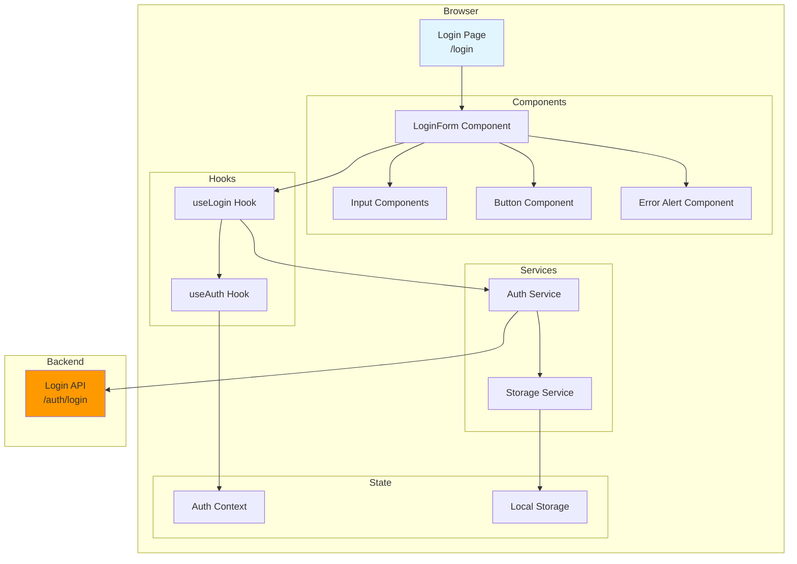
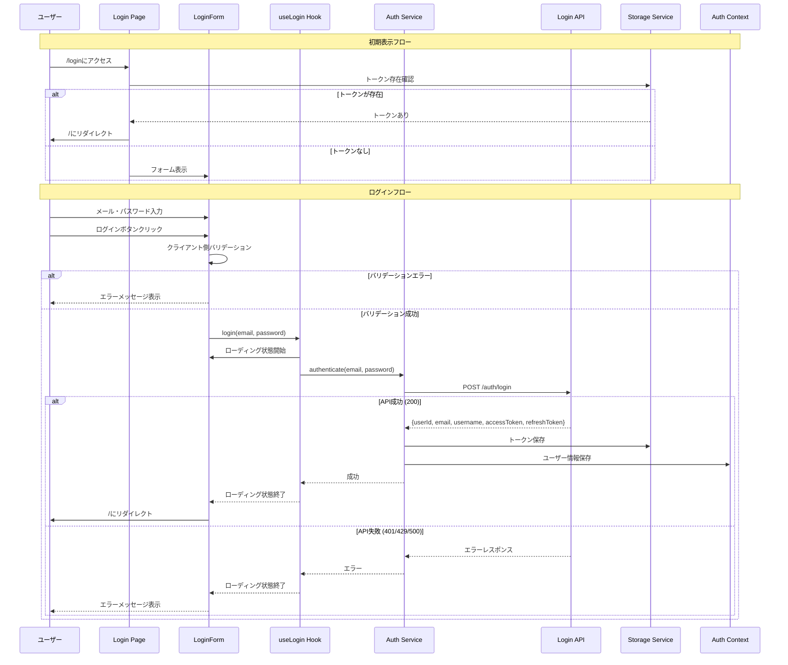

# 設計書: ログイン画面

## 概要

本ドキュメントは、投票対局アプリケーションのログイン画面機能の設計を定義します。この機能は、登録済みユーザーがメールアドレスとパスワードを使用してアプリケーションにログインできるフロントエンド画面を提供します。ログイン画面は、既存のログインAPI（`/auth/login`）と統合し、認証成功後にユーザーをアプリケーションのホーム画面に遷移させます。

### 主要な設計目標

- **ユーザビリティ**: 直感的なフォームデザイン、明確なエラーメッセージ、即座のフィードバック
- **アクセシビリティ**: ARIA属性による支援技術対応、キーボードナビゲーション、適切なフォーカス管理
- **セキュリティ**: パスワードのマスク表示、HTTPS通信、機密情報の適切な取り扱い
- **レスポンシブデザイン**: モバイル、タブレット、デスクトップでの最適な表示
- **パフォーマンス**: 高速なページロード、効率的な状態管理

## アーキテクチャ

### システムコンポーネント図



### リクエストフロー



### コンポーネント説明

#### 1. Login Page（`/login`）

- Next.js App Routerのページコンポーネント
- 認証済みユーザーのリダイレクト処理
- LoginFormコンポーネントのレンダリング

#### 2. LoginForm Component

- メールアドレスとパスワードの入力フィールド
- クライアント側バリデーション
- ログインボタンとローディング状態の管理
- エラーメッセージの表示
- パスワードリセットと新規登録へのリンク

#### 3. useLogin Hook

- ログインロジックのカプセル化
- フォーム状態の管理（loading、error）
- Auth Serviceの呼び出し
- エラーハンドリング

#### 4. useAuth Hook

- 認証状態の管理
- Auth Contextへのアクセス
- ユーザー情報の取得・更新

#### 5. Auth Service

- Login APIとの通信
- トークンの保存・取得
- エラーレスポンスの変換

#### 6. Storage Service

- ローカルストレージへのアクセス
- トークンの保存・取得・削除

## コンポーネントとインターフェース

### 1. ページコンポーネント（`packages/web/src/app/login/page.tsx`）

```typescript
'use client';

import { useEffect, useState } from 'react';
import { useRouter } from 'next/navigation';
import { LoginForm } from '@/components/auth/login-form';
import { getAccessToken } from '@/lib/services/storage-service';

export default function LoginPage() {
  const router = useRouter();
  const [isChecking, setIsChecking] = useState(true);

  useEffect(() => {
    // 認証済みユーザーのリダイレクト
    const token = getAccessToken();
    if (token) {
      router.push('/');
    } else {
      setIsChecking(false);
    }
  }, [router]);

  if (isChecking) {
    return (
      <div className="flex min-h-screen items-center justify-center">
        <div className="text-center">
          <div className="animate-spin rounded-full h-8 w-8 border-b-2 border-gray-900 mx-auto" />
          <p className="mt-2 text-sm text-gray-600">読み込み中...</p>
        </div>
      </div>
    );
  }

  return (
    <div className="flex min-h-screen items-center justify-center bg-gray-50 px-4 py-12 sm:px-6 lg:px-8">
      <div className="w-full max-w-md space-y-8">
        <div>
          <h1 className="text-center text-3xl font-bold tracking-tight text-gray-900">
            ログイン
          </h1>
          <p className="mt-2 text-center text-sm text-gray-600">
            投票対局へようこそ
          </p>
        </div>
        <LoginForm />
      </div>
    </div>
  );
}
```

### 2. LoginFormコンポーネント（`packages/web/src/components/auth/login-form.tsx`）

```typescript
'use client';

import { useState } from 'react';
import { useRouter } from 'next/navigation';
import Link from 'next/link';
import { Eye, EyeOff } from 'lucide-react';
import { useLogin } from '@/lib/hooks/use-login';
import { Button } from '@/components/ui/button';
import { Input } from '@/components/ui/input';
import { Alert, AlertDescription } from '@/components/ui/alert';

interface FormErrors {
  email?: string;
  password?: string;
}

export function LoginForm() {
  const router = useRouter();
  const { login, isLoading, error: apiError } = useLogin();

  const [email, setEmail] = useState('');
  const [password, setPassword] = useState('');
  const [showPassword, setShowPassword] = useState(false);
  const [errors, setErrors] = useState<FormErrors>({});

  const validateForm = (): boolean => {
    const newErrors: FormErrors = {};

    if (!email.trim()) {
      newErrors.email = 'メールアドレスを入力してください';
    } else if (!/^[^\s@]+@[^\s@]+\.[^\s@]+$/.test(email)) {
      newErrors.email = '有効なメールアドレスを入力してください';
    }

    if (!password) {
      newErrors.password = 'パスワードを入力してください';
    }

    setErrors(newErrors);
    return Object.keys(newErrors).length === 0;
  };

  const handleSubmit = async (e: React.FormEvent) => {
    e.preventDefault();

    if (!validateForm()) {
      return;
    }

    const success = await login(email, password);
    if (success) {
      router.push('/');
    }
  };

  const togglePasswordVisibility = () => {
    setShowPassword(!showPassword);
  };

  return (
    <form onSubmit={handleSubmit} className="mt-8 space-y-6" noValidate>
      {apiError && (
        <Alert variant="destructive" role="alert">
          <AlertDescription>{apiError}</AlertDescription>
        </Alert>
      )}

      <div className="space-y-4">
        <div>
          <label htmlFor="email" className="sr-only">
            メールアドレス
          </label>
          <Input
            id="email"
            name="email"
            type="email"
            autoComplete="email"
            required
            value={email}
            onChange={(e) => setEmail(e.target.value)}
            disabled={isLoading}
            placeholder="メールアドレス"
            aria-label="メールアドレス"
            aria-invalid={!!errors.email}
            aria-describedby={errors.email ? 'email-error' : undefined}
            className={errors.email ? 'border-red-500' : ''}
          />
          {errors.email && (
            <p id="email-error" className="mt-1 text-sm text-red-600" role="alert">
              {errors.email}
            </p>
          )}
        </div>

        <div>
          <label htmlFor="password" className="sr-only">
            パスワード
          </label>
          <div className="relative">
            <Input
              id="password"
              name="password"
              type={showPassword ? 'text' : 'password'}
              autoComplete="current-password"
              required
              value={password}
              onChange={(e) => setPassword(e.target.value)}
              disabled={isLoading}
              placeholder="パスワード"
              aria-label="パスワード"
              aria-invalid={!!errors.password}
              aria-describedby={errors.password ? 'password-error' : undefined}
              className={errors.password ? 'border-red-500 pr-10' : 'pr-10'}
            />
            <button
              type="button"
              onClick={togglePasswordVisibility}
              disabled={isLoading}
              className="absolute inset-y-0 right-0 flex items-center pr-3"
              aria-label={showPassword ? 'パスワードを非表示' : 'パスワードを表示'}
            >
              {showPassword ? (
                <EyeOff className="h-5 w-5 text-gray-400" />
              ) : (
                <Eye className="h-5 w-5 text-gray-400" />
              )}
            </button>
          </div>
          {errors.password && (
            <p id="password-error" className="mt-1 text-sm text-red-600" role="alert">
              {errors.password}
            </p>
          )}
        </div>
      </div>

      <div className="flex items-center justify-between">
        <div className="text-sm">
          <Link
            href="/password-reset"
            className="font-medium text-blue-600 hover:text-blue-500"
          >
            パスワードをお忘れですか？
          </Link>
        </div>
      </div>

      <div>
        <Button
          type="submit"
          disabled={isLoading}
          aria-disabled={isLoading}
          className="w-full"
        >
          {isLoading ? 'ログイン中...' : 'ログイン'}
        </Button>
      </div>

      <div className="text-center text-sm">
        <span className="text-gray-600">アカウントをお持ちでない方</span>{' '}
        <Link
          href="/register"
          className="font-medium text-blue-600 hover:text-blue-500"
        >
          新規登録
        </Link>
      </div>
    </form>
  );
}
```

### 3. useLoginフック（`packages/web/src/lib/hooks/use-login.ts`）

```typescript
import { useState } from 'react';
import { useAuth } from './use-auth';
import { authService } from '@/lib/services/auth-service';

export function useLogin() {
  const [isLoading, setIsLoading] = useState(false);
  const [error, setError] = useState<string | null>(null);
  const { setUser } = useAuth();

  const login = async (email: string, password: string): Promise<boolean> => {
    setIsLoading(true);
    setError(null);

    try {
      const response = await authService.login(email, password);

      // ユーザー情報を認証コンテキストに保存
      setUser({
        userId: response.userId,
        email: response.email,
        username: response.username,
      });

      return true;
    } catch (err) {
      if (err instanceof Error) {
        setError(err.message);
      } else {
        setError('ログインに失敗しました');
      }
      return false;
    } finally {
      setIsLoading(false);
    }
  };

  return { login, isLoading, error };
}
```

### 4. useAuthフック（`packages/web/src/lib/hooks/use-auth.ts`）

```typescript
import { useContext } from 'react';
import { AuthContext } from '@/lib/contexts/auth-context';

export function useAuth() {
  const context = useContext(AuthContext);

  if (!context) {
    throw new Error('useAuth must be used within an AuthProvider');
  }

  return context;
}
```

### 5. Auth Context（`packages/web/src/lib/contexts/auth-context.tsx`）

```typescript
'use client';

import { createContext, useState, useEffect, ReactNode } from 'react';
import { getAccessToken } from '@/lib/services/storage-service';

interface User {
  userId: string;
  email: string;
  username: string;
}

interface AuthContextType {
  user: User | null;
  setUser: (user: User | null) => void;
  isAuthenticated: boolean;
}

export const AuthContext = createContext<AuthContextType | undefined>(undefined);

export function AuthProvider({ children }: { children: ReactNode }) {
  const [user, setUser] = useState<User | null>(null);

  useEffect(() => {
    // 初期化時にトークンをチェック
    const token = getAccessToken();
    if (token) {
      // トークンが存在する場合、ユーザー情報を復元
      // 実際の実装では、トークンからユーザー情報をデコードするか、
      // 別途ローカルストレージに保存したユーザー情報を取得
    }
  }, []);

  const isAuthenticated = !!user && !!getAccessToken();

  return (
    <AuthContext.Provider value={{ user, setUser, isAuthenticated }}>
      {children}
    </AuthContext.Provider>
  );
}
```

### 6. Auth Service（`packages/web/src/lib/services/auth-service.ts`）

```typescript
import { storageService } from './storage-service';

interface LoginResponse {
  userId: string;
  email: string;
  username: string;
  accessToken: string;
  refreshToken: string;
  expiresIn: number;
}

interface LoginRequest {
  email: string;
  password: string;
}

class AuthService {
  private apiUrl: string;

  constructor() {
    this.apiUrl = process.env.NEXT_PUBLIC_API_URL || '';
  }

  async login(email: string, password: string): Promise<LoginResponse> {
    const response = await fetch(`${this.apiUrl}/auth/login`, {
      method: 'POST',
      headers: {
        'Content-Type': 'application/json',
      },
      body: JSON.stringify({ email, password } as LoginRequest),
    });

    if (!response.ok) {
      const errorData = await response.json().catch(() => ({}));

      switch (response.status) {
        case 401:
          throw new Error('メールアドレスまたはパスワードが正しくありません');
        case 429:
          throw new Error('ログイン試行回数が上限に達しました。しばらくしてから再度お試しください');
        case 500:
          throw new Error('サーバーエラーが発生しました。しばらくしてから再度お試しください');
        default:
          if (!navigator.onLine) {
            throw new Error(
              'ネットワークエラーが発生しました。インターネット接続を確認してください'
            );
          }
          throw new Error(errorData.message || 'ログインに失敗しました');
      }
    }

    const data: LoginResponse = await response.json();

    // トークンをローカルストレージに保存
    storageService.setAccessToken(data.accessToken);
    storageService.setRefreshToken(data.refreshToken);

    return data;
  }

  logout(): void {
    storageService.removeAccessToken();
    storageService.removeRefreshToken();
  }
}

export const authService = new AuthService();
```

### 7. Storage Service（`packages/web/src/lib/services/storage-service.ts`）

```typescript
const ACCESS_TOKEN_KEY = 'vbg_access_token';
const REFRESH_TOKEN_KEY = 'vbg_refresh_token';

class StorageService {
  setAccessToken(token: string): void {
    if (typeof window !== 'undefined') {
      localStorage.setItem(ACCESS_TOKEN_KEY, token);
    }
  }

  getAccessToken(): string | null {
    if (typeof window !== 'undefined') {
      return localStorage.getItem(ACCESS_TOKEN_KEY);
    }
    return null;
  }

  removeAccessToken(): void {
    if (typeof window !== 'undefined') {
      localStorage.removeItem(ACCESS_TOKEN_KEY);
    }
  }

  setRefreshToken(token: string): void {
    if (typeof window !== 'undefined') {
      localStorage.setItem(REFRESH_TOKEN_KEY, token);
    }
  }

  getRefreshToken(): string | null {
    if (typeof window !== 'undefined') {
      return localStorage.getItem(REFRESH_TOKEN_KEY);
    }
    return null;
  }

  removeRefreshToken(): void {
    if (typeof window !== 'undefined') {
      localStorage.removeItem(REFRESH_TOKEN_KEY);
    }
  }
}

export const storageService = new StorageService();

// 個別のエクスポート（後方互換性のため）
export const getAccessToken = () => storageService.getAccessToken();
export const setAccessToken = (token: string) => storageService.setAccessToken(token);
export const removeAccessToken = () => storageService.removeAccessToken();
```

### 8. UIコンポーネント（shadcn/ui）

以下のshadcn/uiコンポーネントを使用します:

- `Button`: ログインボタン
- `Input`: メールアドレスとパスワードの入力フィールド
- `Alert`: エラーメッセージの表示

これらのコンポーネントは`packages/web/src/components/ui/`ディレクトリに配置されます。

## データモデル

### LoginRequest

```typescript
interface LoginRequest {
  email: string;
  password: string;
}
```

### LoginResponse（API）

```typescript
interface LoginResponse {
  userId: string;
  email: string;
  username: string;
  accessToken: string;
  refreshToken: string;
  expiresIn: number; // 900秒（15分）
}
```

### User（クライアント側）

```typescript
interface User {
  userId: string;
  email: string;
  username: string;
}
```

### FormErrors

```typescript
interface FormErrors {
  email?: string;
  password?: string;
}
```

### ローカルストレージキー

- `vbg_access_token`: アクセストークン
- `vbg_refresh_token`: リフレッシュトークン

## 正確性プロパティ

_プロパティとは、システムのすべての有効な実行において真であるべき特性または動作です。本質的には、システムが何をすべきかについての形式的な記述です。プロパティは、人間が読める仕様と機械で検証可能な正確性保証との橋渡しとなります。_

### プロパティリフレクション

プレワーク分析を完了した後、論理的な冗長性を排除するためにプロパティをレビューしました:

**統合されたプロパティ:**

- 要件1.1-1.6: フォーム要素の表示を1つのexampleテストに統合（すべて初期表示の確認）
- 要件2.1, 2.2: 空フィールドのバリデーションを1つのexampleテストに統合
- 要件3.2, 3.3, 3.4: ローディング状態のUI変更を1つのexampleテストに統合
- 要件4.1, 4.3, 4.4: ログイン成功フローを1つのexampleテストに統合
- 要件5.1-5.4: APIエラーメッセージ表示を1つのpropertyに統合（エラーコードとメッセージのマッピング）
- 要件6.1, 6.2: パスワードリセットリンクを1つのexampleテストに統合
- 要件7.1, 7.2: 新規登録リンクを1つのexampleテストに統合
- 要件8.1, 8.2, 8.3: 認証済みユーザーリダイレクトを1つのexampleテストに統合
- 要件9.1, 9.2, 9.4: パスワード表示切り替えを1つのexampleテストに統合
- 要件10.1, 10.2, 10.4, 10.5: ARIA属性を1つのexampleテストに統合
- 要件11.2, 11.3: レスポンシブレイアウトを1つのexampleテストに統合

**独立したプロパティとして維持:**

- 要件2.3: 無効なメールアドレス形式のバリデーション（様々な無効形式をテスト）
- 要件2.4: バリデーションエラー時のAPI呼び出し防止
- 要件3.1: 有効な入力でのAPI呼び出し
- 要件4.2: トークンのローカルストレージ保存
- 要件5.5: エラー後のフォーム再有効化
- 要件9.3: パスワード表示切り替えのラウンドトリップ
- 要件10.3: バリデーションエラー時のrole="alert"属性
- 要件11.4: タッチ可能要素の最小サイズ

**除外されたプロパティ:**

- 要件11.1: 「適切に表示」は主観的で測定不可能
- 要件12.1: コンソールログの検証は困難、コードレビューで対応
- 要件12.3: HTTPS通信はインフラレベルの設定
- 要件12.4: トークンのサニタイゼーションは不要（APIから受け取った値をそのまま保存）

**最終プロパティ数:** 8個の独立したプロパティ + 複数のexampleテスト

### プロパティ1: 無効なメールアドレス形式のバリデーション

*任意の*無効な形式のメールアドレス（@なし、ドメインなし、スペース含む等）に対して、ログインボタンをクリックしたとき、エラーメッセージ「有効なメールアドレスを入力してください」を表示し、API呼び出しを行わないべきです。

**検証: 要件 2.3**

### プロパティ2: バリデーションエラー時のAPI呼び出し防止

*任意の*バリデーションエラー（空のメールアドレス、空のパスワード、無効なメールアドレス形式）が存在する場合、ログインAPIを呼び出してはならないべきです。

**検証: 要件 2.4**

### プロパティ3: 有効な入力でのAPI呼び出し

*任意の*有効なメールアドレスとパスワードの組み合わせに対して、ログインボタンをクリックしたとき、入力されたメールアドレスとパスワードを含むPOSTリクエストをログインAPIに送信するべきです。

**検証: 要件 3.1**

### プロパティ4: トークンのローカルストレージ保存

*任意の*ログイン成功レスポンス（accessTokenとrefreshTokenを含む）に対して、両方のトークンがブラウザのローカルストレージに正しく保存されるべきです。

**検証: 要件 4.2**

### プロパティ5: APIエラーメッセージの表示

*任意の*APIエラーレスポンス（401、429、500、ネットワークエラー）に対して、対応するユーザーフレンドリーなエラーメッセージを表示するべきです。401の場合は「メールアドレスまたはパスワードが正しくありません」、429の場合は「ログイン試行回数が上限に達しました。しばらくしてから再度お試しください」、500の場合は「サーバーエラーが発生しました。しばらくしてから再度お試しください」、ネットワークエラーの場合は「ネットワークエラーが発生しました。インターネット接続を確認してください」を表示するべきです。

**検証: 要件 5.1, 5.2, 5.3, 5.4**

### プロパティ6: エラー後のフォーム再有効化

*任意の*エラーケース（バリデーションエラー、APIエラー）の後、ログインボタンとフォーム入力フィールドが再度有効化され、ユーザーが再試行できるべきです。

**検証: 要件 5.5**

### プロパティ7: パスワード表示切り替えのラウンドトリップ

*任意の*パスワード入力状態に対して、パスワード表示切り替えボタンを2回クリックすると、元の表示状態（マスク表示）に戻るべきです。

**検証: 要件 9.3**

### プロパティ8: バリデーションエラー時のrole="alert"属性

*任意の*バリデーションエラーメッセージに対して、role="alert"属性が設定され、スクリーンリーダーユーザーに適切に通知されるべきです。

**検証: 要件 10.3**

### プロパティ9: タッチ可能要素の最小サイズ

*任意の*インタラクティブ要素（ログインボタン、パスワード表示切り替えボタン、リンク）に対して、最小タップ領域44x44pxを確保するべきです。

**検証: 要件 11.4**

## エラーハンドリング

### エラー分類

#### 1. クライアント側バリデーションエラー

**原因:**

- メールアドレスフィールドが空
- パスワードフィールドが空
- メールアドレスの形式が無効

**表示:**

- フィールド下部に赤色のエラーメッセージを表示
- フィールドの枠線を赤色に変更
- role="alert"属性を設定してスクリーンリーダーに通知

**例:**

```
メールアドレスを入力してください
パスワードを入力してください
有効なメールアドレスを入力してください
```

#### 2. 認証失敗エラー（401）

**原因:**

- メールアドレスまたはパスワードが正しくない

**表示:**

- フォーム上部に赤色のアラートボックスを表示
- エラーメッセージ: 「メールアドレスまたはパスワードが正しくありません」

#### 3. レート制限エラー（429）

**原因:**

- ログイン試行回数が上限に達した

**表示:**

- フォーム上部に赤色のアラートボックスを表示
- エラーメッセージ: 「ログイン試行回数が上限に達しました。しばらくしてから再度お試しください」

#### 4. サーバーエラー（500）

**原因:**

- バックエンドの内部エラー

**表示:**

- フォーム上部に赤色のアラートボックスを表示
- エラーメッセージ: 「サーバーエラーが発生しました。しばらくしてから再度お試しください」

#### 5. ネットワークエラー

**原因:**

- インターネット接続の問題
- APIサーバーへの接続失敗

**表示:**

- フォーム上部に赤色のアラートボックスを表示
- エラーメッセージ: 「ネットワークエラーが発生しました。インターネット接続を確認してください」

**検出方法:**

```typescript
if (!navigator.onLine) {
  throw new Error('ネットワークエラーが発生しました。インターネット接続を確認してください');
}
```

### エラーハンドリング戦略

#### バリデーションエラー

- フォーム送信前にクライアント側でバリデーション
- エラーがある場合はAPI呼び出しを行わない
- 各フィールドの下にエラーメッセージを表示
- フォームは有効なまま（ユーザーが修正可能）

#### APIエラー

- try-catchブロックでエラーをキャッチ
- HTTPステータスコードに基づいてエラーメッセージを決定
- フォーム上部にアラートボックスを表示
- ローディング状態を解除し、フォームを再度有効化

#### エラー後の状態管理

- エラーメッセージを表示
- ローディング状態を解除（isLoading = false）
- ボタンとフィールドを再度有効化
- ユーザーが修正して再試行できるようにする

## テスト戦略

### デュアルテストアプローチ

本機能では、ユニットテストとプロパティベーステストの両方を実装します。

#### ユニットテスト

**目的:**

- 特定の例とエッジケースの検証
- UIコンポーネントの統合ポイントの検証
- ユーザーインタラクションの検証

**対象:**

- LoginFormコンポーネント
  - 初期表示（フォーム要素の存在確認）
  - 空フィールドのバリデーション
  - ローディング状態のUI変更
  - ログイン成功フロー
  - パスワードリセットリンク
  - 新規登録リンク
  - パスワード表示切り替え
  - ARIA属性
  - レスポンシブレイアウト
- LoginPageコンポーネント
  - 認証済みユーザーのリダイレクト
- useLoginフック
  - ログインロジック
  - エラーハンドリング
- Auth Service
  - API呼び出し
  - トークン保存
  - エラーレスポンスの変換
- Storage Service
  - トークンの保存・取得・削除

**テストライブラリ:**

- Vitest: テストランナー
- React Testing Library: コンポーネントテスト
- @testing-library/user-event: ユーザーインタラクションのシミュレーション

#### プロパティベーステスト

**目的:**

- ランダム化による包括的な入力カバレッジ
- すべての入力に対して保持される普遍的なプロパティの検証

**設定:**

- テストライブラリ: fast-check
- 最小イテレーション数: 100回
- 各テストは設計ドキュメントのプロパティを参照

**タグ形式:**

```typescript
/**
 * Feature: login-screen, Property 1: 無効なメールアドレス形式のバリデーション
 */
```

**各プロパティは単一のプロパティベーステストで実装する。**

### テストファイル構成

```
packages/web/src/
├── app/
│   └── login/
│       └── page.test.tsx                    # LoginPageのユニットテスト
├── components/
│   └── auth/
│       ├── login-form.test.tsx              # LoginFormのユニットテスト
│       └── login-form.property.test.tsx     # プロパティ1, 2, 3, 5, 6, 7, 8, 9のテスト
├── lib/
│   ├── hooks/
│   │   ├── use-login.test.tsx               # useLoginのユニットテスト
│   │   └── use-auth.test.tsx                # useAuthのユニットテスト
│   ├── services/
│   │   ├── auth-service.test.ts             # Auth Serviceのユニットテスト
│   │   ├── auth-service.property.test.ts    # プロパティ4のテスト
│   │   └── storage-service.test.ts          # Storage Serviceのユニットテスト
│   └── contexts/
│       └── auth-context.test.tsx            # Auth Contextのユニットテスト
```

### テストカバレッジ目標

- ユニットテスト: 80%以上のコードカバレッジ
- プロパティベーステスト: すべての正確性プロパティをカバー
- E2Eテスト（Playwright）: 主要なユーザーフロー（ログイン成功、ログイン失敗）

### テスト実行

```bash
# ユニットテスト実行
pnpm --filter @vote-board-game/web test

# ウォッチモード
pnpm --filter @vote-board-game/web test:watch

# E2Eテスト実行（将来）
pnpm --filter @vote-board-game/web test:e2e
```

## セキュリティ考慮事項

### 1. パスワードの取り扱い

- パスワードフィールドは`type="password"`でマスク表示
- パスワードをコンソールログに出力しない
- パスワードをURLパラメータに含めない
- パスワードはHTTPS経由でのみ送信

### 2. トークンの保存

- アクセストークンとリフレッシュトークンをローカルストレージに保存
- トークンは短期間有効（アクセストークン: 15分）
- XSS攻撃のリスクを認識（将来的にはHttpOnly Cookieの検討）

### 3. HTTPS通信

- すべてのAPI通信はHTTPS経由
- 本番環境ではHTTPSを強制

### 4. エラーメッセージ

- 認証失敗時は統一メッセージを返す（メールアドレスの存在有無を明らかにしない）
- 詳細なエラー情報をクライアントに返さない

### 5. レート制限

- バックエンドのレート制限に依存
- クライアント側では追加の制限なし

## パフォーマンス最適化

### 1. コード分割

- Next.js App Routerの自動コード分割を活用
- ログインページは独立したチャンクとして読み込み

### 2. 画像最適化

- アイコンはLucide Reactを使用（SVG）
- 追加の画像リソースなし

### 3. フォームバリデーション

- クライアント側で即座にバリデーション
- 不要なAPI呼び出しを防止

### 4. ローディング状態

- ローディングインジケーターで視覚的フィードバック
- ボタンとフィールドを無効化して二重送信を防止

### 5. 静的エクスポート

- Next.jsの静的エクスポート（output: 'export'）を使用
- S3 + CloudFrontで高速配信

## アクセシビリティ

### 1. ARIA属性

- すべての入力フィールドに`aria-label`属性
- エラーメッセージに`role="alert"`属性
- 無効化されたボタンに`aria-disabled="true"`属性
- パスワード表示切り替えボタンに状態に応じた`aria-label`属性

### 2. キーボードナビゲーション

- すべてのインタラクティブ要素がキーボードでアクセス可能
- Tabキーでフォーカス移動
- Enterキーでフォーム送信

### 3. フォーカス管理

- エラー発生時は最初のエラーフィールドにフォーカス
- ローディング中はフォーカスを維持

### 4. カラーコントラスト

- WCAG 2.1 AA基準に準拠
- エラーメッセージは赤色で明確に表示

### 5. タッチターゲットサイズ

- すべてのボタンとリンクは最小44x44px
- モバイルデバイスでのタップしやすさを確保

## レスポンシブデザイン

### ブレークポイント

- モバイル: 320px - 767px
- タブレット: 768px - 1023px
- デスクトップ: 1024px以上

### レイアウト

#### モバイル（< 768px）

- フォーム要素を縦方向に配置
- 画面幅いっぱいに表示（パディング: 16px）
- フォントサイズ: 16px（ズーム防止）

#### タブレット・デスクトップ（≥ 768px）

- フォームを中央に配置
- 最大幅: 400px
- 背景色: グレー（#F9FAFB）

### タッチ対応

- すべてのボタンとリンクは最小44x44px
- タップ領域を十分に確保
- ホバー効果とフォーカス効果を区別

## 環境変数

### 必須環境変数

```env
NEXT_PUBLIC_API_URL=https://api.example.com
```

### 設定ファイル

`.env.local`ファイルに環境変数を設定:

```env
NEXT_PUBLIC_API_URL=http://localhost:3000
```

本番環境では、CloudFrontまたはAPI GatewayのURLを設定。

## デプロイメント

### ビルドプロセス

```bash
# 依存関係のインストール
pnpm install

# 型チェック
pnpm --filter @vote-board-game/web type-check

# テスト実行
pnpm --filter @vote-board-game/web test

# ビルド
pnpm --filter @vote-board-game/web build
```

### 静的エクスポート

Next.jsの静的エクスポート機能を使用:

```typescript
// next.config.ts
const nextConfig = {
  output: 'export',
};
```

### デプロイ先

- S3バケット: 静的ファイルのホスティング
- CloudFront: CDN配信
- Route 53: DNS管理

## 今後の拡張

### 1. ソーシャルログイン

- Google、Twitter、GitHubでのログイン
- Cognito Federated Identitiesを使用

### 2. 二要素認証（2FA）

- SMS、TOTPによる二要素認証
- Cognitoの2FA機能を活用

### 3. パスワードレスログイン

- マジックリンクによるログイン
- Cognitoのカスタム認証フローを使用

### 4. Remember Me機能

- ログイン状態の永続化
- リフレッシュトークンの有効期限延長

### 5. ログイン履歴

- ログイン日時、IPアドレス、デバイス情報の記録
- セキュリティ通知

## 参考資料

### Next.js

- [Next.js App Router](https://nextjs.org/docs/app)
- [Next.js Authentication](https://nextjs.org/docs/app/building-your-application/authentication)

### React

- [React Hooks](https://react.dev/reference/react)
- [React Context](https://react.dev/reference/react/useContext)

### shadcn/ui

- [shadcn/ui Documentation](https://ui.shadcn.com/docs)
- [Button Component](https://ui.shadcn.com/docs/components/button)
- [Input Component](https://ui.shadcn.com/docs/components/input)
- [Alert Component](https://ui.shadcn.com/docs/components/alert)

### Accessibility

- [WCAG 2.1 Guidelines](https://www.w3.org/WAI/WCAG21/quickref/)
- [ARIA Authoring Practices](https://www.w3.org/WAI/ARIA/apg/)

### Testing

- [Vitest](https://vitest.dev/)
- [React Testing Library](https://testing-library.com/react)
- [fast-check](https://fast-check.dev/)
