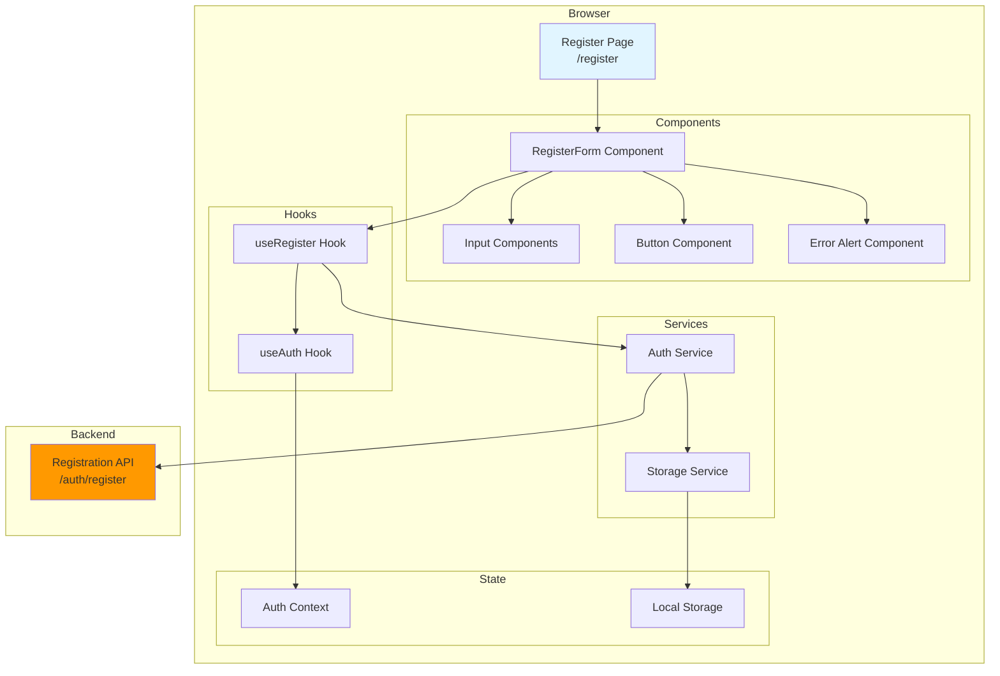
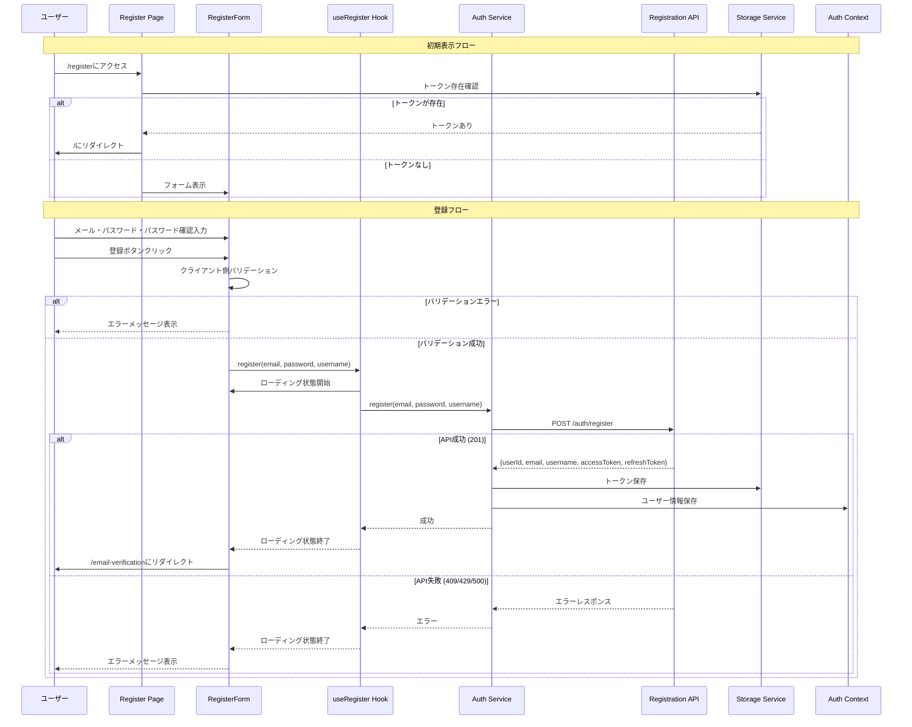

# 設計書: ユーザー登録画面

## 概要

本ドキュメントは、投票対局アプリケーションのユーザー登録画面機能の設計を定義します。この機能は、新規ユーザーがメールアドレスとパスワードを使用してアカウントを作成できるフロントエンド画面を提供します。ユーザー登録画面は、既存のユーザー登録API（spec 1で定義済み）と統合し、登録成功後にユーザーをメール確認案内ページに遷移させます。

### 主要な設計目標

- **ユーザビリティ**: 直感的なフォームデザイン、明確なエラーメッセージ、即座のフィードバック
- **アクセシビリティ**: ARIA属性による支援技術対応、キーボードナビゲーション、適切なフォーカス管理
- **セキュリティ**: パスワードのマスク表示、HTTPS通信、機密情報の適切な取り扱い
- **レスポンシブデザイン**: モバイル、タブレット、デスクトップでの最適な表示
- **バリデーション**: クライアント側での即座のフィードバック、サーバー側との連携

## アーキテクチャ

### システムコンポーネント図



### リクエストフロー



### コンポーネント説明

#### 1. Register Page（`/register`）

- Next.js App Routerのページコンポーネント
- 認証済みユーザーのリダイレクト処理
- RegisterFormコンポーネントのレンダリング

#### 2. RegisterForm Component

- メールアドレス、パスワード、パスワード確認の入力フィールド
- クライアント側バリデーション
- 登録ボタンとローディング状態の管理
- エラーメッセージの表示
- ログイン画面へのリンク

#### 3. useRegister Hook

- 登録ロジックのカプセル化
- フォーム状態の管理（loading、error）
- Auth Serviceの呼び出し
- エラーハンドリング

#### 4. useAuth Hook

- 認証状態の管理
- Auth Contextへのアクセス
- ユーザー情報の取得・更新

#### 5. Auth Service

- Registration APIとの通信
- トークンの保存・取得
- エラーレスポンスの変換

#### 6. Storage Service

- ローカルストレージへのアクセス
- トークンの保存・取得・削除

## コンポーネントとインターフェース

### 1. ページコンポーネント（`packages/web/src/app/register/page.tsx`）

```typescript
'use client';

import { useEffect, useState } from 'react';
import { useRouter } from 'next/navigation';
import { RegisterForm } from '@/components/auth/register-form';
import { getAccessToken } from '@/lib/services/storage-service';

export default function RegisterPage() {
  const router = useRouter();
  const [isChecking, setIsChecking] = useState(true);

  useEffect(() => {
    // 認証済みユーザーのリダイレクト
    const token = getAccessToken();
    if (token) {
      router.push('/');
    } else {
      setIsChecking(false);
    }
  }, [router]);

  if (isChecking) {
    return (
      <div className="flex min-h-screen items-center justify-center">
        <div className="text-center">
          <div className="animate-spin rounded-full h-8 w-8 border-b-2 border-gray-900 mx-auto" />
          <p className="mt-2 text-sm text-gray-600">読み込み中...</p>
        </div>
      </div>
    );
  }

  return (
    <div className="flex min-h-screen items-center justify-center bg-gray-50 px-4 py-12 sm:px-6 lg:px-8">
      <div className="w-full max-w-md space-y-8">
        <div>
          <h1 className="text-center text-3xl font-bold tracking-tight text-gray-900">
            アカウント作成
          </h1>
          <p className="mt-2 text-center text-sm text-gray-600">
            投票対局へようこそ
          </p>
        </div>
        <RegisterForm />
      </div>
    </div>
  );
}
```

### 2. RegisterFormコンポーネント（`packages/web/src/components/auth/register-form.tsx`）

```typescript
'use client';

import { useState } from 'react';
import { useRouter } from 'next/navigation';
import Link from 'next/link';
import { Eye, EyeOff } from 'lucide-react';
import { useRegister } from '@/lib/hooks/use-register';
import { Button } from '@/components/ui/button';
import { Input } from '@/components/ui/input';
import { Alert, AlertDescription } from '@/components/ui/alert';

interface FormErrors {
  email?: string;
  password?: string;
  passwordConfirmation?: string;
}

export function RegisterForm() {
  const router = useRouter();
  const { register, isLoading, error: apiError } = useRegister();

  const [email, setEmail] = useState('');
  const [password, setPassword] = useState('');
  const [passwordConfirmation, setPasswordConfirmation] = useState('');
  const [showPassword, setShowPassword] = useState(false);
  const [showPasswordConfirmation, setShowPasswordConfirmation] = useState(false);
  const [errors, setErrors] = useState<FormErrors>({});
  const [touched, setTouched] = useState({
    email: false,
    password: false,
    passwordConfirmation: false,
  });

  const validateEmail = (value: string): string | undefined => {
    if (!value.trim()) {
      return 'メールアドレスを入力してください';
    }
    if (!/^[^\s@]+@[^\s@]+\.[^\s@]+$/.test(value)) {
      return '有効なメールアドレスを入力してください';
    }
    return undefined;
  };

  const validatePassword = (value: string): string | undefined => {
    if (!value) {
      return 'パスワードを入力してください';
    }
    if (value.length < 8) {
      return 'パスワードは8文字以上である必要があります';
    }
    return undefined;
  };

  const validatePasswordConfirmation = (value: string): string | undefined => {
    if (!value) {
      return 'パスワード確認を入力してください';
    }
    if (value !== password) {
      return 'パスワードが一致しません';
    }
    return undefined;
  };

  const handleEmailBlur = () => {
    setTouched({ ...touched, email: true });
    const error = validateEmail(email);
    setErrors({ ...errors, email: error });
  };

  const handlePasswordBlur = () => {
    setTouched({ ...touched, password: true });
    const error = validatePassword(password);
    setErrors({ ...errors, password: error });
  };

  const handlePasswordConfirmationBlur = () => {
    setTouched({ ...touched, passwordConfirmation: true });
    const error = validatePasswordConfirmation(passwordConfirmation);
    setErrors({ ...errors, passwordConfirmation: error });
  };

  const validateForm = (): boolean => {
    const emailError = validateEmail(email);
    const passwordError = validatePassword(password);
    const passwordConfirmationError = validatePasswordConfirmation(passwordConfirmation);

    setErrors({
      email: emailError,
      password: passwordError,
      passwordConfirmation: passwordConfirmationError,
    });

    setTouched({
      email: true,
      password: true,
      passwordConfirmation: true,
    });

    return !emailError && !passwordError && !passwordConfirmationError;
  };

  const handleSubmit = async (e: React.FormEvent) => {
    e.preventDefault();

    if (!validateForm()) {
      return;
    }

    const success = await register(email, password);
    if (success) {
      router.push('/email-verification');
    }
  };

  const togglePasswordVisibility = () => {
    setShowPassword(!showPassword);
  };

  const togglePasswordConfirmationVisibility = () => {
    setShowPasswordConfirmation(!showPasswordConfirmation);
  };

  const hasErrors = !!(errors.email || errors.password || errors.passwordConfirmation);
  const isSubmitDisabled = isLoading || hasErrors;

  return (
    <form onSubmit={handleSubmit} className="mt-8 space-y-6" noValidate>
      {apiError && (
        <Alert variant="destructive" role="alert">
          <AlertDescription>{apiError}</AlertDescription>
        </Alert>
      )}

      <div className="space-y-4">
        <div>
          <label htmlFor="email" className="sr-only">
            メールアドレス
          </label>
          <Input
            id="email"
            name="email"
            type="email"
            autoComplete="email"
            required
            value={email}
            onChange={(e) => setEmail(e.target.value)}
            onBlur={handleEmailBlur}
            disabled={isLoading}
            placeholder="メールアドレス"
            aria-label="メールアドレス"
            aria-invalid={!!(touched.email && errors.email)}
            aria-describedby={touched.email && errors.email ? 'email-error' : undefined}
            className={touched.email && errors.email ? 'border-red-500' : ''}
          />
          {touched.email && errors.email && (
            <p id="email-error" className="mt-1 text-sm text-red-600" role="alert">
              {errors.email}
            </p>
          )}
        </div>

        <div>
          <label htmlFor="password" className="sr-only">
            パスワード
          </label>
          <div className="relative">
            <Input
              id="password"
              name="password"
              type={showPassword ? 'text' : 'password'}
              autoComplete="new-password"
              required
              value={password}
              onChange={(e) => setPassword(e.target.value)}
              onBlur={handlePasswordBlur}
              disabled={isLoading}
              placeholder="パスワード（8文字以上）"
              aria-label="パスワード"
              aria-invalid={!!(touched.password && errors.password)}
              aria-describedby={touched.password && errors.password ? 'password-error' : undefined}
              className={touched.password && errors.password ? 'border-red-500 pr-10' : 'pr-10'}
            />
            <button
              type="button"
              onClick={togglePasswordVisibility}
              disabled={isLoading}
              className="absolute inset-y-0 right-0 flex items-center pr-3"
              aria-label={showPassword ? 'パスワードを非表示' : 'パスワードを表示'}
            >
              {showPassword ? (
                <EyeOff className="h-5 w-5 text-gray-400" />
              ) : (
                <Eye className="h-5 w-5 text-gray-400" />
              )}
            </button>
          </div>
          {touched.password && errors.password && (
            <p id="password-error" className="mt-1 text-sm text-red-600" role="alert">
              {errors.password}
            </p>
          )}
        </div>

        <div>
          <label htmlFor="password-confirmation" className="sr-only">
            パスワード確認
          </label>
          <div className="relative">
            <Input
              id="password-confirmation"
              name="password-confirmation"
              type={showPasswordConfirmation ? 'text' : 'password'}
              autoComplete="new-password"
              required
              value={passwordConfirmation}
              onChange={(e) => setPasswordConfirmation(e.target.value)}
              onBlur={handlePasswordConfirmationBlur}
              disabled={isLoading}
              placeholder="パスワード確認"
              aria-label="パスワード確認"
              aria-invalid={!!(touched.passwordConfirmation && errors.passwordConfirmation)}
              aria-describedby={
                touched.passwordConfirmation && errors.passwordConfirmation
                  ? 'password-confirmation-error'
                  : undefined
              }
              className={
                touched.passwordConfirmation && errors.passwordConfirmation
                  ? 'border-red-500 pr-10'
                  : 'pr-10'
              }
            />
            <button
              type="button"
              onClick={togglePasswordConfirmationVisibility}
              disabled={isLoading}
              className="absolute inset-y-0 right-0 flex items-center pr-3"
              aria-label={
                showPasswordConfirmation ? 'パスワード確認を非表示' : 'パスワード確認を表示'
              }
            >
              {showPasswordConfirmation ? (
                <EyeOff className="h-5 w-5 text-gray-400" />
              ) : (
                <Eye className="h-5 w-5 text-gray-400" />
              )}
            </button>
          </div>
          {touched.passwordConfirmation && errors.passwordConfirmation && (
            <p
              id="password-confirmation-error"
              className="mt-1 text-sm text-red-600"
              role="alert"
            >
              {errors.passwordConfirmation}
            </p>
          )}
        </div>
      </div>

      <div>
        <Button
          type="submit"
          disabled={isSubmitDisabled}
          aria-disabled={isSubmitDisabled}
          className="w-full"
        >
          {isLoading ? '登録中...' : 'アカウント作成'}
        </Button>
      </div>

      <div className="text-center text-sm">
        <span className="text-gray-600">既にアカウントをお持ちの方</span>{' '}
        <Link href="/login" className="font-medium text-blue-600 hover:text-blue-500">
          ログイン
        </Link>
      </div>
    </form>
  );
}
```

### 3. useRegisterフック（`packages/web/src/lib/hooks/use-register.ts`）

```typescript
import { useState } from 'react';
import { useAuth } from './use-auth';
import { authService } from '@/lib/services/auth-service';

export function useRegister() {
  const [isLoading, setIsLoading] = useState(false);
  const [error, setError] = useState<string | null>(null);
  const { setUser } = useAuth();

  const register = async (email: string, password: string): Promise<boolean> => {
    setIsLoading(true);
    setError(null);

    try {
      const response = await authService.register(email, password);

      // ユーザー情報を認証コンテキストに保存
      setUser({
        userId: response.userId,
        email: response.email,
        username: response.username,
      });

      return true;
    } catch (err) {
      if (err instanceof Error) {
        setError(err.message);
      } else {
        setError('登録に失敗しました');
      }
      return false;
    } finally {
      setIsLoading(false);
    }
  };

  return { register, isLoading, error };
}
```

### 4. Auth Service拡張（`packages/web/src/lib/services/auth-service.ts`）

既存のAuth Serviceに登録メソッドを追加:

```typescript
interface RegisterResponse {
  userId: string;
  email: string;
  username: string;
  accessToken: string;
  refreshToken: string;
  expiresIn: number;
}

interface RegisterRequest {
  email: string;
  password: string;
  username: string;
}

class AuthService {
  // ... 既存のコード ...

  async register(email: string, password: string): Promise<RegisterResponse> {
    // ユーザー名をメールアドレスから生成（一時的な実装）
    const username = email.split('@')[0];

    const response = await fetch(`${this.apiUrl}/auth/register`, {
      method: 'POST',
      headers: {
        'Content-Type': 'application/json',
      },
      body: JSON.stringify({ email, password, username } as RegisterRequest),
    });

    if (!response.ok) {
      const errorData = await response.json().catch(() => ({}));

      switch (response.status) {
        case 409:
          throw new Error('このメールアドレスは既に登録されています');
        case 429:
          throw new Error('登録試行回数が上限に達しました。しばらくしてから再度お試しください');
        case 500:
          throw new Error('サーバーエラーが発生しました。しばらくしてから再度お試しください');
        default:
          if (!navigator.onLine) {
            throw new Error(
              'ネットワークエラーが発生しました。インターネット接続を確認してください'
            );
          }
          throw new Error(errorData.message || '登録に失敗しました。もう一度お試しください');
      }
    }

    const data: RegisterResponse = await response.json();

    // トークンをローカルストレージに保存
    storageService.setAccessToken(data.accessToken);
    storageService.setRefreshToken(data.refreshToken);

    return data;
  }
}
```

## データモデル

### RegisterRequest

```typescript
interface RegisterRequest {
  email: string;
  password: string;
  username: string;
}
```

### RegisterResponse（API）

```typescript
interface RegisterResponse {
  userId: string;
  email: string;
  username: string;
  accessToken: string;
  refreshToken: string;
  expiresIn: number; // 900秒（15分）
}
```

### User（クライアント側）

```typescript
interface User {
  userId: string;
  email: string;
  username: string;
}
```

### FormErrors

```typescript
interface FormErrors {
  email?: string;
  password?: string;
  passwordConfirmation?: string;
}
```

### ローカルストレージキー

- `vbg_access_token`: アクセストークン
- `vbg_refresh_token`: リフレッシュトークン

注意: パスワードとパスワード確認はローカルストレージに保存されません。

## 正確性プロパティ

_プロパティとは、システムのすべての有効な実行において真であるべき特性または動作です。本質的には、システムが何をすべきかについての形式的な記述です。プロパティは、人間が読める仕様と機械で検証可能な正確性保証との橋渡しとなります。_

### プロパティリフレクション

プレワーク分析を完了した後、論理的な冗長性を排除するためにプロパティをレビューしました:

**統合されたプロパティ:**

- 要件1.1-1.5: すべての初期表示要素を1つのexampleテストに統合
- 要件2.1, 2.2: メール形式検証を1つのpropertyに統合
- 要件2.3, 2.4: パスワード要件検証を1つのpropertyに統合
- 要件2.5, 2.6: パスワード確認検証を1つのpropertyに統合
- 要件3.2, 3.3: ローディング状態のUI変更を1つのexampleテストに統合
- 要件3.5, 3.6: APIエラーメッセージ表示を1つのpropertyに統合
- 要件4.1, 4.2, 4.4, 4.5: パスワード表示切り替えUI要素を1つのexampleテストに統合
- 要件5.1, 5.3, 5.4: ARIA属性とキーボードアクセシビリティを1つのexampleテストに統合
- 要件6.1, 6.3: レスポンシブレイアウトを1つのexampleテストに統合
- 要件7.3, 7.4: セキュリティデフォルト設定を1つのexampleテストに統合

**独立したプロパティとして維持:**

- 要件2.7: バリデーションエラー時のボタン無効化
- 要件3.1: 有効な入力でのAPI呼び出し
- 要件3.4: 登録成功時のナビゲーション
- 要件4.3: パスワード表示切り替えのラウンドトリップ
- 要件5.2: aria-describedbyによるエラーメッセージの関連付け
- 要件5.5: バリデーションエラーのスクリーンリーダー通知
- 要件6.2: タッチ可能要素の最小サイズ
- 要件7.2: パスワードのローカルストレージ非保存

**除外されたプロパティ:**

- 要件6.4: 「ユーザビリティの維持」は主観的で測定不可能
- 要件7.1: HTTPS通信はインフラレベルの設定

**最終プロパティ数:** 11個の独立したプロパティ + 複数のexampleテスト

### プロパティ1: メールアドレス形式検証

*任意の*メールアドレス入力に対して、フォーカスを失ったとき、有効なメール形式（@とドメインを含む）でない場合、エラーメッセージ「有効なメールアドレスを入力してください」を表示するべきです。

**検証: 要件 2.1, 2.2**

### プロパティ2: パスワード要件検証

*任意の*パスワード入力に対して、フォーカスを失ったとき、8文字未満の場合、エラーメッセージ「パスワードは8文字以上である必要があります」を表示するべきです。

**検証: 要件 2.3, 2.4**

### プロパティ3: パスワード確認検証

*任意の*パスワードとパスワード確認の組み合わせに対して、パスワード確認フィールドがフォーカスを失ったとき、両者が一致しない場合、エラーメッセージ「パスワードが一致しません」を表示するべきです。

**検証: 要件 2.5, 2.6**

### プロパティ4: バリデーションエラー時のボタン無効化

*任意の*フォーム状態に対して、メールアドレス、パスワード、またはパスワード確認のいずれかにバリデーションエラーが存在する場合、登録ボタンは無効化されるべきです。

**検証: 要件 2.7**

### プロパティ5: 有効な入力でのAPI呼び出し

*任意の*有効なメールアドレスとパスワードの組み合わせに対して、登録ボタンをクリックしたとき、入力されたメールアドレス、パスワード、およびメールアドレスから生成されたユーザー名を含むPOSTリクエストを登録APIに送信するべきです。

**検証: 要件 3.1**

### プロパティ6: 登録成功時のナビゲーション

*任意の*有効な登録リクエストに対して、登録APIが成功レスポンス（201ステータスコード）を返した場合、ユーザーをメール確認案内ページ（`/email-verification`）に遷移させるべきです。

**検証: 要件 3.4**

### プロパティ7: APIエラーメッセージの表示

*任意の*APIエラーレスポンス（409、429、500、ネットワークエラー）に対して、対応するユーザーフレンドリーなエラーメッセージを表示するべきです。409の場合は「このメールアドレスは既に登録されています」、429の場合は「登録試行回数が上限に達しました。しばらくしてから再度お試しください」、500の場合は「サーバーエラーが発生しました。しばらくしてから再度お試しください」、ネットワークエラーの場合は「ネットワークエラーが発生しました。インターネット接続を確認してください」を表示するべきです。

**検証: 要件 3.5, 3.6**

### プロパティ8: パスワード表示切り替えのラウンドトリップ

*任意の*パスワード入力状態に対して、パスワード表示切り替えボタンを2回クリックすると、元の表示状態（マスク表示）に戻るべきです。これはパスワードフィールドとパスワード確認フィールドの両方に適用されます。

**検証: 要件 4.3**

### プロパティ9: aria-describedbyによるエラーメッセージの関連付け

*任意の*バリデーションエラーメッセージに対して、対応する入力フィールドのaria-describedby属性がエラーメッセージのIDを参照し、支援技術がエラーメッセージを適切に関連付けられるべきです。

**検証: 要件 5.2**

### プロパティ10: バリデーションエラーのスクリーンリーダー通知

*任意の*バリデーションエラーメッセージに対して、role="alert"属性が設定され、スクリーンリーダーユーザーに適切に通知されるべきです。

**検証: 要件 5.5**

### プロパティ11: タッチ可能要素の最小サイズ

*任意の*インタラクティブ要素（登録ボタン、パスワード表示切り替えボタン、ログインリンク）に対して、最小タップ領域44x44pxを確保し、モバイルデバイスでのタッチ操作を容易にするべきです。

**検証: 要件 6.2**

### プロパティ12: パスワードのローカルストレージ非保存

*任意の*登録フロー実行に対して、パスワードおよびパスワード確認の値がブラウザのローカルストレージに保存されてはならないべきです。ローカルストレージに保存されるのはアクセストークンとリフレッシュトークンのみです。

**検証: 要件 7.2**

## エラーハンドリング

### エラー分類

#### 1. クライアント側バリデーションエラー

**原因:**

- メールアドレスフィールドが空
- メールアドレスの形式が無効
- パスワードフィールドが空
- パスワードが8文字未満
- パスワード確認フィールドが空
- パスワード確認がパスワードと一致しない

**表示:**

- フィールド下部に赤色のエラーメッセージを表示
- フィールドの枠線を赤色に変更
- role="alert"属性を設定してスクリーンリーダーに通知
- aria-describedby属性でエラーメッセージを関連付け

**例:**

```
メールアドレスを入力してください
有効なメールアドレスを入力してください
パスワードを入力してください
パスワードは8文字以上である必要があります
パスワード確認を入力してください
パスワードが一致しません
```

#### 2. メールアドレス重複エラー（409）

**原因:**

- メールアドレスが既に登録されている

**表示:**

- フォーム上部に赤色のアラートボックスを表示
- エラーメッセージ: 「このメールアドレスは既に登録されています」

#### 3. レート制限エラー（429）

**原因:**

- 登録試行回数が上限に達した

**表示:**

- フォーム上部に赤色のアラートボックスを表示
- エラーメッセージ: 「登録試行回数が上限に達しました。しばらくしてから再度お試しください」

#### 4. サーバーエラー（500）

**原因:**

- バックエンドの内部エラー

**表示:**

- フォーム上部に赤色のアラートボックスを表示
- エラーメッセージ: 「サーバーエラーが発生しました。しばらくしてから再度お試しください」

#### 5. ネットワークエラー

**原因:**

- インターネット接続の問題
- APIサーバーへの接続失敗

**表示:**

- フォーム上部に赤色のアラートボックスを表示
- エラーメッセージ: 「ネットワークエラーが発生しました。インターネット接続を確認してください」

**検出方法:**

```typescript
if (!navigator.onLine) {
  throw new Error('ネットワークエラーが発生しました。インターネット接続を確認してください');
}
```

### エラーハンドリング戦略

#### バリデーションエラー

- フォーム送信前にクライアント側でバリデーション
- エラーがある場合はAPI呼び出しを行わない
- 各フィールドの下にエラーメッセージを表示
- フォームは有効なまま（ユーザーが修正可能）
- フィールドがフォーカスを失ったときにバリデーション実行（onBlur）
- エラーがある場合は登録ボタンを無効化

#### APIエラー

- try-catchブロックでエラーをキャッチ
- HTTPステータスコードに基づいてエラーメッセージを決定
- フォーム上部にアラートボックスを表示
- ローディング状態を解除し、フォームを再度有効化

#### エラー後の状態管理

- エラーメッセージを表示
- ローディング状態を解除（isLoading = false）
- ボタンとフィールドを再度有効化
- ユーザーが修正して再試行できるようにする

## テスト戦略

### デュアルテストアプローチ

本機能では、ユニットテストとプロパティベーステストの両方を実装します。これらは相補的であり、包括的なカバレッジに必要です。

#### ユニットテスト

**目的:**

- 特定の例とエッジケースの検証
- UIコンポーネントの統合ポイントの検証
- ユーザーインタラクションの検証

**対象:**

- RegisterFormコンポーネント
  - 初期表示（フォーム要素の存在確認）
  - バリデーションエラーの表示
  - ローディング状態のUI変更
  - 登録成功フロー
  - ログインリンク
  - パスワード表示切り替え
  - ARIA属性
  - レスポンシブレイアウト
  - セキュリティデフォルト設定
- RegisterPageコンポーネント
  - 認証済みユーザーのリダイレクト
- useRegisterフック
  - 登録ロジック
  - エラーハンドリング
- Auth Service
  - API呼び出し
  - トークン保存
  - エラーレスポンスの変換
    **テストライブラリ:**

- Vitest: テストランナー
- React Testing Library: コンポーネントテスト
- @testing-library/user-event: ユーザーインタラクションのシミュレーション

#### プロパティベーステスト

**目的:**

- ランダム化による包括的な入力カバレッジ
- すべての入力に対して保持される普遍的なプロパティの検証

**設定:**

- テストライブラリ: fast-check（TypeScript/JavaScript用）
- 最小イテレーション数: 100回
- 各テストは設計ドキュメントのプロパティを参照

**タグ形式:**

```typescript
/**
 * Feature: user-registration-screen, Property 1: メールアドレス形式検証
 *
 * 任意のメールアドレス入力に対して、フォーカスを失ったとき、有効なメール形式
 * （@とドメインを含む）でない場合、エラーメッセージ「有効なメールアドレスを
 * 入力してください」を表示するべきです。
 */
```

**各プロパティは単一のプロパティベーステストで実装する。**

### テストファイル構成

```
packages/web/src/
├── app/
│   └── register/
│       └── page.test.tsx                    # RegisterPageのユニットテスト
├── components/
│   └── auth/
│       ├── register-form.test.tsx           # RegisterFormのユニットテスト
│       └── register-form.property.test.tsx  # プロパティ1-12のテスト
└── lib/
    ├── hooks/
    │   └── use-register.test.tsx            # useRegisterのユニットテスト
    └── services/
        └── auth-service.test.ts             # Auth Service登録メソッドのテスト
```

### テストカバレッジ目標

- ユニットテスト: 80%以上のコードカバレッジ
- プロパティベーステスト: すべての正確性プロパティ（12個）をカバー
- E2Eテスト（Playwright）: 主要なユーザーフロー（登録成功、登録失敗）

### テスト実行

```bash
# ユニットテスト実行
pnpm --filter @vote-board-game/web test

# ウォッチモード
pnpm --filter @vote-board-game/web test:watch

# カバレッジレポート生成
pnpm --filter @vote-board-game/web test:coverage

# E2Eテスト実行（将来）
pnpm --filter @vote-board-game/web test:e2e
```

## セキュリティ考慮事項

### 1. パスワードの取り扱い

- パスワードフィールドは`type="password"`でマスク表示
- パスワードをコンソールログに出力しない
- パスワードをURLパラメータに含めない
- パスワードはHTTPS経由でのみ送信
- パスワードとパスワード確認はローカルストレージに保存しない

### 2. トークンの保存

- アクセストークンとリフレッシュトークンをローカルストレージに保存
- トークンは短期間有効（アクセストークン: 15分）
- XSS攻撃のリスクを認識（将来的にはHttpOnly Cookieの検討）

### 3. HTTPS通信

- すべてのAPI通信はHTTPS経由
- 本番環境ではHTTPSを強制

### 4. エラーメッセージ

- メールアドレス重複時は明確なメッセージを返す（ユーザビリティ優先）
- 詳細なエラー情報をクライアントに返さない

### 5. レート制限

- バックエンドのレート制限に依存
- クライアント側では追加の制限なし
