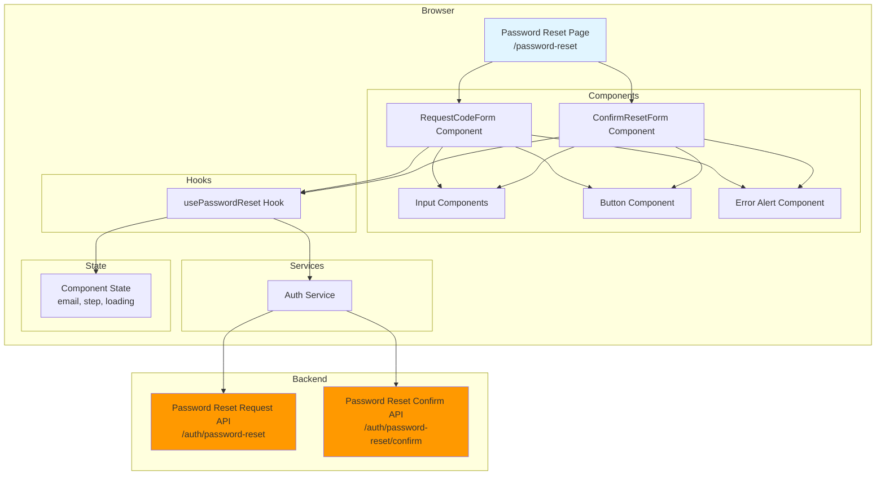
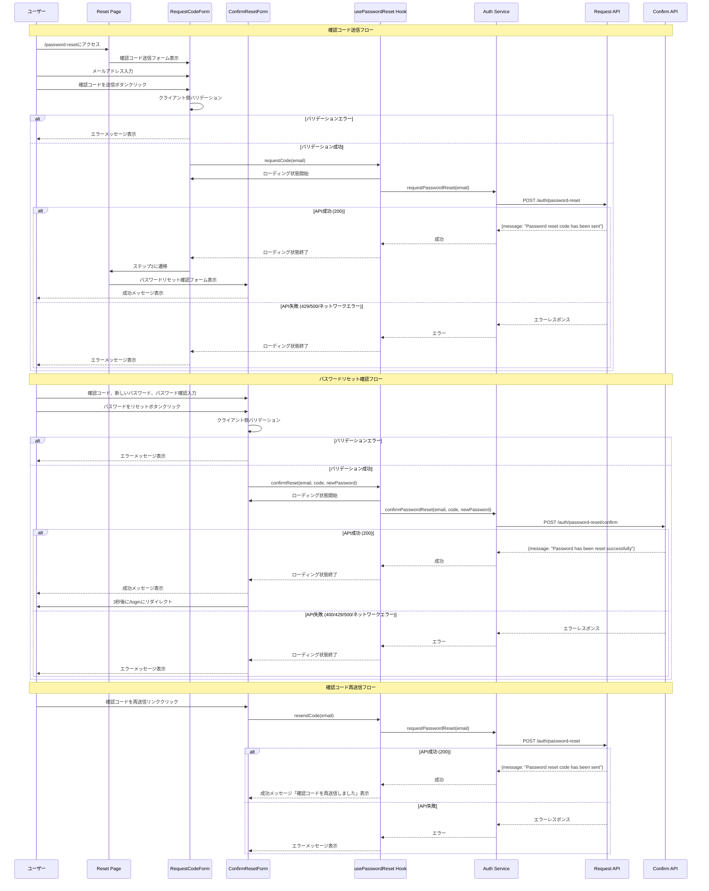

# 設計書: パスワードリセット画面

## 概要

本ドキュメントは、投票対局アプリケーションのパスワードリセット画面機能の設計を定義します。この機能は、パスワードを忘れたユーザーがメールアドレスを使用して確認コードを受け取り、新しいパスワードを設定できるフロントエンド画面を提供します。パスワードリセット画面は、既存のパスワードリセットAPI（spec 4で定義済み）と統合し、2段階のフロー（確認コード送信→パスワードリセット確認）を実装します。

### 主要な設計目標

- **ユーザビリティ**: 2段階フローの明確な案内、即座のフィードバック、確認コード再送信機能
- **アクセシビリティ**: ARIA属性による支援技術対応、キーボードナビゲーション、適切なフォーカス管理
- **セキュリティ**: パスワードのマスク表示、HTTPS通信、機密情報の適切な取り扱い、ページ離脱時のデータクリア
- **レスポンシブデザイン**: モバイル、タブレット、デスクトップでの最適な表示
- **バリデーション**: クライアント側での即座のフィードバック、サーバー側との連携

## アーキテクチャ

### システムコンポーネント図



### リクエストフロー



### コンポーネント説明

#### 1. Password Reset Page（`/password-reset`）

- Next.js App Routerのページコンポーネント
- 2段階フローの状態管理（step: 'request' | 'confirm'）
- メールアドレスの保持
- RequestCodeFormまたはConfirmResetFormのレンダリング

#### 2. RequestCodeForm Component

- メールアドレス入力フィールド
- クライアント側バリデーション
- 確認コード送信ボタンとローディング状態の管理
- エラーメッセージの表示
- ログイン画面へのリンク

#### 3. ConfirmResetForm Component

- 確認コード、新しいパスワード、パスワード確認の入力フィールド
- クライアント側バリデーション
- パスワードリセットボタンとローディング状態の管理
- パスワード表示切り替えボタン
- 確認コード再送信リンク
- エラーメッセージの表示
- 成功時のリダイレクト処理

#### 4. usePasswordReset Hook

- パスワードリセットロジックのカプセル化
- フォーム状態の管理（loading、error、step）
- Auth Serviceの呼び出し
- エラーハンドリング

#### 5. Auth Service

- Password Reset APIとの通信
- エラーレスポンスの変換

## コンポーネントとインターフェース

### 1. ページコンポーネント（`packages/web/src/app/password-reset/page.tsx`）

```typescript
'use client';

import { useState, useEffect } from 'react';
import { RequestCodeForm } from '@/components/auth/request-code-form';
import { ConfirmResetForm } from '@/components/auth/confirm-reset-form';

type Step = 'request' | 'confirm';

export default function PasswordResetPage() {
  const [step, setStep] = useState<Step>('request');
  const [email, setEmail] = useState('');

  // ページ離脱時にフォームデータをクリア
  useEffect(() => {
    return () => {
      setEmail('');
    };
  }, []);

  const handleCodeSent = (sentEmail: string) => {
    setEmail(sentEmail);
    setStep('confirm');
  };

  return (
    <div className="flex min-h-screen items-center justify-center bg-gray-50 px-4 py-12 sm:px-6 lg:px-8">
      <div className="w-full max-w-md space-y-8">
        <div>
          <h1 className="text-center text-3xl font-bold tracking-tight text-gray-900">
            パスワードリセット
          </h1>
        </div>
        {step === 'request' ? (
          <RequestCodeForm onCodeSent={handleCodeSent} />
        ) : (
          <ConfirmResetForm email={email} />
        )}
      </div>
    </div>
  );
}
```

### 2. RequestCodeFormコンポーネント（`packages/web/src/components/auth/request-code-form.tsx`）

```typescript
'use client';

import { useState } from 'react';
import Link from 'next/link';
import { usePasswordReset } from '@/lib/hooks/use-password-reset';
import { Button } from '@/components/ui/button';
import { Input } from '@/components/ui/input';
import { Alert, AlertDescription } from '@/components/ui/alert';

interface RequestCodeFormProps {
  onCodeSent: (email: string) => void;
}

export function RequestCodeForm({ onCodeSent }: RequestCodeFormProps) {
  const { requestCode, isLoading, error: apiError } = usePasswordReset();

  const [email, setEmail] = useState('');
  const [errors, setErrors] = useState<{ email?: string }>({});
  const [touched, setTouched] = useState({ email: false });

  const validateEmail = (value: string): string | undefined => {
    if (!value.trim()) {
      return 'メールアドレスを入力してください';
    }
    if (!/^[^\s@]+@[^\s@]+\.[^\s@]+$/.test(value)) {
      return '有効なメールアドレスを入力してください';
    }
    return undefined;
  };

  const handleEmailBlur = () => {
    setTouched({ email: true });
    const error = validateEmail(email);
    setErrors({ email: error });
  };

  const validateForm = (): boolean => {
    const emailError = validateEmail(email);
    setErrors({ email: emailError });
    setTouched({ email: true });
    return !emailError;
  };

  const handleSubmit = async (e: React.FormEvent) => {
    e.preventDefault();

    if (!validateForm()) {
      return;
    }

    const success = await requestCode(email);
    if (success) {
      onCodeSent(email);
    }
  };

  const isSubmitDisabled = isLoading || !!errors.email;

  return (
    <form onSubmit={handleSubmit} className="mt-8 space-y-6" noValidate>
      <div className="space-y-2">
        <p className="text-sm text-gray-600">
          登録されているメールアドレスを入力してください。パスワードリセット用の確認コードを送信します。
        </p>
      </div>

      {apiError && (
        <Alert variant="destructive" role="alert">
          <AlertDescription>{apiError}</AlertDescription>
        </Alert>
      )}

      <div className="space-y-4">
        <div>
          <label htmlFor="email" className="sr-only">
            メールアドレス
          </label>
          <Input
            id="email"
            name="email"
            type="email"
            autoComplete="email"
            required
            value={email}
            onChange={(e) => setEmail(e.target.value)}
            onBlur={handleEmailBlur}
            disabled={isLoading}
            placeholder="メールアドレス"
            aria-label="メールアドレス"
            aria-invalid={!!(touched.email && errors.email)}
            aria-describedby={touched.email && errors.email ? 'email-error' : undefined}
            className={touched.email && errors.email ? 'border-red-500' : ''}
          />
          {touched.email && errors.email && (
            <p id="email-error" className="mt-1 text-sm text-red-600" role="alert">
              {errors.email}
            </p>
          )}
        </div>
      </div>

      <div>
        <Button
          type="submit"
          disabled={isSubmitDisabled}
          aria-disabled={isSubmitDisabled}
          className="w-full"
        >
          {isLoading ? '送信中...' : '確認コードを送信'}
        </Button>
      </div>

      <div className="text-center text-sm">
        <Link href="/login" className="font-medium text-blue-600 hover:text-blue-500">
          ログイン画面に戻る
        </Link>
      </div>
    </form>
  );
}
```

### 3. ConfirmResetFormコンポーネント（`packages/web/src/components/auth/confirm-reset-form.tsx`）

```typescript
'use client';

import { useState } from 'react';
import { useRouter } from 'next/navigation';
import { Eye, EyeOff } from 'lucide-react';
import { usePasswordReset } from '@/lib/hooks/use-password-reset';
import { Button } from '@/components/ui/button';
import { Input } from '@/components/ui/input';
import { Alert, AlertDescription } from '@/components/ui/alert';

interface ConfirmResetFormProps {
  email: string;
}

interface FormErrors {
  confirmationCode?: string;
  newPassword?: string;
  passwordConfirmation?: string;
}

export function ConfirmResetForm({ email }: ConfirmResetFormProps) {
  const router = useRouter();
  const { confirmReset, resendCode, isLoading, error: apiError, successMessage } = usePasswordReset();

  const [confirmationCode, setConfirmationCode] = useState('');
  const [newPassword, setNewPassword] = useState('');
  const [passwordConfirmation, setPasswordConfirmation] = useState('');
  const [showNewPassword, setShowNewPassword] = useState(false);
  const [showPasswordConfirmation, setShowPasswordConfirmation] = useState(false);
  const [errors, setErrors] = useState<FormErrors>({});
  const [touched, setTouched] = useState({
    confirmationCode: false,
    newPassword: false,
    passwordConfirmation: false,
  });
  const [isResending, setIsResending] = useState(false);

  const validateConfirmationCode = (value: string): string | undefined => {
    if (!value.trim()) {
      return '確認コードを入力してください';
    }
    if (!/^\d{6}$/.test(value)) {
      return '確認コードは6桁の数字である必要があります';
    }
    return undefined;
  };

  const validateNewPassword = (value: string): string | undefined => {
    if (!value) {
      return '新しいパスワードを入力してください';
    }
    if (value.length < 8) {
      return 'パスワードは8文字以上である必要があります';
    }
    if (!/[A-Z]/.test(value)) {
      return 'パスワードには大文字を含める必要があります';
    }
    if (!/[a-z]/.test(value)) {
      return 'パスワードには小文字を含める必要があります';
    }
    if (!/[0-9]/.test(value)) {
      return 'パスワードには数字を含める必要があります';
    }
    return undefined;
  };

  const validatePasswordConfirmation = (value: string): string | undefined => {
    if (value !== newPassword) {
      return 'パスワードが一致しません';
    }
    return undefined;
  };

  const handleConfirmationCodeBlur = () => {
    setTouched({ ...touched, confirmationCode: true });
    const error = validateConfirmationCode(confirmationCode);
    setErrors({ ...errors, confirmationCode: error });
  };

  const handleNewPasswordBlur = () => {
    setTouched({ ...touched, newPassword: true });
    const error = validateNewPassword(newPassword);
    setErrors({ ...errors, newPassword: error });
  };

  const handlePasswordConfirmationBlur = () => {
    setTouched({ ...touched, passwordConfirmation: true });
    const error = validatePasswordConfirmation(passwordConfirmation);
    setErrors({ ...errors, passwordConfirmation: error });
  };

  const validateForm = (): boolean => {
    const codeError = validateConfirmationCode(confirmationCode);
    const passwordError = validateNewPassword(newPassword);
    const confirmationError = validatePasswordConfirmation(passwordConfirmation);

    setErrors({
      confirmationCode: codeError,
      newPassword: passwordError,
      passwordConfirmation: confirmationError,
    });

    setTouched({
      confirmationCode: true,
      newPassword: true,
      passwordConfirmation: true,
    });

    return !codeError && !passwordError && !confirmationError;
  };

  const handleSubmit = async (e: React.FormEvent) => {
    e.preventDefault();

    if (!validateForm()) {
      return;
    }

    const success = await confirmReset(email, confirmationCode, newPassword);
    if (success) {
      // 3秒後にログイン画面にリダイレクト
      setTimeout(() => {
        router.push('/login');
      }, 3000);
    }
  };

  const handleResendCode = async () => {
    setIsResending(true);
    await resendCode(email);
    setIsResending(false);
  };

  const hasErrors = !!(errors.confirmationCode || errors.newPassword || errors.passwordConfirmation);
  const isSubmitDisabled = isLoading || hasErrors;

  return (
    <form onSubmit={handleSubmit} className="mt-8 space-y-6" noValidate>
      {successMessage && (
        <Alert className="bg-green-50 border-green-200" role="alert">
          <AlertDescription className="text-green-800">{successMessage}</AlertDescription>
        </Alert>
      )}

      {apiError && (
        <Alert variant="destructive" role="alert">
          <AlertDescription>{apiError}</AlertDescription>
        </Alert>
      )}

      <div className="space-y-4">
        <div>
          <label htmlFor="confirmation-code" className="sr-only">
            確認コード
          </label>
          <Input
            id="confirmation-code"
            name="confirmation-code"
            type="text"
            inputMode="numeric"
            pattern="[0-9]*"
            maxLength={6}
            required
            value={confirmationCode}
            onChange={(e) => setConfirmationCode(e.target.value.replace(/\D/g, ''))}
            onBlur={handleConfirmationCodeBlur}
            disabled={isLoading}
            placeholder="6桁の確認コード"
            aria-label="確認コード"
            aria-invalid={!!(touched.confirmationCode && errors.confirmationCode)}
            aria-describedby={
              touched.confirmationCode && errors.confirmationCode
                ? 'confirmation-code-error'
                : undefined
            }
            className={touched.confirmationCode && errors.confirmationCode ? 'border-red-500' : ''}
          />
          {touched.confirmationCode && errors.confirmationCode && (
            <p id="confirmation-code-error" className="mt-1 text-sm text-red-600" role="alert">
              {errors.confirmationCode}
            </p>
          )}
        </div>

        <div>
          <label htmlFor="new-password" className="sr-only">
            新しいパスワード
          </label>
          <div className="relative">
            <Input
              id="new-password"
              name="new-password"
              type={showNewPassword ? 'text' : 'password'}
              autoComplete="new-password"
              required
              value={newPassword}
              onChange={(e) => setNewPassword(e.target.value)}
              onBlur={handleNewPasswordBlur}
              disabled={isLoading}
              placeholder="新しいパスワード"
              aria-label="新しいパスワード"
              aria-invalid={!!(touched.newPassword && errors.newPassword)}
              aria-describedby={
                touched.newPassword && errors.newPassword ? 'new-password-error' : undefined
              }
              className={touched.newPassword && errors.newPassword ? 'border-red-500 pr-10' : 'pr-10'}
            />
            <button
              type="button"
              onClick={() => setShowNewPassword(!showNewPassword)}
              disabled={isLoading}
              className="absolute inset-y-0 right-0 flex items-center pr-3"
              aria-label={showNewPassword ? 'パスワードを非表示' : 'パスワードを表示'}
            >
              {showNewPassword ? (
                <EyeOff className="h-5 w-5 text-gray-400" />
              ) : (
                <Eye className="h-5 w-5 text-gray-400" />
              )}
            </button>
          </div>
          {touched.newPassword && errors.newPassword && (
            <p id="new-password-error" className="mt-1 text-sm text-red-600" role="alert">
              {errors.newPassword}
            </p>
          )}
          <p className="mt-1 text-xs text-gray-500">8文字以上、大文字・小文字・数字を含む</p>
        </div>

        <div>
          <label htmlFor="password-confirmation" className="sr-only">
            新しいパスワード確認
          </label>
          <div className="relative">
            <Input
              id="password-confirmation"
              name="password-confirmation"
              type={showPasswordConfirmation ? 'text' : 'password'}
              autoComplete="new-password"
              required
              value={passwordConfirmation}
              onChange={(e) => setPasswordConfirmation(e.target.value)}
              onBlur={handlePasswordConfirmationBlur}
              disabled={isLoading}
              placeholder="新しいパスワード（確認）"
              aria-label="新しいパスワード確認"
              aria-invalid={!!(touched.passwordConfirmation && errors.passwordConfirmation)}
              aria-describedby={
                touched.passwordConfirmation && errors.passwordConfirmation
                  ? 'password-confirmation-error'
                  : undefined
              }
              className={
                touched.passwordConfirmation && errors.passwordConfirmation
                  ? 'border-red-500 pr-10'
                  : 'pr-10'
              }
            />
            <button
              type="button"
              onClick={() => setShowPasswordConfirmation(!showPasswordConfirmation)}
              disabled={isLoading}
              className="absolute inset-y-0 right-0 flex items-center pr-3"
              aria-label={
                showPasswordConfirmation ? 'パスワード確認を非表示' : 'パスワード確認を表示'
              }
            >
              {showPasswordConfirmation ? (
                <EyeOff className="h-5 w-5 text-gray-400" />
              ) : (
                <Eye className="h-5 w-5 text-gray-400" />
              )}
            </button>
          </div>
          {touched.passwordConfirmation && errors.passwordConfirmation && (
            <p
              id="password-confirmation-error"
              className="mt-1 text-sm text-red-600"
              role="alert"
            >
              {errors.passwordConfirmation}
            </p>
          )}
        </div>
      </div>

      <div>
        <Button
          type="submit"
          disabled={isSubmitDisabled}
          aria-disabled={isSubmitDisabled}
          className="w-full"
        >
          {isLoading ? 'リセット中...' : 'パスワードをリセット'}
        </Button>
      </div>

      <div className="text-center text-sm">
        <button
          type="button"
          onClick={handleResendCode}
          disabled={isResending || isLoading}
          className="font-medium text-blue-600 hover:text-blue-500 disabled:text-gray-400"
        >
          {isResending ? '送信中...' : '確認コードを再送信'}
        </button>
      </div>
    </form>
  );
}
```

### 4. usePasswordResetフック（`packages/web/src/lib/hooks/use-password-reset.ts`）

```typescript
import { useState } from 'react';
import { authService } from '@/lib/services/auth-service';

export function usePasswordReset() {
  const [isLoading, setIsLoading] = useState(false);
  const [error, setError] = useState<string | null>(null);
  const [successMessage, setSuccessMessage] = useState<string | null>(null);

  const requestCode = async (email: string): Promise<boolean> => {
    setIsLoading(true);
    setError(null);
    setSuccessMessage(null);

    try {
      await authService.requestPasswordReset(email);
      setSuccessMessage('確認コードをメールで送信しました。メールをご確認ください。');
      return true;
    } catch (err) {
      if (err instanceof Error) {
        setError(err.message);
      } else {
        setError('確認コードの送信に失敗しました');
      }
      return false;
    } finally {
      setIsLoading(false);
    }
  };

  const confirmReset = async (
    email: string,
    confirmationCode: string,
    newPassword: string
  ): Promise<boolean> => {
    setIsLoading(true);
    setError(null);
    setSuccessMessage(null);

    try {
      await authService.confirmPasswordReset(email, confirmationCode, newPassword);
      setSuccessMessage('パスワードがリセットされました。新しいパスワードでログインしてください。');
      return true;
    } catch (err) {
      if (err instanceof Error) {
        setError(err.message);
      } else {
        setError('パスワードのリセットに失敗しました');
      }
      return false;
    } finally {
      setIsLoading(false);
    }
  };

  const resendCode = async (email: string): Promise<boolean> => {
    setError(null);
    setSuccessMessage(null);

    try {
      await authService.requestPasswordReset(email);
      setSuccessMessage('確認コードを再送信しました');
      return true;
    } catch (err) {
      if (err instanceof Error) {
        setError(err.message);
      } else {
        setError('確認コードの再送信に失敗しました');
      }
      return false;
    }
  };

  return { requestCode, confirmReset, resendCode, isLoading, error, successMessage };
}
```

### 5. Auth Service拡張（`packages/web/src/lib/services/auth-service.ts`に追加）

既存のAuth Serviceにパスワードリセットメソッドを追加:

```typescript
interface PasswordResetRequest {
  email: string;
}

interface PasswordResetResponse {
  message: string;
}

interface PasswordResetConfirmRequest {
  email: string;
  confirmationCode: string;
  newPassword: string;
}

interface PasswordResetConfirmResponse {
  message: string;
}

class AuthService {
  // ... 既存のコード ...

  async requestPasswordReset(email: string): Promise<void> {
    const response = await fetch(`${this.apiUrl}/auth/password-reset`, {
      method: 'POST',
      headers: {
        'Content-Type': 'application/json',
      },
      body: JSON.stringify({ email } as PasswordResetRequest),
    });

    if (!response.ok) {
      const errorData = await response.json().catch(() => ({}));

      switch (response.status) {
        case 429:
          throw new Error('リクエスト回数が上限に達しました。しばらくしてから再度お試しください');
        case 500:
          throw new Error('サーバーエラーが発生しました。しばらくしてから再度お試しください');
        default:
          if (!navigator.onLine) {
            throw new Error(
              'ネットワークエラーが発生しました。インターネット接続を確認してください'
            );
          }
          throw new Error(errorData.message || '確認コードの送信に失敗しました');
      }
    }

    // 成功時は何も返さない
  }

  async confirmPasswordReset(
    email: string,
    confirmationCode: string,
    newPassword: string
  ): Promise<void> {
    const response = await fetch(`${this.apiUrl}/auth/password-reset/confirm`, {
      method: 'POST',
      headers: {
        'Content-Type': 'application/json',
      },
      body: JSON.stringify({
        email,
        confirmationCode,
        newPassword,
      } as PasswordResetConfirmRequest),
    });

    if (!response.ok) {
      const errorData = await response.json().catch(() => ({}));

      switch (response.status) {
        case 400:
          if (errorData.error === 'INVALID_CODE') {
            throw new Error('確認コードが無効または期限切れです');
          }
          if (errorData.error === 'VALIDATION_ERROR') {
            throw new Error(errorData.message || 'バリデーションエラーが発生しました');
          }
          throw new Error(errorData.message || 'パスワードのリセットに失敗しました');
        case 429:
          throw new Error('リクエスト回数が上限に達しました。しばらくしてから再度お試しください');
        case 500:
          throw new Error('サーバーエラーが発生しました。しばらくしてから再度お試しください');
        default:
          if (!navigator.onLine) {
            throw new Error(
              'ネットワークエラーが発生しました。インターネット接続を確認してください'
            );
          }
          throw new Error(errorData.message || 'パスワードのリセットに失敗しました');
      }
    }

    // 成功時は何も返さない
  }
}
```

## データモデル

### PasswordResetRequest

```typescript
interface PasswordResetRequest {
  email: string;
}
```

### PasswordResetResponse（API）

```typescript
interface PasswordResetResponse {
  message: 'Password reset code has been sent';
}
```

### PasswordResetConfirmRequest

```typescript
interface PasswordResetConfirmRequest {
  email: string;
  confirmationCode: string; // 6桁の数字
  newPassword: string; // 8文字以上、大文字・小文字・数字を含む
}
```

### PasswordResetConfirmResponse（API）

```typescript
interface PasswordResetConfirmResponse {
  message: 'Password has been reset successfully';
}
```

### FormErrors

```typescript
interface FormErrors {
  email?: string;
  confirmationCode?: string;
  newPassword?: string;
  passwordConfirmation?: string;
}
```

### コンポーネント状態

- `step`: 'request' | 'confirm' - 現在のフロー段階
- `email`: string - 保持されたメールアドレス
- `isLoading`: boolean - API呼び出し中かどうか
- `error`: string | null - エラーメッセージ
- `successMessage`: string | null - 成功メッセージ

注意: パスワード、パスワード確認、確認コードはローカルストレージに保存されません。

## 正確性プロパティ

_プロパティとは、システムのすべての有効な実行において真であるべき特性または動作です。本質的には、システムが何をすべきかについての形式的な記述です。プロパティは、人間が読める仕様と機械で検証可能な正確性保証との橋渡しとなります。_

### プロパティリフレクション

プレワーク分析を完了した後、論理的な冗長性を排除するためにプロパティをレビューしました:

**統合されたプロパティ:**

- 要件1.1-1.5: すべての初期表示要素（確認コード送信フォーム）を1つのexampleテストに統合
- 要件2.1, 2.2: メールアドレスバリデーションを1つのpropertyに統合
- 要件3.2, 3.3, 3.4: 確認コード送信時のローディング状態UI変更を1つのexampleテストに統合
- 要件4.1, 4.2, 4.3: 確認コード送信成功時のUI状態遷移を1つのexampleテストに統合
- 要件5.1, 5.2, 5.3: 確認コード送信失敗時のエラーメッセージ表示を1つのpropertyに統合
- 要件6.1-6.8: すべての確認フォーム表示要素を1つのexampleテストに統合
- 要件7.1, 7.2: 確認コードバリデーションを1つのpropertyに統合
- 要件7.3, 7.4, 7.5, 7.6, 7.7: パスワード要件バリデーションを1つのpropertyに統合
- 要件8.2, 8.3, 8.4: パスワードリセット確認時のローディング状態UI変更を1つのexampleテストに統合
- 要件9.1, 9.2: パスワードリセット成功時のUI状態とリダイレクトを1つのexampleテストに統合
- 要件10.1, 10.2, 10.3, 10.4, 10.5: パスワードリセット確認失敗時のエラーメッセージ表示を1つのpropertyに統合
- 要件11.1, 11.3, 11.4: 確認コード再送信UI要素を1つのexampleテストに統合
- 要件12.1, 12.2, 12.5: パスワード表示切り替えUI要素を1つのexampleテストに統合
- 要件12.3, 12.4: パスワード表示切り替えのラウンドトリップを1つのpropertyに統合
- 要件14.1, 14.2, 14.3, 14.4, 14.7: ARIA label属性を1つのexampleテストに統合
- 要件15.1, 15.2, 15.3: レスポンシブレイアウトを1つのexampleテストに統合
- 要件16.1, 16.2: 機密データのログ保護を1つのpropertyに統合
- 要件16.3, 16.5: セキュリティデフォルト設定を1つのexampleテストに統合

**独立したプロパティとして維持:**

- 要件2.3: バリデーションエラー時のAPI呼び出し防止（確認コード送信）
- 要件3.1: 有効なメールアドレスでのAPI呼び出し
- 要件4.4: メールアドレスの保持
- 要件5.4: エラー後のUI状態復元（確認コード送信）
- 要件7.8: パスワード確認の一致検証
- 要件7.9: バリデーションエラー時のAPI呼び出し防止（パスワードリセット確認）
- 要件8.1: 有効な入力でのAPI呼び出し（パスワードリセット確認）
- 要件10.6: エラー後のUI状態復元（パスワードリセット確認）
- 要件11.2: 確認コード再送信のAPI呼び出し
- 要件13.1: ログイン画面へのナビゲーション
- 要件14.5: バリデーションエラーのrole="alert"属性
- 要件14.6: 無効化ボタンのaria-disabled属性
- 要件15.4: タッチ可能要素の最小サイズ

**除外されたプロパティ:**

- 要件16.4: HTTPS通信はインフラレベルの設定

**最終プロパティ数:** 13個の独立したプロパティ + 複数のexampleテスト

### プロパティ1: メールアドレスバリデーション

*任意の*メールアドレス入力に対して、フォーカスを失ったとき、空または有効なメール形式（@とドメインを含む）でない場合、対応するエラーメッセージ（「メールアドレスを入力してください」または「有効なメールアドレスを入力してください」）を表示するべきです。

**検証: 要件 2.1, 2.2**

### プロパティ2: バリデーションエラー時のAPI呼び出し防止（確認コード送信）

*任意の*フォーム状態に対して、メールアドレスにバリデーションエラーが存在する場合、「確認コードを送信」ボタンをクリックしてもパスワードリセット要求APIを呼び出してはならないべきです。

**検証: 要件 2.3**

### プロパティ3: 有効なメールアドレスでのAPI呼び出し

*任意の*有効なメールアドレスに対して、「確認コードを送信」ボタンをクリックしたとき、入力されたメールアドレスを含むPOSTリクエストをパスワードリセット要求APIに送信するべきです。

**検証: 要件 3.1**

### プロパティ4: メールアドレスの保持

*任意の*メールアドレスに対して、確認コード送信が成功した場合、そのメールアドレスを保持し、パスワードリセット確認API呼び出し時および確認コード再送信時に使用するべきです。

**検証: 要件 4.4**

### プロパティ5: 確認コード送信失敗時のエラーメッセージ表示

*任意の*APIエラーレスポンス（429、500、ネットワークエラー）に対して、対応するユーザーフレンドリーなエラーメッセージを表示するべきです。429の場合は「リクエスト回数が上限に達しました。しばらくしてから再度お試しください」、500の場合は「サーバーエラーが発生しました。しばらくしてから再度お試しください」、ネットワークエラーの場合は「ネットワークエラーが発生しました。インターネット接続を確認してください」を表示するべきです。

**検証: 要件 5.1, 5.2, 5.3**

### プロパティ6: エラー後のUI状態復元（確認コード送信）

*任意の*エラー状態に対して、エラーメッセージを表示したとき、「確認コードを送信」ボタンとメールアドレス入力フィールドを再度有効化するべきです。

**検証: 要件 5.4**

### プロパティ7: 確認コードバリデーション

*任意の*確認コード入力に対して、フォーカスを失ったとき、空または6桁の数字でない場合、対応するエラーメッセージ（「確認コードを入力してください」または「確認コードは6桁の数字である必要があります」）を表示するべきです。

**検証: 要件 7.1, 7.2**

### プロパティ8: パスワード要件バリデーション

*任意の*パスワード入力に対して、フォーカスを失ったとき、空、8文字未満、大文字を含まない、小文字を含まない、または数字を含まない場合、対応するエラーメッセージを表示するべきです。

**検証: 要件 7.3, 7.4, 7.5, 7.6, 7.7**

### プロパティ9: パスワード確認の一致検証

*任意の*パスワードとパスワード確認の組み合わせに対して、パスワード確認フィールドがフォーカスを失ったとき、両者が一致しない場合、エラーメッセージ「パスワードが一致しません」を表示するべきです。

**検証: 要件 7.8**

### プロパティ10: バリデーションエラー時のAPI呼び出し防止（パスワードリセット確認）

*任意の*フォーム状態に対して、確認コード、新しいパスワード、またはパスワード確認のいずれかにバリデーションエラーが存在する場合、「パスワードをリセット」ボタンをクリックしてもパスワードリセット確認APIを呼び出してはならないべきです。

**検証: 要件 7.9**

### プロパティ11: 有効な入力でのAPI呼び出し（パスワードリセット確認）

*任意の*有効な確認コード、新しいパスワード、パスワード確認の組み合わせに対して、「パスワードをリセット」ボタンをクリックしたとき、保持されたメールアドレス、確認コード、新しいパスワードを含むPOSTリクエストをパスワードリセット確認APIに送信するべきです。

**検証: 要件 8.1**

### プロパティ12: パスワードリセット確認失敗時のエラーメッセージ表示

*任意の*APIエラーレスポンス（400 INVALID_CODE、400 VALIDATION_ERROR、429、500、ネットワークエラー）に対して、対応するユーザーフレンドリーなエラーメッセージを表示するべきです。INVALID_CODEの場合は「確認コードが無効または期限切れです」、VALIDATION_ERRORの場合はAPIから返されたメッセージ、429の場合は「リクエスト回数が上限に達しました。しばらくしてから再度お試しください」、500の場合は「サーバーエラーが発生しました。しばらくしてから再度お試しください」、ネットワークエラーの場合は「ネットワークエラーが発生しました。インターネット接続を確認してください」を表示するべきです。

**検証: 要件 10.1, 10.2, 10.3, 10.4, 10.5**

### プロパティ13: エラー後のUI状態復元（パスワードリセット確認）

*任意の*エラー状態に対して、エラーメッセージを表示したとき、「パスワードをリセット」ボタンとすべての入力フィールドを再度有効化するべきです。

**検証: 要件 10.6**

### プロパティ14: 確認コード再送信のAPI呼び出し

*任意の*保持されたメールアドレスに対して、「確認コードを再送信」リンクをクリックしたとき、そのメールアドレスを使用してパスワードリセット要求APIを再度呼び出すべきです。

**検証: 要件 11.2**

### プロパティ15: パスワード表示切り替えのラウンドトリップ

*任意の*パスワード入力状態に対して、パスワード表示切り替えボタンを2回クリックすると、元の表示状態（マスク表示）に戻るべきです。これは新しいパスワードフィールドと新しいパスワード確認フィールドの両方に適用されます。

**検証: 要件 12.3, 12.4**

### プロパティ16: ログイン画面へのナビゲーション

*任意の*状態に対して、「ログイン画面に戻る」リンクをクリックしたとき、ユーザーをログイン画面（`/login`）に遷移させるべきです。

**検証: 要件 13.1**

### プロパティ17: バリデーションエラーのrole="alert"属性

*任意の*バリデーションエラーメッセージに対して、role="alert"属性が設定され、スクリーンリーダーユーザーに適切に通知されるべきです。

**検証: 要件 14.5**

### プロパティ18: 無効化ボタンのaria-disabled属性

*任意の*ボタン無効化状態に対して、aria-disabled="true"属性が設定されるべきです。

**検証: 要件 14.6**

### プロパティ19: タッチ可能要素の最小サイズ

*任意の*インタラクティブ要素（ボタン、リンク、パスワード表示切り替えボタン）に対して、最小タップ領域44x44pxを確保し、モバイルデバイスでのタッチ操作を容易にするべきです。

**検証: 要件 15.4**

### プロパティ20: 機密データのログ保護

*任意の*パスワードリセットフロー実行に対して、パスワード、パスワード確認、確認コードの値がブラウザのコンソールログに出力されてはならないべきです。

**検証: 要件 16.1, 16.2**

## エラーハンドリング

### エラー分類

#### 1. クライアント側バリデーションエラー

**原因:**

- メールアドレスフィールドが空
- メールアドレスの形式が無効
- 確認コードフィールドが空
- 確認コードが6桁の数字でない
- 新しいパスワードフィールドが空
- 新しいパスワードが8文字未満
- 新しいパスワードに大文字が含まれていない
- 新しいパスワードに小文字が含まれていない
- 新しいパスワードに数字が含まれていない
- パスワード確認がパスワードと一致しない

**表示:**

- フィールド下部に赤色のエラーメッセージを表示
- フィールドの枠線を赤色に変更
- role="alert"属性を設定してスクリーンリーダーに通知
- aria-describedby属性でエラーメッセージを関連付け

**例:**

```
メールアドレスを入力してください
有効なメールアドレスを入力してください
確認コードを入力してください
確認コードは6桁の数字である必要があります
新しいパスワードを入力してください
パスワードは8文字以上である必要があります
パスワードには大文字を含める必要があります
パスワードには小文字を含める必要があります
パスワードには数字を含める必要があります
パスワードが一致しません
```

#### 2. 確認コード無効/期限切れエラー（400 INVALID_CODE）

**原因:**

- 確認コードが不正
- 確認コードが期限切れ

**表示:**

- フォーム上部に赤色のアラートボックスを表示
- エラーメッセージ: 「確認コードが無効または期限切れです」

#### 3. バリデーションエラー（400 VALIDATION_ERROR）

**原因:**

- サーバー側のバリデーションエラー

**表示:**

- フォーム上部に赤色のアラートボックスを表示
- APIから返されたエラーメッセージを表示

#### 4. レート制限エラー（429）

**原因:**

- 確認コード送信試行回数が上限に達した（1分あたり3回）
- パスワードリセット確認試行回数が上限に達した（1分あたり5回）

**表示:**

- フォーム上部に赤色のアラートボックスを表示
- エラーメッセージ: 「リクエスト回数が上限に達しました。しばらくしてから再度お試しください」

#### 5. サーバーエラー（500）

**原因:**

- バックエンドの内部エラー

**表示:**

- フォーム上部に赤色のアラートボックスを表示
- エラーメッセージ: 「サーバーエラーが発生しました。しばらくしてから再度お試しください」

#### 6. ネットワークエラー

**原因:**

- インターネット接続の問題
- APIサーバーへの接続失敗

**表示:**

- フォーム上部に赤色のアラートボックスを表示
- エラーメッセージ: 「ネットワークエラーが発生しました。インターネット接続を確認してください」

**検出方法:**

```typescript
if (!navigator.onLine) {
  throw new Error('ネットワークエラーが発生しました。インターネット接続を確認してください');
}
```

### エラーハンドリング戦略

#### バリデーションエラー

- フォーム送信前にクライアント側でバリデーション
- エラーがある場合はAPI呼び出しを行わない
- 各フィールドの下にエラーメッセージを表示
- フォームは有効なまま（ユーザーが修正可能）
- フィールドがフォーカスを失ったときにバリデーション実行（onBlur）
- エラーがある場合はボタンを無効化

#### APIエラー

- try-catchブロックでエラーをキャッチ
- HTTPステータスコードとエラーコードに基づいてエラーメッセージを決定
- フォーム上部にアラートボックスを表示
- ローディング状態を解除し、フォームを再度有効化

#### エラー後の状態管理

- エラーメッセージを表示
- ローディング状態を解除（isLoading = false）
- ボタンとフィールドを再度有効化
- ユーザーが修正して再試行できるようにする

#### 成功メッセージ

- 確認コード送信成功: 「確認コードをメールで送信しました。メールをご確認ください。」
- 確認コード再送信成功: 「確認コードを再送信しました」
- パスワードリセット成功: 「パスワードがリセットされました。新しいパスワードでログインしてください。」（3秒後に/loginにリダイレクト）

## テスト戦略

### デュアルテストアプローチ

本機能では、ユニットテストとプロパティベーステストの両方を実装します。これらは相補的であり、包括的なカバレッジに必要です。

#### ユニットテスト

**目的:**

- 特定の例とエッジケースの検証
- UIコンポーネントの統合ポイントの検証
- ユーザーインタラクションの検証

**対象:**

- RequestCodeFormコンポーネント
  - 初期表示（フォーム要素の存在確認）
  - バリデーションエラーの表示
  - ローディング状態のUI変更
  - 確認コード送信成功フロー
  - エラー後のUI状態復元
  - ログイン画面へのリンク
- ConfirmResetFormコンポーネント
  - 初期表示（フォーム要素の存在確認）
  - バリデーションエラーの表示
  - ローディング状態のUI変更
  - パスワード表示切り替え
  - 確認コード再送信
  - パスワードリセット成功フロー
  - エラー後のUI状態復元
  - ARIA属性
  - レスポンシブレイアウト
  - セキュリティデフォルト設定
- PasswordResetPageコンポーネント
  - ステップ遷移（request → confirm）
  - メールアドレスの保持
  - ページ離脱時のデータクリア
- usePasswordResetフック
  - 確認コード送信ロジック
  - パスワードリセット確認ロジック
  - 確認コード再送信ロジック
  - エラーハンドリング
- Auth Service
  - API呼び出し
  - エラーレスポンスの変換

**テストライブラリ:**

- Vitest: テストランナー
- React Testing Library: コンポーネントテスト
- @testing-library/user-event: ユーザーインタラクションのシミュレーション

#### プロパティベーステスト

**目的:**

- ランダム化による包括的な入力カバレッジ
- すべての入力に対して保持される普遍的なプロパティの検証

**設定:**

- テストライブラリ: fast-check（TypeScript/JavaScript用）
- 最小イテレーション数: 100回
- 各テストは設計ドキュメントのプロパティを参照

**タグ形式:**

```typescript
/**
 * Feature: password-reset-screen, Property 1: メールアドレスバリデーション
 *
 * 任意のメールアドレス入力に対して、フォーカスを失ったとき、空または有効なメール形式
 * （@とドメインを含む）でない場合、対応するエラーメッセージ（「メールアドレスを入力
 * してください」または「有効なメールアドレスを入力してください」）を表示するべきです。
 */
```

**各プロパティは単一のプロパティベーステストで実装する。**

### テストファイル構成

```
packages/web/src/
├── app/
│   └── password-reset/
│       └── page.test.tsx                          # PasswordResetPageのユニットテスト
├── components/
│   └── auth/
│       ├── request-code-form.test.tsx             # RequestCodeFormのユニットテスト
│       ├── request-code-form.property.test.tsx    # プロパティ1-6のテスト
│       ├── confirm-reset-form.test.tsx            # ConfirmResetFormのユニットテスト
│       └── confirm-reset-form.property.test.tsx   # プロパティ7-20のテスト
└── lib/
    ├── hooks/
    │   └── use-password-reset.test.tsx            # usePasswordResetのユニットテスト
    └── services/
        └── auth-service.test.ts                   # Auth Serviceパスワードリセットメソッドのテスト
```

### テストカバレッジ目標

- ユニットテスト: 80%以上のコードカバレッジ
- プロパティベーステスト: すべての正確性プロパティ（20個）をカバー
- E2Eテスト（Playwright）: 主要なユーザーフロー（確認コード送信成功、パスワードリセット成功、エラーケース）

### テスト実行

```bash
# ユニットテスト実行
pnpm --filter @vote-board-game/web test

# ウォッチモード
pnpm --filter @vote-board-game/web test:watch

# カバレッジレポート生成
pnpm --filter @vote-board-game/web test:coverage

# E2Eテスト実行（将来）
pnpm --filter @vote-board-game/web test:e2e
```

## セキュリティ考慮事項

### 1. パスワードと確認コードの取り扱い

- パスワードフィールドは`type="password"`でマスク表示
- パスワードと確認コードをコンソールログに出力しない
- パスワードと確認コードをURLパラメータに含めない
- パスワードと確認コードはHTTPS経由でのみ送信
- パスワード、パスワード確認、確認コードはローカルストレージに保存しない
- ページ離脱時にフォームデータをクリア

### 2. メールアドレスの保持

- メールアドレスはコンポーネント状態に保持（ローカルストレージには保存しない）
- ページリロード時はフローの最初から開始

### 3. HTTPS通信

- すべてのAPI通信はHTTPS経由
- 本番環境ではHTTPSを強制

### 4. エラーメッセージ

- ユーザーフレンドリーなエラーメッセージを表示
- 詳細なエラー情報をクライアントに返さない
- アカウント列挙防止はバックエンドで実装済み（spec 4）

### 5. レート制限

- バックエンドのレート制限に依存
- クライアント側では追加の制限なし

### 6. パスワード表示切り替え

- ユーザーが明示的に操作した場合のみパスワードを平文表示
- デフォルトはマスク表示
- 表示状態を示すアイコンを提供

### 7. ページ離脱時のデータクリア

- useEffectのクリーンアップ関数でフォームデータをクリア
- ブラウザの戻るボタンやページ遷移時にデータを残さない

## 設計判断

### 1. 2段階フローの実装

- 確認コード送信と確認を別々のフォームに分離
- ステップ管理により明確なユーザーフロー
- メールアドレスを保持して確認フォームで再利用

### 2. クライアント側バリデーション

- onBlurイベントでバリデーション実行
- 即座のフィードバックによりユーザビリティ向上
- バリデーションエラーがある場合はAPI呼び出しを防止

### 3. 確認コード再送信機能

- 確認フォーム内に再送信リンクを配置
- 保持されたメールアドレスを使用して再送信
- 成功メッセージで再送信を確認

### 4. パスワード表示切り替え

- 各パスワードフィールドに独立した表示切り替えボタン
- アイコンで現在の表示状態を示す
- アクセシビリティのためaria-label属性を設定

### 5. 成功時のリダイレクト

- パスワードリセット成功後、3秒間成功メッセージを表示
- その後自動的にログイン画面にリダイレクト
- ユーザーが成功を確認できる時間を確保

### 6. エラーハンドリング

- APIエラーはフォーム上部にアラートボックスで表示
- バリデーションエラーは各フィールド下部に表示
- エラー後はフォームを再度有効化してユーザーが修正可能に

### 7. アクセシビリティ

- すべての入力フィールドにaria-label属性
- エラーメッセージにrole="alert"属性
- 無効化ボタンにaria-disabled属性
- aria-describedbyでエラーメッセージを関連付け
- キーボードナビゲーション対応

### 8. レスポンシブデザイン

- モバイルファーストのアプローチ
- 画面幅に応じたレイアウト調整
- タッチ可能要素の最小サイズ確保（44x44px）
