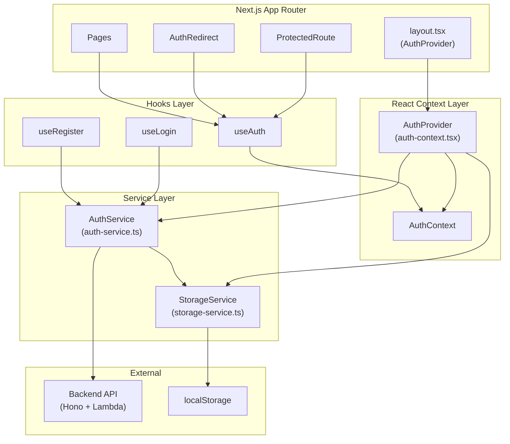
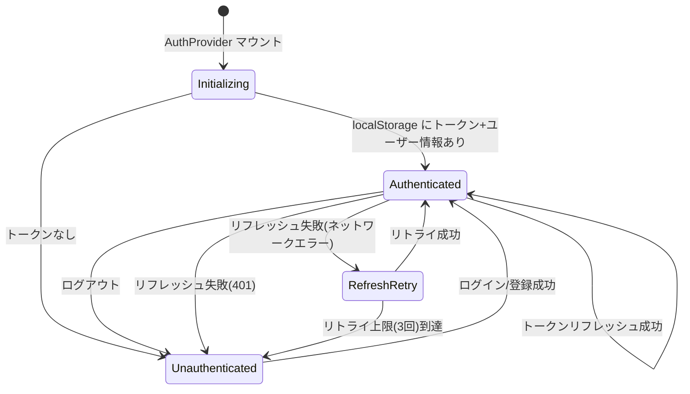
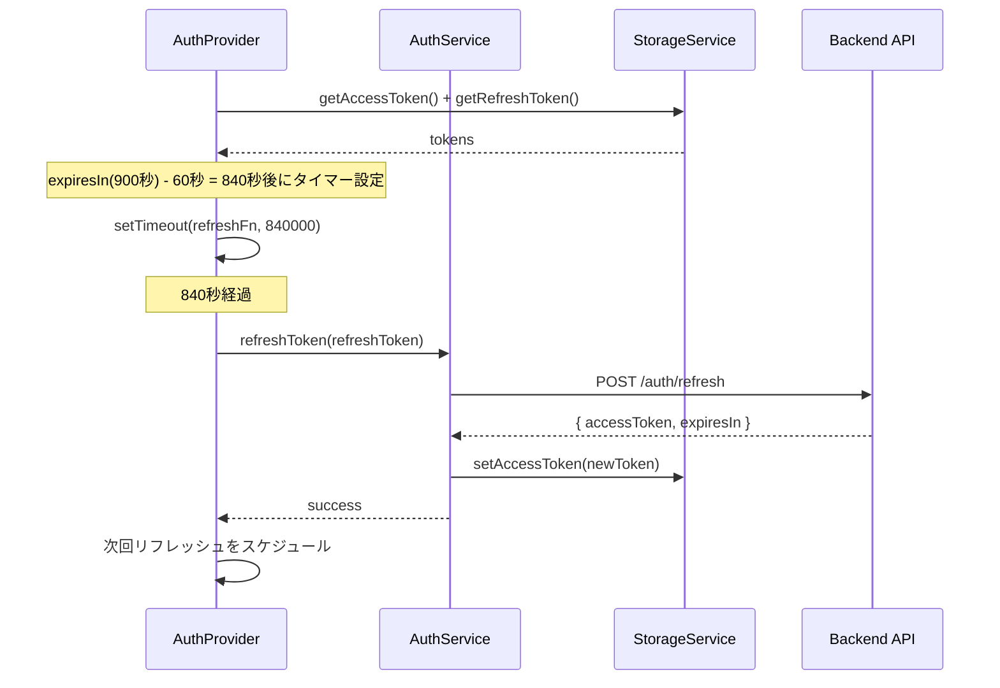

# Design Document: 認証状態管理 (Auth State Management)

## Overview

本設計は、投票対局（Vote Board Game）のフロントエンドにおける認証状態管理を定義する。
既存の `AuthContext` / `AuthProvider` / `useAuth` / `AuthService` / `StorageService` を拡張し、以下の機能を統合的に提供する。

- ブラウザリロード時の認証状態復元（localStorage からのトークン・ユーザー情報読み込み）
- JWT AccessToken の自動リフレッシュ（有効期限 60 秒前にスケジュール）
- ログアウト処理（トークン・ユーザー情報のクリア、タイマー停止、リダイレクト）
- ProtectedRoute による認証必須ページのアクセス制御
- AuthRedirect による認証済みユーザーの認証画面リダイレクト
- ログイン成功後の元ページへのリダイレクト
- 認証付き API リクエストヘルパー（Bearer トークン自動付与、401 時の自動リフレッシュ＋リトライ）

### 設計方針

- 既存コードの拡張を優先し、破壊的変更を最小限にする
- Next.js App Router の Client Component として実装（`'use client'`）
- React Context + hooks パターンを維持
- `StorageService` にユーザー情報永続化を追加
- `AuthService` にトークンリフレッシュと認証付きリクエストメソッドを追加
- ProtectedRoute / AuthRedirect は再利用可能なラッパーコンポーネントとして実装

## Architecture



### 認証状態フロー



### トークンリフレッシュタイミング



## Components and Interfaces

### 変更対象ファイル一覧

| ファイル                                             | 変更種別 | 概要                                                     |
| ---------------------------------------------------- | -------- | -------------------------------------------------------- |
| `packages/web/src/lib/services/storage-service.ts`   | 拡張     | ユーザー情報の永続化メソッド追加                         |
| `packages/web/src/lib/services/auth-service.ts`      | 拡張     | トークンリフレッシュ、認証付きリクエスト、ログアウト改善 |
| `packages/web/src/lib/types/auth.ts`                 | 拡張     | AuthContextType 拡張、新型定義追加                       |
| `packages/web/src/lib/contexts/auth-context.tsx`     | 大幅拡張 | 状態復元、自動リフレッシュ、ログアウト統合               |
| `packages/web/src/lib/hooks/use-auth.ts`             | 微修正   | 型定義の更新に追従                                       |
| `packages/web/src/lib/hooks/use-login.ts`            | 拡張     | ユーザー情報永続化、リダイレクト対応                     |
| `packages/web/src/lib/hooks/use-register.ts`         | 拡張     | ユーザー情報永続化                                       |
| `packages/web/src/components/auth/login-form.tsx`    | 拡張     | redirect クエリパラメータ対応                            |
| `packages/web/src/components/auth/register-form.tsx` | 拡張     | 登録成功後のリダイレクト                                 |

### 新規作成ファイル一覧

| ファイル                                               | 概要                                   |
| ------------------------------------------------------ | -------------------------------------- |
| `packages/web/src/components/auth/protected-route.tsx` | 認証必須ページのラッパーコンポーネント |
| `packages/web/src/components/auth/auth-redirect.tsx`   | 認証済みユーザーの認証画面リダイレクト |

### StorageService 拡張インターフェース

```typescript
// 追加定数
const USER_KEY = 'vbg_user';

// 追加メソッド
class StorageService {
  // 既存メソッド（変更なし）
  setAccessToken(token: string): void;
  getAccessToken(): string | null;
  removeAccessToken(): void;
  setRefreshToken(token: string): void;
  getRefreshToken(): string | null;
  removeRefreshToken(): void;

  // 新規メソッド
  setUser(user: User): void; // JSON.stringify して localStorage に保存
  getUser(): User | null; // JSON.parse して返す。パース失敗時は null + データ削除
  removeUser(): void; // localStorage から削除
  clearAll(): void; // 全認証データを一括削除
}
```

### AuthService 拡張インターフェース

```typescript
class AuthService {
  // 既存メソッド（変更なし）
  async login(email: string, password: string): Promise<LoginResponse>;
  async register(email: string, password: string): Promise<RegisterResponse>;
  async requestPasswordReset(email: string): Promise<void>;
  async confirmPasswordReset(email: string, code: string, newPassword: string): Promise<void>;

  // 変更メソッド
  logout(): void; // → clearAll() を使用するよう変更

  // 新規メソッド
  async refreshToken(refreshToken: string): Promise<RefreshResponse>;
  async authenticatedFetch(url: string, options?: RequestInit): Promise<Response>;
}

interface RefreshResponse {
  accessToken: string;
  expiresIn: number;
}
```

### AuthContextType 拡張インターフェース

```typescript
interface AuthContextType {
  user: User | null;
  isAuthenticated: boolean;
  isLoading: boolean; // 新規: 初期化中フラグ
  setUser: (user: User | null) => void;
  login: (user: User) => void; // 新規: ログイン成功時の状態更新
  logout: () => void; // 新規: ログアウト処理
}
```

### ProtectedRoute コンポーネント

```typescript
interface ProtectedRouteProps {
  children: React.ReactNode;
}

// 使用例
// app/profile/page.tsx
export default function ProfilePage() {
  return (
    <ProtectedRoute>
      <ProfileContent />
    </ProtectedRoute>
  );
}
```

### AuthRedirect コンポーネント

```typescript
interface AuthRedirectProps {
  children: React.ReactNode;
}

// 使用例
// app/login/page.tsx
export default function LoginPage() {
  return (
    <AuthRedirect>
      <LoginForm />
    </AuthRedirect>
  );
}
```

## Data Models

### 認証状態モデル

```typescript
// packages/web/src/lib/types/auth.ts に追加

/**
 * 認証コンテキストの状態型
 */
interface AuthState {
  user: User | null;
  isAuthenticated: boolean;
  isLoading: boolean;
}

/**
 * 拡張された認証コンテキスト型
 */
interface AuthContextType {
  user: User | null;
  isAuthenticated: boolean;
  isLoading: boolean;
  setUser: (user: User | null) => void;
  login: (user: User) => void;
  logout: () => void;
}

/**
 * トークンリフレッシュレスポンス型
 */
interface RefreshResponse {
  accessToken: string;
  expiresIn: number;
}
```

### localStorage データ構造

| キー                | 型              | 説明                    |
| ------------------- | --------------- | ----------------------- |
| `vbg_access_token`  | `string`        | JWT AccessToken（既存） |
| `vbg_refresh_token` | `string`        | RefreshToken（既存）    |
| `vbg_user`          | `string` (JSON) | ユーザー情報（新規）    |

`vbg_user` の JSON 構造:

```json
{
  "userId": "123e4567-e89b-12d3-a456-426614174000",
  "email": "user@example.com",
  "username": "player1"
}
```

### トークンリフレッシュ設定

| パラメータ                       | 値                 | 説明                         |
| -------------------------------- | ------------------ | ---------------------------- |
| AccessToken 有効期限             | 900 秒（15 分）    | Cognito 設定                 |
| リフレッシュ実行タイミング       | 有効期限の 60 秒前 | 840 秒後にタイマー発火       |
| ネットワークエラー時リトライ間隔 | 30 秒              | 固定間隔                     |
| 最大リトライ回数                 | 3 回               | リトライ上限到達でログアウト |

### API エンドポイント（既存）

| メソッド | パス             | 用途                 |
| -------- | ---------------- | -------------------- |
| `POST`   | `/auth/refresh`  | トークンリフレッシュ |
| `POST`   | `/auth/login`    | ログイン             |
| `POST`   | `/auth/register` | ユーザー登録         |

## Correctness Properties

_A property is a characteristic or behavior that should hold true across all valid executions of a system—essentially, a formal statement about what the system should do. Properties serve as the bridge between human-readable specifications and machine-verifiable correctness guarantees._

### Property 1: 認証状態復元の往復一貫性

_For any_ valid User object and AccessToken, if they are stored in localStorage and AuthProvider is mounted, then `isAuthenticated` should be `true` and the `user` object should contain the same userId, email, and username that were stored.

**Validates: Requirements 1.1, 1.2**

### Property 2: ユーザー情報シリアライズの往復一貫性

_For any_ valid User object (with non-empty userId, email, username), calling `setUser(user)` followed by `getUser()` should return an object deeply equal to the original User.

**Validates: Requirements 2.1, 2.3**

### Property 3: 不正 JSON のグレースフルハンドリング

_For any_ string that is not valid JSON representing a User object, if it is stored under the `vbg_user` key in localStorage, then `getUser()` should return `null` and the `vbg_user` key should be removed from localStorage.

**Validates: Requirements 2.4**

### Property 4: ログアウトによる全認証データのクリア

_For any_ combination of stored AccessToken, RefreshToken, and User data in localStorage, executing logout should result in all three keys (`vbg_access_token`, `vbg_refresh_token`, `vbg_user`) being removed from localStorage.

**Validates: Requirements 2.2, 4.1**

### Property 5: ログアウトによる認証状態リセット

_For any_ authenticated state (user is not null, isAuthenticated is true), executing logout should result in `user` being `null` and `isAuthenticated` being `false`.

**Validates: Requirements 4.2**

### Property 6: トークンリフレッシュのスケジューリングタイミング

_For any_ expiresIn value (in seconds), when AuthProvider is in authenticated state, the refresh timer should be scheduled at `(expiresIn - 60) * 1000` milliseconds from the current time.

**Validates: Requirements 3.1**

### Property 7: リフレッシュ後のトークン永続化

_For any_ new AccessToken returned from a successful refresh API call, the token should be stored in localStorage under the `vbg_access_token` key and be retrievable via `getAccessToken()`.

**Validates: Requirements 3.3**

### Property 8: ProtectedRoute の未認証ユーザーリダイレクト

_For any_ page path string, when an unauthenticated user accesses a ProtectedRoute-wrapped page, the user should be redirected to `/login?redirect={encodedPath}` where `{encodedPath}` is the current page path.

**Validates: Requirements 5.1, 5.2**

### Property 9: ProtectedRoute の認証済みユーザー表示

_For any_ authenticated state (user is not null, isAuthenticated is true), ProtectedRoute should render its children without redirection.

**Validates: Requirements 5.3**

### Property 10: AuthRedirect の認証済みユーザーリダイレクト

_For any_ authenticated user accessing an auth page (/login or /register), AuthRedirect should redirect the user to the top page (/).

**Validates: Requirements 6.1, 6.2**

### Property 11: ログイン後の redirect パラメータによるリダイレクト

_For any_ valid path string in the `redirect` query parameter, after a successful login, the user should be navigated to that path.

**Validates: Requirements 7.1**

### Property 12: 認証付きリクエストの Bearer トークン付与

_For any_ URL and AccessToken, `authenticatedFetch` should include an `Authorization` header with the value `Bearer {accessToken}` in the request.

**Validates: Requirements 8.1**

## Error Handling

### トークンリフレッシュエラー

| エラー種別                              | 対応                                                  |
| --------------------------------------- | ----------------------------------------------------- |
| 401 レスポンス（トークン無効/期限切れ） | 即座にログアウト処理を実行し、`/login` にリダイレクト |
| ネットワークエラー（TypeError: fetch）  | 30 秒後にリトライ。最大 3 回。3 回失敗でログアウト    |
| 500 サーバーエラー                      | ネットワークエラーと同様にリトライ                    |

### localStorage エラー

| エラー種別                       | 対応                                                                   |
| -------------------------------- | ---------------------------------------------------------------------- |
| JSON パース失敗（`vbg_user`）    | `null` を返し、不正データを削除                                        |
| localStorage アクセス不可（SSR） | `typeof window !== 'undefined'` ガードで `null` を返す                 |
| localStorage 容量超過            | try-catch で捕捉し、エラーをコンソールに出力。認証状態はメモリ上で維持 |

### 認証付き API リクエストエラー

| エラー種別                             | 対応                                                         |
| -------------------------------------- | ------------------------------------------------------------ |
| AccessToken 未存在                     | エラーをスロー（`Error: No access token available`）         |
| 401 レスポンス（初回）                 | トークンリフレッシュを試行し、成功時は元のリクエストを再実行 |
| 401 レスポンス（リフレッシュ後再実行） | ログアウト処理を実行                                         |
| ネットワークエラー                     | エラーをそのままスロー（呼び出し元で処理）                   |

### コンポーネントエラー

| エラー種別                         | 対応                                                          |
| ---------------------------------- | ------------------------------------------------------------- |
| `useAuth` が AuthProvider 外で使用 | `Error: useAuth must be used within an AuthProvider` をスロー |
| ProtectedRoute で isLoading 中     | ローディングスピナーを表示                                    |
| AuthRedirect で isLoading 中       | ローディングスピナーを表示                                    |

## Testing Strategy

### テストフレームワーク

- **ユニットテスト / 統合テスト**: Vitest + React Testing Library
- **プロパティベーステスト**: fast-check（`fc.property` のみ使用、`fc.asyncProperty` は禁止）
- **モック**: `vi.fn()`, `vi.spyOn()` で fetch / localStorage / next/navigation をモック

### プロパティベーステスト設定

- `numRuns`: 10〜20（JSDOM 環境の安定性のため）
- `endOnFailure: true` を必ず指定
- 各テストにコメントで設計プロパティを参照: `Feature: 9-auth-state-management, Property {number}: {title}`
- 各 Correctness Property は単一のプロパティベーステストで実装

### テスト対象と戦略

| テスト対象                                     | テスト種別       | テスト内容                         |
| ---------------------------------------------- | ---------------- | ---------------------------------- |
| `StorageService.setUser/getUser`               | プロパティテスト | Property 2: 往復一貫性             |
| `StorageService.getUser`（不正 JSON）          | プロパティテスト | Property 3: 不正 JSON ハンドリング |
| `StorageService.clearAll`                      | プロパティテスト | Property 4: 全データクリア         |
| `AuthProvider` 初期化                          | プロパティテスト | Property 1: 状態復元               |
| `AuthProvider` ログアウト                      | プロパティテスト | Property 5: 状態リセット           |
| `AuthProvider` リフレッシュスケジュール        | プロパティテスト | Property 6: タイミング             |
| `AuthService.refreshToken`                     | プロパティテスト | Property 7: トークン永続化         |
| `ProtectedRoute`（未認証）                     | プロパティテスト | Property 8: リダイレクト           |
| `ProtectedRoute`（認証済み）                   | プロパティテスト | Property 9: 子コンポーネント表示   |
| `AuthRedirect`（認証済み）                     | プロパティテスト | Property 10: リダイレクト          |
| `LoginForm`（redirect パラメータ）             | プロパティテスト | Property 11: リダイレクト          |
| `AuthService.authenticatedFetch`               | プロパティテスト | Property 12: Bearer トークン付与   |
| `AuthProvider` リフレッシュ 401                | ユニットテスト   | 3.5: ログアウト実行                |
| `AuthProvider` リフレッシュ ネットワークエラー | ユニットテスト   | 3.6: 30 秒リトライ × 3 回          |
| `AuthProvider` アンマウント                    | ユニットテスト   | 3.7: タイマークリア                |
| `AuthProvider` isLoading ライフサイクル        | ユニットテスト   | 1.4, 1.5: true → false 遷移        |
| ログアウト後のリダイレクト                     | ユニットテスト   | 4.4: /login へリダイレクト         |
| ProtectedRoute isLoading 中                    | ユニットテスト   | 5.4: ローディング表示              |
| AuthRedirect isLoading 中                      | ユニットテスト   | 6.3: ローディング表示              |
| 登録成功後リダイレクト                         | ユニットテスト   | 7.3: / へリダイレクト              |
| AccessToken 未存在時エラー                     | ユニットテスト   | 8.2: エラースロー                  |
| 401 後リフレッシュ＋リトライ                   | ユニットテスト   | 8.3: リトライフロー                |
| リフレッシュ後再 401 でログアウト              | ユニットテスト   | 8.4: ログアウト実行                |

### テストファイル構成

```text
packages/web/src/
├── lib/
│   ├── services/
│   │   ├── storage-service.test.ts          # 既存テスト拡張
│   │   ├── storage-service.property.test.ts # Property 2, 3, 4
│   │   ├── auth-service.test.ts             # 既存テスト拡張
│   │   └── auth-service.property.test.ts    # Property 7, 12（既存拡張）
│   ├── contexts/
│   │   ├── auth-context.test.tsx            # 既存テスト拡張
│   │   └── auth-context.property.test.tsx   # Property 1, 5, 6
│   └── hooks/
│       └── use-auth.test.tsx                # 既存テスト拡張
├── components/auth/
│   ├── protected-route.test.tsx             # ユニットテスト
│   ├── protected-route.property.test.tsx    # Property 8, 9
│   ├── auth-redirect.test.tsx               # ユニットテスト
│   ├── auth-redirect.property.test.tsx      # Property 10
│   ├── login-form.test.tsx                  # 既存テスト拡張
│   └── login-form.property.test.tsx         # Property 11（既存拡張）
```

### クリーンアップルール

- `afterEach` で `cleanup()`, `vi.clearAllTimers()`, `vi.clearAllMocks()` を実行
- localStorage のモックは各テスト前にリセット
- `vi.useFakeTimers()` 使用時は `vi.useRealTimers()` で復元
