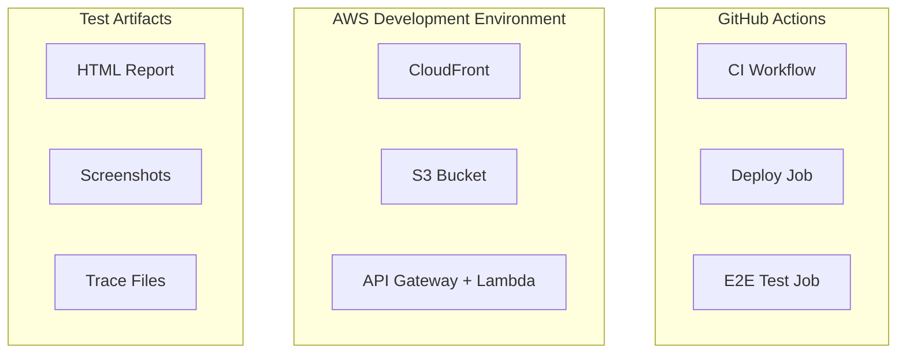

# 設計書

## 概要

この設計書は、GitHub ActionsのCDパイプラインにPlaywrightを使用したE2Eテストを統合する機能の技術設計を定義します。

### 目的

Development環境へのデプロイ後に基本的なスモークテストを自動実行し、デプロイされたアプリケーションの疎通確認を行います。これにより、デプロイの成功を即座に検証し、問題の早期発見を可能にします。

### スコープ

- Playwright環境のセットアップ（webパッケージ）
- 基本的なスモークテストの実装（ホームページの読み込み確認）
- GitHub Actions CDワークフローへの統合（Development環境のみ）
- テスト結果とアーティファクトの管理
- CI最適化（キャッシング）

### 非スコープ

- 包括的なE2Eテストスイート（MVPではスモークテストのみ）
- Staging/Production環境でのE2E実行
- ビジュアルリグレッションテスト
- パフォーマンステスト
- クロスブラウザテスト（ChromiumのみでMVP）

## アーキテクチャ

### システム構成図



    CI -->|Success| Deploy
    Deploy -->|Deploy Complete| E2E
    E2E -->|Test Against| CF
    CF --> S3
    CF --> API
    E2E -->|Generate| Report
    E2E -->|On Failure| Screenshots
    E2E -->|On Failure| Traces

````

### ワークフローシーケンス

```mermaid
sequenceDiagram
    participant GH as GitHub Actions
    participant Deploy as Deploy Job
    participant AWS as AWS (Dev)
    participant E2E as E2E Test Job
    participant Playwright as Playwright

    GH->>Deploy: Trigger on CI success
    Deploy->>AWS: Deploy infrastructure
    Deploy->>AWS: Deploy web app
    AWS-->>Deploy: CloudFront URL
    Deploy->>GH: Deployment complete
    GH->>E2E: Trigger E2E tests
    E2E->>E2E: Install Playwright browsers
    E2E->>Playwright: Run smoke tests
    Playwright->>AWS: Navigate to CloudFront URL
    AWS-->>Playwright: Serve application
    Playwright->>E2E: Test results
    E2E->>GH: Upload artifacts
    E2E->>GH: Report status
````

### コンポーネント構成

1. **Playwright Configuration** (`packages/web/playwright.config.ts`)
   - ブラウザ設定（Chromium）
   - ベースURL設定（環境変数から取得）
   - タイムアウト設定
   - レポート設定

   - アーティファクト設定

2. **Test Files** (`packages/web/e2e/`)
   - スモークテスト実装
   - テストヘルパー関数

3. **GitHub Actions Workflow** (`.github/workflows/cd-development.yml`)
   - E2Eテストジョブの追加
   - CloudFront URL の受け渡し
   - アーティファクトのアップロード

4. **NPM Scripts** (`packages/web/package.json`)
   - テスト実行スクリプト
   - ブラウザインストールスクリプト

## コンポーネントとインターフェース

### Playwright Configuration

**ファイル:** `packages/web/playwright.config.ts`

**責務:**

- Playwrightの実行環境を設定
- ブラウザの種類とオプションを定義
- テストのタイムアウトとリトライを設定
- レポートとアーティファクトの出力先を指定

**主要設定:**

```typescript
interface PlaywrightConfig {
  testDir: string;              // './e2e'
  timeout: number;              // 30000ms
  fullyParallel: boolean;       // true
  forbidOnly: boolean;          // true (CI環境)
  retries: number;              // 2 (CI環境), 0 (ローカル)
  workers: number;              // 1 (CI環境), undefined (ローカル)
```

reporter: string[]; // 'html', 'list'
use: {
baseURL: string; // process.env.BASE_URL
trace: string; // 'on-first-retry'
screenshot: string; // 'only-on-failure'
};
projects: Array<{
name: string; // 'chromium'
use: object; // devices['Desktop Chrome']
}>;
}

```

**環境変数:**
- `BASE_URL`: テスト対象のURL（必須）
- `CI`: CI環境の検出（GitHub Actionsで自動設定）

### Test Structure

**ディレクトリ構造:**

```

packages/web/
├── e2e/
│ ├── smoke.spec.ts # スモークテスト
│ └── helpers/
│ └── test-helpers.ts # 共通ヘルパー関数
├── playwright.config.ts # Playwright設定
└── package.json # スクリプト定義

````

**Test File Interface:**

```typescript
// e2e/smoke.spec.ts
import { test, expect } from '@playwright/test';

test.describe('Smoke Tests', () => {
  test('homepage loads successfully', async ({ page }) => {
    // テスト実装
  });
````

test('homepage has title', async ({ page }) => {
// テスト実装
});

test('homepage has interactive elements', async ({ page }) => {
// テスト実装
});
});

````

### GitHub Actions Integration

**新規ジョブ:** `e2e-tests`

**依存関係:** `deploy-development` ジョブの成功

**入力:**
- CloudFront Distribution ID（デプロイジョブから取得）
- CloudFront URL（Distribution IDから構築）

**出力:**
- テスト結果（成功/失敗）
- HTMLレポート（アーティファクト）
- スクリーンショット（失敗時のみ）
- トレースファイル（失敗時のみ）

**ジョブステップ:**

```yaml
e2e-tests:
  needs: deploy-development
  runs-on: ubuntu-latest
  if: success()
  steps:
    - Checkout
    - Setup pnpm
    - Setup Node.js
    - Install dependencies
    - Install Playwright browsers (with cache)
    - Get CloudFront URL
    - Run E2E tests
    - Upload test results (always)
    - Upload failure artifacts (on failure)
    - Update deployment summary
````

### NPM Scripts

**追加スクリプト:**

```json
{
  "scripts": {
```

    "test:e2e": "playwright test",
    "test:e2e:headed": "playwright test --headed",
    "test:e2e:ui": "playwright test --ui",
    "test:e2e:report": "playwright show-report",
    "playwright:install": "playwright install --with-deps chromium"

}
}

```

**スクリプトの用途:**
- `test:e2e`: ヘッドレスモードでテスト実行（CI用）
- `test:e2e:headed`: ブラウザを表示してテスト実行（ローカル開発用）
- `test:e2e:ui`: Playwright UIモードでテスト実行（デバッグ用）
- `test:e2e:report`: HTMLレポートを表示
- `playwright:install`: Chromiumブラウザをインストール

## データモデル

このフィーチャーは新しいデータモデルを導入しません。既存のWebアプリケーションに対してテストを実行するのみです。

### テスト結果データ

テスト結果はGitHub Actionsのアーティファクトとして保存されます：

**HTMLレポート:**
- ファイル名: `playwright-report/`
- 形式: HTML + CSS + JS
- 内容: テスト実行結果、タイミング、スクリーンショット

**スクリーンショット:**
- ファイル名: `test-results/*/test-failed-*.png`
- 形式: PNG
- 内容: 失敗時のページスクリーンショット

**トレースファイル:**
- ファイル名: `test-results/*/trace.zip`
- 形式: ZIP（Playwright独自形式）
- 内容: DOM スナップショット、ネットワークログ、コンソールログ
```

## 正確性プロパティ

_プロパティとは、システムのすべての有効な実行において真であるべき特性や動作のことです。本質的には、システムが何をすべきかについての形式的な記述です。プロパティは、人間が読める仕様と機械で検証可能な正確性の保証との橋渡しとなります。_

### 受け入れ基準のテスト可能性分析

要件の大部分は、CI/CD ワークフローの設定やセットアップに関するものであり、機能的なプロパティとしてテストするものではありません。しかし、いくつかの動作は検証可能です：

**テスト可能なプロパティ:**

1.4, 4.4: ベースURLの環境変数からの取得

- これらは同じ要件を指しています（BASE_URL環境変数の使用）
- Playwright設定が環境変数を正しく読み取ることを検証できます

  4.3: CI環境でのヘッドレスモード

- CI環境が検出されたときに自動的にヘッドレスモードが使用されることを検証できます

**テスト可能な例:**

2.1: ホームページの読み込み
2.2: ページタイトルの存在
2.3: インタラクティブ要素の表示

- これらは具体的なスモークテストの例です

**テスト不可能（設定要件）:**

1.1, 1.2, 1.3, 1.5: Playwrightのセットアップと設定
2.4: パフォーマンス要件（30秒以内）
3.1-3.7: GitHub Actionsワークフローの動作
4.1, 4.2: スクリプトの提供
5.1-5.3: CI最適化とキャッシング
6.1-6.5: テスト結果の可視性とアーティファクト管理

これらは設定やCI/CDの動作に関するものであり、プロパティベーステストの対象ではありません。

### プロパティ1: 環境変数によるベースURL設定

*任意の*有効なURL文字列に対して、BASE_URL環境変数に設定された場合、Playwright設定はそのURLをbaseURLとして使用すること

**検証要件: 1.4, 4.4**

### プロパティ2: CI環境でのヘッドレスモード自動適用

*任意の*実行環境において、CI環境変数が設定されている場合、Playwright設定は自動的にヘッドレスモードを使用すること

**検証要件: 4.3**

## エラーハンドリング

### テスト実行エラー

**エラーケース1: ベースURLが未設定**

```typescript
// エラー検出
if (!process.env.BASE_URL) {
  throw new Error('BASE_URL environment variable is required');
}
```

**対応:**

- Playwright設定の読み込み時にエラーをスロー
- GitHub Actionsジョブが失敗
- エラーメッセージをジョブログに出力

**エラーケース2: ページ読み込みタイムアウト**

```typescript
// Playwright設定
{
  timeout: 30000, // 30秒
  use: {
    navigationTimeout: 30000,
  }
}
```

**対応:**

- タイムアウト後にテストが失敗
- スクリーンショットを自動キャプチャ
- トレースファイルを生成
- GitHub Actionsがアーティファクトをアップロード

**エラーケース3: 要素が見つからない**

```typescript
// テストコード
await expect(page.locator('selector')).toBeVisible({ timeout: 5000 });
```

**対応:**

- アサーションが失敗
- 失敗時のスクリーンショットを保存
- テストが失敗としてマーク
- 次のテストに進む（fail-fast しない）

**エラーケース4: Playwrightブラウザが未インストール**

```bash
# GitHub Actionsステップ
- name: Install Playwright browsers
  run: pnpm --filter @vote-board-game/web playwright:install
```

**対応:**

- GitHub Actionsで明示的にブラウザをインストール
- インストール失敗時はジョブが失敗
- キャッシュを使用して再インストールを高速化

**エラーケース5: CloudFront URLが取得できない**

```yaml
# GitHub Actions
- name: Get CloudFront URL
  id: cloudfront-url
  run: |
    DISTRIBUTION_ID="${{ needs.deploy-development.outputs.distribution-id }}"
    if [ -z "$DISTRIBUTION_ID" ]; then
      echo "Error: Distribution ID not found"
      exit 1
    fi
```

**対応:**

- デプロイジョブからの出力を検証
- 未設定の場合はE2Eジョブを失敗させる
- エラーメッセージをログに出力

### GitHub Actions エラーハンドリング

**リトライ戦略:**

- Playwrightテスト: 2回リトライ（CI環境）
- ブラウザインストール: GitHub Actionsのデフォルト（リトライなし）
- アーティファクトアップロード: GitHub Actionsのデフォルト（3回リトライ）

**失敗時の動作:**

- テスト失敗: ワークフロー全体を失敗させる
- スクリーンショットとトレースを自動アップロード
- デプロイサマリーに失敗情報を追加
- 開発者にGitHub通知を送信

**タイムアウト:**

- E2Eジョブ全体: 10分
- 個別テスト: 30秒
- ページナビゲーション: 30秒
- 要素の待機: 5秒

## テスト戦略

### デュアルテストアプローチ

このフィーチャーでは、ユニットテストとE2Eテストの両方を使用します：

**ユニットテスト（Vitest）:**

- Playwright設定の検証
- 環境変数の読み込みロジック
- ヘルパー関数のテスト

**E2Eテスト（Playwright）:**

- アプリケーションの実際の動作確認
- ブラウザでのページ読み込み
- ユーザーインタラクションのシミュレーション

### ユニットテスト

**対象:** Playwright設定とヘルパー関数

**テストファイル:** `packages/web/playwright.config.test.ts`

**テストケース:**

1. **環境変数によるベースURL設定のテスト**

   ```typescript
   describe('Playwright Config', () => {
     it('should use BASE_URL from environment variable', () => {
       process.env.BASE_URL = 'https://example.com';
       const config = require('./playwright.config').default;
       expect(config.use.baseURL).toBe('https://example.com');
     });

     it('should throw error when BASE_URL is not set', () => {
       delete process.env.BASE_URL;
       expect(() => require('./playwright.config')).toThrow(
         'BASE_URL environment variable is required'
       );
     });
   });
   ```

2. **CI環境検出のテスト**

   ```typescript
   describe('CI Environment Detection', () => {
     it('should enable headless mode in CI', () => {
       process.env.CI = 'true';
       const config = require('./playwright.config').default;
       expect(config.use.headless).toBe(true);
     });

     it('should use headed mode locally', () => {
       delete process.env.CI;
       const config = require('./playwright.config').default;
       expect(config.use.headless).toBeUndefined();
     });
   });
   ```

### E2Eテスト（スモークテスト）

**対象:** デプロイされたアプリケーション

**テストファイル:** `packages/web/e2e/smoke.spec.ts`

**テストケース:**

1. **ホームページの読み込み確認**

   ```typescript
   test('homepage loads successfully', async ({ page }) => {
     const response = await page.goto('/');
     expect(response?.status()).toBe(200);
   });
   ```

2. **ページタイトルの存在確認**

   ```typescript
   test('homepage has title', async ({ page }) => {
     await page.goto('/');
     const title = await page.title();
     expect(title).toBeTruthy();
     expect(title.length).toBeGreaterThan(0);
   });
   ```

3. **インタラクティブ要素の表示確認**
   ```typescript
   test('homepage has interactive elements', async ({ page }) => {
     await page.goto('/');
     // ボタンまたはリンクが少なくとも1つ存在することを確認
     const interactiveElements = await page.locator('button, a').count();
     expect(interactiveElements).toBeGreaterThan(0);
   });
   ```

### プロパティベーステスト設定

このフィーチャーでは、プロパティベーステストは最小限です。主な検証対象は設定とCI/CD統合であり、これらは従来のユニットテストで十分にカバーできます。

**プロパティテストの実装:**

プロパティ1とプロパティ2は、ユニットテストとして実装されます（上記参照）。これらは設定の動作を検証するものであり、大量のランダム入力を必要としません。

**テスト実行設定:**

```typescript
// playwright.config.ts
export default defineConfig({
  // CI環境では2回リトライ
  retries: process.env.CI ? 2 : 0,

  // CI環境では1ワーカー（安定性優先）
  workers: process.env.CI ? 1 : undefined,

  // すべてのテストを並列実行
  fullyParallel: true,

  // タイムアウト設定
  timeout: 30000,

  // レポーター設定
  reporter: [['html', { outputFolder: 'playwright-report' }], ['list']],
});
```

### テストの実行方法

**ローカル開発:**

```bash
# ベースURLを指定してテスト実行
BASE_URL=http://localhost:3000 pnpm --filter @vote-board-game/web test:e2e

# UIモードでデバッグ
BASE_URL=http://localhost:3000 pnpm --filter @vote-board-game/web test:e2e:ui

# レポート表示
pnpm --filter @vote-board-game/web test:e2e:report
```

**GitHub Actions:**

```bash
# 自動実行（CDパイプライン内）
BASE_URL=https://d1234567890.cloudfront.net pnpm test:e2e
```

### テストカバレッジ目標

**スモークテストのスコープ（MVP）:**

- ホームページの基本的な読み込み確認
- 重要な要素の存在確認
- 基本的なナビゲーション確認

**将来的な拡張:**

- 対局一覧ページのテスト
- 対局詳細ページのテスト
- 投票フローのテスト
- 認証フローのテスト（Cognito統合後）
- レスポンシブデザインのテスト
- アクセシビリティテスト

## 実装の詳細

### Playwright設定ファイル

**ファイル:** `packages/web/playwright.config.ts`

```typescript
import { defineConfig, devices } from '@playwright/test';

// BASE_URLの検証
if (!process.env.BASE_URL) {
  throw new Error('BASE_URL environment variable is required for E2E tests');
}

export default defineConfig({
  testDir: './e2e',

  // 各テストのタイムアウト
  timeout: 30 * 1000,

  // すべてのテストを並列実行
  fullyParallel: true,

  // CI環境でtest.only()を禁止
  forbidOnly: !!process.env.CI,

  // CI環境では2回リトライ
  retries: process.env.CI ? 2 : 0,

  // CI環境では1ワーカー
  workers: process.env.CI ? 1 : undefined,

  // レポーター設定
  reporter: [['html', { outputFolder: 'playwright-report' }], ['list']],

  // 共通設定
  use: {
    // ベースURL
    baseURL: process.env.BASE_URL,

    // 最初のリトライ時にトレースを記録
    trace: 'on-first-retry',

    // 失敗時のみスクリーンショット
    screenshot: 'only-on-failure',

    // ナビゲーションタイムアウト
    navigationTimeout: 30 * 1000,
  },

  // ブラウザ設定
  projects: [
    {
      name: 'chromium',
      use: { ...devices['Desktop Chrome'] },
    },
  ],
});
```

### スモークテスト実装

**ファイル:** `packages/web/e2e/smoke.spec.ts`

```typescript
import { test, expect } from '@playwright/test';

test.describe('Smoke Tests', () => {
  test('homepage loads successfully', async ({ page }) => {
    const response = await page.goto('/');
    expect(response?.status()).toBe(200);
  });

  test('homepage has title', async ({ page }) => {
    await page.goto('/');
    const title = await page.title();
    expect(title).toBeTruthy();
    expect(title.length).toBeGreaterThan(0);
  });

  test('homepage has interactive elements', async ({ page }) => {
    await page.goto('/');

    // ボタンまたはリンクが少なくとも1つ存在
    const buttons = await page.locator('button').count();
    const links = await page.locator('a').count();
    const totalInteractive = buttons + links;

    expect(totalInteractive).toBeGreaterThan(0);
  });
});
```

### GitHub Actions ワークフロー統合

**ファイル:** `.github/workflows/cd-development.yml`

既存のワークフローに以下のジョブを追加：

```yaml
jobs:
  # 既存のジョブ...
  check-deployment-needed:
    # ... 既存の設定

  deploy-development:
    # ... 既存の設定
    outputs:
      distribution-id: ${{ steps.cdk-outputs.outputs.distribution-id }}
      cloudfront-url: ${{ steps.cloudfront-url.outputs.url }}

  # 新規ジョブ
  e2e-tests:
    needs: deploy-development
    runs-on: ubuntu-latest
    if: success()

    steps:
      - name: Checkout
        uses: actions/checkout@v4

      - name: Setup pnpm
        uses: pnpm/action-setup@v4
        with:
          version: 10.30.0

      - name: Setup Node.js
        uses: actions/setup-node@v4
        with:
          node-version: 24
          cache: 'pnpm'

      - name: Install dependencies
        run: pnpm install --frozen-lockfile

      - name: Get Playwright version
        id: playwright-version
        run: |
          VERSION=$(pnpm --filter @vote-board-game/web list @playwright/test --depth=0 --json | jq -r '.[0].version')
          echo "version=$VERSION" >> $GITHUB_OUTPUT

      - name: Cache Playwright browsers
        uses: actions/cache@v4
        id: playwright-cache
        with:
          path: ~/.cache/ms-playwright
          key: playwright-${{ runner.os }}-${{ steps.playwright-version.outputs.version }}

      - name: Install Playwright browsers
        if: steps.playwright-cache.outputs.cache-hit != 'true'
        run: pnpm --filter @vote-board-game/web playwright:install

      - name: Get CloudFront URL
        id: cloudfront-url
        run: |
          DISTRIBUTION_ID="${{ needs.deploy-development.outputs.distribution-id }}"
          if [ -z "$DISTRIBUTION_ID" ]; then
            echo "Error: Distribution ID not found"
            exit 1
          fi

          # CloudFront URLを構築
          CLOUDFRONT_URL="https://${DISTRIBUTION_ID}.cloudfront.net"
          echo "url=$CLOUDFRONT_URL" >> $GITHUB_OUTPUT
          echo "CloudFront URL: $CLOUDFRONT_URL"

      - name: Run E2E tests
        run: pnpm --filter @vote-board-game/web test:e2e
        env:
          BASE_URL: ${{ steps.cloudfront-url.outputs.url }}

      - name: Upload test results
        if: always()
        uses: actions/upload-artifact@v4
        with:
          name: playwright-report
          path: packages/web/playwright-report/
          retention-days: 7

      - name: Upload failure artifacts
        if: failure()
        uses: actions/upload-artifact@v4
        with:
          name: playwright-failures
          path: packages/web/test-results/
          retention-days: 7

      - name: Update deployment summary
        if: always()
        run: |
          echo "### E2E Test Results :test_tube:" >> $GITHUB_STEP_SUMMARY
          echo "" >> $GITHUB_STEP_SUMMARY

          if [ "${{ job.status }}" == "success" ]; then
            echo "✅ All smoke tests passed" >> $GITHUB_STEP_SUMMARY
          else
            echo "❌ Some tests failed" >> $GITHUB_STEP_SUMMARY
            echo "" >> $GITHUB_STEP_SUMMARY
            echo "Check the [test report artifact](https://github.com/${{ github.repository }}/actions/runs/${{ github.run_id }}) for details." >> $GITHUB_STEP_SUMMARY
          fi

          echo "" >> $GITHUB_STEP_SUMMARY
          echo "- Test URL: ${{ steps.cloudfront-url.outputs.url }}" >> $GITHUB_STEP_SUMMARY
```

### package.json の更新

**ファイル:** `packages/web/package.json`

```json
{
  "name": "@vote-board-game/web",
  "scripts": {
    "dev": "next dev",
    "build": "next build",
    "start": "next start",
    "type-check": "tsc --noEmit",
    "test": "echo 'No tests yet'",
    "test:e2e": "playwright test",
    "test:e2e:headed": "playwright test --headed",
    "test:e2e:ui": "playwright test --ui",
    "test:e2e:report": "playwright show-report",
    "playwright:install": "playwright install --with-deps chromium",
    "clean": "rm -rf .next out *.tsbuildinfo"
  },
  "devDependencies": {
    "@playwright/test": "^1.48.0"
    // ... 既存の依存関係
  }
}
```

### ディレクトリ構造

```
packages/web/
├── e2e/
│   ├── smoke.spec.ts              # スモークテスト
│   └── helpers/
│       └── test-helpers.ts        # 共通ヘルパー（将来用）
├── playwright-report/             # HTMLレポート（gitignore）
├── test-results/                  # テスト結果（gitignore）
├── playwright.config.ts           # Playwright設定
├── playwright.config.test.ts      # 設定のユニットテスト
└── package.json                   # スクリプト定義
```

### .gitignore の更新

```gitignore
# Playwright
packages/web/playwright-report/
packages/web/test-results/
packages/web/.playwright/
```

## セキュリティ考慮事項

### 認証情報の管理

**現状（MVP）:**

- 認証なしの公開ページのみテスト
- 環境変数はGitHub Secretsを使用しない（URLのみ）

**将来（Cognito統合後）:**

- テスト用ユーザーの認証情報をGitHub Secretsで管理
- Playwrightのストレージステート機能で認証状態を保存
- テスト間で認証状態を再利用

### URL の取扱い

**CloudFront URL:**

- デプロイジョブから動的に取得
- ハードコードしない
- GitHub Actionsのログに出力（公開情報）

**機密情報の除外:**

- スクリーンショットに機密情報が含まれないよう注意
- APIキーやトークンをテストコードに含めない
- 環境変数で機密情報を管理

## パフォーマンス考慮事項

### テスト実行時間

**目標:**

- スモークテスト全体: 30秒以内
- 個別テスト: 10秒以内
- E2Eジョブ全体: 5分以内

**最適化戦略:**

- 並列実行を有効化（fullyParallel: true）
- 必要最小限のテストケースのみ実装（スモークテスト）
- ページ読み込みの待機時間を最適化
- 不要なリソースの読み込みをスキップ

### キャッシング戦略

**Playwrightブラウザ:**

- バージョンごとにキャッシュ
- キャッシュキー: `playwright-${{ runner.os }}-${{ version }}`
- キャッシュパス: `~/.cache/ms-playwright`

**pnpm依存関係:**

- 既存のpnpmキャッシュを再利用
- デプロイジョブと同じキャッシュ戦略

**期待される効果:**

- 初回実行: 約5分（ブラウザインストール含む）
- 2回目以降: 約2分（キャッシュヒット時）

## モニタリングと可観測性

### メトリクス

**収集するメトリクス:**

- テスト実行時間
- テスト成功率
- 失敗したテストの数
- アーティファクトのサイズ

**GitHub Actionsでの記録:**

- ジョブの実行時間（自動）
- ステップごとの実行時間（自動）
- カスタムメトリクス（GITHUB_STEP_SUMMARY）

### ログ

**ログレベル:**

- Playwright: デフォルト（エラーと警告）
- GitHub Actions: INFO

**ログの保持:**

- GitHub Actionsログ: 90日間（GitHub設定）
- アーティファクト: 7日間

### アラート

**失敗時の通知:**

- GitHub通知（デフォルト）
- ワークフロー失敗のメール通知（GitHub設定）
- Slackなどの外部通知（将来的に）

## 依存関係

### 外部依存

**npm パッケージ:**

- `@playwright/test`: ^1.48.0
- Chromiumブラウザ（Playwrightが管理）

**GitHub Actions:**

- `actions/checkout@v4`
- `actions/setup-node@v4`
- `actions/cache@v4`
- `actions/upload-artifact@v4`
- `pnpm/action-setup@v4`

### 内部依存

**前提条件:**

- デプロイジョブの成功
- CloudFront Distribution IDの取得
- Webアプリケーションのビルドと配信

**統合ポイント:**

- CDパイプライン（cd-development.yml）
- Webパッケージ（packages/web）
- Next.js アプリケーション

## 制約事項

### 技術的制約

1. **ブラウザサポート:**
   - MVPではChromiumのみ
   - Firefox、WebKitは将来的に追加可能

2. **実行環境:**
   - GitHub Actions Ubuntu runner
   - ヘッドレスモードのみ（CI環境）

3. **テストスコープ:**
   - 公開ページのみ（認証なし）
   - スモークテストのみ（詳細なE2Eは将来）

### 運用上の制約

1. **実行タイミング:**
   - Development環境のデプロイ後のみ
   - Staging/Productionでは実行しない（MVP）

2. **リソース制限:**
   - GitHub Actions無料枠の考慮
   - 実行時間: 最大10分
   - アーティファクト保持: 7日間

3. **並行実行:**
   - Development環境は1つのみ
   - 並行デプロイは発生しない（concurrency設定済み）

## 将来的な拡張

### 短期的な拡張（MVP後）

1. **テストカバレッジの拡大:**
   - 対局一覧ページのテスト
   - 対局詳細ページのテスト
   - 投票フローのテスト

2. **Staging/Production環境への適用:**
   - 環境ごとのテスト戦略
   - Production環境での慎重なテスト実行

3. **認証フローのテスト:**
   - Cognito統合後
   - ログイン/ログアウトのテスト
   - 認証が必要なページのテスト

### 長期的な拡張

1. **クロスブラウザテスト:**
   - Firefox、WebKitの追加
   - モバイルブラウザのテスト

2. **ビジュアルリグレッションテスト:**
   - スクリーンショット比較
   - UI変更の検出

3. **パフォーマンステスト:**
   - Lighthouse統合
   - Core Web Vitalsの測定

4. **アクセシビリティテスト:**
   - axe-coreの統合
   - WCAG準拠の検証

5. **E2Eテストの自動生成:**
   - AIによるテストケース生成
   - ユーザー行動の記録と再生
