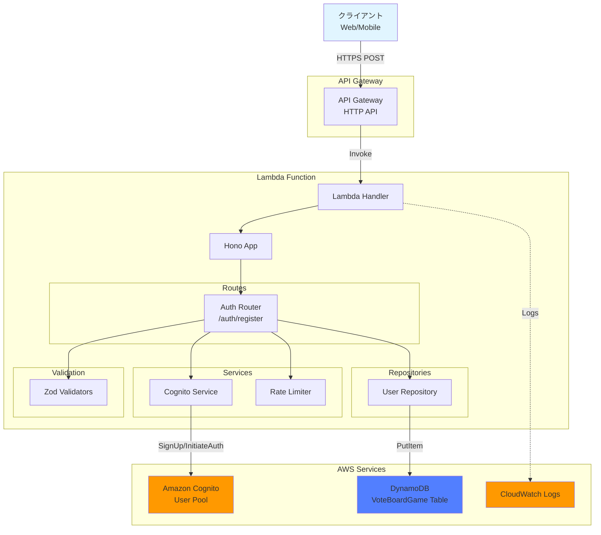

# 設計書: ユーザー登録API

## 概要

本ドキュメントは、投票ボードゲームアプリケーションのユーザー登録API機能の設計を定義します。この機能は、新規ユーザーがメールアドレス、パスワード、ユーザー名を使用してアカウントを作成し、Amazon Cognitoで認証され、DynamoDBにプロフィール情報を保存できるようにします。

### 主要な設計目標

- **セキュリティ**: パスワード要件の強制、レート制限、機密データのマスキング
- **信頼性**: トランザクション整合性、適切なエラーハンドリング、冪等性
- **パフォーマンス**: 効率的なDynamoDBアクセスパターン、最小限のCognito呼び出し
- **保守性**: 既存のコードベースパターンとの一貫性、明確な責任分離

## アーキテクチャ

### システムコンポーネント図



### コンポーネント説明

#### 1. API Gateway (HTTP API)

- クライアントからのHTTPSリクエストを受信
- Lambda関数にリクエストをルーティング
- CORS設定を適用

#### 2. Lambda Handler

- API Gatewayイベントを処理
- Honoアプリケーションを実行
- コールドスタート最適化

#### 3. Auth Router

- `/auth/register`エンドポイントを実装
- リクエストバリデーション
- ビジネスロジックの調整

#### 4. Cognito Service

- Cognitoユーザープールとの統合
- ユーザー作成（SignUp）
- 認証（InitiateAuth）
- トークン管理

#### 5. User Repository

- DynamoDBへのユーザーデータアクセス
- Single Table Designパターンに従う
- エラーハンドリング

#### 6. Rate Limiter

- IPアドレスベースのレート制限
- DynamoDBまたはメモリベースのカウンター
- 1分あたり5リクエストの制限

## コンポーネントと インターフェース

### 1. Auth Router (`packages/api/src/routes/auth.ts`)

```typescript
import { Hono } from 'hono';
import { zValidator } from '@hono/zod-validator';
import { registerSchema } from '../lib/validation/auth-schemas.js';
import { CognitoService } from '../lib/cognito/cognito-service.js';
import { UserRepository } from '../lib/dynamodb/repositories/user.js';
import { RateLimiter } from '../lib/rate-limiter.js';
import { maskEmail } from '../lib/utils/mask.js';

const authRouter = new Hono();

// POST /auth/register
authRouter.post('/register', zValidator('json', registerSchema), async (c) => {
  const { email, password, username } = c.req.valid('json');
  const ipAddress = c.req.header('x-forwarded-for') || 'unknown';

  // レート制限チェック
  const rateLimiter = new RateLimiter();
  const isAllowed = await rateLimiter.checkLimit(ipAddress, 'register');

  if (!isAllowed) {
    const retryAfter = await rateLimiter.getRetryAfter(ipAddress, 'register');
    return c.json(
      {
        error: 'RATE_LIMIT_EXCEEDED',
        message: 'Too many registration attempts',
        retryAfter,
      },
      429
    );
  }

  // リクエストログ
  console.log('Registration attempt', {
    email: maskEmail(email),
    ipAddress,
    timestamp: new Date().toISOString(),
  });

  try {
    // Cognitoユーザー作成
    const cognitoService = new CognitoService();
    const cognitoResult = await cognitoService.signUp(email, password, username);

    // DynamoDBにユーザーレコード作成
    const userRepo = new UserRepository();
    const user = await userRepo.create({
      userId: cognitoResult.userId,
      email,
      username,
    });

    // 認証トークン取得
    const tokens = await cognitoService.authenticate(email, password);

    // 成功ログ
    console.log('Registration successful', {
      userId: user.userId,
      timestamp: new Date().toISOString(),
    });

    return c.json(
      {
        userId: user.userId,
        email: user.email,
        username: user.username,
        accessToken: tokens.accessToken,
        refreshToken: tokens.refreshToken,
        expiresIn: 900,
      },
      201
    );
  } catch (error) {
    // エラーログ
    console.error('Registration failed', {
      email: maskEmail(email),
      error: error.message,
      errorCode: error.code,
      timestamp: new Date().toISOString(),
    });

    // エラーハンドリング
    if (error.code === 'UsernameExistsException') {
      return c.json(
        {
          error: 'CONFLICT',
          message: 'Email already registered',
        },
        409
      );
    }

    if (error.code === 'InvalidPasswordException') {
      return c.json(
        {
          error: 'VALIDATION_ERROR',
          message: 'Password does not meet requirements',
          details: {
            fields: {
              password: error.message,
            },
          },
        },
        400
      );
    }

    return c.json(
      {
        error: 'INTERNAL_ERROR',
        message: 'Registration failed',
      },
      500
    );
  }
});

export { authRouter };
```

### 2. Validation Schemas (`packages/api/src/lib/validation/auth-schemas.ts`)

```typescript
import { z } from 'zod';

// メールアドレスの正規表現（RFC 5322簡易版）
const emailRegex = /^[^\s@]+@[^\s@]+\.[^\s@]+$/;

// パスワード検証関数
const validatePassword = (password: string): boolean => {
  const hasMinLength = password.length >= 8;
  const hasUpperCase = /[A-Z]/.test(password);
  const hasLowerCase = /[a-z]/.test(password);
  const hasNumber = /[0-9]/.test(password);

  return hasMinLength && hasUpperCase && hasLowerCase && hasNumber;
};

// ユーザー名検証（英数字、ハイフン、アンダースコアのみ）
const usernameRegex = /^[a-zA-Z0-9_-]+$/;

export const registerSchema = z.object({
  email: z
    .string({ required_error: 'Email is required' })
    .min(1, 'Email is required')
    .regex(emailRegex, 'Invalid email format'),

  password: z
    .string({ required_error: 'Password is required' })
    .min(1, 'Password is required')
    .refine(validatePassword, {
      message:
        'Password must be at least 8 characters and contain uppercase, lowercase, and number',
    }),

  username: z
    .string({ required_error: 'Username is required' })
    .min(3, 'Username must be at least 3 characters')
    .max(20, 'Username must be at most 20 characters')
    .regex(
      usernameRegex,
      'Username can only contain alphanumeric characters, hyphens, and underscores'
    ),
});

export type RegisterInput = z.infer<typeof registerSchema>;
```

### 3. Cognito Service (`packages/api/src/lib/cognito/cognito-service.ts`)

```typescript
import {
  CognitoIdentityProviderClient,
  SignUpCommand,
  InitiateAuthCommand,
  DeleteUserCommand,
  AdminDeleteUserCommand,
} from '@aws-sdk/client-cognito-identity-provider';

export interface SignUpResult {
  userId: string;
  userConfirmed: boolean;
}

export interface AuthTokens {
  accessToken: string;
  refreshToken: string;
  idToken: string;
  expiresIn: number;
}

export class CognitoService {
  private client: CognitoIdentityProviderClient;
  private userPoolId: string;
  private clientId: string;

  constructor() {
    this.client = new CognitoIdentityProviderClient({
      region: process.env.AWS_REGION || 'ap-northeast-1',
    });
    this.userPoolId = process.env.COGNITO_USER_POOL_ID!;
    this.clientId = process.env.COGNITO_CLIENT_ID!;
  }

  /**
   * Cognitoにユーザーを作成
   */
  async signUp(email: string, password: string, username: string): Promise<SignUpResult> {
    try {
      const command = new SignUpCommand({
        ClientId: this.clientId,
        Username: email,
        Password: password,
        UserAttributes: [
          {
            Name: 'email',
            Value: email,
          },
          {
            Name: 'preferred_username',
            Value: username,
          },
        ],
      });

      const response = await this.client.send(command);

      return {
        userId: response.UserSub!,
        userConfirmed: response.UserConfirmed || false,
      };
    } catch (error) {
      console.error('Cognito SignUp error:', error);
      throw error;
    }
  }

  /**
   * ユーザーを認証してトークンを取得
   */
  async authenticate(email: string, password: string): Promise<AuthTokens> {
    try {
      const command = new InitiateAuthCommand({
        ClientId: this.clientId,
        AuthFlow: 'USER_PASSWORD_AUTH',
        AuthParameters: {
          USERNAME: email,
          PASSWORD: password,
        },
      });

      const response = await this.client.send(command);

      if (!response.AuthenticationResult) {
        throw new Error('Authentication failed');
      }

      return {
        accessToken: response.AuthenticationResult.AccessToken!,
        refreshToken: response.AuthenticationResult.RefreshToken!,
        idToken: response.AuthenticationResult.IdToken!,
        expiresIn: response.AuthenticationResult.ExpiresIn || 900,
      };
    } catch (error) {
      console.error('Cognito authentication error:', error);
      throw error;
    }
  }

  /**
   * Cognitoユーザーを削除（ロールバック用）
   */
  async deleteUser(userId: string): Promise<void> {
    try {
      const command = new AdminDeleteUserCommand({
        UserPoolId: this.userPoolId,
        Username: userId,
      });

      await this.client.send(command);
    } catch (error) {
      console.error('Failed to delete Cognito user:', error);
      // ロールバック失敗はログのみ（手動対応が必要）
    }
  }
}
```

### 4. User Repository (`packages/api/src/lib/dynamodb/repositories/user.ts`)

```typescript
import { DynamoDBClient } from '@aws-sdk/client-dynamodb';
import { DynamoDBDocumentClient, PutCommand, GetCommand } from '@aws-sdk/lib-dynamodb';
import { BaseRepository } from './base.js';

export interface UserEntity {
  PK: string;
  SK: string;
  userId: string;
  email: string;
  username: string;
  iconUrl?: string;
  createdAt: string;
  updatedAt: string;
  entityType: 'USER';
}

export class UserRepository extends BaseRepository {
  /**
   * ユーザーを作成
   */
  async create(params: { userId: string; email: string; username: string }): Promise<UserEntity> {
    const now = this.now();

    const user: UserEntity = {
      PK: `USER#${params.userId}`,
      SK: `USER#${params.userId}`,
      userId: params.userId,
      email: params.email,
      username: params.username,
      createdAt: now,
      updatedAt: now,
      entityType: 'USER',
    };

    try {
      await this.docClient.send(
        new PutCommand({
          TableName: this.tableName,
          Item: user,
          ConditionExpression: 'attribute_not_exists(PK)',
        })
      );

      return user;
    } catch (error) {
      if (error.name === 'ConditionalCheckFailedException') {
        throw new Error('User already exists');
      }
      console.error('Failed to create user:', error);
      throw error;
    }
  }

  /**
   * ユーザーIDでユーザーを取得
   */
  async getById(userId: string): Promise<UserEntity | null> {
    try {
      const response = await this.docClient.send(
        new GetCommand({
          TableName: this.tableName,
          Key: {
            PK: `USER#${userId}`,
            SK: `USER#${userId}`,
          },
        })
      );

      return (response.Item as UserEntity) || null;
    } catch (error) {
      console.error('Failed to get user:', error);
      throw error;
    }
  }
}
```

### 5. Rate Limiter (`packages/api/src/lib/rate-limiter.ts`)

```typescript
import { DynamoDBClient } from '@aws-sdk/client-dynamodb';
import {
  DynamoDBDocumentClient,
  GetCommand,
  PutCommand,
  UpdateCommand,
} from '@aws-sdk/lib-dynamodb';

interface RateLimitRecord {
  PK: string;
  SK: string;
  count: number;
  windowStart: number;
  expiresAt: number;
}

export class RateLimiter {
  private docClient: DynamoDBDocumentClient;
  private tableName: string;
  private windowSeconds: number = 60; // 1分
  private maxRequests: number = 5;

  constructor() {
    const client = new DynamoDBClient({});
    this.docClient = DynamoDBDocumentClient.from(client);
    this.tableName = process.env.DYNAMODB_TABLE_NAME!;
  }

  /**
   * レート制限をチェック
   */
  async checkLimit(ipAddress: string, action: string): Promise<boolean> {
    const now = Math.floor(Date.now() / 1000);
    const windowStart = now - (now % this.windowSeconds);
    const key = `RATELIMIT#${action}#${ipAddress}`;

    try {
      // 現在のカウントを取得
      const response = await this.docClient.send(
        new GetCommand({
          TableName: this.tableName,
          Key: {
            PK: key,
            SK: key,
          },
        })
      );

      const record = response.Item as RateLimitRecord | undefined;

      // レコードが存在しない、または古いウィンドウの場合
      if (!record || record.windowStart < windowStart) {
        // 新しいウィンドウを作成
        await this.docClient.send(
          new PutCommand({
            TableName: this.tableName,
            Item: {
              PK: key,
              SK: key,
              count: 1,
              windowStart,
              expiresAt: now + this.windowSeconds + 60, // TTL: ウィンドウ終了後1分
            },
          })
        );
        return true;
      }

      // 制限を超えているかチェック
      if (record.count >= this.maxRequests) {
        return false;
      }

      // カウントをインクリメント
      await this.docClient.send(
        new UpdateCommand({
          TableName: this.tableName,
          Key: {
            PK: key,
            SK: key,
          },
          UpdateExpression: 'SET #count = #count + :inc',
          ExpressionAttributeNames: {
            '#count': 'count',
          },
          ExpressionAttributeValues: {
            ':inc': 1,
          },
        })
      );

      return true;
    } catch (error) {
      console.error('Rate limit check error:', error);
      // エラー時は許可（フェイルオープン）
      return true;
    }
  }

  /**
   * 次のリクエストまでの待機時間を取得（秒）
   */
  async getRetryAfter(ipAddress: string, action: string): Promise<number> {
    const now = Math.floor(Date.now() / 1000);
    const windowStart = now - (now % this.windowSeconds);
    const windowEnd = windowStart + this.windowSeconds;

    return Math.max(0, windowEnd - now);
  }
}
```

### 6. Utility Functions (`packages/api/src/lib/utils/mask.ts`)

```typescript
/**
 * メールアドレスをマスク
 * 例: user@example.com -> u***@example.com
 */
export function maskEmail(email: string): string {
  const [localPart, domain] = email.split('@');
  if (!domain) return '***';

  const maskedLocal = localPart.length > 1 ? localPart[0] + '***' : '***';

  return `${maskedLocal}@${domain}`;
}

/**
 * パスワードをマスク（常に固定文字列）
 */
export function maskPassword(): string {
  return '********';
}
```

## データモデル

### DynamoDB エンティティ

#### User Entity

既存のテーブル設計（`docs/3-table-design.md`）に従います。

```typescript
interface UserEntity {
  PK: string; // "USER#<userId>"
  SK: string; // "USER#<userId>"
  userId: string; // UUID from Cognito
  email: string; // ユーザーのメールアドレス
  username: string; // 表示名（3-20文字）
  iconUrl?: string; // プロフィール画像URL（オプション）
  createdAt: string; // ISO 8601形式
  updatedAt: string; // ISO 8601形式
  entityType: 'USER'; // エンティティタイプ識別子
}
```

#### Rate Limit Entity

```typescript
interface RateLimitEntity {
  PK: string; // "RATELIMIT#<action>#<ipAddress>"
  SK: string; // "RATELIMIT#<action>#<ipAddress>"
  count: number; // 現在のウィンドウでのリクエスト数
  windowStart: number; // ウィンドウ開始時刻（Unix timestamp）
  expiresAt: number; // TTL（Unix timestamp）
}
```

### Cognito User Attributes

```typescript
interface CognitoUserAttributes {
  sub: string; // ユーザーID（UUID）
  email: string; // メールアドレス
  email_verified: boolean; // メール確認済みフラグ
  preferred_username: string; // ユーザー名
}
```

### API Request/Response Models

#### Register Request

```typescript
interface RegisterRequest {
  email: string; // RFC 5322形式
  password: string; // 8文字以上、大文字・小文字・数字を含む
  username: string; // 3-20文字、英数字・ハイフン・アンダースコア
}
```

#### Register Response (Success)

```typescript
interface RegisterResponse {
  userId: string; // Cognito sub
  email: string;
  username: string;
  accessToken: string; // JWT（15分有効）
  refreshToken: string; // 長期トークン
  expiresIn: number; // 900（秒）
}
```

#### Error Response

```typescript
interface ErrorResponse {
  error: string; // エラーコード
  message: string; // 人間が読めるメッセージ
  details?: {
    // オプション詳細
    fields?: Record<string, string>;
  };
  retryAfter?: number; // レート制限時の待機時間（秒）
}
```

## 正確性プロパティ

_プロパティとは、システムのすべての有効な実行において真であるべき特性または動作です。本質的には、システムが何をすべきかについての形式的な記述です。プロパティは、人間が読める仕様と機械で検証可能な正確性保証との橋渡しとなります。_

### プロパティリフレクション

プレワーク分析を完了した後、論理的な冗長性を排除するためにプロパティをレビューしました:

**統合されたプロパティ:**

- 要件1.2-1.5: すべての必須フィールド検証を1つのプロパティに統合
- 要件2.1-2.2: メール形式検証を1つのプロパティに統合
- 要件3.1-3.5: すべてのパスワード要件を1つのプロパティに統合
- 要件4.1-4.3: すべてのユーザー名要件を1つのプロパティに統合
- 要件5.1-5.4: Cognitoユーザー作成を1つのプロパティに統合
- 要件6.1-6.4: DynamoDBユーザーレコード作成を1つのプロパティに統合
- 要件7.1-7.4: 認証トークン取得を1つのプロパティに統合
- 要件8.1-8.4: 成功レスポンス形式を1つのプロパティに統合
- 要件9.1-9.3: レート制限を1つのプロパティに統合
- 要件10.1-10.4: エラーレスポンス形式を1つのプロパティに統合
- 要件11.1-11.5: CORS設定を1つのプロパティに統合
- 要件13.1-13.3: 冪等性を要件2.3と統合

**除外されたプロパティ:**

- 要件12.1-12.4: ログ記録は機能的な要件ではなく、プロパティベーステストには適していません

**最終プロパティ数:** 13個の独立したプロパティ

### プロパティ1: 必須フィールド検証

_任意の_登録リクエストに対して、email、password、またはusernameフィールドが欠落または空の場合、APIは400ステータスコードとエラーコード`VALIDATION_ERROR`を返すべきです。

**検証: 要件 1.2, 1.3, 1.4, 1.5**

### プロパティ2: メールアドレス形式検証

_任意の_登録リクエストに対して、emailフィールドが有効なメール形式（RFC 5322）でない場合、APIは400ステータスコードとエラーコード`VALIDATION_ERROR`およびメッセージ「Invalid email format」を返すべきです。

**検証: 要件 2.1, 2.2**

### プロパティ3: メールアドレス重複検証（冪等性）

_任意の_有効な登録リクエストに対して、同じメールアドレスで2回登録を試みた場合、2回目のリクエストは409ステータスコードとエラーコード`CONFLICT`およびメッセージ「Email already registered」を返すべきです。

**検証: 要件 2.3, 13.1, 13.2, 13.3**

### プロパティ4: パスワード要件検証

_任意の_登録リクエストに対して、passwordフィールドが以下の要件を満たさない場合、APIは400ステータスコードとエラーコード`VALIDATION_ERROR`を返すべきです:

- 少なくとも8文字の長さ
- 少なくとも1つの大文字を含む
- 少なくとも1つの小文字を含む
- 少なくとも1つの数字を含む

**検証: 要件 3.1, 3.2, 3.3, 3.4, 3.5**

### プロパティ5: ユーザー名要件検証

_任意の_登録リクエストに対して、usernameフィールドが以下の要件を満たさない場合、APIは400ステータスコードとエラーコード`VALIDATION_ERROR`を返すべきです:

- 3〜20文字の長さ
- 英数字、ハイフン、アンダースコアのみを含む

**検証: 要件 4.1, 4.2, 4.3**

### プロパティ6: Cognitoユーザー作成

_任意の_有効な登録リクエストに対して、すべての検証が通過した場合、APIはCognitoサービスに新しいユーザーを作成し、メールアドレスをusername属性として、ユーザー名をpreferred_username属性として設定し、レスポンスからuserIdを抽出すべきです。

**検証: 要件 5.1, 5.2, 5.4**

### プロパティ7: Cognitoエラーハンドリング

_任意の_登録リクエストに対して、Cognitoサービスがエラーを返した場合、APIは適切なステータスコードとエラーコードを返すべきです（例: UsernameExistsExceptionの場合は409、InvalidPasswordExceptionの場合は400、その他のエラーの場合は500）。

**検証: 要件 5.3**

### プロパティ8: DynamoDBユーザーレコード作成

_任意の_有効な登録リクエストに対して、Cognitoユーザーの作成が成功した場合、APIはDynamoDBに以下のフィールドを含むユーザーレコードを作成すべきです:

- PK: `USER#<userId>`
- SK: `USER#<userId>`
- userId（CognitoからのUUID）
- email
- username
- createdAt（ISO 8601形式）
- updatedAt（ISO 8601形式）
- entityType: `USER`

**検証: 要件 6.1, 6.2, 6.3, 6.4**

### プロパティ9: トランザクション整合性（ロールバック）

_任意の_登録リクエストに対して、Cognitoユーザーの作成が成功したがDynamoDB書き込みが失敗した場合、APIはCognitoユーザーの削除を試み、500ステータスコードとエラーコード`INTERNAL_ERROR`を返すべきです。

**検証: 要件 6.5**

### プロパティ10: 認証トークン取得

_任意の_有効な登録リクエストに対して、ユーザー登録が正常に完了した場合、APIはCognitoサービスでユーザーを認証し、アクセストークン（15分有効）とリフレッシュトークンを取得し、レスポンスボディに両方のトークンを含めるべきです。

**検証: 要件 7.1, 7.2, 7.3, 7.4**

### プロパティ11: 成功レスポンス形式

_任意の_有効な登録リクエストに対して、登録が成功した場合、APIは201ステータスコード、Content-Type `application/json`、および以下のフィールドを含むレスポンスボディを返すべきです:

- userId
- email
- username
- accessToken
- refreshToken
- expiresIn（値: 900）

**検証: 要件 8.1, 8.2, 8.3, 8.4**

### プロパティ12: レート制限

*任意の*IPアドレスに対して、1分間に6回以上の登録リクエストを送信した場合、6回目以降のリクエストは429ステータスコード、エラーコード`RATE_LIMIT_EXCEEDED`、および次のリクエストが許可されるまでの秒数を示す`retryAfter`フィールドを返すべきです。

**検証: 要件 9.1, 9.2, 9.3**

### プロパティ13: エラーレスポンス形式

_任意の_エラーケースに対して、APIは以下のフィールドを含むJSONレスポンスを返すべきです:

- error（機械可読なエラーコード）
- message（人間が読めるエラー説明）
- details（オプション、検証エラーの場合はフィールド名をエラーメッセージにマッピングするfieldsオブジェクトを含む）

**検証: 要件 10.1, 10.2, 10.3, 10.4**

### プロパティ14: CORS設定

_任意の_登録リクエストに対して、APIは適切なCORSヘッダーを含むレスポンスを返すべきです。許可されるオリジンは環境に応じて以下の通りです:

- 開発環境: `http://localhost:3000`
- ステージング環境: `https://stg.vote-board-game.example.com`
- 本番環境: `https://vote-board-game.example.com`

許可されるメソッドはPOST、許可されるヘッダーはContent-TypeとAuthorizationです。

**検証: 要件 11.1, 11.2, 11.3, 11.4, 11.5**

## エラーハンドリング

### エラー分類

#### 1. バリデーションエラー（400 Bad Request）

**原因:**

- 必須フィールドの欠落または空
- 無効なメール形式
- パスワード要件を満たさない
- ユーザー名要件を満たさない

**レスポンス例:**

```json
{
  "error": "VALIDATION_ERROR",
  "message": "Validation failed",
  "details": {
    "fields": {
      "password": "Password must be at least 8 characters and contain uppercase, lowercase, and number"
    }
  }
}
```

#### 2. 競合エラー（409 Conflict）

**原因:**

- メールアドレスが既に登録されている

**レスポンス例:**

```json
{
  "error": "CONFLICT",
  "message": "Email already registered"
}
```

#### 3. レート制限エラー（429 Too Many Requests）

**原因:**

- IPアドレスごとの制限（1分あたり5リクエスト）を超過

**レスポンス例:**

```json
{
  "error": "RATE_LIMIT_EXCEEDED",
  "message": "Too many registration attempts",
  "retryAfter": 45
}
```

#### 4. 内部サーバーエラー（500 Internal Server Error）

**原因:**

- Cognitoサービスエラー（予期しないエラー）
- DynamoDB書き込みエラー
- その他の予期しないエラー

**レスポンス例:**

```json
{
  "error": "INTERNAL_ERROR",
  "message": "Registration failed"
}
```

### エラーハンドリング戦略

#### 1. トランザクション整合性

Cognitoユーザー作成とDynamoDBユーザーレコード作成は、以下の順序で実行されます:

1. **Cognitoユーザー作成**
   - 成功: 次のステップに進む
   - 失敗: エラーレスポンスを返す（ロールバック不要）

2. **DynamoDBユーザーレコード作成**
   - 成功: 次のステップに進む
   - 失敗: Cognitoユーザーを削除（ロールバック）、エラーレスポンスを返す

3. **認証トークン取得**
   - 成功: 成功レスポンスを返す
   - 失敗: エラーレスポンスを返す（ユーザーは作成済みだが、ログインで再試行可能）

#### 2. ロールバック処理

```typescript
try {
  // Cognitoユーザー作成
  const cognitoResult = await cognitoService.signUp(email, password, username);

  try {
    // DynamoDBユーザーレコード作成
    const user = await userRepo.create({
      userId: cognitoResult.userId,
      email,
      username,
    });

    // 認証トークン取得
    const tokens = await cognitoService.authenticate(email, password);

    return successResponse;
  } catch (dbError) {
    // DynamoDB書き込み失敗時のロールバック
    await cognitoService.deleteUser(cognitoResult.userId);
    throw dbError;
  }
} catch (error) {
  return errorResponse;
}
```

#### 3. エラーログ

すべてのエラーは以下の情報とともにCloudWatch Logsに記録されます:

- タイムスタンプ
- エラーコード
- エラーメッセージ
- メールアドレス（マスク済み）
- IPアドレス
- スタックトレース（開発環境のみ）

**機密データのマスキング:**

- メールアドレス: `user@example.com` → `u***@example.com`
- パスワード: 常に`********`
- トークン: ログに出力しない

## テスト戦略

### デュアルテストアプローチ

本機能では、ユニットテストとプロパティベーステストの両方を実装します。これらは相補的であり、包括的なカバレッジに必要です。

#### ユニットテスト

**目的:**

- 特定の例とエッジケースの検証
- コンポーネント間の統合ポイントの検証
- エラー条件の検証

**対象:**

- バリデーションスキーマ（Zod）
- Cognitoサービスのモック
- ユーザーリポジトリのモック
- レート制限ロジック
- ユーティリティ関数（メールマスキングなど）

**例:**

```typescript
import { describe, it, expect } from 'vitest';
import { registerSchema } from './auth-schemas';

describe('registerSchema', () => {
  it('should accept valid registration data', () => {
    const data = {
      email: 'user@example.com',
      password: 'Password123',
      username: 'player1',
    };

    expect(() => registerSchema.parse(data)).not.toThrow();
  });

  it('should reject invalid email format', () => {
    const data = {
      email: 'invalid-email',
      password: 'Password123',
      username: 'player1',
    };

    expect(() => registerSchema.parse(data)).toThrow('Invalid email format');
  });

  it('should reject password without uppercase', () => {
    const data = {
      email: 'user@example.com',
      password: 'password123',
      username: 'player1',
    };

    expect(() => registerSchema.parse(data)).toThrow();
  });
});
```

#### プロパティベーステスト

**目的:**

- ランダム化による包括的な入力カバレッジ
- すべての入力に対して保持される普遍的なプロパティの検証

**設定:**

- テストライブラリ: fast-check（TypeScript/JavaScript用）
- 最小イテレーション数: 100回
- 各テストは設計ドキュメントのプロパティを参照

**タグ形式:**

```typescript
/**
 * Feature: user-registration-api, Property 1: 必須フィールド検証
 *
 * 任意の登録リクエストに対して、email、password、またはusernameフィールドが
 * 欠落または空の場合、APIは400ステータスコードとエラーコード
 * `VALIDATION_ERROR`を返すべきです。
 */
```

**例:**

```typescript
import { describe, it } from 'vitest';
import * as fc from 'fast-check';
import app from '../index';

/**
 * Feature: user-registration-api, Property 1: 必須フィールド検証
 */
describe('Property 1: Required field validation', () => {
  it('should return 400 for missing or empty required fields', async () => {
    await fc.assert(
      fc.asyncProperty(
        fc.record({
          email: fc.option(fc.string(), { nil: undefined }),
          password: fc.option(fc.string(), { nil: undefined }),
          username: fc.option(fc.string(), { nil: undefined }),
        }),
        async (data) => {
          // 少なくとも1つのフィールドが欠落または空であることを確認
          const hasEmptyField =
            !data.email ||
            data.email === '' ||
            !data.password ||
            data.password === '' ||
            !data.username ||
            data.username === '';

          if (!hasEmptyField) return true;

          const res = await app.request('/auth/register', {
            method: 'POST',
            headers: { 'Content-Type': 'application/json' },
            body: JSON.stringify(data),
          });

          const json = await res.json();

          return res.status === 400 && json.error === 'VALIDATION_ERROR';
        }
      ),
      { numRuns: 100 }
    );
  });
});

/**
 * Feature: user-registration-api, Property 3: メールアドレス重複検証（冪等性）
 */
describe('Property 3: Email duplication validation', () => {
  it('should return 409 for duplicate email registration', async () => {
    await fc.assert(
      fc.asyncProperty(
        fc.record({
          email: fc.emailAddress(),
          password: fc
            .string({ minLength: 8 })
            .filter((p) => /[A-Z]/.test(p) && /[a-z]/.test(p) && /[0-9]/.test(p)),
          username: fc
            .string({ minLength: 3, maxLength: 20 })
            .filter((u) => /^[a-zA-Z0-9_-]+$/.test(u)),
        }),
        async (data) => {
          // 1回目の登録
          const res1 = await app.request('/auth/register', {
            method: 'POST',
            headers: { 'Content-Type': 'application/json' },
            body: JSON.stringify(data),
          });

          // 2回目の登録（同じメールアドレス）
          const res2 = await app.request('/auth/register', {
            method: 'POST',
            headers: { 'Content-Type': 'application/json' },
            body: JSON.stringify(data),
          });

          const json2 = await res2.json();

          return (
            res2.status === 409 &&
            json2.error === 'CONFLICT' &&
            json2.message === 'Email already registered'
          );
        }
      ),
      { numRuns: 100 }
    );
  });
});
```

### テストカバレッジ目標

- ユニットテスト: 80%以上のコードカバレッジ
- プロパティベーステスト: すべての正確性プロパティ（14個）を実装
- 統合テスト: 主要なエンドツーエンドフロー（登録成功、登録失敗）

### テスト実行

```bash
# すべてのテストを実行
pnpm test

# プロパティベーステストのみ実行
pnpm test:property

# カバレッジレポート生成
pnpm test:coverage
```

## デプロイメント考慮事項

### 環境変数

以下の環境変数が必要です:

```bash
# Cognito設定
COGNITO_USER_POOL_ID=ap-northeast-1_xxxxxxxxx
COGNITO_CLIENT_ID=xxxxxxxxxxxxxxxxxxxxxxxxxx
AWS_REGION=ap-northeast-1

# DynamoDB設定
DYNAMODB_TABLE_NAME=vbg-dev-dynamodb-main

# CORS設定
ALLOWED_ORIGINS=http://localhost:3000,https://stg.vote-board-game.example.com,https://vote-board-game.example.com

# ログレベル
LOG_LEVEL=info
NODE_ENV=production
```

### CDKスタック更新

`packages/infra/lib/vote-board-game-stack.ts`に以下を追加:

```typescript
// Cognito User Pool
const userPool = new cognito.UserPool(this, 'UserPool', {
  userPoolName: `${appName}-${envName}-cognito-main`,
  selfSignUpEnabled: true,
  signInAliases: {
    email: true,
  },
  autoVerify: {
    email: true,
  },
  passwordPolicy: {
    minLength: 8,
    requireLowercase: true,
    requireUppercase: true,
    requireDigits: true,
    requireSymbols: false,
  },
  accountRecovery: cognito.AccountRecovery.EMAIL_ONLY,
  removalPolicy: cdk.RemovalPolicy.RETAIN,
});

// Cognito User Pool Client
const userPoolClient = userPool.addClient('UserPoolClient', {
  userPoolClientName: `${appName}-${envName}-cognito-client`,
  authFlows: {
    userPassword: true,
    userSrp: true,
  },
  generateSecret: false,
});

// Lambda環境変数に追加
apiLambda.addEnvironment('COGNITO_USER_POOL_ID', userPool.userPoolId);
apiLambda.addEnvironment('COGNITO_CLIENT_ID', userPoolClient.userPoolClientId);

// LambdaにCognito権限を付与
userPool.grant(apiLambda, 'cognito-idp:AdminDeleteUser');
```

### DynamoDB TTL設定

レート制限レコードの自動削除のため、TTLを有効化:

```typescript
// DynamoDBテーブルにTTL設定を追加
table.addGlobalSecondaryIndex({
  indexName: 'TTLIndex',
  partitionKey: { name: 'expiresAt', type: dynamodb.AttributeType.NUMBER },
});
```

### モニタリングとアラート

CloudWatchアラームを設定:

1. **登録エラー率**
   - メトリクス: 5xx エラー率
   - しきい値: 5%以上
   - アクション: SNS通知

2. **レート制限超過**
   - メトリクス: 429 レスポンス数
   - しきい値: 100回/時間以上
   - アクション: SNS通知

3. **Lambda実行時間**
   - メトリクス: Duration
   - しきい値: 3000ms以上
   - アクション: SNS通知

### セキュリティ考慮事項

1. **Cognitoパスワードポリシー**
   - 最小8文字
   - 大文字、小文字、数字を必須
   - 記号はオプション

2. **レート制限**
   - IPアドレスベース
   - 1分あたり5リクエスト
   - DynamoDB TTLで自動クリーンアップ

3. **機密データ保護**
   - パスワードはログに出力しない
   - トークンはログに出力しない
   - メールアドレスはマスクして記録

4. **CORS設定**
   - 許可されたオリジンのみ
   - 環境ごとに異なる設定

## パフォーマンス最適化

### コールドスタート対策

1. **Lambda設定**
   - メモリ: 512MB（バランス重視）
   - タイムアウト: 10秒
   - プロビジョニング済み同時実行数: 本番環境で検討

2. **依存関係の最小化**
   - 必要なAWS SDKクライアントのみインポート
   - Tree-shakingを活用

### DynamoDBアクセス最適化

1. **バッチ処理**
   - 現時点では不要（単一アイテム操作）

2. **条件付き書き込み**
   - `ConditionExpression`で重複チェック
   - 不要なCognitoクエリを削減

### Cognito最適化

1. **認証フロー**
   - `USER_PASSWORD_AUTH`を使用（SRPより高速）
   - トークンキャッシュは不要（登録時のみ）

## 今後の拡張性

### フェーズ2の機能

1. **メール確認**
   - Cognitoのメール確認フローを有効化
   - 確認コード送信・検証エンドポイント

2. **ソーシャルログイン**
   - Google、Twitter連携
   - Cognito Identity Providerの追加

3. **プロフィール画像アップロード**
   - S3バケット統合
   - 画像リサイズ処理

4. **ユーザー名の一意性チェック**
   - DynamoDB GSIでユーザー名検索
   - 登録時の重複チェック

### スケーラビリティ

1. **レート制限の改善**
   - ElastiCache（Redis）への移行検討
   - より細かい制御（ユーザーごと、エンドポイントごと）

2. **DynamoDB容量**
   - On-Demandモードで開始
   - 安定後にProvisioned Modeへの移行検討

3. **Lambda同時実行数**
   - 予約済み同時実行数の設定
   - Auto Scalingの活用

## まとめ

本設計書では、投票ボードゲームアプリケーションのユーザー登録API機能の包括的な設計を定義しました。主要なポイント:

- **セキュリティ**: Cognitoによる認証、パスワードポリシー、レート制限
- **信頼性**: トランザクション整合性、適切なエラーハンドリング、ロールバック処理
- **テスト**: ユニットテストとプロパティベーステストのデュアルアプローチ
- **保守性**: 既存のコードベースパターンとの一貫性、明確な責任分離

次のステップは、この設計に基づいてタスクリストを作成し、実装を開始することです。
